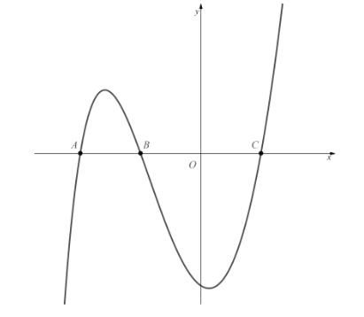
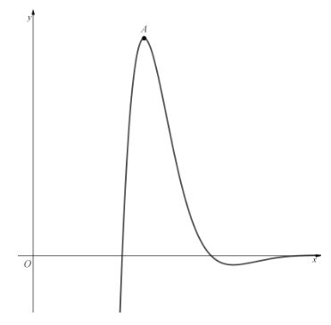
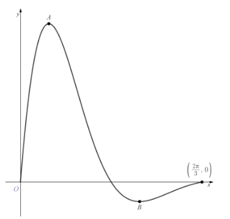

# Exam Questions — Further Differentiation
**Differentiation** · Edexcel International A Level (IAL) Maths (YMA01) — Pure 3
> Source: [https://www.savemyexams.com/international-a-level/maths/edexcel/20/pure-3/topic-questions/differentiation/further-differentiation/exam-questions/](https://www.savemyexams.com/international-a-level/maths/edexcel/20/pure-3/topic-questions/differentiation/further-differentiation/exam-questions/) · 28 questions · total 148 marks

## Q1 — easy — 5 marks · exam-questions

### 1() — 2 marks — structured
A curve has the equation $y=5e^{-2x}$.

Find an expression for  $\frac{dy}{dx}$.

### 2() — 3 marks — structured
(i) Find the gradient of the tangent at the point where $x=1$, giving your answer in the form $-ae^{-2}$ where a is a positive integer to be found.

(ii) Hence show that the gradient of the normal to the curve at the point where $x=1$ is $\frac{1}{10}e^{2}$.

## Q2 — easy — 4 marks · exam-questions

### 1() — 4 marks — structured
Find  $\frac{dy}{dx}$for

(i) `y equals sin space open parentheses 3 x squared close parentheses`,

(ii) `y equals 2 ln space open parentheses x cubed close parentheses` .

## Q3 — easy — 4 marks · exam-questions

### 1() — 4 marks — structured
The curve with equation  $y=e^{x^{2}-9}$  passes through the point with coordinates (-3 , 1).

(i) Find an expression for  $\frac{dy}{dx}$.

(ii) Find the equation of the tangent to the curve at the point (-3 , 1).

## Q4 — easy — 6 marks · exam-questions

### 1() — 3 marks — structured
Differentiate  $(x^{3}-2x)\mathrm{ln}x$with respect to *x*.

### 2() — 3 marks — structured
Differentiate  $e^{x}\mathrm{cos}2x$ with respect to *x*.

## Q5 — easy — 6 marks · exam-questions

### 1() — 3 marks — structured
Differentiate  $\frac{\mathrm{cos}x}{\mathrm{sin}x}$   with respect to *x*

### 2() — 3 marks — structured
Differentiate  $\frac{2x^{2}-3x+4}{\mathrm{sin}3x}$ with respect to $x$.

## Q6 — easy — 2 marks · exam-questions

### 1() — 2 marks — structured
Write down  $\frac{dy}{dx}$  when

(i) $y=\mathrm{sec}5x,$

(ii) $y=\mathrm{cosec}3x.$

## Q7 — easy — 12 marks · exam-questions

### 1() — 4 marks — structured
The function $f(x)$  is defined as

`straight f open parentheses x close parentheses equals open parentheses x squared minus 4 x plus 4 close parentheses ln open parentheses space x close parentheses space comma space space space space space space x greater than 0`

Show that the graph of `space y equals straight f open parentheses x close parentheses`  intercepts the *x*-axis at the points (1 , 0) and (2 , 0).

### 2() — 4 marks — structured
Find `space straight f apostrophe open parentheses x close parentheses`.

### 3() — 2 marks — structured
Find the gradient of the tangent at the point (1 , 0).

### 4() — 2 marks — structured
Hence find the equation of the tangent at the point (1 , 0), giving your answer in the form  $ax+by+c=0$, where *a, b* and *c* are integers to be found.

## Q8 — medium — 4 marks · exam-questions

### 1() — 4 marks — structured
A curve has the equation  $y=e^{-3x}+\mathrm{ln}x,x>0.$

Find the gradient of the normal to the curve at the point `open parentheses 1 comma space e to the power of negative 3 end exponent close parentheses`, giving your answer correct to 3 decimal places.

## Q9 — medium — 7 marks · exam-questions

### 1() — 4 marks — structured
Find  $\frac{dy}{dx}$  for each of the following:

`y equals cos open parentheses space x squared minus 3 x plus 7 close parentheses plus sin space open parentheses e to the power of x close parentheses space`

### 2() — 3 marks — structured
Find $\frac{dy}{dx}$  for each of the following:

`y equals ln space open parentheses 2 x cubed close parentheses space`

## Q10 — medium — 4 marks · exam-questions

### 1() — 4 marks — structured
Find the equation of the tangent to the curve  $y=e^{3x^{2}+5x-2}$  at the point `open parentheses negative 2 comma space space 1 close parentheses`, giving your answer in the form$ax+by+c=0$, where *a, b* and *c* are integers.

## Q11 — medium — 6 marks · exam-questions

### 1() — 3 marks — structured
Differentiate with respect to *x*, simplifying your answers as far as possible:

`open parentheses 4 cos space x space minus 3 sin space x close parentheses space e to the power of 3 x space minus space 5 space end exponent`

### 2() — 3 marks — structured
`open parentheses x cubed minus 4 x squared plus 7 close parentheses ln space x`

## Q12 — medium — 4 marks · exam-questions

### 1() — 4 marks — structured
Differentiate  $\frac{5x^{7}}{\mathrm{sin}2x}$ with respect to *x*.

## Q13 — medium — 6 marks · exam-questions

### 1() — 5 marks — structured
Show that if  $y=\mathrm{cosec}2x$ , then

$\frac{dy}{dx}=-2\mathrm{cosec}2x\mathrm{cot}2x$

### 2() — 1 mark — structured
Hence find the gradient of the tangent to the curve `space y equals cosec open parentheses 2 x close parentheses space` at the point with coordinates `open parentheses pi over 3 comma fraction numerator 2 square root of 3 over denominator 3 end fraction close parentheses`.

## Q14 — medium — 9 marks · exam-questions

### 1() — 4 marks — structured
The diagram below shows part of the graph of  `y equals straight f open parentheses x close parentheses`, where`space straight f open parentheses x close parentheses space`is the function defined by

`straight f open parentheses x close parentheses equals open parentheses x squared minus 1 close parentheses ln open parentheses x plus 3 close parentheses comma space space space space space x greater than negative 3`

Points *A, B* and *C* are the three places where the graph intercepts the *x*-axis.

Find `straight f apostrophe open parentheses x close parentheses`.

### 2() — 2 marks — structured
Show that the coordinates of point *A* are (-2, 0).

### 3() — 3 marks — structured
Find the equation of the tangent to the curve at point *A*.

## Q15 — hard — 6 marks · exam-questions

### 1() — 6 marks — structured
A curve has the equation  $y=e^{-3x}+\mathrm{ln}x,x>0.$

Show that the equation of the tangent to the curve at the point with *x*-coordinate 1 is

`y equals open parentheses fraction numerator e cubed minus 3 over denominator e cubed end fraction close parentheses x plus fraction numerator 4 minus e cubed over denominator e cubed end fraction`

## Q16 — hard — 3 marks · exam-questions

### 1() — 3 marks — structured
For `space y equals ln space open parentheses a x to the power of n space close parentheses` , where $a>0$ is a real number and $n\geq1$is an integer, show that

$\frac{dy}{dx}=\frac{n}{x}$

## Q17 — hard — 4 marks · exam-questions

### 1() — 4 marks — structured
Find the gradient of the normal to the curve $y=5\mathrm{cos}(e^{x}-\frac{π}{2})$at the point with *x*-coordinate 0.  Give your answer correct to 3 decimal places.

## Q18 — hard — 6 marks · exam-questions

### 1() — 3 marks — structured
Differentiate with respect to* x*, simplifying your answers as far as possible:

`open parentheses 2 sin space 3 x space minus cos space 3 x close parentheses space e to the power of 6 minus x space end exponent`

### 2() — 3 marks — structured
`open parentheses x squared minus x close parentheses squared ln space 5 x`

## Q19 — hard — 3 marks · exam-questions

### 1() — 3 marks — structured
By writing  `y equals fraction numerator space straight f open parentheses x close parentheses over denominator straight g open parentheses x close parentheses end fraction`  as `space y equals straight f open parentheses x close parentheses open square brackets straight g open parentheses straight x close parentheses close square brackets to the power of negative 1 space end exponent` and then using the product and chain rules, show that

`fraction numerator d y over denominator d x end fraction equals fraction numerator straight g open parentheses x close parentheses straight f apostrophe open parentheses x close parentheses minus straight f open parentheses x close parentheses straight g apostrophe open parentheses x close parentheses over denominator open parentheses g open parentheses x close parentheses close parentheses squared end fraction`

## Q20 — hard — 6 marks · exam-questions

### 1() — 2 marks — structured
Given that $x=\mathrm{sec}7y$ ,

Find  $\frac{dy}{dx}$  in terms of *y*

### 2() — 4 marks — structured
Hence find $\frac{dy}{dx}$ in terms of *x*.

## Q21 — hard — 5 marks · exam-questions

### 1() — 5 marks — structured
The diagram below shows part of the graph of `space y equals straight f open parentheses x close parentheses`, where `space straight f open parentheses x close parentheses space`is the function defined by

`straight f open parentheses x close parentheses equals fraction numerator sin space x over denominator 1 minus e to the power of x end fraction space comma space   x greater than 0`

Point *A* is a maximum point on the graph.

Show that the *x*-coordinate of *A* is a solution to the equation

`fraction numerator cos space x space plus e to the power of x open parentheses sin space x minus cos space x close parentheses over denominator space e to the power of 2 x end exponent minus 2 e to the power of x plus 1 end fraction space equals 0`

## Q22 — very_hard — 4 marks · exam-questions

### 1() — 4 marks — structured
A curve has the equation $y=3^{x}+2^{-x}$.

Show that the gradient of the normal to the curve at the point  `open parentheses 1 comma space fraction numerator space 7 over denominator 2 end fraction close parentheses space` is

$\frac{2}{\mathrm{ln}2-6\mathrm{ln}3}$

## Q23 — very_hard — 4 marks · exam-questions

### 1() — 4 marks — structured
Find the derivative of the function `space straight f open parentheses x close parentheses equals sin space open parentheses cos space open parentheses ln space 1 over x close parentheses close parentheses space comma space space x greater than 0.`

## Q24 — very_hard — 6 marks · exam-questions

### 1() — 4 marks — structured
Show that the derivative  $y=4^{-x^{4}}$  is

`fraction numerator d y over denominator d x end fraction equals negative open parentheses ln space 4 close parentheses space x cubed 4 to the power of 1 minus x to the power of 4 end exponent`

### 2() — 2 marks — structured
Hence find the equation of the tangent to the curve at the point `open parentheses 1 comma 1 fourth close parentheses`, giving your answer in the form $y=ax+b$, where *a* and *b* are to be given as exact values.

## Q25 — very_hard — 6 marks · exam-questions

### 1() — 3 marks — structured
Differentiate with respect to *x*, simplifying your answers where possible:

`open parentheses 5 plus sin to the power of 2 space end exponent 3 x close parentheses space e to the power of x squared minus 3 x plus 2 end exponent`

### 2() — 3 marks — structured
`3 to the power of square root of x end exponent open parentheses square root of x minus fraction numerator 1 over denominator square root of x end fraction close parentheses`

## Q26 — very_hard — 6 marks · exam-questions

### 1() — 6 marks — structured
The diagram below shows the graph of `y equals straight f open parentheses x close parentheses`, where `straight f open parentheses x close parentheses` is the function defined by

`space straight f open parentheses x close parentheses equals fraction numerator sin space 3 x over denominator e to the power of 2 x minus 3 end exponent end fraction space comma space   space space space space space space space space space 0 less or equal than x less or equal than fraction numerator 2 pi over denominator 3 end fraction`

The points *A *and *B* are maximum and minimum points, respectively.

Find the difference between the *y*-values of the coordinates of *A *and *B*, giving your answer correct to 3 decimal places.

## Q27 — very_hard — 5 marks · exam-questions

### 1() — 5 marks — structured
*A* is the point on the graph of  $y=\mathrm{arctan}x$such that the tangent to the graph at $A$ passes through the point `open parentheses 0 comma space space 1 half close parentheses`.  Show that the *x*-coordinate of *A* satisfies the equation

`x minus tan space open parentheses fraction numerator open parentheses 1 plus x close parentheses squared over denominator 2 open parentheses 1 plus x squared close parentheses space end fraction close parentheses equals 0`

## Q28 — very_hard — 5 marks · exam-questions

### 1() — 5 marks — structured
A sequence of functions is defined by the recurrence relation

`u subscript k plus 1 end subscript open parentheses x close parentheses equals fraction numerator straight d over denominator straight d x end fraction u subscript k open parentheses x close parentheses comma space space space u subscript 1 open parentheses x close parentheses equals sin space open parentheses x square root of 2 close parentheses`

Based on that sequence, the function`space straight f subscript n open parentheses x close parentheses space`is defined by

`straight f subscript n open parentheses x close parentheses equals sum from r equals 1 to n of u subscript r open parentheses x close parentheses`

Calculate the value of `space straight f subscript 41 space open parentheses fraction numerator straight pi square root of 2 over denominator 4 end fraction close parentheses`
