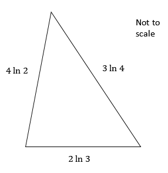

# Exam Questions — Exponential & Logarithms
**Exponentials & Logarithms** · Edexcel International A Level (IAL) Maths (YMA01) — Pure 3
> Source: [https://www.savemyexams.com/international-a-level/maths/edexcel/20/pure-3/topic-questions/exponentials-and-logarithms/exponential-and-logarithms/exam-questions/](https://www.savemyexams.com/international-a-level/maths/edexcel/20/pure-3/topic-questions/exponentials-and-logarithms/exponential-and-logarithms/exam-questions/) · 52 questions · total 216 marks

## Q1 — easy — 3 marks · exam-questions

### 1() — 3 marks — structured
Sketch the graph with equation $y=a^{x},a>1$, stating the coordinates of the point where the graph intersects the $y$-axis and the equation of any asymptotes.

Also state whether this equation would represent exponential growth or decay.

## Q2 — easy — 3 marks · exam-questions

### 1() — 3 marks — structured
The following equations can be used for exponential models.

State whether each one would represent exponential growth or exponential decay.

(i)    $y=3^{-2x}$

(ii)    `y equals 20 open parentheses 2 close parentheses to the power of x`

(iii)   $y=30a^{-x}$ where $a>0$

## Q3 — easy — 3 marks · exam-questions

### 1() — 3 marks — structured
Sketch the graph of $y=e^{x}$, clearly showing the coordinates of the point where the graph intercepts the $y$-axis and stating the equations of any asymptotes.

## Q4 — easy — 2 marks · exam-questions

### 1() — 2 marks — structured
Given $y=e^{2x}$:

(i)      Write down an expression for $\frac{dy}{dx}$.

(ii)      Find the gradient of $y=e^{2x}$ at the point where $x=0$.

## Q5 — easy — 3 marks · exam-questions

### 1() — 3 marks — structured
Solve the equation $e^{2x}-16=0$, giving your answer in the form $a\mathrm{ln}a$ where $a$ is an integer.

## Q6 — easy — 4 marks · exam-questions

### 1() — 4 marks — structured
Write the following in the form $a+b\mathrm{In}2,$ where $a$ and $b$ are integers to be found.

(i) $3^{2}+\mathrm{In}4$

(ii) $\mathrm{In}e^{7}+\mathrm{In}8$

(iii) $\mathrm{log}1000+3\mathrm{In}16$

(iv) `5 open parentheses 3 squared plus space In space 64 close parentheses`

## Q7 — easy — 4 marks · exam-questions

### 1() — 4 marks — structured
Solve the following equations, giving your answer in exact form.

(i)     $e^{2x}=5$

(ii)   $3e^{\frac{1}{3}x}=27$

## Q8 — easy — 2 marks · exam-questions

### 1() — 2 marks — structured
A square has side length $3\mathrm{In}4$.

Show that the perimeter of the square is $24\mathrm{In}2$.

## Q9 — easy — 3 marks · exam-questions

### 1() — 3 marks — structured
Write the following in the form $a\mathrm{In}b$, where $a$ and $b$ are integers to be found.

$4\mathrm{In}9+2\mathrm{In}81-3\mathrm{In}27$

## Q10 — easy — 4 marks · exam-questions

### 1() — 4 marks — structured
Write down the value of

(i) $\mathrm{log}_{3}^{3}$

(ii) $\mathrm{In}e^{6}$

(iii) $\mathrm{log}_{a}^{1}$

(iv) $\mathrm{log}1000$

## Q11 — easy — 3 marks · exam-questions

### 1() — 1 mark — structured
Express 42 as a product of its prime factors.

### 2() — 2 marks — structured
Hence, or otherwise, show that

$\mathrm{In}42=\mathrm{In}7+\mathrm{In}3+\mathrm{In}2.$

## Q12 — easy — 2 marks · exam-questions

### 1() — 2 marks — structured
Sketch the graph of $y=e^{x},$ marking clearly the coordinates of any points where the graph intersects the coordinate axes ans stating the equation of any asymptotes.

## Q13 — medium — 4 marks · exam-questions

### 1() — 3 marks — structured
Sketch the graph of $y=2^{-x}$, stating whether this graph indicates exponential growth or exponential decay.

### 2() — 1 mark — structured
Find the exact value of $y$when $x=3$.

## Q14 — medium — 4 marks · exam-questions

### 1() — 4 marks — structured
Write down the value of $a$ in the following statements.

(i) $\mathrm{log}_{a}8=3$

(ii) $\mathrm{log}_{a}=2$

(iii) $\mathrm{ln}e^{3}=a$

(iv) $\mathrm{log}_{5}a=1$

## Q15 — medium — 5 marks · exam-questions

### 1() — 4 marks — structured
On the same axes, sketch the graphs of $y=e^{x}$ and $y=e^{-x}$. Label any points where the graphs intersect the coordinate axes.

Write down the equations of any asymptotes.

### 2() — 1 mark — structured
Write down the gradient of $y=e^{x}$ at the point `open parentheses 0 comma 1 close parentheses`.

## Q16 — medium — 5 marks · exam-questions

### 1() — 1 mark — structured
Given $y=e^{4x}$ write down an expression for $\frac{dy}{dx}$.

### 2() — 1 mark — structured
Given $y=2e^{2x}$ write down an expression for $\frac{dy}{dx}$.

### 3() — 3 marks — structured
Find the gradient $y=3e^{-2x}$ of at the point where $x=3$. Give your answer in the form $pe^{q}$, where $p$ and $q$ are integers to be found.

## Q17 — medium — 4 marks · exam-questions

### 1() — 2 marks — structured
(i) Write down the gradient of $y=e^{-3x}$.

(ii) Find the gradient of $y=e^{-3x}$ at the point where $x=0$.

### 2() — 2 marks — structured
(i)   In terms of $e$, write down the gradient of $y=e^{-3x}$ at the point where $x=2$.

(ii)  Find the value for $x$ for which the gradient of $y=e^{-3x}$ is $-3e^{-12}$.

## Q18 — medium — 5 marks · exam-questions

### 1() — 3 marks — structured
The function `straight f open parentheses x close parentheses` is defined by `straight f open parentheses x close parentheses`$=2e^{3x}$ for $x\inℝ$

(i) Find `straight f open parentheses negative x close parentheses`.

(ii) On the same axes, sketch the graphs of `y equals straight f open parentheses x close parentheses` and `y equals straight f open parentheses negative x close parentheses`.

Label any points where the graphs intersect the coordinate axes.

### 2() — 2 marks — structured
Describe the transformation from `y equals straight f open parentheses x close parentheses` to `y equals negative straight f open parentheses x close parentheses`.

## Q19 — medium — 3 marks · exam-questions

### 1() — 3 marks — structured
Solve $e^{2x}-8e^{x}+15=0$, giving your answers to 3 significant figures.

## Q20 — medium — 5 marks · exam-questions

### 1() — 2 marks — structured
Evaluate

$\mathrm{log}_{2}4+\mathrm{log}_{3}27-\mathrm{log}_{4}4$

### 2() — 3 marks — structured
Evaluate

$3\mathrm{In}2+\frac{1}{2}\mathrm{In}81-2\mathrm{In}3,$

giving your answer in the form $\mathrm{In}q$ where $q$ is an integer to be found.

## Q21 — medium — 8 marks · exam-questions

### 1() — 2 marks — structured
Solve the following equations, giving your answers in exact form.

$e^{x}=5$

### 2() — 3 marks — structured
$3e^{2x}=9$

### 3() — 3 marks — structured
$e^{2x-1}=4$

## Q22 — medium — 6 marks · exam-questions

### 1() — 3 marks — structured
Write the following as a single algorithm

$2\mathrm{log}_{a}6+3\mathrm{log}_{a}2-\mathrm{log}_{a}4$

### 2() — 3 marks — structured
Write the following in the form $a\mathrm{In}b,$ where $a$ and $b$ are integers to be found.

$2\mathrm{In}3^{4}+\mathrm{In}3^{3}-\mathrm{In}9$

## Q23 — medium — 4 marks · exam-questions

### 1() — 4 marks — structured
The diagram below shows the length of three sides of a triangle, with each side measured in centimetres.

Work out the perimeter of the triangle, giving your answer in the form 2$\mathrm{ln}b$, where $b$ is an integer to be found.

## Q24 — medium — 3 marks · exam-questions

### 1() — 3 marks — structured
Show that

$2\mathrm{In}x^{3}-3\mathrm{In}x^{2}=0.$

## Q25 — medium — 5 marks · exam-questions

### 1() — 5 marks — structured
(i) On the same axes, sketch the graphs of $y=e^{x}$ and $y=e^{-x}$.

Label any points of intersection between each graph and the coordinates axes.

Write down the equations of any asymptotes.

(ii) Write down the equation of the line of reflection between the graphs of $y=e^{x}$ and $y=e^{-x}$.

## Q26 — hard — 4 marks · exam-questions

### 1() — 3 marks — structured
(i) Sketch the graph of $y=0.4^{x}$.

(ii) State whether this graph indicates exponential growth or exponential decay.

### 2() — 1 mark — structured
Find the value of $x$ when $y=0.064$.

## Q27 — hard — 4 marks · exam-questions

### 1() — 3 marks — structured
Sketch the graph of $y=12e^{-x}$ for $x\geq0$. Label any points of intersection with the coordinate axes. Write down the equations of any asymptotes.

### 2() — 1 mark — structured
Write down the gradient of $y=12e^{-x}$ at the point where $x=0$.

## Q28 — hard — 4 marks · exam-questions

### 1() — 2 marks — structured
The function `straight f open parentheses x close parentheses` is defined by `straight f open parentheses x close parentheses equals 3 straight e to the power of 2 straight x end exponent` for $x\inℝ$.

Find `straight f open parentheses italic 2 x close parentheses`.

### 2() — 2 marks — structured
Find `straight f apostrophe open parentheses italic 2 x close parentheses`.

## Q29 — hard — 3 marks · exam-questions

### 1() — 3 marks — structured
Solve $2e^{2x}=e^{x}+10$, giving your answer to 3 significant figures.

## Q30 — hard — 4 marks · exam-questions

### 1() — 1 mark — structured
Find the gradient of the curve $y=ae^{bx}$,  where and $a$ and $b$ are constants.

### 2() — 2 marks — structured
At the point `open parentheses 0 comma a close parentheses` the gradient is 12, find $b$in terms of $a$.

### 3() — 1 mark — structured
Hence write down y in terms of $a$ (and $x$) only.

## Q31 — hard — 5 marks · exam-questions

### 1() — 3 marks — structured
Show that the equation $e^{x}-e^{-x}=0$ has only one real solution.

### 2() — 2 marks — structured
Explain why the equation $e^{x}+e^{-x}=0$ has no real solutions.

## Q32 — hard — 5 marks · exam-questions

### 1() — 2 marks — structured
Evaluate

$\mathrm{log}_{2}8^{2}+3\mathrm{log}_{2}16-2\mathrm{log}_{2}2^{5}.$

### 2() — 3 marks — structured
Evaluate

$3\mathrm{In}2+2\mathrm{In}5-\frac{1}{2}\mathrm{In}10000,$

giving your answer in the form $\mathrm{In}p.$

## Q33 — hard — 5 marks · exam-questions

### 1() — 2 marks — structured
Solve the following equations, giving your answers in exact form.

$4e^{3x-2}=12$

### 2() — 3 marks — structured
$3e^{2x}+8=14e^{x}$

## Q34 — hard — 4 marks · exam-questions

### 1() — 2 marks — structured
Simplify

$2\mathrm{In}3^{4}+\mathrm{In}3^{3}-\mathrm{In}9,$

giving your answer in the form $a\mathrm{In}b$, where $a$ and $b$ are integers to be found.

### 2() — 2 marks — structured
Write

`2 log subscript a x space plus space 3 space log subscript a open parentheses x plus 1 close parentheses space minus space log subscript a space 4 open parentheses x plus 2 close parentheses`

as a single algorithm.

## Q35 — hard — 5 marks · exam-questions

### 1() — 5 marks — structured
(i) On the same axes, sketch the graphs of $y=e^{x}$ and $y=\mathrm{In}x.$

On each graph, label any points where the graph intersects the coordinate axes.

Write down the equations of any asymptotes for each graph.

(ii) Write down the line of reflection between the graphs $y=e^{x}$ and $y=\mathrm{In}x.$

## Q36 — hard — 5 marks · exam-questions

### 1() — 5 marks — structured
Solve the equations

$6\times3^{x-1}=6^{2x},$

giving your answer in the form $\frac{\mathrm{In}a}{\mathrm{In}b'}$ where $a$ and $b$ are integers to be found.

## Q37 — hard — 4 marks · exam-questions

### 1() — 4 marks — structured
A ship sets from a harbour.

After some time, the ship's position is `open parentheses 4 In space 3 close parentheses` $\mathrm{km}$ east of the harbour and `open parentheses 3 In space 3 close parentheses` $\mathrm{km}$ north of the harbour.

Find the direct distance between the ship and the harbour at this time giving your answer in the form `open parentheses p In space 3 close parentheses space km`.

## Q38 — hard — 3 marks · exam-questions

### 1() — 3 marks — structured
By writing $5$ as $5\mathrm{In}e,$ show that

$5\mathrm{In}2+5$

can be written as $5\mathrm{In}2e$.

## Q39 — very_hard — 4 marks · exam-questions

### 1() — 3 marks — structured
Sketch the graph of $y=0.2^{-x}$, stating whether this graph indicates exponential growth or exponential decay.

### 2() — 1 mark — structured
Find the value of $x$ when $y=625$.

## Q40 — very_hard — 4 marks · exam-questions

### 1() — 2 marks — structured
Without using a calculator, evaluate $\mathrm{log}_{4}128$. Show each stage of your solution carefully.

### 2() — 2 marks — structured
Evaluate $\frac{3\mathrm{log}_{6}216-\mathrm{ln}e^{5}+4^{\mathrm{log}_{5}625}}{\mathrm{log}10000}$.

## Q41 — very_hard — 5 marks · exam-questions

### 1() — 3 marks — structured
Sketch the graph of $y=4e^{x}$ for $x\geq0$.

Label any points of intersection with the coordinate axes. Write down the equations of any asymptotes.

### 2() — 1 mark — structured
Find the gradient of $y=4e^{x}$ at the point where $x=3$, giving your answer correct to 3 significant figures.

### 3() — 1 mark — structured
The population growth of population, $P$, at time, *t *years*,* is modelled by the equation .

$P=4e^{t}$. 
Write down the initial population.

## Q42 — very_hard — 4 marks · exam-questions

### 1() — 2 marks — structured
The function `straight f open parentheses x close parentheses` is defined by `straight f open parentheses x close parentheses`$=5e^{3x}$ for $x\inℝ$.

Find `straight f open parentheses 4 x close parentheses`.

### 2() — 2 marks — structured
Find `straight f apostrophe open parentheses 5 x close parentheses`.

## Q43 — very_hard — 4 marks · exam-questions

### 1() — 1 mark — structured
Find the gradient of the curve $y=\frac{1}{a}e^{-bx}$ where $a$ and $b$ are constants.

### 2() — 1 mark — structured
State a condition on $b$ to ensure $y$represents exponential decay.

### 3() — 2 marks — structured
At the point `open parentheses 0 comma a close parentheses` the gradient is 10. Find $y$ in terms of $a$ (and $x$) only.

## Q44 — very_hard — 7 marks · exam-questions

### 1() — 1 mark — structured
A particle is travelling with velocity, $v$ ms-1, at time $t$ seconds. 
The velocity of the particle is modelled $v=0.3e^{kt}$, where $k$ is a constant.

Write down the initial velocity of the particle.

### 2() — 2 marks — structured
Find an expression (in terms of $k$ and $t$) for the acceleration of the particle.

### 3() — 3 marks — structured
After 12 seconds the velocity of the particle is 0.9 ms-1. Find the value of $k$, giving your answer to 3 significant figures.

### 4() — 1 mark — structured
State a problem with the model for large values of $t$

## Q45 — very_hard — 4 marks · exam-questions

### 1() — 4 marks — structured
Solve `open parentheses e to the power of x minus e to the power of negative x end exponent close parentheses squared equals 0`.

## Q46 — very_hard — 5 marks · exam-questions

### 1() — 5 marks — structured
Solve the equation $2e^{3x}-11e^{2x}+12e^{x}=0$, giving answers to 3 significant figures where appropriate.

## Q47 — very_hard — 5 marks · exam-questions

### 1() — 2 marks — structured
Evaluate

$4\mathrm{log}_{3}729+3\mathrm{log}_{2}64^{2}-3\mathrm{log}100+\mathrm{In}e^{6}$

### 2() — 3 marks — structured
Evaluate

$\frac{1}{2}\mathrm{In}196+\frac{1}{3}\mathrm{In}125+\frac{1}{4}\mathrm{In}81+\frac{1}{5}\mathrm{In}32$

giving your answer in the form $\mathrm{In}q$.

## Q48 — very_hard — 6 marks · exam-questions

### 1() — 3 marks — structured
Solve the following equations, giving your answers correct to 3 significant figures.

$8e^{3x^{2-1}}=12$

### 2() — 3 marks — structured
`e to the power of 3 x end exponent minus 42 space equals space 2 e to the power of x open parentheses 6 e to the power of x space end exponent minus 7 close parentheses`

## Q49 — very_hard — 5 marks · exam-questions

### 1() — 5 marks — structured
On the same axes, sketch the graphs of $y=e^{2x}$ and $y=\frac{1}{2}\mathrm{In}x.$

On each graph, label any point where intersects the coordinate axes.

Write down the equations of any asymptotes for each graph.

Explain the significance of the line $y=x.$

## Q50 — very_hard — 3 marks · exam-questions

### 1() — 3 marks — structured
Show that $4-\mathrm{In}16$ can be written in the form $4\mathrm{In}$($\frac{e}{2}$).

## Q51 — very_hard — 5 marks · exam-questions

### 1() — 5 marks — structured
A triangle is drawn inside a circle such that one side of the triangle is the diameter and all three vertices of the triangle lie on the circumference.

The radius of the circle is `open parentheses 3 space In space 2 close parentheses space cm`.

The two smallest angles in the triangle are $α$ and $β$ respectively where  $β=2α$.

Find all three sides of the triangle, giving your answers in the form $a\mathrm{In}2.$

## Q52 — very_hard — 3 marks · exam-questions

### 1() — 3 marks — structured
How many real solutions does the equations have? Justify your answer.

`3 space log subscript x open parentheses x plus 1 close parentheses equals space In space e cubed`
