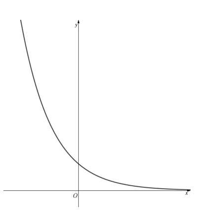
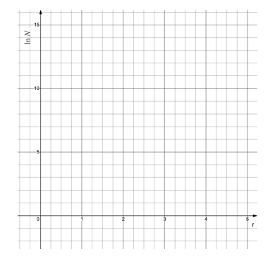
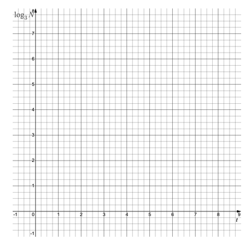
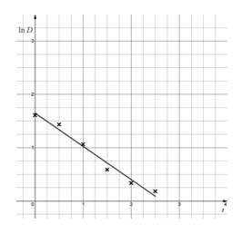
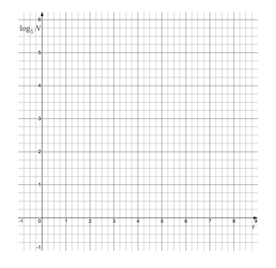
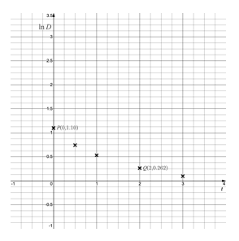
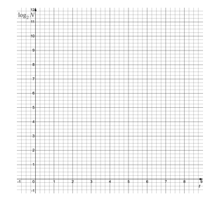
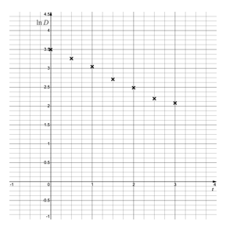

# Exam Questions — Modelling with Exponentials & Logarithms
**Exponentials & Logarithms** · Edexcel International A Level (IAL) Maths (YMA01) — Pure 3
> Source: [https://www.savemyexams.com/international-a-level/maths/edexcel/20/pure-3/topic-questions/exponentials-and-logarithms/modelling-with-exponentials-and-logarithms/exam-questions/](https://www.savemyexams.com/international-a-level/maths/edexcel/20/pure-3/topic-questions/exponentials-and-logarithms/modelling-with-exponentials-and-logarithms/exam-questions/) · 42 questions · total 208 marks

## Q1 — easy — 4 marks · exam-questions

### 1() — 4 marks — structured
State whether the following functions could represent exponential growth or exponential decay.

(i) `straight f open parentheses x close parentheses equals 5 straight e to the power of 2 x end exponent`

(ii) `straight f open parentheses straight t close parentheses equals 100 straight e to the power of negative straight t end exponent`

(iii) `straight f open parentheses straight a close parentheses equals 20 straight e to the power of negative ka end exponent space comma space space straight k greater than 0`

(iv) `straight f open parentheses straight t close parentheses equals Ae to the power of kt space comma space space straight A comma straight k greater than 0`

## Q2 — easy — 3 marks · exam-questions

### 1() — 3 marks — structured
Write the following in the form ,$e^{kx}$ where $k$ is a constant and $k>0$.

(i) $e^{3x}\timese^{2x}$

(ii) $5^{x}$

(iii) $2^{x}$

## Q3 — easy — 3 marks · exam-questions

### 1() — 3 marks — structured
Write the following in the form $e^{-kx}$, where $k$ is a constant and $k>0$.

(i) $\frac{e^{-2x}}{e^{4x}}$

(ii) `open parentheses 1 fifth close parentheses to the power of x`

(iii) `open parentheses 1 half close parentheses to the power of x`

## Q4 — easy — 3 marks · exam-questions

### 1() — 3 marks — structured
The diagram below shows a sketch of the graph of $y=e^{-x}$.

On the diagram, add the graph of $y=e^{-2x}$ labelling the point at which the graph intersects the $y$-axis.

Write down the equation of any asymptotes on the graph.

## Q5 — easy — 7 marks · exam-questions

### 1() — 3 marks — structured
By taking logarithms (base $e$) of both sides show that the equation

$y=Ae^{kx}$

can be written in the form $\mathrm{ln}y=kx+\mathrm{ln}A$

### 2() — 4 marks — structured
Hence ...

(i) write the equation $y=2e^{0.01x}$ in the form $\mathrm{ln}y=kx+\mathrm{ln}A$.

(ii) write the equation $\mathrm{ln}y=0.3x+\mathrm{In}5$ in the form $y=Ae^{kx}$.

## Q6 — easy — 5 marks · exam-questions

### 1() — 1 mark — structured
In an effort to prevent extinction scientists released 24 rare birds into a newly constructed nature reserve.

The population of birds, within the reserve, is modelled by

$B=Ae^{0.4t}$

$B$ is the number of birds after $t$ years of being released into the reserve.

$A$ is a constant.

Write down the value of $A$.

### 2() — 2 marks — structured
According to this model, how many birds will be in the reserve after 2 years?

### 3() — 2 marks — structured
How many years after release will it take for the population of birds to double?

## Q7 — easy — 6 marks · exam-questions

### 1() — 1 mark — structured
A simple model for the acceleration of a rocket, $A\mathrm{ms}^{-2}$, is given as

$A=10e^{0.1t}$

where $t$ is the time in seconds after lift-off.

What is the meaning of the value 10 in the model?

### 2() — 2 marks — structured
Find the acceleration of the rocket 15 seconds after lift-off.

### 3() — 3 marks — structured
Find how long it takes for the acceleration to reach $100\mathrm{ms}^{-2}$.

## Q8 — easy — 5 marks · exam-questions

### 1() — 1 mark — structured
An exponential growth model for the number of bacteria in an experiment is of the form $N=Ae^{kt}$

$N$ is the number of bacteria and $t$ is the time in hours since the experiment began.

$A$ are $k$ constants.

A scientist records the number of bacteria every hour for 3 hours.

The results are shown in the table below.

| $t$,hours | 0 | 1 | 2 | 3 | 4 |
|---|---|---|---|---|---|
| $N$, no. of bacteria | 100 | 210 | 320 | 730 | 1580 |
| $\mathrm{ln}N$ (3SF) | 4.61 | 5.35 | 5.77 | 6.59 | 7.37 |

Plot the observations on the graph below - plotting $\mathrm{ln}N$ against $t$.

### 2() — 2 marks — structured
Using the points (0, 4.61) and (4, 7.37), find an equation for a line of best fit in the form $\mathrm{ln}N=mt+\mathrm{ln}c$, where $m$and $c$ are constants to be found.

### 3() — 2 marks — structured
Hence estimate the values of $A$ and $k$.

## Q9 — medium — 3 marks · exam-questions

### 1() — 1 mark — structured
Write `open parentheses begin inline style 1 third end style close parentheses to the power of x`  in the form  $e^{kx}$.

### 2() — 2 marks — structured
Write `open parentheses begin inline style 2 over 7 end style close parentheses to the power of t`  in the form  $e^{kt}$. 
State whether this would represent exponential growth or exponential decay.

## Q10 — medium — 3 marks · exam-questions

### 1() — 1 mark — structured
Write `open parentheses begin inline style 7 over 10 end style close parentheses to the power of x`  in the form  $e^{-kx}$.

### 2() — 2 marks — structured
Sketch the graph of `y equals open parentheses begin inline style 7 over 10 end style close parentheses to the power of x`.

State the coordinates of the $y$-axis intercept.

Write down the equation of the asymptote.

## Q11 — medium — 3 marks · exam-questions

### 1() — 1 mark — structured
By taking logarithms (base $e$) of both sides show that the equation

$y=5e^{0.1x}$

can be written as

$\mathrm{ln}y=0.1x+\mathrm{ln}5$

### 2() — 2 marks — structured
Given  $y=Ae^{kx}$  and  $\mathrm{ln}y=4.1x+\mathrm{ln}8$, find the values of $A$ and $k$.

## Q12 — medium — 3 marks · exam-questions

### 1() — 1 mark — structured
By taking logarithms (base 10) of both sides show that the equation

$y=2x^{3.2}$

can be written as

$\mathrm{log}y=3.2\mathrm{log}x+\mathrm{log}2$

### 2() — 2 marks — structured
Given  $y=Ax^{b}$ and  $\mathrm{log}y=1.8\mathrm{log}x+\mathrm{log}5$, find the values of $A$ and $b$.

## Q13 — medium — 3 marks · exam-questions

### 1() — 1 mark — structured
By taking logarithms (base 2) of both sides show that the equation

$y=3\times2^{4x}$

can be written as

$\mathrm{log}_{2}y=4x+\mathrm{log}_{2}3$

### 2() — 2 marks — structured
Given $y=Ab^{kx}$  and $\mathrm{log}_{3}y=5x+\mathrm{log}_{3}7$ , find the values of $A,b$ and $k$.

## Q14 — medium — 5 marks · exam-questions

### 1() — 1 mark — structured
In an effort to prevent extinction scientists released some rare birds into a newly constructed nature reserve.

The population of birds, within the reserve, is modelled by

$B=16e^{0.85t}$

$B$ is the number of birds after $t$ years of being released into the reserve.

Write down the number of birds the scientists released into the nature reserve.

### 2() — 2 marks — structured
According to this model, how many birds will be in the reserve after 3 years?

### 3() — 2 marks — structured
How long will it take for the population of birds within the reserve to reach 500?

## Q15 — medium — 5 marks · exam-questions

### 1() — 1 mark — structured
A simple model for the acceleration of a rocket,$Ams^{-2}$ , is given as

$A=A_{0}e^{0.2t}$

where $t$ is the time in seconds after lift-off.  $A_{0}$ is a constant.

What does the constant $A_{0}$ represent?

### 2() — 2 marks — structured
After 10 seconds, the acceleration is $20ms^{-2}$. Find the value of $A_{0}$.

### 3() — 2 marks — structured
Find how long it takes for the acceleration of the rocket to reach $100\mathrm{ms}^{-2}$

## Q16 — medium — 7 marks · exam-questions

### 1() — 1 mark — structured
Carbon-14 is a radioactive isotope of the element carbon. Carbon-14 decays exponentially – as it decays it loses mass. Carbon-14 is used in carbon dating to estimate the age of objects.

The time it takes the mass of carbon-14 to halve (called its half-life) is approximately 5700 years.

A model for the mass of carbon-14, m g, in an object of age $t$ years is

$m=m_{0}e^{-kt}$

where $m_{0}$ and $k$ are constants.

For an object initially containing 100g of carbon-14, write down the value of $m_{0}$.

### 2() — 2 marks — structured
Briefly explain why, if $m_{0}=100$,$m$  will equal $50$g  when $t=5700$ years.

### 3() — 2 marks — structured
Using the values from part (b), show that the value of $k$is $1.22\times10^{-4}$ to three significant figures.

### 4() — 2 marks — structured
A different object currently contains 60g of carbon-14. In 2000 years’ time how much carbon-14 will remain in the object?

## Q17 — medium — 5 marks · exam-questions

### 1() — 1 mark — structured
An exponential growth model for the number of bacteria in an experiment is of the form $N=N_{0}a^{kt}$. $N$ is the number of bacteria and $t$ is the time in hours since the experiment began.$N_{0},$ $a$ and $k$ are constants.  A scientist records the number of bacteria at various points over a six-hour period.  The results are shown in the table below.

| $t$, hours | 0 | 2 | 4 | 6 |
|---|---|---|---|---|
| $N$, no. of bacteria | 100 | 180 | 340 | 620 |
| $\mathrm{log}_{3}N$ (3SF) | 4.19 | 4.73 | 5.31 | 5.85 |

Plot the observations on the graph below - plotting $\mathrm{log}_{3}N$ against $t$.

### 2() — 2 marks — structured
Using the points (0, 4.19) and (6, 5.85), find an equation for a line of best fit in the form $\mathrm{log}_{3}N=mt+\mathrm{log}_{3}c$, where $m$and $c$ are constants to be found.

### 3() — 2 marks — structured
The equation $N=N_{0}a^{kt}$  can be written in the form  $\mathrm{log}_{a}N=kt+\mathrm{log}_{a}N_{0}$. 
Use your answer to part (b) to estimate the values of , $N_{0},a$, and $k$.

## Q18 — medium — 8 marks · exam-questions

### 1() — 2 marks — structured
An exponential model of the form  $D=Ae^{-kt}$  is used to model the amount of a pain-relieving drug (D mg/ml) there is in a patient’s bloodstream, $t$ hours after the drug was administered by injection. $A$  and $k$ are constants.

The graph below shows values of $\mathrm{In}$ $D$ plotted against $t$ with a line of best fit drawn.

(i)        Use the graph and line of best fit to estimate $\mathrm{ln}D$ at time $t=0$.

(ii)       Work out the gradient of the line of best fit.

### 2() — 1 mark — structured
Use your answers to part (a) to write down an equation for the line of best fit in the form $\mathrm{ln}D=mt+\mathrm{ln}c$,  where $m$ and $c$ are constants.

### 3() — 1 mark — structured
Show that $D=Ae^{-kt}$ can be rearranged to give $\mathrm{ln}D=-kt+\mathrm{ln}A$

### 4() — 2 marks — structured
Hence find estimates for the constants $A$and $k$.

### 5() — 2 marks — structured
Find the time when the amount of the pain-relieving drug in the patient’s bloodstream is 1.5 mg/ml.

## Q19 — medium — 8 marks · exam-questions

### 1() — 2 marks — structured
A small company makes a profit of £2500 in its first year of business and £3700 in the second year.  The company decides they will use the model

$P=P_{0}y^{k}$

to predict future years’ profits.

`£`$P$ is the profit in the $y^{th}$ year of business.

$P_{0}$ and $k$ are constants.

Write down two equations connecting $P_{0}$ and $k$.

### 2() — 2 marks — structured
Find the values of $P_{0}$ and $k$.

### 3() — 2 marks — structured
Find the predicted profit for years 3 and 4.

### 4() — 2 marks — structured
Show that

$P=P_{0}y^{k}$

can be written in the form

$\mathrm{log}P=\mathrm{log}P_{0}+k\mathrm{log}y$

## Q20 — hard — 4 marks · exam-questions

### 1() — 2 marks — structured
Write  `open parentheses 3 over 5 close parentheses to the power of x` in the form $e^{kx}$ , giving the value of $k$ to three significant figures.

### 2() — 2 marks — structured
Write `open parentheses begin inline style 4 over 7 end style close parentheses to the power of 3 t end exponent`  in the form $e^{kt}$ , giving the value of $k$ to three significant figures. 
State, and justify, whether this would represent exponential growth or decay.

## Q21 — hard — 4 marks · exam-questions

### 1() — 2 marks — structured
Write `open parentheses 0.7 close parentheses to the power of x plus 1 end exponent`  in the form  $Ae^{-kx}$.

### 2() — 2 marks — structured
Sketch the graph of `y equals open parentheses 0.7 close parentheses to the power of x plus 1 end exponent minus 3`. State the coordinates of the $y$-axis intercept. 
Write down the equation of the asymptote.

## Q22 — hard — 4 marks · exam-questions

### 1() — 2 marks — structured
Show that the equation

$x=7e^{-0.2t}$

can be written as

$\mathrm{ln}x=\mathrm{ln}7-0.2t$

### 2() — 2 marks — structured
Rewrite the equation $\mathrm{ln}y=4.1x+\mathrm{ln}8$ in the form  $y=Ae^{kx}$.

## Q23 — hard — 4 marks · exam-questions

### 1() — 2 marks — structured
Show that the equation

$y=2x^{\frac{3}{4}}$

can be written as

$\mathrm{log}y=0.75\mathrm{log}x+\mathrm{log}2$

### 2() — 2 marks — structured
Rewrite the equation $\mathrm{log}y=4.7\mathrm{log}x+\mathrm{log}12$ in the form  $y=Ax^{b}$.

## Q24 — hard — 4 marks · exam-questions

### 1() — 2 marks — structured
Show that the equation

$y=0.1\times2^{0.01x}$

can be written as

$\mathrm{log}_{2}y=0.01x-\mathrm{log}_{2}10$

### 2() — 2 marks — structured
Rewrite the equation $\mathrm{log}_{3}y=6.3x+\mathrm{log}_{3}4$ in the form  $y=Ab^{kx}$.

## Q25 — hard — 6 marks · exam-questions

### 1() — 1 mark — structured
Scientists introduced a small number of rare breed deer to a large wildlife sanctuary.

The population of deer, within the sanctuary, is modelled by

$D=20e^{0.1t}$

$D$ is the number of deer after $t$ years of first being introduced to the sanctuary.

Write down the number of deer the scientists introduced to the sanctuary.

### 2() — 2 marks — structured
How many years does it take for the deer population to double?

### 3() — 1 mark — structured
Give one criticism of the model for population growth.

### 4() — 2 marks — structured
The scientists suggest that the population of deer are separated after either 25 years or when their population exceeds 400.
Find the earliest time the deer should be separated.

## Q26 — hard — 6 marks · exam-questions

### 1() — 2 marks — structured
A simple model for the acceleration of a rocket,$A\mathrm{ms}^{-2}$ , is given as

$A=5e^{kt}$

where $t$ is the time in seconds after lift-off. $k$  is a constant.

After 4 seconds the acceleration of the rocket is $10\mathrm{ms}^{-2}$. Find the value of $k$.

### 2() — 2 marks — structured
Find the time at which the acceleration of the rocket has increased by 200%.

### 3() — 2 marks — structured
Sketch the graph of the acceleration of the rocket, against time, stating the coordinates of the point that shows the initial acceleration of the rocket.

## Q27 — hard — 6 marks · exam-questions

### 1() — 2 marks — structured
Carbon-14 is a radioactive isotope of the element carbon. Carbon-14 decays exponentially – as it decays it loses mass. Carbon-14 is used in carbon dating to estimate the age of objects.

The time it takes the mass of carbon-14 to halve (called its half-life) is approximately 5700 years

A model for the mass of carbon-14, $y$ g, in an object originally containing 100 g, at time $t$ years is

$y=100e^{-kt}$

where $k$ is a constant.

Find the value of $k$, giving your answer to three significant figures.

### 2() — 2 marks — structured
The object is considered as having no radioactivity once the mass of carbon-14 it contains falls below 0.5 g. Find out how old the object would have to be, to be considered non-radioactive.

### 3() — 2 marks — structured
A different object currently contains 25g of carbon-14. In 500 years’ time how much carbon-14 will remain in the object?

## Q28 — hard — 6 marks · exam-questions

### 1() — 2 marks — structured
An exponential growth model for the number of bacteria in an experiment is of the form

$N=N_{0}a^{kt}$

$N$ is the number of bacteria and $t$ is the time in hours since the experiment began. $N_{0},a$ and $k$ are constants.

A scientist records the number of bacteria at various points over a six-hour period. The results are in the table below.

| $t$, hours | 0 | 2 | 4 | 6 |
|---|---|---|---|---|
| $N$, no. of bacteria | 200 | 350 | 600 | 1100 |

Plot the observations on the graph below - plotting $\mathrm{log}_{5}N$ against $t$. Draw a line of best fit.

### 2() — 2 marks — structured
Find an equation for your line of best fit in the form $\mathrm{log}_{5}N=mt+\mathrm{log}_{5}c$.

### 3() — 2 marks — structured
Estimate the values of ,$N_{0}$ ,$a$ and $k$.

## Q29 — hard — 6 marks · exam-questions

### 1() — 2 marks — structured
An exponential model of the form

$D=Ae^{-kt}$

is used to model the amount of a pain-relieving drug (D mg/ml) there is in a patient’s bloodstream, $t$ hours after the drug was administered by injection.  $A$ and $k$ are constants.

The graph below shows values of $\mathrm{ln}D$ plotted against $t$

Using the points marked $P$ and $Q$, find an equation for the line of best fit, giving your answer in the form $\mathrm{ln}D=mt+\mathrm{ln}c$, where $m$ and $c$ are constants to be found.

### 2() — 2 marks — structured
Hence find estimates for the constants $A$ and $k$

### 3() — 2 marks — structured
The patient is allowed a second injection of the drug once the amount of drug in the bloodstream falls below 1% of the initial dose. Find, to the nearest minute, how long until the patient is allowed a second injection of the drug.

## Q30 — hard — 5 marks · exam-questions

### 1() — 2 marks — structured
The annual profits, in thousands of pounds, of a small company in the first 4 years of business are given in the table below.

| $a,$years in business | 1 | 2 | 3 | 4 |
|---|---|---|---|---|
| $P$,annual profit | £3100 | £4384 | £5369 | £6200 |

Using this data the company uses the model

$P=P_{1}a^{k}$

to predict future years’ profits. $P_{1}$  and $k$ are constants.

Use data from the table to find the values of $P_{1}$ and $k$.

### 2() — 2 marks — structured
Show that $\mathrm{log}P=k\mathrm{log}a+\mathrm{log}P_{1}$, where $P_{1}$ and $k$ take the values found in part (a).

### 3() — 1 mark — structured
State a potential problem with using the model to predict the profit in the company’s 12th year of business.

## Q31 — very_hard — 5 marks · exam-questions

### 1() — 1 mark — structured
Write  `open parentheses 0.8 close parentheses to the power of x` in the form $e^{kx}$ , giving the value of $k$ to three significant figures.

### 2() — 4 marks — structured
(i) Write  `open parentheses begin inline style 2 over 3 end style close parentheses to the power of 4 t plus 1 end exponent`  in the form  $Ae^{kt}$, giving the values of $A$ and $k$ to three significant figures where necessary.

(ii) State, and justify, whether this would represent exponential growth or decay.

(iii) Write down the initial value of $Ae^{kt}$.

## Q32 — very_hard — 4 marks · exam-questions

### 1() — 4 marks — structured
Sketch the graph of  `y equals open parentheses 3 over 5 close parentheses to the power of 2 x plus 1 end exponent minus 4`.

State the coordinates of any points where the graph intercepts the coordinate axes.

Write down the equations of any asymptotes.

## Q33 — very_hard — 4 marks · exam-questions

### 1() — 2 marks — structured
Rewrite the equation $\mathrm{ln}x=2t+\mathrm{ln}6$ in the form  $x=Ae^{kt}$.

### 2() — 2 marks — structured
Sketch the graph of $\mathrm{ln}=2t+\mathrm{ln}6$ by plotting  $\mathrm{ln}x$  against $t$.

## Q34 — very_hard — 4 marks · exam-questions

### 1() — 2 marks — structured
Rewrite the equation  $y=3.6x^{-0.4}$  in the form $\mathrm{log}y=\mathrm{log}A-b\mathrm{log}x$

### 2() — 2 marks — structured
Sketch the graph of $\mathrm{log}y$ against  $\mathrm{log}x$.

## Q35 — very_hard — 5 marks · exam-questions

### 1() — 3 marks — structured
Rewrite the equation $y=\frac{2}{3}\times5^{-0.2x}$  in the form $\mathrm{log}_{b}y=\mathrm{log}_{b}p-qx$  where $b$ is an integer and $p$ and $q$ are rational numbers.

### 2() — 2 marks — structured
Sketch the graph of $\mathrm{log}_{b}y$ against $x$.

## Q36 — very_hard — 6 marks · exam-questions

### 1() — 2 marks — structured
Scientists introduced a small number of apes into a previously unpopulated forest.

The population of apes in the forest is modelled by

$A=16e^{km}$

where $A$ is the number of apes after $m$ months of first being introduced to the forest.

State, with a reason, whether you would expect the value of $k$ to be positive or negative.

### 2() — 2 marks — structured
After 8 months, the number of apes in the forest has increased by 50%. 
Find the value of $k$.

### 3() — 2 marks — structured
Scientists believe the forest cannot sustain a population of apes greater than 3000. 
What length of time is the model for the population of the apes reliable for?

## Q37 — very_hard — 7 marks · exam-questions

### 1() — 4 marks — structured
A manufacturer claims their flask will keep a hot drink warm for up to 7 hours.

In this sense, warm is considered to be $50^{\circ}C$ or higher.

Assuming a hot drink is made at $85^{\circ}C$ and its temperature inside the flask is $50^{\circ}C$ after exactly 7 hours, find:

(i) a linear model for the temperature of the drink inside the flask of the form $T=a+bt$, and

(ii) an exponential model for the temperature of the drink inside the flask of the form $T=Ae^{-kt}$

where $T^{\circ}C$ is the temperature of the drink in the flask after $t$ hours and $a,b,A$and $k$ are constants.

### 2() — 2 marks — structured
Compare the rate of change of the temperature of the drink inside the flask of both models after 3 hours.

### 3() — 1 mark — structured
A user of the flask suggests that hot drinks are only kept warm for 5 hours.
Suggest a reason why the user’s experience may not be up to the claims of the manufacturer.

## Q38 — very_hard — 6 marks · exam-questions

### 1() — 2 marks — structured
A simple model for the acceleration of a rocket, $A\mathrm{ms}^{-1}$, is given as

$A=Re^{kt}$

where $t$ is the time in seconds after lift-off.  $R$ and k are constants.

Negative time is often used in rocket launches as a way of counting down until lift off. Despite this the model above is still not suitable for use with negative  $t$values Briefly explain why.

### 2() — 3 marks — structured
After 5 seconds the acceleration of the rocket is $12\mathrm{ms}^{-2}$ and after 20 seconds its acceleration is $50\mathrm{ms}^{-2}$.  Find the values of $R$and $k$.

### 3() — 1 mark — structured
A space enthusiast suggests that a linear model (of the form $A=R+ct$) would be more suitable. Using the figures in (b), explain why the enthusiast’s model is unrealistic.

## Q39 — very_hard — 9 marks · exam-questions

### 1() — 1 mark — structured
Carbon-14 is a radioactive isotope of the element carbon. Carbon-14 decays exponentially – as it decays it loses mass. Carbon-14 is used in carbon dating to estimate the age of objects.

The time it takes carbon-14 to halve (called its half-life) is approximately 5700 years.

A model for the mass of carbon-14, $m$ g, in an object, at time $t$ years is

$m=M_{0}e^{-kt}$

where $M_{0}$and $k$ are constants.

Briefly explain the meaning of the constant $M_{0}$.

### 2() — 3 marks — structured
Find the value of $k$, giving your answer in the form $\frac{\mathrm{ln}a}{b}$, where $a$and $b$ are integers to be found.

### 3() — 2 marks — structured
An object currently contains 200 g of carbon-14. In 20 000 years’ time, how much carbon-14, to the nearest gram, remains in the object?

### 4() — 3 marks — structured
The half-life of carbon-14 is believed to only be accurate to ±40 years.
A fossilised bone currently contains $3\times10^{-6}$ g of carbon-14.
It is estimated the bone would have originally contained $1\times10^{-2}$ g of carbon-14.

Find upper and lower estimates for the age of the bone, giving your answers to two significant figures.

## Q40 — very_hard — 5 marks · exam-questions

### 1() — 3 marks — structured
An exponential growth model for the number of bacteria in an experiment is of the form

$N=N_{0}a^{kt}$

$N$ is the number of bacteria and $t$ is the time in hours since the experiment began. $N_{0},a$ and $k$  are constants.

A scientist records the number of bacteria at various points over a six-hour period. The results are in the table below.

| $t$, hours | 0 | 1.5 | 3 | 4.5 | 6 |
|---|---|---|---|---|---|
| $N$, no. of bacteria | 120 | 190 | 360 | 680 | 1230 |

By plotting $\mathrm{log}_{2}N$ against $t$, drawing a line of best fit and finding its equation, estimate the values of $N_{0}$,$a$ , and $k$.

### 2() — 2 marks — structured
What does the model predict for the value of $N$ after twelve hours? 
Comment on the reliability of this prediction.

## Q41 — very_hard — 5 marks · exam-questions

### 1() — 3 marks — structured
An exponential model of the form

$D=Ae^{-kt}$

is used to model the concentration of a pain-relieving drug (D mg/ml) in a patient’s bloodstream $t$ hours after the drug was administered by injection.  $A$ and $k$ are constants.

The graph below shows values of $\mathrm{ln}D$ plotted against $t$

Find estimates for the constants $A$and $k$.

### 2() — 2 marks — structured
Find the time, to the nearest minute, at which the rate of decrease of the concentration of the drug in the patient’s bloodstream is 12 mg/ml/hour.

## Q42 — very_hard — 4 marks · exam-questions

### 1() — 3 marks — structured
The annual profits, in thousands of pounds, of a small company in the first 4 years of business are given in the table below.

| $a$, years in business | 1 | 2 | 3 | 4 |
|---|---|---|---|---|
| $\mathrm{log}P$( `£ P space`is annual profit) | 3.74 | 3.86 | 3.94 | 4.01 |

Using this data the company uses the model

$P=P_{1}a^{k}$

to predict future years’ profits. $P_{1}$  and $k$ are constants.

Use the results in the table to estimate the values of $P_{1}$and $k$.

### 2() — 1 mark — structured
Many new companies make a loss in their first year of business. 
Briefly explain why, in such circumstances, a model of the form used above would not be suitable.
