# Exam Questions — Numerical Methods
**Numerical Methods** · Edexcel International A Level (IAL) Maths (YMA01) — Pure 3
> Source: [https://www.savemyexams.com/international-a-level/maths/edexcel/20/pure-3/topic-questions/numerical-methods/numerical-methods/exam-questions/](https://www.savemyexams.com/international-a-level/maths/edexcel/20/pure-3/topic-questions/numerical-methods/numerical-methods/exam-questions/) · 29 questions · total 157 marks

## Q1 — easy — 5 marks · exam-questions

### 1() — 2 marks — structured
The diagram below shows part of the graph$y=f(x)$ where $f(x)=2x^{2}-2x^{3}+3$.

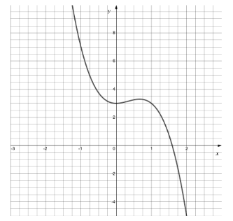

(i) Find `straight f open parentheses 1.5 close parentheses`

(ii) Find$f(1.6)$

### 2() — 3 marks — structured
Write down an interval, in the form $a<α<b$, such that `straight f open parentheses alpha close parentheses equals 0`, explain clearly your choice of values for *a* and b.

## Q2 — easy — 3 marks · exam-questions

### 1() — 3 marks — structured
A solution to the equation `straight f open parentheses x close parentheses equals 0` is $x=3.1$, correct to two significant figures.

(i) Write down the lower bound, *l,* and the upper bound, *u*, of 3.1.

(ii) Assuming $f(x)$ is continuous in the interval $l<x<u$, what can you say about the values of $f(u)$ and `straight f open parentheses l space close parentheses`?

## Q3 — easy — 5 marks · exam-questions

### 1() — 2 marks — structured
Show that the equation $x^{3}-5x=2$can be rewritten as

$x=\frac{1}{5}(x^{3}-2).$

### 2() — 3 marks — structured
Starting with $x_{0}=1$, use the iterative formula

`x subscript n plus 1 end subscript equals 1 fifth open parentheses space x subscript n superscript 3 minus 2 close parentheses`

to find values for $x_{1},x_{2}$ and $x_{3}$, giving each to four decimal places where appropriate.

## Q4 — easy — 3 marks · exam-questions

### 1() — 3 marks — structured
The graph of`space y equals straight f space open parentheses theta close parentheses` where $f(θ)=\mathrm{sec}θ$ is shown below. *θ* is measured in radians and -$π\leqθ\leqπ.$

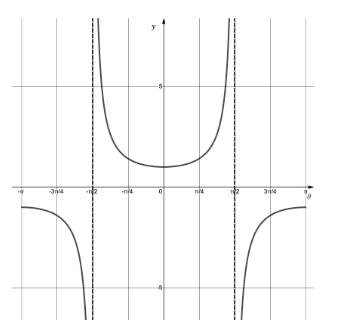

Given that $\mathrm{sec}θ=\frac{1}{\mathrm{cos}θ}$ .

(i) Find $f(1.5)$ and $f(1.6)$.

(ii) Explain how, in this case, the change of sign rule fails to locate a root of $f(θ)$ in the interval (1.5 , 1.6).

## Q5 — easy — 3 marks · exam-questions

### 1() — 3 marks — structured
A student is trying to find a solution to the equation `straight f open parentheses x close parentheses equals 0 space`using an iterative formula.

The student rearranges `straight f open parentheses x close parentheses equals 0 space` into the form $x=g(x)$.

The diagram below shows a sketch of the graphs of $y=g(x)$ and $y=x$.

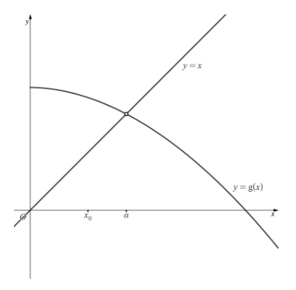

The student is trying to find the root $α$, starting with an initial estimate $x_{0}$.
Show on the diagram, how the iterative formula will converge and find the root $α$.
Mark the $x$-axis with the positions of $x_{1}$ and $x_{2}$.

## Q6 — easy — 6 marks · exam-questions

### 1() — 3 marks — structured
A bypass is to be built around a village.
On the graph below the road through the village is modelled by the line  $y=x.$The bypass is modelled by the equation  $y=\sqrt{\frac{40x}{x+1}}$.

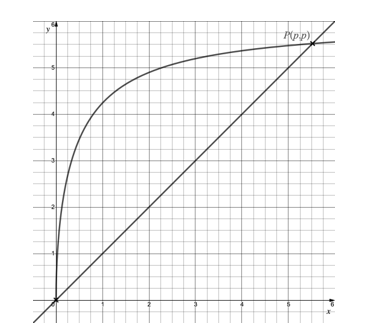

The bypass runs from the origin to the point $P(p,p).$

Use the iterative formula $x_{n+1}=\sqrt{\frac{40x_{n}}{x_{n}+1}}$  with $x_{0}=5$ to find the value of $p$, correct to three significant figures.

### 2() — 3 marks — structured
(i) Calculate $f(5.835)$ and $f(5.845)$ where $f(x)=x-\sqrt{\frac{40x}{x+1}}$  .

(ii) Hence use the sign change rule to show your answer to part (a) is correct to three significant figures.

## Q7 — easy — 4 marks · exam-questions

### 1() — 4 marks — structured
The game of Tanball is played on a flat table.

A player rolls a ball from a fixed point, at any angle, with the aim of it coming to rest in the winning zone.

A particular player decides to roll the ball at an angle of  $\frac{π}{4}$ radians. 
This is illustrated by the graph below with the ball being rolled from the origin and the shaded area being the winning zone.

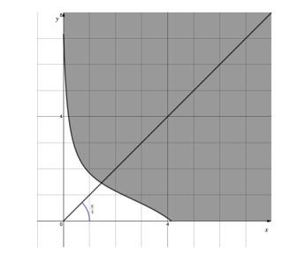

The boundary of the winning zone is given by part of the curve with equation

`y equals 1 minus tan open parentheses square root of 3 open parentheses x plus 1 close parentheses end root close parentheses.`

(i) Using the iterative formula $x_{n+1}=1-\mathrm{tan}(\sqrt{3(x_{n}+1)}),$ with initial starting value $x_{0}=1.5$, find the estimates $x_{1},x_{2}$ and $x_{3}$, writing each to five decimal places.

(ii) Continue using the iterative feature on your calculator to find the value of $x$ correct to three significant figures.

(iii) Write down the $y$-coordinate of the point where this player’s ball should cross the winning boundary, give your answer to three significant figures.

## Q8 — easy — 9 marks · exam-questions

### 1() — 2 marks — structured
According to legend, unicorn tears can heal an injury almost instantly.

If a unicorn tear is applied to a burn of initialize size $B\mathrm{mm}^{2}$ on human skin it will heal according to the model

`b open parentheses t close parentheses space equals space B minus t cubed space plus square root of t space space space space space space space space space space space space space space space space t greater or equal than 0`

where $b$ is the area of the burn, in square millimeters, at time $t$ seconds after the unicorn tear has been applied.

Show that the equation `straight b open parentheses t close parentheses equals 0` can be written as

`t equals cube root of B space plus square root of t end root.`

### 2() — 4 marks — structured
Use the iterative formula `t subscript n plus 1 end subscript space equals cube root of 40 space plus square root of t subscript n end root end root comma` with initial value $t_{0}=3$, to find how many seconds it takes a burn of size $40\mathrm{mm}^{2}$ to heal once a unicorn tear is applied .

Give your final answer to three significant figures.

### 3() — 3 marks — structured
An alternative iterative formula is `t subscript n plus 1 space end subscript equals open parentheses t subscript n superscript space 3 end superscript minus B close parentheses squared`,

(i) Using $t_{0}=3$, find $t_{1,}t_{2}\mathrm{and}t_{3}$, for the same initial burn size as part (b), giving each to three significant figures.

(ii) Explain how you can deduce whether this sequence of estimates is converging or diverging.

## Q9 — medium — 6 marks · exam-questions

### 1() — 3 marks — structured
The diagram below shows part of the graph $y=f(x)$where $f(x)=2x\mathrm{cos}(3x)-1.$

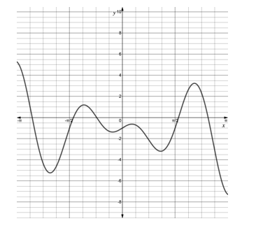

(i) Find `straight f open parentheses 1.6 close parentheses` and `straight f open parentheses 1.7 close parentheses`, giving your answers to three significant figures.

(ii) Briefly explain the significance of your results from part (i).

### 2() — 3 marks — structured
One of the solutions to the equation `straight f open parentheses x close parentheses equals 0` is $x=2.55$, correct to three significant figures.

(i) Write down the upper and lower bound of 2.55.

(ii) Hence, use the sign change rule to confirm that this is a solution (to three significant figures) to the equation `straight f open parentheses x close parentheses equals 0`.

## Q10 — medium — 5 marks · exam-questions

### 1() — 2 marks — structured
Show that the equation  $x^{3}+3=5x$ can be rewritten as

`x equals cube root of 5 x minus 3 end root`

### 2() — 3 marks — structured
Starting with $x_{0}=1.8$, use the iterative formula

`x subscript n plus 1 end subscript equals cube root of 5 x subscript n minus 3 end root`

to find a root of the equation $x^{3}+3=5x$, correct to two decimal places.

## Q11 — medium — 2 marks · exam-questions

### 1() — 2 marks — structured
Part of the graph of $y=\mathrm{tan}θ$ is shown below, where $θ$ is measured in radians.

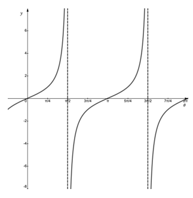

Explain why the change of sign rule would fail if attempting to locate a root of the function `space straight f open parentheses straight theta close parentheses equals tan space straight theta` using the values of θ = 1.55 and θ = 1.65.

## Q12 — medium — 7 marks · exam-questions

### 1() — 1 mark — structured
The diagram below shows the graphs of $y=x_{}$ and `space y equals ln space open parentheses x minus 1 close parentheses plus 3 space`.

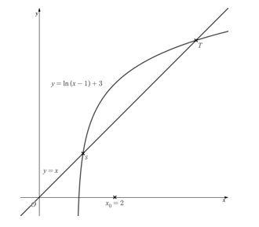

The iterative formula

`x subscript n plus 1 end subscript equals ln open parentheses space x subscript n minus 1 close parentheses plus 3`

is to be used to find an estimate for a root, $α$, of the function$f(x)$.

Write down an expression for $f(x)$.

### 2() — 2 marks — structured
Using an initial estimate, $x_{0}=2$, show, by adding to the diagram above, which of the two points (*S* or *T*) the sequence of estimates $x_{1},x_{2},x_{3},\dots$ will converge to. 
Hence deduce whether $α$  is the $x$-coordinate of point *S* or point *T*.

### 3() — 2 marks — structured
Find the estimates $x_{1},x_{2},x_{3}$ and $x_{4}$, giving each to three decimal places.

### 4() — 2 marks — structured
Confirm that $α=4.146$ correct to three decimal places.

## Q13 — medium — 6 marks · exam-questions

### 1() — 1 mark — structured
The village of Greendale lies on a straight road, as modelled by the line $y=x$on the graph below.  To ease rush hour congestion, a bypass is to be built around Greendale. The path of the bypass is modelled by the equation $y=6\sqrt{1-\frac{1}{x+1}}$.

The bypass runs from the origin to the point $P(p,p)$.

On the diagram show how using the iterative formula $x_{n+1}=6\sqrt{1-\frac{1}{x_{n}+1}}$ with $0<x_{0}<p$ will lead to convergence at the point  *P*.

### 2() — 3 marks — structured
Use the iterative method  $x_{n+1}=6\sqrt{1-\frac{1}{x_{n}+1}}$ with $x_{0}=5$ to find the value of $p$, correct to two decimal places.

### 3() — 2 marks — structured
Use the sign change rule with the function $f(x)=x-6\sqrt{1-\frac{1}{x+1}}$ to show your answer to part (b) is correct to two decimal places.

## Q14 — medium — 5 marks · exam-questions

### 1() — 3 marks — structured
The game of Curveball is played on a flat table.

A player rolls a ball from a fixed point, at any angle, with the aim of it coming to rest in the winning zone.

A particular player decides to roll the ball at an angle of 45°. This is illustrated by the graph below with the ball being rolled from the origin and the shaded area being the winning zone.

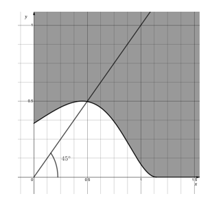

The boundary of the winning zone is given by part of the curve with equation

`y equals 1 half sin squared open parentheses e to the power of x close parentheses.`

Use the iterative formula $x_{n+1}=\frac{1}{2}\mathrm{sin}^{2}(e^{x})$, taking all angles in radians, with initial starting value $x_{0}=0.5$, to show that the $x$-coordinate of the point where this player’s ball should cross the winning zone boundary is 0.497 to three significant figures.

### 2() — 2 marks — structured
Use your answer to part (a) to find the minimum distance the ball should travel for this player to win Curveball.

## Q15 — medium — 7 marks · exam-questions

### 1() — 2 marks — structured
According to legend, a unicorn can heal an injury almost instantly by touching it with its horn.

When a unicorn touches a cut in human skin of length $L\mathrm{mm}$, it will heal according to the model

`straight f open parentheses t close parentheses equals L e to the power of negative t end exponent space minus space t space space space space space space space space space space space space space space space space space space t space greater or equal than 0`

where $f$ is the length of the cut in millimeters, at time $t$ seconds after the unicorn has touched the injury with its horn.

(i) Write down the value $f$ would be when the cut is completely healed.

(ii) Show that, for a cut in human skin of length $5\mathrm{mm}$ the equation `straight f open parentheses t close parentheses equals 0` can be rearranged into the form

`t equals negative In open parentheses t over 5 close parentheses`

### 2() — 4 marks — structured
Use the iterative formula  `t subscript n plus 1 end subscript equals negative In open parentheses t subscript n over 5 close parentheses`, with initial value $t_{0}=1,$ to find how many seconds it takes a cut of size $5\mathrm{mm}$ to heal once a unicorn has touched it with its horn.

(i) Write down the values of the estimates $t_{1},t_{2}\mathrm{and}t_{3}$ to four decimal places.

(ii) Give your final answer to two significant figures.

(iii) State the number of iterations required for convergence to two significant figures.

### 3() — 1 mark — structured
Briefly explain why the model should also restrict the range of `straight f open parentheses t close parentheses` to be greater than or equal to zero?

## Q16 — hard — 6 marks · exam-questions

### 1() — 2 marks — structured
The diagram below shows part of the function $y=f(x)$ where$f(x)=3x^{2}\mathrm{sin}^{2}x-2$.

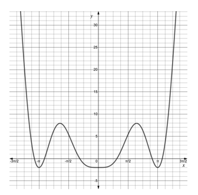

Correct to three significant figures, `straight f open parentheses 0.9 close parentheses equals negative 0.509` and$f(3.4)=0.265$. 
Explain why using the sign change rule with these values would not necessarily be helpful in finding the root close to $x=0.98$.

### 2() — 2 marks — structured
Using suitable values of *x*, show that there is a root close to $x=0.98$.

### 3() — 2 marks — structured
Show that the root close to $x=0.98$is 0.982, correct to three significant figures.

## Q17 — hard — 7 marks · exam-questions

### 1() — 2 marks — structured
The diagram below shows a sketch of the graphs $y=x$, and  `y equals cube root of 3 x squared plus 2 x minus 1 end root`.

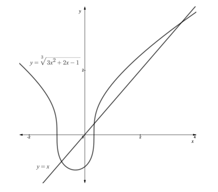

An iterative formula is used to find roots to the equation $x^{3}-3x^{2}-2x+1=0$.

On the diagram above show that the iterative formula

`x subscript n plus 1 end subscript equals cube root of 3 x subscript n squared plus 2 x subscript n minus 1 space end root`

would converge to the root close to $x=3.5$when using a starting value of $x_{0}=0.5$.

### 2() — 2 marks — structured
(i) Use $x_{0}=0.5$ in the iterative formula from part (a) to find three further approximations to the root close to$x=3.5$.  
Give each approximation correct to three significant figures.

(ii) Comment on your approximations and what they suggest about convergence to the root close to $x=3.5$.

### 3() — 3 marks — structured
Confirm that the root close to $x=3.5$is 3.49 correct to three significant figures.

## Q18 — hard — 3 marks · exam-questions

### 1() — 3 marks — structured
The diagrams below show the graphs of four different functions.

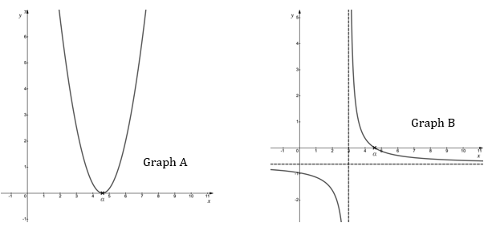

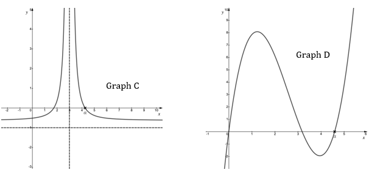

Match each graph above with the correct statement below.

1. The sign change rule with values of $x=2$ and $x=4$ would indicate a root but has failed due to the discontinuity (asymptote) at $x=3$.
2. The sign change rule with values of $x=1$ and $x=5$would indicate no root but has failed because there are two roots in the interval (1 , 5).
3. The sign change rule with values of$x=3$ and $x=5$ would indicate no root but fail as there are two roots in the interval (3 , 5).
4. The sign change rule with values of $x=3$ and $x=5$ would indicate no root but has failed to find the root as the graph has a turning point at $x=α$.

## Q19 — hard — 7 marks · exam-questions

### 1() — 2 marks — structured
The diagram below shows the graphs of$y=x$ and $y=g(x)$.

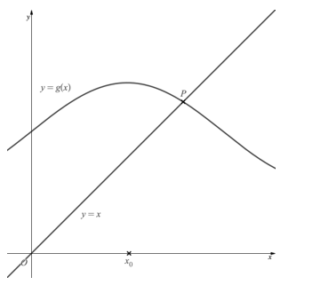

Show on the diagram, using the value of $x_{0}$ indicated, how an iterative process will lead to a sequence of estimates that converge to the *x*-coordinate of the point *P*. Mark the estimates $x_{1}$and $x_{2}$ on your diagram.

### 2() — 3 marks — structured
By finding a suitable iterative formula, use $x_{0}=2$ to estimate a root to the equation$x-\mathrm{sin}0.8x=2.5$ correct to two significant figures.

### 3() — 2 marks — structured
Confirm that your answer to part (b) is correct to two significant figures.

## Q20 — hard — 6 marks · exam-questions

### 1() — 1 mark — structured
The village of Crinkley Bottom lies on a straight road, as modelled by the line $y=x$ on the graph below.  Rush hour traffic causes much air pollution in the village so to improve the air quality around Crinkley Bottom a bypass is to be built. 
The path of the bypass is modelled by part of the equation $y=x^{2}\mathrm{sin}x$.

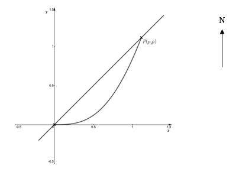

The bypass is to be built with a roundabout south of the village at the origin and a northern roundabout which re-joins the road through Crinkley Bottom at the point $P(p,p)$.

On the diagram show how using the iterative formula $x_{n+1}=x_{n}^{2}\mathrm{sin}x$

with $0<x_{0}<p$ will lead to convergence at the southern roundabout

### 2() — 3 marks — structured
Use the alternative iterative method

$x_{n+1}=\sqrt{\frac{x}{\mathrm{sin}x}}$

with $x_{0}=1,$ to find the position of the roundabout at $P$ to four significant figures.

### 3() — 2 marks — structured
Verify that your answer to part (b) is correct to four significant figures.

## Q21 — hard — 6 marks · exam-questions

### 1() — 3 marks — structured
The game of Logball is played on a flat table.

A player rolls a ball from a fixed point, at any angle, with the aim of it coming to rest within a winning zone.

A particular player decides to roll the ball at an angle of 45°, as illustrated in the graph below, with the ball being rolled from the origin and the shaded area being the winning zone.

The lower boundary of the winning zone has equation  $y=3-\mathrm{ln}(x+1)^{2}$,  $x,y\geq0$

The upper boundary of the winning zone has equation `y equals 4 minus ln open parentheses x plus 1 close parentheses squared`  ,  $x,y\geq0$

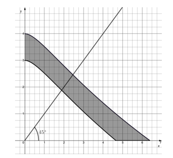

Using an appropriate iterative formula with initial value $x_{0}=1.8,$, find the minimum distance this player’s ball needs to travel to stop within the winning zone. Give your answer to two significant figures.

### 2() — 3 marks — structured
Using another iterative formula with initial value $x_{0}=2.5,$, find the maximum distance this player’s ball can travel yet remain within the winning zone. 
Give your answer to two significant figures.

## Q22 — hard — 8 marks · exam-questions

### 1() — 3 marks — structured
According to legend, unicorn tears have magical healing powers.

When a unicorn tear is applied to a bruise of size $A\mathrm{mm}^{2}$ it will heal according to the model

`straight f open parentheses t close parentheses equals A e to the power of negative 0.15 t end exponent minus space 0.2 t space space space space space space space space space space space space space space space space space space space space space space space space space t greater or equal than 0`

where $f$ is the area of the bruise, in square millimeters, at time $t$ seconds after the unicorn tear is applied.

Show that, for a bruise of initial size $20\mathrm{mm}^{2}$, the equation `straight f open parentheses t close parentheses`$=0$ can be rearranged into the form

`t equals 20 over 3 In open parentheses 100 over t close parentheses.`

### 2() — 3 marks — structured
Using the equation from part (a) as an iterative formula and initial value $t_{0}=12,$ find how many seconds it takes a bruise of siae $20\mathrm{mm}^{2}$ to heal once a unicorn tear is applied. Give your answer to three significant figures.

### 3() — 2 marks — structured
It is rumoured that a unicorn tear can heal bruises one-hundred-thousand times faster than they would heal naturally. Approximately how many days would it take a bruise of initial size $20\mathrm{mm}^{2}$ to heal without a unicorn tear?

## Q23 — very_hard — 4 marks · exam-questions

### 1() — 2 marks — structured
The diagram below shows part of the graph with equation `straight f left parenthesis x right parenthesis equals x tan open parentheses space pi minus x close parentheses minus 3` .

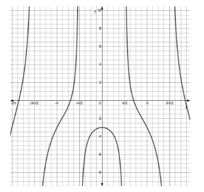

A student searches for a root of the equation `straight f open parentheses x close parentheses equals 0`. They find that `straight f open parentheses 1.5 close parentheses equals negative 24.2` and that `f open parentheses 1.6 close parentheses equals 51.8`. The student concludes that there is a root in the interval $1.5<x<1.6$. 
Explain why the student’s conclusion is incorrect.

### 2() — 1 mark — structured
Verify that $x=0$ is a solution to the equation `straight f open parentheses x close parentheses plus 3 equals 0.`

### 3() — 1 mark — structured
Explain why the sign change rule would fail if searching for the root$x=0$ of the equation `straight f open parentheses x close parentheses plus 3 equals 0`.

## Q24 — very_hard — 10 marks · exam-questions

### 1() — 2 marks — structured
The function,$f(x)$ is defined by
 `straight f open parentheses x close parentheses equals 1 over e to the power of x minus x plus 1 space space space space space space space space space space space space space space x element of straight real numbers`

Show that the equation `straight f open parentheses x close parentheses equals 0` can be written in the form

$x=e^{-x}+1$

### 2() — 2 marks — structured
On the same diagram sketch the graphs of $y=x$ and $y=e^{-x}+1$.

### 3() — 2 marks — structured
The equation `straight f open parentheses x close parentheses equals 0` has a root, $α$, close to $x=1$. The iterative formula  $x_{n+1}=e^{-x_{n}}+1$ with $x_{0}=2$ is to be used to find $α$ correct to three significant figures.

Show, using a diagram and your answer to part (b), that this formula and initial *x* value will converge to the root $α$.

### 4() — 3 marks — structured
(i) Find the values of$x_{1},x_{2}$and $x_{3}$, giving each correct to three significant figures.

(ii) How many iterations are required before $x_{n}$ and $x_{n-1}$ agree to two decimal places?

### 5() — 1 mark — structured
The root $α$  lies in the interval $p<x<q$. Write down the values of *p* and *q *such that $α$ can be deduced accurate to two decimal places from the interval.

## Q25 — very_hard — 3 marks · exam-questions

### 1() — 3 marks — structured
Sketch three separate graphs with values of $x=p$and $x=q$, to show how the sign change rule would fail to find a root *α* in the interval (*p , q) *for the following reasons:.

(i) Sign change rule indicates a root but there isn’t one due to a discontinuity in the graph.

(ii) Sign change rule indicates no root but there is a root at a turning point.

(iii) Sign change rule indicates no root but there are in fact two roots in the interval p , q.

On each diagram, clearly labelled *p, q* and the root *α*.

## Q26 — very_hard — 2 marks · exam-questions

### 1() — 2 marks — structured
Sketch two separate diagrams to show how an iterative formula of the form

$x_{n+1}=g(x_{n})$

can diverge in two different ways when being used to find an estimate for a root to the equation $f(x)=0$.

## Q27 — very_hard — 6 marks · exam-questions

### 1() — 1 mark — structured
The village of Camberwick Green lies on a straight road, as modelled by the line $y=x$  on the graph below.  Rush hour traffic through the village causes both congestion and air pollution.  To ease congestion and improve the air quality around Camberwick Green a bypass , modelled by part of the equation $y=1+2\mathrm{ln}(x^{2})$   is to be built.

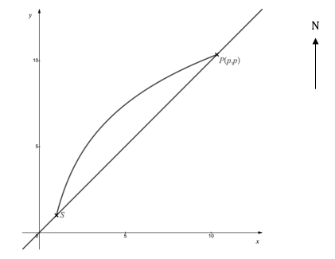

The bypass is to be built with a roundabout south of the village at point $S$ and a northern roundabout which re-joins the road through Camberwick Green at the point $P(p,p)$.

Write down the coordinates of the southern roundabout at point $S$.

### 2() — 3 marks — structured
(i) Show on the diagram how an iterative method with a starting value ($x_{0}$) in the interval $(1,p)$ will converge to the northern roundabout at point $P$.

(ii) Use a suitable iterative formula with an appropriate initial value ($x_{0}$) to find the value of $p$ to five significant figures.

### 3() — 2 marks — structured
Find the length of road through Camberwick Green that will benefit from the construction of the bypass. Decide on an appropriate unit of measurement.

## Q28 — very_hard — 6 marks · exam-questions

### 1() — 6 marks — structured
The game of Funcball is played on a flat table. A player rolls a ball from a fixed point, at any angle, with the aim of it coming to rest within a winning zone.

The winning zone is modelled by the function

$f(x)=\mathrm{ln}(3x+4)-0.25x^{2}$

The lower boundary of the winning zone has equation $y=f(x),x,y\geq0$

The upper boundary of the winning zone has equation $y=f(x)+1,x,y\geq0$,

A particular player decides to roll the ball at an angle of 45°, as illustrated by the graph below, with the ball being rolled from the origin and the shaded area being the winning zone.

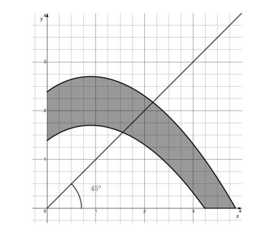

Using iterative formulas with initial values $x_{0}=1.5$ and $x_{0}=2.1$ as appropriate, find the exact distances between which the ball must stop for this player to win Funcball. Give your answers to two significant figures.

## Q29 — very_hard — 7 marks · exam-questions

### 1() — 3 marks — structured
According to legend, unicorn tears have magical healing powers.

Without unicorn tears, a bruise of initial size $A\mathrm{mm}^{2}$ will heal according to the model

`straight f open parentheses t close parentheses space equals space A e to the power of negative 0.25 t end exponent space minus space 0.1 t space space space space space space space space space space t greater or equal than 0`

where $f$ is the area of the bruise, in square millimeters, at time $t$ days since the bruise first appeared.

Use the iterative formula

`t subscript n plus 1 end subscript equals 4 space In space open parentheses 120 over t subscript n close parentheses`

with $t_{0}=10$ to find how many days it takes a bruise to heal without unicorn tears.

Give your answer to three significant figures.

### 2() — 3 marks — structured
With unicorn tears, a bruise of the same initial size will heal according to the model

`u open parentheses T close parentheses equals A T e to the power of negative T end exponent minus space 0.1 T space space space space space space space space space space space space space space space space space space T greater or equal than 0`

where time $T$ is measured in seconds.

(i) Find the initial size of the bruise considered in part (a).

(ii) Find how many seconds it takes the same size bruise to heal using unicorn tears.

### 3() — 1 mark — structured
Using your answer from parts(a) and (b), work out approximately how many times quicker a bruise heals when unicorn tears are used.
