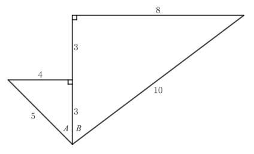

# Exam Questions — Compound & Double Angle Formulae
**Trigonometry** · Edexcel International A Level (IAL) Maths (YMA01) — Pure 3
> Source: [https://www.savemyexams.com/international-a-level/maths/edexcel/20/pure-3/topic-questions/trigonometry/compound-and-double-angle-formulae/exam-questions/](https://www.savemyexams.com/international-a-level/maths/edexcel/20/pure-3/topic-questions/trigonometry/compound-and-double-angle-formulae/exam-questions/) · 40 questions · total 218 marks

## Q1 — easy — 5 marks · exam-questions

### 1() — 5 marks — structured
(i) Write down the exact value of cos $60^{\circ}$.

(ii) Write down the exact value of cos $45^{\circ}$.

(iii) Use your calculator to find the exact value of cos $105^{\circ}$.

(iv) Hence show that cos $60^{\circ}+$cos $45^{\circ}\neq$cos $105^{\circ}$.

## Q2 — easy — 5 marks · exam-questions

### 1() — 2 marks — structured
Express sin $15^{\circ}$ in terms of sin $45^{\circ}$and sin $30^{\circ}$.

### 2() — 3 marks — structured
Hence show that

sin $15^{\circ}=\frac{\sqrt{6}-\sqrt{2}}{4}$

## Q3 — easy — 4 marks · exam-questions

### 1() — 2 marks — structured
Starting with the identity

sin`open parentheses A plus B close parentheses identical to`sin $A$cos $B+$sin $B$cos $A$

And using the substitution $B=A$, show that sin $2A\equiv2$sin $A$ cos $A$.

### 2() — 2 marks — structured
Hence show the exact value of sin $120^{\circ}=\frac{\sqrt{3}}{2}$.

## Q4 — easy — 3 marks · exam-questions

### 1() — 2 marks — structured
Use an appropriate identity to find sin`open parentheses theta plus straight alpha close parentheses` in terms of sines and cosines of $θ$ and $α$.

### 2() — 1 mark — structured
Hence show that $R$ sin`open parentheses theta plus straight alpha close parentheses identical to R` cos $α$ sin $θ+R$ sin $α$ cos $θ$.

## Q5 — easy — 8 marks · exam-questions

### 1() — 4 marks — structured
Solve the following equations in the given intervals.

sin $2θ=\frac{1}{2},-π\leqθ\leqπ$

### 2() — 4 marks — structured
cos $2θ=\frac{\sqrt{3}}{2},0\leqθ\leq2π$

## Q6 — easy — 4 marks · exam-questions

### 1() — 4 marks — structured
Show that

`5 space cos open parentheses theta minus straight pi over 6 close parentheses identical to fraction numerator 5 square root of 3 over denominator 2 end fraction cos space theta plus 5 over 2 sin space theta`

## Q7 — easy — 2 marks · exam-questions

### 1() — 2 marks — structured
Show that

$\mathrm{cos}^{2}x+\mathrm{cos}2x\equiv3\mathrm{cos}^{2}x-1$

## Q8 — easy — 5 marks · exam-questions

### 1() — 4 marks — structured
(i) Show that , $R\mathrm{sin}$`open parentheses theta plus straight alpha close parentheses identical to R`  $\mathrm{cos}α$ $\mathrm{sin}θ+R$ $\mathrm{sin}α$ $\mathrm{cos}θ$ where $R$ and $α$ are constants with $R>0$ and $0<α<\frac{π}{2}$.

(ii) Use your result from part (i) to show that `square root of 3 space end root space sin space theta plus cos space theta identical to 2 space sin open parentheses theta plus straight pi over 6 close parentheses`.

### 2() — 1 mark — structured
Write down the maximum value of $\sqrt{3}\mathrm{sin}θ+\mathrm{cos}θ$.

## Q9 — easy — 3 marks · exam-questions

### 1() — 3 marks — structured
Sketch the graph of $y=\mathrm{tan}2θ$ for $0\leqθ\leq2π$.

Label the points at which the graph intersects the coordinate axes.

## Q10 — easy — 6 marks · exam-questions

### 1() — 3 marks — structured
Use the difference of two squares to show that

$\text{cos}^{4}x-\mathrm{sin}^{4}x\equiv\mathrm{cos}2x$

### 2() — 3 marks — structured
Hence solve the equation

$\mathrm{cos}^{4}x-\mathrm{sin}^{4}x=\frac{\sqrt{2}}{2}$

for $-\frac{π}{2}\leqx\leq\frac{π}{2}$.

## Q11 — medium — 2 marks · exam-questions

### 1() — 2 marks — structured
Prove by a counter-example that  sin`open parentheses A plus B close parentheses equals`sin $A$$+$sin $B$  is **not** true in general.

## Q12 — medium — 4 marks · exam-questions

### 1() — 2 marks — structured
Express tan `open parentheses 210 degree close parentheses` in terms of tan `open parentheses 180 degree close parentheses`and tan `open parentheses 30 degree close parentheses`

### 2() — 2 marks — structured
Hence show that tan`open parentheses 210 degree close parentheses equals fraction numerator square root of 3 over denominator 3 end fraction`.

## Q13 — medium — 4 marks · exam-questions

### 1() — 2 marks — structured
Starting with the identity

cos`open parentheses A plus B close parentheses identical to`cos $A$ cos $B$$-$sin $A$ sin $B$

and using the substitution $B=A$, show that cos $2A\equiv$cos2 $A-$sin2 $A$

### 2() — 2 marks — structured
Hence, or otherwise, show that cos $2A\equiv1-2$ sin2 $A$.

## Q14 — medium — 5 marks · exam-questions

### 1() — 2 marks — structured
Using an appropriate trigonometric identity, show that

`R space sin open parentheses theta plus straight alpha close parentheses identical to R space cos space alpha space sin space theta plus straight R space sin space straight alpha space cos space theta`

where $R$ and $α$ are constants.

### 2() — 3 marks — structured
Hence show that `3 space sin space theta plus 2 space cos space theta equals square root of 13 sin open parentheses theta plus 0.588 close parentheses`.

## Q15 — medium — 10 marks · exam-questions

### 1() — 5 marks — structured
Use appropriate double angle formulae to solve the following equations in the given intervals.

cos2 $θ-$sin2 $θ=\frac{1}{2}$    $-π\leqθ\leqπ$

### 2() — 5 marks — structured
$4\mathrm{sin}x\mathrm{cos}x=-\sqrt{3}0\leqx\leqπ$

## Q16 — medium — 3 marks · exam-questions

### 1() — 3 marks — structured
Show that

$\frac{5\mathrm{sin}2x}{\mathrm{tan}x}\equiv10\mathrm{cos}^{2}xx\neq\frac{\mathrm{kπ}}{2}$

## Q17 — medium — 7 marks · exam-questions

### 1() — 4 marks — structured
(i) Show that `R space cos open parentheses x plus alpha close parentheses identical to R space cos space alpha space space cos space x minus R space sin space alpha space sin space x`, where $R$ and $α$ are constants.

(ii) Use your result from part (i) to show that  `cos space x minus square root of 3 sin space x identical to 2 space cos open parentheses x plus straight pi over 3 close parentheses`.

### 2() — 3 marks — structured
Hence solve the equation cos $x-\sqrt{3}$sin $x=1$ for $0\leqx\leq2π$.

## Q18 — medium — 9 marks · exam-questions

### 1() — 5 marks — structured
Using the identities

sin `open parentheses A plus B close parentheses identical to`sin $A$ cos $B+$sin $B$ cos $A$   and

cos $2A\equiv1-2$ sin2 $A$

show that sin $3A\equiv3$ sin $A-4$ sin3 $A$

### 2() — 4 marks — structured
Hence, or otherwise, solve the equation

$3$ sin $θ-4$sin3 $θ=\frac{1}{2}-π\leqθ\leqπ$

## Q19 — medium — 8 marks · exam-questions

### 1() — 4 marks — structured
Show that $5\mathrm{sin}θ+12\mathrm{cos}θ$ can be written in the form `R space sin open parentheses theta plus straight alpha degree close parentheses` where $R>0$ and $0^{\circ}<α<90^{\circ}$.

### 2() — 4 marks — structured
Sketch the graph of $y=5$sin $x+12$cos $x$ for $0^{\circ}\leqx\leq360^{\circ}$. Label any points where the graph intercepts the coordinate axes.

## Q20 — medium — 3 marks · exam-questions

### 1() — 3 marks — structured
Show that $2$ cosec $2A\equiv$cosec $A$ sec $A$.

## Q21 — hard — 2 marks · exam-questions

### 1() — 2 marks — structured
If $A=B$, then

sin`open parentheses A minus B close parentheses equals`sin`open parentheses A minus A close parentheses equals`sin`open parentheses 0 close parentheses equals 0 equals`sin $A-$sin $A=$sin $A-$sin $B$

By using a suitable counter-example with $A\neqB$, prove that sin`open parentheses A minus B close parentheses equals`sin $A-$sin $B$ is **not** true in general.

## Q22 — hard — 5 marks · exam-questions

### 1() — 2 marks — structured
Express cos`open parentheses 285 degree close parentheses` in terms of cosines and sines of 315° and 30°.

### 2() — 3 marks — structured
Hence show that cos`open parentheses 285 degree close parentheses equals fraction numerator square root of 6 minus square root of 2 over denominator 4 end fraction`.

## Q23 — hard — 2 marks · exam-questions

### 1() — 2 marks — structured
Show that

sin $2A\equiv2$ sin $A$ cos $A$

(You may use the identity sin `open parentheses A plus B close parentheses identical to`sin $A$ cos $B+$cos $A$ sin $B$.)

## Q24 — hard — 5 marks · exam-questions

### 1() — 5 marks — structured
Show that  $2$ cos $θ-5$ sin $θ$  can be written in the form  $R$ cos`open parentheses theta plus straight alpha close parentheses`,  where  $R$and $α$ are constants with   $R>0$ and  $0<α<\frac{π}{2}$  . Give $R$ in the form  $\sqrt{k}$ where $k$ is an integer, and give $α$ correct to three significant figures.

## Q25 — hard — 10 marks · exam-questions

### 1() — 6 marks — structured
Solve the equation

sin $2θ=$sin $θ$             $-π\leqθ\leqπ$

### 2() — 4 marks — structured
Solve the equation

cos $2x+$sin2 $x=0$           $0\leqx\leq2π$

## Q26 — hard — 4 marks · exam-questions

### 1() — 4 marks — structured
Show that

`fraction numerator sin open parentheses A plus B close parentheses plus sin open parentheses A minus B close parentheses over denominator cos open parentheses A plus B close parentheses plus cos open parentheses A minus B close parentheses end fraction identical to tan space A space space space space space space space space space space space space space space space space space space space space space space open parentheses A comma B not equal to open parentheses straight k plus 1 half close parentheses straight pi close parentheses`

## Q27 — hard — 7 marks · exam-questions

### 1() — 4 marks — structured
Show that $2\mathrm{sin}θ+4\mathrm{cos}θ$ can be written as `2 square root of 5 cos open parentheses theta minus straight alpha close parentheses` , where $α=0.464$ to three significant figures.

### 2() — 3 marks — structured
Hence solve the equation

$2$ sin $θ+4$cos $θ=3-π\leqθ\leqπ$

giving your answers correct to 3 significant figures.

## Q28 — hard — 8 marks · exam-questions

### 1() — 5 marks — structured
By letting $B=2A$, use the identity for `tan open parentheses A plus B close parentheses` to derive an expression for $\mathrm{tan}3A$ in terms of tan $A$.

### 2() — 3 marks — structured
Hence, or otherwise, solve the equation

$\frac{6\mathrm{tan}x-2\mathrm{tan}^{3}x}{1-3\mathrm{tan}^{2}x}=20\leqx\leqπ$

## Q29 — hard — 7 marks · exam-questions

### 1() — 7 marks — structured
Sketch the graph of `y equals 2 open parentheses sin space x minus cos space x close parentheses` for $0^{\circ}\leqx\leq360^{\circ}$.

Be sure to label any points where the graph intercepts the coordinate axes, and state the coordinates of any maximum and minimum points.

## Q30 — hard — 3 marks · exam-questions

### 1() — 3 marks — structured
Show that

$2-2$cot $2A$tan $A\equiv$sec2 $AA\neq\mathrm{kπ}$

## Q31 — very_hard — 3 marks · exam-questions

### 1() — 3 marks — structured
(i) Prove that `sin open parentheses A minus B close parentheses equals sin space A plus sin space B`  is **not** true in general.

(ii) Find values for $A$and $B$, with $A\neq0$ and $B\neq0$, for which    `sin open parentheses A minus B close parentheses equals sin space A plus sin space B`  **is** true.

## Q32 — very_hard — 7 marks · exam-questions

### 1() — 3 marks — structured
Use the identities `sin open parentheses A plus-or-minus B close parentheses identical to sin space A space cos space B plus-or-minus cos space A space sin space B` and `cos open parentheses A plus-or-minus B close parentheses identical to cos space A space cos space B plus-or-minus sin space A space sin thin space B`  to show that

`sin open parentheses X plus Y minus Z close parentheses identical to
sin space X space cos space Y space cos space Z plus cos space X space sin space Y space cos space Z minus cos space X space cos space Y space sin space Z plus sin space X space sin space Y space sin thin space Z`

### 2() — 4 marks — structured
Hence show that `sin open parentheses 165 degree close parentheses equals fraction numerator square root of 6 minus square root of 2 over denominator 4 end fraction`.

## Q33 — very_hard — 4 marks · exam-questions

### 1() — 4 marks — structured
Show that

$\mathrm{tan}2A\equiv\frac{2\mathrm{tan}A}{1-\mathrm{tan}^{2}A}$

State clearly any trigonometric identities you use to show this result.

## Q34 — very_hard — 6 marks · exam-questions

### 1() — 6 marks — structured
Given that  $a\mathrm{sin}θ+b\mathrm{cos}θ$, where $a$ and $b$ are positive constants, is to be written in the form  `R space sin open parentheses theta plus straight alpha close parentheses`,  find expressions for:

(i) $α$in terms of $a$ and $b$

(ii) $R$in terms of $a$ and $b$

## Q35 — very_hard — 11 marks · exam-questions

### 1() — 5 marks — structured
Solve the equation

$\mathrm{cos}2θ=\mathrm{cos}θ0\leqθ<2π$

### 2() — 6 marks — structured
Solve the equation

tan $2x=3$tan $x-π\leqx\leqπ$

## Q36 — very_hard — 5 marks · exam-questions

### 1() — 5 marks — structured
Show that

tan $2θ$tan $θ\equiv$sec $2θ-1$

## Q37 — very_hard — 9 marks · exam-questions

### 1() — 4 marks — structured
Show that $5\mathrm{sin}θ-3\mathrm{cos}θ$ can be written in the form  `R space sin open parentheses theta minus straight alpha close parentheses` where    $R=\sqrt{34}$, and $α=0.540$ radians correct to three significant figures.

### 2() — 5 marks — structured
Use your result from part (a), and the properties of the sine and cosine functions, to solve the equation

$3\mathrm{cos}2x+5\mathrm{sin}2x=0.40\leqx\leq2π$

## Q38 — very_hard — 9 marks · exam-questions

### 1() — 4 marks — structured
Use an identity for cos $2A$to derive an identity for cos $4A$, in terms of cos $A$.

### 2() — 5 marks — structured
Hence, or otherwise, solve the equation

$2\mathrm{cos}4x=7\mathrm{sin}^{2}x-20\leqx\leqπ$

## Q39 — very_hard — 7 marks · exam-questions

### 1() — 7 marks — structured
The diagram below shows two right-angled triangles. Angles $A$ and $B$ have been labelled.

Given that   $α=A+B$, find the exact values of sin $α$,cos $α$ and tan $α$.

## Q40 — very_hard — 4 marks · exam-questions

### 1() — 4 marks — structured
(i) Explain briefly why $θ=0$ is **not** a solution to the equation  $3θ\mathrm{cot}2θ=0$.

(ii) By using an appropriate approximation, determine the value of $\underset{θ\rightarrow0}{\mathrm{lim}}3θ\mathrm{cot}2θ$
