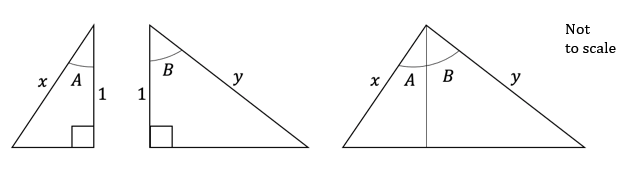
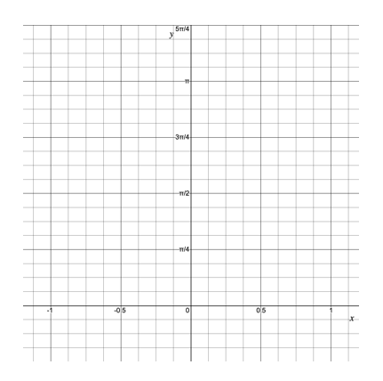

# Exam Questions — Trigonometric Proof
**Trigonometry** · Edexcel International A Level (IAL) Maths (YMA01) — Pure 3
> Source: [https://www.savemyexams.com/international-a-level/maths/edexcel/20/pure-3/topic-questions/trigonometry/trigonometric-proof/exam-questions/](https://www.savemyexams.com/international-a-level/maths/edexcel/20/pure-3/topic-questions/trigonometry/trigonometric-proof/exam-questions/) · 36 questions · total 171 marks

## Q1 — easy — 2 marks · exam-questions

### 1() — 2 marks — structured
Show that

$\mathrm{cot}θ$$\equiv\frac{\mathrm{cos}θ}{\mathrm{sin}θ}$

## Q2 — easy — 5 marks · exam-questions

### 1() — 2 marks — structured
Use the identity

cos`open parentheses A plus B close parentheses identical to`cos $A$cos $B-$sin $A$sin $B$

to show that

cos $2A\equiv$cos2 $A-$sin2 $A$

### 2() — 3 marks — structured
Show by counter-example that

cos `2 theta not identical to`cos $θ+$cos $θ$

## Q3 — easy — 2 marks · exam-questions

### 1() — 2 marks — structured
Prove the identity

$\frac{\mathrm{sin}2θ}{2\mathrm{sin}θ}\equiv\mathrm{cos}θ,θ\neq\mathrm{kπ}$

## Q4 — easy — 4 marks · exam-questions

### 1() — 4 marks — structured
Show that

`sin squared space theta open parentheses sec squared space theta plus cosec squared space theta close parentheses identical to sec squared space theta`

## Q5 — easy — 5 marks · exam-questions

### 1() — 5 marks — structured
(i) Use the quotient rule to show that

`fraction numerator d over denominator d x end fraction open square brackets cosec space x close square brackets equals fraction numerator negative cos space x over denominator sin squared space x end fraction`

(ii) Hence show that

`fraction numerator d over denominator d x end fraction open square brackets cosec space x close square brackets equals negative cot space x space cosec space x`

## Q6 — easy — 3 marks · exam-questions

### 1() — 3 marks — structured
Show that

$3$ sin $2θ-2$ sin $θ\equiv2$ sin `theta space open parentheses 3 space cos space theta minus 1 close parentheses`

## Q7 — easy — 5 marks · exam-questions

### 1() — 5 marks — structured
Prove the identity

$2$ cosec $2x$cot $x\equiv$cosec2 $x,x\neq\frac{kπ}{2}$

## Q8 — easy — 4 marks · exam-questions

### 1() — 2 marks — structured
Find the value of

(i) `arccos open parentheses cos open parentheses 150 degree close parentheses close parentheses`

(ii) `arcsin open parentheses sin open parentheses 210 degree close parentheses close parentheses`

### 2() — 2 marks — structured
Explain why the answer to part (a) (ii) is not $210^{\circ}$.

## Q9 — easy — 3 marks · exam-questions

### 1() — 3 marks — structured
Use the identity

$R$ sin`open parentheses theta plus straight alpha close parentheses identical to R space`cos $α$ sin $θ+R$sin $α$ cos $θ$

to show that

$4$ sin`open parentheses theta plus straight pi over 4 close parentheses identical to 2 square root of 2 open parentheses sin space theta plus cos space theta close parentheses`

## Q10 — medium — 4 marks · exam-questions

### 1() — 4 marks — structured
Given the identity

sin2 $θ+$cos2 $θ\equiv1$

prove the following identities:

(i) sec2 $θ\equiv1+$tan2 $θ$

(ii) cosec2 $θ\equiv1+$cot2 $θ$

## Q11 — medium — 5 marks · exam-questions

### 1() — 5 marks — structured
(i) By using the double angle formula for cosine, prove the identity

cos $4θ\equiv8$ cos4 $θ-8$ cos2 $θ+1$

(ii) Show by counter-example that

sin `4 theta not identical to 8` sin4 $θ-8$ sin2 $θ+1$

## Q12 — medium — 3 marks · exam-questions

### 1() — 3 marks — structured
Prove the identity

$\frac{4\mathrm{sin}^{4}θ}{\mathrm{sin}^{2}2θ}\equiv\mathrm{tan}^{2}θθ\neq\mathrm{kπ}$

## Q13 — medium — 4 marks · exam-questions

### 1() — 4 marks — structured
Show that

sin `theta open parentheses cosec squared space theta minus 2 close parentheses identical to fraction numerator cos space 2 theta over denominator sin space theta end fraction`

## Q14 — medium — 5 marks · exam-questions

### 1() — 5 marks — structured
Use the quotient rule to show that

`fraction numerator d over denominator d x end fraction open square brackets tan space x close square brackets equals sec squared space x`

## Q15 — medium — 5 marks · exam-questions

### 1() — 5 marks — structured
Show that

sin $3θ+$sin $θ\equiv4$ sin $θ-4$sin3 $θ$

## Q16 — medium — 5 marks · exam-questions

### 1() — 5 marks — structured
Prove the identity

$\frac{4\mathrm{cot}x\mathrm{cos}2x}{\mathrm{sin}4x}\equiv\mathrm{cosec}^{2}xx\neq\frac{\mathrm{kπ}}{4}$

## Q17 — medium — 4 marks · exam-questions

### 1() — 2 marks — structured
Show that

sin`open parentheses arccos open parentheses negative 1 half close parentheses close parentheses equals square root of 3 space sin open parentheses straight pi over 6 close parentheses`

### 2() — 2 marks — structured
Show that

`arcsin open parentheses cos fraction numerator 3 straight pi over denominator 4 end fraction close parentheses equals negative arcsin open parentheses cos straight pi over 4 close parentheses`

## Q18 — medium — 3 marks · exam-questions

### 1() — 3 marks — structured
Show that

`square root of 2 sin open parentheses theta minus straight pi over 4 close parentheses identical to sin space theta minus cos space theta`

## Q19 — hard — 4 marks · exam-questions

### 1() — 4 marks — structured
Given the identity

cos`open parentheses A plus B close parentheses equals`cos $A$ cos $B$$-$sin $A$ sin $B$

prove the following identities:

(i) cos $2θ\equiv$cos2 $θ-$sin2 $θ$

(ii) cos $2θ\equiv1-2$sin2 $θ$

(iii) cos $2θ\equiv2$cos2 $θ-1$

## Q20 — hard — 5 marks · exam-questions

### 1() — 5 marks — structured
(i) Prove the identity

sin $3θ\equiv3$ sin $θ-4$ sin3 $θ$

(ii) Show by counter-example that

cos `3 theta not identical to 3` cos $θ-$$4$ cos3 $θ$

## Q21 — hard — 5 marks · exam-questions

### 1() — 5 marks — structured
Show that

cos $4θ+$cos $\frac{π}{3}\equiv8$ sin4 $θ-8$ sin2 $θ+\frac{3}{2}$

## Q22 — hard — 5 marks · exam-questions

### 1() — 5 marks — structured
Prove that

cot2 $θ-$tan2 $θ\equiv4$ cot $2θ$ cosec $2θ$.

## Q23 — hard — 5 marks · exam-questions

### 1() — 5 marks — structured
Prove the identity

$\frac{1-\mathrm{tan}^{2}x}{\mathrm{cos}2x}\equiv\mathrm{sec}^{2}xx\neq\frac{2k+1}{4}π$

## Q24 — hard — 4 marks · exam-questions

### 1() — 4 marks — structured
Prove the identity

cosec $x\equiv\frac{\frac{1}{2}\mathrm{sec}^{2}\frac{x}{2}}{\mathrm{tan}\frac{x}{2}}$

## Q25 — hard — 5 marks · exam-questions

### 1() — 5 marks — structured
Show that

tan$\frac{x}{2}\equiv\frac{1}{\mathrm{cosec}x+\mathrm{cot}x}x\neq2\mathrm{kπ}$

## Q26 — hard — 6 marks · exam-questions

### 1() — 3 marks — structured
Given that `y equals arcsin open parentheses k x close parentheses`, where $k$ is a constant, show that   `x equals 1 over k cos open parentheses straight pi over 2 minus y close parentheses` .

### 2() — 3 marks — structured
Hence show that the value of $\mathrm{arcsin}kx+\mathrm{arccos}kx$ is constant and independent of $k$. 
Find the value of this constant.

## Q27 — hard — 5 marks · exam-questions

### 1() — 5 marks — structured
Show that

`fraction numerator 10 over denominator 4 space cos space theta plus 3 space sin space theta end fraction identical to 2 space sec open parentheses theta minus straight alpha close parentheses`

where

`alpha equals arctan open parentheses 3 over 4 close parentheses`

## Q28 — very_hard — 6 marks · exam-questions

### 1() — 6 marks — structured
Consider the three triangles, all of height 1, as shown below.

By applying the area of a triangle formula $A=\frac{1}{2}\mathrm{ab} \mathrm{sin}C$  to each one, prove that,

sin`open parentheses A plus B close parentheses identical to`sin $A$ cos $B+$sin $B$ cos $A$

Briefly explain why this only proves the result for $A$ and $B$ being acute angles.

## Q29 — very_hard — 4 marks · exam-questions

### 1() — 4 marks — structured
Prove the identity

`tan space 4 theta identical to fraction numerator 4 space tan space theta open parentheses 1 minus tan squared space theta close parentheses over denominator 1 minus 6 space tan squared space theta plus tan to the power of 4 space theta end fraction`

## Q30 — very_hard — 5 marks · exam-questions

### 1() — 5 marks — structured
Prove the identity

$-16$ cot $2θ$ cosec3 $2θ\equiv$sec4 $θ-$cosec4 $θ$

## Q31 — very_hard — 4 marks · exam-questions

### 1() — 4 marks — structured
Show that

`fraction numerator square root of 2 cos open parentheses theta plus straight pi over 4 close parentheses over denominator sin open parentheses theta minus straight pi over 2 close parentheses end fraction identical to tan space theta minus 1`

## Q32 — very_hard — 9 marks · exam-questions

### 1() — 4 marks — structured
Show that

sin $3θ\equiv3$ sin $θ$ cos2 $θ-$sin3 $θ$

### 2() — 5 marks — structured
Hence, or otherwise, show that

$\frac{\mathrm{cos}3θ-\mathrm{cos}θ}{\mathrm{sin}3θ\mathrm{sin}θ}\equiv\frac{4\mathrm{cos}θ}{1-4\mathrm{cos}^{2}θ}θ\neq\mathrm{kπ}$

## Q33 — very_hard — 5 marks · exam-questions

### 1() — 5 marks — structured
Show that

$4$cos2 `open parentheses x minus straight pi over 6 close parentheses identical to 3 minus 2`sin2 $x+\sqrt{3}$ sin $2x$

## Q34 — very_hard — 6 marks · exam-questions

### 1() — 6 marks — structured
Show that

tan`open parentheses fraction numerator 2 x plus straight pi over denominator 4 end fraction close parentheses identical to`sec $x+$tan $x$

## Q35 — very_hard — 8 marks · exam-questions

### 1() — 4 marks — structured
On the axes below sketch the graphs of

`y equals arccos open parentheses negative x close parentheses`  and  `y equals open vertical bar arcsin space x close vertical bar`

### 2() — 2 marks — structured
With the help of your sketch, determine the exact solution(s) to the equation

`arccos open parentheses negative x close parentheses equals open vertical bar arcsin space x close vertical bar`

### 3() — 2 marks — structured
What can you say about the solution(s) to the equation

`open vertical bar arccos space x close vertical bar equals arcsin open parentheses negative x close parentheses ?`

Justify your answer.

## Q36 — very_hard — 9 marks · exam-questions

### 1() — 9 marks — structured
Show that

`1 over open parentheses fraction numerator square root of 3 over denominator 2 end fraction cos space theta minus 1 half sin space theta close parentheses squared plus 1 over open parentheses fraction numerator square root of 3 over denominator 2 end fraction sin space theta plus 1 half cos space theta close parentheses squared identical to 4 space cosec squared open parentheses 2 theta plus straight pi over 3 close parentheses`
