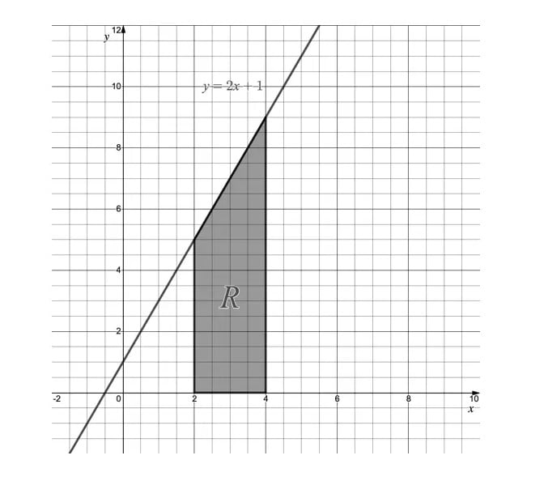
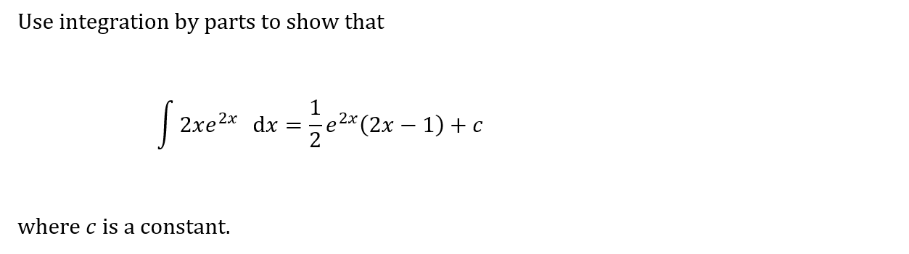
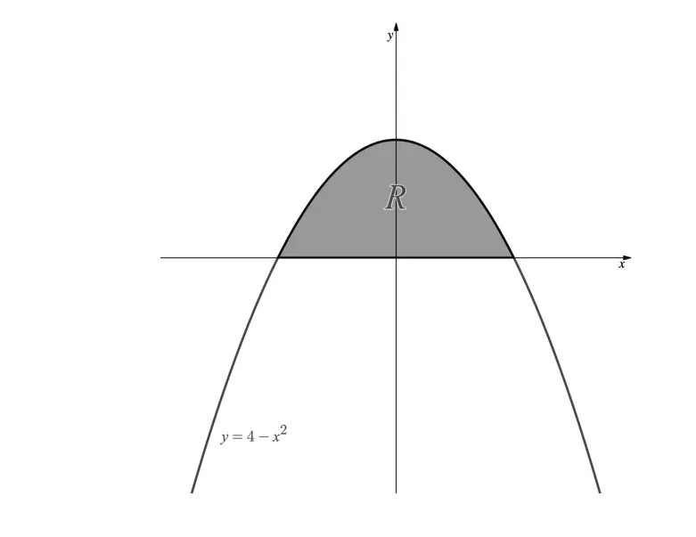
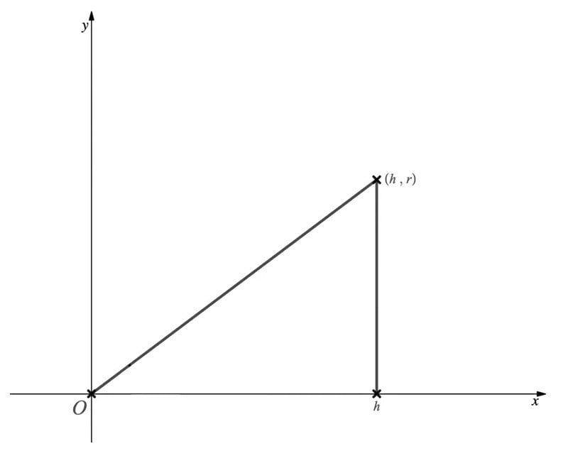
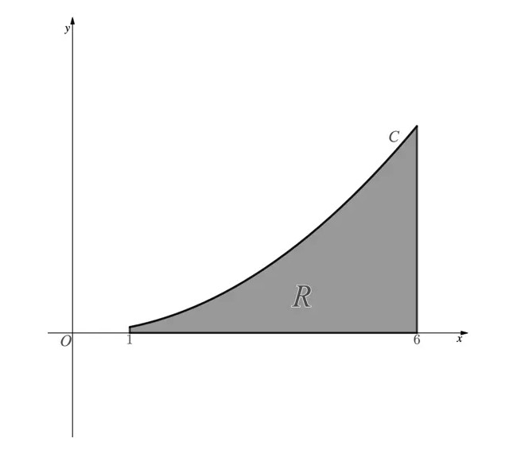

# Exam Questions — Further Integration
**Integration** · Edexcel International A Level (IAL) Maths (YMA01) — Pure 4
> Source: [https://www.savemyexams.com/international-a-level/maths/edexcel/20/pure-4/topic-questions/integration/further-integration/exam-questions/](https://www.savemyexams.com/international-a-level/maths/edexcel/20/pure-4/topic-questions/integration/further-integration/exam-questions/) · 26 questions · total 161 marks

## Q1 — easy — 6 marks · exam-questions

### 1() — 3 marks — structured
Given that u = 3x + 2 show that

(i) du = 3 dx,

(ii) `integral`3 cos(3x +2) dx = `integral`cos u du.

### 2() — 3 marks — structured
Hence find an expression in terms of x for the integral

`integral`3 cos(3x +2) dx.

## Q2 — easy — 4 marks · exam-questions

### 1() — 4 marks — structured
Use the substitution u = 4x + 1 to find

`integral subscript 2 superscript 6 4 open parentheses 4 x plus 1 close parentheses to the power of 1 half end exponent space d x
`

## Q3 — easy — 6 marks · exam-questions

### 1() — 6 marks — structured
Use integration by parts to find an expression for

`integral negative 3 x space sin space x space d x.`

## Q4 — easy — 7 marks · exam-questions

### 1() — 3 marks — structured
Show that

`fraction numerator 2 x space minus space 1 over denominator open parentheses x space plus space 1 close parentheses open parentheses x space minus space 2 close parentheses end fraction`

can be written in the form

$\frac{A}{x+1}+\frac{B}{x-2}$

### 2() — 4 marks — structured
Hence find

`integral fraction numerator 2 x space minus 1 over denominator open parentheses x space plus space 1 close parentheses open parentheses x space minus 2 close parentheses end fraction d x space space space space space x greater than 2`

writing your answer as a single logarithm.

## Q5 — easy — 5 marks · exam-questions

### 1() — 5 marks — structured
The diagram below shows the region R, bounded by the straight lines with equations y = 2x + 1, x =2, x =4 and the x-axis.

(i) For y = 2x + 1, show that y2 = 4x2 + 4x + 1.

(ii) Find the volume of the solid formed when the region R is rotated 360° around the x-axis.

## Q6 — easy — 6 marks · exam-questions

### 1() — 6 marks — structured
Use the substitution u = sin x to find the value of

`integral subscript 2 superscript pi over 2 end superscript cos squared space 2 x space cos x space d x.`

## Q7 — easy — 4 marks · exam-questions

### 1() — 4 marks — structured

## Q8 — medium — 5 marks · exam-questions

### 1() — 5 marks — structured
Use a suitable substitution to find

`integral`-15 sin(5x-2) dx

## Q9 — medium — 7 marks · exam-questions

### 1() — 7 marks — structured
Use calculus and the substitution u = x + 4 to show that

`integral subscript 1 superscript 2 fraction numerator x over denominator x space plus space 4 end fraction d x space equals space 1 plus 4 space I n space 5 over 6`

## Q10 — medium — 6 marks · exam-questions

### 1() — 6 marks — structured
Use integration by parts to find, in terms of e, the exact value of

`integral subscript 0 superscript 1`(5x - 4)e3x dx

## Q11 — medium — 7 marks · exam-questions

### 1() — 3 marks — structured
Show that

`fraction numerator 11 over denominator open parentheses 2 x minus 3 close parentheses open parentheses x plus 4 close parentheses end fraction`

can be written in the form

`fraction numerator A over denominator open parentheses 2 x minus 3 close parentheses end fraction plus fraction numerator B over denominator open parentheses x plus 4 close parentheses end fraction`

### 2() — 4 marks — structured
Hence find

`integral fraction numerator 11 over denominator open parentheses 2 x minus 3 close parentheses open parentheses x plus 4 close parentheses end fraction d x`

writing your answer as a single logarithm.

## Q12 — medium — 5 marks · exam-questions

### 1() — 5 marks — structured
The diagram below shows the graph of the curve with equation y = 4 - x2.

(i) Find the x-coordinates of the points where the graph of y = 4 - x2 intercepts the x-axis.

(ii) The shaded region, R, is to be rotated 360° around the x-axis.

Find the volume of the shape generated.

## Q13 — hard — 5 marks · exam-questions

### 1() — 5 marks — structured
Use a suitable substitution to find the following

`integral 8 x space sin left parenthesis 3 x squared plus 1 right parenthesis space d x`

## Q14 — hard — 5 marks · exam-questions

### 1() — 5 marks — structured
Use the substitution u = 2 + In x to show that

`integral fraction numerator 1 over denominator x left parenthesis 2 plus l n space x right parenthesis cubed end fraction space d x space equals fraction numerator negative 1 over denominator 2 left parenthesis ln space x plus space 2 right parenthesis squared end fraction space plus c`

where c is the constant of integration.

## Q15 — hard — 9 marks · exam-questions

### 1() — 5 marks — structured
Use integration by parts to find

`integral left parenthesis 2 x squared minus 1 right parenthesis e to the power of x space d x`

### 2() — 4 marks — structured
Show that

`integral I n space x space d x space equals space x space ln space x minus x plus space c`

where c is the constant of integration.

## Q16 — hard — 7 marks · exam-questions

### 1() — 4 marks — structured
Express

$\frac{x^{2}-4x+7}{(x-1)(x-3)^{2}}$

as partial fractions.

### 2() — 3 marks — structured
Hence, or otherwise, find

`integral fraction numerator x squared minus 4 x plus space 7 over denominator left parenthesis x minus 1 right parenthesis left parenthesis x minus 3 right parenthesis squared space d x end fraction`

## Q17 — hard — 5 marks · exam-questions

### 1() — 2 marks — structured
The diagram below shows a right-angled triangle with vertices at the origin, the point (h,0) and the point (h,r), where r > 0 and h > 0.

Find an equation of the line on which the hypotenuse of the right-angled triangle lies, giving your answer in the form y = f(x).

### 2() — 3 marks — structured
The triangle is rotated 360° about the x-axis to form a cone.

Thus use calculus to prove that the general formula for the volume, V, of a cone is

$V=\frac{1}{3}\mathrm{πr}^{2}h$

where r is the base radius of the cone and h is its perpendicular height.

## Q18 — hard — 4 marks · exam-questions

### 1() — 4 marks — structured
The diagram below shows part of the curve C defined by the equation $y=\frac{1}{a}x^{2}$, where a is a positive constant. The shaded region R is bounded by the curve, the x-axis, and the lines x = 1 and x = 6.

Given that the volume of the solid formed when the region R is rotated 360° about the x-axis is $\frac{311π}{20}$cubic units, find the value of a.

## Q19 — very_hard — 6 marks · exam-questions

### 1() — 3 marks — structured
Find an expression for y given that

`y space equals integral 6 x squared e to the power of x cubed end exponent space d x`

### 2() — 3 marks — structured
Integrate

`integral left parenthesis 16 minus 32 x right parenthesis space sin left parenthesis 4 x minus 2 right parenthesis squared space d x`

## Q20 — very_hard — 5 marks · exam-questions

### 1() — 5 marks — structured
Use calculus and the substitution x = cos $θ$ to find the exact value of

`integral subscript fraction numerator 1 over denominator square root of 2 end fraction end subscript superscript fraction numerator square root of 3 over denominator 2 end fraction end superscript fraction numerator 1 over denominator square root of 1 minus x squared end root end fraction space d x`

## Q21 — very_hard — 10 marks · exam-questions

### 1() — 6 marks — structured
Find

`integral x squared space sin space 3 x space d x`

### 2() — 4 marks — structured
Find

`integral fraction numerator I n space x over denominator x cubed end fraction space d x`

## Q22 — very_hard — 6 marks · exam-questions

### 1() — 6 marks — structured
Find the integral

`integral fraction numerator 8 x squared minus 8 x minus 1 over denominator left parenthesis 4 x squared minus 1 right parenthesis left parenthesis x minus 2 right parenthesis end fraction d x`

## Q23 — very_hard — 7 marks · exam-questions

### 1() — 7 marks — structured
Use integration by parts to show that

`integral e to the power of x sin x space d x space equals 1 half space e to the power of x left parenthesis sin x minus cos x right parenthesis space plus space C`

where c is the constant of integration.

## Q24 — very_hard — 11 marks · exam-questions

### 1() — 3 marks — structured
Sketch the region described by the following inequalities

x ≥ 2                                     x≤ 6                              2y ≤ x + 4                  y≥p,  where 0<p< 2

### 2() — 4 marks — structured
The region described in part (a) is rotated through 360° about the x-axis.

Find the volume of the solid formed, giving your answer in terms of p.

### 3() — 4 marks — structured
The solid formed in part (b) will have a 'hole' in its centre.

(i) Find the volume of this 'hole', giving your answer in terms of p.

(ii) Hence show that there are no values of p in the given interval that make the volume of the solid equal to the volume of the 'hole'.

## Q25 — very_hard — 5 marks · exam-questions

### 1() — 5 marks — structured
Starting with the equation of a semicircle of radius r, y = $\sqrt{r^{2}-x^{2}}$(where r > 0), use calculus to prove that the general formula for the volume, V, of a sphere of radius r is

$V=\frac{4}{3}\mathrm{πr}^{3}$

## Q26 — very_hard — 8 marks · exam-questions

### 1() — 4 marks — structured
Express $\frac{7y+13}{12y^{2}+43y+36}$ in partial fractions.

### 2() — 4 marks — structured
Use your answer from part (a) to help find

`integral fraction numerator 7 x squared plus 13 over denominator 12 x to the power of 4 plus 43 x squared plus 36 end fraction space d x`
