# Exam Questions — Further Parametric Equations
**Parametric Equations** · Edexcel International A Level (IAL) Maths (YMA01) — Pure 4
> Source: [https://www.savemyexams.com/international-a-level/maths/edexcel/20/pure-4/topic-questions/parametric-equations/further-parametric-equations/exam-questions/](https://www.savemyexams.com/international-a-level/maths/edexcel/20/pure-4/topic-questions/parametric-equations/further-parametric-equations/exam-questions/) · 36 questions · total 273 marks

## Q1 — easy — 4 marks · exam-questions

### 1() — 2 marks — structured
Given

x = et                           and                  y=2t3 + 3t

find  $\frac{dx}{dt}$ and $\frac{dy}{dt}$

### 2() — 2 marks — structured
Hence, or otherwise, find $\frac{dy}{dx}$ in terms of t.

## Q2 — easy — 7 marks · exam-questions

### 1() — 2 marks — structured
Find the Cartesian equation of the curve C, defined by the parametric equations

x = t-1             and                y  = 2 ln t

### 2() — 3 marks — structured
(i) Find $\frac{dy}{dx}$ in terms of x.

(ii) Find the gradient of C at the point where t = 1.

### 3() — 2 marks — structured
Hence find the equation of the tangent to C at the point where t = 1.

## Q3 — easy — 6 marks · exam-questions

### 1() — 2 marks — structured
A sketch of the graph defined by the parametric equations

x = 8t              and             y=t2+1

is shown below.

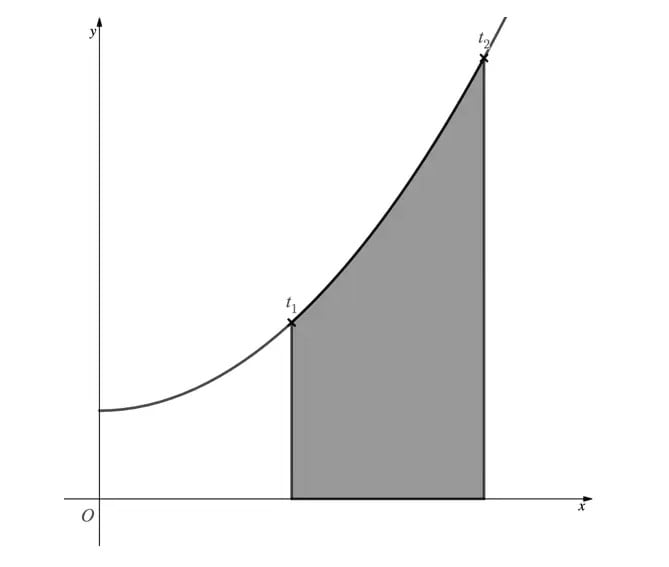

The point where t = t1 has x-coordinate 8.

The point where t = t2 has x-coordinate 16.

Find the values of t1 and t2.

### 2() — 4 marks — structured
(i) Show that the shaded area can be found using the integral

`integral subscript 1 superscript 2 left parenthesis 8 t squared space plus 8 right parenthesis space d t`

(ii) Hence find the shaded area.

## Q4 — easy — 7 marks · exam-questions

### 1() — 2 marks — structured
A particle travels along a path defined by the parametric equations

x = 6t          and            y=8t2-8t + 3,                      0 ≤  t  ≤ 1,

where (x ,y) are the coordinates of the particle at time t seconds.

Find the coordinates of the particle after 0.2 seconds.

### 2() — 3 marks — structured
(i) Find $\frac{dx}{dt}$ and $\frac{dy}{dt}$.

(ii) Hence find $\frac{dy}{dx}$ in terms of t.

### 3() — 2 marks — structured
Find the coordinates of the particle when it is at its minimum point.

## Q5 — easy — 8 marks · exam-questions

### 1() — 2 marks — structured
The graph of the curve C shown below is defined by the parametric equations

x = 5 sin $θ$            and              y =  $θ^{2}$          $-π\leqθ\leqπ$

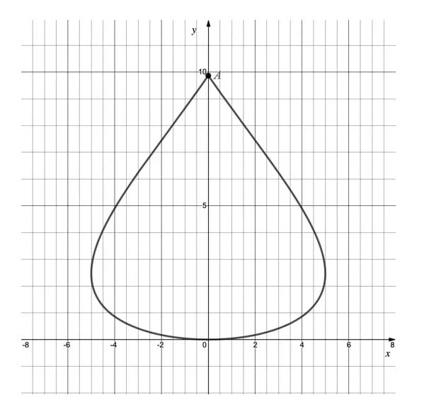

Find the exact coordinates of point A.

### 2() — 2 marks — structured
(i) Write down the value of $\frac{dy}{dθ}$ at the origin.

(ii) Write down the value of $\frac{dx}{dθ}$ at the points where x = -5 and x = 5.

### 3() — 4 marks — structured
(i) Find $\frac{dx}{dθ}$ and  $\frac{dy}{dθ}$

(ii) Hence find $\frac{dy}{dx}$ in terms of  $θ$.

(iii) Find the gradient at the point where  $θ=\frac{π}{3}$

## Q6 — easy — 6 marks · exam-questions

### 1() — 3 marks — structured
The curve C has parametric equations

x = 5t2-1            and             y = 3t,                     t>0.

(i) Find  $\frac{dx}{dt}$ and  $\frac{dy}{dt}$

(ii) Hence find $\frac{dy}{dt}$ in terms of t.

### 2() — 3 marks — structured
(i) Find the gradient of the tangent to C at the point (4,3).

(ii) Hence find the equation of the tangent to C at the point (4,3).

## Q7 — easy — 8 marks · exam-questions

### 1() — 3 marks — structured
The curve C has parametric equations

x = 2t3             and            y = 4t -1,                   t>0.

(i) Find $\frac{dx}{dt}$ and  $\frac{dy}{dt}$

(ii) Hence find $\frac{dy}{dx}$ in terms of t.

### 2() — 5 marks — structured
(i) Find the gradient of the tangent to C at the point (16,7).

(ii) Hence find the gradient of the normal to C at the point (16,7).

(iii) Find the equation of the normal to C at the point (16,7).

## Q8 — easy — 6 marks · exam-questions

### 1() — 1 mark — structured
A company logo is in the shape of a semi-ellipse as shown in the diagram below.

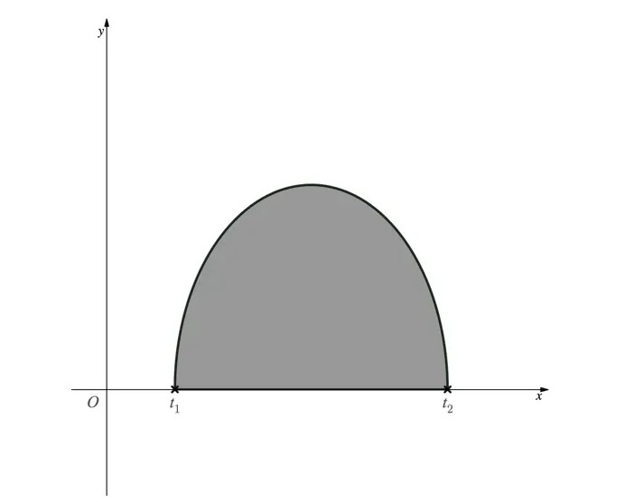

The graph of the logo is defined by the parametric equations

x = 3 + 2 cost          and            y = -3sin t,            $π\leqt\leq2π$

where x and y are measured in centimetres.

Verify that the values of t, labelled t1 and t2 on the diagram above where y = 0, are t1 = $π$ and t2 = 2$π$

### 2() — 5 marks — structured
(i) Find  $\frac{dx}{dt}$.

(ii) Show that the shaded area is given by

`6 integral subscript straight pi superscript 2 straight pi end superscript sin squared t space d t`

(iii) Hence using your calculator or otherwise, find the area of the logo.

## Q9 — easy — 8 marks · exam-questions

### 1() — 2 marks — structured
The diagram below shows part of the curve C with parametric equations

x =t2+1               and               y = 2t -4                    t≥0

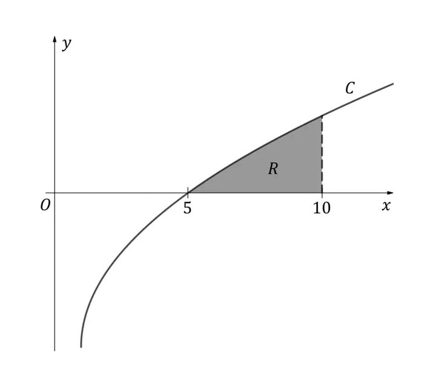

The point on the graph where t = t1 has x-coordinate 5.

The point on the graph where t = t2 has x-coordinate 10.

Show that t1 = 2 and t2 = 3, and find the coordinates of the corresponding points on C.

### 2() — 6 marks — structured
The region R shown in the diagram is bounded by C, the x-axis, and the line x = 10.
Region R is rotated through 360° about the x-axis to form a solid of revolution.

(i) Show that the volume of the solid of revolution is given by the integral

`pi integral subscript 2 superscript 3 left parenthesis 8 t cubed minus 32 t squared space plus 32 t right parenthesis space d t`

(ii) Hence find the exact volume of the solid generated.

## Q10 — medium — 6 marks · exam-questions

### 1() — 3 marks — structured
Find an expression for $\frac{dy}{dx}$ in terms of $t$ for the parametric equations:

$x=e^{2t}y=3t^{2}+1$

### 2() — 3 marks — structured
The graph of $y$ against $x$ passes through the point $P(1,1)$.

(i) Find the value of $t$ at the point $P$.
(ii) Find the gradient at the point $P$.
(iii) What does the value of the gradient tell you about point $P$?

## Q11 — medium — 7 marks · exam-questions

### 1() — 2 marks — structured
The graph defined by the parametric equations

$x=t^{3}y=2t^{2}-1$

is shown below.

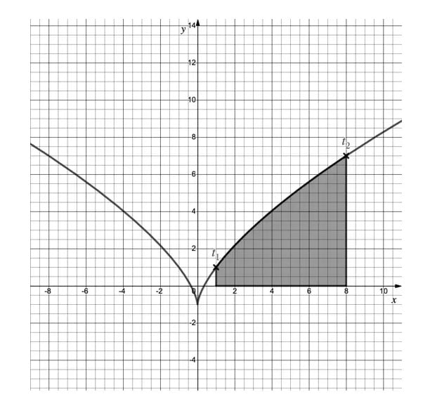

The point where $t=t_{1}$ has coordinates $(1,1)$

The point where $t=t_{2}$ has coordinates $(8,7)$

Find the values of $t_{1}$ and  $t_{2}$.

### 2() — 5 marks — structured
(i)  Show that the shaded area can be found using the integral

`integral subscript 1 superscript 2 left parenthesis 6 t to the power of 4 minus 3 t squared right parenthesis   d t`

(ii)** ** Hence find the shaded area.

## Q12 — medium — 9 marks · exam-questions

### 1() — 2 marks — structured
A crane swings a wrecking ball along a two-dimensional path defined by the parametric equations

$x=12ty=9t^{2}-9t+40\leqt\leq1$

as shown in the diagram below.

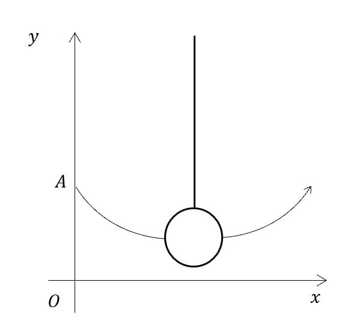

$x$ and $y$ are, respectively, the horizontal and vertical displacements in metres from the origin, $O$, and  $t$ is the time in seconds. Point $A$ indicates the initial position of the wrecking ball, at time  $t=0$.

Find the height of the wrecking ball after 0.3 seconds.

### 2() — 3 marks — structured
Find the minimum height of the wrecking ball during its motion.

### 3() — 4 marks — structured
Find the horizontal distances from point  $A$ at the times when the wrecking ball is at a height of 2.9 m, giving your answers accurate to 1 decimal place.

## Q13 — medium — 9 marks · exam-questions

### 1() — 2 marks — structured
The graph of the curve $C$ shown below is defined by the parametric equations

$x=3\mathrm{sin}3θy=6\mathrm{cos}2θ-\frac{π}{2}\leqθ\leq\frac{π}{2}$

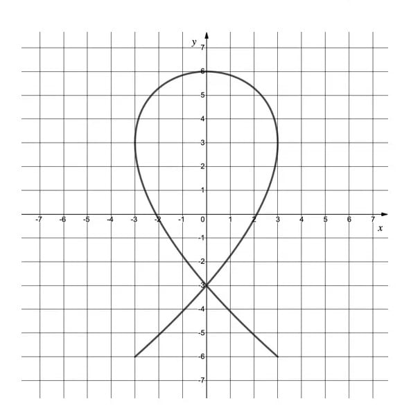

(i)   Write down the value of $\frac{dy}{dθ}$ at the point  (0, 6) .

(ii)  Write down the value of $\frac{dx}{dθ}$ at the points (-3, 3) and (3, 3).

### 2() — 3 marks — structured
Find an expression for $\frac{dy}{dx}$ in terms of $θ$.

### 3() — 4 marks — structured
(i)  Find the values of $x,y$ and $\frac{dy}{dx}$ at the point where $θ=\frac{π}{12}$.

(ii) Hence show the equation of the tangent to \( C \) at the point where $θ=\frac{π}{12}$ is

`2 square root of 2 x plus 3 y minus open parentheses 9 square root of 3 plus 6 close parentheses equals 0`

## Q14 — medium — 8 marks · exam-questions

### 1() — 3 marks — structured
The curve $C$ has parametric equations

$x=6t^{2}+2y=\frac{1}{t}t>0$

Find an expression, in terms of $t$, for $\frac{dy}{dx}$.

### 2() — 5 marks — structured
(i)  Find the gradient of the tangent to $C$ at the point `open parentheses 8 comma space 1 close parentheses`.

(ii) Hence write down the gradient of the normal to $C$ at the point  `open parentheses 8 comma space 1 close parentheses`.

(iii) Find the equation of the normal to  $C$ at the point  `open parentheses 8 comma space 1 close parentheses`.

## Q15 — medium — 7 marks · exam-questions

### 1() — 3 marks — structured
The curve $C$ has parametric equations

$x=t^{2}y=2\mathrm{sin}t0\leqt\leq2π$

Show that, in terms of $t$,

$\frac{dy}{dx}=\frac{\mathrm{cos}t}{t}$

### 2() — 4 marks — structured
Show that the distance between the maximum and minimum points on *C* is $2\sqrt{π^{4}+4}\text{square units}.$

## Q16 — medium — 10 marks · exam-questions

### 1() — 3 marks — structured
A company logo is in the shape of the symbol for infinity (∞) as shown on the graph below.

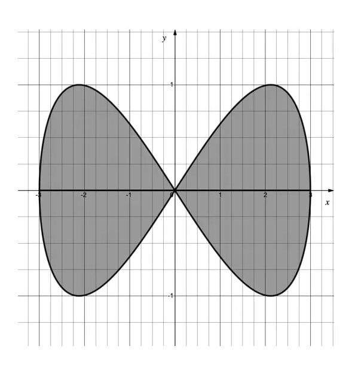

The company wishes to produce a sign of its logo and requires it to be painted, as indicated by the shading in the diagram.

The graph of the logo is defined by the parametric equations

$x=3\mathrm{cos}ty=\mathrm{sin}2t-π\leqt\leqπ$

where $x$ and $y$ are measured in metres.

(i)  Show that when $t=-π$, $x=-3$, and that when $t=-\frac{π}{2}$, $x=0$.

(ii) Find the coordinates of the point on the graph corresponding to $t=-\frac{3π}{4}$.

### 2() — 7 marks — structured
(i)  Using your results from part (a), along with the double angle formula $\mathrm{sin}2t\equiv2\mathrm{sin}t\mathrm{cos}t,$  show that the total area of the logo is given by

`4 integral subscript negative pi end subscript superscript negative pi over 2 end superscript open parentheses negative 6 cos space t space sin squared t close parentheses   straight d t`

(ii)  Hence find the total area of the logo that is to be painted.

## Q17 — medium — 8 marks · exam-questions

### 1() — 3 marks — structured
A model car travels on a model track along the path of the curve shown in the diagram below. The curve is defined by the parametric equations

$x=\mathrm{cos}t-1y=\mathrm{sin}3t0\leqt\leq8π$

where $x$ and $y$ are, respectively, the horizontal and vertical displacements in metres from the origin $O$, and  $t$ is the time in seconds.

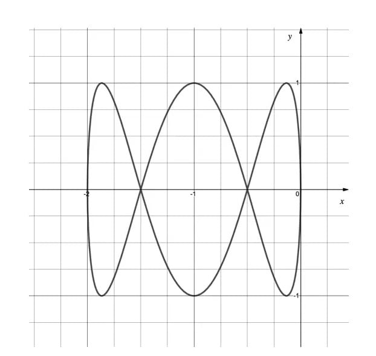

Verify that the starting position of the model car is at the origin, and find the position of the car at the times  $t=\frac{π}{2},t=π,t=\frac{3π}{2},\text{and}t=2π\text{seconds}.$

### 2() — 5 marks — structured
(i) How many laps of the track does the model car complete?

(ii) Find the times at which the model car is at the point `open parentheses negative 1 half comma 0 close parentheses`

## Q18 — medium — 8 marks · exam-questions

### 1() — 2 marks — structured
The diagram below shows part of the curve $C$ with parametric equations

$x=t^{2}-4\text{and}y=3t-6t\geq0$

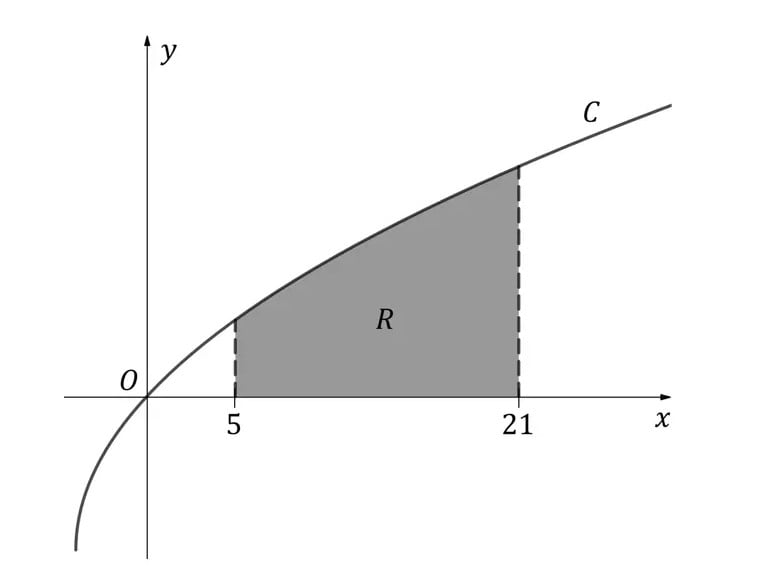

The point on the graph where $t=t_{1}$ has $x$-coordinate 5.

The point on the graph where $t=t_{2}$ has  $x$-coordinate 21.

Determine the values of $t_{1}$ and $t_{2}$, and find the coordinates of the corresponding points on  $C$.

### 2() — 6 marks — structured
The region $R$ shown in the diagram is bounded by $C$, the $x$-axis, and the lines $x=5$ and $x=21$. Region $R$ is rotated through 360° about the  $x$-axis to form a solid of revolution.

(i) Show that the volume of the solid of revolution is given by the integral

`pi integral subscript t subscript 1 end subscript superscript t subscript 2 end superscript 2 t left parenthesis 3 t minus 6 right parenthesis squared   straight d t`

(ii) Hence find the exact volume of the solid generated.

## Q19 — hard — 5 marks · exam-questions

### 1() — 3 marks — structured
Find an expression for $\frac{dy}{dx}$ in terms of t for the parametric equations

$x=\mathrm{sin}2ty=e^{t}$

### 2() — 2 marks — structured
Verify that the graph of $x$ against y passes through the point (0, 1) and find the gradient at that point.

## Q20 — hard — 7 marks · exam-questions

### 1() — 7 marks — structured
The graph defined by the parametric equations

x=5t-1             y = $\sqrt{t}$                 t≥ 0

is shown below.

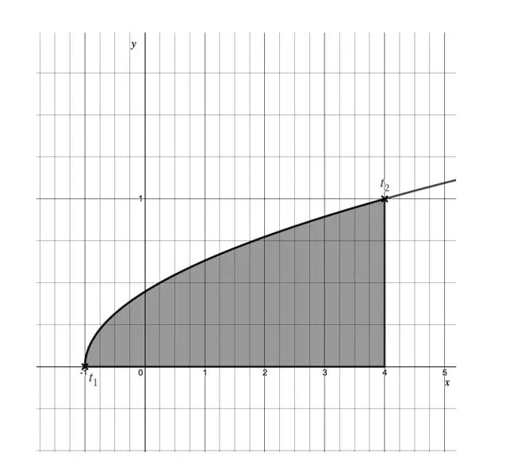

The point where t = t1 has coordinates (-1,0).

The point where t = t2 has coordinates (4, 1).

(i) Show that the shaded area can be found using the integral

`integral subscript 0 superscript 1 5 t to the power of 1 half end exponent d t`

(ii) Hence find the shaded area.

## Q21 — hard — 8 marks · exam-questions

### 1() — 3 marks — structured
A crane swings a wrecking ball along a two-dimensional path defined by the parametric equations

x = 8t -4                  y=16t2-16t + 5                       0 ≤ t ≤ 1

as shown in the diagram below.

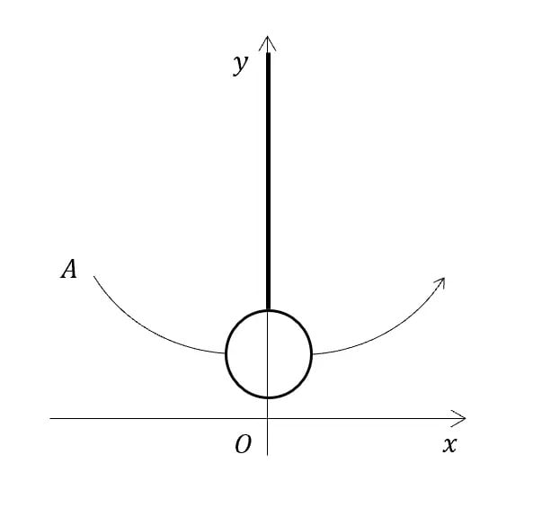

x and y are, respectively, the horizontal and vertical displacements in metres from the origin, 0, and t is the time in seconds. Point A indicates the initial position of the wrecking ball, at time t = 0.

Find a Cartesian equation of the curve in the form y = f(x), and state the domain of f(x).

### 2() — 2 marks — structured
Find the difference between the maximum and minimum heights of the wrecking ball during its motion.

### 3() — 3 marks — structured
The crane is positioned such that point A is 7 m horizontally from the wall the wrecking ball is to destroy.

Find the height at which the wrecking ball will strike the wall.

## Q22 — hard — 7 marks · exam-questions

### 1() — 3 marks — structured
The graph of the curve C shown below is defined by the parametric equations

x = 2 cos 3$θ$                  y = 5 sin $θ$                     0 ≤  $θ$ ≤ 2$π$

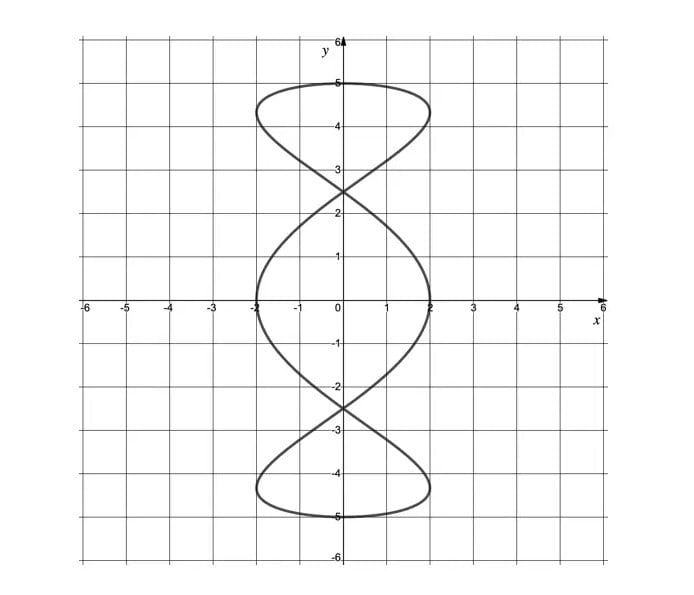

Find an expression for $\frac{dy}{dx}$ in terms of  $θ$.

### 2() — 4 marks — structured
(i) Show that the gradient of the tangent to C, at the point where $θ=\frac{π}{4}$, is $-\frac{5}{6}$.

(ii) Hence find the equation of the tangent to C at the point where  $θ=\frac{π}{4}$.

## Q23 — hard — 8 marks · exam-questions

### 1() — 3 marks — structured
The curve C has parametric equations

x =$\frac{1}{t^{2}}$                      $y=t+\frac{1}{t}$                     t>0

Find an expression, in terms of t, for $\frac{dy}{dx}$

### 2() — 5 marks — structured
(i) Find the gradient of the tangent to C at the point where t = $\frac{1}{2}$

(ii) Hence find the equation of the normal to C at the point where t = $\frac{1}{2}$

## Q24 — hard — 7 marks · exam-questions

### 1() — 4 marks — structured
The curve C has parametric equations

$x=t^{2}-4y=3t$

Show that at the point (0, 6), $t=2$ and find the value of $\frac{dy}{dx}$ at this point.

### 2() — 3 marks — structured
The tangent at the point (0, 6) is parallel to the normal at the point P.

Find the exact coordinates of point P

## Q25 — hard — 10 marks · exam-questions

### 1() — 10 marks — structured
A curve C has parametric equations

$x=9-t^{2}y=5-t$

The tangents to C at the points R and S meet at the point T, as shown in the diagram below.

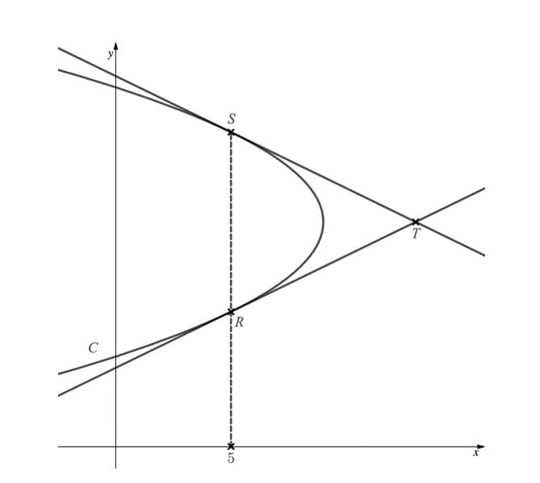

Given that the x-coordinate of both points R and S is 5, find the area of the triangle RST.

## Q26 — hard — 11 marks · exam-questions

### 1() — 3 marks — structured
A model car travels on a model track along the path of the curve shown in the diagram below. The curve is defined by the parametric equations

$x=1+\mathrm{cos}ty=1+\mathrm{sin}3t0\leqt\leq10π$

where $x$ and $y$ are, respectively, the horizontal and vertical displacements in metres from the origin $O$, and  $t$is the time in seconds.

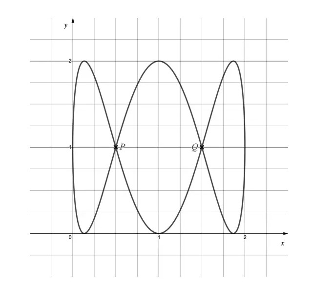

(i)  Write down the coordinates of the starting position of the model car.

(ii) Indicate on the graph in which direction the model car travels.

(iii) How many laps of the track will the model car complete?

### 2() — 4 marks — structured
Find the times during the first lap at which the model car is at a “crossroads” – indicated by points $P$ and $Q$ on the graph.

### 3() — 4 marks — structured
Find the speed of the model car at the start of the final lap.

## Q27 — hard — 8 marks · exam-questions

### 1() — 2 marks — structured
The diagram below shows the curve $C$ with parametric equations

$x=4-3\mathrm{cos}t\text{and}y=2\mathrm{sin}t\text{for}0\leqt\leqπ$

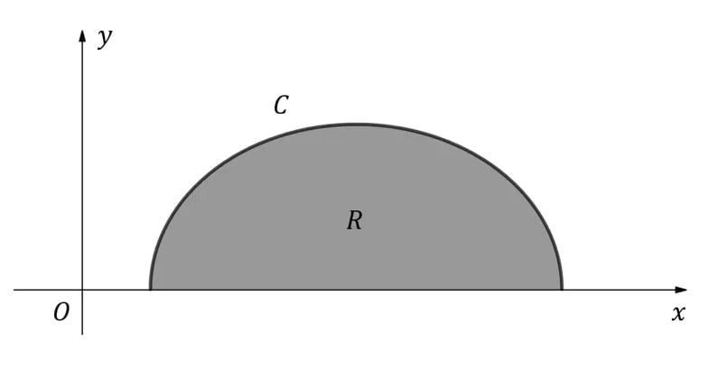

Find the coordinates of the points where $C$ intersects the $x$-axis, and determine the corresponding values of  $t$.

### 2() — 6 marks — structured
The region $R$ shown in the diagram is bounded by $C$ and the $x$-axis. Region $R$ is rotated through $2π$ radians about the $x$-axis to form a solid of revolution.

(i)  Show that the volume of the solid of revolution is given by the integral

`pi integral subscript 0 superscript pi 12 sin t open parentheses 1 minus cos squared t close parentheses   d t`

(ii)  Hence find the exact volume of the solid generated.

## Q28 — very_hard — 6 marks · exam-questions

### 1() — 6 marks — structured
The shaded area in the diagram below is bounded on three of its sides by the $x$-axis, the $y$-axis, and the line $x=1$. On the remaining side, the boundary is defined by the parametric equations

$x=2\mathrm{cos}ty=\frac{9t^{2}}{π^{2}}0\leqt\leq\frac{π}{2}$

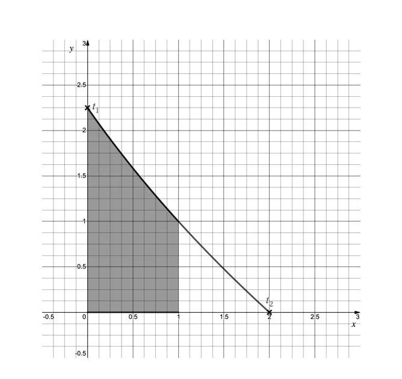

Show that the shaded area is not a trapezium.

In your work, you may use without proof the result

`integral subscript pi over 2 end subscript superscript pi over 3 end superscript t squared sin t   d t equals negative 1 over 18 pi squared minus open parentheses 1 minus fraction numerator square root of 3 over denominator 3 end fraction close parentheses pi plus 1`

## Q29 — very_hard — 8 marks · exam-questions

### 1() — 4 marks — structured
A crane swings a wrecking ball along a two-dimensional path defined by the parametric equations

$x=10ty=4.9t^{2}-4.9t+20\leqt\leq1$

as shown in the diagram below.

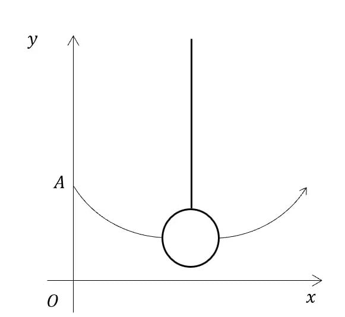

*x* and *y* are, respectively, the horizontal and vertical displacements in metres from the origin, *O*, and *t* is the time in seconds. Point *A* indicates the initial position of the wrecking ball.

(i) Write down the height of the wrecking ball when it is at point *A*.

(ii) Find the shortest distance between the wrecking ball and the ground during its motion.

### 2() — 4 marks — structured
The destruction of a building requires the wrecking ball to strike it at a height of 1.4 m whilst on the upward part of its path.
Find the horizontal distance from point *A* at which the ball hits the building.

## Q30 — very_hard — 7 marks · exam-questions

### 1() — 3 marks — structured
The graph of the ellipse *E* shown below is defined by the parametric equations:

`x equals 2 cos open parentheses theta plus pi over 3 close parentheses comma    y equals 4 sin theta comma    minus pi less or equal than theta less or equal than pi`

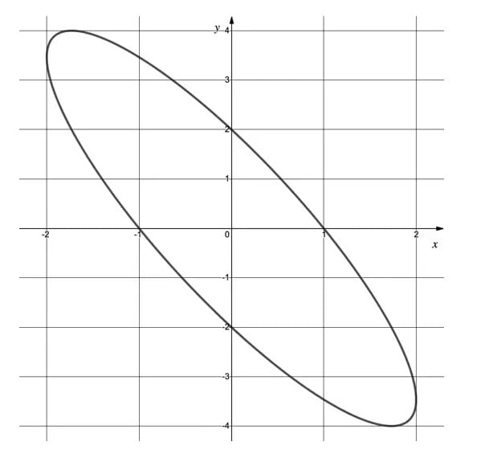

Find an expression for $\frac{dy}{dx}$ in terms of $θ$.

### 2() — 4 marks — structured
Find the equation of the tangent to *E*, at the point where $θ=-\frac{π}{6}$, giving your answer in the form  $y=a-bx$, where  $a$ and  $b$are real numbers that should be given in exact form.

## Q31 — very_hard — 9 marks · exam-questions

### 1() — 9 marks — structured
The curve  $C$ has parametric equations

$x=3ty=t+\frac{1}{t}t>0$

Find the equation of the normal to  $C$ at the point where  $C$ intersects the line

`equation`$y=x.$`equation`

## Q32 — very_hard — 6 marks · exam-questions

### 1() — 6 marks — structured
The graph of the curve defined by the parametric equations

$x=e^{2t}y=e^{-3t}\,$

is shown below.

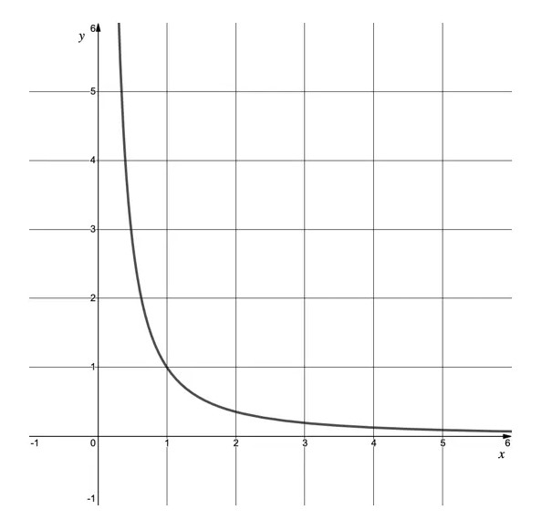

(i) Verify that the graph passes through the point $(1,1)$.

(ii) Prove that the line with equation  $y=x$ is **not** the normal to the curve at the point $(1,1)$.

## Q33 — very_hard — 10 marks · exam-questions

### 1() — 2 marks — structured
The diagram below shows a sketch of the curve defined by the parametric equations

$x=3\mathrm{cos}ty=5\mathrm{sin}2t0\leqt\leq2π$

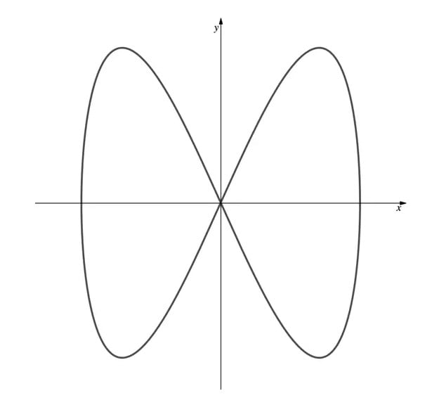

(i) Write down the equations of the two horizontal tangents to the curve.
(ii) Write down the equations of the two vertical tangents to the curve.

### 2() — 8 marks — structured
The four tangents from part (a) create a rectangle around the curve as shown below.

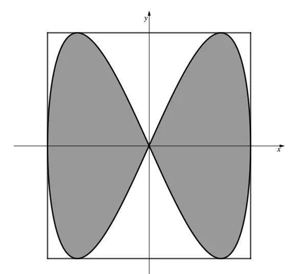

Find the percentage of the area of the rectangle enclosed by the curve (the shaded area on the diagram).

## Q34 — very_hard — 8 marks · exam-questions

### 1() — 5 marks — structured
The diagram below shows a sketch of the curve defined by the parametric equations

$x=4ty=e^{t^{2}}$

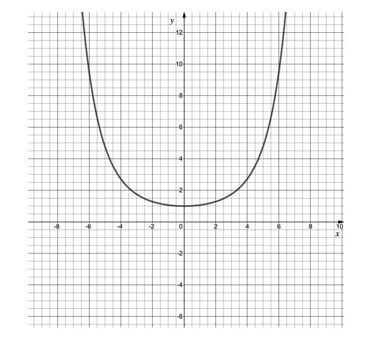

The tangents to the curve that pass through the origin meet the curve at points  $A$and $B$.

Show that the values of $t$ at points $A$ and  $B$are  $t=-\frac{\sqrt{2}}{2}\text{and}t=\frac{\sqrt{2}}{2}.$

### 2() — 3 marks — structured
Hence, or otherwise, show that the area of the triangle $OAB$ is $2\sqrt{2}e^{\frac{1}{2}}$square units

## Q35 — very_hard — 9 marks · exam-questions

### 1() — 3 marks — structured
A model car travels on a model track along the path of the curve shown in the diagram below. The curve is defined by the parametric equations:

$x=\mathrm{cos}ty=\mathrm{sin}3t0\leqt\leq20π$

where  $x$and $y$ are, respectively, the horizontal and vertical displacements in metres from the origin $O$, and $t$`equation` is the time in seconds.

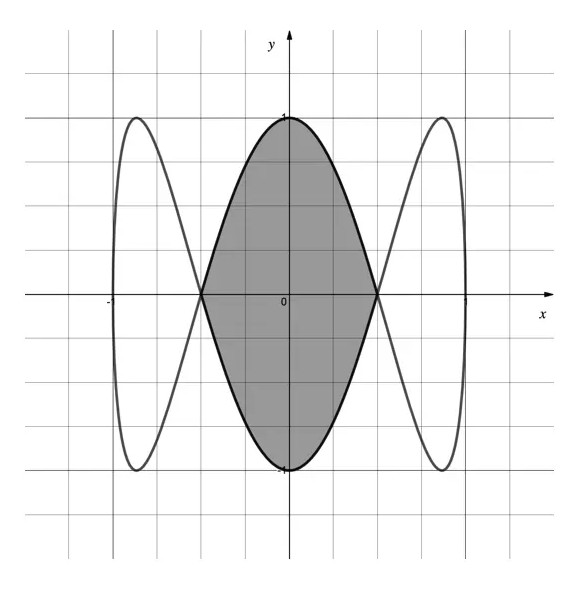

(i) Write down the coordinates of the starting position of the model car.
(ii) Indicate on the graph in which direction the model car travels.
(iii) How many laps of the track will the model car complete?

### 2() — 6 marks — structured
A second track is to be constructed within the central area of the original track, indicated by shading on the graph above.
The design for the second track requires an area of at least $1.25m^{2}$ .

Determine if there is sufficient room for the second track to be built within the central area of the original track.

In your work, you may use without proof the result:

`integral sin space t space sin 3 t   d t equals cos space t space sin cubed t plus c`

where $c$ is a constant of integration.

## Q36 — very_hard — 7 marks · exam-questions

### 1() — 7 marks — structured
The diagram below shows the curve $C$ with parametric equations

$x=k\mathrm{sin}t\text{and}y=\mathrm{cos}^{4}t\sqrt{\mathrm{sin}t}\frac{π}{2}\leqt\leqπ$

where $k>0$is a constant.

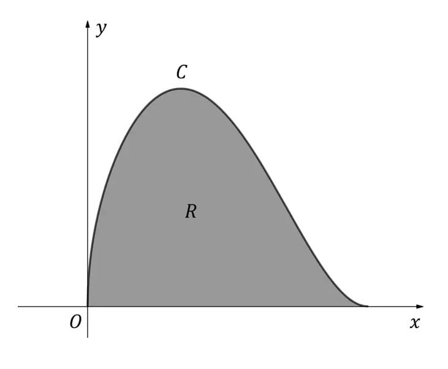

The region $R$ shown in the diagram is bounded by $C$ and the $x$-axis. Region $R$ is rotated through $2π$ radians about the $x$-axis to form a solid of revolution.

Given that the volume of the solid generated is 10 cubic units, determine the exact value of $k$.
