# Exam Questions — Parametric Equations
**Parametric Equations** · Edexcel International A Level (IAL) Maths (YMA01) — Pure 4
> Source: [https://www.savemyexams.com/international-a-level/maths/edexcel/20/pure-4/topic-questions/parametric-equations/parametric-equations/exam-questions/](https://www.savemyexams.com/international-a-level/maths/edexcel/20/pure-4/topic-questions/parametric-equations/parametric-equations/exam-questions/) · 32 questions · total 194 marks

## Q1 — easy — 4 marks · exam-questions

### 1() — 2 marks — structured
The curve $C$ has parametric equations $x=4t$ and  $y=t^{2}$.

Complete the table below.

| *t* | -2 | -1 | 0 | 1 | 2 |
|---|---|---|---|---|---|
| *x* |   |   |   |   |   |
| *y* |   |   |   |   |   |

### 2() — 2 marks — structured
Plot the graph of *C* on the axes below.

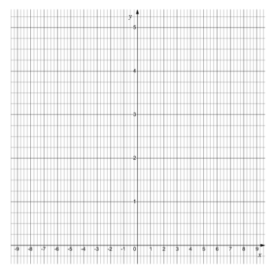

## Q2 — easy — 5 marks · exam-questions

### 1() — 1 mark — structured
A company’s logo is created using an arc of a circle as shown in the diagram below.

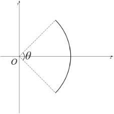

When the end points of the arc are joined to the origin, they form the minor sector of a circle with angle *θ*  radians at the centre.

The arc is formed using the parametric equations  $x=\mathrm{sin}t$  and  $y=\mathrm{cos}t$, with domain $\frac{π}{4}\leqt\leq\frac{3π}{4}$.

Write down the size of the angle *θ*.

### 2() — 3 marks — structured
(i) By finding both $x^{2}$ and $y^{2}$ show that  $x^{2}+y^{2}=1$.

(ii) Hence write down the radius of the sector.

### 3() — 1 mark — structured
Use the formula “*l = r θ”* to find the length of the arc.

## Q3 — easy — 3 marks · exam-questions

### 1() — 3 marks — structured
A curve *C* has parametric equations  $x=t-3$  and  $y=t^{2}-4$.

Find a Cartesian equation for the curve *C* in the form $y=f(x)$.

## Q4 — easy — 6 marks · exam-questions

### 1() — 4 marks — structured
A curve is defined parametrically by the equations $x=2\mathrm{sin}θ$   and  $y=2\mathrm{cos}θ$ .

(i) Find expressions, in terms of *θ*, for $x^{2}$and $y^{2}$.

(ii) Hence find the Cartesian equation for the curve.

### 2() — 2 marks — structured
Describe the shape of the curve.

## Q5 — easy — 5 marks · exam-questions

### 1() — 2 marks — structured
A sketch of the graph with parametric equations  $x=4t-8$ and  $y=t^{2}-1$ is shown below.

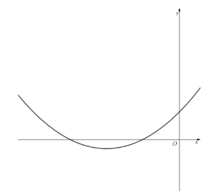

Find the value of *t *when $x=0$ and hence write down the coordinates of the *y*-axis intercept.

### 2() — 3 marks — structured
Find the values of *t* when $y=0$ and hence write down the coordinates of the *x*-axis intercepts.

## Q6 — easy — 11 marks · exam-questions

### 1() — 2 marks — structured
A curve *C* is defined by the parametric equations  $x=t+1$  and $y=t^{2}-1$.

Show that the equation of the curve can be given in the Cartesian form `space y equals straight f open parentheses x close parentheses`, with `space straight f open parentheses x close parentheses equals x squared minus 2 x`.

### 2() — 3 marks — structured
Sketch the graph of  $y=f(x)$, labelling any points where the graph intercepts the coordinate axes.

### 3() — 4 marks — structured
(i) Find  $\frac{dy}{dx}$ and  $\frac{d^{2}y}{dx^{2}}$.

(ii) Hence show the coordinates of the minimum point on the graph of  $y=f(x)$  are (1 , -1).

### 4() — 2 marks — structured
Given $t\inℝ$, write down the domain and range of $f(x)$.

## Q7 — easy — 4 marks · exam-questions

### 1() — 4 marks — structured
The curve defined parametrically by  $x=pt^{3}$  and  $y=2t+1$, where $p$ is a non-zero constant, passes through the point $Q$ (16 , 5).

(i) Show that at point *Q*,$t=2$.

(ii) Hence show that $p=2$.

## Q8 — easy — 6 marks · exam-questions

### 1() — 2 marks — structured
A curve *C *is defined by the parametric equations  $x=e^{t}$  and `space y equals vertical line t vertical line`, where $t\inℝ$.

Show that$y=f(x)$, where `straight f open parentheses x close parentheses equals open vertical bar ln space x close vertical bar` .

### 2() — 2 marks — structured
Sketch the graph of *C*, labelling any points where the graph intercepts the coordinate axes.

### 3() — 2 marks — structured
Determine the domain and range for the function $f(x)$.

## Q9 — medium — 4 marks · exam-questions

### 1() — 2 marks — structured
The curve *C* has parametric equations

$x=t^{3}$  and $y=t^{2}$

Complete the table below.

| *t* | -2 | -1 | 0 | 1 | 2 |
|---|---|---|---|---|---|
| *x* |   |   |   |   |   |
| *y* |   |   |   |   |   |

### 2() — 2 marks — structured
Plot the graph of *C* on the axes below.

## Q10 — medium — 6 marks · exam-questions

### 1() — 6 marks — structured
A company’s logo is created using an arc of a circle as shown in the diagram below.

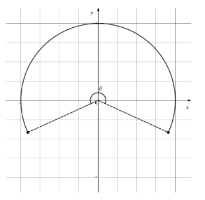

When the end points of the arc are joined to the origin, they form the major sector of a circle with angle $θ$ radians at the centre.

The arc is formed using the parametric equations

$x=\mathrm{sin}t$              $y=\mathrm{cos}t$

with domain  $-2\leqt\leq2.$

Find the size of the angle $θ$, as well as the length of the arc used in the logo.

## Q11 — medium — 3 marks · exam-questions

### 1() — 3 marks — structured
A curve *C* has parametric equations

$x=2t-1$   $y=4t^{2}+3$

Find a Cartesian equation for the curve *C* in the form `y equals f open parentheses x close parentheses`.

## Q12 — medium — 4 marks · exam-questions

### 1() — 4 marks — structured
(i) Find the Cartesian equation for the curve defined by the parametric equations

$x=4\mathrm{cos}θ$   $y=4\mathrm{sin}θ$

(ii) Describe the shape of the curve.

## Q13 — medium — 8 marks · exam-questions

### 1() — 2 marks — structured
A sketch of the graph with parametric equations

$x=t^{2}-4$    $y=3t$

is shown below.

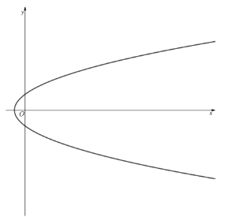

Find the value of *t *when$y=0$and hence write down the coordinates of the *x*-axis intercept.

### 2() — 3 marks — structured
Find the values of *t* when$x=0$and hence write down the coordinates of the *y*-axis intercepts.

### 3() — 3 marks — structured
Find the coordinates of the points where the graph intersects the line with equation $x=12$.

## Q14 — medium — 7 marks · exam-questions

### 1() — 2 marks — structured
A curve *C* is defined by the parametric equations

$x=t^{2}+1$   $y=t^{2}-1$

Show that the equation of the curve can be given in the Cartesian form `y equals straight f open parentheses x close parentheses`,  with  `straight f open parentheses x close parentheses equals x minus 2`.

### 2() — 2 marks — structured
Assuming there are no restrictions on the values of* t*, find the domain and range of $f(x)$.

### 3() — 3 marks — structured
Sketch the graph of $y=f(x)$.

## Q15 — medium — 5 marks · exam-questions

### 1() — 3 marks — structured
The curve defined parametrically by

$x=pt^{3}$    $y=pt^{2}$

where *p* is a non-zero constant, passes through the point $Q$ (3 , -3).

Show that at point $Q$,$t=-1$.

### 2() — 2 marks — structured
Hence, or otherwise, find the value of *p*.

## Q16 — medium — 7 marks · exam-questions

### 1() — 2 marks — structured
A curve *C* is defined by the parametric equations

$x=\mathrm{cos}^{2}t$    $y=\mathrm{sin}^{2}t$    $-π\leqt\leqπ$

Show that$y=1-x$.

### 2() — 2 marks — structured
Determine the ranges of *x* and *y* in the given domain of *t*.

### 3() — 3 marks — structured
Sketch the graph of *C*.

## Q17 — hard — 4 marks · exam-questions

### 1() — 4 marks — structured
The curve *C* has parametric equations

$x=t^{2}$   and   $y=e^{t}$

(i) Complete the table below.

Give values to three significant figures where appropriate.

| *t* | -3 | -2 | -1 | 0 | 1 | 2 |
|---|---|---|---|---|---|---|
| *x* |   |   |   |   |   |   |
| *y* |   |   |   |   |   |   |

(ii) Plot the graph of *C* on the axes below.

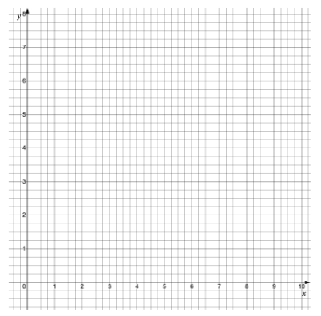

## Q18 — hard — 3 marks · exam-questions

### 1() — 3 marks — structured
A company’s logo is created using an arc of a circle and a straight line as shown in the diagram below.

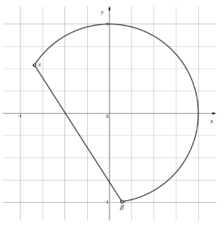

The arc part of the logo is formed using the parametric equations

$x=\mathrm{sin}ϕ$    $y=\mathrm{cos}ϕ$

with domain  -$1\leqϕ\leq3.$

Find the equation of the line passing through points *A* and *B*, stating values to three significant figures where appropriate.

## Q19 — hard — 3 marks · exam-questions

### 1() — 3 marks — structured
Find a Cartesian equation for the curve that has parametric equations

$x=4t^{2}+1$    $y=\mathrm{ln}2t$   $t>0$

giving your answer in the form $y=f(x).$

## Q20 — hard — 8 marks · exam-questions

### 1() — 5 marks — structured
A curve is defined by the parametric equations

$x=2\mathrm{cos}3θ+3$    $y=2\mathrm{sin}3θ-2.$

By changing these equations into Cartesian form, show that this is the equation of a circle, and determine its centre and radius.

### 2() — 3 marks — structured
(i) Given that *θ* is non-negative, write down a minimum possible domain for *θ* that will produce a complete circle.

(ii) Give a restricted domain for *θ* that would create a semicircle.

## Q21 — hard — 9 marks · exam-questions

### 1() — 5 marks — structured
A sketch of the graph with parametric equations

$x=t^{2}+4t$    $y=t^{2}-1$

is shown below.

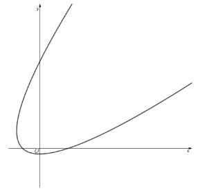

Find the coordinates of all points where the graph intersects the coordinate axes.

### 2() — 4 marks — structured
Find the coordinates of the points where the graph intersects the line with equation $x-5y+19=0$.

## Q22 — hard — 7 marks · exam-questions

### 1() — 3 marks — structured
A curve *C *is defined by the parametric equations

$x=t^{4}-4t^{2}$    $y=4t$    $t\inℝ$

Show that the Cartesian equation of $C$ can be written in the form `x equals space 1 over 256 space straight f open parentheses y close parentheses`, where `straight f open parentheses y close parentheses` is a function of *y*.

### 2() — 4 marks — structured
Sketch the curve *C.*

## Q23 — hard — 4 marks · exam-questions

### 1() — 4 marks — structured
The curve defined parametrically by

$x=pt^{3}+4$     $y=pt^{2}-2$

where $p$ is a constant, passes through the point (139 , 43).

Find the value of $p$.

## Q24 — hard — 8 marks · exam-questions

### 1() — 5 marks — structured
A curve *C* is defined by the parametric equations

$x=\mathrm{arccos}t$      $y=\sqrt{1-t^{2}}$    $-1\leqt\leq1$

(i) Determine the ranges of *x* and *y* in the given domain of *t*.

(ii) Show that $y=\mathrm{sin}x$.

### 2() — 3 marks — structured
Sketch the graph of *C*.

## Q25 — very_hard — 5 marks · exam-questions

### 1() — 5 marks — structured
The curve *C* has parametric equations

`space x equals t ln open parentheses space t squared plus 0.75 space close parentheses`     and    $y=t$

(i) Complete the table below.

Give values to three significant figures where appropriate.

| *t* | -3 | -2 | -1 | -0.5 | 0 | 0.5 | 1 | 2 | 3 |
|---|---|---|---|---|---|---|---|---|---|
| *x* |   |   |   |   |   |   |   |   |   |
| *y* |   |   |   |   |   |   |   |   |   |

(ii) Plot the graph of *C* on the axes below.

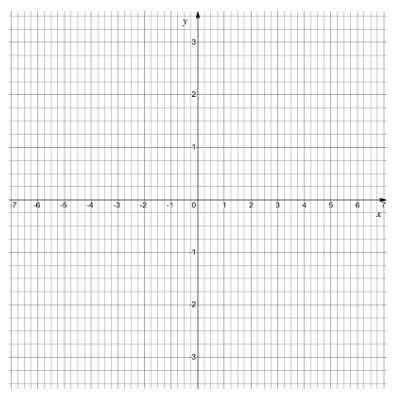

## Q26 — very_hard — 4 marks · exam-questions

### 1() — 4 marks — structured
A company’s logo is a major arc of an ellipse as shown in the diagram below.

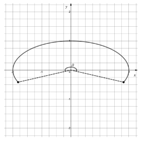

When the end points of the arc are connected to the origin, they form an elliptic sector with angle $θ$ radians at the centre.

The logo is formed using the parametric equations

$x=2\mathrm{sin}ϕ$          $y=\mathrm{cos}ϕ$

with domain $-2\leqϕ\leq2.$

Find the angle $θ$, giving your answer to three significant figures.

## Q27 — very_hard — 7 marks · exam-questions

### 1() — 4 marks — structured
Find a Cartesian equation for the curve that has parametric equations

$x=(\mathrm{ln}2t)^{2}$          $y=t\mathrm{sin}2t$         $t\geq\frac{1}{2}$

giving your answer in the form $y=f(x)$.

### 2() — 3 marks — structured
(i) For the curve in part (a), explain why the domain must be restricted to$t>0$.

(ii) How would your answer to part (a) change if the domain were changed to  $0<t<\frac{1}{2}$ ?

## Q28 — very_hard — 10 marks · exam-questions

### 1() — 6 marks — structured
A curve is defined by the parametric equations

$x=a\mathrm{cos}2t+p$         $y=b\mathrm{sin}2t+q$

where *a* and *b* are non-zero constants, and *p* and *q* are constants.

(i) Show that if `vertical line a vertical line equals vertical line b vertical line` then this is the equation of a circle, giving the equation of the circle in Cartesian form.

(ii) State the centre and radius of the circle.

### 2() — 4 marks — structured
In the case where  $a=-6$ and  $b=6$, the curve is used to represent the position of a robot at time *t*.

(i) Find the total distance travelled by the robot between times $t=0$and $t=2π$.

(ii) In which direction (clockwise or anticlockwise) does the robot traverse the curve?

## Q29 — very_hard — 12 marks · exam-questions

### 1() — 6 marks — structured
A sketch of the graph with parametric equations

$x=\mathrm{cos}2ϕ$         $y=\mathrm{sin}3ϕ$          $\frac{π}{2}\leqϕ\leq\frac{3π}{2}$

is shown below.

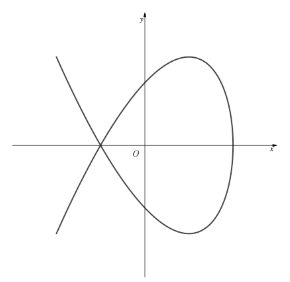

Find the coordinates of the points where the graph crosses the coordinate axes.

### 2() — 6 marks — structured
Find the coordinates of the points where the graph intersects the square with vertices at (-1 , 1), (1 , 1), (1 , -1), (-1 , -1).

## Q30 — very_hard — 9 marks · exam-questions

### 1() — 2 marks — structured
A curve *C* has parametric equations

$x=t^{2}-4$         $y=t^{3}-4t$          $t\inℝ$

Determine the ranges of *x* and *y* in the given domain of *t*.

### 2() — 3 marks — structured
Show that the Cartesian equation of *C* can be written in the form  $y^{2}=x^{2}(x+4).$

### 3() — 4 marks — structured
Sketch the graph of  *C*.

## Q31 — very_hard — 4 marks · exam-questions

### 1() — 4 marks — structured
The curve defined parametrically by

$x=mt^{3}-6$         $y=mt+t^{2}$

where $m$ is a constant, passes through the point (-22 , 0).

Find the possible values of $m$.

## Q32 — very_hard — 9 marks · exam-questions

### 1() — 3 marks — structured
Show that $\mathrm{cos}θ-\sqrt{3}\mathrm{sin}θ$ can be written as `2 cos space open parentheses theta plus pi over 3 close parentheses` .

### 2() — 6 marks — structured
A curve *C* is defined by the parametric equations

$x=θ+\frac{π}{3}$         $y=\mathrm{cos}θ-\sqrt{3}\mathrm{sin}θ$       $0\leqθ\leq2π$

Sketch the graph of *C*, showing clearly the beginning and end points of the curve, as well as the points of intersection with the coordinate axes and any minimum and maximum points.
