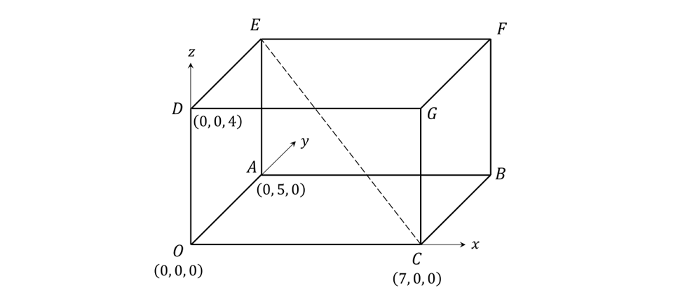
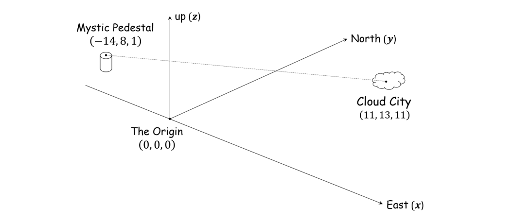
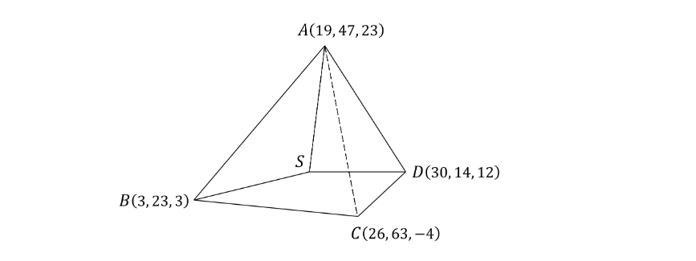

# Exam Questions — Vector Equations of Lines & The Scalar Product
**Vectors** · Edexcel International A Level (IAL) Maths (YMA01) — Pure 4
> Source: [https://www.savemyexams.com/international-a-level/maths/edexcel/20/pure-4/topic-questions/vectors/vector-lines-and-scalar-product/exam-questions/](https://www.savemyexams.com/international-a-level/maths/edexcel/20/pure-4/topic-questions/vectors/vector-lines-and-scalar-product/exam-questions/) · 34 questions · total 207 marks

## Q1 — easy — 4 marks · exam-questions

### 1() — 2 marks — structured
The equation of a line is given in vector form as follows `bold r equals 2 bold i plus 6 bold j plus t open parentheses 7 bold i plus 3 bold j close parentheses. space`

Explain briefly what the vectors  `open parentheses space 2 bold i plus 6 bold j space space close parentheses`and  `open parentheses 7 bold i plus 3 bold j close parentheses`**  **in the equation above tell us, respectively, about the line.

### 2() — 2 marks — structured
Write down, in vector form, the equation of the line passing through `space open parentheses 1 comma space 4 close parentheses` in the same direction as $(i\mathrm{+3}j).$

## Q2 — easy — 4 marks · exam-questions

### 1() — 4 marks — structured
A line passes through the two points  `A open parentheses 3 comma space minus 2 close parentheses`  and `space B open parentheses 5 comma space 7 close parentheses`.

(i) Write down the position vectors  $\overset{\rightarrow}{OA}$and $\overset{\rightarrow}{OB}$ of the two points.

(ii) Use the vector relation  $\overset{\rightarrow}{AB}=\overset{\rightarrow}{OB}-\overset{\rightarrow}{OA}$  to find vector $\overset{\rightarrow}{AB}$.

(iii) Use your answers from (i) and (ii) to write down an equation of the line in vector form.

## Q3 — easy — 5 marks · exam-questions

### 1() — 2 marks — structured
Write down in vector form the equation of the line through the point  `open parentheses 1 comma space 3 comma space minus 6 close parentheses`  in the direction  $4i-j+2k$.

### 2() — 3 marks — structured
By first calculating the vectors  $\overset{\rightarrow}{OA},\overset{\rightarrow}{OB}$  and  $\overset{\rightarrow}{AB}$,  find a vector equation of the line passing through the two points  `A open parentheses 1 comma space 3 comma space 1 space close parentheses` and `space B open parentheses 3 comma space 4 comma space minus 3 close parentheses`

## Q4 — easy — 4 marks · exam-questions

### 1() — 4 marks — structured
$A$ and $B$ are the points on the line `bold space bold r equals open parentheses table row 2 row cell negative 1 end cell row 3 end table close parentheses space plus t open parentheses table row 0 row 4 row cell negative 3 end cell end table close parentheses`with $t=1$ and $t=3$ respectively.

(i) Find the position vectors $\overset{\rightarrow}{OA}$and $\overset{\rightarrow}{OB}$.

(ii) By first finding the vector  $\overset{\rightarrow}{AB}$,  calculate the modulus  `open vertical bar stack A B with rightwards arrow on top close vertical bar`.

## Q5 — easy — 6 marks · exam-questions

### 1() — 3 marks — structured
The coordinates of three points are  `A open parentheses 2 comma space minus 1 comma space 3 close parentheses`,  `space B open parentheses 1 comma space minus 2 comma space 5 space space close parentheses`and  `C open parentheses 6 comma space 3 comma space 1 close parentheses`.

Find  $\overset{\rightarrow}{AB}$  and  $\overset{\rightarrow}{AC}$, and calculate  `open vertical bar stack A B with rightwards arrow on top close vertical bar`  and  `open vertical bar stack A C with rightwards arrow on top close vertical bar` .

### 2() — 1 mark — structured
For two vectors $a=a_{1}i+a_{2}j+a_{3}k$  and $b=b_{1}i+b_{2}j+b_{3}k$,  the *scalar product*  $a.b$  can be calculated using the formula

$a.b=a_{1}b_{1}+a_{2}b_{2}+a_{3}b_{3}$

Calculate the scalar product  $\overset{\rightarrow}{AB.}\overset{\rightarrow}{AC}.$

### 3() — 2 marks — structured
A defining property of the scalar product of two vectors  $a$  and  $b$  is

`bold a bold. bold b equals stretchy vertical line a stretchy vertical line stretchy vertical line b stretchy vertical line cos space theta`

where $θ$ is the angle between the two vectors.

Using this relationship, along with your answers to parts (a) and (b), find the angle between the vectors  $\overset{\rightarrow}{AB}$ and  $\overset{\rightarrow}{AC}$.

Give your answer in degrees correct to 1 decimal place.

## Q6 — easy — 4 marks · exam-questions

### 1() — 2 marks — structured
For two vectors  $a$  and $b$**,**  the definition of the *scalar product * $a.b$*** *** is

`equation`

Write down  `cos space open parentheses 90 degree close parentheses` ,  and explain why this value of cosine shows that if  $a$  and  $b$  are perpendicular then  $a.b=0.$

### 2() — 2 marks — structured
For  $a=a_{1}i+a_{2}j+a_{3}k$  and $b=b_{1}i+b_{2}j+b_{3}k$,  the scalar product can be calculated using the formula

$a.b=a_{1}b_{1}+a_{2}b_{2}+a_{3}b_{3}$

Additionally it can be shown that if $a.b=0$ then  $a$  and  $b$ are perpendicular.

Use the above results to prove that the vectors $\overset{\rightarrow}{AB}=-3i+j+5k$ and $\overset{\rightarrow}{AC}=i-7j+2k$are perpendicular.

## Q7 — easy — 6 marks · exam-questions

### 1() — 2 marks — structured
Two lines $l$ and $m$ have equations `space bold r equals bold i plus bold j plus 3 bold k plus s open parentheses bold i minus bold j plus bold k space space close parentheses` and `bold r equals bold i minus 2 bold j plus 2 bold k plus t open parentheses bold 2 bold i plus bold j plus 3 bold k close parentheses`  respectively.  The two lines intersect at a point $P$.

Explain why, at point $P$, the values of the parameters $s$ and $t$ must satisfy the vector equation

`open parentheses table row cell 1 plus s end cell row cell 1 minus s end cell row cell 3 plus s end cell end table close parentheses equals open parentheses table row cell 1 plus 2 t end cell row cell negative 2 plus t end cell row cell 2 plus 3 t end cell end table close parentheses`

### 2() — 3 marks — structured
Solve the simultaneous equations $1+s=1+2t$and  $1-s=-2+t,$and show that the values found for $s$ and $t$also satisfy the equation  $3+s=2+3t.$

### 3() — 1 mark — structured
Hence, find the coordinates of the point $P$.

## Q8 — easy — 6 marks · exam-questions

### 1() — 2 marks — structured
Two lines $l$ and $m$ have equations `bold space bold r equals 6 bold i minus 2 bold j plus bold k plus s open parentheses bold i plus bold j minus bold k close parentheses`  and `space bold space bold r equals 3 bold i plus 3 bold j minus 2 bold k plus straight t open parentheses bold 3 bold i minus bold j plus bold k space close parentheses` respectively.

Show that if the two lines intersect, then at the point of intersection the parameters $s$ and $t$ must satisfy the vector equation

`open parentheses table row cell 6 plus s end cell row cell negative 2 plus s end cell row cell 1 minus s end cell end table close parentheses space equals space open parentheses table row cell 3 plus 3 t end cell row cell 3 minus t space end cell row cell negative 2 plus t end cell end table close parentheses`

### 2() — 3 marks — structured
Solve the simultaneous equations  $6+s=3+3t$ and  $-2+s=3-t,$  and show that the values found for $s$ and $t$do **not** also satisfy the equation $1-s=-2+t.$

### 3() — 1 mark — structured
What do the results of part (b) tell you about the lines $l$ and $m$?

## Q9 — easy — 9 marks · exam-questions

### 1() — 2 marks — structured
The line $l$ has equation  `space bold r equals open parentheses table row 2 row cell negative 3 end cell row 4 end table close parentheses plus s space open parentheses table row 1 row 2 row cell negative 1 end cell end table close parentheses
`.

Point $N$ is the point on line $l$ such that the line connecting $N$ and the point  `P open parentheses 1 comma space 7 comma space 5 close parentheses` is perpendicular to $l$.

Explain why  `stack O N with rightwards arrow on top equals open parentheses 2 plus s space
minus 3 plus 2 s space
4 minus s space space close parentheses
` for some value of the parameter  $s,$  and use that expression for $\overset{\rightarrow}{ON}$  to show that the vector  $\overset{\rightarrow}{NP}$  is given in terms of  $s$  by

`stack N P with rightwards arrow on top equals open parentheses negative 1 minus s space
10 minus 2 s space
1 plus s close parentheses`

### 2() — 2 marks — structured
Using the properties of the scalar product, explain why the value of  $s$  corresponding to point  $N$  must satisfy the equation

`open parentheses negative 1 minus s space
10 minus 2 s space
1 plus s close parentheses. open parentheses space 1 space
2 space
minus 1 space close parentheses equals 0`

### 3() — 3 marks — structured
By solving the equation in part (b), determine the coordinates of point  $N$.

### 4() — 2 marks — structured
Given that the shortest distance from a point to a line is the perpendicular distance,  find the shortest distance from point $P$ to the line $l$.  You should give your answer as an exact value.

## Q10 — medium — 5 marks · exam-questions

### 1() — 3 marks — structured
Find the equation of each of these lines in vector form.

The line joining $(4,1)$ to $(7,6)$.

### 2() — 2 marks — structured
The line passing through $(2,5)$ in the same direction as $2i+j$.

## Q11 — medium — 7 marks · exam-questions

### 1() — 5 marks — structured
Find the equation of each of these lines in vector form.

(i) Through $(3,1,-2)$ in the direction `open parentheses table row 0 row 1 row 5 end table close parentheses`

(ii) Through $(2,0,7)$ and $(5,2,-3)$.

### 2() — 2 marks — structured
Show that the point $(-4,-4,27)$ lies on the line found in part (a) (ii).

## Q12 — medium — 4 marks · exam-questions

### 1() — 4 marks — structured
$A$ and $B$ are the points on the line `bold italic r equals open parentheses table row 3 row cell negative 2 end cell row 5 end table close parentheses plus t open parentheses table row 1 row 3 row cell negative 1 end cell end table close parentheses`   with $t=4$ and $t=7$ respectively.

(i) Find the position vectors $\overset{\rightarrow}{OA}$ and $\overset{\rightarrow}{OB}$.

(ii) Find `open vertical bar stack A B with rightwards arrow on top close vertical bar`.

## Q13 — medium — 7 marks · exam-questions

### 1() — 2 marks — structured
The coordinates of three points are $A(1,0,-4),B(3,-1,6)$and  $C(-2,5,7)$.

Find $\overset{\rightarrow}{AB}$ and  $\overset{\rightarrow}{AC}$.

### 2() — 3 marks — structured
Calculate `open vertical bar stack A B with rightwards arrow on top close vertical bar` and  `open vertical bar stack A C with rightwards arrow on top close vertical bar`,  and the scalar product  $\overset{\rightarrow}{AB}\cdot\overset{\rightarrow}{AC}$.

### 3() — 2 marks — structured
Hence, find the angle between the vectors $\overset{\rightarrow}{AB}$ and $\overset{\rightarrow}{AC}$.

Give your answer in degrees correct to 1 decimal place.

## Q14 — medium — 4 marks · exam-questions

### 1() — 4 marks — structured
The vertices of triangle $ABC$ are the points with coordinates $A(2,4,-3),B(0,2,1)$ and  $C(-4,-2,-3)$.

(i) Show that $\overset{\rightarrow}{BA}\cdot\overset{\rightarrow}{BC}=0$.

(ii) What does the result of part (i) tell you about the triangle $ABC$?

## Q15 — medium — 6 marks · exam-questions

### 1() — 6 marks — structured
Two lines $l$ and $m$ have equations  $r=-3i-6j+8k+s(i+j-k)$ and  $r=8i-10j+6k+t(2i-3j+k)$ respectively.

Show that the two lines meet and find the position vector of the point of intersection.

## Q16 — medium — 4 marks · exam-questions

### 1() — 4 marks — structured
Two lines $l$ and $m$ have equations $r=8i-5j-6k+s(-i+2j+k)$ and $r=2i+2j-2k+t(2i+j+k)$ respectively.

(i) Show that the two lines do not intersect.

(ii) Are the two lines skew?  Be sure to justify your answer.

## Q17 — medium — 6 marks · exam-questions

### 1() — 4 marks — structured
The line $l$ has equation `r equals open parentheses table row 1 row cell negative 4 end cell row 10 end table close parentheses plus s open parentheses table row 1 row cell negative 1 end cell row 3 end table close parentheses.`

Point $N$ is the point on line $l$ such that the line connecting $N$ and the point $P(3,4,1)$ is perpendicular to $l$.

Find the position vector, $\overset{\rightarrow}{ON}$, of point $N$.

### 2() — 2 marks — structured
Hence find the shortest distance from point $P$ to the line $l$.

## Q18 — medium — 7 marks · exam-questions

### 1() — 3 marks — structured
The following diagram depicts a large bank vault, the walls, floor and ceiling of which are all perfectly rectangular.

The corner $O$ is taken to be the origin of the coordinate system, and the units on the diagram are all given in metres.

$CE$ is the diagonal running across the room from corner $C$ to corner $E$.

By first finding the vector ,  write a vector equation of the line that passes through  and .

### 2() — 4 marks — structured
A motion detector is located at point $O$, and is set to sound an alarm if anything moves within 5 metres of it.

If a small insect flies in a straight line from point $C$ to point $E$, will the alarm be triggered?  You must provide clear mathematical workings to justify your answer.

## Q19 — hard — 5 marks · exam-questions

### 1() — 3 marks — structured
Find the equation of each of these lines in vector form.

The line joining $(3,-2)$ to $(-1,5)$.

### 2() — 2 marks — structured
The line passing through  $(3,1)$ parallel to $4i-12j$.

## Q20 — hard — 7 marks · exam-questions

### 1() — 5 marks — structured
Find the equation of each of these lines in vector form.

(i) Through $(2,-7,9)$ in the same direction as $6i+3j-9k$.

(ii) Through $(4,-3,1)$ and $(-8,3,-5)$.

### 2() — 2 marks — structured
Show that the point $(10,-6,5)$ does **not** lie on the line found in part (a) (ii).

## Q21 — hard — 5 marks · exam-questions

### 1() — 5 marks — structured
$A$ and $B$ are the points on the line `r equals open parentheses table row 1 row cell negative 4 end cell row 3 end table close parentheses plus t open parentheses table row 2 row a row cell negative 1 end cell end table close parentheses` with $t=-1$ and $t=2$ respectively.  Given that the distance from $A$ to $B$ is 9 units, find the possible values of $a$.

## Q22 — hard — 5 marks · exam-questions

### 1() — 2 marks — structured
The coordinates of three points are $A(2,-1,5),B(4,1,1)$ and  $C(-2,-5,9)$.

Find $\overset{\rightarrow}{BA}$ and $\overset{\rightarrow}{BC}$.

### 2() — 3 marks — structured
By considering the scalar product `stack B A with rightwards arrow on top times stack B C with rightwards arrow on top`, or otherwise, calculate the angle between $\overset{\rightarrow}{BA}$ and  $\overset{\rightarrow}{BC}$.  Give your answer in degrees, accurate to 1 decimal place.

## Q23 — hard — 5 marks · exam-questions

### 1() — 5 marks — structured
The vertices of triangle $ABC$ are the points with coordinates $A(5,-3,0),B(-2,0,-1)$ and  $C(1,2,1)$.

(i) Calculate the scalar products `stack A B with rightwards arrow on top times stack A C with rightwards arrow on top comma space space space stack B A with rightwards arrow on top times stack B C with rightwards arrow on top` and  `stack C A with rightwards arrow on top times stack C B. with rightwards arrow on top`

(ii) What does the result of part (i) tell you about the triangle $ABC$?

## Q24 — hard — 10 marks · exam-questions

### 1() — 10 marks — structured
Determine whether each of the following pairs of lines intersect, are parallel, or are skew.  If the lines intersect, find the coordinates of the point of intersection.

(i) $r=-7i-j+6k+s(i+j-k)$   and    $r=2i+2j+11k+t(2i-j+5k)$

(ii) $r=3i-3j+k+s(i-2j+k)$     and    $r=-i-j+5k+t(2i+2j-3k)$.

## Q25 — hard — 5 marks · exam-questions

### 1() — 5 marks — structured
Find the perpendicular distance of the point $P(6,0,3)$**  **to the line $r=-i+5j+2k+s(3i-6j-2k)$.

## Q26 — hard — 7 marks · exam-questions

### 1() — 7 marks — structured
In the magical kingdom of Cartesia, all positions are measured relative to the ancient stone of power known as the Origin.  This reference system corresponds to the standard $x,y,z$ coordinate system used in mathematics, as shown in the diagram below:

Prince Vector, son of King Prime of Cartesia, needs to fly on his magical unicorn from the top of the Mystic Pedestal all the way to Cloud City, on an urgent rescue mission to save the kingdom from certain doom.

The Mystic Pedestal is 14 miles west and 8 miles north of the Origin, and its top is one mile up from the level of the Origin.  Cloud City is 11 miles east and 13 miles north of the Origin, and it is 11 miles up from the level of the Origin.

Since there is not much time, the prince must fly directly from the top of the Mystic Pedestal to Cloud City.  Unfortunately, his unicorn’s magic levels are low.  In order for the unicorn to recharge it must pass within 12 miles of the Origin during the flight, and must do this before reaching the halfway point between the Mystic Pedestal and Cloud City.  If the unicorn does not recharge before this point, then it and the prince will crash into the barren wastes, and the kingdom will perish.

After the prince departs, his sister Hypatia (a keen mathematics student and heiress to the throne) remembers that there is a vector method that can be used to determine whether or not her brother’s mission will succeed.

Determine whether or not the prince will reach Cloud City successfully, using clear mathematical workings to justify your answer.

## Q27 — very_hard — 6 marks · exam-questions

### 1() — 6 marks — structured
Given that the coordinates of $A$ and $B$ are  `open parentheses negative 1 comma space 7 close parentheses`  and  `open parentheses space minus 7 comma space minus 5 space close parentheses`respectively, find the equation of each of the following lines in vector form.

(i) The line joining  `open parentheses 5 comma space minus 6 space close parentheses` to the midpoint of  $AB$.

(ii) The line passing through $B$, parallel to the line in part (i).

## Q28 — very_hard — 8 marks · exam-questions

### 1() — 5 marks — structured
Given that the coordinates of $A,B$ and $C$are  `open parentheses 6 comma space 1 comma space minus 3 close parentheses comma space space open parentheses negative 2 comma space minus 7 comma space 5 space close parentheses` and  `open parentheses 3 comma space 12 comma space minus 9 close parentheses` respectively, find the equation of each of the following lines in vector form.

(i) The line through $A$ and $B$.

(ii) The line through $B$, parallel to  $\overset{\rightarrow}{OC}$.

### 2() — 3 marks — structured
Determine whether the point  `open parentheses space 1 comma space 5 comma space minus 4 space space close parentheses` lies on either of the lines found in part (a).

## Q29 — very_hard — 6 marks · exam-questions

### 1() — 6 marks — structured
The coordinates of three points are  `A open parentheses negative 2 comma space 3 comma space minus 5 close parentheses`,  `B open parentheses 2 comma space minus 5 comma space minus 9 close parentheses`  and  `C open parentheses negative 10 comma space minus 1 comma space minus 1 close parentheses`.

The point $M$ is the midpoint of $AB$, and the point $N$ lies on $BC$.

Given that `open vertical bar stack B N with rightwards arrow on top close vertical bar equals 3 open vertical bar stack N C with rightwards arrow on top close vertical bar`, find the equation of the line through points $M$ and $N$ in vector form.

## Q30 — very_hard — 5 marks · exam-questions

### 1() — 5 marks — structured
The coordinates of three points are  `A open parentheses negative 3 comma space 4 comma space 0 close parentheses comma space space B open parentheses 2 comma space minus 2 comma space minus 3 close parentheses space space and space space C open parentheses negative 1 comma space minus 1 comma space minus 4 close parentheses`.

Calculate the angle between $\overset{\rightarrow}{CA}$ and $\overset{\rightarrow}{CB}$.  Give your answer in degrees, accurate to 1 decimal place.

## Q31 — very_hard — 4 marks · exam-questions

### 1() — 4 marks — structured
The vertices of triangle $ABC$are the points with coordinates `space A open parentheses negative 2 comma space 5 comma space 4 close parentheses comma space space B open parentheses 3 comma space 1 comma space 0 close parentheses space space and space space C open parentheses negative 1 comma space minus 3 comma space minus 1 close parentheses.`

Use a vector method to prove that $ABC$ is a right-angled triangle.

## Q32 — very_hard — 14 marks · exam-questions

### 1() — 14 marks — structured
Determine whether each of the following pairs of lines intersect, are parallel, or are skew.  For any lines that intersect, determine the point(s) of intersection.

(i) `bold r equals 3 bold i minus 5 bold j plus bold k plus straight s open parentheses bold i plus 3 bold j minus 2 bold k space close parentheses` and  `italic r equals italic i plus 2 italic j plus 2 italic k and t open parentheses italic i minus sign italic j minus sign italic k close parentheses.`

(ii) `bold r equals bold i minus 2 bold j plus 3 bold k plus straight s open parentheses bold 2 bold i plus 6 bold j minus 2 bold k space close parentheses` and  `bold r equals 4 bold i bold space plus 7 bold j plus straight t open parentheses negative bold 5 bold i bold space minus 15 bold j plus 5 bold k space close parentheses`

(iii) `bold r equals negative bold i minus 4 bold j minus 4 bold k plus straight s open parentheses bold 2 bold i minus 2 bold j minus 4 bold k space close parentheses`and  `bold r equals negative 4 bold i bold space minus bold j minus 2 bold k space plus straight t open parentheses 3 bold i bold space minus 3 bold j plus 6 bold k space close parentheses`

## Q33 — very_hard — 6 marks · exam-questions

### 1() — 6 marks — structured
Find the coordinates of the point on the line `bold r equals 2 bold i minus 12 bold j plus 3 bold k plus s open parentheses bold i minus 6 bold j plus 4 bold k close parentheses space`** **that is closest to the point  `P open parentheses 2 comma space 3 comma space minus 1 close parentheses comma`  and hence determine the minimum distance from point $P$ to the line.

## Q34 — very_hard — 11 marks · exam-questions

### 1() — 11 marks — structured
The following diagram depicts imaginary lines connecting five points in space:

Points $A,B,C$ and $D$ are the locations, respectively, of the stars Arccirclus, Betacarotjuse, α-Capella and Denomineb.  Point $S$ is the location of the Stellamortis battle station, a planet-killing atrocity being built by the evil Galactic Imperium.  Coordinates are given relative to an origin point in accordance with the standard $x,y,z$ coordinate system, and the units for all coordinates are parsecs.

The forces of the Star Rebellion are prepared to launch a strike to destroy the battle station, but they are unsure of its exact location.  According to data recovered from a smuggled droid, however, the following facts are known about the location of point $S$:

- Point $S$ is in the First Octant of the galaxy, where $x,y$ and $z$ coordinates are all positive.

- The distance from point $C$ to point $S$ is exactly $45\sqrt{2}$ parsecs.

- Points $B,C,D$ and $S$ form the base of a pyramid, with its apex at point $A$.

- The point on $BD$ closest to point $A$ is also the point where the two diagonals of the pyramid’s base intersect.

As the rebellion’s Chief Mathematician, it is your job to use the information provided to find the exact coordinates of point $S$.  The fate of the galaxy is in your mathematical hands!
