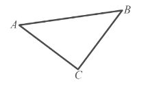
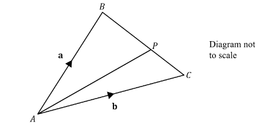
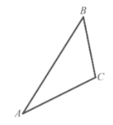
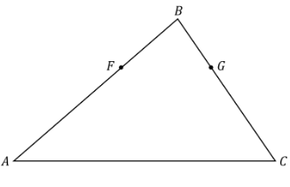
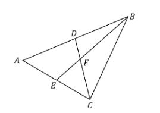

# Exam Questions — Vectors in 2D
**Vectors** · Edexcel International A Level (IAL) Maths (YMA01) — Pure 4
> Source: [https://www.savemyexams.com/international-a-level/maths/edexcel/20/pure-4/topic-questions/vectors/vectors-in-2d/exam-questions/](https://www.savemyexams.com/international-a-level/maths/edexcel/20/pure-4/topic-questions/vectors/vectors-in-2d/exam-questions/) · 36 questions · total 175 marks

## Q1 — easy — 5 marks · exam-questions

### 1() — 5 marks — structured
The vectors **a** and **b **are given by $a=3i-5j$ and $b=-i+3j$.

Find:

(i) **a + b**

(ii) 5**a,**

(iii) 3**a - **2**b**

(iv) **a - ***t ***b,**

## Q2 — easy — 4 marks · exam-questions

### 1() — 4 marks — structured
In triangle $ABC,\overset{\rightarrow}{AB}=5i+jand\overset{\rightarrow}{AC}=3i-2j.$

(i) Find $\overset{\rightarrow}{BC}$ in terms of **i **and **j**.

(ii) Calculate `open vertical bar stack B C with rightwards arrow on top close vertical bar`.

## Q3 — easy — 5 marks · exam-questions

### 1() — 3 marks — structured
The vectors **a, b, c **and **d **are given by

$a=2i+4j,b=3i+pj,c=qi-2j,d=6i-2j$

Given that **a - **2**b  =  **3**c**, find the values of the constants *p* and *q*.

### 2() — 2 marks — structured
Find |**d**|.

## Q4 — easy — 3 marks · exam-questions

### 1() — 3 marks — structured
On the same diagram sketch the following position vectors

(i) 3**i** + 4**j**,

(ii) -5**i**,

(iii) -8**i** - 6**j**.

## Q5 — easy — 3 marks · exam-questions

### 1() — 3 marks — structured
The vectors **a**,** b **and **c **are given as

`space bold a equals open parentheses table row cell 3 space end cell row cell negative p end cell end table close parentheses` ,    `space bold b equals open parentheses table row p row 4 end table close parentheses space` ,    `space bold c equals open parentheses table row 9 row 3 end table close parentheses space`

Given that  $a+b$ is parallel to c find the value of *p*.

## Q6 — easy — 4 marks · exam-questions

### 1() — 4 marks — structured
The position vector $\overset{\rightarrow}{AB}$ is given by $\overset{\rightarrow}{AB}=6i+3j$.

(i) Find the magnitude of $\overset{\rightarrow}{AB}$, giving your answer in the form $p\sqrt{q}$ where $p$ and $q$ are integers to be found.

(ii) Find the angle between $\overset{\rightarrow}{AB}$ and the positive *x*-axis, giving your answer in degrees to one decimal place.

## Q7 — easy — 2 marks · exam-questions

### 1() — 2 marks — structured
The vector $\overset{\rightarrow}{OA}$** **is given by `stack O A with rightwards arrow on top equals open parentheses table row cell negative 4 end cell row 3 end table close parentheses`.

Find a unit vector in the direction of $\overset{\rightarrow}{OA}$.

## Q8 — easy — 4 marks · exam-questions

### 1() — 4 marks — structured
Starting at the origin, a ship sails on a bearing of 060° for 400 km, until it reaches point *P*.  Find the position vector of *P *relative to the origin.

Giving your answer in the form `open parentheses x bold i plus y bold j close parentheses` km, where *x* and *y* are exact values.

## Q9 — easy — 2 marks · exam-questions

### 1() — 2 marks — structured
The points* A *and *B* have position vectors $a=3i-7j$and** **$b=-3i+j$respectively.

Find the distance *AB*.

## Q10 — easy — 2 marks · exam-questions

### 1() — 2 marks — structured
A force **F** acts on a particle, where  $F=pi+2pjN.$

Calculate the magnitude of the force **F**, giving your answer in terms of *p*.

## Q11 — medium — 4 marks · exam-questions

### 1() — 3 marks — structured
In triangle *ABC*,  $\overset{\rightarrow}{AB}=7i+j$ and $\overset{\rightarrow}{AC}=4i-3j$

(i) Write down $\overset{\rightarrow}{CA}$in terms of **i **and **j**.

(ii) Find $\overset{\rightarrow}{BC}$.

### 2() — 1 mark — structured
Calculate `open vertical bar stack B C with rightwards arrow on top close vertical bar`.

## Q12 — medium — 5 marks · exam-questions

### 1() — 3 marks — structured
`bold a equals open parentheses table row 7 row 2 end table close parentheses` , `bold space bold b equals open parentheses table row m row cell negative 3 end cell end table close parentheses` ,  `bold c equals open parentheses table row 5 row n end table close parentheses space`

Given that  $a+2b=c$, find the values of *m* and *n*.

### 2() — 2 marks — structured
`space bold d equals open parentheses table row cell negative 5 end cell row k end table close parentheses space`

Given that `open vertical bar bold d close vertical bar equals 15`, find two possible values for *k*.  Give your answer as an exact value.

## Q13 — medium — 3 marks · exam-questions

### 1() — 3 marks — structured
The point *A* lies on the line with equation$y=3x+5$.  The position vector of* A* is$\overset{\rightarrow}{OA}=2ki+7kj$.  Find the value of *k*, and hence determine the coordinates of *A*.

## Q14 — medium — 4 marks · exam-questions

### 1() — 4 marks — structured
The vectors **a**,** b** and **c** are given as

`space bold italic a equals open parentheses table row cell negative 5 end cell row 17 end table close parentheses` ,  `bold b equals open parentheses table row k row cell space 5 end cell end table close parentheses` ,  `bold c equals open parentheses table row 9 row cell negative 29 end cell end table close parentheses space`

Given that  $a-b$ is parallel to $b+c$ find the value of *k*.

## Q15 — medium — 5 marks · exam-questions

### 1() — 3 marks — structured
$\overset{\rightarrow}{AB}=11i-2j$

Find

(i) the magnitude of $\overset{\rightarrow}{AB}$, giving your answer as an exact value

(ii) the angle between $\overset{\rightarrow}{AB}$ and the positive *x*-axis, giving your answer in degrees correct to two decimal places.

### 2() — 2 marks — structured
Find a unit vector in the direction of $\overset{\rightarrow}{AB}$.

## Q16 — medium — 4 marks · exam-questions

### 1() — 4 marks — structured
A ship leaves its starting position *O* in port and travels 300 km on a bearing of 120°.  It then travels 500 km due south before dropping anchor at point *A*.  Given that the position vector of* A* relative to *O* is `open parentheses space x bold i plus y bold j bold space close parentheses`km, find the exact values of *x* and* y.*

## Q17 — medium — 6 marks · exam-questions

### 1() — 3 marks — structured
Two forces **F**1 and **F**2 act on a particle, where  $F_{1}=7i-2j$newtons and $F_{2}=-12i-10j$ newtons.

The resultant force **R** acting on the particle is given by $R=F_{1}+F_{2}$.

Calculate the magnitude of **R** in newtons.

### 2() — 3 marks — structured
A third force $F_{3}=kj$ newtons is to be applied to the particle.  The constant *k* is to be selected so that the line of action of the new resultant force $R_{\mathrm{new}}=F_{1}+F_{2}+F_{3}$is at an angle of 45 degrees to the vector **j**, measured anticlockwise.

Find the value of *k.*

## Q18 — medium — 5 marks · exam-questions

### 1() — 3 marks — structured
Points *A, B* and *C* have position vectors $\overset{\rightarrow}{OA}=-4i-7j$,  $\overset{\rightarrow}{OB}=3j$  and  $\overset{\rightarrow}{\mathrm{OC}}=6i+18j$, respectively.

Find  $\overset{\rightarrow}{AB}$ and $\overset{\rightarrow}{AC}$.

### 2() — 2 marks — structured
Show that$\overset{\rightarrow}{AB}$ and$\overset{\rightarrow}{AC}$ are parallel, and state what this tells you about the points *A, B* and *C*.

## Q19 — medium — 5 marks · exam-questions

### 1() — 3 marks — structured
In triangle *ABC*, $\overset{\rightarrow}{AB}=a$ and  $\overset{\rightarrow}{AC}=b.$  Point *P* divides *BC* in the ratio 3:2.

(i) Write down vector$\overset{\rightarrow}{BC}$ in terms of **a** and **b**.

(ii) Find $\overset{\rightarrow}{BP}$ in terms of **a** and **b**.

### 2() — 2 marks — structured
Given that $a=7i+8j$and $b=12i+3j$ , find $\overset{\rightarrow}{BP}$ in terms of **i** and **j**.

## Q20 — hard — 4 marks · exam-questions

### 1() — 1 mark — structured
In triangle *ABC*,  $\overset{\rightarrow}{AB}=5i+8j$ and  $\overset{\rightarrow}{BC}=i-5j$

Explain why $\overset{\rightarrow}{AB}+\overset{\rightarrow}{BC}+\overset{\rightarrow}{CA}=0.$

### 2() — 3 marks — structured
Find $\overset{\rightarrow}{CA}$and calculate its magnitude.

## Q21 — hard — 4 marks · exam-questions

### 1() — 2 marks — structured
`bold a equals open parentheses table row cell negative 1 end cell row n end table close parentheses space comma space space bold b equals open parentheses table row 5 row cell negative 4 end cell end table close parentheses space comma space bold space bold c equals open parentheses table row m row 6 end table close parentheses space`

Given that the resultant of **a, b** and **c** is the zero vector, find the values of *m* and *n*.

### 2() — 2 marks — structured
`bold d equals open parentheses table row cell negative 3 k end cell row k end table close parentheses`

Given that `open vertical bar bold d close vertical bar equals 2 square root of 15 comma` find two possible values for *k*.  Give your answer as an exact value.

## Q22 — hard — 4 marks · exam-questions

### 1() — 4 marks — structured
The point *A* lies on the curve with equation $y=x^{2}-2$.  The position vector of *A* is $\overset{\rightarrow}{OA}=3ki-17kj$, where *k* is a positive constant.  Find the value of  *k*, and hence determine the coordinates of  *A*.

## Q23 — hard — 4 marks · exam-questions

### 1() — 4 marks — structured
The vectors **a, b **and **c** are given as

** **`bold a equals open parentheses table row 3 row 5 end table close parentheses space comma space space bold b equals open parentheses table row cell negative 3 k end cell row k end table close parentheses space comma space space bold c equals open parentheses table row 0 row cell negative 4 end cell end table close parentheses space`

Given that  $a-b$ is parallel to $a+c$ find the value of *k*.

## Q24 — hard — 5 marks · exam-questions

### 1() — 3 marks — structured
Vector $\overset{\rightarrow}{AB}$  has a magnitude of $6\sqrt{3}$ and makes an angle of 150° with the positive *x*-axis.

Find $\overset{\rightarrow}{AB}$in the form $xi+yj,$ where both *x* and *y* are given as exact values.

### 2() — 2 marks — structured
Find a unit vector in the direction of $\overset{\rightarrow}{AB}$.

## Q25 — hard — 6 marks · exam-questions

### 1() — 6 marks — structured
In the enchanted kingdom of Vectoria, a magical flying unicorn takes off from the wizard’s palace at the point known as *O* and travels 30 km on a bearing of 300°.  Chased by an evil dragon, it then travels an unknown distance of * k *km due north before reaching the enchanted grove at point *P*.  Given that the position vector of *P* relative to *O* is `open parentheses x bold i plus y bold j close parentheses space km`, and that the straight-line distance between the grove and the palace is known to be $30\sqrt{3}\mathrm{km}$, find the exact values of *x* and *y*.

## Q26 — hard — 8 marks · exam-questions

### 1() — 2 marks — structured
Two forces **F**1 and **F**2 act on a particle, where  $F_{1}=5i-3j$newtons and $F_{2}=xi+yj$ newtons.

The resultant force **R** acting on the particle is given by $R=F_{1}+F_{2}$, and acts in a direction parallel to the vector `open parentheses negative bold i minus 3 bold j close parentheses`.

Find the angle between **R** and the vector** j**, giving your answer in degrees correct to 2 decimal places.

### 2() — 3 marks — structured
Show that $3x-y=-18$.

### 3() — 3 marks — structured
Given that$y=-3$, find the magnitude of **R**.

## Q27 — hard — 5 marks · exam-questions

### 1() — 5 marks — structured
Points *A, B* and *C* have position vectors $\overset{\rightarrow}{OA}=-9i+4j$,  $\overset{\rightarrow}{OB}=-6i$ and  $\overset{\rightarrow}{OC}=3i-12j,$ respectively.

Use a vector method to show that points *A, B* and *C* lie on the same straight line.

## Q28 — hard — 8 marks · exam-questions

### 1() — 1 mark — structured
In triangle *ABC*, point *F* lies on *AB* and point *G* lies on *BC*.

*F *divides *AB* in the ratio *m:n*.

The line segment *FG* is parallel to *AC*.

Explain why $\overset{\rightarrow}{BG}=λ\overset{\rightarrow}{BC}$ for some constant $λ$, where $0\leqλ\leq1$.

### 2() — 4 marks — structured
Given that $\overset{\rightarrow}{AB}=a$  and $\overset{\rightarrow}{AC}=b$**, **  show that

`stack F G with rightwards arrow on top equals open parentheses fraction numerator n over denominator m plus n end fraction minus lambda close parentheses bold a plus lambda bold b`

### 3() — 3 marks — structured
Using your result from (b), prove that *G* divides *BC* in the ratio *n:m*.

## Q29 — very_hard — 5 marks · exam-questions

### 1() — 2 marks — structured
*A, B *and *C* are the three vertices of a triangle.  $\overset{\rightarrow}{AC}=5i-2j$and  $\overset{\rightarrow}{BC}=-3i+kj$, where *k* is a constant.

Find $\overset{\rightarrow}{AB}$ in terms of **i**,** j** and **k**.

### 2() — 3 marks — structured
Given that`space open vertical bar stack A B with rightwards arrow on top close vertical bar equals square root of 89`, find the two possible values of $k$.

## Q30 — very_hard — 5 marks · exam-questions

### 1() — 3 marks — structured
`bold a equals open parentheses table row 8 row m end table close parentheses comma space space bold b equals open parentheses table row n row cell negative 2 end cell end table close parentheses space comma space bold space bold c equals open parentheses table row m row n end table close parentheses space`

Given that $a+b=c-2b$, find the values of *m* and *n*.

### 2() — 2 marks — structured
`bold d equals open parentheses table row cell 2 k plus 1 end cell row cell 2 k minus 1 end cell end table close parentheses space`

Given that `open vertical bar bold d close vertical bar equals 3 k square root of 2`, find two possible values for *k*.  Give your answer as an exact value.

## Q31 — very_hard — 6 marks · exam-questions

### 1() — 4 marks — structured
The point *A *lies on the circle with equation `open parentheses x minus 11 close parentheses squared plus open parentheses y minus 7 close parentheses squared equals 34`.  *A *has position vector $\overset{\rightarrow}{OA}=3ki+5kj$, where *k* is a constant.

Find the value of *k* , and hence determine the coordinates of *A*.

### 2() — 2 marks — structured
Explain why a line passing through *O* and *A* must be a tangent to the circle.

## Q32 — very_hard — 5 marks · exam-questions

### 1() — 5 marks — structured
Points *A, B* and *C* have position vectors $\overset{\rightarrow}{OA}=-6i-2j$,  $\overset{\rightarrow}{OB}=i+mj$and  $\overset{\rightarrow}{OC}=3i-8j$, respectively.

Given that *A, B* and *C* lie on the same straight line, use a vector method to find the value of *m*.

## Q33 — very_hard — 5 marks · exam-questions

### 1() — 3 marks — structured
Vector $\overset{\rightarrow}{AB}$ has a magnitude of $2\sqrt{6}$ and makes an angle of 165° with the positive *y*-axis (measuring anticlockwise from the positive *y*-axis).

Find $\overset{\rightarrow}{AB}$ in the form $ai+bj$, where both *a* and *b* are given as exact values.

### 2() — 2 marks — structured
Find a unit vector in the direction of $\overset{\rightarrow}{AB}$.

## Q34 — very_hard — 10 marks · exam-questions

### 1() — 7 marks — structured
A ship is searching for a radio buoy whose transmitter has ceased functioning.  The ship sets out from point *O* and heads in the approximate direction of the buoy, travelling at a constant speed of 40 km/h in a direction parallel to the vector $i+3j$.  After travelling for ninety minutes the ship has reached point *P*.  At that time, the ship receives a brief transmission from the buoy indicating that the buoy is at a bearing of  210° from the ship.  The ship heads on that bearing at the same constant speed, and reaches the buoy at point *Q* in another 45 minutes.  Given that vector $\overset{\rightarrow}{OQ}=xi+yj\mathrm{km}$, find the exact values of *x *and *y*.

Given that vector $\overset{\rightarrow}{OQ}=xi+yj\mathrm{km}$, find the exact values of *x* and *y.*

### 2() — 3 marks — structured
How far was the buoy from the ship, and at what bearing, at the time the ship initially left point *O*?  Give the distance in kilometers, and give your answers correct to 1 decimal place.

## Q35 — very_hard — 7 marks · exam-questions

### 1() — 4 marks — structured
In an experiment, three forces are acting on a particle.  $F_{1}=7i-j$newtons and $\text{F}_{2}=xi+yj$ newtons are both constant forces, although the values of *x* and *y* are initially unknown.  The third force is$F_{3}=ki+k\sqrt{3}j$newtons, where $k\geq0$ is a parameter that can be varied by the experimenters.  The resultant force **R** acting on the particle is given by $R=F_{1}+F_{2}+F_{3}$.

Given that $R=0$ when the magnitude of $F_{3}$ is 10 newtons, find the exact values of *x* and *y*.

### 2() — 3 marks — structured
Find the magnitude of $F_{2}$ and the angle it makes with the vector **i**.  Give your answers correct to 1 decimal place.

## Q36 — very_hard — 9 marks · exam-questions

### 1() — 3 marks — structured
In triangle *ABC, D* is the midpoint of *AB* and *E *is the midpoint of *AC*. * BE* and *CD* intersect at point *F*.

Given that  $\overset{\rightarrow}{AB}=2a$ and  $\overset{\rightarrow}{AC}=2b$, write the vectors $\overset{\rightarrow}{BC},\overset{\rightarrow}{BE}$and $\overset{\rightarrow}{CD}$ in terms of **a** and **b**.

### 2() — 6 marks — structured
By setting up and solving suitable vector equations, prove that each of *BE* and *CD* divides the other in the ratio 1:2.
