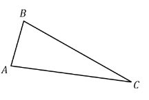
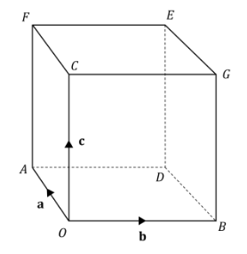
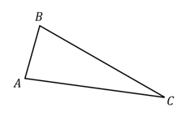
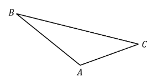
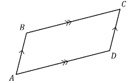
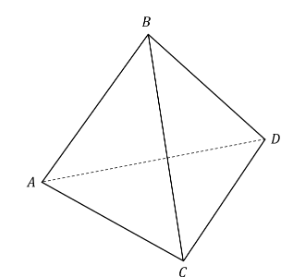
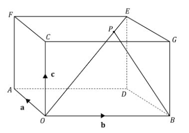

# Exam Questions — Vectors in 3D
**Vectors** · Edexcel International A Level (IAL) Maths (YMA01) — Pure 4
> Source: [https://www.savemyexams.com/international-a-level/maths/edexcel/20/pure-4/topic-questions/vectors/vectors-in-3d/exam-questions/](https://www.savemyexams.com/international-a-level/maths/edexcel/20/pure-4/topic-questions/vectors/vectors-in-3d/exam-questions/) · 33 questions · total 197 marks

## Q1 — easy — 3 marks · exam-questions

### 1() — 3 marks — structured
The coordinates of two points *A* and *B* are `open parentheses 3 comma space minus 4 comma space 2 close parentheses` and `open parentheses space minus 5 comma space 2 comma space minus 8 space close parentheses`respectively.

Find the distance from *A* to *B* giving your answer in the form $a\sqrt{b}$, where *a* and *b* are integers to be found.

## Q2 — easy — 4 marks · exam-questions

### 1() — 4 marks — structured
In the triangle *ABC*,  $\overset{\rightarrow}{AB}=i+4j-2k$  and  $\overset{\rightarrow}{AC}=6i-2j+8k$.

(i) Find the vector $\overset{\rightarrow}{BC}$.

(ii) Hence, or otherwise, find the distance *BC*, giving your answer to three significant figures.

## Q3 — easy — 5 marks · exam-questions

### 1() — 3 marks — structured
Point *P* has coordinates`open parentheses space 2 comma space minus 1 comma space minus 5 space close parentheses`and point *Q* has coordinates`space open parentheses negative 6 comma space minus 12 comma space 11 close parentheses`.

(i) Find the vector $\overset{\rightarrow}{PQ}$.

(ii) Find the distance *PQ*.

### 2() — 2 marks — structured
Find the unit vector in the direction of $\overset{\rightarrow}{PQ}$.

## Q4 — easy — 3 marks · exam-questions

### 1() — 1 mark — structured
Point *A* has coordinates `open parentheses negative 3 comma space 4 comma space 9 close parentheses`.

The vector `space stack A B with rightwards arrow on top equals open parentheses table row 4 row cell negative 5 end cell row 2 end table close parentheses space`, and the vector `stack C D with rightwards arrow on top equals open parentheses table row cell negative 2 space end cell row cell 2.5 end cell row cell negative 1 end cell end table close parentheses` .

Find the coordinates of the point $B$.

### 2() — 2 marks — structured
State, with a reason, whether or not the vectors $\overset{\rightarrow}{AB}$ and $\overset{\rightarrow}{CD}$are parallel.

## Q5 — easy — 4 marks · exam-questions

### 1() — 4 marks — structured
The triangle $PQR$ has vertices `P open parentheses 4 comma space minus 3 comma space 12 close parentheses comma space Q open parentheses 3 comma space minus 7 comma space 9 close parentheses` and `R open parentheses 7 comma space minus 9 comma space 15 close parentheses`.

Find the distances $PQ,PR$ and $QR$ and thus determine whether triangle $PQR$ is scalene, isosceles or equilateral.

## Q6 — easy — 4 marks · exam-questions

### 1() — 4 marks — structured
Vectors **p** and **q** are defined by

$p=14i+(a+b)j+(c-b+1)k$

$q=ai+6j-4k$

Given that **p **= 2**q**, find the values of *a, b* and *c*.

## Q7 — easy — 5 marks · exam-questions

### 1() — 3 marks — structured
A particle of mass 0.5 kg is acted upon by a force of `open parentheses 3 bold i minus 5 bold j minus 2 bold k close parentheses space bold N. space`

Use Newton’s Second Law of Motion to find:

(i) the acceleration of the particle while the force acts,

(ii) the magnitude of the acceleration to 3 significant figures.

### 2() — 2 marks — structured
A second force now acts on the particle such that the resultant of the two forces is `open parentheses 4 bold i plus 2 bold k space close parentheses bold N`.

Find the second force in the form `open parentheses x bold i plus y bold j plus z bold k close parentheses space bold N`.

## Q8 — easy — 8 marks · exam-questions

### 1() — 3 marks — structured
Two forces act upon a particle with a mass of 10 kg:

`table row cell space space bold F subscript 1 end cell equals cell open parentheses 2 bold i plus p bold j minus 8 bold k close parentheses space bold N end cell row cell bold F subscript bold 2 end cell equals cell open parentheses straight q bold i plus 3 straight q bold j plus left parenthesis straight p minus straight q right parenthesis bold k close parentheses bold space bold N end cell end table`

Under the action of these two forces, the particle is in equilibrium.

(i) Find the values of *p*, *q*.

(ii) Explain how you can verify your answer to part (i).

### 2() — 5 marks — structured
A third force, `bold F subscript 3 equals open parentheses p bold i plus q bold j plus p q bold k close parentheses space straight N`, is applied to the particle.

Work out:

(i) the resultant force **R** now acting on the particle,

(ii) the acceleration of the particle under the action of **R**,

(iii) the magnitude of the acceleration under the action of **R**, giving your answer to three significant figures.

## Q9 — easy — 8 marks · exam-questions

### 1() — 2 marks — structured
The diagram below shows a cube whose vertices are *O, A, B, C, D, E, F* and *G*.

**a, b** and **c** are the vectors $\overset{\rightarrow}{OA},\overset{\rightarrow}{OB}$ and $\overset{\rightarrow}{OC}$ respectively.

Find vectors $\overset{\rightarrow}{OF}$and $\overset{\rightarrow}{OG}$.

### 2() — 3 marks — structured
(i) Explain why vector $\overset{\rightarrow}{GE}=a$.

(ii) Show that $\overset{\rightarrow}{OF}+\overset{\rightarrow}{FE}=\overset{\rightarrow}{OG}+\overset{\rightarrow}{GE}$ and thus, state the vector $\overset{\rightarrow}{OE}$.

### 3() — 3 marks — structured
*A* has the coordinates (5, 0, 0).

Find the exact distance of *OE.*

## Q10 — medium — 3 marks · exam-questions

### 1() — 3 marks — structured
The coordinates of points *A* and *B* are `open parentheses negative 2 comma space 5 comma space minus 7 close parentheses` and `open parentheses negative 7 comma space k comma space 3 close parentheses` respectively.  Given that the distance from *A* to *B* is $5\sqrt{14}$ units, find the possible values of *k*.

## Q11 — medium — 5 marks · exam-questions

### 1() — 5 marks — structured
In the triangle *ABC*,  $\overset{\rightarrow}{AB}=-2i+3j-k$ and  $\overset{\rightarrow}{AC}=-5i-4j-7k$.

Show that `angle B A C equals 81.9 degree` to 1 d.p.

## Q12 — medium — 7 marks · exam-questions

### 1() — 3 marks — structured
Point *R *has coordinates `open parentheses negative 1 comma space 5 comma space 14 close parentheses` and point *S* has coordinates`space open parentheses 7 comma space minus 2 comma space 12 close parentheses`.

Find:

(i) the vector $\overset{\rightarrow}{RS}$,

(ii) the unit vector in the direction of $\overset{\rightarrow}{RS}$.

### 2() — 2 marks — structured
Find the angle $\overset{\rightarrow}{RS}$ makes with the positive *y*-axis.

### 3() — 2 marks — structured
The vector  $\overset{\rightarrow}{TU}=-24i+21j+6k.$

Explain, giving a reason for your answer, whether the vectors $\overset{\rightarrow}{RS}$ and $\overset{\rightarrow}{TU}$ are parallel.

## Q13 — medium — 4 marks · exam-questions

### 1() — 4 marks — structured
The triangle *PQR* has vertices `P open parentheses 12 comma space 3 comma space minus 3 close parentheses`, `space Q open parentheses 7 comma space minus 8 comma space k space close parentheses`and `R open parentheses 3 comma space 3 comma space minus 12 close parentheses`.  Given that $PQR$ is an equilateral triangle, find the value of *k*.

## Q14 — medium — 3 marks · exam-questions

### 1() — 3 marks — structured
Vectors *a* and *b* are defined by** **

`table row cell space bold a end cell equals cell negative 12 bold i minus 7 bold j plus 15 bold k bold space space end cell row bold b equals cell 4 p bold i plus open parentheses p q r plus 2 q r minus p close parentheses bold j minus p q bold k space end cell end table`

Given that $a=b$, find the values of *p, q* and *r*.

## Q15 — medium — 7 marks · exam-questions

### 1() — 3 marks — structured
A particle of mass 0.4 kg is acted upon by a force of `open parentheses negative 2 bold i plus 6 bold j plus 10 bold k close parentheses space straight N`.

Find:

(i) the acceleration of the particle while the force acts,

(ii) the magnitude of the acceleration to 3 s.f.

### 2() — 4 marks — structured
A second force with a magnitude of $10\sqrt{3}N$ now acts on the particle. The resultant of the two forces is parallel to the vector **j** and has a magnitude of 8 N.

Find this second force, giving your answer in the form `open parentheses x bold i plus y bold j plus z bold k close parentheses space straight N`.

## Q16 — medium — 7 marks · exam-questions

### 1() — 2 marks — structured
Three forces act upon a particle with a mass of 5 kg:

`table row cell space bold space bold F subscript 1 end cell equals cell open parentheses 3 bold i minus 7 bold j plus straight p bold k close parentheses space straight N space end cell row cell space bold F subscript 2 end cell equals cell open parentheses straight q bold i plus 3 bold j minus bold k space close parentheses straight N space space end cell row cell bold F subscript 3 end cell equals cell open parentheses negative 2 bold i plus straight r bold j minus 5 bold k close parentheses straight N end cell end table`

Under the action of those three forces, the particle is in equilibrium.

Find the values of *p, q* and *r*.

### 2() — 5 marks — structured
The third force is doubled, so that the three forces now acting on the particle are **F**1,** F**2** **and** **2**F**3**. **

Work out:

(i) the resultant force **R** now acting on the particle.

(ii) the acceleration of the particle under the action of **R**.

(iii) the magnitude of the acceleration found in (ii), giving your answer as an exact value.

## Q17 — medium — 8 marks · exam-questions

### 1() — 2 marks — structured
The diagram below shows a cube whose vertices are *O, A, B, C, D, E, F* and *G*.

**a, b **and **c** are the vectors $\overset{\rightarrow}{OA},\overset{\rightarrow}{OB}$ and $\overset{\rightarrow}{OC}$ respectively.

Find vectors $\overset{\rightarrow}{OE}$ and $\overset{\rightarrow}{AG}.$

### 2() — 2 marks — structured
Let *P *be a point on *OE*, and let *Q* be a point on *AG*.

Explain why the vectors $\overset{\rightarrow}{OP}$ and $\overset{\rightarrow}{OQ}$ can be expressed in the forms** **

`table row cell stack O P with rightwards arrow on top end cell equals cell lambda stack O E space with rightwards arrow on top space end cell row cell stack O Q with rightwards arrow on top end cell equals cell bold a plus mu stack A G with rightwards arrow on top end cell end table`

where $λ$ and $μ$  are constants with $0\leqλ\leq1$ and $0\leqμ\leq1$

### 3() — 4 marks — structured
By solving the equation $\overset{\rightarrow}{OP}=\overset{\rightarrow}{OQ}$, using your results from (a) and (b), show that the diagonals *OE* and *AG* intersect each other, and determine the ratios into which they are cut by the point of intersection.

## Q18 — hard — 3 marks · exam-questions

### 1() — 3 marks — structured
The coordinates of points *A* and *B* are `open parentheses negative 1 comma space 3 comma space 14 space close parentheses`and `open parentheses 2 k comma space 3 k comma space 13 close parentheses` respectively. Given that the distance from *A* to *B* is $\sqrt{163}$units, and that *k* is an integer, find the value of *k*.

## Q19 — hard — 7 marks · exam-questions

### 1() — 5 marks — structured
In the triangle *ABC*,  $\overset{\rightarrow}{AB}=7i+j-k$ and  $\overset{\rightarrow}{AC}=-2i+5k$**.**

Show that `angle B A C equals 119.6 degree` to 1 d.p.

### 2() — 2 marks — structured
Hence find the area of triangle *ABC*, giving your area to 3 s.f.

## Q20 — hard — 7 marks · exam-questions

### 1() — 3 marks — structured
Point *R* has position vector$i+6j-2k$and point S has position vector $10i+13k$.

Find the unit vector in the direction of $\overset{\rightarrow}{RS}$.

### 2() — 2 marks — structured
Find the angle $\overset{\rightarrow}{RS}$ makes with the negative *z*-axis.

### 3() — 2 marks — structured
The vector $\overset{\rightarrow}{TU}=-12i+8j-20k$.

Explain, giving a reason for your answer, whether the vectors $\overset{\rightarrow}{RS}$ and$\overset{\rightarrow}{TU}$ are parallel.

## Q21 — hard — 4 marks · exam-questions

### 1() — 4 marks — structured
The triangle *PQR* has vertices `P open parentheses 2 comma space minus 3 comma space 1 close parentheses`, `space Q open parentheses negative 1 comma space minus 4 comma space 3 space close parentheses`and `R open parentheses k comma space 0 comma space 3 close parentheses`.  Given that *PQR* is isosceles, and that $k>1$, find the value of *k*.

## Q22 — hard — 4 marks · exam-questions

### 1() — 4 marks — structured
Vectors a and b are defined by** **

`bold a equals open parentheses p plus 1 close parentheses bold i minus 7 bold j plus open parentheses q minus 3 p close parentheses bold k space space
bold b equals 5 bold i plus open parentheses 14 q plus r close parentheses bold j plus open parentheses 1 minus 2 r close parentheses bold k`

Given that $a=b$, find the values of *p, q *and *r*.

## Q23 — hard — 8 marks · exam-questions

### 1() — 3 marks — structured
A particle of mass 0.5 kg is acted upon by a force of`space open parentheses 12 bold i minus 4 bold j plus p bold k close parentheses space straight N`.

Given that the magnitude of the acceleration experienced by the particle under the influence of this force is 26 m s-2, find the possible values of *p*.

### 2() — 2 marks — structured
An additional second force with a magnitude of *q***k** N now acts on the particle, where  $q<0$.   Under the influence of the resultant of the two forces, the particle now experiences an acceleration of magnitude $8\sqrt{10}ms^{-2}$.

Explain why this additional information shows that $p>0$.

### 3() — 3 marks — structured
Hence find the value of *q*.

## Q24 — hard — 9 marks · exam-questions

### 1() — 4 marks — structured
Three forces act upon a particle with a mass of 5 kg:

`table row cell space bold space bold F subscript 1 end cell equals cell open parentheses r bold i plus 5 bold j plus open parentheses r minus p close parentheses bold k close parentheses space straight N space space end cell row cell bold F subscript 2 end cell equals cell open parentheses open parentheses p plus q close parentheses bold i minus 3 p bold j plus 7 bold k close parentheses space straight N space space end cell row cell bold F subscript 3 end cell equals cell open parentheses negative bold i plus r bold j minus 2 q bold k close parentheses space straight N end cell end table`

Under the action of those three forces, the particle is in equilibrium.

Find the values of* p, q *and *r*.

### 2() — 5 marks — structured
A new force, **F**4, is added.  Under the combined action of the four forces, the particle experiences an acceleration with a magnitude of ** **2.2 m s-2, in the same direction as the vector$i-j+3k$.

Find **F**4, giving your answer in the form $xi+yj+zk$ where *x, y* and *z* are given as exact values.  Be sure to include the correct units in your answer.

## Q25 — hard — 9 marks · exam-questions

### 1() — 9 marks — structured
The diagram below shows a cube whose vertices are *O, A, B, C, D, E, F *and *G*.

**a***, ***b** and **c** are the vectors $\overset{\rightarrow}{OA},\overset{\rightarrow}{OB}$ and$\overset{\rightarrow}{OC}$respectively.

Using vector methods, prove that the diagonals *CD* and *BF* bisect each other.

## Q26 — very_hard — 3 marks · exam-questions

### 1() — 3 marks — structured
The coordinates of points *A* and *B* are`open parentheses space 5 comma space 0 comma space minus 1 space close parentheses`and `open parentheses k comma space minus 2 comma space 3 k close parentheses` respectively. Given that the distance from *A* to *B* is $6\sqrt{k}$ units, and that point *B* lies at a distance of $\sqrt{14}$ units from the origin, find the value of *k*.

## Q27 — very_hard — 8 marks · exam-questions

### 1() — 8 marks — structured
In the parallelogram *ABCD*, *AB* is parallel to *CD*, and *BC* is parallel to *AD*.

Given that $\overset{\rightarrow}{AB}=3i-j-2k$  and  $\overset{\rightarrow}{AD}=7i-j+4k$**, ** find the area of the parallelogram.  Give your answer correct to 3 s.f.

## Q28 — very_hard — 9 marks · exam-questions

### 1() — 5 marks — structured
The vector $\overset{\rightarrow}{RS}=xi-9j+3k$ makes an angle with the positive *x*-axis.

Show that $x^{2}=\frac{90}{\mathrm{tan}^{2}θ}$.

### 2() — 4 marks — structured
Given that $θ$ is acute and that $\mathrm{cos}θ=\frac{4}{5}$ , find a unit vector in the direction of $\overset{\rightarrow}{RS}$.

## Q29 — very_hard — 6 marks · exam-questions

### 1() — 6 marks — structured
*A, B, C* and *D* are the vertices of a regular tetrahedron.

The coordinates of points $A,B,C$ and *D* are `open parentheses 1 comma space 1 comma space 1 close parentheses`, `open parentheses negative 8 comma space 10 comma space 1 close parentheses`, `open parentheses negative 3 comma space 6 comma space minus 10 close parentheses` and `open parentheses negative 2 k comma space 13 comma space k close parentheses` respectively.  Find the coordinates of point $D$.

## Q30 — very_hard — 5 marks · exam-questions

### 1() — 5 marks — structured
Vectors **a** and **b** are defined by** **

`table row cell space bold a end cell equals cell p q bold i minus 24 bold j plus 9 r bold k space space end cell row bold b equals cell 6 bold i plus p minus r bold j plus p minus 3 q bold k space end cell end table`

Given that $a=3b$, and that $r>0$, find the values of *p, q *and *r*.

## Q31 — very_hard — 8 marks · exam-questions

### 1() — 3 marks — structured
A particle of mass 0.2 kg is acted upon by a force of `open parentheses negative 3 bold i plus p bold j plus 4 bold k close parentheses space straight N`.

Given that the magnitude of the acceleration experienced by the particle under the influence of this force is 65 m s-2, find the possible values of *p*.

### 2() — 5 marks — structured
An additional second force with a magnitude of *q***j** N now acts on the particle, where  $q>0$.   Under the influence of the resultant of the two forces, the particle now experiences an acceleration of magnitude $\frac{5\sqrt{221}}{2}ms^{-2}$.

Find the possible values of *q*.

## Q32 — very_hard — 8 marks · exam-questions

### 1() — 5 marks — structured
For this question, the unit vectors **i** and **j **point in the directions east and north respectively, while the unit vector *k* points vertically upwards.

A robotic submarine has a mass of 750 kg and is originally moving in a level direction such that the *k* component of its velocity is zero. In addition to gravity, the forces acting on the submarine are the combined thrust and lift **T** from its propeller and manoeuvring planes, its buoyancy **B**, and the water resistance **W**.  These forces, in newtons, are given by:

`table row bold T equals cell 600 bold i minus 750 bold j minus 120 bold k bold space bold space end cell row bold B equals cell 7360 bold k space space end cell row bold W equals cell negative 500 bold i plus 600 bold j plus 50 bold k end cell end table`

Taking the acceleration due to gravity to be $g=9.8$ms-2, find the magnitude of the acceleration of the submarine.  Give your answer accurate to 3 s.f.

### 2() — 3 marks — structured
Determine whether the submarine is rising or sinking in the water and determine the angle its acceleration makes with the vector *k*.  Give your answer accurate to 1 d.p.

## Q33 — very_hard — 11 marks · exam-questions

### 1() — 11 marks — structured
The diagram below shows a cuboid whose vertices are *O, A, B, C, D, E, F* and *G*.

*P* is a point on the diagonal *OE* that divides *OE* in the ratio $a:b$, where $a>b$.

Show that if line segment BP is extended it will intersect *FE*, and show that *FE* is divided in the ratio `open parentheses a minus b close parentheses space colon space b` by the point of intersection.
