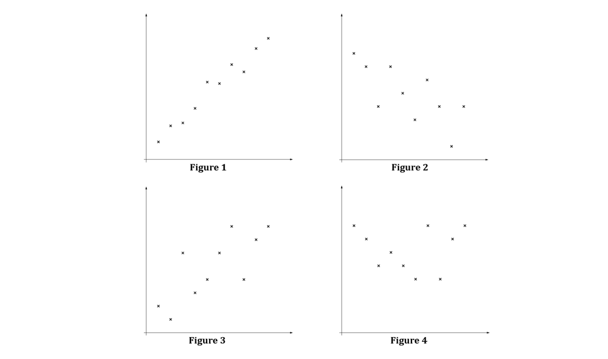
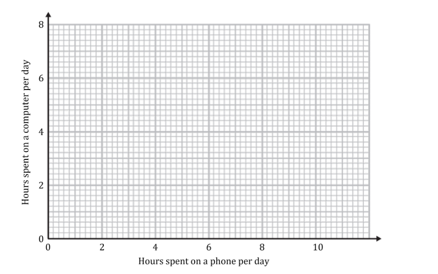
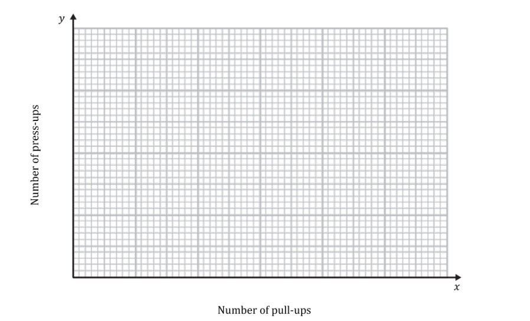
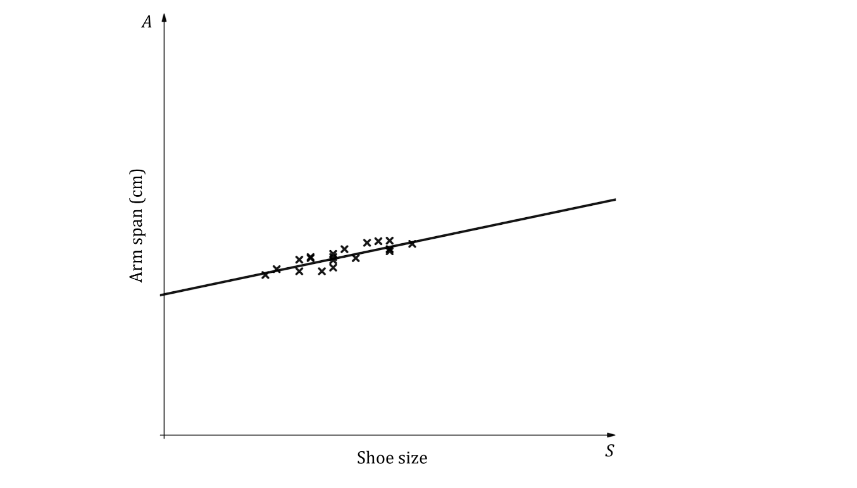
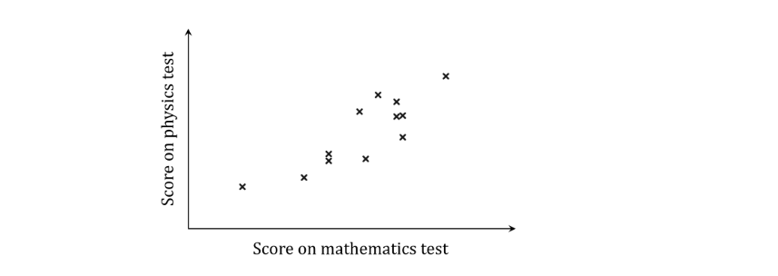
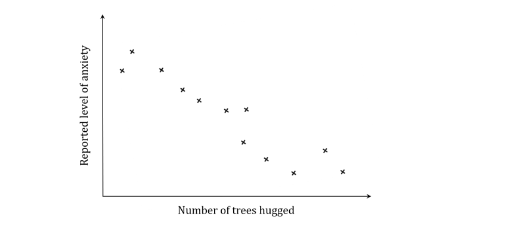
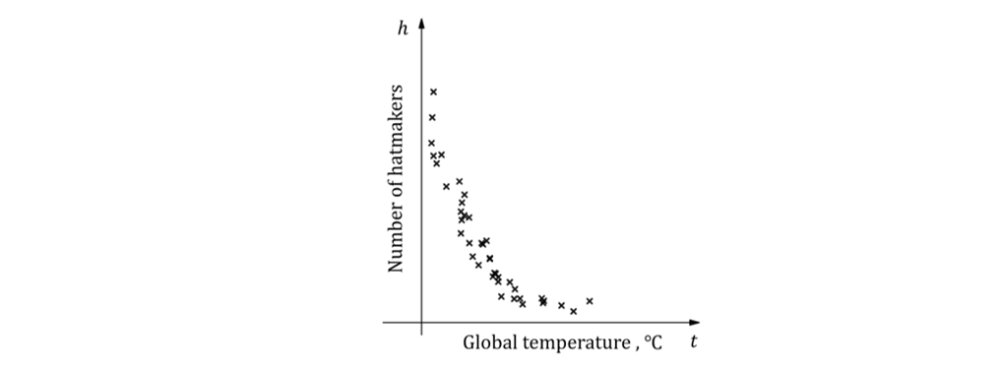
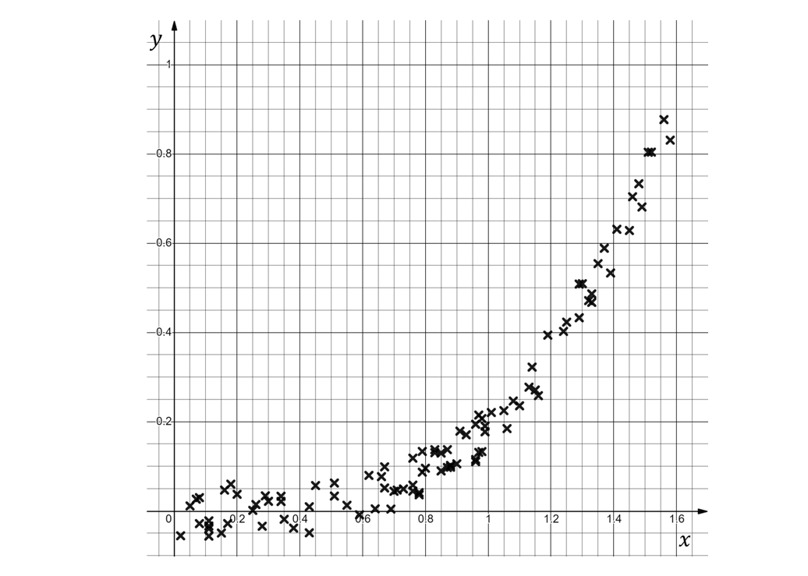
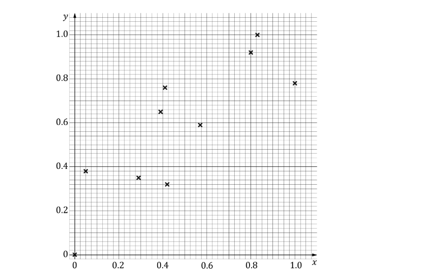

# Exam Questions — Correlation & Regression
**Data Presentation & Interpretation** · Edexcel International A Level (IAL) Maths (YMA01) — Statistics 1
> Source: [https://www.savemyexams.com/international-a-level/maths/edexcel/20/statistics-1/topic-questions/data-presentation-and-interpretation/correlation-and-regression/exam-questions/](https://www.savemyexams.com/international-a-level/maths/edexcel/20/statistics-1/topic-questions/data-presentation-and-interpretation/correlation-and-regression/exam-questions/) · 31 questions · total 258 marks

## Q1 — easy — 8 marks · exam-questions

### 1() — 2 marks — structured
Explain what is measured by the Pearson product moment correlation coefficient.

### 2() — 4 marks — structured
The product moment correlation coefficient between two variables is denoted $r$. Five different values of $r$, rounded to four decimal places, are given below:

$r_{1}=0.0000\,r_{2}=0.9812\,r_{3}=-1.0000\,r_{4}=0.7652\,r_{5}=-0.7098$

Match each of the following four scatter graphs, showing observations from different bivariate data sets, to one of the values of $r$ given above. You should use each given value of $r$ no more than once.

### 3() — 2 marks — structured
Sketch a scatter graph for the remaining value of $r$ from the list above.

## Q2 — easy — 5 marks · exam-questions

### 1() — 5 marks — structured
A teacher is interested in the relationship between the number of hours her students spend on a phone per day and the number of hours they spend on a computer. She takes a sample of nine students and records the results in the table below.

| **Hours spent on a phone per day** | 7.6 | 7 | 8.9 | 3 | 3 | 7.5 | 2.1 | 1.3 | 5.8 |
|---|---|---|---|---|---|---|---|---|---|
| **Hours spent on a computer per day** | 1.7 | 1.1 | 0.7 | 5.8 | 5.2 | 1.7 | 6.9 | 7.1 | 3.3 |

(i) Plot a scatter diagram of this data on the axes below.

(ii) Describe the linear correlation shown in your diagram.

(iii) Interpret the correlation in the context of the question.

## Q3 — easy — 8 marks · exam-questions

### 1() — 4 marks — structured
The table below shows data for a sample of 8 people comparing the maximum number of pull-ups they are able to complete, *x*, with the maximum number of press-ups,* y*.

| **Number of pull-ups **(*x*) | 5 | 10 | 8 | 3 | 6 | 8 | 1 | 4 |
|---|---|---|---|---|---|---|---|---|
| **Number of press-ups **(*y*) | 24 | 34 | 36 | 18 | 30 | 35 | 11 | 19 |

(i) Plot a scatter diagram on the axes below.

(ii) Describe the type of correlation shown in your scatter diagram.

### 2() — 4 marks — structured
The equation of the regression line of *y* on *x* is *y*=3*x *+ 9.

(i) Add this regression line to your scatter diagram.

(ii) Explain the purpose of regression lines and how they may be used.

## Q4 — easy — 4 marks · exam-questions

### 1() — 1 mark — structured
A class is asked to collect a sample of bivariate data. They collect data on the shoe size, *S*, and the arm span, *A* cm, of 20 randomly selected boys from the class.

Explain what is meant by the term ‘bivariate data’.

### 2() — 3 marks — structured
The class plot the data in a scatter diagram and find the equation of the regression line of* A* on *S* to be *A*=4.5 *S* + 133. These are both plotted in the diagram below.

(i) Interpret the value 4.5 in the context of the question.

(ii) Interpret the value 133 in the context of the question.

(iii) Explain how the sign of the coefficient of S in the equation is related to the correlation shown in the scatter diagram.

## Q5 — easy — 5 marks · exam-questions

### 1() — 1 mark — structured
The following table shows data comparing the length of time a cake was baked for, *t* minutes, with the mass of the cake once it has cooled, *m* grams. Each cake in the sample weighed the same before being baked.

| ***t*** | 37 | 35 | 36 | 31 | 30 | 28 | 36 |
|---|---|---|---|---|---|---|---|
| ***m*** | 825 | 868 | 812 | 943 | 947 | 997 | 837 |

State which variable is the explanatory (independent) variable and which is the response (dependent) variable.

### 2() — 2 marks — structured
The equation for the regression line of *m* on* t* is *m*=1531$-$19*t.*

(i) Use the regression line to estimate the mass of a cake if it is baked for 32 minutes.

(ii) Comment on the validity of your estimate in part (b)(i).

### 3() — 2 marks — structured
(i) Use the regression line to estimate the mass of a cake if it is baked for 80 minutes.

(ii) Comment on the validity of your estimate in part (c)(i).

## Q6 — easy — 11 marks · exam-questions

### 1() — 4 marks — structured
Eight food critics are asked to give a rating, $x$ out of ten, for a new restaurant. The following shows their scores:

5          4          8          4          9          6          5          7

(i) Find the value of $\sumx.$

(ii) Show that the value of $\sumx^{2}$ is 312.

(iii) Use your answers to part (i) and (ii) and the formula `S subscript x x end subscript equals sum x squared minus open parentheses sum x close parentheses squared over n` to find the value of $S_{xx}$.

### 2() — 2 marks — structured
The ratings, $y$ out of ten  given to a different restaurant by the same food critics are summarised below:

$\sumy=52\sumy^{2}=352n=8$

Find the value of $S_{yy}$.

### 3() — 1 mark — structured
Use the formula  $S_{xy}=\sumxy-\frac{\sumx\sumy}{n}$ and the statistic $\sumxy=328$to find the value of $S_{xy}$.

### 4() — 2 marks — structured
Use the formula $r=\frac{S_{xy}}{\sqrt{S_{xx}\timesS_{yy}}}$ to calculate the product moment correlation coefficient.

### 5() — 2 marks — structured
State whether you think the food critics are consistent with their scoring, based on your answer to part (d).

## Q7 — easy — 12 marks · exam-questions

### 1() — 4 marks — structured
The heights, $h$ metres rounded to 1 decimal place, and the weights, $w$ kg rounded to the nearest kilogram, of a group of newly born elephants are recorded in the table below.

| **Height, **$h$** m** | 0.8 | 1.1 | 0.9 | 1.0 | 1.3 | 0.9 |
|---|---|---|---|---|---|---|
| **Weight, **$w$ **kg** | 96 | 103 | 98 | 99 | 102 | 101 |

Use the formula `S subscript h h end subscript equals sum h squared minus open parentheses sum h close parentheses squared over n` to find the value of $S_{hh}.$

### 2() — 1 mark — structured
Use the code $x=w-100$to complete the table below.

| **Height,** $h$ **m** | $0.8$ | $1.1$ | $0.9$ | $1.0$ | $1.3$ | $0.9$ |
|---|---|---|---|---|---|---|
| **Weight, **$w$ ** kg** | $96$ | $103$ | $98$ | $99$ | $102$ | $101$ |
| $x=w-100$ | $-4$ | $3$ |   |   |   |   |

### 3() — 4 marks — structured
Find the value of $S_{xx}$ and show that $S_{hx}=1.8$.

### 4() — 2 marks — structured
Use the formula $r=\frac{S_{hx}}{\sqrt{S_{hh}\timesS_{xx}}}$ to find the product moment correlation coefficient between $h$ and $x$.

### 5() — 1 mark — structured
Hence, write down the product moment correlation coefficient between the heights, $h$, and the weights, $w$, of the newly born elephants.

## Q8 — easy — 15 marks · exam-questions

### 1() — 2 marks — structured
The manager of a local supermarket collected data on the distance a person’s house was from the supermarket, $d$ miles, and the average total cost of the person’s shopping, $c$ dollars.  The information is given in the table below.

| **Distance, **$d$** miles** | $0.6$ | $0.8$ | $0.5$ | $0.3$ | $0.9$ | $0.5$ |
|---|---|---|---|---|---|---|
| **Cost, **$c$** dollars** | $33$ | $37$ | $40$ | $29$ | $41$ | $30$ |

The manager codes the data such that $x=10d$  and $y=c-30.$

Complete the table below for the values of $x$ and $y$.

| $x=10d$ | $6$ |   |   | $3$ |   |   |
|---|---|---|---|---|---|---|
| $y=c-30$ | $3$ |   |   | $-1$ |   |   |

### 2() — 3 marks — structured
Find the mean of  $x,\overline{x}$, and show that the mean of $y$ is $\overline{y}=5$

### 3() — 4 marks — structured
Show that $S_{xx}=24$ and find the value of $S_{xy}.$

### 4() — 3 marks — structured
The equation of the least squares regression line of $y$ on $x$ is written in the form $y=a+bx,$ where $b=\frac{S_{xy}}{S_{xx}}$ and $a=\overline{y}-b\overline{x}$. Show that $b=\frac{5}{3}$ and find the value of $a$.

### 5() — 3 marks — structured
By substituting $x=10d$ and $y=c-30$ into your answer for part (d), show that the least squares regression line of $c$ on $d$ is  $c=25+\frac{50}{3}d$.

## Q9 — medium — 4 marks · exam-questions

### 1() — 2 marks — structured
A teacher collected the maths and physics test scores of a number of students and drew a scatter diagram to represent this data.

Describe the correlation shown by the scatter diagram, and interpret the correlation in context.

### 2() — 2 marks — structured
An alternative therapist collected data on his clients’ reported levels of anxiety as well as the number of trees they had hugged in the course of therapy.  He drew a scatter diagram to represent this data.

Describe the correlation shown by the scatter diagram, and interpret the correlation in context.

## Q10 — medium — 5 marks · exam-questions

### 1() — 3 marks — structured
The table below shows data from the United States regarding annual per capita cheese consumption (in pounds) and the divorce rate (number of divorces per 1000 people) for ten years between 2000 and 2018:

| **Year** | 2000 | 2002 | 2004 | 2006 | 2008 | 2010 | 2012 | 2014 | 2016 | 2018 |
|---|---|---|---|---|---|---|---|---|---|---|
| **Cheese consumption (pounds)** | 32.1 | 32.8 | 33.6 | 34.8 | 34.5 | 35 | 35.5 | 36.2 | 38.5 | 40 |
| **Divorce rate (number per 1000 people)** | 4 | 3.9 | 3.7 | 3.7 | 3.5 | 3.6 | 3.4 | 3.2 | 3.0 | 2.9 |

Draw a scatter diagram to represent this data, with per capita cheese consumption on the horizontal axis and divorce rate on the vertical axis.

### 2() — 2 marks — structured
(i) Describe the correlation between per capita cheese consumption and divorce rate.

(ii) Do you think there is a causal relationship between per capita cheese consumption and divorce rate in the United States? Explain your reasoning.

## Q11 — medium — 6 marks · exam-questions

### 1() — 2 marks — structured
Myfanwy has been applying different voltages ($v$, measured in volts) to an electrical circuit in her lab and recording the resulting currents ($i$, measured in amps).  The smallest voltage she applied was 0.5 volts, and the largest voltage she applied was 120 volts.

She found the equation of the regression line of $i$ on v to be  $i$ = 0.056+0.332$v$.

(i) Interpret the value 0.332 in this context.

(ii) Use the equation to predict the current for a voltage of 70 volts.

### 2() — 2 marks — structured
Explain why it would not be sensible to use the regression equation to work out:

(i) the current resulting from a voltage of 2000 volts

(ii) the voltage corresponding to a current of 20 amps.

### 3() — 2 marks — structured
Myfanwy’s lab partner suggests that the value 0.056 in the regression equation represents the current in the circuit when the voltage applied is zero.  Explain why he might suggest this, but also suggest a reason why his interpretation is most likely incorrect.

## Q12 — medium — 9 marks · exam-questions

### 1() — 2 marks — structured
The following table shows the height, h cm, and weight, w kg, for each of eleven students at a sixth form college.

| ***h*** | 167 | 182 | 176 | 173 | 17 | 174 | 177 | 178 | 172 | 170 | 169 |
|---|---|---|---|---|---|---|---|---|---|---|---|
| ***w*** | 51 | 62 | 69 | 65 | 65 | 56 | 64 | 62 | 51 | 55 | 58 |

The following statistics were calculated for the data on height:

mean=159.5 cm,   standard deviation=45.3 cm

An outlier is an observation which lies more than ±2 standard deviations from the mean.

(i) Show that *h*=17 is an outlier.

(ii) Explain why this outlier should be omitted from the data.

### 2() — 5 marks — structured
With the outlier data excluded, the equation of the regression line of *w* on *h* is * w *= $-$87.6 + 0.845*h*.

(i) Exclude the outlier data from the recorded measurements and draw a scatter diagram to represent the data for the remaining ten students.

(ii) Draw the regression line on your diagram.

### 3() — 2 marks — structured
Based on your diagram, along with the regression equation, to what extent would you say that a person’s height may be used as an accurate predictor of his or her weight?

## Q13 — medium — 9 marks · exam-questions

### 1() — 4 marks — structured
An A level music teacher is collecting data on the number of hours his students spend rehearsing their  final piece, $h$, and the number of mistakes made in their exam, $m$.  He calculates the following summary data of ten of his students.

$\sumh=2194$           $\summ=68$         $\sumh^{2}=496676$          $\summ^{2}=544$          $\sumhm=13960$

(i) Show that the product moment correlation coefficient for these data is $r=-0.858$ , correct to 3 decimal places.

(ii) State, giving a reason, whether or not the product moment correlation coefficient is consistent with the use of a linear regression model.

### 2() — 3 marks — structured
The music teacher calculates the equation of the regression line of $m$ on $h$ to be  $m=a+bh$.

Show that $b=-0.0626$ correct to 3 significant figures and find the value of $a$.

### 3() — 2 marks — structured
(i) Give an interpretation of the value of $a$ in context.

(ii) By considering your answer to part (i), or otherwise, give a limitation to the linear regression model.

## Q14 — medium — 6 marks · exam-questions

### 1() — 1 mark — structured
An estate agent, Terry, claims that there is a correlation between the value of a house, $v$(£1000) and the distance between that house and the nearest nightclub,* *$d$* *(miles).

Terry has a database containing over 100 houses and he takes a random sample of seven houses to investigate his claim.  The scatter graph below shows the results:

Terry calculates the product moment correlation coefficient as $r=0.852$. Using the scatter graph, explain how you know Terry’s PMCC value is incorrect.

### 2() — 5 marks — structured
Terry’s results are recorded below:

| $d$ | 1.8 | 2.1 | 2.5 | 3.7 | 4.9 | 5.2 | 7.2 |
|---|---|---|---|---|---|---|---|
| $v$ | 500 | 560 | 330 | 250 | 260 | 180 | 190 |

Given that $\sumd^{2}=130.48,\sumv^{2}=871100$ and $\sumdv=7404,$

(i) find the values of  $S_{dd},S_{vv}\mathrm{and}S_{dv}$,

(ii) calculate the product moment correlation coefficient for this sample and comment on Terry’s claim.

## Q15 — medium — 9 marks · exam-questions

### 1() — 2 marks — structured
The table below shows some data on daily mean air pressure, $p$ (hPa), and daily total sunshine, $s$ (mins), in a certain area over a random sample of 7 days.

| $p$ | 1017 | 1023 | 1020 | 1022 | 1011 | 1019 | 1017 |
|---|---|---|---|---|---|---|---|
| $s$ | 328 | 380 | 260 | 372 | 304 | 316 | 288 |

Fill in the table below using the coding

$x=p--1011$             $y=\frac{s-300}{4}$

| $x$ | 6 |   |   |   |   |   |   |
|---|---|---|---|---|---|---|---|
| $y$ | 7 |   |   |   |   |   |   |

### 2() — 4 marks — structured
Find the values of $S_{xx},S_{yy}\mathrm{and}S_{xy.}$

### 3() — 3 marks — structured
Use your answers to part (b) to find the product moment correlation coefficient for the daily mean air pressure and daily total sunshine. Comment on the relationship between the two variables.

## Q16 — hard — 4 marks · exam-questions

### 1() — 1 mark — structured
Ella measures how the extension, *x* mm, of a thin piece of metal wire varies with the force applied to it, F kN. She records her results in the table below.

| ***F*** | 15 | 32 | 49 | 76 | 99 | 106 | 112 | 124 | 132 |
|---|---|---|---|---|---|---|---|---|---|
| ***x*** | 0.2 | 0.4 | 0.6 | 0.9 | 1.4 | 1.5 | 1.6 | 1.8 | 1.8 |

Ella calculates the regression line of *F* on *x* to be* F* = 0.004 $-$ 69.3 *x*.

Explain why this equation must be wrong.

### 2() — 1 mark — structured
The correct equation for the regression line of *F* on *x* is *F *= 6.16 + 67.6*x*.

Interpret the value of 67.6 in this context.

### 3() — 2 marks — structured
Using the correct regression line, Ella estimates that if she applies a force of 1000 kN then the wire will show an extension of 14.7 mm.

Give two reasons why Ella’s estimate may not be accurate.

## Q17 — hard — 9 marks · exam-questions

### 1() — 4 marks — structured
The table below shows a comparison of the average house price, *H* (£100 000), and the average yearly income,* I* (£10 000), for different areas around the UK in 2021.

| **Area** | ***H*** | ***I*** |
|---|---|---|
| Conwy | 155.1 | 26.4 |
| Perth and Kinross | 181.3 | 27.9 |
| Richmondshire | 190.3 | 25.1 |
| Monmouthshire | 232.6 | 31.4 |
| Trafford | 260.2 | 32.0 |
| Gwynedd | 148.5 | 23.6 |
| Basingstoke and Dean | 297.7 | 33.7 |
| Daventry | 259.2 | 29.5 |

(i) Plot a scatter diagram of *I* against *H*, and

(ii) describe the correlation shown.

### 2() — 3 marks — structured
The equation of the regression line of $I$ on $H$ is calculated to be $I=0.0593H+a$

Find the value of $a$ correct to 2 decimal places.

### 3() — 2 marks — structured
A particularly unscrupulous politician uses this to claim that if you want a salary of £35 000, all you need to do is buy a house that costs £583 000.

Comment on the validity of the politician’s claim.

## Q18 — hard — 8 marks · exam-questions

### 1() — 5 marks — structured
Two researchers, Alwyn and Beth, are working on a project collecting data about the self-reported happiness of students on a scale from 0 to 10, $H$, and the number of exams sat by those students, $n$.  After collecting data from 1000 students, they construct a scatter diagram and find the equation of the regression line of $H$ on $n$ to be $H=a+bn$.

Given the following summary statistics:

$\sumH=7210$               $\sumn=14101$               $\sumn^{2}=229590$               $\sumHn=92140$

Find the values of $a$ and $b$ correct to 4 significant figures and hence, explain what correlation the data is likely to show in the scatter diagram.

### 2() — 1 mark — structured
What information about the original data set would need to be checked before using the regression line equation to estimate the self-reported happiness of a student sitting 8 exams?

### 3() — 2 marks — structured
After calculating the equation of the line of regression, Alwyn accidentally deletes all the data collected about the self-reported happiness scores.  Alwyn says it’s not a problem since he can use the regression line and the number of exams sat to recalculate all the values. Beth says that Alwyn is wrong and the original data is lost forever.

Explain which researcher is correct.

## Q19 — hard — 9 marks · exam-questions

### 1() — 1 mark — structured
A consultant is trying to improve the efficiency of how a factory making chewing gum operates.  To help them do this, they collect many types of data about the factory workers.  One such type of data is the number of chewing gum packets made per shift.  The list below shows the number of chewing gum packets made by a particular worker (Worker 1) during the last 10 shifts worked.

392     414     536     474     212     396     427     545     459      234

Calculate the mean number of chewing gum packets made per shift by Worker 1 to the nearest whole number of packets.

### 2() — 5 marks — structured
The table below shows the mean number of chewing gum packets, $N$, made by various workers along with how many hours of training, $T$ hours, they have received.

| **Worker** | 1 | 2 | 3 | 4 | 5 | 6 | 7 | 8 | 9 |
|---|---|---|---|---|---|---|---|---|---|
| $N$ |   | 512 | 499 | 359 | 393 | 432 | 456 | 520 | 475 |
| $T$ | 18 | 24 | 22.5 | 15 | 16 | 20 | 21 | 22 | 21 |

(i) Including your answer from (a), plot a scatter diagram of the data in the table above.

(ii) Given that the equation of the regression line of $N$ on $T$ is $N=18T+95$,  add the regression line to your scatter diagram.

### 3() — 3 marks — structured
The consultant then goes on to collect even more data on other factory workers and records some of it in the table below.

| **Worker** | 10 | 11 | 12 | 13 | 14 | 15 | 16 | 17 | 18 |
|---|---|---|---|---|---|---|---|---|---|
| $N$ | 600 | 598 | 584 | 602 | 593 | 585 | 591 | 601 | 605 |
| $T$ | 29 | 28.5 | 32 | 29 | 34.5 | 30.5 | 37 | 31 | 30 |

Without adding this new data to your scatter diagram, what advice could the consultant give to the factory to improve the efficiency of their workers?

## Q20 — hard — 9 marks · exam-questions

### 1() — 2 marks — structured
A snack shop owner has noticed that the sale of energy drinks seems to increase later in the school term.  He decides to collect data over the final ten days of a school term to see if the sale of the energy drinks per day, $h$, increases as the number of days until the school holidays, $d$, decreases.

(i) What type of correlation is the snack shop owner testing for?

(ii) State which of the two variables is the explanatory variable.

### 2() — 5 marks — structured
Over the ten days the snack shop owner collects the following summary statistics:

$\sumd=73$                  $\sumd^{2}=805$             $\sumdh=351$

Find the value of the product moment correlation coefficient between $d$ and $h$ correct to 4 decimal places.

### 3() — 2 marks — structured
The snack shop owner uses this data to calculate the regression line of $d$ on $h$ and uses it to predict the number of energy drinks he will sell on the first day of the new term, when there are still 90 days until the holidays.  State two reasons why this is unlikely to give a reliable prediction.

## Q21 — hard — 7 marks · exam-questions

### 1() — 2 marks — structured
Hatter has noticed that over the past 50 years there seems to be fewer hatmakers in London. He also knows that global temperatures have been rising over the same time period. He decides to see if there could be any correlation, so he collects data on the number of hatmakers each year in London $h$, and the yearly global mean temperatures, $t$ from the past 50 years and records the information in the graph below.

Explain why the product moment correlation coefficient between $h$ and $t$ can not be $r=0.05$.

### 2() — 4 marks — structured
M Hatter calculates the following statistics for his data:

$\sumh=7423\sumh^{2}=2107421\sumht=4273.1\overline{t}=0.61S_{tt}=0.195$

Find the value of the product moment correlation coefficient, $r$, correct to 4 decimal places.

### 3() — 1 mark — structured
Hatter concludes that the rise in mean global temperature is what is causing hatmakers in London to go out of business.

Explain whether M. Hatter’s conclusion is fully justified.

## Q22 — hard — 12 marks · exam-questions

### 1() — 4 marks — structured
On 21st January 2020, doctors in China started recording and reporting the number of new daily cases of an unknown virus.  Over the first five days there were 916 new cases.

The table below shows the number of new cases, $c$, of the virus in a town in China and the number of days, $d$, after 21st January 2020. The number of new cases were not available for the 6th and 11th days for this town.

| $d$ | $7$ | $8$ | $9$ | $10$ | $12$ |
|---|---|---|---|---|---|
| $c$ | $700$ | $1700$ | $1600$ | $1700$ | $1500$ |

Given that for days 1 to 5 the value of $\sumc^{2}=213622$, use the data you have for the 10 days when cases were reported to calculate the values of $S_{cc}$ and $S_{dd}$.

### 2() — 3 marks — structured
The value of the product moment correlation coefficient between the number of days after 21st January 2020 and the number of new cases was calculated as  $r=0.8880$.

Use this value of $r$ and your answers from part (a) to find the value of $S_{cd}$.

### 3() — 5 marks — structured
The equation for the regression line of $c$ on $d$ is found to be  $c=ad--257.16$.

(i) Find the value of $a$ correct to 1 decimal place.

(ii) Use the regression line to estimate the number of new cases on the 6th and 11th day.

(iii) Explain why the equation for the regression line should not be used to estimate how many new cases there were on 19th January 2020.

## Q23 — hard — 11 marks · exam-questions

### 1() — 2 marks — structured
A restaurant owner, Mr Capazio, suspects that there is positive correlation between the number of alcoholic beverages a person has with their meal and the amount of time it takes them to pay their bill at the end of the evening.  He decides to collect some data to test his theory.

(i) In the context of this question, describe what positive correlation would mean.

(ii) State which of the two variables is the dependent variable.

### 2() — 6 marks — structured
The table below shows the number of alcoholic beverages consumed, $d$, and the amount of time taken to pay the bill, $t$ seconds, for a sample of 10 visitors to the restaurant on a particular night.

| Number of drinks, $d$ | $0$ | $1$ | $3$ | $2$ | $8$ | $4$ | $2$ | $0$ | $3$ | $2$ |
|---|---|---|---|---|---|---|---|---|---|---|
| Time taken, $t$ seconds | $155$ | $190$ | $320$ | $245$ | $375$ | $540$ | $130$ | $190$ | $180$ | $250$ |

(i) Using the coding $x=\frac{t}{5}-50,$ find the values of $S_{dd},S_{xx}$and  $S_{xd}$.

(ii) Calculate the product moment correlation coefficient between $d$ and $t$.

### 3() — 3 marks — structured
Mr Capazio calculates the regression line of $t$ on $d$ to be  $t=171.8+34.3d$.

(i) Give  an interpretation of the values 171.8 and 34.3 in the context of the question.

(ii) A person took 4.5 minutes to pay their bill. Explain why the regression line should not be used to estimate the number of drinks they had ordered.

## Q24 — very_hard — 5 marks · exam-questions

### 1() — 5 marks — structured
Four statisticians are arguing over which line best highlights the trend of the set of data shown in the scatter diagram below.

The first statistician draws, by eye, a line of best fit and claims its equation is $y=-0.05+0.17x$. The second draws, again by eye, a different line of best fit and claims its equation is $y=-1.08+1.3x$. The third calculates the equation of the regression line of $y$ on $x$ claims it is $y=0.18+0.11x$.  The fourth statistician claims that all three of the other statisticians are definitely wrong and that there is no line of best fit.

By adding each of these lines to the scatter diagram, comment on the claims of each of the statisticians.

## Q25 — very_hard — 8 marks · exam-questions

### 1() — 4 marks — structured
Paige takes a sample of 9 cities throughout the UK to compare the percentage of people living in a city who identify as vegan, $V$ %, and the percentage of restaurants offering vegan options in that same city, $R$%.

The regression line of $R$ on $V$ is calculated, and it is used to predict values of $R$ for $V=1.35$ and $V=1.03$, the values returned are $R=70.73$ and $R=50.314$ respectively.

Find the equation of the regression line of $R$ on $V$.

### 2() — 2 marks — structured
In one of the cities, 1.16% of people were vegan and 55.9% of restaurants offered vegan options.

Use the equation of the regression line of $R$ on $V$ to estimate the percentage of restaurants offering vegan options in a city in which 1.16% of people are vegan. Give your estimated value of $R$ to 3 significant figures. 
Compare this to the information above.

### 3() — 2 marks — structured
Paige discovers that in one city every restaurant offers vegan options. Paige suggests that the equation of the regression line of $R$ on $V$ can be used to find the percentage of people in this city who identify as vegan. Explain why Paige is likely wrong.

## Q26 — very_hard — 7 marks · exam-questions

### 1() — 5 marks — structured
A ride sharing app collected data on the time, t minutes, taken to complete a journey of distance, d miles.  Data from a random sample of 8 journeys is detailed in the table below.

| ***d*** | 3.9 | 6.6 | 8.5 | 1.3 | 1.7 | 3.7 | 7.4 | 6.1 |
|---|---|---|---|---|---|---|---|---|
| ***t*** | 25 | 36 | 39 | 6 | 8 | 19 | 38 | 32 |

By plotting a scatter diagram of t on d for this data, explain whether or not it is appropriate to use a linear regression model on this data.

### 2() — 1 mark — structured
Using a new random sample of thousands of journeys, the ride sharing app calculated the regression line of time on distance to be* t* = $-$1.8 + 5.9*d*.

The app uses this regression equation to predict that a journey of distance 7 km would take 39.5 minutes.  Explain why this is incorrect.

### 3() — 1 mark — structured
The regression equation predicts that for journeys less than 0.3 miles the time taken will be less than zero minutes.  What is the most likely reason that the regression equation gives this false prediction?

## Q27 — very_hard — 10 marks · exam-questions

### 1() — 2 marks — structured
A maths teacher randomly selects 10 students from a class of 30 to answer a survey. The survey asks students how many practice questions they completed when revising for a recent test, *Q*, and their percentage score in that test, *S* %.  Summary statistics for Q are shown below

$\overline{Q}$=21                    Range of Q=20

The equation of the regression line of *S* on *Q* is  *S *= 34 + 2*Q*.

Explain which variable is the response variable.

### 2() — 6 marks — structured
Use the regression equation to find an estimate for the mean value and range of *S*. State any assumptions that are needed.

### 3() — 2 marks — structured
Comment on the reliability of using the regression equation to:

(i) estimate the scores of the other students in the maths class,

(ii) estimate the scores of this cohort of students in a science class.

## Q28 — very_hard — 8 marks · exam-questions

### 1() — 3 marks — structured
An owner of a beach resort is comparing parasol sales, £p, and sun cream sales, £s, at the resort over a period of eleven days. The data is standardised by coding the variables using *x *= $\frac{s-153}{103}$ and  *y *= $\frac{p-32}{37}$. The values for the first ten days are plotted on the scatter diagram below.

(i) On the eleventh day, the resort sold £246 worth of sun cream and £69 worth of parasols. Use this information to complete the scatter diagram.

(ii) The equation for the regression line of *y* on *x* is  *y *= 0.19+0.83*x*.  Add the regression line to the scatter diagram.

### 2() — 5 marks — structured
(i) Show that by using the regression line of *y* on *x *and the coding equations above, the regression line of *p* on *s* can be written in the form * p* =* a *+ *bs*,  where *a* and* b* are constants to be found to 3 significant figures.

(ii) Hence, or otherwise, find an estimate for the amount of parasol sales on a day where there are £170 of sun cream sales.

## Q29 — very_hard — 13 marks · exam-questions

### 1() — 4 marks — structured
Effie loves watching the turtles play in the lake near her house, she thinks that there is a relationship between the number of turtles and the number of ducks that live on different parts of the lake.  She decides to investigate this further and gathers data on duck and turtle populations from six wildlife centres.  Effie records the data in the table below.

| **Centre** | A | B | C | D | E | F |
|---|---|---|---|---|---|---|
| **Ducks, **$d$ | 6500 | 4000 | 6000 | 5500 | 3500 | 5500 |
| **Turtles, **$t$ | 400 | 250 | 325 | 310 | 100 | 430 |

Effie codes the results using the codes $x=\frac{d-m}{n}$ and  $y=\frac{t-p}{q}$.  Some of the values for $x$ and $y$ are recorded in the table below.

| **Centre** | A | B | C | D | E | F |
|---|---|---|---|---|---|---|
| $x$ |   |   | 2 |   |   | 1.5 |
| $y$ | 1 |   |   |   |   | 1.2 |

Find the values of $m,n,p$ and $q$ hence, complete the table.

### 2() — 6 marks — structured
(i) Find the values of $S_{xx}$ and $S_{xy}$.

(ii) Hence, find the regression line of $y$ on $x.$

### 3() — 3 marks — structured
Use your answers to parts (a) and (b) to find the regression line of $t$ on $d$, show your working clearly.

## Q30 — very_hard — 11 marks · exam-questions

### 1() — 6 marks — structured
Charlie is interested to find out if there is positive correlation between the number of letters in someone’s name, $l$, and the time, $t$ rounded to the nearest five seconds, it takes her six-year-old sister to correctly guess the spelling of the name.  She decides to test this by looking at a random sample of different names and timing how long it takes her sister to guess their spelling.

| **Letters, **$l$ | $4$ | $5$ | $5$ | $5$ | $6$ | $7$ |
|---|---|---|---|---|---|---|
| **Time, **$t$ | $10$ | $5$ | $15$ | $25$ | $60$ | $80$ |
| **Frequency** | $x$ | $3$ | $29$ | $17$ | $7$ | $1$ |

Given that $S_{u}=17.9375$, find the value of $x$ and hence find the number of names in Charlie’s sample.

### 2() — 5 marks — structured
Charlie calculates the equation of the regression line of $t$ on $l$ to be $t=25.9146l-107.8049$ and the product moment correlation coefficient to be 0.84428 correct to 5 decimal places.

(i) Find the value of $S_{lt}$ and $S_{tt}$ each to 5 significant figures.

(ii) Explain why Charlie should not use this equation to estimate the number of letters that are in someone’s name if it took her sister 70 seconds to guess the spelling.

## Q31 — very_hard — 11 marks · exam-questions

### 1() — 3 marks — structured
Two variables, $p$ and $q$, are thought to be connected in the form $q=a+bp$, where $a$ and $b$ are constants.  A random sample of 100 pairs of data are taken from data sets $p$ and $q$ and are coded such that $x=\frac{p-100}{5}$  and $y=\frac{q-20}{10}$.  The data from the coded records are summarised below.

$S_{xx}=6\sumy=11\sumy^{2}=1.29\sumxy=20.25$

Given that the product moment correlation coefficient between $x$ and $y$ is $r=-0.93819$, find the value of $S_{xy}$ correct to 3 significant figures.

### 2() — 5 marks — structured
Find the least squares regression line of $y$ on $x.$

### 3() — 3 marks — structured
Find the least squares regression line of $q$ on $p.$
