# Exam Questions — Working with Data
**Data Presentation & Interpretation** · Edexcel International A Level (IAL) Maths (YMA01) — Statistics 1
> Source: [https://www.savemyexams.com/international-a-level/maths/edexcel/20/statistics-1/topic-questions/data-presentation-and-interpretation/working-with-data/exam-questions/](https://www.savemyexams.com/international-a-level/maths/edexcel/20/statistics-1/topic-questions/data-presentation-and-interpretation/working-with-data/exam-questions/) · 42 questions · total 289 marks

## Q1 — easy — 7 marks · exam-questions

### 1() — 4 marks — structured
The train journey times, in minutes, between March and Peterborough, are illustrated in the box and whisker diagram below.

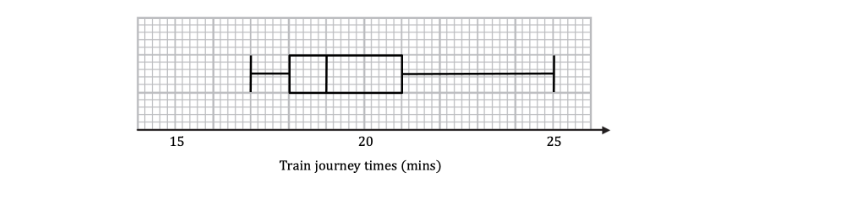

Using the box and whisker diagram above to find

(i) the median journey time

(ii) the lower and upper quartiles

(iii) the interquartile range.

### 2() — 3 marks — structured
The above times show those for a weekday.  The table below summarises the times for the same journey on a Saturday.

| ** ** | **Journey Time** |
|---|---|
| Fastest | 16 |
| Lower quartile | 18 |
| Median | 19 |
| Upper Quartile | 20 |
| Slowest | 25 |

On the grid, draw a box plot for the information given in the table.

## Q2 — easy — 6 marks · exam-questions

### 1() — 4 marks — structured
The beats per minute (bpm) of 60 randomly selected drum ‘n’ bass songs were recorded and the data is summarised in the table below.

| *b*** (bpm)** | **Frequency** | **Class width** | **Frequency density** |
|---|---|---|---|
| 140 ≤ b <160 | 10 | 160-140=20 | 10÷20=0.5 |
| 160 ≤ b <170 | 20 | 10 |   |
| 170 ≤ b <175 | 20 | 5 |   |
| 175 ≤ b <180 | 10 | 5 |   |

(i) Complete the column ‘Frequency density’ – the first one has been done for you.

(ii) On the grid below, draw a histogram to represent these data.

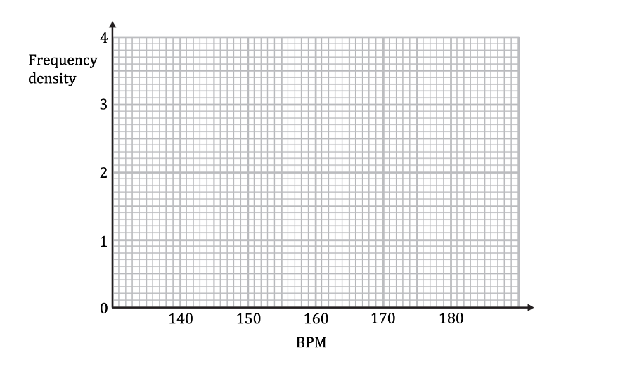

### 2() — 2 marks — structured
Estimate how many of the 60 songs had less than 150 beats per minute.

## Q3 — easy — 7 marks · exam-questions

### 1() — 4 marks — structured
A local ambulance service is looking to cut down the times it takes to respond to 999 calls.  The ambulance service manager recorded the response times, in minutes, on 15 occasions.  These are given below.

| 4 | 8 | 12 | 9 | 7 |
|---|---|---|---|---|
| 14 | 6 | 5 | 8 | 7 |
| 9 | 10 | 7 | 3 | 6 |

(i) Find the median of the response times.

(ii) Find the upper and lower quartiles, and the interquartile range.

### 2() — 3 marks — structured
On the grid, draw a box plot for the information given above.

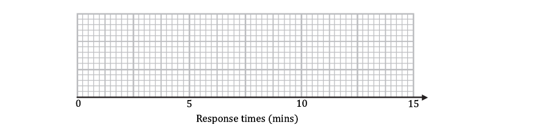

## Q4 — easy — 5 marks · exam-questions

### 1() — 5 marks — structured
To quality control the elasticity of elastic bands, a company selects random elastic bands from the end of their production line and has a machine stretch them until they snap.  The length, measured in millimetres, of an elastic band at the moment it snaps is recorded.  The incomplete histogram and frequency table below show the results.

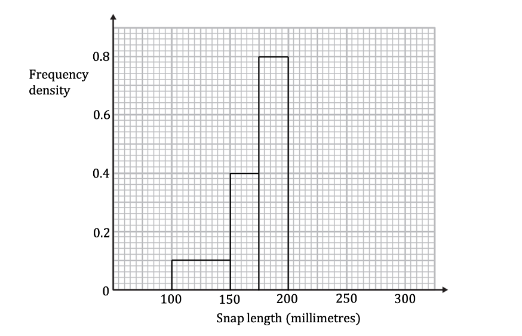

| **Snap length, ***l*** (mm)** | **Frequency** | **Class width** | **Frequency density** |
|---|---|---|---|
| 100 ≤* l* <150 | 5 | 150 - 100 = 50 | 5÷50=0.1 |
| 150 ≤ *l *<175 |   |   | ÷25=0.4 |
| 175 ≤ *l *<200 |   |   |   |
| 200 ≤ *l *< 225 | 15 | 225 - 200 = 25 |   |
| 225 ≤ *l *<275 | 10 |   |   |

Use the information to complete both the histogram and frequency table.

## Q5 — easy — 5 marks · exam-questions

### 1() — 4 marks — structured
Kungawo is investigating the lengths of earthworms he finds in his garden.

He records his results in a stem-and-leaf diagram as shown below.

$n=23$

| 4 | 2     represents a length of 42 mm |
|---|---|
|   |   |
| 3 | 2   6 |
| 4 | 5   8   8   9 |
| 5 | 1   2   2   3   3   3   4   5   5   7   8   9 |
| 6 | 0   2   4 |
| 7 | 1   3 |

(i) Find the median, lower quartile and upper quartile.

(ii) Find the interquartile range.

### 2() — 1 mark — structured
State one advantage of using a stem-and-leaf diagram to represent data.

## Q6 — easy — 5 marks · exam-questions

### 1() — 3 marks — structured
In a conkers competition the number of strikes required in order to smash an opponent’s conker (and thus win a match) is recorded for 15 matches and are given below.

6            2            9            10         9            12         5

8            7            5            11         9            17         8              9

Find the median, the upper and lower quartiles, and the interquartile range for the number of strikes required to smash a conker.

### 2() — 2 marks — structured
An outlier is defined as any data value that falls either more than 1.5 $\times$ (interquartile range) above the upper quartile or less than 5 $\times$ (interquartile range) below the lower quartile.

Identify any outliers.

## Q7 — easy — 5 marks · exam-questions

### 1() — 3 marks — structured
A hotel manager recorded the number of towels that went missing at the end of each day for 12 days.  The results are below.

2            4            1            0            3            4

3            9            3            2            4            5

Find the mean and the standard deviation for the number of towels missing at the end of each day. 
You may use the summary statistics $n=11$,  $\sumx=40$, $\sumx^{2}=190$ with the formulae $\overline{x}=\frac{\sumx}{n}$ and
  `sigma equals space square root of fraction numerator sum x squared over denominator n end fraction minus open parentheses x with bar on top close parentheses squared end root`.

### 2() — 2 marks — structured
An outlier is defined as any data value lying outside of 2 standard deviations of the mean. Find any outliers in the data.

## Q8 — easy — 5 marks · exam-questions

### 1() — 1 mark — structured
Joe counts the number of different species of bird visiting his garden each day for a week. The results are given below.

7            8            5            12         9            7            3

Calculate the mean number of different species of bird visiting Joe’s garden.

### 2() — 3 marks — structured
Joe continues to record the number of different species of bird visiting his garden each day for the rest of the month and calculates the mean number of different species is 9.25 for the remaining 24 days.

Joe says, using the data from the whole month, he would expect to see 9 different species of bird every day. Explain whether Joe is correct. You must support your answer with clear working.

### 3() — 1 mark — structured
Joe decides he will repeat his investigation into species of bird visiting his garden three months later. That month he finds the mean number of different species visiting his garden per day is 4.5.  Joe is concerned that this indicates some species of bird are dying out.  Suggest a reason why this may not be the case.

## Q9 — easy — 8 marks · exam-questions

### 1() — 5 marks — structured
Shara is practising the long jump, recording her distances to the nearest 10 cm. During one practice session, Shara attempts the long jump 23 times and the distances she achieved are listed below.

3.4        3.1        3.5        3.8        4.1        2.8        3.2              3.0

3.2        3.6        3.1        2.9        3.9        3.1        2.7              3.4

3.1        3.2        3.5        3.3        3.6        2.8        4.0

(i) Draw an ordered, stem-and-leaf diagram to illustrate Shara’s long jump

(ii) Find the median and mode distances.

### 2() — 3 marks — structured
(i) Find the mean of Shara’s long jump distances.

(ii) By considering the relative sizes of the mean, median and mode, comment on the skewness of Shara’s long jump distances.

## Q10 — easy — 7 marks · exam-questions

### 1() — 3 marks — structured
A second hand car business specialises in dealing with cars valued under £5000. 
For one day the manager records the sale price of the 35 cars the business sells.

The manager codes the sale prices using the formula $Y=\frac{X-2500}{100}$, where `£ X` is the sale price of a car.

The coded data for $Y$ is summarised in the box-and-whisker diagram below.

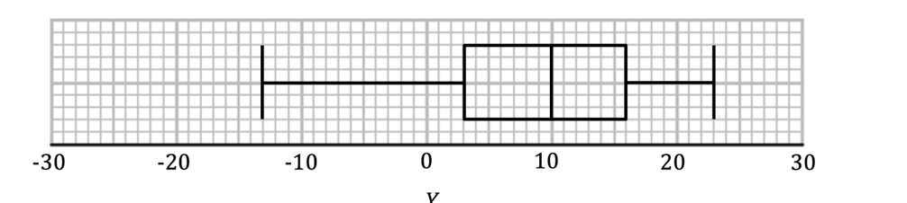

Use the box-and-whisker plot to find:

(i) The median sale price of a car on this day.

(ii) The sale price of the least expensive car sold on this day.

### 2() — 4 marks — structured
In the last five minutes of business two more cars are sold – one for £3400 and one for £3600.

(i) Find the $Y$ values for these cars.

(ii) Describe and justify the effect these two late sales have on the median sale price of a car for this day.

## Q11 — easy — 7 marks · exam-questions

### 1() — 3 marks — structured
Two geologists are measuring the size of rocks found on a beach in front of a cliff. 
The geologists record the greatest length, in millimetres, of each rock they find at distances of $5m$ and $25m$ from the base of the cliff.  They randomly choose 20 rocks at each distance. Their results are summarised in the table below.

| Distance from cliff base | $5m$ | $25m$ |
|---|---|---|
| Number of rocks, $n$ | 20 | 20 |
| $\sumx$ | 3885 | 2220 |
| $S_{xx}$ | 369 513.75 | 287 580 |

Using the formulae $\overline{x}=\frac{\sumx}{n}$ and $σ=\sqrt{\frac{S_{xx}}{n}}$, find the mean and standard deviation for the size of rocks at both $5m$ and $25m$ from the base of the cliff.

### 2() — 2 marks — structured
Compare the location (mean) and spread (standard deviation) of the size of rocks at $5m$ and $25m$ from the base of the cliff.

### 3() — 2 marks — structured
In this instance, an outlier is determined to be any data value that lies outside one standard deviation of the mean $(\overline{x}\pmσ)$.

(i) Find the smallest rock that is ***not*** an outlier at $5m$ from the base of the cliff.

(ii) Briefly explain why there cannot be any ***small*** rock outliers at $25m$ from the base of the cliff.

## Q12 — medium — 7 marks · exam-questions

### 1() — 4 marks — structured
Jeanette works for a conservation charity who rescue orphaned otters.  Over many years she records the weight (*g*) of each otter when it first arrives.  The data is illustrated in the following box and whisker diagram:

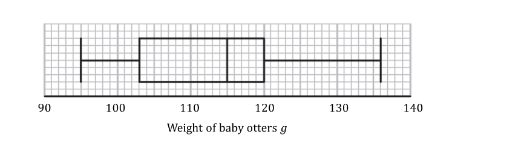

Using the box plot above:

(i) Write down the median weight of the otters.

(ii) Write down the lower quartile.

(iii) Find the interquartile range.

### 2() — 3 marks — structured
Otters are then weighed weekly to track their growth.  Summary data on the weights (*g*) of otters after one month is shown in the table below:

|   | **Weight ***g* |
|---|---|
| Smallest weight | 125 |
| Range | 48 |
| Median | 152 |
| Upper Quartile | 164 |
| Interquartile Range | 33 |

On the grid, draw a box plot for the information given above.

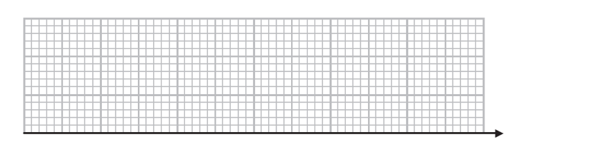

## Q13 — medium — 7 marks · exam-questions

### 1() — 4 marks — structured
The total amount of time cleaners spent dealing with unplanned incidents in a supermarket was recorded each day.  Data collected over 49 days is summarised in the table below.

| **Time ***t*** (minutes)** | **Frequency ***f* |
|---|---|
| 0 ≤ *t* < 90 | 9 |
| 90 ≤ *t* < 120 | 24 |
| 120 ≤ *t* < 200 | 12 |
| 200 ≤ *t* < 250 | 4 |

On the grid below, draw a histogram to represent this data.

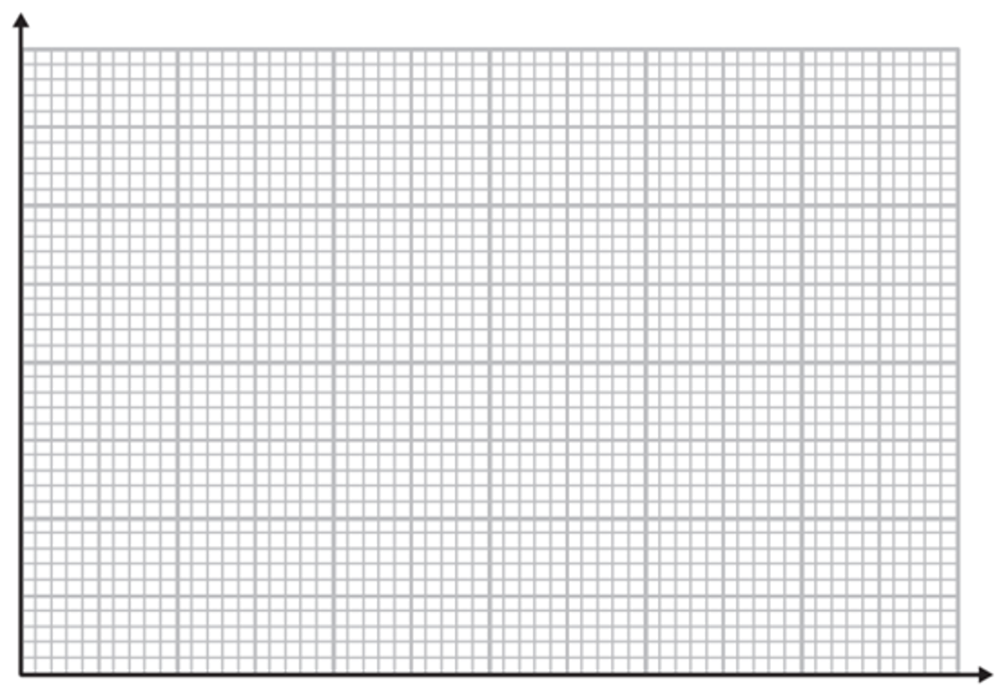

### 2() — 3 marks — structured
Estimate how often cleaners spent longer than 3 hours dealing with incidents.

## Q14 — medium — 6 marks · exam-questions

### 1() — 3 marks — structured
A taxi firm, JustDrive, records data on the amount of time, to the nearest minute, that customers had to wait before their taxis arrived.  A random sample of 20 times is given below:

| 6 | 7 | 16 | 30 | 24 |
|---|---|---|---|---|
| 27 | 20 | 7 | 5 | 8 |
| 20 | 24 | 27 | 12 | 34 |
| 32 | 31 | 6 | 19 | 14 |

Find the median and interquartile range of the waiting times.

### 2() — 3 marks — structured
On the grid, draw a box plot for the information given above.

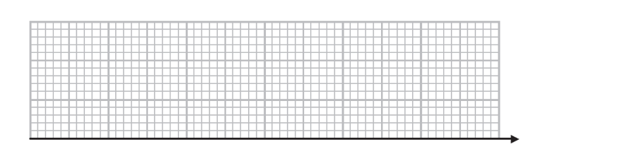

## Q15 — medium — 4 marks · exam-questions

### 1() — 4 marks — structured
Filmworld cinemas collected data on the ages of visitors to their cinemas during a 24-hour period.  The incomplete histogram and frequency table show some of the information they collected:

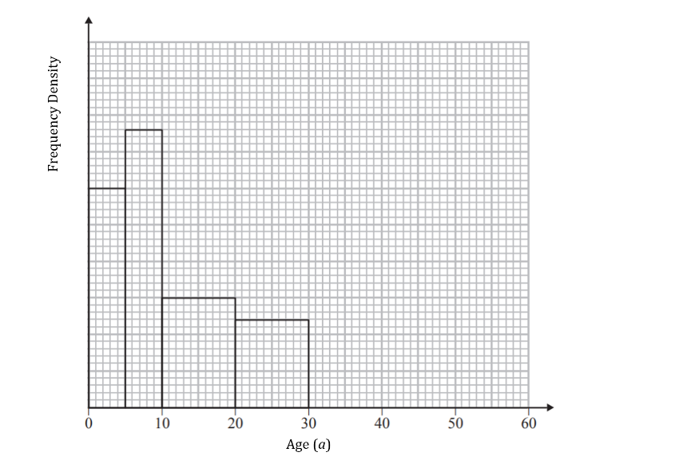

| **Age **a** (years)** | **Frequency **f |
|---|---|
| 0 ≤ *a* < 5 | 15 |
| 5 ≤ *a* < 10 |   |
| 10 ≤ *a* < 20 |   |
| 20 ≤ *a* < 30 | 12 |
| 30 ≤ *a* < 50 | 18 |
| 50 ≤ *a* < 60 | 7 |

Use the information to complete the histogram and fill out the missing data in the frequency table.

## Q16 — medium — 6 marks · exam-questions

### 1() — 3 marks — structured
An advertisement for a charity is shown on TV at the same time every weekday for four weeks. To assess the impact of the advert, the charity’s manager decides to record the number of donations the charity receives each day in the hour after the advert is broadcast.

The results are listed below:

21         27         24         31         17

22         25         26         27         9

32         29         25         24         40

23         22         19         12         14

Represent these data in a sorted stem-and-leaf diagram.

### 2() — 2 marks — structured
The manager decides that the advert is not cost effective unless the median number of donations per day in the hour after broadcast is at least 25. Determine whether the manager should continue to run the TV advert.

### 3() — 1 mark — structured
Give one advantage of using a stem-and-leaf diagram as opposed to grouping the data into a frequency table.

## Q17 — medium — 6 marks · exam-questions

### 1() — 2 marks — structured
The lengths of unicorn horns are measured in cm.  For a group of adult unicorns, the lower quartile was 87 cm and the upper quartile was 123 cm.  For a group of adolescent unicorns, the lower quartile was 33 cm and the upper quartile was 55 cm.

An outlier is an observation that falls either more than 1.5 $\times$ (interquartile range) above the upper quartile or less than 1.5 $\times$ (interquartile range) below the lower quartile.

Which of the following adult unicorn horn lengths would be considered outliers?

32 cm                96 cm                123 cm              188 cm

### 2() — 2 marks — structured
Which of the following adolescent unicorn horn lengths would be considered outliers?

12 cm                52 cm                86 cm                108 cm

### 3() — 2 marks — structured
(i) State the smallest length an adult unicorn horn can be without being considered an outlier.

(ii) State the smallest length an adolescent unicorn horn can be without being considered an outlier.

## Q18 — medium — 7 marks · exam-questions

### 1() — 7 marks — structured
Students at two Karate Schools, Miyagi Dojo and Cobra Kicks, measured the force of a particular style of hit. Summary statistics for the force, in newtons, with which the students could hit are shown in the table below:

|   | $n$ | $\sumx$ | $\sumx^{2}$ |
|---|---|---|---|
| Miyagi Dojo | 12 | 21873 | 41532545 |
| Cobra Kicks | 17 | 29520 | 52330890 |

(i) Calculate the mean and standard deviation for the forces with which the students could hit.

(ii) Compare the distributions for the two Karate Schools.

## Q19 — medium — 7 marks · exam-questions

### 1() — 4 marks — structured
The heights, in metres, of a flock of 20 flamingos are recorded and shown below:

0.4        0.9        1.0        1.0        1.2        1.2        1.2        1.2        1.2         1.2

1.3        1.3        1.3        1.4        1.4        1.4        1.4        1.5        1.5         1.6

An outlier is an observation that falls either more than 1.5  (interquartile range) above the upper quartile or less than 1.5  (interquartile range) below the lower quartile.

(i) Find the values of $Q_{1},Q_{2}$ and $Q_{3}$.

(ii) Find the interquartile range.

(iii) Identify any outliers.

### 2() — 3 marks — structured
Using your answers to part (a), draw a box plot for the data.

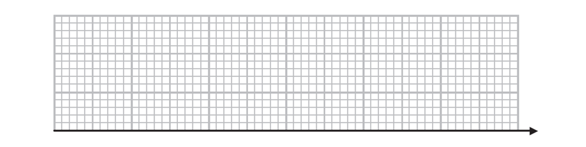

## Q20 — medium — 7 marks · exam-questions

### 1() — 3 marks — structured
The number of daily Covid-19 vaccinations reported by one vaccination centre over a 14-day period are given below:

237       264       308       313       319       352       378

378       405       421       428       450       465       583

Given that $\sumx=5301$ and  $\sumx^{2}=2113195$,  calculate the mean and standard deviation for the number of daily vaccinations.

### 2() — 2 marks — structured
An outlier is an observation which lies more than $\pm2$ standard deviations away from the mean.

Identify any outliers for this data.

### 3() — 2 marks — structured
Outliers are to be removed from the data, and the mean and standard deviation recalculated. Without making any further calculations, state the effect on the value of the mean and standard deviation removing outliers would have.

## Q21 — medium — 8 marks · exam-questions

### 1() — 3 marks — structured
A disgruntled chocaholic is complaining that their favourite tub of chocolates seems to have very few of their favourite ‘toffee deluxe’ sweets in, compared to the other four available. In a bid to show they have a valid complaint, the chocaholic bought 10 tubs of the sweets and counted how many of each of the five sweets are contained in each tub.

The results are summarised in the box and whisker diagrams below.

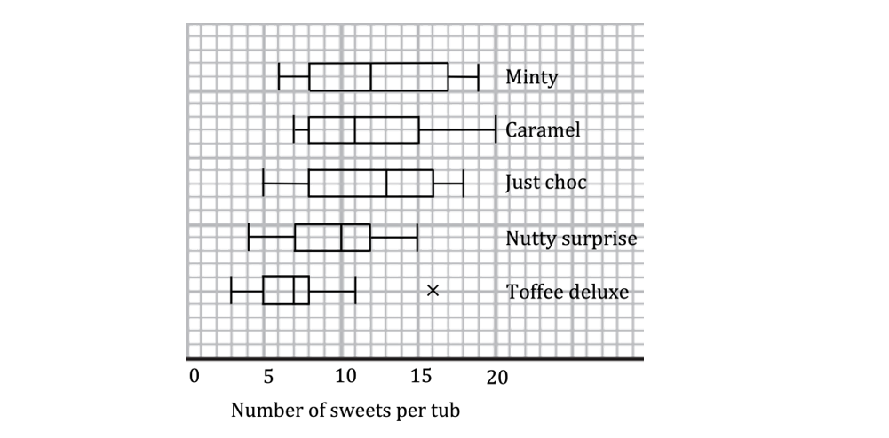

(i) Write down the median number of ‘toffee deluxe’ sweets in a tub.

(ii) Work out the interquartile range for ‘toffee deluxe’.

### 2() — 2 marks — structured
What value is indicated by the ($\times$) on the ‘toffee deluxe’ box plot and why has this been plotted individually?

### 3() — 3 marks — structured
(i) Briefly compare the central tendency and variation of ‘toffee deluxe’ compared to the other four sweets.

(ii) Do you think the disgruntled chocaholic has a valid complaint regarding the number of ‘toffee deluxe’ sweets in a tub? Fully justify your answer.

## Q22 — medium — 8 marks · exam-questions

### 1() — 5 marks — structured
A café owner is analysing data about the number of customers they serve on weekdays during the busy lunchtime period between 12pm and 2pm. The data below shows the number of customers who were served between 12pm and 2pm each weekday over a three-week period.

52         64         58         49         52

71         63         52         56         58

53         52         47         68         56

(i) Find the mode and median number of customers per weekday during the lunchtime period.

(ii) Given the summary statistics $\sumx=851$ and  $\sumx^{2}=48965$, find the mean and the standard deviation.

### 2() — 3 marks — structured
(i) By considering the relative values of the mean, median and mode, state whether there is skewness in the data, giving a reason for your answer.

(ii) A measure of skewness can be found by calculating

$\frac{3\times(\mathrm{mean}-\mathrm{median})}{\mathrm{standard} \mathrm{deviation}}$

Find the value of this measure of skewness for the number of customers the café served during the lunchtime period over the three weeks.

## Q23 — medium — 4 marks · exam-questions

### 1() — 2 marks — structured
David buys and sells small antique items as a hobby, aiming to make a few hundred pounds profit each month.  Over the last two years David has kept a record of how much profit he has made each month `left parenthesis £ X right parenthesis` and wants to analyse the figures by calculating his mean monthly profit – and, to account for the variation in the antiques market – the standard deviation of his monthly profit.

David codes the data using the relationship $Y=0.1X-50$. For one of the months, the $Y$ value is $-6$. Work out the profit David made in this month.

### 2() — 2 marks — structured
Given that the mean of $Y$ is $2.3$ and the standard deviation of  is 0.8*,* find the mean amount of profit David made and the standard deviation for the two-year period.

## Q24 — medium — 8 marks · exam-questions

### 1() — 2 marks — structured
The stem-and-leaf diagram below shows the number of attempts 27 gamers took to complete the last level of a computer game.

$n=27$

| 2 | 8     represents 28 attempts to complete the last level |   |
|---|---|---|
|   |   |   |
| 0 | 5   5   6 | (3) |
| 1 | 1   4   4   7   8   8   9 | (7) |
| 2 | 0   3   4   4   5   7   8   8   8   8   9 | (11) |
| 3 | 1   4   8   9 | (4) |
| 4 | 1   2 | (2) |

(i) How can you tell, without any calculations, that the modal class for the number of attempts was 20 to 29?

(ii) Explain why it is not necessarily the case that the gamer who took the least number of attempts was the fastest to complete the level.

### 2() — 3 marks — structured
Find the median, the lower quartile and the upper quartile.

### 3() — 2 marks — structured
By comparing the median with the quartiles, comment on the skewness of the data.

### 4() — 1 mark — structured
The computer game developer decided that the last level was not difficult enough so added an extra, even harder, level. Briefly describe what you would expect to happen to the median if the number of attempts taken by the same 27 gamers to complete the new last level were recorded.

## Q25 — hard — 8 marks · exam-questions

### 1() — 1 mark — structured
The amounts of time engineers spent dealing with individual faults in a power plant were recorded to the nearest minute.  Data on 30 different faults is summarised in the table below.

| **Time ***t**** *****(minutes)** | **Frequency ***f* |
|---|---|
| 90 - 129 | 6 |
| 130 - 169 | 8 |
| 170 - 199 | 12 |
| 200 - 249 | 4 |

Give a reason to support the use of a histogram to represent these data.

### 2() — 4 marks — structured
On the grid below, draw a histogram to represent the data.

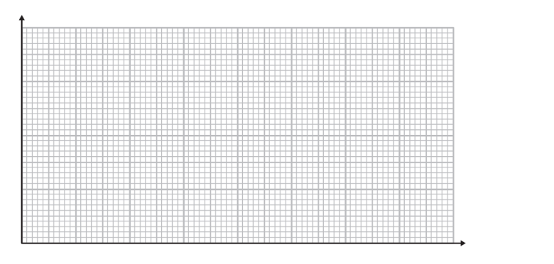

### 3() — 3 marks — structured
Estimate the proportion of individual faults on which engineers spent longer than three hours.

## Q26 — hard — 7 marks · exam-questions

### 1() — 3 marks — structured
A teacher took 19 students on an international trip. The incomplete box plot below shows part of the summary of the weights, in kg, of the luggage brought by each student. Each student’s luggage weighed a different amount.

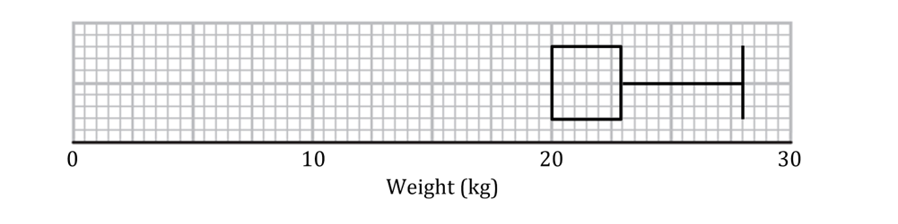

The median weight is 4 kg more than the lower quartile. The range of weights is three times the interquartile range of weights.

Use the information above to complete the box plot.

### 2() — 2 marks — structured
Calculate the proportion of luggage weights which were less than 20 kg.

### 3() — 2 marks — structured
Students had to pay an additional fee if the weight of their luggage exceeded 23 kg.

Find the number of students who had to pay the additional fee.

## Q27 — hard — 7 marks · exam-questions

### 1() — 5 marks — structured
The histogram below shows the masses, in grams, of 80 apples.

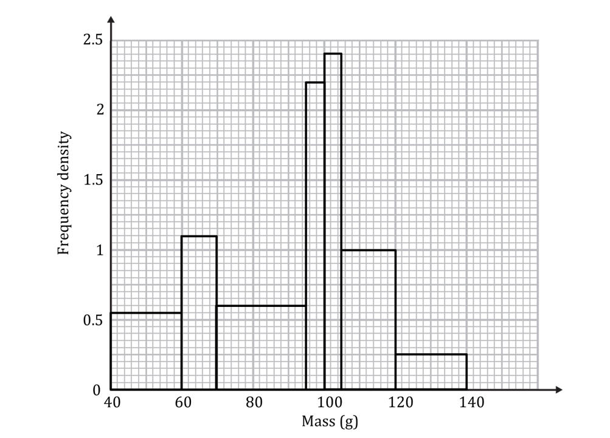

Find estimates for the median, lower quartile and upper quartile.

### 2() — 2 marks — structured
Given that the lightest apple weighs 41 g and that the range of masses is 97 g, draw a box plot to show the distribution of the masses of the apples.

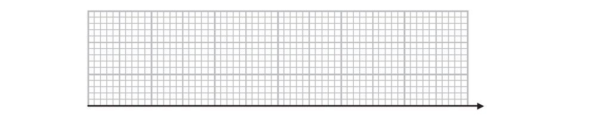

## Q28 — hard — 12 marks · exam-questions

### 1() — 4 marks — structured
As part of an experiment, 15 maths teachers are asked to solve a riddle and their times, in minutes, are recorded:

8            12         19         20         20

21         22         23         23         23

25         26         27         37         39

An outlier is an observation which lies more than $\pm2$ standard deviations away from the mean.

Show that there is exactly one outlier.

### 2() — 2 marks — structured
State, with a reason, whether the mean or the median would be the most suitable measure of central tendency for these data.

### 3() — 2 marks — structured
15 history teachers also completed the riddle; their times are shown below in the box plot:

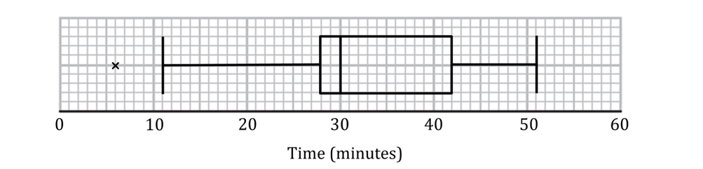

Explain what the cross (×) represents on the box plot above. Interpret this in context.

### 4() — 4 marks — structured
By comparing the distributions of times taken to complete the riddle, decide which set of teachers were faster at solving the riddle.

## Q29 — hard — 7 marks · exam-questions

### 1() — 3 marks — structured
Hugo, a newly appointed HR administrator for a company, has been asked to investigate the number of absences within the IT department. The department contains 23 employees, and the box plot below summarises the data for the number of days that individual employees were absent during the previous quarter.

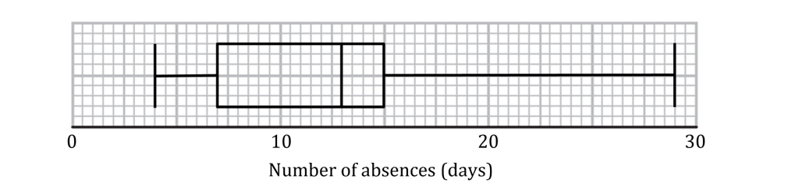

An outlier is an observation that falls either more than 1.5 $\times$ (interquartile range) above the upper quartile or less than 1.5 $\times$ (interquartile range) below the lower quartile.

Show that these data have an outlier, and state its value.

### 2() — 4 marks — structured
For the 23 employees within the department, Hugo has the summary statistics:

$\sumx=286$ and  $\sumx^{2}=4238$

Hugo investigates the employee corresponding to the outlier value found in part (a) and discovers that this employee had a long-term illness.  Hugo decides not to include that value in the data for the department.

Assuming that there are no other outliers, calculate the mean and standard deviation of the number of days absent for the remaining employees.

## Q30 — hard — 7 marks · exam-questions

### 1() — 4 marks — structured
Ms Chew is an accountant who is examining the length of time it takes her to complete jobs for her clients. Ms Chew looks at her spreadsheet and lists the number of hours it took her to complete her last 12 jobs:

| 9 | 2 | 7 | 6 | 5 | 2 | 4 | 6 | 21 | 5 | 3 | 8 |
|---|---|---|---|---|---|---|---|---|---|---|---|

An outlier is an observation which lies more than $2$ standard deviations away from the mean.

Show that 21 is the only outlier.

### 2() — 3 marks — structured
Ms Chew looks at her handwritten records and finds that the value 21 was typed into the spreadsheet incorrectly. It should have been 12.

Without further calculations, explain the effect this would have on the:

(i) mean

(ii) standard deviation

(iii) median.

## Q31 — hard — 7 marks · exam-questions

### 1() — 2 marks — structured
Jan is concerned about the availability of toilet rolls following news of supply issues due to a lack of lorry drivers.  Jan visits 19 shops, starting at the local village store and visiting numerous shops in the local town centre, before travelling to some of the larger out of town supermarkets.  At each shop, Jan counts the number of standard 4 packs of toilet rolls available for customers to buy.

Jan records the results in a stem-and-leaf diagram, shown below.

$n=19$

| 2 | 3     represents 23 packs of standard 4 pack toilet rolls |
|---|---|
|   |   |
| 0 | 2   7 |
| 1 | 3   5   6 |
| 2 | 4   7   7   8   9   9 |
| 3 | 5   5   6   7 |
| 4 | 1   3   3 |
| 5 | 0 |

Show that the median is 29 standard 4 packs and find the lower quartile.

### 2() — 4 marks — structured
Jan later visits another shop and again counts the number of standard 4 packs of toilet rolls available. Jan did not have anywhere to record the number and later forgets, only recalling that it was between 10 and 19.

(i) Explain the effect this new value *would* have on the median.

(ii) Explain the effects this new value *could* have on the lower quartile.

### 3() — 1 mark — structured
By considering the range of the number of standard 4 packs of toilet rolls available at the shops Jan visited, suggest a problem with Jan’s method of collecting the data.

## Q32 — hard — 6 marks · exam-questions

### 1() — 3 marks — structured
A road safety team are investigating how fast vehicles are travelling along a village road with a speed limit of 40 mph.  The team record the speeds of 120 vehicles travelling along the road one day during the busy morning rush hour period.

The histogram below shows the speeds of the 120 vehicles.

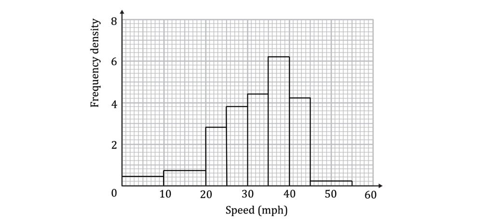

Determine:

(i) the modal class

(ii) the class containing the median

### 2() — 3 marks — structured
The road safety team decide they will recommend anti-speeding measures if 30% or more of the recorded speeds are higher than 2.5 mph less than the speed limit.

Determine whether the team will be recommending anti-speeding measures.

## Q33 — hard — 5 marks · exam-questions

### 1() — 2 marks — structured
Andrew is investigating the life expectancy at birth for countries in Europe and Asia.

He takes a random sample of 11 countries from each continent, and using data from a reliable online source he notes the life expectancies at birth from the year 2010 for each of the countries in his samples.

Andrew codes the data for Asia, using the formula $Y=a(X-b)$,  where $X$ is the life expectancy and $a$ and $b$ are positive integers.

(i) Given that the interquartile ranges for $X$ and $Y$ are 5.23 and 523 respectively, write down the value of $a$.

(ii) Given further that the medians for $X$ and $Y$ are 74.15 and $-85$ respectively, find the value of $b$.

### 2() — 3 marks — structured
Andrew uses the same coding formula for the 11 European countries and calculates the coded median and interquartile range to be $-66$ and 551 respectively. Compare the central tendency and variation of the life expectancies at birth in 2010 for the European and Asian countries in Andrew’s samples.

## Q34 — hard — 8 marks · exam-questions

### 1() — 2 marks — structured
Aggie runs a local bowls club and wants to attract younger members.  First Aggie needs to find out some information about the ages of current members of the club. Selecting 35 male members and 35 female members at random, Aggie illustrates the ages of the 70 members on an ordered back-to-back stem-and-leaf diagram as shown below.

$n=70$          (35 Female, 35 Male)

| (represents a female aged 50)     0 | 5 | 5     (represents a male aged 55) |
|---|---|---|
| ** ** |   | ** ** |
| **Female** |   | **Male** |
| 7 | 1 |   |
| 8 | 2 | 4   5 |
| 6   2 | 3 | 2   7   7   9 |
| 5   3   3   1 | 4 | 4   4   5   6   6   7   8   8 |
| 9   8   8   7   6 | 5 | 0   2   2   3   4   6   6   7   8   8   9   9   9 |
| 9   9   7   6   4   3   2   1   1   1   0   0 | 6 | 2   5   5   6   6 |
| 8   7   5   4   2   2 | 7 | 4   6 |
| 6   6   4 | 8 | 2 |
| 1 | 9 |   |

(i) Justify the use of a stem-and-leaf diagram for the data in this question.

(ii) State why, despite what the stem-and-leaf diagram shows, there may be some male teenage members of the bowls club.

### 2() — 4 marks — structured
Compare the central tendency and variation of the male and female members’ ages.

### 3() — 2 marks — structured
Compare the skewness of the two distributions.

## Q35 — very_hard — 6 marks · exam-questions

### 1() — 1 mark — structured
There are 180 dogs in a rescue shelter. The histogram below shows the highest sound level reached by each individual dog’s bark, measured in decibels (dB).

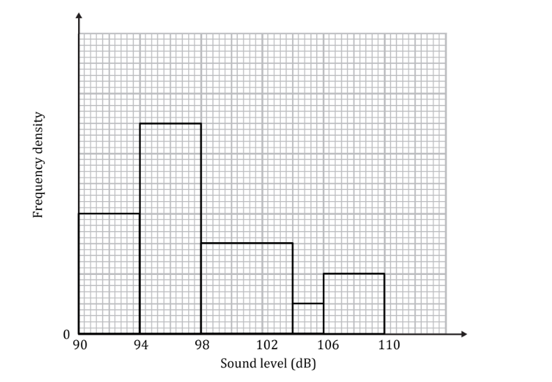

Write down the underlying feature associated with each of the bars in a histogram.

### 2() — 5 marks — structured
Estimate how many dogs had a bark which ranged between 99 dB and 107 dB.

## Q36 — very_hard — 6 marks · exam-questions

### 1() — 3 marks — structured
Mr Shapesphere, a history teacher, records the time, to the nearest minute, it takes him to mark each student’s essay. The times were summarised in a grouped frequency table and an extract is shown below:

| **Time ***t**** *****(minutes)** | **Frequency ***f* |
|---|---|
| 0 - 10 | 7 |
| 11 – 30 | 16 |
| 31 – 35 | 4 |

A histogram was drawn to represent these data. The 11 – 30 group was represented by a bar of width 6 cm and height 4.5 cm.

Find the width and height of the 0 – 10 group.

### 2() — 3 marks — structured
The total area under the histogram was 60.75 cm².

Find the number of essays which Mr Shapesphere recorded as taking longer than 35 minutes, to the nearest minute.

## Q37 — very_hard — 10 marks · exam-questions

### 1() — 5 marks — structured
Crystal is given an incomplete box plot showing the lengths of 99 unicorn horns. She also knows that the median length is the midpoint of the minimum and maximum lengths and that the range is 2.5 times as big as the interquartile range.

Complete the diagrams below to show that there are two possible distributions given the information above.

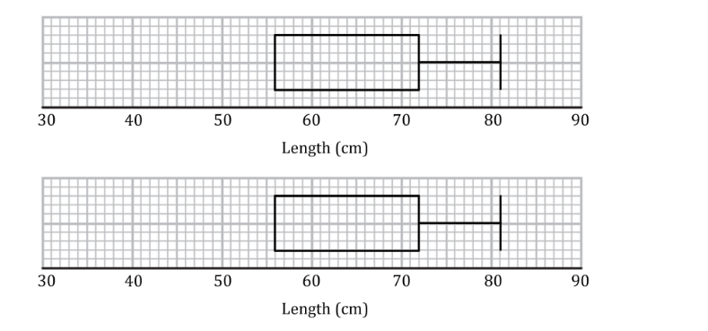

### 2() — 3 marks — structured
The box plot below shows the masses of the 99 unicorn horns.

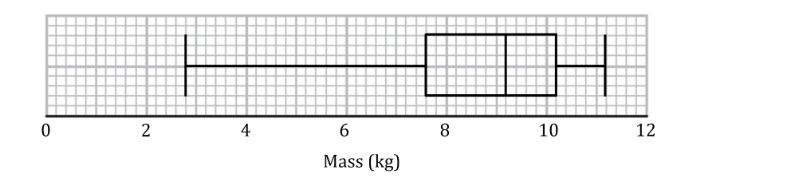

Crystal discovers that two masses were recorded incorrectly; 11 kg should have been 8 kg and 9 kg should have been 10 kg.

Explain why at most one value will need to be changed to fix the box plot.

### 3() — 2 marks — structured
Explain why it is possible that the box plot will remain unchanged when it is fixed.

## Q38 — very_hard — 8 marks · exam-questions

### 1() — 4 marks — structured
Football’s Premier League was launched in 1992 and the champions at the end of each season (up to and including the 2020-21 season) had scored the following number of goals:

67         80         80         73         76         68         80

97         79         79         74         73         72         72

83         80         68         103       78         93         86

102       73         68         85         106       95         85         83

(i) Justify the use of a stem-and-leaf diagram for these data.

(ii) Draw a stretched, ordered stem-and-leaf diagram for these data.

### 2() — 4 marks — structured
(i) Comment on the shape of the distribution of the data.

(ii) Which measure of central tendency would be the most appropriate to use with these data? Justify your choice.

## Q39 — very_hard — 9 marks · exam-questions

### 1() — 2 marks — structured
Marya is consistently late for work. David, Marya’s boss, records the number of minutes that she is late during the next six days. David calculates the mean is 18 minutes and the variance is 210 minutes². On one of the six days, Marya was 50 minutes late.

Show that 50 is an outlier, using the definition that outliers are more than 2 standard deviations away from the mean.

### 2() — 2 marks — structured
Marya states that the 50 minutes should not be included as it is an outlier.

(i) Give a reason why Marya wants the 50 minutes to be excluded from the  data set.

(ii) Give a reason why David wants the 50 minutes to be included in the data set.

### 3() — 5 marks — structured
Marya tells David that she was 50 minutes late that day due to a road accident, she shows David the traffic report as evidence.

David agrees to remove the 50 from the dataset, calculate the new mean and standard deviation for the remaining values.

## Q40 — very_hard — 10 marks · exam-questions

### 1() — 3 marks — structured
Tim has just moved to a new town and is trying to choose a doctor’s surgery to join, HealthHut or FitFirst. He wants to register with the one where patients get seen faster. He takes of sample of 150 patients from HealthHut and calculates the range of waiting times as 45 minutes and the variance as 121 minutes².

An outlier is defined as a value which is more than 2 standard deviations away from the mean.

Prove that the sample contains an outlier.

### 2() — 2 marks — structured
Tim finds out that the outlier is a valid piece of data and decides to keep the value in his sample.

Which pair of statistical measures would be more appropriate to use when using the sample to compare the doctor’s surgeries: the mean and standard deviation or the median and interquartile range? Give a reason for your answer.

### 3() — 1 mark — structured
The box plots below show the waiting times for the two surgeries.

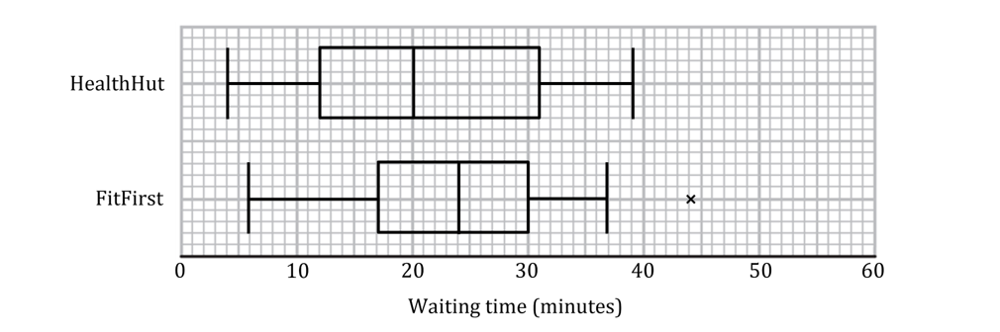

Given that there is only one outlier for HealthHut, label it on the box plot with a cross ($\times$).

### 4() — 4 marks — structured
Compare the two distributions of waiting times in context.

## Q41 — very_hard — 7 marks · exam-questions

### 1() — 4 marks — structured
The captain of a ferry that transports vehicles is investigating the masses of cars in the UK. They collect data on the masses ($m$ kg) of 30 randomly selected cars.

The data can be summarised by $\sum(m-a)=90$ and  $\sum(m-a)^{2}=2182818$, where  is a constant.

Given that the mean mass of the 30 cars, $\overline{m}=1423$ kg, find the value of the constant  and the standard deviation of the masses of the 30 cars.

### 2() — 3 marks — structured
Given that an outlier is defined as any value $m$ satisfying `vertical line m minus m with bar on top vertical line greater than 2 sigma` find the lowest and highest masses (to the nearest whole kilogram) that are not considered outliers.

## Q42 — very_hard — 7 marks · exam-questions

### 1() — 3 marks — structured
In a safety test, firemen carry out an experiment where a sofa in a typical living room setup is set on fire and allowed to burn.  After 10 minutes the fire is extinguished and a fire damage expert assesses and records the percentage of the room destroyed. The firemen repeat this experiment with identical equipment except that the sofa is treated with a fire-resistant chemical.

This process is repeated several times and the percentages recorded are listed below.

Without fire-resistant chemical (%):           85         76         83         48              91

80         67         82         79              85

76         72         84         76              69

With fire-resistant chemical (%):               40         51         52         48              60

48         77         46         40              51

54         51         46         45              49

Draw an ordered, back-to-back stem and leaf diagram to illustrate the data.

### 2() — 2 marks — structured
Find the median destruction percentages for both “without chemical” and “with chemical”.

### 3() — 2 marks — structured
It is later discovered that two of the values were muddled up.  The reading of 48% for “without chemical” should have been in the “with chemical” data whilst the 77% for “with chemical” should have been in the “without chemical” data. 
Explain how correcting these errors will affect your answers to part (b).
