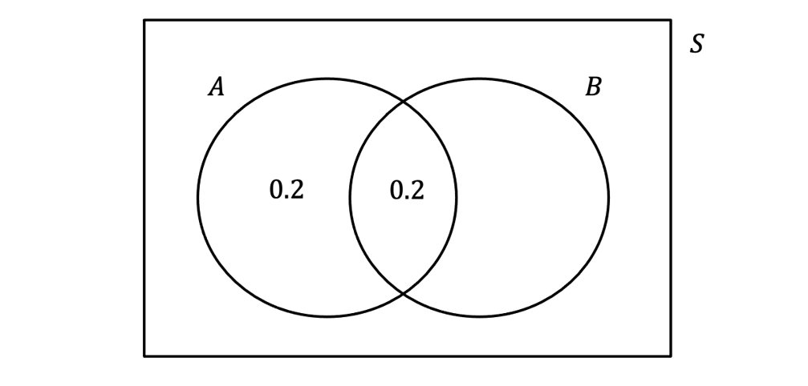
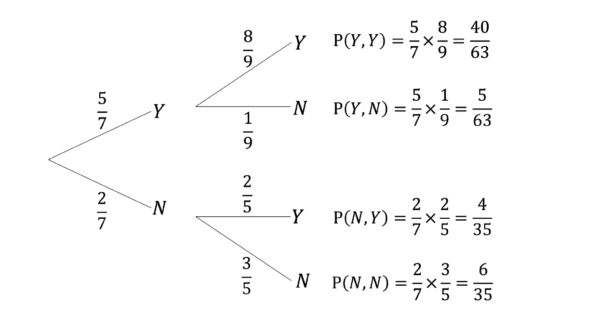
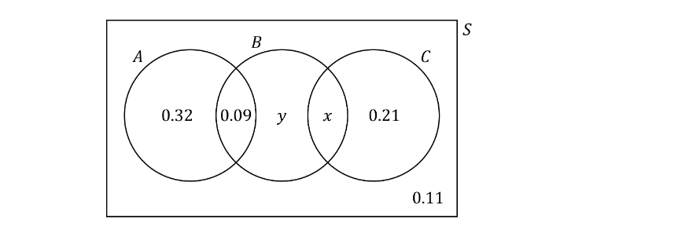
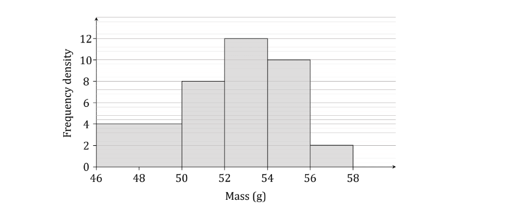
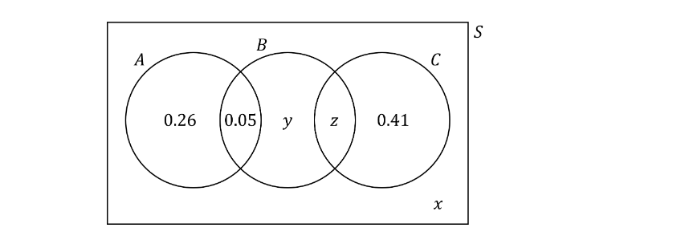
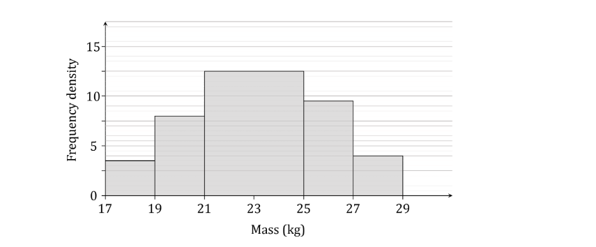
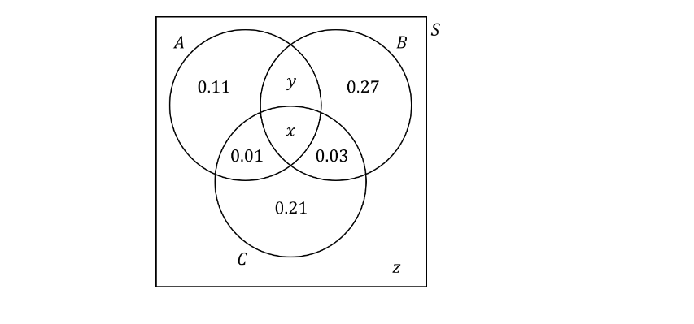

# Exam Questions — Basic Probability
**Probability** · Edexcel International A Level (IAL) Maths (YMA01) — Statistics 1
> Source: [https://www.savemyexams.com/international-a-level/maths/edexcel/20/statistics-1/topic-questions/probability/basic-probability/exam-questions/](https://www.savemyexams.com/international-a-level/maths/edexcel/20/statistics-1/topic-questions/probability/basic-probability/exam-questions/) · 41 questions · total 235 marks

## Q1 — easy — 6 marks · exam-questions

### 1() — 3 marks — structured
Write the following probability statements in words. The first one has been done for you.

(i) $P(A\capB)$ “The probability that *A* has happened and *B* has happened.”

(ii) $P(A\cupB)$

(iii) $P(A^{'}\capB^{'})$

(iv) $P((A\cupB)^{'})$

### 2() — 3 marks — structured
For each of the probability statements from part (a), including part (i), draw a Venn diagram and use shading to illustrate the probability. 
(You may assume that $A$ and $B$ are not mutually exclusive.)

## Q2 — easy — 4 marks · exam-questions

### 1() — 2 marks — structured
The heights, in cm, of 100 rockhopper penguins are recorded in the following table:

| **Height,***** ****h*** (cm)** | **Frequency** |
|---|---|
| 40 ≤ h <45 | 12 |
| 45 ≤ h <50 | 36 |
| 50 ≤ h <55 | 42 |
| 55 ≤ h <60 | 10 |

Write down the number of penguins that are

(i) at least 50 cm tall

(ii) between 45 and 55 cm tall.

### 2() — 2 marks — structured
A rockhopper penguin is chosen at random. Use your answers to part (a) to help determine the probability that the penguin is

(i) at least 50 cm tall

(ii) between 45 and 55 cm tall.

## Q3 — easy — 5 marks · exam-questions

### 1() — 2 marks — structured
$A$ and $B$ are two events such that $P(A)=0.4,P(B)=0.7$and  $P(A\capB)=0.2$.

Complete the two missing probabilities in the Venn diagram below.

### 2() — 3 marks — structured
Use the Venn diagram, or otherwise, to find

(i) $P(A\cupB)$

(ii) $P(A^{'})$

(iii) $P((A\capB)')$

## Q4 — easy — 4 marks · exam-questions

### 1() — 2 marks — structured
*A* and* B* are two events such that  P(*A*) = 0.3,  P(*B*) = 0.8,  and  P(*A* and *B*) = 0.24. 
Use the formula  P(*A *and *B*) = P(*A*) × P(*B*)  to determine whether* A* and *B* are independent or not.

### 2() — 2 marks — structured
*C* and *D* are two events such that  P(*C*) = 0.42,  P(*D*) = 0.51,  and  P(*C* or *D*) = 0.95. 
Use the formula  P(*C* or *D*) = P(*C*) + P(*D*)  to determine whether *C* and *D* are mutually exclusive or not.

## Q5 — easy — 5 marks · exam-questions

### 1() — 2 marks — structured
You may use the formula  P(*A* and *B)* = P(*A*) × P(*B*) in this question.

A fair spinner has five sections labelled ‘dog’, ‘cat’, ‘dog’, ‘dog’ and ‘rabbit’.

The spinner is spun once. 
Find the probability the spinner comes to rest on a section labelled

(i) ‘dog’

(ii) ‘rabbit’.

### 2() — 3 marks — structured
The spinner is spun twice. 
Find the probability that

(i) the spinner comes to rest on the section labelled ‘cat’ on both spins

(ii) the spinner does **not** come to rest on a section labelled ‘dog’ on either spin.

## Q6 — easy — 5 marks · exam-questions

### 1() — 3 marks — structured
Visitors to a nature museum were polled to see if they liked the museum’s two main attractions – a dinosaur skeleton and a stuffed Peruvian bear.  The probability that a visitor liked the dinosaur skeleton is 0.7.  The probability that a visitor liked the stuffed Peruvian bear is 0.5.  The probability a visitor liked both is 0.4.

Draw a Venn diagram to represent this information.

### 2() — 2 marks — structured
Use your Venn diagram from part (a) to determine the probability of a visitor liking neither of the two main attractions.

## Q7 — easy — 7 marks · exam-questions

### 1() — 2 marks — structured
A box of equally sized toy bricks contains 3 blue bricks and 2 red bricks.

A random toy brick is removed from the box. Determine the probability that this brick is

(i) blue

(ii) red.

### 2() — 3 marks — structured
A second brick is taken from the box **without** the first one being replaced. 
Copy and complete the tree diagram below that represents this situation.

### 3() — 2 marks — structured
Use your tree diagram from part (b) to determine the probability that both bricks taken from the box are blue.

## Q8 — easy — 8 marks · exam-questions

### 1() — 2 marks — structured
A fair die is rolled and a fair coin is tossed.

Complete the table below listing all possible outcomes.

**Coin**

| ** **  ** **  ** **  $\mathrm{Die}$  ** **  ** ** |   | **Heads** | **Tails** |
|---|---|---|---|
| **1** | 1H | 1T |   |
| **2** |   |   |   |
| **3** |   |   |   |
| **4** |   |   |   |
| **5** |   |   |   |
| **6** |   |   |   |

### 2() — 6 marks — structured
The event $A$ is the die landing on a multiple of three and the event $B$ is the coin landing on heads. Write down:

(i) $P(B)$

(ii) P(A’)

(iii) $P(A\capB)$

(iv) $P(A\cupB)$

## Q9 — easy — 4 marks · exam-questions

### 1() — 2 marks — structured
*A *and *B* are two events such that  P(*A*) = 0.25  and  P(*B*) = 0.7. Given that *A* and *B* are independent use the formula  P(*A* *and* B) = P(A) × P(B)  to find  P(A *and* B).

### 2() — 2 marks — structured
*C* and *D* are two events such that  P(*C*) = 0.4  and  P(*D*) = 0.5. Given that *C* and *D* are mutually exclusive use the formula  P(*C* or *D*) = P(*C*) + P(*D*)  to find  P(*C* or *D*).

## Q10 — easy — 5 marks · exam-questions

### 1() — 5 marks — structured
The tree diagram below shows the probabilities that a pool player will successfully complete two successive trick shots.  Y indicates a successful trick shot, N indicates a failed trick shot.

Use the probabilities given to determine the probability that the pool player

(i) successfully completes both trick shots

(ii) successfully completes exactly one trick shot

(iii) successfully completes at least one trick shot.

## Q11 — medium — 4 marks · exam-questions

### 1() — 4 marks — structured
The lengths, in cm, of 120 adult platypuses are recorded in the following table:

| **Length,***** ****l* **(cm)** | **Frequency (female)** | **Frequency (male)** |
|---|---|---|
| 39 ≤ $l$ < 42 | 14 | 0 |
| 42 ≤ $l$ < 45 | 29 | 0 |
| 45 ≤ $l$ < 48 | 12 | 7 |
| 48 ≤ $l$ < 51 | 6 | 21 |
| 51 ≤ $l$ < 54 | 3 | 19 |
| 54 ≤ $l$ < 57 | 1 | 5 |
| 57 ≤ $l$ < 60 | 0 | 2 |
| 60 ≤ $l$ < 63 | 0 | 1 |

One platypus is chosen at random.  Find the probability that the platypus is:

(i) male

(ii) less than 51 cm long

(iii) a male less than 45 cm long

(iv) a female between 45 and 54 cm long.

## Q12 — medium — 4 marks · exam-questions

### 1() — 4 marks — structured
Two fair spinners each have three sectors numbered 1 to 3.  The two spinners are spun together and then the product of the numbers indicated on each spinner is recorded.

Find the probability of the product indicated by the spinners being

(i) exactly 6

(ii) less than 4

(iii) an odd number.

## Q13 — medium — 5 marks · exam-questions

### 1() — 3 marks — structured
The Venn diagram below shows the probabilities of members of an exotic sports society participating in various activities.

*A* represents the event that the member participates in aerial yoga.

*B* represents the event that the member participates in bog snorkelling.

*C* represents the event that the member participates in cheese rolling.

Given that the probability of a member participating in cheese rolling is 0.44,

determine the values of

(i) *x*

(ii) *y.*

### 2() — 2 marks — structured
Determine the probability that a member of the society

(i) participates in at least one of the three activities

(ii) participates in exactly one of the three activities.

## Q14 — medium — 4 marks · exam-questions

### 1() — 4 marks — structured
On any given day the probability that Radigast has a lichen smoothie with his lunch is 0.4, and the probability that he has a wild mushroom wrap is 0.8.  Given that the probability of him having both those items is 0.35, find the probability that Radigast has:

(i) a wild mushroom wrap but not a lichen smoothie

(ii) neither a wild mushroom wrap nor a lichen smoothie.

## Q15 — medium — 4 marks · exam-questions

### 1() — 2 marks — structured
*A* and *B* are two events such that  P(*A*) = 0.35,  P(*B*) = 0.25  and  P(*A* or *B*) = 0.6.  State, with a reason, whether *A *and *B* are mutually exclusive.

### 2() — 2 marks — structured
*C* and *D* are two events such that  P(*C*) = 0.2,  P(*D*) = 0.4  and  P(*C* and *D*) = 0.18.  State, with a reason, whether *C* and *D* are independent.

## Q16 — medium — 8 marks · exam-questions

### 1() — 1 mark — structured
A fair four-sided die and a fair six-sided die are rolled and the sum of the numbers on their uppermost faces is recorded.

Complete the sample space below showing all possible outcomes.

|   | **Four – Sided Die** |   |   |   |   |
|---|---|---|---|---|---|
| **1** | **2** | **3** | **4** |   |   |
| **Six – Sided Die** | **1** | 2 | 3 |   |   |
| **2** | 3 |   |   |   |   |
| **3** |   |   |   |   |   |
| **4** |   |   |   |   |   |
| **5** |   |   |   |   |   |
| **6** |   |   |   |   |   |

### 2() — 5 marks — structured
An event $A$ is ‘the sum on the two dice is more than 7’ and an event $B$ is ‘scoring an odd number on one die and an even number on the other’.

Find:

(i) $P(A)$

(ii) $P(B)$

(iii) $P(A\capB)$

(iv) $P(A\cupB)$

### 3() — 2 marks — structured
Determine whether the events $A$ and $B$ are independent or not, justify your answer.

## Q17 — medium — 7 marks · exam-questions

### 1() — 5 marks — structured
Two letters are chosen at random from the word IMPOSSIBLE without replacement.  The event $A$ is defined as ‘choosing two of the same letters’ and the event $B$ is defined as 'the first letter taken is a letter S’.

Find:

(i) $P(A)$

(ii) $P(B)$

(iii) $P(A\capB)$

### 2() — 2 marks — structured
Determine whether the events $A$ and $B$ are mutually exclusive, justify your answer.

## Q18 — medium — 5 marks · exam-questions

### 1() — 3 marks — structured
The Idiosyncratic Delights ice cream company polls a group of students to find out whether they like the company’s two signature ice cream flavours – asparagus and blue cheese.  The probability that a student likes asparagus ice cream is 0.2.  The probability that a student likes blue cheese ice cream is 0.15.  The probability that a student likes neither flavour is 0.68.

Draw a Venn diagram to represent this information.

### 2() — 2 marks — structured
Determine whether the events ‘likes asparagus ice cream’ and ‘likes blue cheese ice cream’ are independent.

## Q19 — medium — 6 marks · exam-questions

### 1() — 3 marks — structured
A bag contains 13 yellow tokens and 7 green tokens. Two tokens are drawn from the bag without replacement.

Draw a tree diagram to represent this experiment.

### 2() — 3 marks — structured
Find the probability that the two tokens drawn are the same colour.

## Q20 — medium — 5 marks · exam-questions

### 1() — 5 marks — structured
Angelo meets with his maths tutor, Miss Perry, once a week. The probability that Miss Perry changes the time of the meeting is 0.2. The probability that she is late is 0.15. Otherwise she is on time. For the next two weeks that they meet, find the probability that Angelo’s maths tutor:

(i) is on time for both of the meetings

(ii) changes the time of their meeting at least once

(iii) is late for exactly one and changes the time of the other meeting.

## Q21 — medium — 8 marks · exam-questions

### 1() — 3 marks — structured
In a game of Galactic Unicorns your Monocerian-class space frigate is attacking an evil Sargonian robot ship.  Your attack will either hit or miss the robot ship, the probability of hitting the ship is 0.7.  If you hit the robot ship then there is a probability of 0.8 that the ship will be destroyed, otherwise it will manage to escape.  If you miss the robot ship then there is a probability of 0.2 that it will manage to escape, otherwise it will surrender because it has witnessed the immense power of your rainbow lasers.

Draw a tree diagram to represent this information.

### 2() — 3 marks — structured
Find the probability that the robot ship

(i) is destroyed

(ii) manages to escape

(iii) surrenders.

### 3() — 2 marks — structured
Show that the events ‘you hit the robot ship’ and ‘the robot ship manages to escape’ are independent.

## Q22 — hard — 5 marks · exam-questions

### 1() — 2 marks — structured
The histogram below shows the distribution of masses, in grams, of 80 newly hatched ducklings:

Find the probability that a duckling chosen at random has a mass less than 54 g.

### 2() — 3 marks — structured
Estimate the probability that a duckling chosen at random has a mass greater than 53 g.

## Q23 — hard — 4 marks · exam-questions

### 1() — 4 marks — structured
A game is played using a fair spinner with four sectors numbered 1 to 4, as well as a fair dice with its six sides numbered 1 to 6.  The spinner is spun and the dice is rolled, and the score in the game is defined as the (positive) difference between the two results.

Find the probability of the score in the game being

(i) exactly 0

(ii) 3 or more

(iii) a prime number.

## Q24 — hard — 6 marks · exam-questions

### 1() — 4 marks — structured
The Venn diagram below shows the probabilities of contributors to a wildlife charity sponsoring certain targeted campaigns run by the charity.

*A* represents the event that the member sponsors Aardvarks Aanonymous.

*B* represents the event that the member sponsors Bandicoots Unbanned.

*C* represents the event that the member sponsors Carry On Capybaras.

Given that the probability of a contributor sponsoring at least one of the three campaigns is 0.92, and the probability of a contributor sponsoring exactly one of the three campaigns is 0.7, determine the values of *x*, *y* and *z*.

### 2() — 2 marks — structured
Determine the probability that a contributor to the charity**  **

(i) sponsors Bandicoots Unbanned

(ii) sponsors exactly two of the three campaigns.

## Q25 — hard — 7 marks · exam-questions

### 1() — 2 marks — structured
A spinner with five equal sections labelled 1, 2, 3, 4 and 5 is spun once, the number the spinner lands on is recorded and then it is spun again.  The event $R$ is ‘The product of the two numbers the spinner lands on is even’ and the event $S$ is ‘The first number is greater than the second number’.

Construct a sample space diagram to display the product of the two numbers when the spinner is spun twice.

### 2() — 4 marks — structured
Find:

(i) $P(R)$

(ii) $P(S')$

(iii) $P(R\capS)$

(iv) $P(R\cupS)$

### 3() — 1 mark — structured
Give an example to show that the events $R$ and $S$ are not mutually exclusive.

## Q26 — hard — 4 marks · exam-questions

### 1() — 4 marks — structured
$A,B,C$ and $D$ are four events such that $P(A)=0.28,P(B)=0.33,P(C)=0.43$and $P(D)=0.25$.

(i) Given that $B$ and $C$ are mutually exclusive, find $P(B\mathrm{or}C)$.

(ii) Given that $A$ and $D$ are independent, find $P(A\mathrm{and}D)$.

## Q27 — hard — 6 marks · exam-questions

### 1() — 1 mark — structured
Praewa plays sports every day after school.  She is four times more likely to choose football than tennis and three times more likely to choose basketball than tennis.  She does not play any other sport.

Show that the probability of Praewa choosing tennis is $\frac{1}{8}$.

### 2() — 3 marks — structured
Find the probability that Praewa chooses three different sports on the next three days in a row.

### 3() — 2 marks — structured
On a five day week chosen at random, find the probability that Praewa chooses football every day.

## Q28 — hard — 4 marks · exam-questions

### 1() — 4 marks — structured
On any given day the probability that Tomás works on his poetry is 0.55, and the probability that he stops in at his local pub is 0.75.  Given that he always does at least one of those two things, find the probability that on a given day Tomás:

(i) goes to the pub and works on his poetry

(ii) goes to the pub but doesn’t work on his poetry.

## Q29 — hard — 5 marks · exam-questions

### 1() — 3 marks — structured
The Tell It Like It Is burger bar has been collecting data to find out whether customers like the restaurant’s two signature menu items – the Absolutely Awesome A-list Burger and the Basic But It’ll Do Bargain Burger.** **The probability that a customer likes both burgers is 0.12. The probability that a customer likes only one of the burgers is 0.71. The probability that a customer likes the Basic But It’ll Do Bargain Burger but doesn’t like the Absolutely Awesome A-list Burger is 0.03.

Draw a Venn diagram to represent this information.

### 2() — 2 marks — structured
Determine whether the events ‘likes the Absolutely Awesome A-list Burger’ and ‘likes the Basic But It’ll Do Bargain Burger’ are independent.

## Q30 — hard — 7 marks · exam-questions

### 1() — 4 marks — structured
A bag contains 12 red marbles, 7 green marbles and 1 black marble. Two marbles are drawn from the bag without replacement.

Draw a tree diagram to represent this experiment.

### 2() — 3 marks — structured
Find the probability that the two marbles drawn are not both the same colour.

## Q31 — hard — 8 marks · exam-questions

### 1() — 4 marks — structured
In a game of Unicorns Versus Zombies your unicorn is attempting to use the magic of its horn do dispel a cloud of zombie apocalypse flies.  On the first attempt, the probability of the magic working is 0.7.  If the magic works, then there is a probability of 0.2 that the flies will be turned into glitter pixies and join your rainbow army, otherwise the flies will simply be dispelled.  If the magic does not work the first time you may try again, although the probability of your magic working the second time is only 0.6.  Similarly, if your magic does not work the second time you may try a third time, but on the third attempt the probability of your magic working is reduced to 0.5.  If your magic works on the second or third attempts the probabilities of dispelling the flies or turning them into glitter pixies are the same as for the magic working on the first attempt.  If your magic does not work on the third attempt, however, then your unicorn is turned into an evil zombiecorn and joins the zombie horde.  In all cases, the game ends when either the flies are turned into glitter pixies, or the flies are dispelled, or your unicorn is turned into a zombiecorn.

Draw a tree diagram to represent this information.

### 2() — 3 marks — structured
Find the probability that

(i) the flies are turned into glitter pixies

(ii) the flies are dispelled

(iii) your unicorn is turned into a zombiecorn.

### 3() — 1 mark — structured
Give an example of two events in the game that are mutually exclusive.

## Q32 — very_hard — 10 marks · exam-questions

### 1() — 2 marks — structured
A six -sided spinner with equal segments labelled 1, 1, 1, 2, 3, 3 is spun and a fair coin is tossed. If the coin lands on heads the number recorded is one more than the number on the spinner. If the coin lands on tails the number on the spinner is doubled and recorded.
The event A is 'the number recorded is a prime number' and the event B is 'the number recorded is not one of the original numbers on the spinner'.

Show that the events A and B are mutually exclusive, justify your answer.

### 2() — 6 marks — structured
One of the segments on the spinner showing the number 1 is changed to a number 4 and the experiment is repeated using the same rules as before.

Find:

(i) P(A)

(ii) P(B)

(iii) P(A' n B)

(iv) P(AU B)'

### 3() — 2 marks — structured
After the change that has been made to the spinner, determine if the events A and B are still mutually exclusive. Justify your answer.

## Q33 — very_hard — 5 marks · exam-questions

### 1() — 2 marks — structured
The histogram below shows the distribution of masses, in kg, of 100 newborn calves:

Find the probability that a calf chosen at random has a mass greater than 21 kg.

### 2() — 3 marks — structured
Estimate the probability that a calf chosen at random has a mass less than 23.5 kg.

## Q34 — very_hard — 4 marks · exam-questions

### 1() — 4 marks — structured
A game is played using a fair spinner with four sectors numbered 1 to 4, as well as a fair eight-sided dice with its sides numbered 1 to 8.  The spinner is spun and the dice is rolled, and the score in the game is determined as follows:

- if the number on the spinner is higher than the number on the dice, then the score is the sum of the two numbers;
- if the number on the spinner is lower than the number on the dice, then the score is the (positive) difference of the two numbers;
- if the numbers on the spinner and the dice are equal, then the score is the product of the two numbers.

Find the probability of the score in the game being

(i) exactly 7

(ii) 10 or more

(iii) a triangular number (1, 3, 6, 10, 15, 21, …).

## Q35 — very_hard — 6 marks · exam-questions

### 1() — 4 marks — structured
The Venn diagram below shows the probabilities of members of a horror film society having seen various films.

A represents the event that the member has seen Aaaaaaaaaaagh!.

B represents the event that the member has seen Beware the Gloaming.

C represents the event that the member has seen Cute Kittens of Doom.

Given that half the members of the society have seen Cute Kittens of Doom, and that 38% of members have seen at least two of the three films determine the values of *x*, *y* and *z*.

### 2() — 2 marks — structured
Determine the probability that a member of the society

(i) has seen exactly two of the three films

(ii) has seen at least one of three films but not all three of them.

## Q36 — very_hard — 5 marks · exam-questions

### 1() — 5 marks — structured
On any given day the probability that Björn has an avocado with his lunch is 0.39, while the probabilities of him having a bacon butty or a piece of carrot cake are 0.32 and 0.44 respectively.  He never has all three items on the same day, but the probability that he doesn’t have at least one of them is only 0.09.**  **Given that the probability of him having exactly two of the three items is the same regardless of which two items those are, find the probability that on a given day Björn has:

(i) exactly one of the three items

(ii) a bacon butty but not a piece of carrot cake.

## Q37 — very_hard — 5 marks · exam-questions

### 1() — 5 marks — structured
*A*, *B *and *C* are three events such that  P(*A*) = 0.28,  P(*A* ∪ *C*) = 0.4  and P(*B* ∩* C*) = 0.02.

Given that *A* and *C* are mutually exclusive, and that *B *and* C* are independent, find P(*B)*, P(*C)* and P(*C* ∩ *B′)*.

## Q38 — very_hard — 7 marks · exam-questions

### 1() — 4 marks — structured
The online streaming music service Smudgify has been collecting data about the types of music listened to by its users.  The probability that a user listens to ambient grime is 0.25. The probability that a user listens to banjo & bass is 0.36. The probability that a user listens to coracle shanties is 0.56.  Only 10% of users do not listen to at least one of the three types of music, although it is also known that no users listen to both ambient grime and coracle shanties. It is twice as likely that a randomly selected user would listen to both coracle shanties and banjo & bass, as it is that the user would listen to both ambient grime and banjo & bass.

Draw a Venn diagram to represent this information.

### 2() — 3 marks — structured
Determine whether any of the events ‘listens to ambient grime’, ‘listens to banjo & bass’ and ‘listens to coracle shanties’ are independent of one another.

## Q39 — very_hard — 8 marks · exam-questions

### 1() — 4 marks — structured
Isabel has two boxes of chocolates. Box A contains 4 caramels and 6 toffees and box B contains 5 caramels and $x$ toffees. Isabel chooses a chocolate at random from box A and moves it to box B. Her friend then takes a chocolate at random from box B.

Show that the probability Isabel’s friend takes a caramel is given by `fraction numerator 27 over denominator 5 open parentheses x plus 6 close parentheses end fraction`.

### 2() — 4 marks — structured
Given that the probability that Isabel’s friend takes a toffee is $\frac{11}{20}$, find the value of $x.$

## Q40 — very_hard — 7 marks · exam-questions

### 1() — 4 marks — structured
A bag contains 10 black tokens and 6 white tokens.  A token is drawn from the bag and its colour recorded, and then a fair coin is flipped.  If the coin lands on heads then a second token is drawn from the bag without replacing the first token.  If the coin lands on tails then the first token is replaced in the bag before a second token is drawn.

Draw a tree diagram to represent this experiment.

### 2() — 3 marks — structured
Find the probability that the second token drawn is white.

## Q41 — very_hard — 9 marks · exam-questions

### 1() — 6 marks — structured
The game Undead Redemption is played using three fair dice – a four-sided dice with the sides numbered 1 to 4, a six-sided dice with the sides numbered 1 to 6, and an eight-sided dice with the sides numbered 1 to 8.

In the game your character is battling a zombie.  The battle can last between one and three rounds, and it is resolved as follows:

- In the first round, you and the zombie each roll the four-sided dice.  If your roll is greater than or equal to the zombie’s roll then the zombie is destroyed and the battle is over.  Otherwise your character is wounded and the battle goes on to the second round.
- In the second round, you roll the four-sided dice and the zombie rolls the six-sided dice.  If your roll is greater than or equal to the zombie’s roll then the zombie is destroyed and the battle is over.  Otherwise your character is wounded again and the battle goes on to the third round.
- In the third round, you roll the four-sided dice and the zombie rolls the eight-sided dice.  If your roll is greater than or equal to the zombie’s roll then the zombie is destroyed and the battle is over.  Otherwise your character is wounded for the third time and dies.

Draw a tree diagram to represent this information.

### 2() — 3 marks — structured
Find the probability that

(i) the zombie is destroyed

(ii) your character dies

(iii) your character is wounded one or more times but still manages to destroy the zombie
