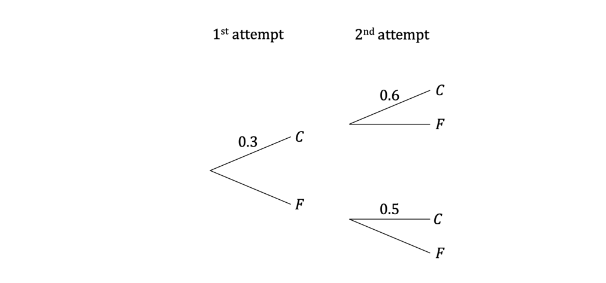
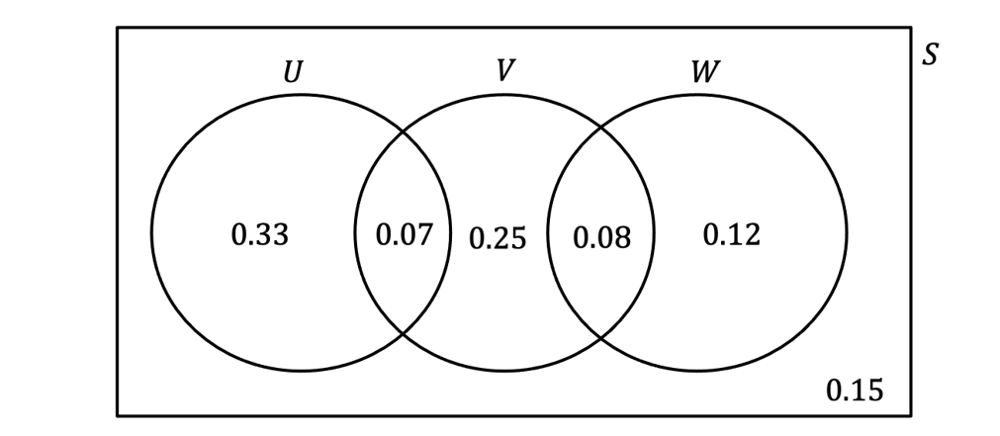
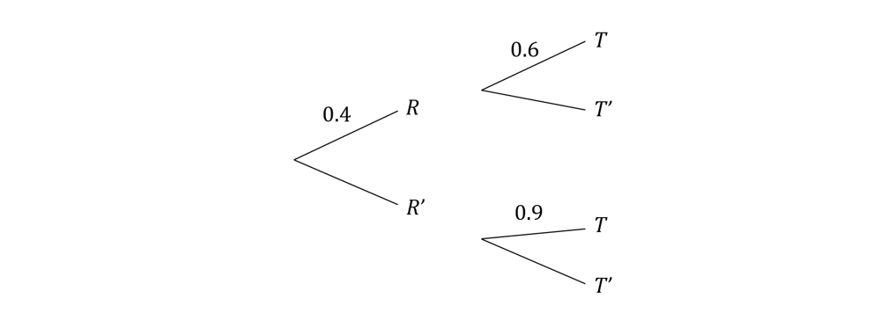
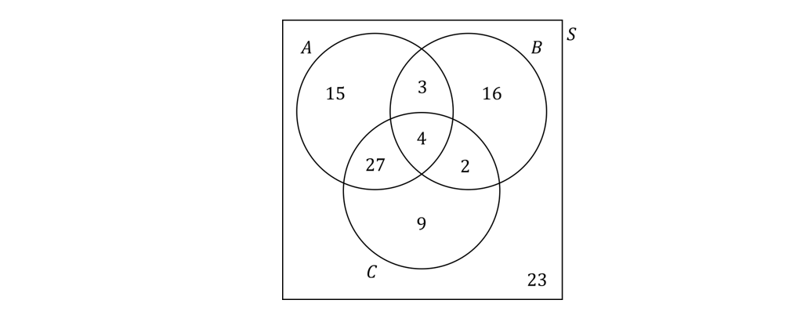
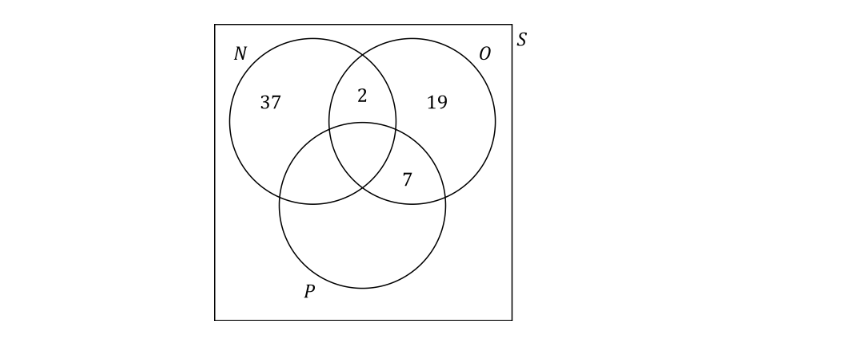
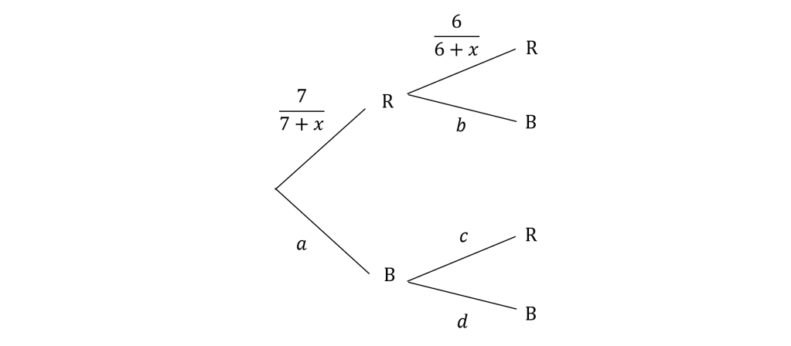
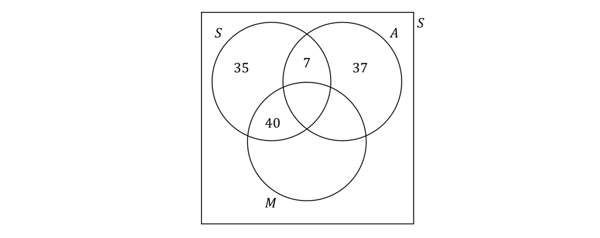

# Exam Questions — Further Probability
**Probability** · Edexcel International A Level (IAL) Maths (YMA01) — Statistics 1
> Source: [https://www.savemyexams.com/international-a-level/maths/edexcel/20/statistics-1/topic-questions/probability/further-probability/exam-questions/](https://www.savemyexams.com/international-a-level/maths/edexcel/20/statistics-1/topic-questions/probability/further-probability/exam-questions/) · 36 questions · total 240 marks

## Q1 — easy — 4 marks · exam-questions

### 1() — 1 mark — structured
Two letters are chosen at random from the eleven letters in the words SAVE MY EXAMS, without replacement.

Given that the probability of the first letter being an S is $\frac{2}{11}$, explain why the probability of choosing a second S is not also $\frac{2}{11}$.

### 2() — 3 marks — structured
The event $X$ is defined as ‘the two letters are the same’ and the event $Y$ is defined as ‘at least one of the letters chosen is a vowel (A, E, I, O, or U)’.

Describe the event $X'$ in words.

Write down the outcomes which satisfy the event $X\capY$ and hence, explain why the events $X$ and $Y$ are not mutually exclusive.

## Q2 — easy — 6 marks · exam-questions

### 1() — 4 marks — structured
A tin of biscuits contains three ginger biscuits and six plain biscuits.  Bonita takes one biscuit, eats it and then takes another from the tin.  Let the event A be ‘the first biscuit taken is a ginger biscuit’ and the event B be ‘the second biscuit taken is a ginger biscuit’.

Write the following probabilities in context:

(i) $P(A\cupB)$

(ii) `P left parenthesis B vertical line A right parenthesis`

(iii) $P(A')$

(iv) $P((A\capB)^{'}).$

### 2() — 2 marks — structured
Find the value of `P left parenthesis B vertical line A right parenthesis.`

## Q3 — easy — 5 marks · exam-questions

### 1() — 2 marks — structured
100 children were asked whether they liked football and cricket.  84 said they liked football ($F$).  58 said they liked cricket ($C$).  Of those who did not like football, 10 also said they did not like cricket.

Complete the two-way table illustrating this information.

|   | **Like Football (**$F$**)** | **Dislike Football (**$F'$**)** | **Total** |
|---|---|---|---|
| **Like Cricket (C)** |   |   | 58 |
| **Dislike Cricket (C′)** |   | 10 |   |
| **Total** | 84 |   | 100 |

### 2() — 3 marks — structured
One of the children is selected at random.  Find the probability that

(i) they like cricket

(ii) they like both football and cricket

(iii) they like football or cricket, but not both.

## Q4 — easy — 6 marks · exam-questions

### 1() — 2 marks — structured
$A$ and $B$ are two independent events such that `P open parentheses A close parentheses equals 0.3` and $P(B)=0.8$

(i) Complete this formula for independent events: $P(A\capB)=____\timesP(B)$

(ii) Use the formula to find  $P(A\capB)$.

### 2() — 3 marks — structured
Another formula for independent events is `P left parenthesis A intersection B right parenthesis equals P left parenthesis A right parenthesis cross times P left parenthesis B vertical line A right parenthesis` where `P left parenthesis B vertical line A right parenthesis`   means the probability of $B$ happening given that $A$ has already happened.

(i) Use the formula to find `P left parenthesis B vertical line A right parenthesis`

(ii) Deduce a similar formula involving `P left parenthesis A vertical line B right parenthesis` and use it to find `P left parenthesis A vertical line B right parenthesis`.

### 3() — 1 mark — structured
Briefly explain why, for independent events A and B, `P left parenthesis A vertical line B right parenthesis equals P left parenthesis A right parenthesis`.

## Q5 — easy — 4 marks · exam-questions

### 1() — 2 marks — structured
Kimona is participating in a snowboarding competition whereby participants are given two attempts to complete a particular trick.  If a participant completes the trick at the first attempt, they are still allowed a second attempt.

From experience the probability of Kimona completing the trick at the first attempt is 0.3  If Kimona completes the trick at the first attempt, the probability of completing the trick at the second attempt is 0.6.  However, if Kimona fails at the first attempt, the probability of completing the trick at the second attempt is 0.5.

Complete the tree diagram below representing Kimona’s situation. ($C$ denotes a completed trick, $F$ denotes a failed trick.)

### 2() — 2 marks — structured
Use the tree diagram to find the probability that

(i) Kimona fails both attempts at completing the trick

(ii) Kimona completes the trick at least once.

## Q6 — easy — 5 marks · exam-questions

### 1() — 2 marks — structured
Two events, $A$and $B$ are mutually exclusive.

(i) Briefly explain why $P(A\capB)=0$.

(ii) Hence use the formula
 $P(A\cupB)=P(A)+P(B)--P(A\capB)$to show that, for mutually exclusive events, $P(A\cupB)=P(A)+P(B)$.

### 2() — 3 marks — structured
Two events, $D$ and $E$ are such that `P left parenthesis D right parenthesis equals 0.2 comma space space P left parenthesis E right parenthesis equals 0.4 space space and space space P left parenthesis E vertical line D right parenthesis equals 0.7`.

(i) Use the formula `P left parenthesis D intersection E right parenthesis equals space P left parenthesis D right parenthesis space space cross times space P left parenthesis E vertical line D right parenthesis` to find $P(D\capE)$.

(ii) Use the formula $P(D\capE)=P(D)+P(E)-P(D\cupE)$ to find  $P(D\cupE)$.

(iii) Use the formula $P(D\capE)=P(D)\timesP(E)$ to deduce whether the events $D$ and $E$ are independent or not.

## Q7 — easy — 8 marks · exam-questions

### 1() — 1 mark — structured
The Venn diagram below shows the probabilities associated with three events, $U,V\mathrm{and}W$.

Explain how the Venn diagram shows that events $U\mathrm{and}W$ are mutually exclusive.

### 2() — 3 marks — structured
Use the Venn diagram to find

(i) $P(U\cupV)$

(ii) $P(W^{'})$

(iii) $P(U^{'}\capV^{'})$

### 3() — 4 marks — structured
(i) Find $P(U),P(V)\mathrm{and}P(W)$

(ii) Use the general formula $P(A\capB)=P(A)\timesP(B)$ to show that $V$ and $W$ are independent but $U\mathrm{and}V$ are not.

## Q8 — easy — 6 marks · exam-questions

### 1() — 3 marks — structured
A box contains 7 blue and 3 red equally sized counters.  A counter is taken from the box and its colour is noted, but it is not replaced in the box.  A second counter is then taken from the box and its colour noted.

Draw a tree diagram to represent this information.

### 2() — 2 marks — structured
Use your tree diagram from part (a) to find the probability that:

(i) both counters are of the same colour

(ii) neither counter is blue.

### 3() — 1 mark — structured
Explain why, if four counters were taken one at a time and without replacement, the probability of all of them being red is zero.

## Q9 — medium — 7 marks · exam-questions

### 1() — 4 marks — structured
$A,B$ and $C$ are three events with $P(A)=0.2,P(B)=0.25,P(C)=0.6$ and $P(B\capC)=0.08$.

Given that events $A$ and $C$ are mutually exclusive, and that events $A$and $B$ are independent, draw a Venn diagram to illustrate the probabilities.

### 2() — 3 marks — structured
Find:

(i) $P(A^{'}\capC^{'})$

(ii) $P((A\capB^{'})\cupC)$

(iii) $P(A^{'}\cup(B\capC)^{'})$

## Q10 — medium — 5 marks · exam-questions

### 1() — 3 marks — structured
The probability that it rains, $R$, on any given day in a certain month is given as 0.4. If it rains, Suresh takes the bus to work and arrives on time, T, with a probability of 0.6.  If it doesn’t rain, Suresh cycles to work and arrives on time with a probability of 0.9.

Write down the values of:

(i) $P(R')$

(ii) `P left parenthesis T apostrophe vertical line R right parenthesis`

(iii) `P left parenthesis T apostrophe vertical line R apostrophe right parenthesis`

### 2() — 2 marks — structured
Use the probability tree diagram, or otherwise to find the probability that Suresh arrives at work on time.

## Q11 — medium — 6 marks · exam-questions

### 1() — 3 marks — structured
Katin is collecting tadpoles for her biology project. In the pond there are five female tadpoles and six male tadpoles, however they all look the same. She takes two tadpoles at random from the pond, without replacement.

Draw a tree diagram to represent this information.

### 2() — 3 marks — structured
Find the probability that Katin’s two tadpoles are

(i) either both female or both male.

(ii) both female, given that they are the same sex.

## Q12 — medium — 3 marks · exam-questions

### 1() — 3 marks — structured
The following Venn diagram shows the number of adults in a poll who said they enjoy watching action films ($A$), Bollywood musicals ($B$), and crime thrillers ($C$).

One of the adults who was polled is selected at random.  Given that the adult chosen enjoys watching at least one of those three genres of film, find the probability that the adult enjoys watching:

(i) Bollywood musicals

(ii) only one of the three genres of film

(iii) exactly two of the three genres of film.

## Q13 — medium — 7 marks · exam-questions

### 1() — 2 marks — structured
A fair hexagonal spinner with seven equal sections numbered 0, 1, 1, 3, 3, 3 and 3 is spun twice and the sum of the two numbers the spinner lands on is recorded.

Draw a sample space to represent the outcomes of this experiment.

### 2() — 4 marks — structured
S is the event ‘the sum of the two numbers is a square number’ and E is the event ‘the sum of the two numbers is a positive even number’. Use your sample space to find:

(i) $P(S)$

(ii) $P(E)$

(iii) $P(S\capE)$

(iv) `P left parenthesis S vertical line E right parenthesis`

### 3() — 1 mark — structured
Use your answers to part (b) to show that

`P left parenthesis S vertical line E right parenthesis equals fraction numerator P left parenthesis S intersection E right parenthesis over denominator P left parenthesis E right parenthesis end fraction`

## Q14 — medium — 7 marks · exam-questions

### 1() — 4 marks — structured
Three events,$A,B$ and $C$, are such that $B$ and $C$ are mutually exclusive and $A$ and $C$ are independent. $P(A)=0.3,P(B)=0.45$and $P(C)=0.1$.

Given that $P((A\cupB\cupC)^{'})=0.43$, draw a Venn diagram to show the probabilities for events $A,B$ and $C$.

### 2() — 3 marks — structured
Find:

(i) `P left parenthesis B vertical line A right parenthesis`

(ii) `P left parenthesis A vertical line B to the power of apostrophe right parenthesis`

(iii) `P left parenthesis A vertical line left parenthesis B union C right parenthesis right parenthesis`

## Q15 — medium — 5 marks · exam-questions

### 1() — 4 marks — structured
A standard pack of 52 playing cards is comprised of thirteen different cards for each of the four suits: hearts, diamonds, spades and clubs.  Each suit is made up of nine different number cards (two to ten) and four court cards (jack, queen, king and ace).  A full pack of cards is shuffled and one card is selected at random.  Let $H$ be the event ‘the card chosen is a heart’.  Let $C$ be the event ‘the card chosen is a court card (jack, queen, king or ace)’.

Find

(i) $P(C)$

(ii) $P(H)$

(iii) $P(H\capC)$

(iv) `P left parenthesis H vertical line C right parenthesis`

### 2() — 1 mark — structured
Use your answers to part (a) to show that the events *C* and *H* are independent events.

## Q16 — medium — 6 marks · exam-questions

### 1() — 4 marks — structured
Given that $P(A)=0.27,P(B)=0.39$ and $P(A\capB)=0.21$, find:

(i) $P(A\cupB)$

(ii) `P left parenthesis B vertical line A right parenthesis`

### 2() — 2 marks — structured
The event $C$ has $P(C)=0.19$. The events $A$ and $C$  are mutually exclusive.

Given that $P(B\capC)=0.04$, find $P(A\cupB\cupC)$.

## Q17 — medium — 7 marks · exam-questions

### 1() — 3 marks — structured
A bag contains 15 blue tokens and 27 yellow tokens. A token is taken from the bag and its colour is recorded, but it is not replaced in the bag. A second token is then taken from the bag and its colour is recorded.

Draw a tree diagram to represent this information.

### 2() — 4 marks — structured
Find the probability that:

(i) the second token selected is blue

(ii) both tokens selected are blue, given that the second token selected is blue.

## Q18 — medium — 11 marks · exam-questions

### 1() — 3 marks — structured
Ichabod is a keen chess player who plays one game of chess online every night before going to bed.  In any one of those games, the probabilities of Ichabod winning, drawing, or losing are 0.4, 0.27 and 0.33 respectively.  Following each game, the probabilities of Ichabod sleeping well after winning, drawing or losing are 0.7, 0.9 and 0.2 respectively.

Draw a tree diagram to represent this information.

### 2() — 4 marks — structured
Find the probability that on a randomly chosen night

(i) Ichabod loses his chess game and sleeps well

(ii) Ichabod sleeps well.

### 3() — 4 marks — structured
Given that Ichabod sleeps well, find the probability that his chess game did not end in a draw.

## Q19 — hard — 7 marks · exam-questions

### 1() — 4 marks — structured
*A,B*  and *C *are three events with  `straight P open parentheses B close parentheses equals 0.3`, `straight P open parentheses A intersection B close parentheses equals 0.01`, `P open parentheses B intersection C close parentheses equals 0.12` and  `straight P open parentheses open parentheses A union B union C close parentheses to the power of apostrophe close parentheses equals 0.13` .

Given that events *A* and *C* are mutually exclusive, and that events *B *and* C* are independent, draw a Venn diagram to illustrate the probabilities.

### 2() — 3 marks — structured
Find:

(i) `straight P open parentheses A intersection B to the power of apostrophe close parentheses`

(ii) `straight P open parentheses open parentheses A to the power of apostrophe intersection C to the power of apostrophe close parentheses union A close parentheses`

(iii) `straight P open parentheses open parentheses open parentheses A intersection B to the power of apostrophe close parentheses union open parentheses B to the power of apostrophe intersection C close parentheses close parentheses to the power of apostrophe close parentheses`

## Q20 — hard — 5 marks · exam-questions

### 1() — 2 marks — structured
The following Venn diagram shows some of the results for the number of chess players in a poll who said they enjoy playing any, all or none of three chess game openings – the Najdorf Sicilian (*N*), the Orangutan (*O*), and the Ponziani countergambit (*P*).

120 chess players were polled in total, of whom one half said they enjoy playing the Najdorf Sicilian, one third said they enjoy playing the Orangutan, and one fourth said they enjoy playing the Ponziani countergambit.** **

** **Use the above information to fill in the missing values in the Venn diagram.

### 2() — 3 marks — structured
One of the chess players who was polled is selected at random.

Given that the chess player chosen enjoys playing at least one of the three openings, find the probability that the chess player enjoys playing:

(i) the Orangutan

(ii) only one of the three openings

(iii) at least two of the three openings

## Q21 — hard — 8 marks · exam-questions

### 1() — 5 marks — structured
Three events,$A$, $B$ and $C$, are such that $A$and $B$ are independent $B$and $C$ and  are mutually exclusive. `straight P open parentheses C close parentheses equals 0.55`,  `P open parentheses open parentheses A intersection B close parentheses union open parentheses A intersection C close parentheses close parentheses equals 0.07`, and the following two relations also hold:

`8 space straight P open parentheses A close parentheses equals 25 space straight P open parentheses B close parentheses`

`straight P open parentheses A to the power of apostrophe intersection C close parentheses equals 10 space straight P open parentheses A intersection C close parentheses`

Using the above information, draw a Venn diagram to show the probabilities for events $A$,$B$ and $C$.

### 2() — 3 marks — structured
Find:

(i) `straight P open parentheses C vertical line A close parentheses`

(ii) `straight P open parentheses B vertical line A to the power of apostrophe close parentheses`

(iii) `straight P open parentheses open parentheses A union B union C close parentheses to the power of apostrophe vertical line open parentheses A union B close parentheses to the power of apostrophe close parentheses`

## Q22 — hard — 6 marks · exam-questions

### 1() — 4 marks — structured
Farah is playing a game with a coin.  She tosses the coin three times and awards herself points using the following rules. If the coin lands heads up she gets one point and if the coin lands tails up she gets two points.  However, if the coin lands the same way it did on the previous coin toss, she awards herself two points for heads up and four points for tails up.  The final score is the sum of the points awarded from the three tosses of the coin.

(i) Given that the coin landed on heads three times in a row, find the probability that Farah’s final score was 5 points.

(ii) Given that Farah’s final score was 5 points, find the probability that the coin landed on heads three times in a row.

### 2() — 2 marks — structured
The event $A$ is ‘Farah’s final score is 5 points’ and event $B$ is ‘the coin lands on heads at least two times’. Determine whether the events $A$ and $B$ are independent. Justify your answer.

## Q23 — hard — 7 marks · exam-questions

### 1() — 4 marks — structured
Olivia owns a pottery business where she runs workshops on Saturdays and sells pots during the week.  If she has run a workshop on the previous Saturday, she will open the shop for a short week, Monday to Thursday, with a probability of 0.6.  If she did not run a workshop, she will open the shop for a short week, Monday to Thursday, with a probability of 0.2. Otherwise, she will open the shop for a long week, Monday to Friday. The probability that Olivia opens the shop for a short week, Monday to Thursday, on any given week is 0.46.

Find the probability that Olivia runs a workshop on any given week.

### 2() — 3 marks — structured
Given that Olivia opened the shop for a short week, Monday to Thursday, on a particular week, find the probability that she ran a workshop the previous Saturday.

## Q24 — hard — 7 marks · exam-questions

### 1() — 4 marks — structured
Given that  `straight P open parentheses A close parentheses equals 0.34`, `P open parentheses A union B close parentheses equals 0.67`  and `straight P open parentheses A intersection B close parentheses equals 0.02` , find:

(i) `straight P open parentheses B close parentheses`

(ii) `straight P open parentheses A vertical line B to the power of apostrophe close parentheses`

### 2() — 3 marks — structured
The event $C$ has `straight P open parentheses C close parentheses equals 0.2`. The events $B$ and $C$ are mutually exclusive.

Given that $A$ and  $C$ are independent, find  `P open parentheses A union B union C close parentheses`.

## Q25 — hard — 7 marks · exam-questions

### 1() — 3 marks — structured
Shalit has seven identical red socks and $x$ identical blue socks in his drawer. He takes two socks out of his drawer at random and puts them on.

Find expressions for $a,b,c$ and $d$ on the tree diagram above.

### 2() — 4 marks — structured
The probability that Shalit took two red socks, given that he took two socks of the same colour is $\frac{7}{8}$. Find the value of $x$.

## Q26 — hard — 8 marks · exam-questions

### 1() — 4 marks — structured
A bag contains 12** **orange marbles, 8 purple marbles and 5** **red marbles.  A marble is taken from the bag and its colour is recorded, but it is not replaced in the bag.  A second marble is then taken from the bag and its colour is recorded.

Draw a tree diagram to represent this information.

### 2() — 4 marks — structured
Find the probability that:

(i) both marbles are different colours

(ii) the second marble is purple, given that both marbles are different colours.

## Q27 — hard — 11 marks · exam-questions

### 1() — 3 marks — structured
Rosco is a somewhat inept rural county sheriff who frequently finds himself involved in car chases with well-meaning local entrepreneurs.  During any given car chase, Rosco inevitably runs into one of three obstacles – a damaged bridge (with probability 0.47), an oil slick (with probability 0.32), or a pigpen at the end of a dead-end road.

If he encounters a damaged bridge there is a 25% chance that he will make it across safely; otherwise he lands in the river and ends up covered in mud.  If he encounters an oil slick there is a 40% chance that his car will spin around and he will end up continuing his hot pursuit in the wrong direction; otherwise he goes off the road into a farm pond and ends up covered in mud.  If he encounters a pigpen at the end of a dead-end road there is a 15% chance he will stop his car in time; otherwise he drives into the muddy end of the pigpen while the pigs sit at the other end laughing.  If he drives into the muddy end of a pigpen there is a 20% chance he will only end up covered in mud; otherwise he ends up covered in mud and other things that are found in pigpens.

Draw a tree diagram to represent this information.

### 2() — 3 marks — structured
Find the probability that in the course of a randomly chosen car chase

(i) Rosco ends up covered in mud

(ii) Rosco ends up covered in mud, but only in mud.

### 3() — 3 marks — structured
Given that Rosco ends up covered in mud in the course of a randomly chosen car chase, find the probability that he didn’t encounter an oil slick. Give your answer as an exact value.

### 4() — 2 marks — structured
In the course of a particular day Rosco finds himself engaged in three separate car chases with well-meaning local entrepreneurs. The car chases may be considered to be independent events.

Determine the probability that on that day Rosco will not end up covered in other things that are found in pigpens.

## Q28 — very_hard — 9 marks · exam-questions

### 1() — 5 marks — structured
$A,B$and $C$ are three events such that $P(C)=0.37,P(A^{'}\capB^{'}\capC)=0.18,P(A\capB\capC)=0.09,$ and $P((A\cupB\cupC)^{'})=0.21$. In addition the following two relations hold:

`P left parenthesis A intersection B intersection C to the power of apostrophe right parenthesis ∶ P left parenthesis A intersection B to the power of apostrophe intersection C right parenthesis ∶ P left parenthesis A to the power of apostrophe intersection B intersection C right parenthesis equals 3 colon 4 colon 1
P left parenthesis A right parenthesis ∶ P left parenthesis B right parenthesis equals 9 colon 10`

Draw a Venn diagram to illustrate the probabilities.

### 2() — 4 marks — structured
Find:

(i) $P(A\cupB^{'}\cupC)$

(ii) `P left parenthesis A union left parenthesis B intersection C to the power of apostrophe right parenthesis vertical line A union C right parenthesis`

(iii) `P left parenthesis B union C vertical line left parenthesis A union B union C right parenthesis union left parenthesis A union B union C right parenthesis to the power of apostrophe right parenthesis`

## Q29 — very_hard — 8 marks · exam-questions

### 1() — 8 marks — structured
A lifestyle magazine for ancient historians recently conducted a poll of its readership.  The following Venn diagram shows some of the results for the numbers of the historians polled who said that they were fans of any, all or none of the following three ancient Near Eastern rulers – the Hittite king Suppiluliuma I ($S$),  the Assyrian king Ashurbanipal ($A$), and the Akkadian king Manishtushu ($M$).

180 historians were polled in total.  For each historian who was only a fan of Manishtushu, there were 7 who were only fans of Suppiluliuma I.  For each two historians who were fans of both Ashurbanipal and Manishtushu but not of Suppiluliuma I, there were nine historians who were fans of all three rulers.  Most of the historians were, as expected, fans of at least one of the three rulers, but it was also discovered that being a fan of Ashurbanipal and being a fan of Manishtushu were independent events.

One of the historians who was polled is selected at random.  Given that the historian chosen is a fan of at least one of the three rulers, find the exact probability that the historian is a fan of:

(i) Suppiluliuma I

(ii) at least two the three rulers

(iii) exactly two of the three rulers.

## Q30 — very_hard — 8 marks · exam-questions

### 1() — 3 marks — structured
Events $A$and $B$ are such that  `straight P open parentheses A close parentheses equals 0.23`  and  `straight P open parentheses B close parentheses equals 0.72`.

Given that `P open parentheses A to the power of apostrophe intersection B close parentheses equals p`, find the range of possible values of * *$p$.

### 2() — 2 marks — structured
Additionally, event $C$ is such that `straight P open parentheses C close parentheses equals 0.53`  and `P open parentheses A intersection B intersection C close parentheses equals 0.17` .

Determine whether this additional information would change your answer to part (a), and if it would then give the modified range of possible values of $p$ when this additional information is taken into account.

### 3() — 3 marks — structured
Given that `P open parentheses A to the power of apostrophe intersection B intersection C close parentheses equals q`, find the range of possible values of $q$.

## Q31 — very_hard — 7 marks · exam-questions

### 1() — 5 marks — structured
An online chess competition is being played where participants can either win, draw or lose each game.  If the participant wins, they can play again straight away.  If the participant loses, they are out of the competition.  If there is a draw, the participants will undertake a sudden death match until there is a winner.

The probability that Jamie will win his first match outright is 0.7; the probability that he will lose it outright is 0.1.  If Jamie wins his first match outright the probabilities that he wins or loses his second match outright remain the same. 
However, if he plays sudden death in his first match and wins, the probability he will win his second match outright is 0.55 and the probability he will lose it outright is 0.3. The probability Jamie wins at sudden death is always the same.

Given that the probability Jamie wins his first two matches is 0.6508, find the probability that Jamie wins any match at sudden death.

### 2() — 2 marks — structured
Find the probability that Jamie won both of his matches outright, given that he won his first two matches.

## Q32 — very_hard — 7 marks · exam-questions

### 1() — 4 marks — structured
The cost of Lucy’s three favourite snacks at the two nearest movie theatres to her house - The Amenic and The Seivom are summarised in the table below.

| ** ** | **popcorn** | **ice cream** | **nachos** |
|---|---|---|---|
| **The Amenic** | \$4.50 | \$3.80 | \$6 |
| **The Seivom** | \$6 | \$4.20 | \$8.20 |

When Lucy goes to the movies she always chooses one of these two theatres and always has one, and only one, of these three snacks. 
If Lucy chooses The Amenic, she chooses popcorn with a probability of 0.2 and ice cream with a probability of 0.5. If Lucy chooses The Seivom she will have nachos with a probability of 0.4 and ice cream with a probability of 0.2.

Given that the probability Lucy spends exactly \$6 on her snack is 0.33, find the probability Lucy chooses The Amenic.

### 2() — 3 marks — structured
Find the probability Lucy chose to go the The Seivom, given that she spent less than \$5 on her snack.

## Q33 — very_hard — 4 marks · exam-questions

### 1() — 4 marks — structured
$A$and $B$ are events such that  `P open parentheses A union B close parentheses equals x`, `P open parentheses A intersection B to the power of apostrophe close parentheses equals y` and `P open parentheses A to the power of apostrophe intersection B close parentheses equals z`,  where  $x\neqz$  and  $y\neq0$.

Find the following probabilities in terms of $x,y$and $z$:

(i) `straight P open parentheses A intersection B close parentheses`

(ii) `P open parentheses B vertical line A close parentheses`

(iii) `P open parentheses A vertical line B to the power of apostrophe close parentheses`

## Q34 — very_hard — 7 marks · exam-questions

### 1() — 7 marks — structured
A bag contains tokens that each have a single number written on them.  The integers between 1 and 15 are all represented on the tokens.  There is one token with a ‘1’ on it, two tokens with a ‘2’ on them, and so on, up until fifteen tokens with a ‘15’ on them.

A token is taken from the bag and the number on it is recorded, but it is not replaced in the bag.  A second token is then taken from the bag and the number on it is recorded.

Using a tree diagram, or otherwise, work out the probabilities of the following events:

(i) the numbers on the two tokens are neither both prime numbers nor both square numbers

(ii) the number on one of the tokens is a prime number, given that the numbers on the two tokens are neither both prime numbers nor both square numbers

(iii) the number on the first token is a prime number, given that the numbers on the two tokens are neither both prime numbers nor both square numbers

## Q35 — very_hard — 8 marks · exam-questions

### 1() — 5 marks — structured
Minnie and Dennis are playing a game with a box of black and red counters.  The winner is the first to take two counters of the same colour from the box, without looking.  Dennis goes first and draws both counters at the same time.  There are three more red counters than black counters and the probability of Dennis winning on his first attempt is $\frac{17}{35}$.

Find the two possible options for the number of black counters in the box.

### 2() — 3 marks — structured
Dennis does not win, keeps his two counters and Minnie takes two counters from the box. The probability she draws two red counters, given that she wins is $\frac{14}{19}$, find the original number of black counters that were in the box.

## Q36 — very_hard — 8 marks · exam-questions

### 1() — 3 marks — structured
A crafty coyote spends most of his spare time trying to catch a very fast roadrunner bird.  The coyote’s schemes always involve one of three items procured from a well-known mail order retailer – a crate of TNT (with probability 0.51), a large boulder (with probability 0.29), or a rocket on wheels.

If the coyote uses a crate of TNT there is a 95% chance it will explode at the wrong time and injure the coyote while the roadrunner escapes; otherwise it will simply not explode at all and the roadrunner will escape.  If the coyote uses a large boulder there is an 85% chance it will injure him by landing on his head while the roadrunner escapes; otherwise it will injure the coyote by landing on his foot while the roadrunner escapes.  If the coyote uses a rocket on wheels, there is a 60% chance he will injure himself by running into a cliff face while the roadrunner escapes; otherwise the roadrunner will escape after tricking the coyote into riding the rocket off the top of a cliff.   If the coyote rides the rocket off the top of a cliff he will either get injured when the rocket explodes in mid-air, or get injured by crashing into a mountain on the other side of the valley, or land safely on the ground after his parachute unexpectedly functions properly.  It is twice as likely that the rocket will explode as it is that the coyote will crash into a mountain, and five times as likely that the coyote will crash into a mountain as it is that he will land safely using his parachute.

Draw a tree diagram to represent this information.

### 2() — 3 marks — structured
Given that the coyote is injured during one of his schemes, find the exact probability that he is not injured by an explosion.

### 3() — 2 marks — structured
Given that the coyote is not injured during one of his schemes, find the exact probability that his scheme involved a rocket on wheels.
