# Exam Questions — Continuous Random Variables
**Statistical Distributions** · Edexcel International A Level (IAL) Maths (YMA01) — Statistics 2
> Source: [https://www.savemyexams.com/international-a-level/maths/edexcel/20/statistics-2/topic-questions/statistical-distributions/continuous-random-variables/exam-questions/](https://www.savemyexams.com/international-a-level/maths/edexcel/20/statistics-2/topic-questions/statistical-distributions/continuous-random-variables/exam-questions/) · 36 questions · total 243 marks

## Q1 — easy — 4 marks · exam-questions

### 1() — 4 marks — structured
If $f(x)$  is the probability density function for a random variable, $X$ then the area under the graph of the probability density function must equal 1.

State, with a reason, whether each of the following could be graphs of probability density functions.

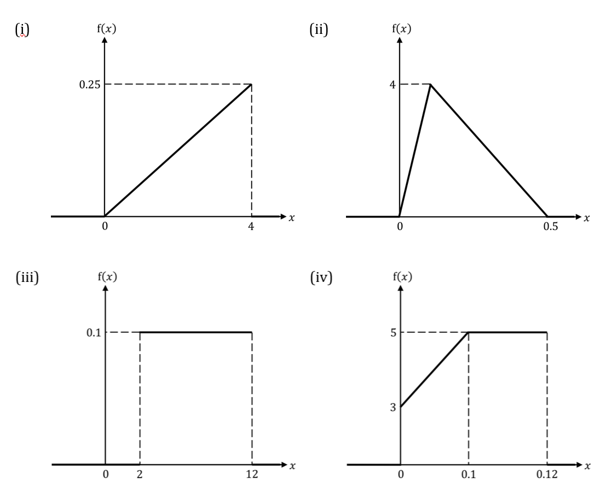

## Q2 — easy — 6 marks · exam-questions

### 1() — 6 marks — structured
If $f(x)$ is the probability density function for a random variable, $X$ which takes values in the interval `open parentheses a comma space b close parentheses` then:

`integral subscript a superscript b straight f open parentheses x close parentheses d x equals 1`

Use integration to decide whether the following functions could represent probability distribution functions.

(i) `straight f open parentheses x close parentheses equals open curly brackets table row cell 2 x end cell cell 0 less or equal than x less or equal than 1 end cell row 0 cell otherwise. end cell end table close`

(ii) `straight f open parentheses x close parentheses equals open curly brackets table row cell 1 third x squared end cell cell 1 less or equal than x less or equal than 4 end cell row 0 cell otherwise. end cell end table close`

(iii) `straight f open parentheses x close parentheses equals open curly brackets table row cell 4 over 27 open parentheses x cubed plus 1 close parentheses end cell cell negative 1 less or equal than x less or equal than 2 end cell row 0 cell otherwise. end cell end table close`

## Q3 — easy — 7 marks · exam-questions

### 1() — 2 marks — structured
The continuous random variable, $X$, has probability density function

`straight f open parentheses x close parentheses equals open curly brackets table row cell 1 over 24 open parentheses x cubed plus 2 close parentheses end cell cell 1 less or equal than x less or equal than 3 end cell row 0 cell otherwise. end cell end table close`

The value of$P(a<X<b)$ is equal to

`integral subscript a superscript b straight f open parentheses x close parentheses d x.`

Find$P(1<X<2).$

### 2() — 3 marks — structured
(i) Explain why `P left parenthesis X greater than 2.5 right parenthesis equals integral subscript 2.5 end subscript superscript 3 1 over 24 open parentheses x cubed plus 2 close parentheses d x.`

(ii) Hence find $P(X>2.5)$.

### 3() — 2 marks — structured
State, with a reason, the value of

(i) $P(5<X<10)$

(ii) $P(X=2).$

## Q4 — easy — 4 marks · exam-questions

### 1() — 4 marks — structured
The graph below shows the probability density function of a continuous random variable, $X$.

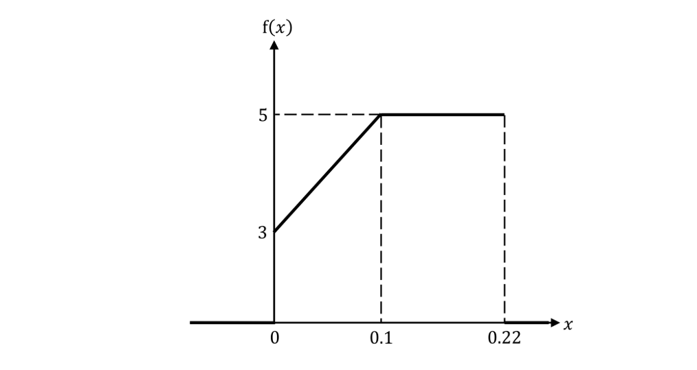

By finding relevant areas under the graph, find:

(i) $P(0<X<0.1)$

(ii) $P(X>0.15)$

(iii) $P(0.05<X<0.12)$.

## Q5 — easy — 4 marks · exam-questions

### 1() — 2 marks — structured
Evaluate the following definite integral, giving your answer in terms of $k$.

`integral subscript 3 superscript 9 k open parentheses x squared plus 3 close parentheses d x`

### 2() — 2 marks — structured
Hence find the value of $k$ given that `straight f open parentheses x close parentheses` is a probability density function where

`straight f open parentheses x close parentheses equals open curly brackets table row cell k open parentheses x squared plus 3 close parentheses end cell cell 3 less or equal than x less or equal than 9 end cell row 0 cell otherwise. end cell end table close`

## Q6 — easy — 7 marks · exam-questions

### 1() — 2 marks — structured
The continuous random variable $X$ has probability density function

`straight f open parentheses x close parentheses equals open curly brackets table row cell 3 over 16 open parentheses x squared minus 1 close parentheses end cell cell 2 less or equal than x less or equal than 3 end cell row 0 cell otherwise. end cell end table close`

Find  `integral 3 over 16 x open parentheses x squared minus 1 close parentheses d x.`

### 2() — 1 mark — structured
Hence find the value of $E(X)$ using the formula

`straight E left parenthesis X right parenthesis equals integral x straight f open parentheses x close parentheses straight d x.`

### 3() — 2 marks — structured
Find `integral 3 over 16 x squared open parentheses x squared minus 1 close parentheses straight d x.`

### 4() — 1 mark — structured
Hence find the value of $E(X²)$ using the formula

`straight E left parenthesis X ² right parenthesis equals integral x squared straight f open parentheses x close parentheses straight d x.`

### 5() — 1 mark — structured
Hence find the value of $\mathrm{Var}(X)$using the formula $\mathrm{Var}(X)=E(X^{2})-(E(X))².$

## Q7 — easy — 4 marks · exam-questions

### 1() — 4 marks — structured
The mode of a continuous random variable $X$, where it exists, is a value for $X$ where the probability density function is at its maximum.

State the mode, where it exists, of the continuous random variables which have probability density functions show in the graphs below.

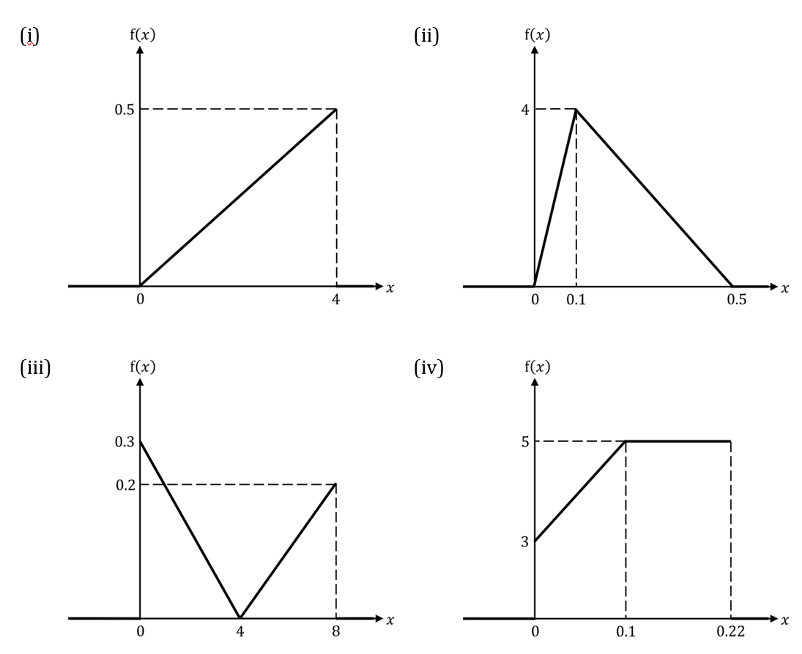

## Q8 — easy — 6 marks · exam-questions

### 1() — 6 marks — structured
The median, $m$, of a continuous random variable $X$, is the value for $X$ which splits the under the graph of the probability density function exactly in half, such that $P(X<m)=0.5$.

Find the value of the median of the continuous random variables which have probability density functions show in the graphs below.

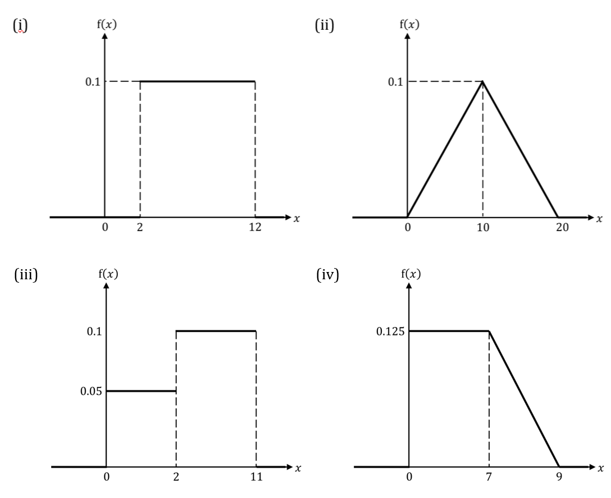

## Q9 — easy — 4 marks · exam-questions

### 1() — 1 mark — structured
The continuous uniform (rectangular) distribution over the interval `open parentheses a comma space b close parentheses` has probability density function

`straight f open parentheses x close parentheses equals open curly brackets table row cell fraction numerator 1 over denominator b minus a end fraction end cell cell a less than x less than b end cell row 0 cell otherwise. end cell end table close`

The random variable $X$ follows a rectangular distribution over the interval $(2,18)$.

The graph below shows the probability density function of $X$. Write down the values of $a,b$ and $c$.

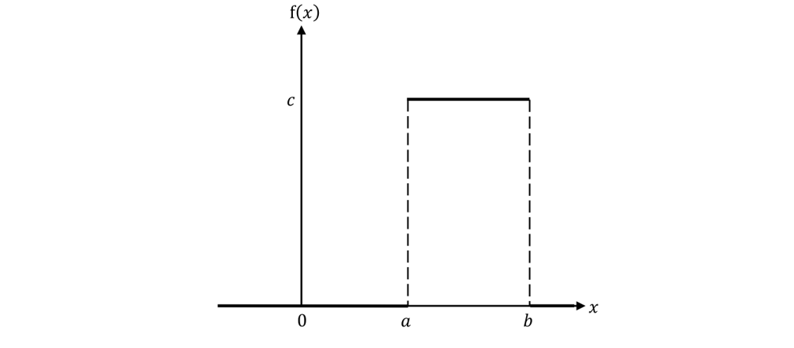

### 2() — 3 marks — structured
Write down

(i) the median of $X$

(ii) the value of $E(X)$

(iii) $P(14<X<18)$.

## Q10 — easy — 6 marks · exam-questions

### 1() — 3 marks — structured
The continuous random variable $X$ has probability density function `straight f open parentheses x close parentheses` given by

`straight f open parentheses x close parentheses equals open curly brackets table row cell 1 fourth x end cell cell 0 less or equal than x less or equal than 2 end cell row cell 5 over 9 minus 1 over 9 x end cell cell 2 less or equal than x less or equal than 5 end cell row 0 cell otherwise. end cell end table close`

Find $P(1\leqX\leq4)$ by calculating

`integral subscript 1 superscript 2 open parentheses 1 fourth x close parentheses d x plus integral subscript 2 superscript 4 open parentheses 5 over 9 minus 1 over 9 x close parentheses d x`

### 2() — 3 marks — structured
Find $E(X)$ by calculating

`integral subscript 0 superscript 2 open parentheses 1 fourth x close parentheses left parenthesis x right parenthesis straight d x plus integral subscript 2 superscript 5 open parentheses 5 over 9 minus 1 over 9 x close parentheses left parenthesis x right parenthesis straight d x`

## Q11 — medium — 6 marks · exam-questions

### 1() — 6 marks — structured
State, with a reason, whether each of the following could be graphs of probability density functions.

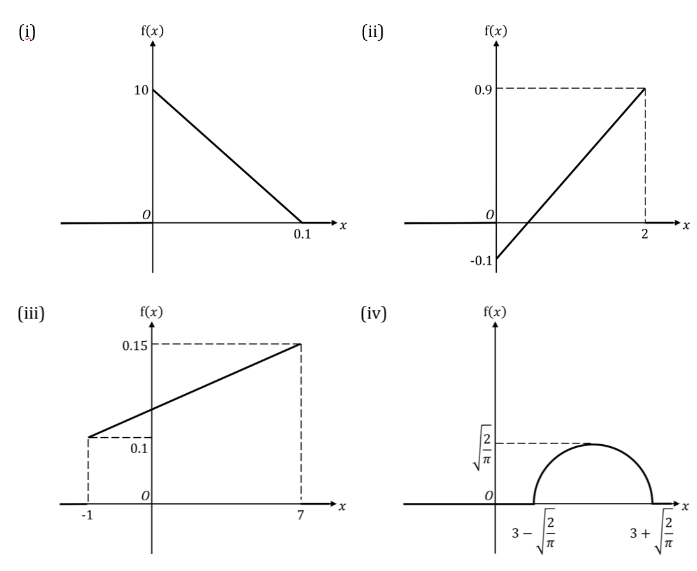

This is a semicircle.

## Q12 — medium — 6 marks · exam-questions

### 1() — 6 marks — structured
State, with a reason, whether the following functions could represent probability distribution functions.

(i) `straight f open parentheses x close parentheses equals open curly brackets table row cell 3 open parentheses x to the power of 5 minus 2 x cubed close parentheses end cell cell 1 less or equal than x less or equal than 2 end cell row 0 cell otherwise. end cell end table close`

(ii) `straight f open parentheses x close parentheses equals open curly brackets table row cell 3 over 8 open parentheses x plus 1 close parentheses squared end cell cell negative 1 less or equal than x less or equal than 1 end cell row 0 cell otherwise. end cell end table close`

(iii) `straight f open parentheses x close parentheses equals open curly brackets table row cell 6 over x squared end cell cell negative 3 less or equal than x less or equal than negative 2 end cell row 0 cell otherwise. end cell end table close`

## Q13 — medium — 6 marks · exam-questions

### 1() — 2 marks — structured
The continuous random variable, $X$, has probability density function

`f open parentheses x close parentheses equals open curly brackets table row cell k open parentheses 3 x to the power of 4 minus 2 x close parentheses end cell cell 1 less or equal than x less or equal than 2 end cell row 0 cell otherwise. end cell end table close`

Show that $k=\frac{5}{78}.$

### 2() — 4 marks — structured
(i) Find $P(1.2<X<1.8).$

(ii) Find  $P(X<1.5).$

## Q14 — medium — 7 marks · exam-questions

### 1() — 2 marks — structured
The continuous random variable $X$ has probability density function

`straight f open parentheses x close parentheses equals open curly brackets table row cell k open parentheses 2 plus square root of x close parentheses end cell cell 4 less or equal than x less or equal than 9 end cell row 0 cell otherwise. end cell end table close`

Show that $k=\frac{3}{68}.$

### 2() — 2 marks — structured
Find $E(X).$

### 3() — 3 marks — structured
Find $\mathrm{Var}(X).$

## Q15 — medium — 4 marks · exam-questions

### 1() — 4 marks — structured
Find the mode of the continuous random variable, $X$, which has probability density function defined by:

(i) `straight f open parentheses x close parentheses equals open curly brackets table row cell 2 over 21 x end cell cell 2 less or equal than x less or equal than 5 end cell row 0 cell otherwise. end cell end table close`

(ii) `straight f open parentheses x close parentheses equals open curly brackets table row cell 1 over 9 open parentheses 4 minus open parentheses x plus 1 close parentheses squared close parentheses end cell cell negative 2 less or equal than x less or equal than 1 end cell row 0 cell otherwise. end cell end table close`

(iii) `straight f open parentheses x close parentheses equals open curly brackets table row cell 1 half sin open parentheses x close parentheses end cell cell 0 less or equal than x less or equal than pi end cell row 0 cell otherwise. end cell end table close`

## Q16 — medium — 5 marks · exam-questions

### 1() — 2 marks — structured
The continuous random variable $X$ has probability density function

`straight f open parentheses x close parentheses equals open curly brackets table row cell 5 over 62 square root of x cubed end root end cell cell 1 less or equal than x less or equal than 4 end cell row 0 cell otherwise. end cell end table close`

Find an expression, in terms of $m$, for

`integral subscript 1 superscript m 5 over 62 square root of x cubed end root d x.`

### 2() — 3 marks — structured
Hence find the median of $X$.

## Q17 — medium — 6 marks · exam-questions

### 1() — 3 marks — structured
The continuous random variable $X$ follows a continuous uniform distribution over the interval $(3,28)$ so that its probability density function is

`f open parentheses x close parentheses equals open curly brackets table row cell 1 over 25 end cell cell 3 less than x less than 28 end cell row 0 cell otherwise. end cell end table close`

Find

(i) $P(X<15)$

(ii) $P(20<X<30)$

(iii) $P(X=25).$

### 2() — 3 marks — structured
(i) Write down $E(X)$ .

(ii) Find $\mathrm{Var}(X)$ .

## Q18 — medium — 8 marks · exam-questions

### 1() — 2 marks — structured
May calls her nephew Peter each day to check on him. May enjoys talking so much so that Peter has programmed his phone to disconnect from a call after 15 minutes. The length of a call, in minutes, between May and Peter is denoted by the continuous random variable $T$. It is modelled by the probability density function

`straight f open parentheses t close parentheses equals open curly brackets table row cell 1 over 1125 t squared end cell cell 0 less or equal than t less or equal than 15 end cell row 0 cell otherwise. end cell end table close`

Find the mean length of a call.

### 2() — 3 marks — structured
Find the standard deviation of the lengths of calls.

### 3() — 2 marks — structured
Find the probability that a random call between May and Peter will last longer than 10 minutes.

### 4() — 1 mark — structured
Out of the next 100 calls between May and Peter, estimate the number of them that will last less than 10 minutes.

## Q19 — medium — 7 marks · exam-questions

### 1() — 2 marks — structured
The mass, in kilograms, of a wrestler in a local club is denoted by the continuous random variable $M$. It is modelled by the probability density function

`straight f open parentheses m close parentheses equals open curly brackets table row cell k minus 1 over 9000 open parentheses m minus 80 close parentheses squared end cell cell 70 less than m less than 100 end cell row 0 cell otherwise. end cell end table close`

Show that $k=\frac{4}{90}.$

### 2() — 2 marks — structured
Wrestlers who weigh less than 85 kg can enter Heavy Middleweight competitions.

Find the probability that a randomly selected wrestler can enter Heavy Middleweight competition.

### 3() — 3 marks — structured
Wrestlers who weigh less than 80 kg can enter Middleweight competitions.

Given that a wrestler can enter Heavy Middleweight competitions, find the probability that they can also enter Middleweight competitions.

## Q20 — medium — 9 marks · exam-questions

### 1() — 4 marks — structured
The continuous random variable $X$ has probability density function `straight f open parentheses x close parentheses` given by

`straight f open parentheses x close parentheses equals open curly brackets table row cell 1 fifth open parentheses x minus 1 close parentheses end cell cell 1 less or equal than x less or equal than k end cell row cell 2 minus 2 over 5 x end cell cell k less than x less or equal than 4 end cell row 0 cell otherwise. end cell end table close`

Find the value of $k.$

### 2() — 2 marks — structured
Find $P(X<3.5).$

### 3() — 3 marks — structured
Show that $E(X)=3$.

## Q21 — hard — 5 marks · exam-questions

### 1() — 5 marks — structured
State, with a reason, whether the following functions could represent probability distribution functions.

(i) `straight f open parentheses x close parentheses equals open curly brackets table row cell 1 third open parentheses x squared minus 2 close parentheses end cell cell 1 less or equal than x less or equal than 2 end cell row 0 cell otherwise. end cell end table close`

(ii) `straight f open parentheses x close parentheses equals open curly brackets table row cell 4 over x to the power of 5 end cell cell x greater or equal than 1 end cell row 0 cell otherwise. end cell end table close`

(iii) `straight f open parentheses x close parentheses equals open curly brackets table row cell 2 over x squared end cell cell negative 1 less or equal than x less or equal than 2 end cell row 0 cell otherwise. end cell end table close`

## Q22 — hard — 8 marks · exam-questions

### 1() — 4 marks — structured
The continuous random variable $X$ has probability density function

`straight f open parentheses x close parentheses equals open curly brackets table attributes columnalign left columnspacing 1.4ex end attributes row cell begin inline style 1 fourth end style x open parentheses x minus 1 close parentheses open parentheses x plus 1 close parentheses end cell cell 1 less or equal than x less or equal than k end cell row 0 cell otherwise. end cell end table close`

Find the exact value for $k$ .

### 2() — 4 marks — structured
Find $P(X<E(X)).$

## Q23 — hard — 5 marks · exam-questions

### 1() — 4 marks — structured
Harry is trying to draw specific lengths without measuring equipment. He draws a straight line and stops when he thinks it is 10 cm long. The actual length of Harry’s line, $L$ cm, can be modelled by the probability density function

`straight f open parentheses l close parentheses equals open curly brackets table row cell 20 over 421 open parentheses l minus 10.5 close parentheses to the power of 4 end cell cell 8 less or equal than l less or equal than 12 end cell row 0 cell otherwise. end cell end table close`

Estimate the lower quartile of the lengths of Harry’s lines.

### 2() — 1 mark — structured
Harry tries to draw a 10 cm line 80 times.

Write down how many of Harry’s lines you would expect to be less than the lower quartile.

## Q24 — hard — 7 marks · exam-questions

### 1() — 1 mark — structured
The diagram below shows the probability density function, $f(x)$, of a random variable $X$. $f(x)=k$ when $0\leqx\leqa$, otherwise $f(x)=0.$

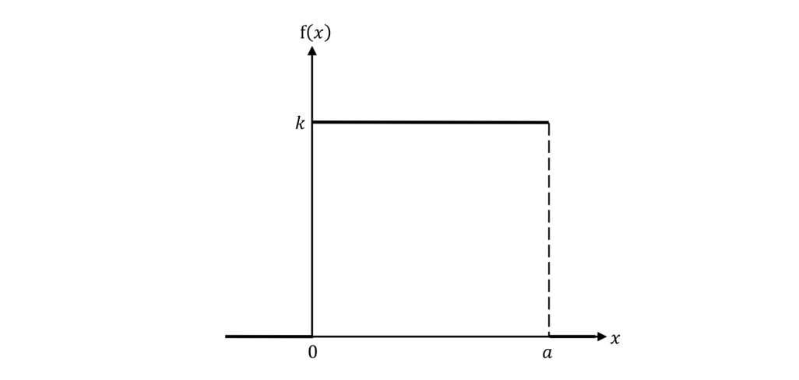

Write down an expression for $k$  in terms of $a$.

### 2() — 1 mark — structured
Write down an expression for $E(X)$ in terms of $a$.

### 3() — 3 marks — structured
Find a simplified expression for $\mathrm{Var}(X)$ in terms of $a$.

### 4() — 2 marks — structured
Given that$P(X>5)=0.6$find the value of $a$.

## Q25 — hard — 6 marks · exam-questions

### 1() — 6 marks — structured
Find the mode of the continuous random variable, $X$, which has probability density function defined by:

(i) `straight f open parentheses x close parentheses equals open curly brackets table row cell 3 over 140 open parentheses 5 minus 6 x minus x squared close parentheses end cell cell negative 4 less or equal than x less or equal than 0 end cell row 0 cell otherwise. end cell end table close`

(ii) `straight f open parentheses x close parentheses equals open curly brackets table row cell 3 over 34 open parentheses 10 minus open parentheses x minus 2 close parentheses squared close parentheses end cell cell 3 less or equal than x less or equal than 5 end cell row 0 cell otherwise. end cell end table close`

(iii) `straight f open parentheses x close parentheses equals open curly brackets table row cell 1 half open parentheses sin open parentheses x close parentheses plus cos open parentheses x close parentheses close parentheses end cell cell 0 less or equal than x less or equal than pi over 2 end cell row 0 cell otherwise. end cell end table close`

## Q26 — hard — 7 marks · exam-questions

### 1() — 1 mark — structured
The diagram below shows the probability density function, $f(x)$, of a random variable $X$.

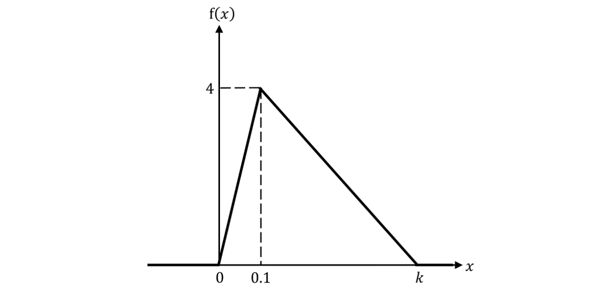

Find the value of $k$.

### 2() — 2 marks — structured
Find $P(X>0.4).$

### 3() — 4 marks — structured
Find the median of $X$.

## Q27 — hard — 9 marks · exam-questions

### 1() — 2 marks — structured
The diagram below shows the probability density function, `straight f open parentheses t close parentheses`, of a random variable $T$.

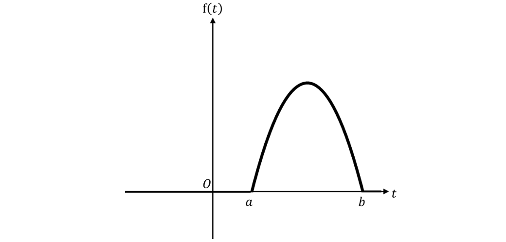

For $a\leqt\leqb,f(t)=\frac{3}{32}(10t-t^{2}-21),$ elsewhere $f(t)=0$.

Find the values of $a$ and $b$.

### 2() — 4 marks — structured
State the value of $E(T)$ and find $\mathrm{Var}(T)$.

### 3() — 1 mark — structured
Find $P(-2\leqT\leq5)$.

### 4() — 2 marks — structured
Given that $P(4\leqT\leq6)=\frac{11}{16}$ find $P(T\geq6).$

## Q28 — hard — 9 marks · exam-questions

### 1() — 2 marks — structured
Geoff is taking part in a quiz where he has 4 seconds to answer each question. The time, in seconds, it takes Geoff to answer a question is denoted $T$ which can be modelled by the probability density function, $f(t),$  shown below.

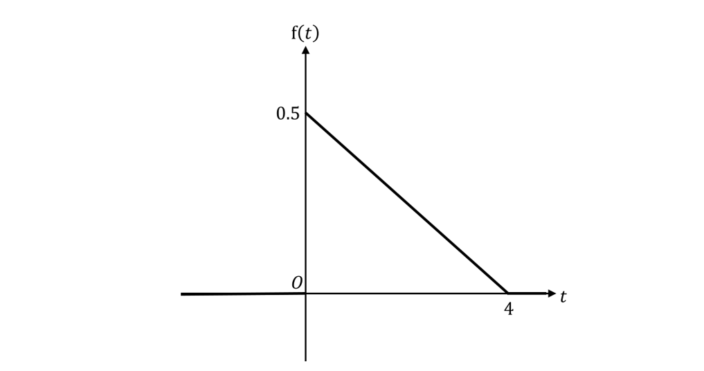

Find the probability that Geoff answers a question in less than 2 seconds.

### 2() — 4 marks — structured
Find the mean time it takes Geoff to answer a question.

### 3() — 3 marks — structured
There are 10 questions in the quiz. Find the probability that for at least one of the questions Geoff takes longer than 3 seconds.

## Q29 — very_hard — 8 marks · exam-questions

### 1() — 2 marks — structured
The diagram below shows the probability density function, $f(x)$, of a random variable $X$.

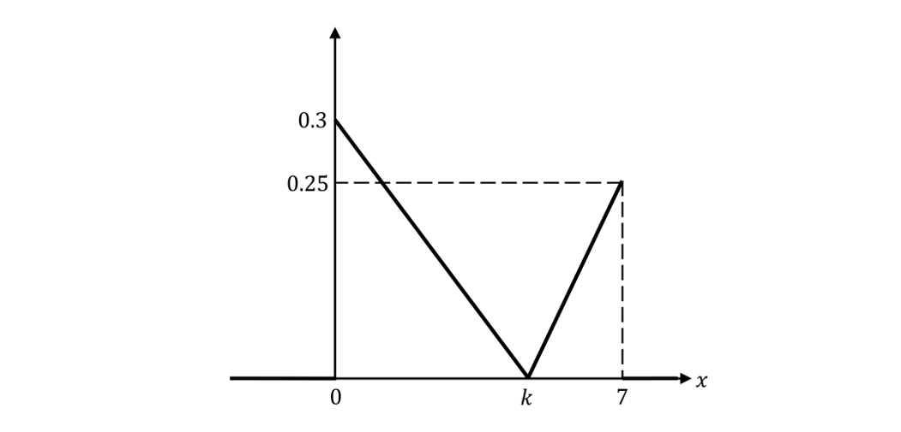

Find the value of $k$.

### 2() — 2 marks — structured
Find $P(X\leq6).$

### 3() — 4 marks — structured
Find the interquartile range of $X$.

## Q30 — very_hard — 6 marks · exam-questions

### 1() — 2 marks — structured
A computer takes $T$ seconds to start up. The random variable, $T$, can be modelled by the probability distribution, $f(t)$, shown below.

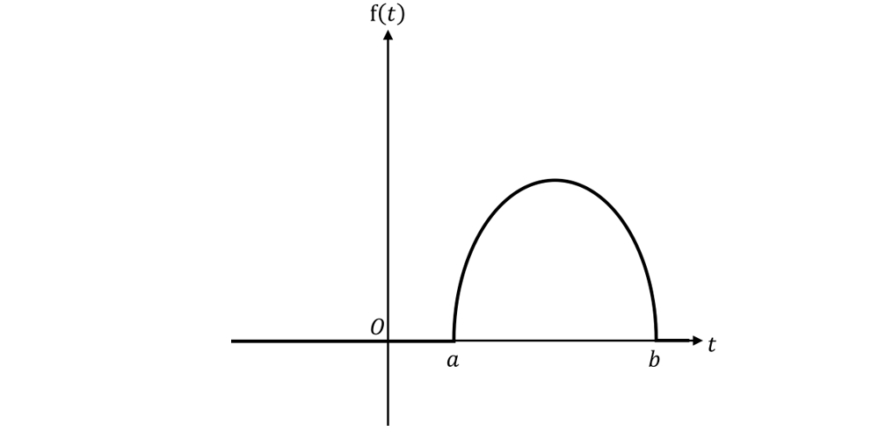

For $a\leqt\leqb,f(t)=\frac{1}{8}π\sqrt{(12t-t^{2}-20)},$ elsewhere $f(t)=0$.

Find the values of $a$ and $b$.

### 2() — 1 mark — structured
State the mean time for the computer to start up.

### 3() — 1 mark — structured
Find probability that the computer takes between 6 and 15 seconds to start up.

### 4() — 2 marks — structured
Given that $P(4\leqT\leq8)=\frac{\sqrt{3}}{2π}+\frac{1}{3},$ find the exact value of $P(T\geq8)$.

## Q31 — very_hard — 10 marks · exam-questions

### 1() — 1 mark — structured
The diagram below shows the probability density function, $g(y)$, of a random variable $Y$.

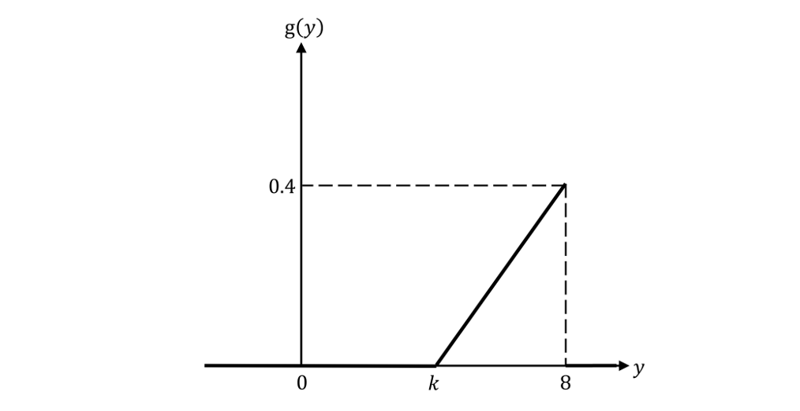

Find the value of $k$.

### 2() — 3 marks — structured
Find $P(5<Y<6).$

### 3() — 2 marks — structured
Find the median of $Y$.

### 4() — 4 marks — structured
Find $E(Y).$

## Q32 — very_hard — 8 marks · exam-questions

### 1() — 5 marks — structured
The random variable, $U$, follows a continuous uniform distribution on the interval `open square brackets a comma b close square brackets`. The probability density function  is defined by:

`g open parentheses u close parentheses equals open curly brackets table row k row 0 end table close space space space space space space space space space table row cell a less or equal than u less or equal than b end cell row cell otherwise. end cell end table`

(i) Write down an expression for $k$ in terms of $a$ and $b$.

(ii) Write down an expression for $E(U)$ in terms of $a$ and $b$.

(iii) Show that  `Var open parentheses U close parentheses equals open parentheses b minus a close parentheses squared over 12.`.

### 2() — 3 marks — structured
Given that $E(U)=8.5$and $\mathrm{Var}(U)=6.75$, find the values of $a$ and $b$.

## Q33 — very_hard — 14 marks · exam-questions

### 1() — 6 marks — structured
A meeting at a company lasts $T$ hours. The random variable $T$ can be modelled by the probability density function

`straight f open parentheses t close parentheses equals open curly brackets table row cell 3 over 4 t open parentheses t minus 2 close parentheses squared end cell row 0 end table close space space space space space space space space space space space space table row cell 0 less or equal than t less or equal than 2 end cell row cell otherwise. end cell end table`

Find the mean time of a meeting and find the standard deviation of times.

### 2() — 4 marks — structured
Show that the median length of a meeting is 0.771 hours, correct to 3 significant figures.

### 3() — 4 marks — structured
By using differentiation, find the mode of the times.

## Q34 — very_hard — 11 marks · exam-questions

### 1() — 3 marks — structured
The continuous random variable $X$ has probability density function

`straight f open parentheses x close parentheses equals open curly brackets table row cell k over x cubed end cell row 0 end table close space space space space space space space space space space space space space space space space space table row cell 2 less or equal than x less or equal than a end cell row cell otherwise. end cell end table`

Show that $k=\frac{8a^{2}}{a^{2}-4}.$

### 2() — 5 marks — structured
Given that $E(X)=\frac{20}{7},$ show that $a=5$ and hence find the value of $k$.

### 3() — 3 marks — structured
Find the exact value of $\mathrm{Var}(X)$ .

## Q35 — very_hard — 4 marks · exam-questions

### 1() — 1 mark — structured
Paul is travelling around France to try to find the perfect baguette. The random variable $C$ represents the cost, in euros, of a baguette. It can be modelled by the probability density function

`straight f open parentheses c close parentheses equals open curly brackets table row cell 1 over 36 open parentheses 14 c minus c squared minus 40 close parentheses end cell row 0 end table close space space space space space space space space space space space space space space space space table row cell 4 less or equal than c less or equal than 10 end cell row cell otherwise. end cell end table`

Sketch the graph of $y=f(c).$

### 2() — 1 mark — structured
Explain why the mean price of a baguette is €7.

### 3() — 2 marks — structured
Given that $P(C<9)=\frac{25}{27},$ find the value of $P(5<C<9).$

## Q36 — very_hard — 10 marks · exam-questions

### 1() — 4 marks — structured
The continuous random variable $X$ has probability density function $f(x)$ given by

`straight f open parentheses x close parentheses equals open curly brackets table row cell 1 over 7 x to the power of 4 end cell cell space space space minus 1 less or equal than x less or equal than 1 end cell row cell 1 over 20 x cubed minus 1 over 35 x end cell cell space space space space space space 1 less than x less than 3 end cell row k cell space space space space space 3 less or equal than x less or equal than 6 end cell row 0 cell space space space space space space space otherwise end cell end table close`

where $k$ is a constant.

Find the exact value of $k$.

### 2() — 2 marks — structured
Find $P(X>0).$

### 3() — 4 marks — structured
Find $E(X)$.
