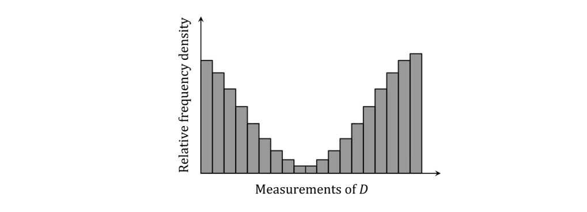
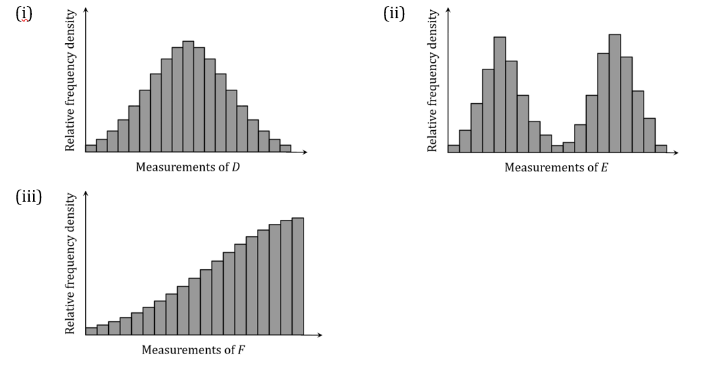
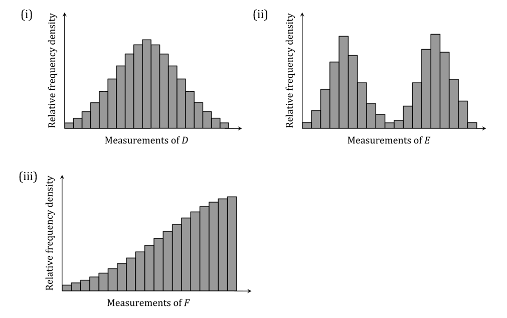

# Exam Questions — Working with Distributions
**Statistical Distributions** · Edexcel International A Level (IAL) Maths (YMA01) — Statistics 2
> Source: [https://www.savemyexams.com/international-a-level/maths/edexcel/20/statistics-2/topic-questions/statistical-distributions/working-with-distributions/exam-questions/](https://www.savemyexams.com/international-a-level/maths/edexcel/20/statistics-2/topic-questions/statistical-distributions/working-with-distributions/exam-questions/) · 45 questions · total 379 marks

## Q1 — easy — 5 marks · exam-questions

### 1() — 4 marks — structured
The table below shows five scenarios involving different random variables. Complete the table by placing a cross (×) in the correct box to indicate whether the random variable can be modelled by a binomial distribution, a normal distribution or neither. The first scenario is completed for you.

| Scenario | Binomial | Normal | Neither |
|---|---|---|---|
| The digits 1 to 9 are written on individual counters and placed in a bag.  A child randomly selects one of the nine counters. The random variable $A$ represents the number that is written on the selected counter. |   |   | × |
| A farmer has many hens. The random variable $B$ represents the mass of a randomly selected hen. |   |   |   |
| A fair coin is flipped 100 times. The random variable $C$ represents the number of times it lands on tails. |   |   |   |
| A teacher has a 30-minute break for lunch. The random variable $D$ represents the number of emails he receives during his lunch break. |   |   |   |
| In a class of 30 students, each student rolls a fair six-sided dice with sides labelled 1 to 6. The random variable $E$ represents the number of students who roll a number less than 5. |   |   |   |

### 2() — 1 mark — structured
Write down the name of the probability distribution of $A$, the random variable described in part (a).

## Q2 — easy — 6 marks · exam-questions

### 1() — 2 marks — structured
In an experiment there are a fixed number of trials and each trial results in a success or failure. Let $X$ be the number of successful trials. Write down the two other conditions that would need to be present to make $X$ follow a binomial distribution.

### 2() — 3 marks — structured
A fair spinner has 8 sectors labelled with the numbers 1 through 8. For each of the following cases, give a reason to explain why a binomial distribution would **not** be appropriate for modelling the specified random variable.

(i) The random variable $A$ is the number of times the spinner is spun until it lands on ‘1’ for the first time.

(ii) When the spinner is spun it rotates exactly 115°. The random variable $B$ is the number of times the spinner lands on ‘1’ when the spinner is spun 20 times.

(iii) The random variable $C$ is the sector number that the spinner lands on when it is spun once.

### 3() — 1 mark — structured
State which one of the random variables defined in part (b) follows a discrete uniform distribution.

## Q3 — easy — 4 marks · exam-questions

### 1() — 3 marks — structured
For each of the following, state with a reason whether the random variable in question is a discrete random variable or a continuous random variable.

(i) 100 red squirrels from the wild are sampled. The random variable $A$ is the tail length of a randomly selected red squirrel.

(ii) 100 students sit a test which is marked out of 50. The random variable $B$ is the number of marks achieved by a randomly selected student.

(iii) 100 men are in a shoe shop. The random variable $C$ is the shoe size of a randomly selected man.

### 2() — 1 mark — structured
The following histogram shows the distribution of results when a large number of measurements of the specified random variable $D$ are made. State with a reason whether a normal distribution would be appropriate for modelling the random variable.

## Q4 — easy — 8 marks · exam-questions

### 1() — 1 mark — structured
The random variable `space X space tilde space B left parenthesis n comma p right parenthesis space`can be approximated by `Y space tilde N left parenthesis mu comma sigma squared right parenthesis` when certain conditions are fulfilled.

State the condition for $n$ which is required to use this approximation.

### 2() — 2 marks — structured
(i) State the value of $p$ that will give the most accurate estimate.

(ii) Give a reason to support your value.

### 3() — 5 marks — structured
For each of the following binomial random variables, $X$:

- state, with reasons, whether $X$ can be approximated by a normal distribution
- if appropriate, write down the normal approximation to $X$ in the form  $N(μ,σ^{2})$, giving the values of $μ$ and $σ^{2}$.

(i) `X tilde B left parenthesis 6 comma 0.45 right parenthesis`

(ii) `X tilde B left parenthesis 60 comma 0.05 right parenthesis`

(iii) `X tilde B left parenthesis 60 comma 0.45 right parenthesis`

## Q5 — easy — 8 marks · exam-questions

### 1() — 3 marks — structured
The random variable`space X space tilde space B left parenthesis 100 comma 0.36 right parenthesis space`is approximated by `Y tilde space N left parenthesis mu comma sigma squared right parenthesis`.

Find the value of $μ$ and show that $σ=4.8$.

### 2() — 1 mark — structured
Explain why a continuity correction must be incorporated when using this approximation.

### 3() — 4 marks — structured
Use continuity corrections to find the value of $k$ in each of the following approximations:

(i) $P(X\leq30)\approxP(Y<k)$

(ii) $P(X<30)\approxP(Y<k)$

(iii) $P(X\geq30)\approxP(Y>k)$

(iv) $P(X>30)\approxP(Y>k)$

## Q6 — easy — 10 marks · exam-questions

### 1() — 4 marks — structured
`X tilde B left parenthesis 50 comma 0.4 right parenthesis` is approximated by a normal distribution `Y tilde space N left parenthesis mu comma sigma squared right parenthesis`.

(i) State two reasons why a normal approximation is suitable.

(ii) Find the values of $μ$ and $σ$.

### 2() — 6 marks — structured
(i) Calculate $P(16\leqX\leq25)$.

(ii) Explain why $P(16\leqX\leq101)\approxP(15.5<Y<25.5)$ .

(iii) Calculate $P(15.5<Y<25.5)$ .

## Q7 — easy — 7 marks · exam-questions

### 1() — 3 marks — structured
The number of occurrences in a fixed period of time is denoted as $X$. Write down the conditions that are needed so that $X$ can be modelled as a Poisson distribution.

### 2() — 4 marks — structured
For each of the following scenarios, identify the name of the distribution (if any) which is the most appropriate to model the specified random variables.

(i) A manager receives emails randomly and independently at a constant rate of 15 per hour. The random variable $A$ is the number of emails she receives in a two-hour period.

(ii) A fair dice has six sides labelled 1 to 6. The random variable $B$ is the number of times that the dice is rolled until it lands on ‘3’.

(iii) It is known that on average 23 in 100 people have blonde hair. A hairdresser has 20 customers per day.  The random variable $C$ is the number of customers with blonde hair.

(iv) A machine breaks down at a rate of two times per week. Breakdowns are independent of each other.  The random variable $D$ is the number of times that the machine breaks down in a year.

## Q8 — easy — 6 marks · exam-questions

### 1() — 1 mark — structured
The random variable `space X space tilde B left parenthesis n comma p right parenthesis space space`can be approximated by `Y space tilde P o left parenthesis lambda right parenthesis` when certain conditions are fulfilled.

State the condition for $n$ that is required to use this approximation.

### 2() — 1 mark — structured
State whether $p$ needs to be close to 0 or close to 0.5.

### 3() — 4 marks — structured
For each of the following random variables, $X$:

State, with reasons, whether $X$ can be approximated by a Poisson distribution,

if appropriate, write down the Poisson approximation to $X$ in the form`Y space tilde space P o left parenthesis lambda right parenthesis`, giving the value of $λ$.

(i) `X tilde B left parenthesis 6 comma 0.45 right parenthesis`

(ii) `X tilde B left parenthesis 60 comma 0.05 right parenthesis`

(iii) `X tilde B left parenthesis 60 comma 0.45 right parenthesis`

## Q9 — easy — 6 marks · exam-questions

### 1() — 1 mark — structured
The random variable `space X space tilde B left parenthesis 80 comma 0.05 right parenthesis space space`is approximated by`space Y space tilde P o left parenthesis lambda right parenthesis.`

Find the value of $λ$ using $λ=np$.

### 2() — 1 mark — structured
Explain why a continuity correction is not needed when using this approximation.

### 3() — 4 marks — structured
Find

(i) $P(X=5)$

(ii) $P(Y=5).$

## Q10 — easy — 5 marks · exam-questions

### 1() — 1 mark — structured
The random variable `space X space tilde P o left parenthesis lambda right parenthesis space space`can be approximated by `Y tilde space N left parenthesis mu comma sigma squared right parenthesis` when certain conditions are fulfilled.

State the condition for $λ$ which is required to use this approximation.

### 2() — 4 marks — structured
For each of the following random variables, $X$:

- State, with reasons, whether $X$ can be approximated by a normal distribution,
- if appropriate, write down the normal approximation to $X$ in the form `Y tilde space N left parenthesis mu comma sigma squared right parenthesis`, giving the values of $μ$ and $σ$.

(i) `X tilde P o left parenthesis 100 right parenthesis`

(ii) `X tilde P o left parenthesis 4 right parenthesis`

(iii) `X tilde P o left parenthesis 50 right parenthesis`.

## Q11 — easy — 9 marks · exam-questions

### 1() — 2 marks — structured
The random variable`space X space tilde P o left parenthesis 25 right parenthesis space space`is approximated by $YN(μ,σ^{2}).$

Write down the value of $μ$ and explain why $σ=5$.

### 2() — 1 mark — structured
Explain why a continuity correction is needed when using this approximation.

### 3() — 6 marks — structured
(i) Calculate $P(26\leqX\leq28).$

(ii) Explain why $P(26\leqX\leq28)\approxP(25.5<Y<28.5).$

(iii) Calculate $P(25.5<Y<28.5).$

## Q12 — easy — 7 marks · exam-questions

### 1() — 2 marks — structured
(i) Describe the conditions when`space X space tilde B left parenthesis n comma p right parenthesis space space`can be approximated by`space S space tilde P o left parenthesis lambda right parenthesis`.

(ii) Describe the conditions when`space X space tilde B left parenthesis n comma p right parenthesis` can be approximated by `T tilde space N left parenthesis mu comma sigma squared right parenthesis`.

### 2() — 5 marks — structured
For each of the following random variables, $X$:

- State, with reasons, whether $X$ can be approximated by a Poisson distribution, a normal distribution or neither,
- if appropriate, write down the approximation to $X$ in the form `Y space tilde space P o left parenthesis lambda right parenthesis` or `Y tilde space N left parenthesis mu comma sigma squared right parenthesis`,  giving the values of any parameters.

(i) `X tilde B left parenthesis 100 comma 0.02 right parenthesis`

(ii) `X tilde B left parenthesis 10 comma 0.02 right parenthesis`

(iii) `X tilde B left parenthesis 100 comma 0.2 right parenthesis`.

## Q13 — medium — 9 marks · exam-questions

### 1() — 4 marks — structured
State the conditions that must be satisfied to be able to model a random variable $X$  with a binomial distribution $B(n,p)$ .

### 2() — 4 marks — structured
A fair spinner has 8 sectors labelled with the numbers 1 through 8. For each of the following cases, state with a reason whether or not a binomial distribution would be appropriate for modelling the specified random variable.

(i) The random variable $S$ is the number of the sector that the spinner lands on when it is spun.

(ii) The random variable $W$ is the number of times the spinner is spun until it lands on ‘7’ for the first time.

(iii) The random variable $Y$ is the number of times the spinner lands on a prime number when it is spun twelve times.

(iv) On the first spin, it is a ‘win’ if the spinner lands on an even number. On subsequent spins it is a ‘win’ if the spinner lands *either* on the same number as the previous spin *or* on a factor of the number from the previous spin.  The random variable $L$ is the number of wins when the spinner is spun ten times.

### 3() — 1 mark — structured
For the random variable  defined in (a)(ii) above, give the name of the probability distribution that *would* be appropriate for modelling *S*.

## Q14 — medium — 6 marks · exam-questions

### 1() — 3 marks — structured
For each of the following, state with a reason whether the random variable in question is a discrete random variable or a continuous random variable.

(i) A student cuts a one-metre length of rope into two pieces at a random point. The random variable $A$ is the length of the shorter of these two pieces.

(ii) You ask a sample of students in your school about their preferences for after-school activities. The random variable $B$ is the number of students who say they prefer participating in lawn bowling.

(iii) People are chosen at random from the UK population. The random variable $C$ is the age of a randomly selected person, defined as the age which they turned on their most recent birthday.

### 2() — 3 marks — structured
Each of the following histograms shows the distribution of results when a large number of measurements of the specified random variables – $D,E$ or $F$ – are made.  In each case, state with a reason whether a normal distribution would be appropriate for modelling the random variable.

## Q15 — medium — 8 marks · exam-questions

### 1() — 8 marks — structured
For each of the following binomial random variables, $X$:

- state, with reasons, whether $X$ can be approximated by a normal distribution
- if appropriate, write down the normal approximation to $X$ in the form $N(μ,σ^{2})$ , giving the values of $μ$ and $σ$.

(i) `X tilde B left parenthesis 8 comma 0.5 right parenthesis`

(ii) `X tilde B left parenthesis 80 comma 0.54 right parenthesis`

(iii) `X tilde B left parenthesis 625 comma 0.45 right parenthesis`

(iv) `X tilde B left parenthesis 90 comma 0.95 right parenthesis`

## Q16 — medium — 11 marks · exam-questions

### 1() — 1 mark — structured
The random variable `W tilde B left parenthesis 500 comma 0.4 right parenthesis`.

Explain why a normal distribution can be used to approximate $W$.

### 2() — 7 marks — structured
Find, using the normal approximation:

(i) $P(189\leqW\leq211)$

(ii) $P(W>220)$.

### 3() — 3 marks — structured
Using the normal approximation, find the largest value of $w$ such that $P(W\leqw)<0.1$.

## Q17 — medium — 10 marks · exam-questions

### 1() — 1 mark — structured
Write down two conditions under which the normal distribution may be used as an approximation to the binomial distribution $B(n,p)$.

### 2() — 2 marks — structured
On a casino roulette wheel, the probability of the ball landing on a black number is  $\frac{9}{19}$.

The wheel is spun 30 times, and the ball lands on a black number $X$ times.

Find $P(X=14)$.

### 3() — 3 marks — structured
In a separate experiment, the wheel is spun 1000 times and $Y$, the number of times the ball lands on a black number, is recorded.

(i) Explain why a normal approximation would be appropriate in this case.

(ii) Write down the normal distribution that could be used to approximate the distribution of $Y$.

### 4() — 4 marks — structured
Use the distribution from (c)(ii) to approximate the probability that in at least one half of the 1000 spins the ball lands on a black number.

## Q18 — medium — 8 marks · exam-questions

### 1() — 2 marks — structured
As part of a marketing promotion, 47% of packets of a particular brand of crisps contain a zombie toy as a prize.  A random sample of 100 packets is taken.

Find the probability that exactly 49 of the packets contain a prize. Give your answer to 6 decimal places

### 2() — 1 mark — structured
Write down the normal distribution that could be used to approximate the distribution for the number of the 100 packets that contain a prize.

### 3() — 5 marks — structured
(i) Use the normal approximation to approximate the probability that exactly 49 of the packets contain a prize.

(ii) Find the percentage error when using a normal approximation to calculate the probability that exactly 49 of the packets contain a prize. Give your answer correct to two significant figures.

## Q19 — medium — 10 marks · exam-questions

### 1() — 2 marks — structured
Dominique owns a grocery store, and she models the number of customers entering the store during a 10-minute period using a Poisson distribution with mean 7.

State the assumptions that Dominique has made by using a Poisson distribution to model the number of customers entering her store during a 10-minute period.

### 2() — 2 marks — structured
Find the probability that no more than 4 customers enter the store during a 10-minute period.

### 3() — 2 marks — structured
Explain why a normal distribution can be used to approximate the distribution for the number of customers entering the store in a one-hour period. State the appropriate normal distribution.

### 4() — 4 marks — structured
Using the normal approximation, find the probability that more than 50 customers enter the store within a one-hour period.

## Q20 — medium — 9 marks · exam-questions

### 1() — 2 marks — structured
In England, it is known that 5% of the population have ginger hair. Kenneth, the owner of a hairdressing salon, has 40 appointments available each day. He models the number of clients with ginger hair that attend his salon in a day using a binomial distribution.

State the assumptions that Kenneth has made by using a binomial distribution.

### 2() — 2 marks — structured
Assuming all 40 appointments are filled, find the probability that at least one person has ginger hair.

### 3() — 2 marks — structured
Assuming all 40 appointments are filled each day, the number of clients with ginger hair attending an appointment over a two-day period is denoted $G$. Explain why a Poisson distribution can be used to approximate $G$. State the appropriate Poisson distribution.

### 4() — 3 marks — structured
Using the Poisson distribution, find the probability at most 5 clients with ginger hair will have an appointment at the salon over the two-day period.

## Q21 — medium — 7 marks · exam-questions

### 1() — 1 mark — structured
The random variable `space X space tilde B left parenthesis 60 comma space 0.08 right parenthesis space space`is approximated by `Y tilde space P o left parenthesis lambda right parenthesis`.

Explain why this approximation is valid and state the values of $λ$.

### 2() — 4 marks — structured
(i) Find `P open parentheses X equals 4 close parentheses comma` giving your answer to 6 decimal places.

(ii) Find `P open parentheses Y equals 4 close parentheses comma` giving your answer to 6 decimal places.

### 3() — 2 marks — structured
Hence find the percentage error when a Poisson distribution is used to approximate `P open parentheses X equals 4 close parentheses.`

## Q22 — medium — 8 marks · exam-questions

### 1() — 1 mark — structured
The random variable `space X space tilde P o left parenthesis 40 right parenthesis space space`is approximated by `Y tilde space N left parenthesis mu comma sigma squared right parenthesis`.

Explain why this approximation is valid and state the values of $μ$ and $σ$.

### 2() — 5 marks — structured
(i) Find $P(37<X\leq39)$, giving your answer to 6 decimal places.

(ii) Use $Y$ to find an approximate value for $P(37<X\leq39)$, giving your answer to 3 significant figures.

### 3() — 2 marks — structured
Hence find the percentage error when a normal distribution is used to approximate $P(37<X\leq39).$

## Q23 — medium — 10 marks · exam-questions

### 1() — 2 marks — structured
Charlotte, an online tutor, receives messages from students at an average rate of 4 per half an hour.

State the assumptions that are needed in order to use a Poisson distribution to model the number of messages Charlotte receives from students during a fixed period of time.

### 2() — 2 marks — structured
Find the probability that Charlotte receives no fewer than 2 messages in a half-hour period.

### 3() — 4 marks — structured
Charlotte works as an online tutor for 4 hours per day and works 5 days a week.

Using an approximating distribution, find the probability that Charlotte receives more than 30 messages during a 4-hour working day.

### 4() — 2 marks — structured
Hence find the probability that Charlotte receives more than 30 messages in a day for exactly 2 days in a 5-day working week.

## Q24 — medium — 10 marks · exam-questions

### 1() — 1 mark — structured
The random variable`space S space tilde P o left parenthesis 75 right parenthesis.`

Write down the normal distribution which can be used to approximate $S$.

### 2() — 6 marks — structured
Using the normal approximation, find:

(i) $P(60\leqS<80)$

(ii) $P(S\leq85).$

### 3() — 3 marks — structured
Using the normal approximation, find the largest integer value of  such that $P(S\leqs)<0.1$.

## Q25 — hard — 10 marks · exam-questions

### 1() — 4 marks — structured
State the conditions that must be satisfied to be able to model a random variable $X$ with a binomial distribution $B(n,p)$.

### 2() — 4 marks — structured
A fair spinner has 5 sectors labelled with the numbers 1 through 5.  The spinner is spun and a fair coin is flipped, and the number the spinner lands on along with the result of the coin flip (heads or tails) are recorded.  For each of the following cases, state with a reason whether or not a binomial distribution would be appropriate for modelling the specified random variable.

(i) If the coin lands on heads, then the random variable $S$ is the number of the sector that the spinner lands on times two. Otherwise $S$ is the number of the sector that the spinner lands on plus 10.

(ii) The random variable $W$ is the number of times the spinner is spun and the coin is flipped until an odd number on the spinner occurs together with tails on the coin.

(iii) The random variable $Y$ is the number of times a prime number on the spinner occurs together with heads on the coin, when the spinner is spun and the coin is flipped 21 times.

(iv) Each time the spinner is spun and the coin is flipped, it is a ‘win’ if a square number on the spinner occurs together with heads on the coin, or it is a ‘loss’ if a non-square number on the spinner occurs together with tails on the coin.  Any other outcome is a ‘draw’.  The random variable $L$ is the number of losses when the spinner is spun and the coin is flipped twelve times.

### 3() — 2 marks — structured
For the random variable $S$ defined in (b)(i) above, give the name of the probability distribution that *would* be appropriate for modelling *S*. Justify your answer.

## Q26 — hard — 7 marks · exam-questions

### 1() — 3 marks — structured
For each of the following, state with a reason whether the random variable in question is a discrete random variable or a continuous random variable.

(i) A cake recipe calls for a certain amount of flour to be used. The random variable $A$ is the number of cakes that can be made, following the recipe exactly each time, from a bag containing a random amount of flour.

(ii) A student cuts a one-metre length of rope into two pieces at a random point. The random variable $B$ is the difference in length between the two pieces of rope that result.

(iii) People are chosen at random from the UK population. The random variable $C$ is the age of a randomly selected person, measured from their date and time of birth.

### 2() — 4 marks — structured
Each of the following histograms shows the distribution of results when a large number of measurements of the random variables $D,E$ or $F$ are made.  In each case, state with a reason whether a normal distribution would be appropriate for modelling the random variable.  Where a normal model is appropriate, suggest a real-world variable that might show such a distribution.

## Q27 — hard — 12 marks · exam-questions

### 1() — 1 mark — structured
The random variable `W tilde B left parenthesis 1200 comma 0.6 right parenthesis`.

Explain why a normal distribution can be used to approximate $W$.

### 2() — 7 marks — structured
Find, using the appropriate normal approximation:

(i) $P(700<W\leq730)$

(ii) $P(W\geq719)$

### 3() — 4 marks — structured
Using the normal approximation, find the largest value of $k$ (where $k$ is an integer) such that  $P((720-k)<W<(720+k))<0.5$.

## Q28 — hard — 10 marks · exam-questions

### 1() — 1 mark — structured
Write down two conditions under which the normal distribution may be used as an approximation to the binomial distribution $B(n,p)$.

### 2() — 2 marks — structured
On a European-style casino roulette wheel, the probability of the ball landing on a red number is $\frac{18}{37}$.

The wheel is spun 36 times, and the ball lands on a red number $X$ times.

Find $P(17<X\leq18)$.

### 3() — 3 marks — structured
In a separate experiment, the wheel is spun 1000 times and $Y$, the number of times the ball lands on a red number, is recorded.

(i) Explain why a normal approximation would be appropriate in this case.

(ii) Write down the normal distribution that could be used to approximate the distribution of $Y$.

### 4() — 4 marks — structured
Use the distribution from (c)(ii) to approximate the probability that in 1000 spins the ball lands on a red number either less than 482 times or more than 491 times.

## Q29 — hard — 8 marks · exam-questions

### 1() — 2 marks — structured
Due to a manufacturing irregularity, 41% of Adventure Dude action figures were produced with two left hands.  Although not especially rare, and therefore not especially collectible, these so-called ‘double left’ figures are nonetheless considered to be collector’s items by hard-core Adventure Dude fanatics.

A vintage toy shop has obtained 100 Adventure Dude action figures.  These may be assumed to represent a random sample.

Find the probability that exactly 45 of the 100 figures are ‘double left’ figures. Give your answer to 6 decimal places.

### 2() — 4 marks — structured
Use an appropriate normal approximation to approximate the probability that exactly 45 of the 100 figures are ‘double left’ figures.

### 3() — 2 marks — structured
Find the percentage error when using your normal approximation from part (b) to estimate the probability that exactly 45 of the 100 figures are ‘double left’ figures. Give your answer correct to two decimal places.

## Q30 — hard — 9 marks · exam-questions

### 1() — 2 marks — structured
Fleur is a biology student researching daisies on a particular field. She randomly selects a square of field with length one metre and records the number of daisies in that area, denoted by the random variable $D$. Fleur models $D$ using a Poisson distribution with mean 5.

State the assumptions needed so that $D$ follows a Poisson distribution.

### 2() — 2 marks — structured
Find the probability that there are more than 2 daisies in a randomly selected square with length one metre.

### 3() — 5 marks — structured
Using an approximating distribution, find the probability that the number of daisies, in a randomly selected square with length 6 metres, is between 175 and 190 inclusive.

## Q31 — hard — 8 marks · exam-questions

### 1() — 3 marks — structured
Remy has a biased coin with the probability of it landing on tails being 0.05.

Using a Poisson approximation, find the probability that the coin lands on tails more than 4 times when Remy flips it 60 times.

### 2() — 5 marks — structured
Remy flips the coin 2000 times.

Using a normal approximation, find the probability that the coin lands on tails fewer than 120 times when Remy flips it 2000 times.

## Q32 — hard — 11 marks · exam-questions

### 1() — 1 mark — structured
The random variable `T space tilde P o left parenthesis 200 right parenthesis.`

Write down the normal distribution which can be used to approximate $T$. Explain why a normal distribution is suitable to approximate $T$.

### 2() — 6 marks — structured
Using the normal approximation, find:

(i) $P(180<T\leq230)$

(ii) $P(T>175).$

### 3() — 4 marks — structured
Using the normal approximation, find the largest integer value of $t$ such that $P(200-t<T<200+t)<0.75$.

## Q33 — hard — 12 marks · exam-questions

### 1() — 5 marks — structured
The random variable `space X space tilde P o left parenthesis lambda right parenthesis.` Given that$P(X\geq100)=0.999$, use an approximating distribution to find the value of $λ$.

### 2() — 7 marks — structured
The random variable `Y space tilde B left parenthesis n comma p right parenthesis`.

(i) Given that $p=0.00025$and $P(Y>0)=0.847$correct to 3 decimal places, use a suitable approximation to find the value of $n$.

(ii) Given instead that $p=0.6$ and $P(Y>450)=0.486$ correct to 3 decimal places, use a suitable approximation to find the value of $n$.

## Q34 — very_hard — 11 marks · exam-questions

### 1() — 4 marks — structured
State the conditions that must be satisfied to be able to model a random variable $X$ with a binomial distribution $B(n,p)$.

### 2() — 4 marks — structured
A fair spinner has 5 sectors labelled with the numbers 2, 3, 5, 7 and 11. A fair dice has 6 sides labelled with the numbers 1 through 6. The spinner is spun and the dice is rolled, and the numbers that the spinner and the dice land on are recorded.  For each of the following cases, state with a reason whether or not a binomial distribution would be appropriate for modelling the specified random variable.

(i) The random variable $S$ is the square root of the number that the spinner lands on, times the number that the dice lands on.

(ii) The random variable $W$ is the number of times that both the spinner and the dice land on a prime number, when the spinner is spun and the dice is rolled 47 times.

(iii) The random variable $Y$ is the number of times the spinner is spun and the dice is rolled until the number the spinner lands on is a factor of the number the dice lands on.

(iv) On the first spin of the spinner and roll of the dice, it is a ‘win’ if the number on the spinner is greater than the number on the dice. On subsequent spins of the spinner and rolls of the dice, it is only a ‘win’ if the number the spinner lands on is higher than both the number the dice lands on *and* all the numbers that the dice has landed on previously.  The random variable $Z$ is the number of ‘wins’ when the spinner is spun and the dice is rolled 24 times.

### 3() — 3 marks — structured
For the random variable  defined in (b)(i) above, give the name of the probability distribution that *would* be appropriate for modelling S.  You must justify your answer using mathematical reasoning.

## Q35 — very_hard — 9 marks · exam-questions

### 1() — 3 marks — structured
For each of the following, state with a reason whether the random variable in question is a discrete random variable or a continuous random variable.

(i) A string collector decides to measure all the pieces of string in his collection. The random variable $A$ is the length of a randomly chosen piece of string from the collection, rounded to the nearest centimetre.

(ii) A random sample of 1000 people is chosen from the US population, and the number of siblings each has is recorded. The random variable $B$ is the mean number of siblings for the 1000 people in the sample.

(iii) The masses of individual eggs in the nests of a particular species of bird are measured and recorded. The random variable $C$ is the total mass of the eggs in a randomly chosen nest.

### 2() — 6 marks — structured
Each of the following histograms shows the distribution of results when a large number of measurements of the specified random variables –$D,E$ or  $F$– are made.  In each case, state with a reason whether a normal distribution would be appropriate for modelling the random variable, and suggest a real-world variable that might show such a distribution.

## Q36 — very_hard — 12 marks · exam-questions

### 1() — 1 mark — structured
The random variable `W tilde B left parenthesis 980 comma 0.4 right parenthesis`.

Explain why a normal distribution can be used to approximate $W$.

### 2() — 7 marks — structured
Find, using the appropriate normal approximation:

(i) $P(386<W<398)$

(ii) $P(W\geq400)$

### 3() — 4 marks — structured
Using the appropriate normal approximation, find the smallest value of $k$ (where $k\inℤ$)  such that  $P(k<W<(784-k))<0.5$.

## Q37 — very_hard — 8 marks · exam-questions

### 1() — 2 marks — structured
On the roulette wheel at the Dunes Oddstacker casino, the probability of the ball landing on a red number is  $\frac{6}{13}$, and the probability of the ball landing on a black number is the same.  In general, the majority of bettors will lose their bets if the ball lands neither on a red number nor on a black number.

The wheel is spun 50 times, and the ball lands on a number that is either red or black $X$ times.

Find $P(44<X<46)$.

### 2() — 1 mark — structured
In a separate experiment, the wheel is spun 1000 times and $Y$, the number of times the ball lands neither on a red number nor on a black number, is recorded.

Explain why a normal approximation would be appropriate in this case.

### 3() — 5 marks — structured
Use an appropriate normal distribution to approximate the probability that in 1000 spins the number of times the ball lands neither on a red number nor on a black number is neither 80 or more nor less than 75.

## Q38 — very_hard — 8 marks · exam-questions

### 1() — 8 marks — structured
Due to a production error, 58% of Bobbie Sue dolls were manufactured with proportions that might be seen on a real human being.  Plastic surgeons have been buying up these so-called ‘realie’ dolls, out of a concern that if too many of them are seen by the general public then numbers of people seeking plastic surgery will decrease.

A toy shop has received an order of 100 Bobbie Sue dolls.  These may be assumed to represent a random sample.

Calculate the percentage error when an appropriate normal approximation is used to calculate probability that exactly 58 of the 100 dolls are ‘realie’ dolls.

## Q39 — very_hard — 7 marks · exam-questions

### 1() — 7 marks — structured
Jacob, the owner of a café, knows that the probability of a customer ordering a latte is 30% and the probability of a customer ordering a green macchiato is 3%. A random sample of 100 customers is observed over a week for research purposes.

Use suitable approximations, justifying your choices, to estimate the probability that in this sample

at least one quarter of customers order a latte,

no more than 2 customers order a green macchiato.

## Q40 — very_hard — 11 marks · exam-questions

### 1() — 2 marks — structured
By considering the mean and variance of the distribution $B(n,p)$, explain why a Poisson distribution should only be used as an approximation when the value of $p$ is small.

### 2() — 5 marks — structured
From data regarding previous cohorts at a prestigious college, it is known that there is a 99% chance that a student, who attends the college, completes their assignments on time.

In total, there are 3000 students studying at the college. Using a normal approximation, find the probability that fewer than 2980 students complete their assignments on time. State any assumptions that are needed.

### 3() — 4 marks — structured
There are 250 people studying mathematics at the college. By first defining a relevant binomial distribution with a small value of $p$, use a Poisson approximation to find the probability that no fewer than 249 of the students complete their assignments on time.

## Q41 — very_hard — 11 marks · exam-questions

### 1() — 1 mark — structured
The random variable`space W space tilde P o left parenthesis 105 right parenthesis.`

Explain why a normal distribution can be used to approximate $W$.

### 2() — 6 marks — structured
Find, using the appropriate normal approximation:

(i) $P(80<W<100)$

(ii) `P left parenthesis vertical line W minus 105 vertical line greater or equal than 15 right parenthesis`

### 3() — 4 marks — structured
Find the smallest integer value of $w$ such that$P(10+w<W<200-w)<0.9.$

## Q42 — very_hard — 9 marks · exam-questions

### 1() — 4 marks — structured
Alzena works as an IT technician for a large computer company. Problems arise at an average rate of 8.4 per hour. If more than 90 problems arise during an 8-hour shift then she goes home and searches for a new job, otherwise she goes home happy.

Use an approximating distribution to show that the probability that Alzena looks for a new job after an 8-hour shift is roughly 0.2%.

### 2() — 1 mark — structured
Justify the use of your approximating distribution in part (a).

### 3() — 3 marks — structured
In a year, Alzena works 250 8-hour shifts. You may assume that these shifts are independent of each other and that the probability of Alzena looking for a new job after an 8-hour shift is 0.2%. Use a suitable approximation to find the probability that Alzena searches for a new job, after an 8-hour shift, more than 3 times in a year.

### 4() — 1 mark — structured
Justify the use of your approximating distribution in part (c).

## Q43 — very_hard — 6 marks · exam-questions

### 1() — 4 marks — structured
It is known that 0.75% of the US population have the blood type of AB negative. During one week, a hospital receives 200 blood donations from different people.

Using a suitable approximation, find the probability that at least 5 out of the 200 donations will contain AB negative blood.

### 2() — 1 mark — structured
Justify the use of the approximating distribution used in part (a).

### 3() — 1 mark — structured
Explain why a binomial distribution may not be appropriate to model the number of the 200 blood donations that contain AB negative blood.

## Q44 — very_hard — 7 marks · exam-questions

### 1() — 2 marks — structured
Mick runs a business selling cages for chinchillas. He receives orders from customers at an average rate of 6 per week.

At the beginning of a particular week, Mick has three cages in stock and is unable to obtain any more that week. Find the probability that he will be able to fulfil all orders from customers that week.

### 2() — 5 marks — structured
Mick visits his supplier to buy more cages. His supplier tells Mick that she is going away on holiday so this will be Mick’s last restock for 40 days. He wants to buy enough stock so that there is at least a 90% chance that he will be able to fulfil all orders over the next 40 days. It is known that Mick receives orders seven days a week.

Use a suitable approximation to find the smallest number of cages that Mick should buy from his supplier.

## Q45 — very_hard — 6 marks · exam-questions

### 1() — 6 marks — structured
In the magical land of Attiland, it is known that the number of raindrops that land in a specific area of ground in one second follows a Poisson distribution. Karnac, the researcher of Attiland, draws a circle on the ground with a radius of one metre. Karnac notices that rain falls in that area at an average rate of 12 raindrops per second. The mean number of raindrops landing within a circle on the ground is proportional to the area of the circle.

Using an approximating distribution, find the radius of the circle that should be drawn on the ground so that there is a 99% chance of more than 1000 raindrops landing in the circle within one second.
