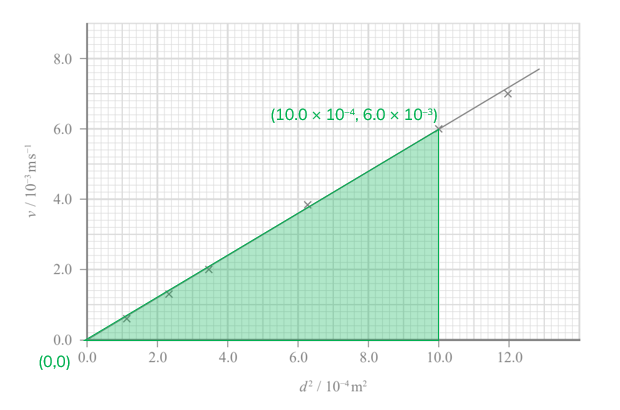

# Mark Schemes — Density, Upthrust & Viscous Drag
**1. Mechanics & Materials** · Edexcel International A Level (IAL) Physics (YPH11)

## Q1 — medium — 9 marks · structured-questions

### 13((a)) — 4 marks
i) Calculate the upthrust exerted on the submarine by the seawater:

List the known quantities:

- Volume of submarine, $V$ = 5.83 × 103 m3
- Density of seawater, $ρ$ = 1.03 × 103 kg m−3
- Acceleration of free fall, *g* = 9.81 m s−2

Since upthrust is equal to the weight, combine the two equations:

- Density:$ρ=\frac{m}{V}$ and weight: $W=mg\Rightarrowm=\frac{W}{g}$
- `rho space equals space fraction numerator open parentheses U over g close parentheses over denominator V end fraction space equals space fraction numerator U over denominator g V end fraction`
- $U=ρgV$ **[1 mark]**

Substitute in known values and calculate upthrust:

- `U space equals space open parentheses 1.03 cross times 10 cubed close parentheses cross times 9.81 cross times open parentheses 5.83 cross times 10 cubed close parentheses`
- Upthrust = 5.89 × 107 N **[1 mark]**

ii) The mass of the submarine must be 6.0 × 106 kg because:

- Weight (of the submarine) is equal to the upthrust; **[1 mark]**

Use a calculation to justify a mass of 6.0 × 106 kg:

**Either** using $W=mg$

- $m=\frac{5.89\times10^{7}}{9.81}$ = 6.0 × 106 kg **[1 mark]**

**OR **using** **$m=ρV$

- `m space equals space open parentheses 1.03 cross times 10 cubed close parentheses cross times open parentheses 5.83 cross times 10 cubed close parentheses`** **= 6.0 × 106 kg** [1 mark]**

**[Total: 4 marks]**

### 13((b)) — 5 marks
i) As the submarine moves into a region of lower density seawater:

- The upthrust (of the water on the submarine) will be <u>less</u> than the weight (of the submarine); **[1 mark]**
- Hence, a resultant force will act downwards on the submarine; **[1 mark]**
- Therefore, the submarine will (begin to) <u>sink</u>; **[1 mark]**

ii) Calculate the required change in mass of water needed to maintain its depth:

List the known quantities:

- Density of new water,$ρ$ = 1.01 × 103 kg m−3
- Volume of submarine, $V$ = 5.83 × 103 m3
- Initial upthrust = 5.89 × 107 N
- Acceleration of free fall, *g* = 9.81 m s−2

Calculate the new upthrust:

- $U=ρgV$
- `U space equals space open parentheses 1.01 cross times 10 cubed close parentheses cross times 9.81 cross times open parentheses 5.83 cross times 10 cubed close parentheses space equals space 5.78 cross times 10 to the power of 7 space straight N` **[1 mark]**

Use the net downward force to calculate the required mass to be lost:

- `F space equals space open parentheses 5.89 cross times 10 to the power of 7 close parentheses minus open parentheses 5.78 cross times 10 to the power of 7 close parentheses space equals space 1.1 cross times 10 to the power of 6 space straight N`
- $m=\frac{W}{g}=\frac{1.1\times10^{6}}{9.81}=1.12\times10^{5}\mathrm{kg}$ **[1 mark]**

**[Total: 5 marks]**

## Q2 — medium — 10 marks · structured-questions

### 15((a)) — 2 marks
The brass cylinder floats because:

**EITHER**

- There is an upthrust which is equal to the weight of water displaced; **[1 mark]**
- The upthrust is equal to the weight of the cylinder (when it’s partially submerged); **[1 mark]**

**OR**

- The (overall) density (of the cylinder) is less than the density of the water; **[1 mark]**
- The weight of water displaced is equal to the weight of the cylinder; **[1 mark]**

**[Total: 2 marks]**

### 15((b)) — 8 marks
List the known quantities:

- Diameter of cylinder = 2.1 cm = 2.1 × 10−2 m
- Length of cylinder, $l$ = 4.0 cm = 4.0 × 10−2 m
- Percentage of cylinder submerged = 63%
- Density of water = 1.0 × 103 kg m−3
- Density of gold = 19.3 × 103 kg m−3
- Density of brass = 8.7 × 103 kg m−3

i) Show that the mass of the cylinder is about 9 × 10−3 kg:

- Volume of brass cylinder:  $V=πr^{2}l$
- `V space equals space straight pi space cross times space open parentheses fraction numerator 2.1 cross times 10 to the power of negative 2 end exponent over denominator 2 end fraction close parentheses squared space cross times space open parentheses 4.0 cross times 10 to the power of negative 2 end exponent close parentheses space equals space 1.39 cross times 10 to the power of negative 5 end exponent space straight m cubed` **[1 mark]**
- Volume that is submerged: `V subscript s u b end subscript space equals space 0.63 space cross times space open parentheses 1.39 cross times 10 to the power of negative 5 end exponent close parentheses space equals space 8.76 cross times 10 to the power of negative 6 end exponent space straight m cubed` **[1 mark]**

Calculate the mass of the cylinder:

- Mass of cylinder = mass of water displaced
- $ρ=\frac{m}{V}\Rightarrowm=ρV$
- Mass of water displaced:  `m space equals space open parentheses 1 cross times 10 cubed close parentheses space cross times space open parentheses 8.76 cross times 10 to the power of negative 6 end exponent close parentheses space`**[1 mark]**
- Mass of cylinder:  $m=8.76\times10^{-3}\mathrm{kg}$ **[1 mark]**

ii) Deduce whether an identical hollow cylinder made of gold would also float:

- Volume of gold = volume of brass
- Volume of brass that floats:  $V=\frac{m}{ρ}=\frac{8.76\times10^{-3}}{8.7\times10^{3}}$
- Same volume of gold:  $V=1.01\times10^{-6}m^{3}$** [1 mark]**

Calculate the volume of water required to float the gold cylinder:

- Mass of gold cylinder:  $m=ρV$
- Mass of gold cylinder:  `m space equals space open parentheses 1.01 cross times 10 to the power of negative 6 end exponent close parentheses space cross times space open parentheses 19.3 cross times 10 cubed close parentheses space equals space 0.0194 space kg` **[1 mark]**
- Minimum volume of water required to float cylinder:  $V=\frac{m}{ρ}$
- $V=\frac{0.0194}{1.00\times10^{3}}=1.94\times10^{-5}m^{3}$ **[1 mark]**

State a conclusion backed up by calculated values:

- Minimum volume of water required to float cylinder = $1.94\times10^{-5}m^{3}$
- Volume of gold cylinder = $1.39\times10^{-5}m^{3}$

  - $1.94\times10^{-5}m^{3}>1.39\times10^{-5}m^{3}$, therefore the gold cylinder would sink; **[1 mark]**

**OR**

- Maximum mass (or weight) of water that could be displaced = 0.014 kg (0.14 N)
- Mass of the gold cylinder (or weight) = 0.019 kg (0.19 N)

  - 0.019 kg  > 0.014 kg **or** 0.19 N > 0.14 N, therefore the gold cylinder would sink; **[1 mark]**

**[Total: 8 marks]**

## Q3 — medium — 15 marks · structured-questions

### 18((a)) — 2 marks
Explain what is meant by terminal velocity:

- The constant maximum velocity reached by an object falling (through a fluid); **[1 mark]**
- When the resultant force equals zero **OR** when the drag plus the upthrust is equal to the weight; **[1 mark]**

**[2 marks]**

### 18((b)) — 5 marks
Show that the drag force on this sphere is about 0.2 N:

List the known quantities:

- Diameter of the sphere = 35 mm = 35 × 10−3 m
- Density of glass *ρ*g = 2.52 × 103 kg m−3
- Density of liquid *ρ*s = 1.43 × 103 kg m−3
- Acceleration of free fall, *g* = 9.81 m s−2

Calculate the volume of the sphere:

- `V equals 4 over 3 pi r cubed equals 4 over 3 pi cross times open parentheses fraction numerator 35 cross times 10 to the power of negative 3 end exponent over denominator 2 end fraction close parentheses cubed equals 2.24 cross times 10 to the power of negative 5 end exponent space straight m cubed` **[1 mark]**

Calculate the upthrust, $U$:

- Upthrust, $U$= weight of fluid displaced
- `U equals V rho subscript straight s g equals open parentheses 2.24 cross times 10 to the power of negative 5 end exponent close parentheses cross times open parentheses 1.43 cross times 10 cubed close parentheses cross times 9.81 equals 0.314 space straight N` **[1 mark]**

Calculate the weight of the glass ball, $W$:

- `W equals V rho subscript g g equals open parentheses 2.24 cross times 10 to the power of negative 5 end exponent close parentheses cross times open parentheses 2.52 cross times 10 cubed close parentheses cross times 9.81 equals 0.554 space straight N` **[1 mark]**

Calculate drag force, $D$:

- $D=W-U=0.554-0.314$ **[1 mark]**
- Drag force = 0.24 N **[1 mark]**

**[Total: 5 marks]**

- *You must remember the equation for the volume of a **sphere **(and other basic 3D objects such as cylinders and cubes) *

  - *You will not be given this equation in the exam*
- *Upthrust will always be relevant when objects are moving through **fluids*
- *It helps to draw a small force diagram to explain why **D** = **W** – **U*

### 18((c)) — 8 marks
i) Deduce from the graph whether the flow of liquid around the spheres was laminar:

- All data points are close to the straight line through origin **OR** best fit straight line goes through origin; **[1 mark]**

- This is consistent with Stokes’ Law; **[1 mark]**
- Stokes’ Law implies laminar flow (for the spheres); **[1 mark]**

ii) Determine a value for *k* using the student’s graph:

Find the gradient of the graph:

- Use of a large triangle; **[1 mark]**
- $k=\frac{v}{d^{2}}=gradient=\frac{6.0\times10^{-3}}{10.0\times10^{-4}}$ **[1 mark]**
- $k=6.0m^{-1}s^{-1}$ **[1 mark]**

iii) Determine a value for *η*:

List the known quantities:

- Density of glass *ρ*g = 2.52 × 103 kg m−3
- Density of liquid *ρ*s = 1.43 × 103 kg m−3
- Acceleration of free fall, *g* = 9.81 m s−2

Calculate *η:*

- `k equals fraction numerator open parentheses rho subscript g minus rho subscript s close parentheses g over denominator 18 eta end fraction`
- `eta equals fraction numerator open parentheses rho subscript g minus rho subscript s close parentheses g over denominator 18 k end fraction equals fraction numerator open parentheses open parentheses 2.52 cross times 10 cubed close parentheses minus 1.43 cross times 10 cubed close parentheses cross times 9.81 over denominator 18 cross times 6.0 end fraction` **[1 mark]**
- *η *= 99.0 Pa s **[1 mark]**

**[Total: 8 marks]**

- *A 'large' triangle means using **more than half** of the graph to calculate the gradient - this is very important for the mark, even if you got the correct value!*

## Q4 — medium — 11 marks · structured-questions

### 17((a)) — 2 marks
For Stoke's law to be valid, the following conditions must apply:

Any **two** from:

- The object must be small / spherical; **[1 mark]**
- It must have a low speed / velocity (through the fluid); **[1 mark]**
- The flow must be laminar / not turbulent;** ****[1 mark]**

**[Total: 2 marks]**

### 17((b)) — 5 marks
List the known quantities:

- Applied horizontal force = 2.3 × 10−5 N
- Radius of sphere, $r$ = $\frac{1}{2}$ × 4.5 × 10−3 m = 2.25 × 10−3 m
- Viscosity of liquid, $η$ = 7.1 × 10−2 Pa s
- Speed of the sphere, $v$ = 5.2 × 10−3 m s−1

i) Use Stoke's law to determine the resultant horizontal force on the sphere:

- Drag force:  $F=6πηrv$
- $F$ = 6π × (7.1 × 10−2) × (2.25 × 10−3) × (5.2 × 10−3)
- $F$ = 1.57 × 10−5 N **[1 mark]**

Find the difference between the forces to find the resultant force:

- Resultant force = applied horizontal force − drag force
- Resultant force = (2.3 × 10−5) − (1.57 × 10−5) **[1 mark]**
- Resultant force = 7.3 × 10−6 N **[1 mark]**

ii) Calculate the maximum speed of the sphere in the horizontal direction:

- At the maximum (terminal) horizontal speed:

  - Resultant horizontal force = 0 N (because forces balance at terminal speed)
  - Drag force, $F$ = 2.3 × 10−5 N (equal and opposite to the applied horizontal force)
- $F=6πηrv$
- $v=\frac{F}{6πηr}$
- `v space equals space fraction numerator 2.3 cross times 10 to the power of negative 5 end exponent over denominator 6 straight pi cross times open parentheses 7.1 cross times 10 to the power of negative 2 end exponent close parentheses cross times open parentheses 2.25 cross times 10 to the power of negative 3 end exponent close parentheses end fraction` **[1 mark]**
- $v$ = 7.64 × 10−3 m s−1 **[1 mark]**

**[Total: 5 marks]**

### 17((c)) — 4 marks
A larger diameter and lower temperature will have the following effect on the maximum speed:

- A larger diameter means a larger drag force (at a given speed) **or** a larger diameter means a lower speed (for the same constant force); **[1 mark]**
- A lower temperature means viscosity will be greater; **[1 mark]**
- A greater viscosity means a larger drag force (at a given speed) **or** a greater viscosity means a lower speed (for the same constant force); **[1 mark]**
- (Hence) the maximum speed (of the sphere) will decrease; **[1 mark]**

**[Total: 4 marks]**

- *With questions like this, it can be helpful to write down the equation and go through each variable one by one and consider the effect on each*

## Q5 — medium — 9 marks · structured-questions

### 1() — 2 marks
> **[mark-scheme]**
> Measuring instrument — any **one** from:
> 
> - Micrometer
> - Vernier callipers
> - Digital callipers
> - Travelling microscope
> 
> **[1 mark]**
> 
> Method:
> 
> - Measure the diameter (of the sphere) in different places **AND** calculate the mean and divide by 2 **[1 mark]**

> **[exam-tip]**
> Make sure you refer to measuring the diameter (not the radius directly), since you cannot easily measure the radius of a sphere. Many students lose marks by not mentioning repeated measurements at different places. This is important because the sphere may not be perfectly spherical.

### 2() — 2 marks
> **[mark-scheme]**
> Method** **—** **any **one** from:
> 
> - Ensure the velocity is low
> - Use a sphere with a small radius
> - Use a wide cylinder
> 
> **[1 mark]**
> 
> Reason:
> 
> - To prevent turbulence / to ensure laminar flow **[1 mark]**

> **[exam-tip]**
> Stokes' law only applies under conditions of laminar (streamlined) flow. Make sure you state both a practical method to achieve this and the underlying reason — simply stating a method without explaining why it helps will only earn one mark. A common mistake is to describe what Stokes' law is rather than how to ensure it applies.

### 3() — 5 marks
> **[mark-scheme]**
> Criticism of the investigation — max **three** from:
> 
> - The time intervals (0.14–0.35 s) are too short to be measured by a stopwatch **OR** reaction time likely to be significant / give a large percentage uncertainty
> - Only one timing is taken at each temperature (so anomalies and random error cannot be assessed)
> - The first rubber band is too near the top of the cylinder (so the sphere won’t be at its terminal velocity)
> - Oil density is given only at 20 °C, but used at all temperatures, so $η$ has a systematic error at 10 °C and 40 °C (since oil density changes with temperature)
> - There is no method for checking the oil remains at a constant temperature (during the fall)
> - There is no method for checking that the ball is at terminal velocity (during the fall)
> 
> **[3 marks]**
> 
> Accept statements for how the procedure could be improved, consistent with the above marking points, e.g.
> 
> - they should have recorded the fall using a video camera, or timed the fall with light gates / a data logger
> - timings should have been repeated and a mean calculated
> - there should be at least three rubber bands for timing
> - they should have used values for oil density at 10 °C and 40 °C, not just 20 °C
> - they could have used a thermostatic water bath to maintain a constant temperature
> - they could have videoed the fall to check if the sphere reached terminal velocity
> 
> Criticism of the conclusion — max **two** from:
> 
> - More data points are needed / three data points are too few to confirm a linear relationship
> - The student's data is not linear / the gradient between successive points is not constant (the 20 °C point lies below the line joining the 10 °C and 40 °C points)
> - The temperature range (10–40 °C) is too narrow **OR** the points are unevenly spaced
> - The student's conclusion is not justified; more points over a wider range, with repeats, are needed
> 
> **[2 marks]**

> **[exam-tip]**
> "Criticise" means you should look for faults, not give a re-description of the method. The "conclusion" tells you to judge the claim itself, not just the apparatus. Aim for one fault in the experiment and one in the reasoning, then commit to a verdict; the verdict is the mark most often dropped. Treat very short timings as a red flag — if the reaction time is a big fraction of the measured time, that reading is unreliable. And never trust "linear" from three points: check whether the middle point actually sits on the line joining the outer two before you accept the trend.

## Q6 — hard — 11 marks · structured-questions

### 17((a)) — 2 marks
i) State what is meant by laminar flow:

- The layers of fluid flow past each other without mixing; **OR**
- <u>Velocity</u> at a fixed point (relative to the drop) remains constant; **[1 mark]**

ii) State the condition necessary for the speed of the droplet to be constant:

- Resultant force is zero; **[1 mark]**

**[Total: 2 marks]**

- *It was possible to gain a mark in (ii) by stating that *$W-U=D$

### 17((b)) — 9 marks
i) Calculate the weight of the droplet:

List the known quantities:

- Droplet volume, $V$ = 3.35 × 10–8 m3
- Density of water, $ρ$ = 1.00 × 103 kg m–3
- Acceleration of free fall, $g$ = 9.81 m s-2

Use the density equation to calculate the droplet's mass:

- $ρ=\frac{m}{V}$
- `m space equals space rho V space equals space open parentheses 1.00 space cross times space 10 cubed close parentheses space cross times space open parentheses 3.35 space cross times space 10 to the power of negative 8 end exponent close parentheses` **[1 mark]**
- $m=3.35\times10^{-5}\mathrm{kg}$

Use the equation relating mass and weight to calculate weight:

- `W space equals space m g space equals space open parentheses 3.35 space cross times space 10 to the power of negative 5 end exponent close parentheses space cross times space 9.81` **[1 mark]**
- $W=3.29\times10^{-4}N$
- $\mathrm{weight}=3.3\times10^{-4}N$ (2 s.f.) **[1 mark]**

**   **

ii) Show that the upthrust on the water droplet when it’s completely submerged in oil is about 3 × 10–4 N:

List the known quantities:

- Density of oil, $ρ_{oil}$ =  0.94 × 103 kg m–3

Determine the mass of oil displaced:

- `m space equals space rho subscript o i l end subscript V space equals space open parentheses 0.94 space cross times space 10 cubed close parentheses space cross times space open parentheses 3.35 space cross times space 10 to the power of negative 8 end exponent close parentheses`
- $m=3.15\times10^{-5}\mathrm{kg}$

Apply archimedes' principle to find upthrust:

- Upthrust = weight of fluid displaced
- `U space equals space m g space equals space open parentheses 3.15 space cross times space 10 to the power of negative 5 end exponent close parentheses space cross times space 9.81` **[1 mark]**
- $U=3.09\times10^{-4}N$
- $\mathrm{upthrust}=3.1\times10^{-4}N$ (2 s.f.) **[1 mark]**

**   **

iii) Calculate the terminal velocity of this water droplet in the oil:

List the known quantities:

- Viscosity of oil, $η$ = 0.11 Pa s
- Upthrust, $U$ = 3.09 × 10-4 N
- Weight of water droplet, $W$ = 3.29 × 10-4 N
- Droplet volume, $V$ = 3.35 × 10–8 m3

Apply Newton's first law to determine viscous force, $F$:

- At terminal velocity, resultant force is zero
- $W=U+F$
- `F space equals space W space minus space U space equals space open parentheses 3.29 space cross times space 10 to the power of negative 4 end exponent close parentheses space minus space open parentheses 3.09 space cross times space 10 to the power of negative 4 end exponent close parentheses` **[1 mark]**
- $F=2.0\times10^{-5}N$

Use the droplet's volume to calculate its radius:

- $V=\frac{4}{3}πr^{3}$
- `r space equals space cube root of fraction numerator 3 V over denominator 4 straight pi end fraction end root space equals space cube root of fraction numerator 3 space cross times space open parentheses 3.35 space cross times space 10 to the power of negative 8 end exponent close parentheses over denominator 4 straight pi end fraction end root` **[1 mark]**
- $r=2.0\times10^{-3}m$

Use Stokes' law to determine terminal velocity:

- $F=6πηrv$
- `v space equals space fraction numerator F over denominator 6 straight pi eta r end fraction space equals space fraction numerator 2.0 space cross times space 10 to the power of negative 5 end exponent over denominator 6 pi space cross times space 0.11 space cross times space open parentheses 2.0 space cross times space 10 to the power of negative 3 end exponent close parentheses end fraction` **[1 mark]**
- $v=4.82\times10^{-3}ms^{-1}$
- $\mathrm{Terminal} \mathrm{velocity}=4.8\times10^{-3}ms^{-1}$ **[1 mark]**

**[Total: 9 marks]**

- *Stokes' law can be applied to a range of different velocities and viscous drag forces*

  - *What makes **v** the **terminal** velocity in this question is that we are equating all upwards and downwards forces on the droplet*
  - *This **only** occurs at **terminal** **velocity **when an object is falling through a fluid*
- *Questions like this use a lot of fractions and standard form - it's easy to make mistakes so double check your answers by putting it all through your calculator a **second** **time**!*

## Q7 — medium — 1 marks · multiple-choice-questions

### 9() — 1 marks
**Correct answer: A** — spherical objects and laminar flow

**Final answer:** **The correct answer is ****A**** because:**

- The four conditions for Stokes' Law are:

  - The **flow** is **laminar**
  - The **object** is small and **spherical** (this rules out options **C** and **D**)
  - Motion between the sphere and the fluid is at a slow speed
- Stokes' Law can therefore be used for a range of viscosities

  - This rules out option **B**

## Q8 — medium — 1 marks · multiple-choice-questions

### 2() — 1 marks
**Correct answer: C** — $\frac{35.0}{9.81\times1.32\times10^{-3}}$

**Final answer:** **The correct answer is ****C**** because:**

- The equation for density is:

  - $p=\frac{m}{V}$
- The equation for weight is:

  - $W=mg$
- Combining these gives:

  - `p equals fraction numerator open parentheses W over g close parentheses over denominator V end fraction equals fraction numerator W over denominator g V end fraction`
- Substituting in the values gives:

  - $p=\frac{35.0}{9.81\times1.32\times10^{-3}}$
- This is answer **C**
