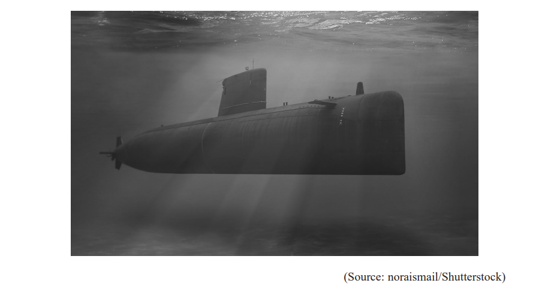
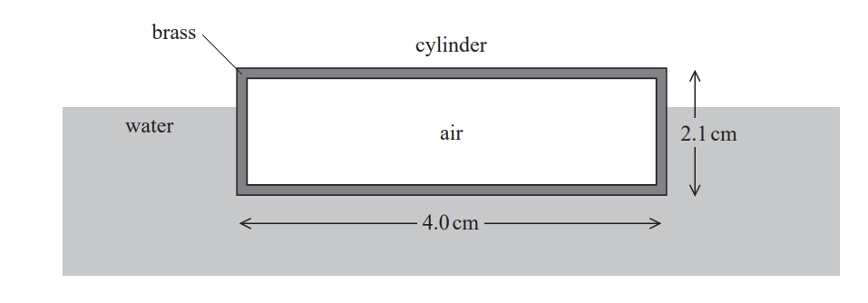
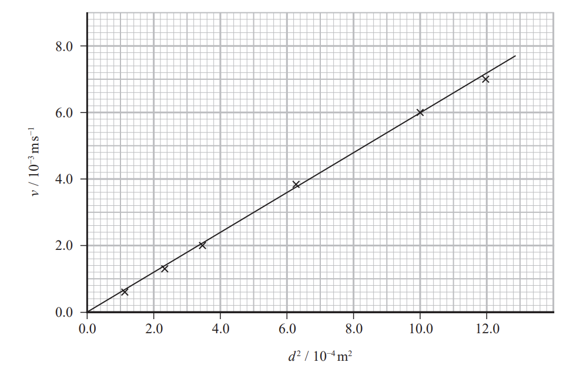
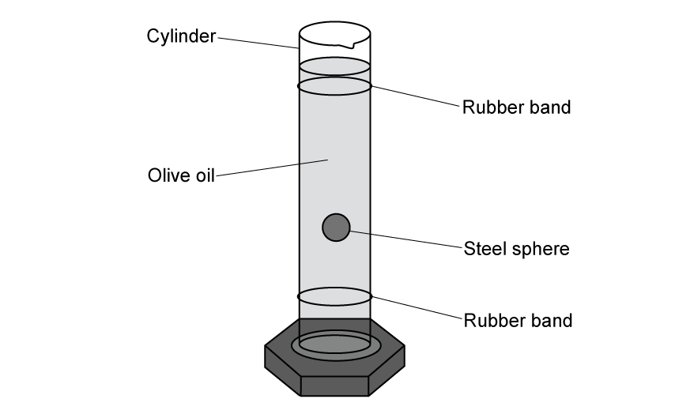

# Exam Questions — Density, Upthrust & Viscous Drag
**1. Mechanics & Materials** · Edexcel International A Level (IAL) Physics (YPH11)
> Source: [https://www.savemyexams.com/international-a-level/physics/edexcel/19/topic-questions/1-mechanics-and-materials/density-upthrust-and-viscous-drag/structured-questions/](https://www.savemyexams.com/international-a-level/physics/edexcel/19/topic-questions/1-mechanics-and-materials/density-upthrust-and-viscous-drag/structured-questions/) · 8 questions · total 67 marks

## Q1 — medium — 9 marks · structured-questions

### 13((a)) — 4 marks — command: multiple — structured — from paper 2021 June · WPH11/01
The photograph shows a submarine below the surface of the sea.

The submarine has a volume of 5.83 × 103 m3 . The submarine is stationary in a region of the sea where the density of the seawater is 1.03 × 103 kg m−3 .

i) Calculate the upthrust exerted on the submarine by the seawater.

Upthrust = ...............................**(2)**

ii) Explain why the mass of the submarine must be 6.0 × 106 kg.

**(2)**

### 13((b)) — 5 marks — command: multiple — structured — from paper 2021 June · WPH11/01
The submarine now moves into a region of the sea where the water is less salty, and the density of the water reduces to 1.01 × 103 kg m−3 .

i) Explain what would happen to the submarine as it moves into this region of lower density seawater.

**(3)**

ii) The submarine alters its weight by pumping water in or out of its internal tanks.

Determine the mass of water that the submarine should pump, in or out of its tanks, to maintain its depth below the surface of the sea.

Mass of water = ...............................**(2)**

## Q2 — medium — 10 marks · structured-questions

### 15((a)) — 2 marks — command: explain — structured — from paper 2022 Jan · WPH11/01
A hollow brass cylinder with closed ends is floating on the surface of water.

The cylinder has a length of 4.0 cm and an external diameter of 2.1 cm as shown.

63% of the volume of the cylinder is submerged. The cylinder contains negligible weight of air.

Explain why the brass cylinder floats.

### 15((b)) — 8 marks — command: multiple — structured — from paper 2022 Jan · WPH11/01
The density of water is 1.0 × 103 kg m−3

i) Show that the mass of the cylinder is about 9 × 10−3 kg.

**(4)**

ii) Deduce whether an identical hollow cylinder made of gold would also float.

Assume that the volume of gold is the same as the volume of brass.

density of gold = 19.3 × 103 kg m−3

density of brass = 8.7 × 103 kg m−3

**(4)**

## Q3 — medium — 15 marks · structured-questions

### 18((a)) — 2 marks — command: explain — structured — from paper 2021 June · WPH11/01
A student carried out an experiment to determine the viscosity of a liquid. He measured the terminal velocities *v* of several different glass spheres of diameter *d*, as they fell through the liquid.

The student used his measurements to plot the graph of *v* against *d*2 shown below.

Explain what is meant by terminal velocity.

### 18((b)) — 5 marks — command: show — structured — from paper 2021 June · WPH11/01
A glass sphere of diameter 35 mm is travelling through the fluid at terminal velocity.

Show that the drag force on this sphere is about 0.2 N.

density of glass *ρ*g = 2.52 × 103 kg m−3 

density of liquid *ρ*s = 1.43 × 103 kg m−3

### 18((c)) — 8 marks — command: multiple — structured — from paper 2021 June · WPH11/01
The student reads in a textbook that if Stokes’ law is obeyed

$v=kd^{2}$

where *k* is a constant.

i) Deduce from the graph whether the flow of liquid around the spheres was laminar.

**(3)**

ii) Determine a value for *k* using the student’s graph.

*k* = .............................**(3)**

iii) The constant *k* is given by

`k equals fraction numerator open parentheses rho subscript g minus rho subscript s close parentheses g over denominator 18 eta end fraction`

where *η* is the viscosity of the liquid.

Determine a value for *η*.

density of glass *ρ*g = 2.52 × 103 kg m−3 

density of liquid *ρ*s = 1.43 × 103 kg m−3

*η* = ...........................**(2)**

## Q4 — medium — 11 marks · structured-questions

### 17((a)) — 2 marks — command: state — structured — from paper 2022 Jan · WPH11/01
A small sphere is moving horizontally through a viscous liquid.

Stokes' law can be used to calculate the drag force on an object.

State the conditions that must apply for Stokes' law to be valid.

### 17((b)) — 5 marks — command: calculate — structured — from paper 2022 Jan · WPH11/01
There is a constant force of 2.3 × 10−5 N acting horizontally on the sphere.

diameter of sphere = 4.5 × 10−3 m

viscosity of liquid = 7.1 × 10−2 Pa s

i) At one instant, the speed of the sphere is 5.2 × 10−3 m s−1.

Calculate the resultant horizontal force on the sphere.

Resultant horizontal force = .................................**(3)**

ii) Calculate the maximum speed of the sphere in the horizontal direction.

Maximum horizontal speed = .............................**(2)**

### 17((c)) — 4 marks — command: explain — structured — from paper 2022 Jan · WPH11/01
A larger diameter sphere in the same liquid is acted upon by the same constant force as in (b). The liquid is at a lower temperature.

Explain the effect these changes have on the maximum speed of this sphere.

## Q5 — medium — 9 marks · structured-questions

### 1() — 2 marks — command: describe — structured
A student investigated the viscosity of olive oil at different temperatures using a steel sphere of radius $r$.

Describe how the student can make measurements of the steel sphere to determine its radius accurately.

### 2() — 2 marks — command: explain — structured
Explain how the student can ensure that Stokes' law will apply to the steel sphere as it falls through the olive oil.

### 3() — 5 marks — command: evaluate — structured
The student dropped the steel sphere into a tall cylinder of olive oil, as shown, and timed the sphere as it fell through the oil at terminal velocity.

The student placed two rubber bands around the cylinder and started a stopwatch when the sphere passed the first band and stopped it when the sphere passed the second band.

The student recorded the time $t$ for the ball to fall through a distance of $21.0\text{cm}$ and repeated this for three different temperatures. They calculated the viscosity $η$ at each temperature using the formula

`eta space equals space fraction numerator 2 r squared g open parentheses rho subscript s minus space rho subscript o close parentheses over denominator 9 v end fraction`

radius of steel sphere  $r=2.2\text{mm}$
density of steel  $ρ_{s} = 7800 \text{kg m}^{-3}$ 
density of olive oil at 20 °C  $ρ_{o} = 920 \text{kg m}^{-3}$

Their results are shown in the table.

| Temperature $T$ / °C | Time $t$ / s |
|---|---|
| 10 | 0.35 |
| 20 | 0.26 |
| 40 | 0.14 |

The student concluded that the viscosity of olive oil decreases linearly with temperature.

Criticise the student's investigation and conclusion.

## Q6 — hard — 11 marks · structured-questions

### 17((a)) — 2 marks — command: state — structured — from paper Oct/Nov 2021 · WPH11/01
Water is dropped into a container of oil. The water forms small spherical droplets that move slowly downwards.

A droplet moves downwards at a constant speed. The flow of oil around the droplet is laminar.

i) State what is meant by laminar flow.

**(1)**

ii) State the condition necessary for the speed of the droplet to be constant.

**(1)**

### 17((b)) — 9 marks — command: multiple — structured — from paper Oct/Nov 2021 · WPH11/01
A spherical droplet has a volume of 3.35 × 10–8 m3.

i) Calculate the weight of the droplet.

density of water = 1.00 × 103 kg m–3

Weight of droplet = ........................................**(3) **

ii) Show that the upthrust on the water droplet when it’s completely submerged in oil is about 3 × 10–4 N.

density of oil = 0.94 × 103 kg m–3

**(2)**

iii) Calculate the terminal velocity of this water droplet in the oil.

viscosity of oil = 0.11 Pa s ** **

Terminal velocity = ..........................................**(4)**

## Q7 — medium — 1 marks · multiple-choice-questions

### 9() — 1 mark — multiple_choice — from paper Oct/Nov 2021 · WPH11/01
A student measured the terminal velocity of different objects as they fell through a liquid. The student used the measurements and Stokes’ Law to calculate the viscosity of the liquid.

For which of the following conditions does Stokes’ Law apply?
- **A.** spherical objects and laminar flow
- **B.** spherical objects and low viscosity
- **C.** cylindrical objects and laminar flow
- **D.** cylindrical objects and low viscosity

## Q8 — medium — 1 marks · multiple-choice-questions

### 2() — 1 mark — multiple_choice — from paper 2021 June · WPH11/01
A cylinder of aluminium has a weight of 35.0 N and a volume of 1.32 × 10−3 m3 .

Which of the following calculations gives the density of aluminium in kg m−3 ?
- **A.** $\frac{9.81\times1.32\times10^{-3}}{35.0}$
- **B.** $\frac{1.32\times10^{-3}}{35.0\times9.81}$
- **C.** $\frac{35.0}{9.81\times1.32\times10^{-3}}$
- **D.** $\frac{35.0\times9.81}{1.32\times10^{-3}}$
