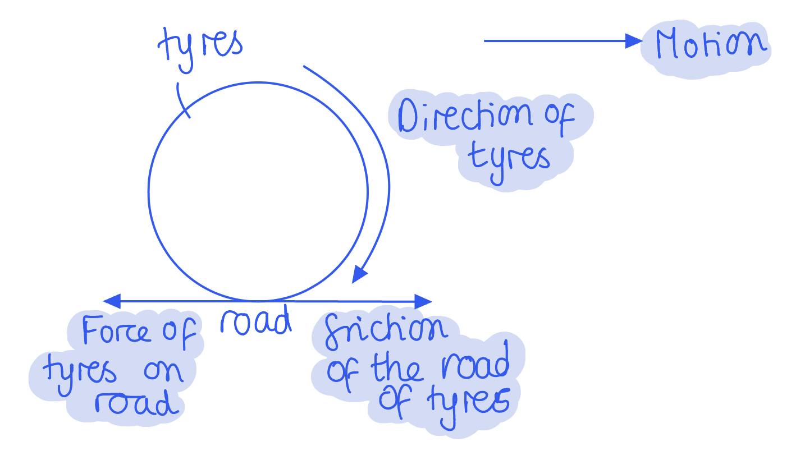

# Mark Schemes — Forces & Momentum
**1. Mechanics & Materials** · Edexcel International A Level (IAL) Physics (YPH11)

## Q1 — medium — 5 marks · structured-questions

### 12((a)) — 2 marks
State the principle of conservation of momentum:

Compare the system before and after an event:

- The total momentum before (a collision) = the total momentum after (a collision); **[1 mark]** **OR**
- Total momentum remains constant; **[1 mark]**

Describe the system:

- Provided no external / unbalanced / resultant force acts (on the system); **OR**
- In a closed / isolated system; **[1 mark]**

**[Total: 2 marks]**

- *Both variations of these definitions mean the same thing - choose one which makes the most sense for you and memorise it.*

  - *There will always be a number of ways of saying each point, but the key words are "the same" or "conserved" when referring to momentum before and after and "closed" when referring to the system.*

### 12((b)) — 3 marks
Calculate the velocity $v$ of the aluminium sphere immediately after the collision:

List the known quantities:

- Mass of aluminium sphere, $m_{a}$ = 2.7 kg
- Mass of steel sphere, $m_{s}$ = 7.9 kg
- Initial velocity of aluminium sphere, $u_{a}$ = 10.0 m s–1 
- Initial velocity of steel sphere, $u_{s}$ = 0 m s–1 
- Final velocity of steel sphere, $v_{s}$ = 5.0 m s–1 

Substitute known values to determine the total initial momentum:

- `p subscript i space equals space m subscript a u subscript a space plus space m subscript s u subscript s space equals space open parentheses 2.7 space cross times space 10.0 close parentheses space plus space 0` **[1 mark]**
- $p_{i}=27\mathrm{kg}ms^{-1}$

Use conservation of momentum:

- total initial momentum = total final momentum
- $p_{i}=p_{f}=27\mathrm{kg}ms^{-1}$ **[1 mark]**

Calculate the final velocity of the aluminium sphere:

- $p_{f}=m_{a}v+m_{s}v_{s}$
- `v space equals space fraction numerator p subscript f space minus space m subscript s v subscript s over denominator m subscript a end fraction space equals space fraction numerator 27 space minus space open parentheses 7.9 space cross times space 5.0 close parentheses over denominator 2.7 end fraction space equals space minus 4.63 space straight m space straight s to the power of negative 1 end exponent`
- $v=-4.6ms^{-1}$ **[1 mark]**

**[Total: 3 marks]**

- *The negative sign is necessary for the final answer*

  - *This tells us that the aluminium sphere **changes** direction*
- *Remember to show your working - the first mark is for **substitution**, not just stating the equation!*

## Q2 — medium — 7 marks · structured-questions

### 11((a)) — 2 marks
The principle of conservation of linear momentum states that:

- The momentum <u>of a system</u> remains constant **OR** total momentum before (a collision) = total momentum after (a collision); **[1 mark]**
- Provided that there are no external / resultant forces acting; **[1 mark]**

**[Total: 2 marks]**

- *Examiners reported that it was common for students to miss the last marking point from their answers - don't make the same mistake!*

### 11((b)) — 5 marks
List the known quantities:

- Initial velocity of asteroid A, $u_{A}$ = 2.19 × 103 m s−1 
- Momentum of asteroid A,$p_{A}$ = 1.80 × 1017 kg m s−1
- Mass of asteroid B, $m_{B}$ = 5.90 × 1012 kg
- Initial velocity of asteroid B, $u_{B}$ = 15.0 × 103 m s−1 

i) Show that the mass of asteroid A was about 8.2 × 1013 kg:

- Momentum: $p=mv\Rightarrowm=\frac{p}{v}$
- $m=\frac{1.80\times10^{17}}{2.19\times10^{3}}=8.219\times10^{13}\mathrm{kg}$ **[1 mark]**
- `m space equals space 8.22 cross times 10 to the power of 13 space kg space open parentheses 3 space straight s. straight f. close parentheses` **[1 mark]**

** **

ii) Calculate the velocity of the asteroids after the collision:

- After the collision, asteroid B is absorbed by asteroid A, so the asteroids have a combined mass
- Therefore,`space p subscript b e f o r e end subscript space equals space p subscript a f t e r end subscript space space space space rightwards double arrow space space space space p subscript A space plus space m subscript B u subscript B space equals space open parentheses m subscript A plus space m subscript B space end subscript close parentheses v` **[1 mark]**
- Making $v$ the subject:  $v=\frac{p_{A}+m_{B}u_{B}}{m_{AB}}$

- `v space equals space fraction numerator open parentheses 1.80 cross times 10 to the power of 17 close parentheses space plus space open square brackets open parentheses 5.90 cross times 10 to the power of 12 close parentheses space cross times space open parentheses 15.0 cross times 10 cubed close parentheses close square brackets space over denominator open parentheses 8.219 cross times 10 to the power of 13 close parentheses space plus space open parentheses 5.90 cross times 10 to the power of 12 close parentheses end fraction` **[1 mark]**
- `v space equals space 3.05 cross times 10 cubed space straight m space straight s to the power of negative 1 end exponent space open parentheses 3 space straight s. straight f. close parentheses` **[1 mark]**

**[Total: 5 marks]**

- *Remember to use the unrounded calculated value for the mass of asteroid A*
- *You should always work with more sig figs than you need during your calculation and then round at the end to avoid a cumulative rounding error*

## Q3 — medium — 6 marks · structured-questions

### 11((a)) — 2 marks
To show that the total momentum of the carriages immediately after the collision was approximately 4.5 × 105 kg m s−1:

List the known quantities:

- Mass of first carriage = 7.15 × 104 kg
- Mass of second carriage = 5.35 × 104 kg
- Speed of combined carriages after the collision = 3.62 m s−1

Calculate the total mass of the combined carriages:

- `m equals open parentheses 7.15 space cross times space 10 to the power of 4 close parentheses plus space open parentheses 5.35 space cross times space 10 to the power of 4 space close parentheses equals 1.25 cross times 10 to the power of 5 space kg`

Substitute in known values and calculate momentum:

- $p=mv$
- `p equals open parentheses 1.25 cross times 10 to the power of 5 close parentheses cross times 3.62` **[1 mark]**
- $p=4.53\times10^{5}\mathrm{kg}ms^{-1}$ **[1 mark]**

**[Total: 2 marks]**

- *Whenever two objects are combined, remember to add the **sum** of their masses for **m** in the momentum equation*

### 11((b)) — 2 marks
To calculate the velocity of the second carriage before the collision:

List the known quantities:

- Initial velocity of first carriage = 4.50 m s−1
- Mass of first carriage = 7.15 × 104 kg
- Mass of second carriage = 5.35 × 104 kg
- Momentum after the collision = 4.53 × 105 kg m s−1

Apply the principle of conservation of momentum:

- Initial momentum = Final momentum **[1 mark]**

Calculate the initial velocity:

- Initial momentum of first carriage + initial momentum of second carriage = final momentum
- $p_{I1}+p_{I2}=p_{f1+2}$
- `open parentheses open parentheses 7.15 space cross times space 10 to the power of 4 close parentheses cross times space 4.50 close parentheses plus open parentheses open parentheses 5.35 space cross times space 10 to the power of 4 close parentheses cross times v close parentheses equals 4.53 space cross times space 10 to the power of 5`
- Velocity of second carriage = 2.44 m s−1 **[1 mark]**

**[Total: 2 marks]**

- *Make sure you keep track of which masses or velocities you are putting into the equation *
- *If you are stuck on the rearranging of **v**:*

  - `v space equals space fraction numerator open parentheses 4.53 space cross times space 10 to the power of 5 close parentheses space minus space open parentheses open parentheses 7.15 space cross times space 10 to the power of 4 close parentheses cross times space 4.50 close parentheses space over denominator 5.35 space cross times space 10 to the power of 4 end fraction`

### 11((c)) — 2 marks
To calculate the change in total kinetic energy during the collision:

List the known quantities:

- Initial velocity of first carriage = 4.50 m s−1
- Mass of first carriage = 7.15 × 104 kg
- Initial velocity of second carriage = 2.44 m s−1
- Mass of second carriage = 5.35 × 104 kg
- Velocity after the collision = 3.62 m s−1
- Combined mass of the carriages = 1.25 × 105 kg

Calculate the kinetic energy before and after the collision:

- Kinetic energy before the collision = kinetic energy of carriage 1 + kinetic energy of carriage 2
- $E_{k}=\frac{1}{2}mv^{2}$
- `E subscript k minus i n i t i a l end subscript equals open parentheses 1 half cross times open parentheses 7.15 cross times 10 to the power of 4 close parentheses cross times 4.50 squared close parentheses plus open parentheses 1 half cross times open parentheses 5.35 cross times 10 to the power of 4 close parentheses cross times 2.44 squared close parentheses equals 8.84 cross times 10 to the power of 5 space straight J`**AND**
- `E subscript k minus f i n a l end subscript equals open parentheses 1 half cross times open parentheses 1.25 cross times 10 to the power of 5 close parentheses cross times 3.62 squared close parentheses equals 8.19 cross times 10 to the power of 5 space straight J` **[1 mark]**

Calculate the change in total kinetic energy:

- `increment E subscript k equals open parentheses 8.84 cross times 10 to the power of 5 close parentheses minus open parentheses 8.19 cross times 10 to the power of 5 close parentheses equals 6.47 cross times 10 to the power of 4 space straight J` **[1 mark]**

**[Total: 2 marks]**

## Q4 — medium — 6 marks · structured-questions

### 15() — 6 marks
The following list is the 'indicative marking points'. Stating all six will score four marks, fewer than six is marked according to a scale given below. The remaining two marks are given for the linking and explanation:

*Indicative Content (IC):*

1. When the spacecraft is accelerating the astronaut accelerates at the same rate.
2. The seat is applying a forward force to the astronaut so (by N3) the astronaut is applying a backward/opposite force to the seat (which compresses the seat).
3. As the fuel is used up, the mass of the spacecraft decreases.
4. As the mass of the spacecraft decreases the acceleration increases.
5. The force between the seat and the astronaut increases thus further compressing the seat.
6. The seat decompresses (to push the astronaut forwards) when the force (from the rocket motor) becomes zero. **OR** The seat decompresses when the force (from the rocket motor) is removed. **OR** The force from the safety strap decelerates the astronaut.

**An example answer which scores six marks is:**

When the spacecraft is accelerating the astronaut accelerates at the same rate. **[1]**. Due to Newton's third law, **[linkage]** the seat is applying a forward force to the astronaut and the astronaut is applying a backwards force to the seat; this causes compression of the seat **[2]**. As the fuel is used up, the mass of the spacecraft decreases **[3]**, and therefore **[linkage]** the acceleration decreases **[4]**. This causes the force between the seat and the astronaut to further increase, causing even greater compression **[5]**. The seat will decompresses when the force becomes zero **[6]**.

- Six indicative marking points; **[4 marks]**
- Linkage made between forward and backward force **AND** link between reducing spring compression and reducing acceleration; **[2 marks]**

**[Total: 6 marks]**

- *The starred written questions assess your ability to **link** **facts** in a logically **structured** answer.*
- *In the table below, **indicative content (IC) points** are form the list above. The second column shows the **maximum marks** you can earn from these **statements**.*

  - *As you see, **6** correct **statements** are worth a total of **4 marks**.*
- *The third column is for ‘**linkage marks**’. This means how well you linked the statements in your argument. The maximum linkage mark depends on the number of statements. *

  - *Even if you linked well, only **one** linkage mark is available if you only mentioned **4 out of 6** IC points*
- *To score 6/6 marks, you will need a **full** **paragraph**, using a "point, evidence, explain" structure, **as well as** using your Physics to link together at least six points from the content you have learned. *

| > *IC points* | > *IC mark* | > *Maximum linkage marks available* | > *Maximum final mark* |
|---|---|---|---|
| > *6* | > *4* | > *2* | > *6* |
| > *5* | > *3* | > *2* | > *5* |
| > *4* | > *3* | > *1* | > *4* |
| > *3* | > *2* | > *1* | > *3* |
| > *2* | > *2* | > *0* | > *2* |
| > *1* | > *1* | > *0* | > *1* |
| > *0* | > *0* | > *0* | > *0* |

## Q5 — medium — 4 marks · structured-questions

### 12() — 4 marks
The helicopter maintains a constant height because:

- The blades exert a downward force on the air; **[1 mark]**
- The air exerts an equal upwards force on the blades / helicopter **or **by Newton’s 3rd law there is an equal upwards force; **[1 mark]**
- This upwards force equals the weight of the helicopter; **[1 mark]**
- The resultant force is zero, so (by Newton’s 1st or 2nd law) there is no acceleration (and the helicopter maintains a constant height); **[1 mark]**

**[Total: 4 marks]**

- *Very few students got more than two marks when this question was used in the exams*
- *However, applying Newton's Third Law is a common exam question and one you should prepare for*

  - *The ideas are straightforward but expressing them clearly, and using the correct keywords throughout is important, use this guide to help you:*

- *First, name the forces and be specific so it's clear which one you are referring to, for example:*

  - *Downward force, **not **push*
  - *Upwards force, **not** upthrust*

- *Next, identify what the force is exerted by and what it is acting on, for example:*

  - *A downward force is **exerted by** the blades **on** the air*

- *Finally, identify the force paired with the force you just named, for example:*
- *The upwards force is:*

  - *Exerted by** the air **on** the blades*
  - *Equal to the downward force on the air*
  - *Equal to the weight of the helicopter*

- *Always link Newton's Laws, naming the relevant one each time.*

## Q6 — hard — 6 marks · structured-questions

### 14() — 6 marks
A student of weight 600 N is standing on weighing scales in a lift, the lift moves upwards at constant velocity, then decelerates to rest. Explain the readings on the scales as the lift moves:

The following list is the 'indicative marking points'. Stating all six will score **four marks**, less than six is marked according to the scale given below (in blue). The remaining **two marks** are given for the linking and explanation:

Indicative Content (IC):

1. The force of the lift / scales on the student is the reading on the scales OR the reaction / contact force is the reading on the scales
2. At a constant speed, the resultant force on the student is zero OR weight = reaction force
3. At a a constant speed / at rest the reading on the scales would be 600 N
4. As the lift decelerates, the reaction force is less than weight
5. As the lift decelerates, there is a resultant downward force on the student
6. As the lift decelerates, the reading on the scales will be less than 600 N (because the upward force on the student is less than his weight)

**An example of an answer which would score 6 marks is:**

When the student enters the lift and stands on the scales, the lift is at rest and the scales will read 600 N **[3]** because the scales read **[linkage]**** **the normal contact force of the floor of the lift on the student **[1]**. At this point, the forces are balanced **[linkage]** and weight = normal contact force. The weight (*W = mg*) of the student will not change because neither the mass of the student nor the gravitational field strength will change whilst the student is in the lift.

As the lift moves upward at a constant velocity, there is still **[linkage]** no resultant force acting on the student** ****[2]**** **and so the scales would still read 600 N **[3]**.

As the lift decelerates, there is then a resultant force acting on the student in a downward direction **[5]** because **[linkage]** the upward acting reaction force will be less than the downward acting weight **[4]** and therefore **[linkage]** the scales will show a reading of less than 600 N **[6]**.

- Six indicative marking points; **[4 marks]**
- Linkage must be made between the normal contact force of the lift on the student and the reading on the scales, **AND** between acceleration and resultant force; **[2 marks]**

**[Total: 6 marks]**

- *The starred written questions assess your ability to **link** **facts** in a logically **structured** answer.*
- *In the table below, **indicative content (IC) points** are from the list above. The second column shows the **maximum marks** you can earn from these **statements**.*

  - *As you see, **6** correct **statements** are worth a total of **4 marks*

- *The third column is for ‘**linkage marks**’. This means how well you linked the statements in your argument. The maximum linkage mark depends on the number of statements. *

  - *Even if you linked well, only **one** linkage mark is available if you only mentioned **4 out of 6** IC points*

- *To score 6/6 marks, you will need a **full** **paragraph**, using a "point, evidence, explain" structure, **as well as** using your Physics to link together at least six points from the content you have learned. *

| > *IC points* | > *IC mark* | > *Maximum linkage marks available* | > *Maximum final mark* |
|---|---|---|---|
| > *6* | > *4* | > *2* | > *6* |
| > *5* | > *3* | > *2* | > *5* |
| > *4* | > *3* | > *1* | > *4* |
| > *3* | > *2* | > *1* | > *3* |
| > *2* | > *2* | > *0* | > *2* |
| > *1* | > *1* | > *0* | > *1* |
| > *0* | > *0* | > *0* | > *0* |

## Q7 — medium — 1 marks · multiple-choice-questions

### 7() — 1 marks
**Correct answer: B** — *Q* and *R*

**Final answer:** **The correct answer is ****B**** because:**

- Newton's third law of motion states that when two bodies interact, the forces they exert on each other are

  - Equal in size
  - Opposite in direction
  - The same type of force

- The **person** exerts force *Q* **on the trolley**
- The **trolley** exerts force *R* **on the person**

  - Therefore, *Q* and *R* are the third law pairs

- This is answer **B**

- Remember that for third law pairs, you are looking for a** pair of objects** exerting a force on one another that is equal in magnitude but opposite in direction, and of the same type

  - Force *P* is the normal contact force of the floor on the trolley
  - Force *S* is the total drag force of friction and air resistance on the trolley
  - Both of these forces are acting **on the trolley** so they cannot be third law pairs

## Q8 — medium — 1 marks · multiple-choice-questions

### 10() — 1 marks
**Correct answer: B** — 

**Final answer:** **The incorrect answer is ****B**** because:**

- The SI units for the Newton are kg m s−2
- Therefore, N s =  kg m s−2 × s =  kg m s−1

  - Hence, row **B** does not show equivalent units

- If you struggle to remember the SI units for the Newton, just remember

  - *F* = *ma:  *1 N = 1 kg m s−2

**A **is correct as W is the unit of power and power = energy (J) ÷ time (s), so W and J s−1 are equivalent

**C **is correct as m s−2 is the unit of acceleration and acceleration = force (N) ÷ mass (kg), so m s−2 and N kg−1 are equivalent

**D **is correct as J is the unit of energy, or work done, and work done = force (N) × distance (m), so J and N m are equivalent

## Q9 — medium — 1 marks · multiple-choice-questions

### 10() — 1 marks
**Correct answer: D** — *D = T – m (g + a)*

**Final answer:** **The correct answer is ****D**** because:**

- Firstly find the resultant force, $ΣF$

  - $ΣF=T-mg-D$, taking upwards as the positive direction
- Newton's second law tells us that $ΣF=ma$

  - $ma=T-mg-D$
- Rearrange for *D *:

  - $D=T-mg-ma$
  - Factorising out the mass term on the right side gives  `D space equals space T space minus space m open parentheses g space plus space a close parentheses`

## Q10 — medium — 1 marks · multiple-choice-questions

### 3() — 1 marks
**Correct answer: C** — The frictional force of the road on the tyres is in the direction of motion of the van.

**Final answer:** **The correct answer is ****C**** because:**

- The frictional force of the **road** on the **tyres **is in the same direction as the motion of the van

**A** is incorrect as the frictional force from the road is the driving force and so cannot be ignored

**B** is incorrect as a drag force is also acting so the frictional force is not the only force

**D** is incorrect as the frictional force from the road is the driving force and so is in the same direction as the motion, not the opposite direction

## Q11 — medium — 1 marks · multiple-choice-questions

### 2() — 1 marks
**Correct answer: C** — 

**Final answer:** **The correct answer is ****C**** because:**

- The forces must be equal and opposite, following Newton's third law

- You should be familiar with Newton's third law by now, but this may still feel counterintuitive
- Just because the forces are equal, does not mean that the motion of each body is the same

  - Recall that $a=\frac{F}{m}$, so the more massive star has a significantly **smaller** **acceleration** due to this force

## Q12 — hard — 1 marks · multiple-choice-questions

### 6() — 1 marks
**Correct answer: B** — a smaller gradient

**Final answer:** **The correct answer is ****B**** because:**

- Stoke's law can be rearranged to give $F=6πηrv\Rightarrow\frac{v}{F}=\frac{1}{6πηr}$
- Due to the weight of the spheres, we know that $F\proptom\Rightarrow\frac{v}{F}\propto\frac{v}{m}$

  - So the gradient = $\frac{v}{m}\propto\frac{1}{η}$

- Hence, a greater viscosity would reduce the terminal velocity giving a lower gradient

  - Therefore, the correct answer is **B**
