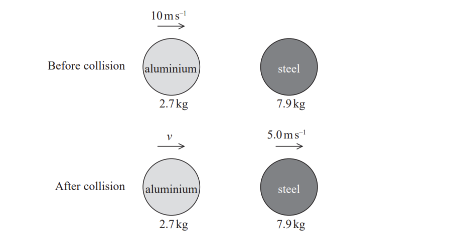
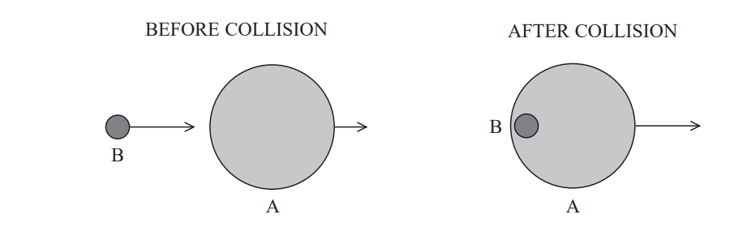
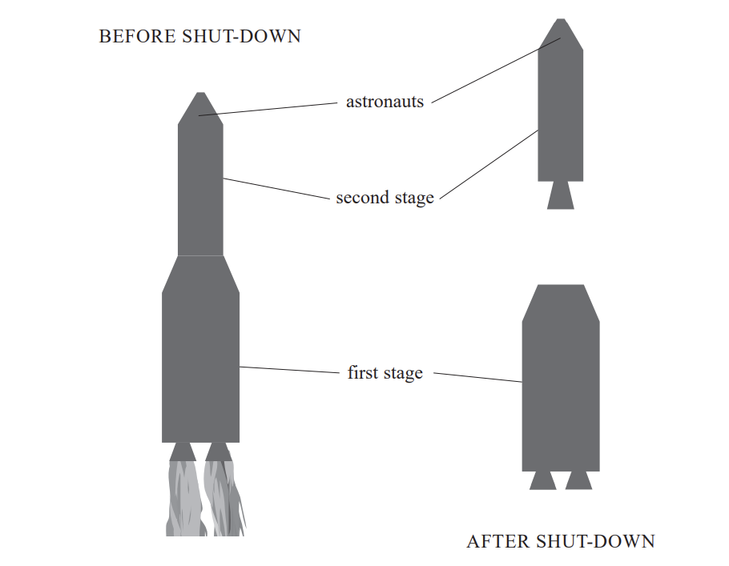
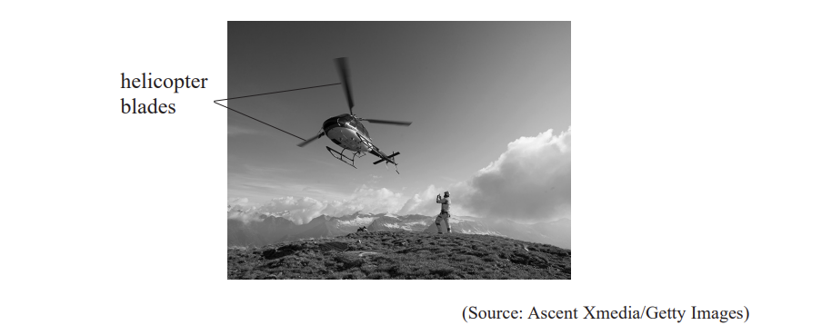
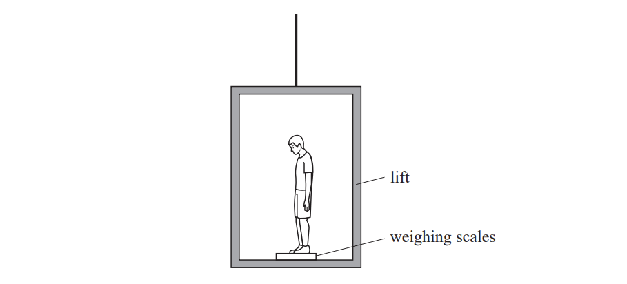
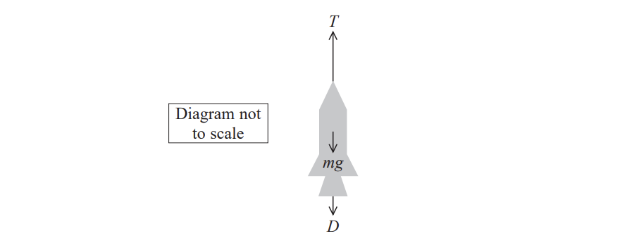
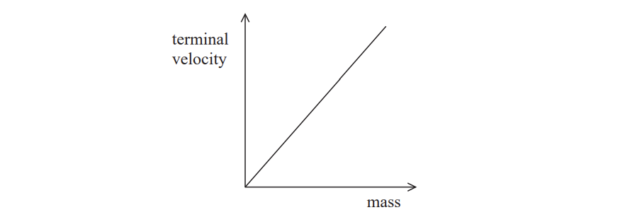

# Exam Questions — Forces & Momentum
**1. Mechanics & Materials** · Edexcel International A Level (IAL) Physics (YPH11)
> Source: [https://www.savemyexams.com/international-a-level/physics/edexcel/19/topic-questions/1-mechanics-and-materials/forces-and-momentum/structured-questions/](https://www.savemyexams.com/international-a-level/physics/edexcel/19/topic-questions/1-mechanics-and-materials/forces-and-momentum/structured-questions/) · 12 questions · total 40 marks

## Q1 — medium — 5 marks · structured-questions

### 12((a)) — 2 marks — command: state — structured — from paper Oct/Nov 2021 · WPH11/01
An aluminium sphere collides head-on with a stationary steel sphere. The two spheres move off separately after the collision.

State the principle of conservation of momentum.

### 12((b)) — 3 marks — command: calculate — structured — from paper Oct/Nov 2021 · WPH11/01
The aluminium sphere has an initial velocity of 10.0 m s–1. Immediately after the collision the velocity of the steel sphere is 5.0 m s–1.

Calculate the velocity v of the aluminium sphere immediately after the collision.

mass of aluminium sphere = 2.7 kg

mass of steel sphere = 7.9 kg

v = .............................................

## Q2 — medium — 7 marks · structured-questions

### 11((a)) — 2 marks — command: state — structured — from paper 2022 Jan · WPH11/01
A slow moving asteroid A was hit by a faster asteroid B. Asteroid B was absorbed by asteroid A as shown.

State the principle of conservation of linear momentum.

### 11((b)) — 5 marks — command: multiple — structured — from paper 2022 Jan · WPH11/01
Before the collision, asteroid A had a velocity of 2.19 × 103 m s−1 and a momentum of 1.80 × 1017 kg m s−1.

i) Show that the mass of asteroid A was about 8.2 × 1013 kg.                      **(2)**

ii) Calculate the velocity of the asteroids after the collision.

mass of asteroid B = 5.90 × 1012 kg

velocity of asteroid B before the collision = 15.0 × 103 m s−1               

Velocity of asteroids = .................................**(3)**

## Q3 — medium — 6 marks · structured-questions

### 11((a)) — 2 marks — command: show — structured — from paper 2021 June · WPH11/01
A railway carriage of mass 7.15 × 104 kg moving at 4.50 m s−1 collides with a second railway carriage of mass 5.35 × 104 kg moving in the same direction.

The carriages join together. Immediately after the collision they move at a speed of 3.62 m s−1 .

Show that the total momentum of the carriages immediately after the collision was approximately 4.5 × 105 kg m s−1 .

### 11((b)) — 2 marks — command: calculate — structured — from paper 2021 June · WPH11/01
Calculate the velocity of the second carriage before the collision.

Velocity of second carriage = ..........................

### 11((c)) — 2 marks — command: calculate — structured — from paper 2021 June · WPH11/01
Calculate the change in total kinetic energy during the collision.

Change in total kinetic energy = ............................

## Q4 — medium — 6 marks · structured-questions

### 15() — 6 marks — command: explain — structured — from paper 2021 June · WPH11/01
*A large spacecraft is made up of several ‘stages’. Each stage consists of a rocket motor and a fuel tank. Once a stage has used all its fuel, the rocket motor in that stage shuts down. The stage then disconnects from the spacecraft and falls back to Earth.

As the rocket is rising due to the upward force of the first stage, an astronaut feels himself pushed further and further back, compressing the back of his seat.

When the first stage shuts down, the astronaut is suddenly projected forwards by the seat. The astronaut is held in place by a safety strap.

Explain the effects experienced by the astronaut. You may assume that the force provided by the first stage rocket motor is constant until the moment it shuts down.

## Q5 — medium — 4 marks · structured-questions

### 12() — 4 marks — command: explain — structured — from paper 2022 Jan · WPH14/01
A helicopter can hover in a fixed position as shown.

The helicopter blades move air vertically downwards.

Explain how this enables the helicopter to maintain a constant height above the ground.

## Q6 — hard — 6 marks · structured-questions

### 14() — 6 marks — command: explain — structured — from paper 2022 Jan · WPH11/01
*A student of weight 600 N is standing on weighing scales in a lift. The scales are calibrated to give readings in newtons.

The lift moves upwards at constant velocity, then decelerates to rest. As the lift moves, the student looks at the readings on the scales.

Explain the readings on the scales.

## Q7 — medium — 1 marks · multiple-choice-questions

### 7() — 1 mark — multiple_choice — from paper 2022 Jan · WPH11/01
A person is pushing a trolley at a constant velocity.

The floor exerts a force *P* on the person, the person exerts a force *Q* on the trolley.

The trolley exerts a force *R* on the person and the total drag force on the trolley is *S.*

Which pair of forces is a Newton's Third Law pair?
- **A.** *P* and *R*
- **B.** *Q* and *R*
- **C.** *Q* and *S*
- **D.** *P* and *S*

## Q8 — medium — 1 marks · multiple-choice-questions

### 10() — 1 mark — multiple_choice — from paper 2022 Jan · WPH11/01
Which row of the table contains two units that are **not** equivalent?

|   | **Unit 1** | **Unit 2** |
|---|---|---|
| **A** | J s–1 | W |
| **B** | kg m s–2 | N s |
| **C** | N kg–1 | m s–2 |
| **D** | N m | J |
- **A.** 
- **B.** 
- **C.** 
- **D.** 

## Q9 — medium — 1 marks · multiple-choice-questions

### 10() — 1 mark — multiple_choice — from paper Oct/Nov 2021 · WPH11/01
The diagram shows a rocket of mass *m* accelerating upwards with acceleration *a*.

The diagram represents the forces acting on the rocket.

Which of the following equations gives the value of *D*?
- **A.** *D = T + m (g – a)*
- **B.** *D = T + m (a + g)*
- **C.** *D = T – m (g – a)*
- **D.** *D = T – m (g + a)*

## Q10 — medium — 1 marks · multiple-choice-questions

### 3() — 1 mark — multiple_choice — from paper 2021 June · WPH11/01
A van travels along a straight, horizontal road at a constant velocity.

Which of the following statements is correct?
- **A.** The frictional force of the road on the tyres can be ignored.
- **B.** The frictional force of the road on the tyres is equal to the resultant force on the van.
- **C.** The frictional force of the road on the tyres is in the direction of motion of the van.
- **D.** The frictional force of the road on the tyres is in the opposite direction to the motion of the van.

## Q11 — medium — 1 marks · multiple-choice-questions

### 2() — 1 mark — multiple_choice — from paper Oct/Nov 2021 · WPH11/01
A massive star exerts a gravitational force $F_{\mathrm{star}}$ on a small distant planet. The planet exerts a gravitational force $F_{\mathrm{planet}}$ on the star.

Which row of the table is correct?

|   | **Magnitude of forces** | **Direction of forces** |
|---|---|---|
| **A** | $F_{\mathrm{planet}}<F_{\mathrm{star}}$ | opposite |
| **B** | $F_{\mathrm{planet}}<F_{\mathrm{star}}$ | the same |
| **C** | $F_{\mathrm{planet}}=F_{\mathrm{star}}$ | opposite |
| **D** | $F_{\mathrm{planet}}=F_{\mathrm{star}}$ | the same |
- **A.** 
- **B.** 
- **C.** 
- **D.** 

## Q12 — hard — 1 marks · multiple-choice-questions

### 6() — 1 mark — multiple_choice — from paper 2022 Jan · WPH11/01
The graph shows how terminal velocity varies with mass for small spheres of equal diameter falling through a viscous liquid.

Which of the following describes the gradient of the graph for a liquid of greater viscosity?
- **A.** a greater gradient
- **B.** a smaller gradient
- **C.** a variable gradient
- **D.** the same gradient
