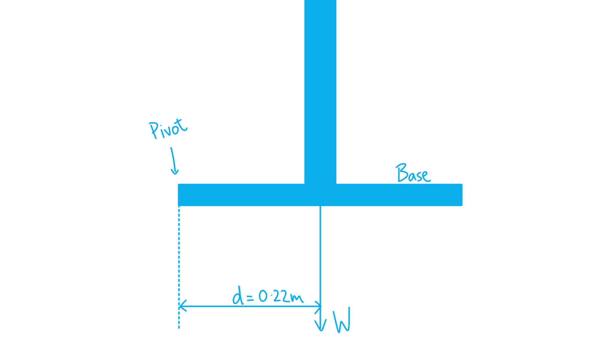
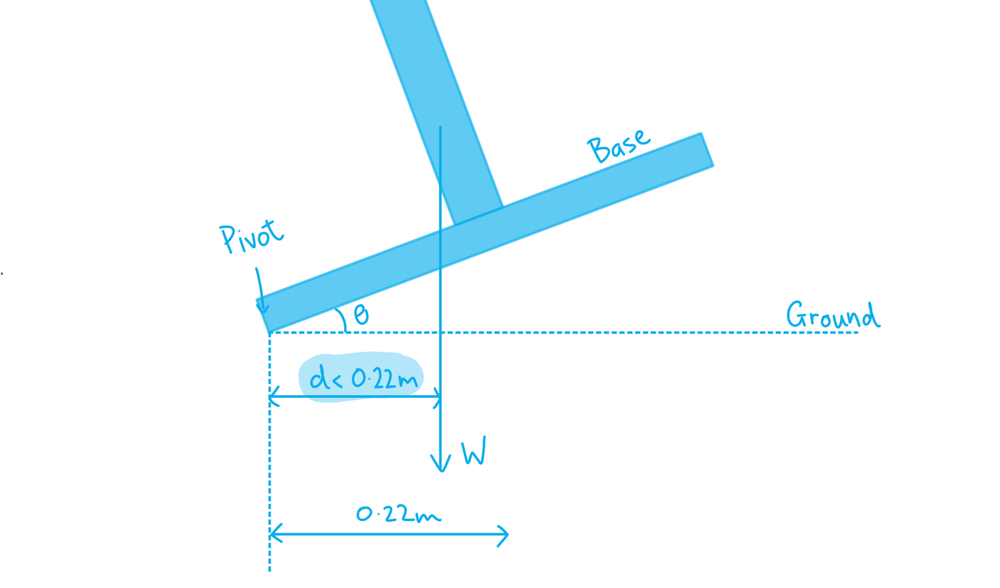

# Mark Schemes — Moments
**1. Mechanics & Materials** · Edexcel International A Level (IAL) Physics (YPH11)

## Q1 — easy — 9 marks · structured-questions

### 1() — 2 marks
> **[mark-scheme]**
> Any **pair** from (1 mark per point):
> 
> - Use two set squares, one in contact with the bench and the other with the metre rule
> - Check at both ends / at two different points
> 
> **OR**
> 
> - Measure the height of the metre rule above the bench using a second rule and a set square
> - Check at both ends / at two different points
> 
> **OR**
> 
> - Use a spirit level
> - Check bubble is in the middle / check in more than one position
> 
> **[2 marks]**

### 2() — 4 marks
To calculate the mass $m$ of the block:

- List the known quantities:

  - Force reading, $F=1.45\text{N}$
  - Weight of block, $W=mg$
  - Distance of force meter from pivot$=50\text{cm}$
  - Distance of mass from pivot $=80-50=30\text{cm}$
  - $g=9.81\text{N kg}^{-1}$
- The moment due to force $F$ about the pivot is:

moment $=Fx$

anticlockwise moment $=F\times50$ **[1 mark]**

- The moment due to weight $W$ about the pivot is:

clockwise moment `equals space W cross times open parentheses 80 minus 50 close parentheses`

clockwise moment $=mg\times30$ **[1 mark]**

- Apply the principle of moments about the pivot:

clockwise moments = anticlockwise moments

$mg\times30=1.45\times50$ **[1 mark]**

$m=\frac{1.45\times50}{9.81\times30}$

$m=$ $0.25\text{kg}$ **[1 mark]**

> **[mark-scheme]**
> 1 mark for use of moment = $Fx$
> 
> 1 mark for use of $F=mg$
> 
> 1 mark for applying the principle of moments about the pivot
> 
> 1 mark for a final answer of $m=0.25\text{kg}$

### 3() — 3 marks
> **[mark-scheme]**
> - The distance to the pivot would decrease 
> **OR** 
> The percentage uncertainty in distance would increase **[1 mark]**
> 
> - The force meter reading would increase 
> **OR** 
> The percentage uncertainty in force would decrease **[1 mark]**
> 
> - (Since one increases and the other decreases) we cannot be sure how the percentage uncertainty would change **[1 mark]**
> 
> The third mark is dependent on scoring the first two marks.

> **[exam-tip]**
> This type of question tests your ability to reason qualitatively about uncertainties without performing calculations. Make sure you consider the effect on each variable separately before drawing an overall conclusion.

## Q2 — medium — 7 marks · structured-questions

### 16((a)) — 3 marks
Calculate the reaction forces *R*1 and *R*2:

List the known quantities:

- Distance from the weight to *R*1 = 4.20 m
- Distance from the weight to *R*2 = 1.80 m
- Distance from from to rear axle = 6.00 m
- Weight = 1.23 × 104 N

Calculate *R*1 by taking moments about the rear axle:

- $moment=Fx$
- Clockwise moments = anticlockwise moments (since the car is in equilibrium) **[1 mark]**
- `open parentheses 1.23 cross times 10 to the power of 4 close parentheses cross times 1.80 equals R subscript 1 cross times 6.00` **[1 mark]**
- *R*1 = 3.69 × 103 N

Calculate *R*2 by taking moments about the front axle:

- `R subscript 2 cross times 6.00 equals open parentheses 1.23 cross times 10 to the power of 4 close parentheses cross times 4.20`
- *R*2 = 8.61 × 103 N **[1 mark]**

**[Total: 3 marks]**

- *You can take moments about any pivot, you will be expected to choose your own*

  - *The reason **R**1** is calculated by taking moments about the rear axle is that we don't know **R**2*
  - *Therefore, using the rear axle (where **R**2**) as the pivot means that **R**2 **doesn't turn up in the moment conservation equation*

### 16((b)) — 2 marks
Calculate the initial driving force on the dragster:

List the known quantities:

- Acceleration = 5.50 *g*
- Weight = 1.23 × 104 N

Calculate the force on the dragster:

- $m=\frac{W}{g}=\frac{1.23\times10^{4}}{g}$
- $ΣF=ma=\frac{1.23\times10^{4}}{g}\times5.50\timesg$** [1 mark]**
- Initial driving force = 6.77 × 104 N **[1 mark]**

**[Total: 2 marks]**

### 16((c)) — 2 marks
Explain how the force from the engine varies as the car accelerates:

- Since $P=\frac{W}{t}$ **OR** $\DeltaW=F\Deltas$ **[1 mark]**
- Since $\frac{\Deltas}{t}=v$, combining these gives $P=\frac{F\Deltas}{t}=Fv$
- The force will decrease as the velocity increases; **[1 mark]**

**[Total: 2 marks]**

- *If you are asked to compare how one variable changes with another, try and determine the equation that **links them both*
- *In this case, it is the power **P** and the force **F*

  - *P** = **Fv** is a common equation you can memorise*
  - *It is only used when there is a **constant velocity*

## Q3 — hard — 9 marks · structured-questions

### 19((a)) — 4 marks
Explain why the parasol will topple. Your answer should include a calculation:

List the known quantities:

- Weight of parasol, $W$ = 110 N
- Force of wind, $F$ = 14 N
- Height of parasol, $h$ = 1.80 m
- Width of base, $w$ = 0.44 m

Use the moment equation:

- $\mathrm{moment}=Fx$
- `A n t i minus c l o c k w i s e space open parentheses A C W close parentheses space moment space from space wind space equals space F h space equals space 14 space cross times space 1.80` **[1 mark]**

Calculate the clockwise (CW) and anticlockwise (ACW) moments:

- $\mathrm{ACW} \mathrm{moment} \mathrm{from} \mathrm{wind}=25.2Nm$ **AND**
- $\mathrm{CW} \mathrm{moment} \mathrm{from} \mathrm{base}=110\times0.22=24.2Nm$ **[1 mark]**

Describe the moments as the angle of the parasol changes:

- As angle to the ground increases, clockwise moment from the weight decreases; **OR**
- If line of action of weight moves outside base cannot regain equilibrium; **[1 mark]**

Compare the moments:

- 25.2 N m > 24.2 N m <u>therefore</u> the parasol blows over; **[1 mark]**

**[Total: 4 marks]**

- *We are told that the base has **already** started lifting - your explanation must include what happens **as the base lifts** (this is the third mark)*
- *It is important to identify the **pivot** in any moments question - in this case it is the **left side** of the base that the parasol rotates about*

  - *As the parasol rotates, the **maximum** perpendicular distance from the pivot to the weight force is 0.22 m (half the base)*
  - *This **reduces** as the parasol rotates*

### 19((b)) — 5 marks
Determine, by taking moments about the centre of the base, the vertical force that the base exerts on the ground:

List the known quantities:

- Force of wind, $F$ = 25 N
- Height of parasol, $h$ = 1.80 m
- Weight of parasol, $W$ = 110 N
- Vertical height of rope, $l_{vert}$ = 1.50 m
- Angle of rope to parasol = 44°

Write the horizontal component of tension, $T_{hor}$, in terms of $T$:

- `T subscript h o r end subscript space equals space T sin open parentheses 44 degree close parentheses` **[1 mark]**

Equate moments about the centre of the base to determine $T$:

- `CW space moment space space equals space T subscript h o r end subscript l subscript v e r t end subscript space equals space 1.50 T sin open parentheses 44 degree close parentheses`
- $\mathrm{ACW} \mathrm{moment}=Fh=45Nm$
- `45 space equals space 1.50 T sin open parentheses 44 degree close parentheses` **[1 mark]**
- `T space equals space fraction numerator 45 over denominator 1.50 sin open parentheses 44 degree close parentheses end fraction space equals space 43.2 space straight N`

Determine the vertical component of tension, $T_{vert}$:

- `T subscript v e r t end subscript space equals space T cos open parentheses 44 degree close parentheses space equals space 43.2 cos open parentheses 44 degree close parentheses space equals space 31.1 space straight N` **[1 mark]**

Determine the total force on the ground:

- $\mathrm{total} \mathrm{force}=W+T_{vert}=110+31.1$ **[1 mark]**
- $\mathrm{total} \mathrm{force} \mathrm{on} \mathrm{ground}=141.1=140N$ (2 s.f.) **[1 mark]**

**[Total: 5 marks]**

- *If you are unsure where to start - work **backwards*

  - *We are trying to find the total downwards force through the base*
  - *We must find the downwards force due to **tension** and add it to weight*
  - $T$* can only be calculated by equating the wind moment and the tension moment*
  - *Use this to find the **vertical component **of tension and add this to weight*
- *The assumption "force which the ground exerts on the base acts through the midpoint of the base" allows us to ignore any moments from a **reaction** **force** at the **edges** of the base - we can imagine **only a small point** of the parasol touches the ground*

## Q4 — medium — 1 marks · multiple-choice-questions

### 9() — 1 marks
**Correct answer: C** — *Q* > *P*

**Final answer:** **The correct answer is ****C**** because:**

- For an object in equilibrium, the **clockwise** moment must be equal to the **anticlockwise** moment
- Moment $=Fx$

  - The moments of the centre of the beam are equal
  - *P* is further from the centre than* Q*, so less force (at *P*) is needed for the same moment
  - Therefore, *Q* >* P*

- This is answer** C**

## Q5 — medium — 1 marks · multiple-choice-questions

### 5() — 1 marks
**Correct answer: B** — 

**Final answer:** **The correct answer is ****B**** because:**

- This is the only option where both moments about the pivot are in the same direction (anticlockwise)

  - The weight force at G acts downwards and is left of the pivot
  - The force F acts upwards and is right of the pivot
- Since both moments are in the same direction the beam cannot be in equilibrium

- All other options have one **clockwise** moment and one **anticlockwise** moment about the pivot

  - These could all theoretically **balance** each other out - even if on the **same** **side** of the pivot
