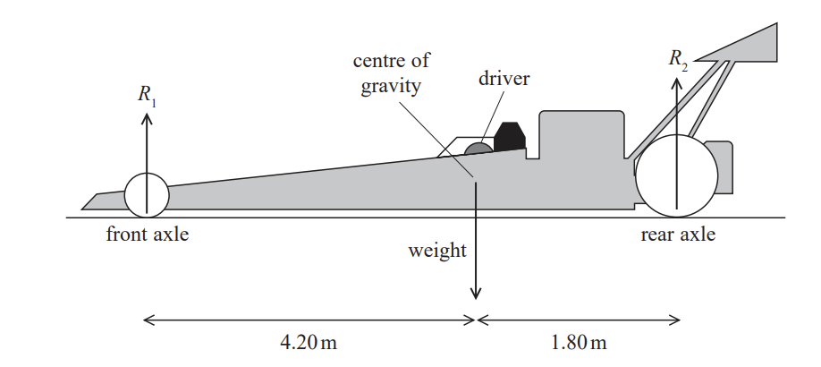
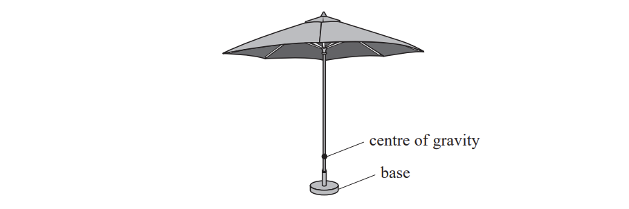
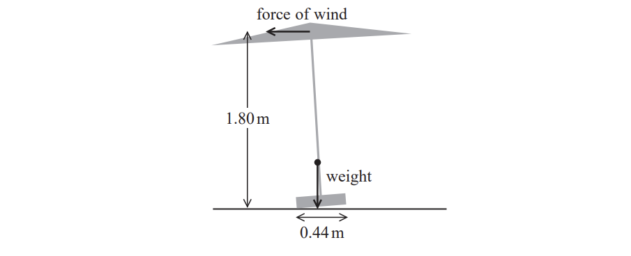
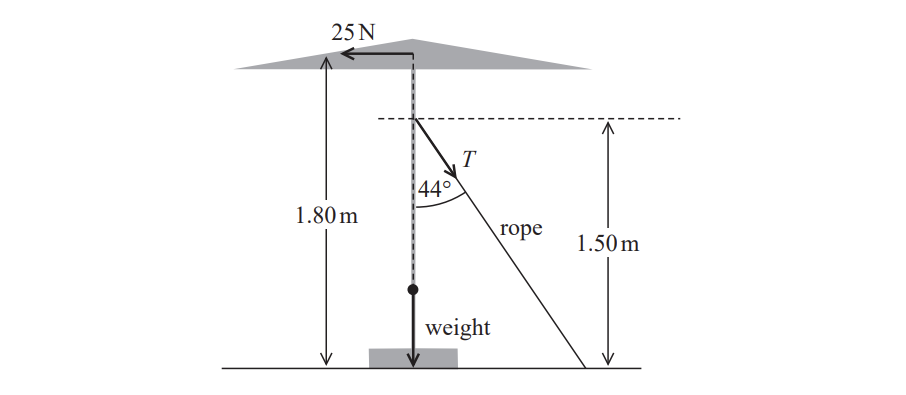
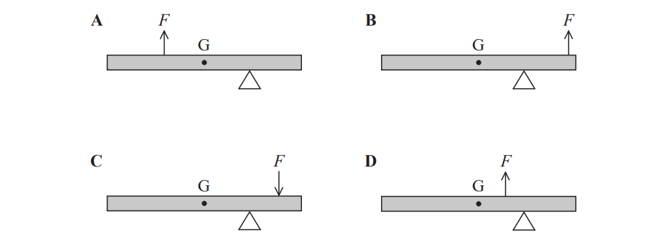

# Exam Questions — Moments
**1. Mechanics & Materials** · Edexcel International A Level (IAL) Physics (YPH11)
> Source: [https://www.savemyexams.com/international-a-level/physics/edexcel/19/topic-questions/1-mechanics-and-materials/moments/structured-questions/](https://www.savemyexams.com/international-a-level/physics/edexcel/19/topic-questions/1-mechanics-and-materials/moments/structured-questions/) · 5 questions · total 27 marks

## Q1 — easy — 9 marks · structured-questions

### 1() — 2 marks — command: explain — structured
A student used a force meter attached to one end of a uniform metre rule to determine the mass of a block. The centre of the metre rule is attached to a stand about which it can pivot.

A block of unknown mass $m$ can be attached to the metre rule through one of the small holes, as shown.

The student attached the block to each small hole and adjusted the force meter to make it vertical before taking a reading.

Explain how the student could check the metre rule is horizontal before taking a reading.

### 2() — 4 marks — command: calculate — structured
The student places the block at the $80\text{cm}$ mark and pulls the force meter vertically downwards until the ruler is horizontal. The reading on the force meter is $1.45\text{N}$.

Calculate the mass $m$ of the block. You should take moments about the pivot.

### 3() — 3 marks — command: deduce — structured
The student wants to reduce the percentage uncertainty in the value obtained for the mass of the block.

The student moved the force meter towards the centre of gravity of the metre rule and repeated the measurements.

Deduce whether the percentage uncertainty in the value obtained for the mass of the block is reduced by the student moving the force meter. No calculations are required.

## Q2 — medium — 7 marks · structured-questions

### 16((a)) — 3 marks — command: calculate — structured — from paper 2021 June · WPH11/01
A dragster is a racing car designed for a very short race along a completely straight track, so must be able to accelerate at a very high rate. The dragster and driver shown below have a combined weight of 1.23 × 104 N. The centre of gravity is 1.80 m in front of the rear axle.

The front axle of the dragster is 6.00 m from the rear axle.

Calculate the reaction forces *R*1 and *R*2, shown on the diagram, when the dragster is stationary and not accelerating.

*R*1 = ................................

*R*2 = ................................

### 16((b)) — 2 marks — command: calculate — structured — from paper 2021 June · WPH11/01
When the dragster starts, there is a driving force that gives the dragster an initial forward acceleration of 5.50 g.

Calculate the initial driving force on the dragster.

Initial driving force = ...............................

### 16((c)) — 2 marks — command: explain — structured — from paper 2021 June · WPH11/01
The power from the car’s engine is constant.

Explain how the force from the engine varies as the car accelerates.

## Q3 — hard — 9 marks · structured-questions

### 19((a)) — 4 marks — command: calculate — structured — from paper Oct/Nov 2021 · WPH11/01
A large parasol has been set up on a windy day. The centre of gravity of the parasol is vertically above the centre of the base. The bottom of the parasol starts to lift from the ground as shown. The weight of the parasol is 110 N.

The force of the wind is 14 N in a horizontal direction.

Explain why the parasol will topple. Your answer should include a calculation.

### 19((b)) — 5 marks — command: determine — structured — from paper Oct/Nov 2021 · WPH11/01
To prevent the parasol from toppling, a rope is attached to the parasol at 1.50 m from the ground as shown. The rope makes an angle of 44° to the vertical.

The horizontal force from the wind is now 25 N.

Determine, by taking moments about the centre of the base, the vertical force that the base exerts on the ground.

Assume that the force which the ground exerts on the base acts through the midpoint of the base.

Force exerted on the ground = ..........................................

## Q4 — medium — 1 marks · multiple-choice-questions

### 9() — 1 mark — multiple_choice — from paper 2022 Jan · WPH11/01
A beam is balanced on two supports as shown.

The beam has a weight *W *and the reaction forces at the two supports are *P* and *Q*.

Which of the following statements about the magnitudes of the forces is correct?
- **A.** *P *>* Q*
- **B.** *Q* > *W*
- **C.** *Q* > *P*
- **D.** (*P* + *Q*) > *W*

## Q5 — medium — 1 marks · multiple-choice-questions

### 5() — 1 mark — multiple_choice — from paper Oct/Nov 2021 · WPH11/01
A beam is supported by a pivot as shown in the diagrams. The centre of gravity of the beam is at G. The beam is acted on by a force $F$.

Which diagram shows an arrangement where the beam could **not** be in equilibrium?

- **A.** 
- **B.** 
- **C.** 
- **D.** 
