# Mark Schemes — Motion
**1. Mechanics & Materials** · Edexcel International A Level (IAL) Physics (YPH11)

## Q1 — medium — 8 marks · structured-questions

### 13((a)) — 2 marks
Complete the free‐body force diagram below for the sledge:

- Vertical downwards force labelled "weight" / "W";
- Force perpendicular to slope (by eye) labelled "reaction" / "R" **OR** "(normal) contact" / "N";

- *The reaction force **must** be clearly perpendicular to the slope*

  - *This means it is 6.9° to the right of vertical*
- *The range of accepted reaction force directions is shown below*

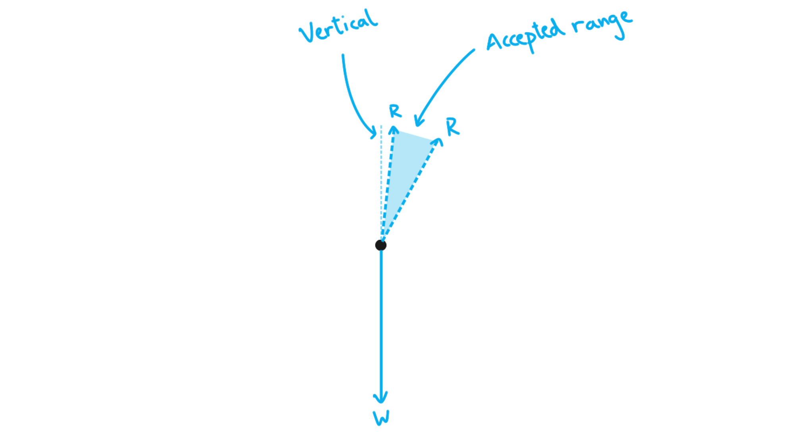

### 13((b)) — 6 marks
i) Show that the initial acceleration of the sledge along the slope is about 1 m s–2:

List the known quantities:

- Acceleration of free fall, $g$ = 9.81 m s-2
- Angle of the slope to horizontal = 6.9°

Find the component of $g$ along the slope:

- `a space equals space g sin open parentheses 6.9 degree close parentheses` **[1 mark]**
- $a=1.18ms^{-2}=1.2ms^{-2}$ (2 s.f.) **[1 mark]**

ii) Determine the speed of the sledge at the end of the slope:

List the known and unknown suvat quantities:

- $s$ = 60 m
- $u$ = 0 m s-1
- $v$ = to be calculated
- $a$ = 1.18 m s-2 (from part **(b)(i)**)
- $t$ = ?

Choose a suvat equation and rearrange for $v$:

- $v^{2}=u^{2}+2as$
- $u=0ms^{-1}$ so $v=\sqrt{2as}$
- $v=\sqrt{2\times1.18\times60}=11.90ms^{-1}$ **[1 mark]**
- $\mathrm{final} \mathrm{speed}=12ms^{-1}$ (2 s.f.) **[1 mark]**

iii) Determine the time taken for the sledge to travel to the end of the slope:

List the known and unknown suvat quantities:

- $s$ = 60 m
- $u$ = 0 m s-1
- $v$ = 11.9 m s-1 (from part **(b)(ii)**)
- $a$ = 1.18 m s-2 (from part **(b)(i)**)
- $t$ = to be calculated

Choose a suvat equation and rearrange for $t$:

- $s=ut+\frac{1}{2}at^{2}$
- $u=0ms^{-1}$ so $s=\frac{1}{2}at^{2}$
- $t=\sqrt{\frac{2s}{a}}=\sqrt{\frac{2\times60}{1.18}}=10.1s$ **[1 mark]**
- Time taken = 10 s (2 s.f.) **[1 mark]**

**[Total: 6 marks]**

- *In part (i), drawing a diagram can help you understand how to calculate the component of acceleration along the slope*

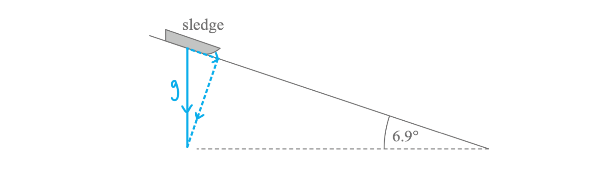

- *Some quick trigonometry then reveals why the component down the slope is *`g sin open parentheses 6.9 degree close parentheses`

- *Part (ii) can also be solved by equating increase in the kinetic energy store with decrease in the GPE store (ensuring that the vertical height is used, not 60 m) - have a go and see if you end up with the same result*
- *Part (iii) can be solved using *$v=u+at$*, as **t** is the only unknown suvat quantity here*

## Q2 — medium — 7 marks · structured-questions

### 12((a)) — 3 marks
To show that the trolley reaches point B with a speed of about 3 m s−1:

List the known quantities:

- Initial height = 0.50 m

From the data booklet:

- Acceleration of free fall *g* = 9.81 m s−2

Equate gravitational potential at the end with final kinetic energy:

- $mgh=\frac{1}{2}mv^{2}$ **[1 mark]**
- `up diagonal strike m g h equals 1 half up diagonal strike m v squared`

Substitute in known values and calculate final velocity:

- $gh=\frac{1}{2}v^{2}$
- $9.81\times0.5=\frac{1}{2}v^{2}$ **[1 mark]**
- `v equals square root of open parentheses 2 cross times 9.81 cross times 0.5 close parentheses end root`
- $v=3.13ms^{-1}$ **[1 mark]**

**[Total: 3 marks]**

- *There is an alternative method to this problem using SUVAT*
- *First you would need to find the **parallel** component of **g** and the **distance** along the ramp*

  - *Then substitute into *$v^{2}=u^{2}+2as$
- *Whilst this is a perfectly valid method it involves more steps and therefore we recommend using gravitational and kinetic energy equivalence as shown in the mark scheme above*

### 12((b)) — 4 marks
To determine the time taken by the object to move from point A to point C:

List the known quantities:

- Height of ramp, *h* = 0.5 m
- Horizontal length of ramp, *s* = 2.0 m
- Initial speed of the object, *u* = 0
- Final speed of the object, *v *= 3.13 m s−1

Determine the distance travelled using Pythagoras:

- $a=\sqrt{b^{2}+c^{2}}=\sqrt{s^{2}+h^{2}}=\sqrt{2.0^{2}+0.5^{2}}=2.06m$ **[1 mark]**

Calculate the time taken to travel down the ramp from point A to B:

- `s equals 1 half open parentheses u plus v close parentheses t`
- `2.06 equals 1 half open parentheses 0 plus 3.13 close parentheses t subscript A B end subscript`
- $t_{AB}=1.32s$ **[1 mark]**

Calculate the time taken to travel from point B to C:

- $s=vt$
- $t_{BC}=\frac{s}{v}=\frac{1.0}{3.13}=0.32s$ **[1 mark]**

Calculate the total time:

- $t_{total}=t_{AB}+t_{BC}=1.32+0.32$
- Time taken = 1.64 s **[1 mark]**

**[Total: 4 marks]**

- *The key to this question is working through each stage separately before combining them*
- *A common mistake is trying to do the whole calculation in one step which will lead to errors due to the difference in average speed across each section AB and BC.*

## Q3 — medium — 8 marks · structured-questions

### 14((a)) — 5 marks
To deduce whether the skier reaches the flat surface before landing:

List the known quantities:

- Height of ramp = 2.9 m
- Horizontal distance to the bottom of the ramp = 30 m
- Initial speed = 25 m s−1
- Angle of take-off = 10 °

From the data booklet:

- $s=ut+\frac{1}{2}at^{2}$
- Acceleration of free fall, *g* = 9.81 m s−2

Resolve velocity into horizontal and vertical components:

- $v_{h}=25\mathrm{cos}10=24.6ms^{-1}$ **AND**
- $v_{v}=25\mathrm{sin}10=4.34ms^{-1}$ **[1 mark]**

Calculate the time of the flight:

- $s=ut$
- $s_{h}=v_{h}\timest$
- $t=\frac{30}{24.6}=1.22s$ **[1 mark]**

Calculate the vertical displacement after 1.22:

- $s=ut+\frac{1}{2}at^{2}$
- `s equals open parentheses 4.34 cross times 1.22 close parentheses minus open parentheses 1 half cross times 9.81 cross times 1.22 squared close parentheses` **[1 mark]**
- Decrease in height = 2.01 m **[1 mark]**

Comment on whether the skier will reach the flat surface before landing:

- The skier's height has decreased by 2.01 m by the time he has travelled a horizontal distance of 30 m
- Therefore he will reach the flat surface before landing; **[1 mark]**

**[Total: 5 marks]**

- *In this question, upwards is taken as positive*

  - *It doesn't matter which direction you take as positive or negative when using SUVAT equations, as long as it is consistent throughout your question!*
  - *Remember if upwards is taken as positive then **g** will be negative (as it is always directed downwards!)*

### 14((b)) — 3 marks
To calculate the average force required to bring the skier to rest:

List the known quantities:

- Initial speed, *u* = 23 m s−1
- Final speed, *v* = 0
- Distance travelled, *s* = 43 m
- Mass of skier, *m* = 63 kg

Calculate the deceleration of the skier:

- $v^{2}=u^{2}+2as$
- `0 equals 23 squared plus space open parentheses 2 cross times a cross times 43 close parentheses`
- $a=\frac{-23^{2}}{86}=-6.15ms^{-2}$ **[1 mark]**

Calculate the force required:

- $ΣF=ma$
- $F=63\times6.15$ **[1 mark]**
- Average force = 387 N **[1 mark]**

**[Total: 3 marks]**

## Q4 — hard — 9 marks · structured-questions

### 16((a)) — 3 marks
Show that the rock would reach its maximum height about 3 s after the explosion:

List the known quantities:

- Initial rock velocity, $u$ = 50 m s-1
- Angle to horizontal = 40°
- Acceleration of free fall = 9.81 m s-2

Determine the vertical component of the initial velocity, $u_{v}$:

- `u subscript v space equals space 50 sin open parentheses 40 degree close parentheses space equals space 32.1 space straight m space straight s to the power of negative 1 end exponent` **[1 mark]**

List the known and unknown vertical suvat quantities, defining up as the positive direction:

- $s_{v}$ = unknown
- $u_{v}$ = 50sin(40°)
- $v_{v}$ = 0 m s-1
- $a$ = −9.81 m s-2
- $t$ = to be calculated

Choose a suvat equation and calculate $t$:

- $v=u+at$
- `t space equals space fraction numerator v space minus space u over denominator a end fraction space equals space fraction numerator 0 space minus space 50 sin open parentheses 40 degree close parentheses over denominator negative 9.81 end fraction` **[1 mark]**
- $t=3.28s$
- $\mathrm{time} \mathrm{to} \mathrm{reach} \mathrm{max} \mathrm{height}=3.3s$ **[1 mark]**

**[Total: 3 marks]**

- *To determine the vertical component of initial velocity, trigonometry is used*

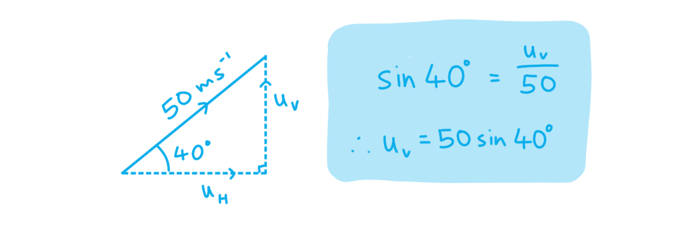

- *For suvat questions, defining your variables clearly is very important*

  - *The acceleration vector points in the **opposite** direction to initial velocity, so they must have **opposite** signs*
  - *This ensures you do not calculate a **negative** value for **time**!*
- *Knowing that the instantaneous final velocity is 0 m s**-1** when a projectile reaches **maximum** **height** is **crucial** to solving these types of question*

### 16((b)) — 6 marks
Deduce whether the rock hits the ground before it reaches its maximum possible height:

List the known and unknown vertical suvat quantities to find the maximum height:

- $s_{v,max}$ = to be calculated
- $u_{v}$ = 32.1 m s-1 (from part **(a)**)
- $v_{v}$ = 0 m s-1
- $a$ = −9.81 m s-2
- $t_{max}$ = 3.28 s

Use a vertical suvat equation to find maximum height of the projectile:

- $s_{v,max}=u_{v}t_{max}+\frac{1}{2}at_{max}^{2}$
- `s subscript v comma m a x end subscript space equals space open parentheses 32.1 space cross times space 3.28 close parentheses space minus space 1 half space cross times space 9.81 space cross times space open parentheses 3.28 close parentheses squared` **[1 mark]**
- $s_{v,max}=52.5m$ **[1 mark]**

Determine the initial horizontal velocity:

- `u subscript h space equals space 50 cos open parentheses 40 degree close parentheses space equals space 38.3 space straight m space straight s to the power of negative 1 end exponent` **[1 mark]**

Determine the horizontal displacement at $t_{max}$:

- $s_{h,max}=u_{h}t_{max}$
- $s_{h,max}=38.3\times3.28=126m$ **[1 mark]**

Compare the hill height 126 m away with maximum height of the projectile:

- `h space equals space 126 tan open parentheses 20 degree close parentheses space equals space 45.9 space straight m space`**[1 mark]**
- 45.9 m > 52.5 m <u>therefore</u> the answer is no (the rock does not hit the ground before reaching its maximum height); **[1 mark]**

**[Total: 6 marks]**

- *You will often find a difficult projectile question like this in your unit 1 paper - make sure it is something you feel confident in!*
- *The key here was to find the location of the projectile at its maximum height and compare that with the location of the hill*

  - *To do this, you had to find vertical **and** horizontal displacement*
  - *Usually, horizontal displacement is found using *$s=ut$*, which is a special case of *$s=ut+\frac{1}{2}at^{2}$* when acceleration is zero*
- *You may have compared the angle of the hill to the angle of the projectile to the horizontal - this would also have been a valid method*

  - *Sometimes, drawing a diagram is a good way to visualise a complicated scenario such as this one*

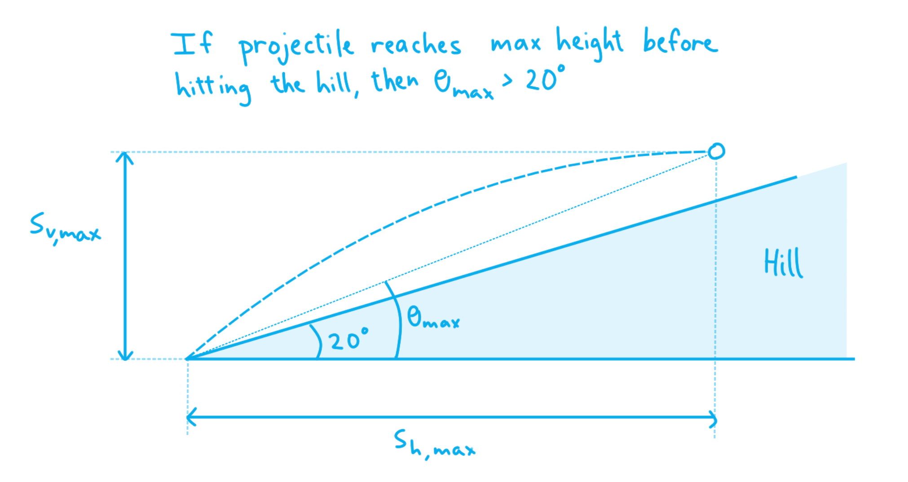

## Q5 — hard — 9 marks · structured-questions

### 18((a)) — 2 marks
Use trigonometry to resolve the horizontal and vertical components of velocity:

- Resolving horizontally (→): *v**x* = 35 × cos 25° = 31.7 m s−1
- Resolving vertically (↑): *v**y* = 35 × sin 25° = 14.8 m s−1
- Horizontal component = 32 m s−1 **[1 mark]**
- Vertical component = 15 m s−1 **[1 mark]**

**[Total: 2 marks]**

### 18((b)) — 4 marks
Deduce whether the rider lands on the other side of the river:

List the known quantities:

- Required horizontal distance, *s* = 100 m
- Vertical height above ground, *h* = 3.00 m
- Horizontal initial velocity, *u**x* = 31.7 m s−1
- Vertical initial velocity, *u**y* = 14.8 m s−1
- Horizontal acceleration, *a**x* = 0
- Vertical acceleration, *a**y* = −*g* = −9.81 m s−2

Max **four** marks from **one** of the following methods:

**Method 1: Comparison of vertical distances**

Determine the time taken to travel 100 m horizontally:

- $s=u_{x}t$
- $t=\frac{100}{31.7}$ = 3.155 s **[1 mark]**

Determine the vertical distance fallen in this time:

- $s=u_{y}t+\frac{1}{2}at^{2}$
- `s space equals space open parentheses 14.8 cross times 3.155 close parentheses space minus space 1 half cross times open parentheses 9.81 cross times 3.155 squared close parentheses` = −2.13 m **[1 mark]**
- Vertical distance fallen = 2.1 m **[1 mark]**

Write a concluding statement:

- When the rider has travelled 100 m horizontally, they have fallen a distance of 2.1 m which is less than 3.0 m, hence the rider lands on the other side of the river; **[1 mark]**

**OR**

**Method 2: Comparison of times of flight**

Determine the time to the maximum height:

- $v=u_{y}+at$
- $0=14.8-9.81t\Rightarrowt=\frac{14.8}{9.81}=1.5s$

Solve the quadratic to determine the time to descend by 3 m:

- $s=u_{y}t+\frac{1}{2}at^{2}$
- `3.0 space equals space 14.8 t space minus space fraction numerator 9.81 over denominator 2 end fraction t squared space space space space space rightwards double arrow space space space space space t space equals space fraction numerator 14.8 space minus space square root of 14.8 squared space minus space open parentheses 2 cross times 9.81 cross times 3 close parentheses end root over denominator 9.81 end fraction space equals space 0.22 space straight s` **[1 mark]**

Determine the total time of flight of the rider:

- Time of flight = (2 × time to reach max height) + (time to descend 3 m)
- Time of flight = (2 × 1.5) + 0.22
- Time of flight = 3.22 s **[1 mark]**

Determine the horizontal distance travelled in this time:

- $s=u_{x}t=31.7\times3.22=102.1m$
- Horizontal distance travelled = 102 m **[1 mark]**

Write a concluding statement:

- The rider travels a total horizontal distance of 102 m which is greater than 100 m, hence the rider lands on the other side of the river; **[1 mark]**

**OR**

**Method 3: Comparison of horizontal distances**

Determine the time taken to travel 100 m horizontally (as in **Method 1**):

- Time to travel 100 m horizontally = 3.16 s **[1 mark]**

Determine the time of flight (as in **Method 2**):

- Time to descend by 3 m = 0.22 s **[1 mark]**
- Time of flight = 3.22 s **[1 mark]**

Write a concluding statement:

- It takes the rider 3.16 s to travel 100 m horizontally which is less than 3.22 s, the total time of flight, hence the rider lands on the other side of the river; **[1 mark]**

**[Total: 4 marks]**

- *Method 1** is by far the simplest way to tackle this question as this requires the fewest calculation steps and no quadratic formula*

  - *The other two methods give equally clear results but are more prone to calculation errors along the way*

- *For example, a very common error made in **Method 2** tends to be calculating the time to reach the greatest height and then doubling it but forgetting to include the time taken to fall the last 3.00 m*
- *This is why drawing a clear sketch can be very helpful to avoid this type of mistake:*

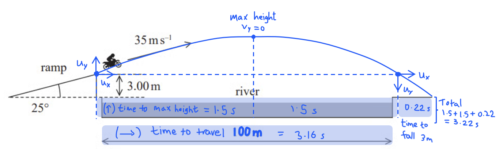

- *Calculation errors are common when students are unsure about how to carry out the quadratic step in **Method 2*
- *The full working of this step is shown below:*

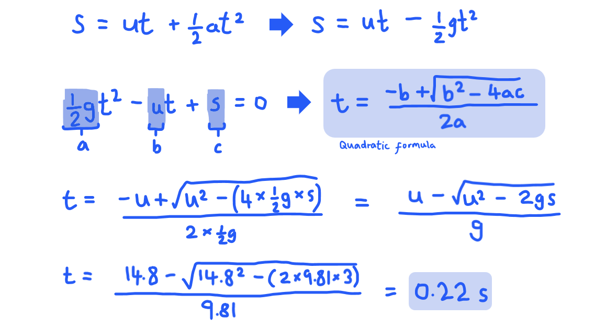

### 18((c)) — 3 marks
The effect of air resistance on the rider's motion would be:

- Air resistance acts to oppose the motion of the motorcyclist; **[1 mark]**

Max **one** from:

- It decreases the time for which the motorcyclist is in the air; **[1 mark]**
- It causes deceleration in the horizontal direction; **[1 mark]**
- It reduces speed in the horizontal direction; **[1 mark]**
- It reduces the (maximum) height reached by the motorcyclist; **[1 mark]**

If any mark is gained from the above, max **one** for:

- It reduces the horizontal distance travelled; **[1 mark]**

**[Total: 3 marks]**

- *You could also use a diagram to aid your description - a clearly annotated sketch could earn you some marks*

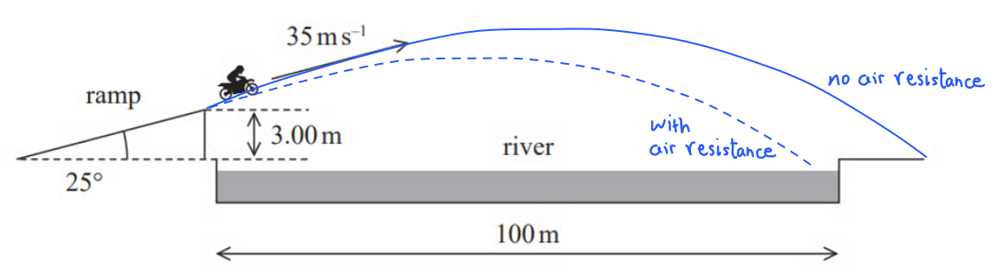

## Q6 — hard — 3 marks · structured-questions

### 1() — 3 marks
To calculate the average speed of the train:

- List the known quantities:

  - Maximum speed, $v_{max}=505\text{km h}^{-1}$
  - Total time at max speed, $t_{max}=130\text{s}$
  - Total time of test, $T=480\text{s}$

- Convert the maximum speed to $\text{m s}^{-1}$:

$v_{max}=\frac{505\times1000}{3600}=140.3\text{m s}^{-1}$

- Determine the total distance travelled by the train:

  - Since the rates of acceleration and deceleration are the same, the velocity–time graph would be a trapezium
  - Area of trapezium `equals 1 half open parentheses a plus b close parentheses h`

$s=\frac{1}{2}(t_{max}+T)v_{max}$

$s=\frac{1}{2}(130+480)\times140.3$

$s=42790\text{m}$ **[1 mark]**

- Determine the average speed of the train:

$v_{av}=\frac{s}{T}$

$v_{av}=\frac{42790}{480}$ **[1 mark]**

$v_{av}=$ $89.1\text{m s}^{-1}$ **[1 mark]**

> **[mark-scheme]**
> 1 mark for calculating the total distance travelled
> 
> - Accept any valid method, e.g. using the area under the speed–time graph or kinematic equations
> 
> 1 mark for use of $v_{av}=s/t$ with $t=480\text{s}$
> 
> 1 mark for a final answer of $89\text{m s}^{-1}$ (or $320\text{km h}^{-1}$)

## Q7 — easy — 1 marks · multiple-choice-questions

### 2() — 1 marks
**Correct answer: D** — 

**Final answer:** **The correct answer is ****D**** because:**

- Force has **both **magnitude and direction, therefore it is a **vector** quantity
- Mass has magnitude **only**, therefore it is a **scalar **quantity
- Acceleration has **both **magnitude and direction therefore it is a **vector** quantity

  - Therefore, the only correct answer is **D**

## Q8 — easy — 1 marks · multiple-choice-questions

### 1() — 1 marks
**Correct answer: B** — 

**Final answer:** **The correct answer is ****B**** because:**

- Gradient is calculated using $\frac{Δy}{Δx}$

  - In **B** this is $\frac{\mathrm{Δvelocity}}{\mathrm{Δtime}}$, which gives a gradient of acceleration

## Q9 — easy — 1 marks · multiple-choice-questions

### 4() — 1 marks
**Correct answer: C** — $\frac{5.5}{\mathrm{sin}22.6^{\circ}}$

**Final answer:** **The correct answer is ****C**** because:**

- For velocity $v$, the downwards component is calculated using $v\mathrm{sin}22.6^{\circ}=5.5ms^{-1}$
- This can be rearranged to $v=\frac{5.5}{\mathrm{sin}22.6^{\circ}}$

- In case you need a quick reminder on how the trigonometry for vectors like this works, see below

  - Resolving vectors into components (and components back into those vectors) is a **crucial** skill in physics - if you didn't get this one right, prioritise this in your revision

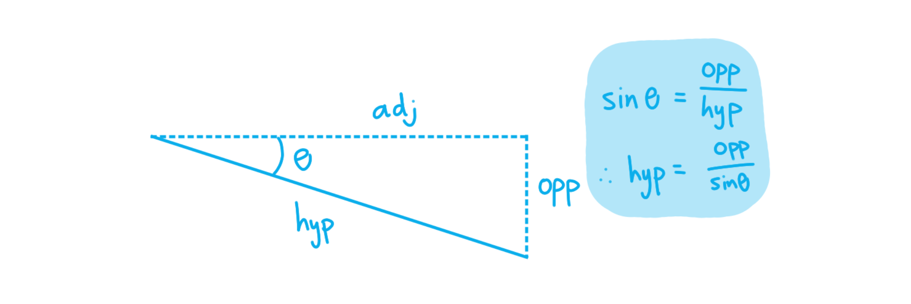

## Q10 — easy — 1 marks · multiple-choice-questions

### 6() — 1 marks
**Correct answer: A** — 

**Final answer:** **The correct answer is ****A**** because:**

- The normal reaction force acts **perpendicular** to the surface of the slope
- It also acts in the opposite direction to the component of weight which is perpendicular to the slope

  - This means force **N** points out from the slope - this is option **A**

## Q11 — medium — 1 marks · multiple-choice-questions

### 1() — 1 marks
**Correct answer: A** — 

**Final answer:** **The correct answer is ****A**** because:**

- Final displacement is measured from zero

  - Therefore, the final displacement is 2 m in the positive direction

- Velocity is the gradient of a displacement-time graph

  - Therefore, `v space equals space fraction numerator increment s over denominator increment t end fraction space equals space fraction numerator 2 space minus space open parentheses negative 1 close parentheses over denominator 6 space minus space 0 end fraction space equals space 0.5 space straight m space straight s to the power of negative 1 end exponent`

- This is answer option **A**

## Q12 — medium — 1 marks · multiple-choice-questions

### 5() — 1 marks
**Correct answer: C** — $\frac{2\times0.32}{0.63^{2}}$

**Final answer:** **The correct answer is ****C**** because:**

- $s=ut+\frac{1}{2}at^{2}$

  - The initial velocity, $u$, is zero
  - Therefore, $s=\frac{1}{2}at^{2}$
- Making acceleration, $a$, the subject, $a=\frac{2s}{t^{2}}$

  - Hence, $a=\frac{2\times0.32}{0.63^{2}}$
- This is answer **C**

## Q13 — medium — 1 marks · multiple-choice-questions

### 7() — 1 marks
**Correct answer: A** — 1 ÷ 0.322

**Final answer:** **The correct answer is ****A**** because:**

- The equation $s=ut+\frac{1}{2}at^{2}$ is most useful here

  - $u=0ms^{-1}$ as the ball bearing is initially at rest
  - $s=\frac{1}{2}at^{2}$
- Rearranging for acceleration gives $a=\frac{2s}{t^{2}}$

  - Substituting 0.5 m for *s* and 0.32 s for *t* gives $a=\frac{1}{0.32^{2}}$ which is option **A**

- An alternative method would be to recognise that the **acceleration** **of** **free** **fall** close to the Earth's surface is 9.81 m s-2

  - Calculating each answer would show that only **A** is close to this value:
  
    - **A** = 9.77 m s-2
    - **B** = 1.56 m s-2
    - **C** = 977 m s-2
    - **D** = 156 m s-2

## Q14 — medium — 1 marks · multiple-choice-questions

### 1() — 1 marks
**Correct answer: D** — kinetic energy

**Final answer:** **The correct answer is ****D**** because:**

- Kinetic energy has magnitude but not direction and is therefore scalar

**A** is incorrect as weight is a force, which is a vector as it has magnitude and direction

**B** is incorrect as momentum is a vector as it has magnitude and direction

**C** is incorrect as velocity has magnitude and direction and therefore is a vector

## Q15 — medium — 1 marks · multiple-choice-questions

### 8() — 1 marks
**Correct answer: C** — 

**Final answer:** **The correct answer is ****C**** is because:**

- If the speed of the car reaches a constant value then the acceleration must be zero

  - This is the because the acceleration is the **rate of change **of velocity
- Therefore the only correct graph can be **C **because it is the only one where acceleration** falls to zero**

- Acceleration can change the magnitude of the velocity (the speed) or an object **or** the direction
- In this question we are told that the car is travelling along a straight road, therefore there is no direction change
- Therefore the acceleration must fall to zero if the speed is constant because we already know that the direction is constant

## Q16 — medium — 1 marks · multiple-choice-questions

### 10() — 1 marks
**Correct answer: C** — 

**Final answer:** **The correct answer is ****C ****because:**

- A correct force diagram will have the vectors drawn **tip to tail**
- The **direction** of vectors also has to remain as they are in the original diagram
- The resultant also needs to be drawn in the **correct** direction, which is from the initial tail to the final tip of the triangle
- The only diagram which meets these criteria is **C**

**A** is incorrect as *R* is in the wrong direction

**B** is incorrect as *R* is the wrong diagonal

**D** is incorrect as *R* is the wrong diagonal

- Sketch out the vectors tip to tail to check which diagram is correct, in this case, it would look like:

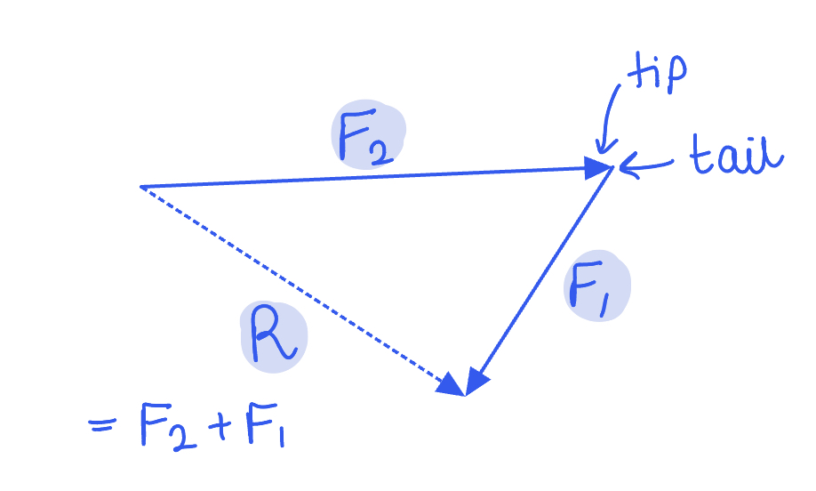

## Q17 — medium — 1 marks · multiple-choice-questions

### 1() — 1 marks
**Correct answer: A** — 

**Final answer:** **The correct answer is A**

- When the ball is thrown vertically upward, it has an initial positive velocity
- Due to gravity, the ball experiences a constant downward acceleration equal to $g$
- This constant negative acceleration means the velocity decreases linearly with time
- The velocity becomes zero at the peak of its trajectory, then becomes negative as the ball falls back down, increasing in magnitude linearly
- Graph A correctly represents this linear decrease in velocity from a positive value, through zero, to a negative value

**B, C** & **D** are incorrect as the gradient of a velocity-time graph represents acceleration, and for an object under gravity, the acceleration in the vertical plane is $-g$. So, the graph should show a constant, negative gradient.

## Q18 — hard — 1 marks · multiple-choice-questions

### 7() — 1 marks
**Correct answer: B** — The velocities of the objects as they reach the floor.

**Final answer:** **The incorrect answer is ****B ****because:**

- The objects will both accelerate vertically at the same rate, *g,* which has a constant magnitude and direction

  - This eliminates answer **A**
- Both objects start with the same speed and mass - therefore they start with the same amount of energy in their kinetic store

  - The same amount of energy is transferred from their GPE stores to their kinetic stores, so their final kinetic energies are also equal
  - This eliminates answer **D**
- If their final and initial kinetic energies are the same, their increase in speed (or magnitude of velocity) is the same

  - This eliminates answer **C**
- The second object's velocity has a horizontal component

  - This horizontal component is still present at the floor, so the velocities' directions are different
  - Answer **B** is incorrect - the **velocities** are different

- The change in kinetic energy is the same for each object, as shown in the diagram below

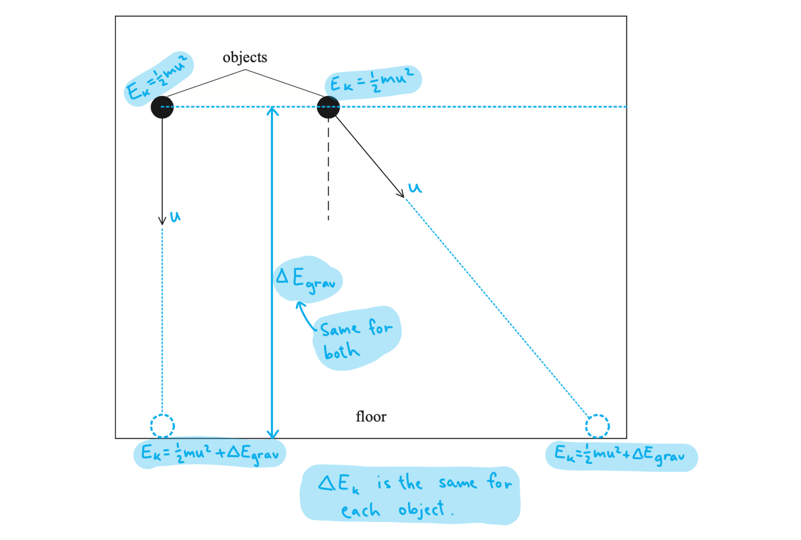

## Q19 — hard — 1 marks · multiple-choice-questions

### 3() — 1 marks
**Correct answer: A** — 

**Final answer:** **The correct answer is ****A**** because:**

- Velocity is equal to $\frac{displacement}{time}$

  - Hence, velocity = the gradient of a displacement-time graph

- Consider graph **A**:

  1. Gradient of the **d-t graph** = maximum in the **positive** direction **v-t graph** = maximum velocity in +v quadrant
  2. Gradient of the **d-t graph** = decreasing in the **positive** direction **v-t graph** = decreasing velocity in +v quadrant
  3. Gradient of the **d-t graph** = **zero** at maximum displacement **v-t graph** = zero velocity at maximum displacement
  4. Gradient of the **d-t graph** = increasing in the **negative** direction **v-t graph** = increasing velocity in −v quadrant
  5. Gradient of the **d-t graph** = maximum in the **negative** direction **v-t graph** = maximum velocity −v quadrant

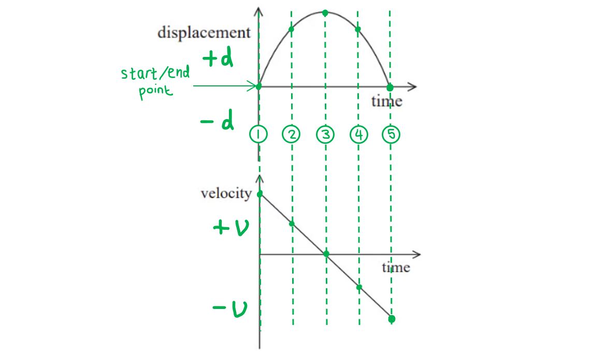

- Therefore, graph** A** is consistent with the velocity-time graph shown

**B **is incorrect as this graph shows a constant zero velocity

**C **is incorrect as this graph shows a velocity which starts and ends at zero and increases linearly to a maximum velocity and then decreases linearly again

**D **is incorrect as this graph shows a zero velocity at a maximum positive displacement and then instantaneously at a maximum negative displacement
