# Exam Questions — Motion
**1. Mechanics & Materials** · Edexcel International A Level (IAL) Physics (YPH11)
> Source: [https://www.savemyexams.com/international-a-level/physics/edexcel/19/topic-questions/1-mechanics-and-materials/motion/structured-questions/](https://www.savemyexams.com/international-a-level/physics/edexcel/19/topic-questions/1-mechanics-and-materials/motion/structured-questions/) · 19 questions · total 57 marks

## Q1 — medium — 8 marks · structured-questions

### 13((a)) — 2 marks — command: complete — structured — from paper Oct/Nov 2021 · WPH11/01
A sledge accelerates, due to gravity, from rest down a frictionless slope. Air resistance can be ignored. The slope is at an angle of 6.9° to the horizontal, as shown.

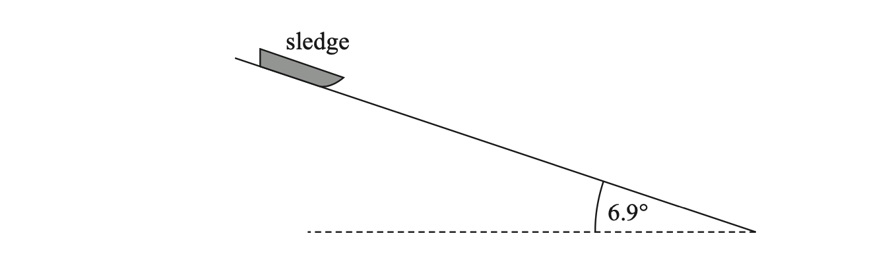

Complete the free‐body force diagram below for the sledge.

`⚫`

### 13((b)) — 6 marks — command: multiple — structured — from paper Oct/Nov 2021 · WPH11/01
The slope has a total length of 60m

i) Show that the initial acceleration of the sledge along the slope is about 1 m s−2

Initial acceleration = ........................................ **(2)**

ii) Determine the speed of the sledge at the end of the slope.

Speed at end of slope = .................................... **(2)**

iii) Determine the time taken for the sledge to travel to the end of the slope.

**    **                           Time taken = ...................................... **(2)**

## Q2 — medium — 7 marks · structured-questions

### 12((a)) — 3 marks — command: show — structured — from paper 2021 June · WPH11/01
A trolley accelerates from rest at point A, down a straight track to point B. The trolley then continues along a horizontal track to point C, as shown.

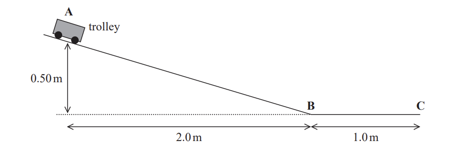

The effects of air resistance and friction are negligible.

Show that the trolley reaches point B with a speed of about 3 m s−1 .

### 12((b)) — 4 marks — command: determine — structured — from paper 2021 June · WPH11/01
Determine the time taken by the object to move from point A to point C.

Time taken = ..........................

## Q3 — medium — 8 marks · structured-questions

### 14((a)) — 5 marks — command: deduce — structured — from paper 2021 June · WPH11/01
A skier moving at 25 m s−1 skis off a ramp. The ramp is angled upwards at 10° to the horizontal, as shown.

There is a flat surface that starts 30 m from the ramp. The flat surface is 2.9 m below the ramp.

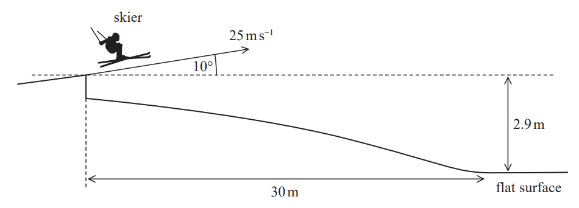

Deduce whether the skier reaches the flat surface before landing. You may ignore any effects of air resistance.

### 14((b)) — 3 marks — command: calculate — structured — from paper 2021 June · WPH11/01
Another skier travels along the horizontal surface with an initial speed of 23 m s−1 .

She comes to rest after travelling a distance of 43 m.

Calculate the average force required to bring the skier to rest.

mass of skier = 63 kg

Average force = .............................

## Q4 — hard — 9 marks · structured-questions

### 16((a)) — 3 marks — command: show — structured — from paper Oct/Nov 2021 · WPH11/01
An explosion projects a rock into the air with a speed of 50 m s–1 at an angle to the horizontal of 40°.

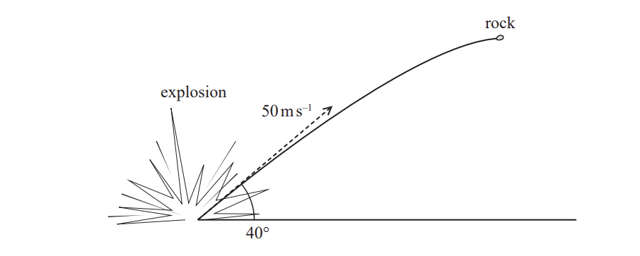

Show that the rock would reach its maximum height about 3 s after the explosion.

### 16((b)) — 6 marks — command: deduce — structured — from paper Oct/Nov 2021 · WPH11/01
The rock moves in the direction of a hill. The side of the hill is at 20° to the horizontal, as shown.

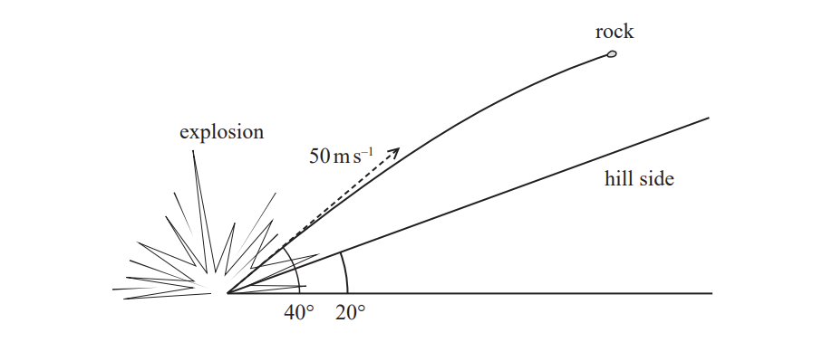

After a certain distance, the rock lands on the side of the hill.

Deduce whether the rock hits the ground before it reaches its maximum possible height.

## Q5 — hard — 9 marks · structured-questions

### 18((a)) — 2 marks — command: calculate — structured — from paper 2022 Jan · WPH11/01
A stunt motorcyclist wants to jump across a river to land on the other side. The diagram shows the motorcyclist driving off a ramp at the edge of a river.

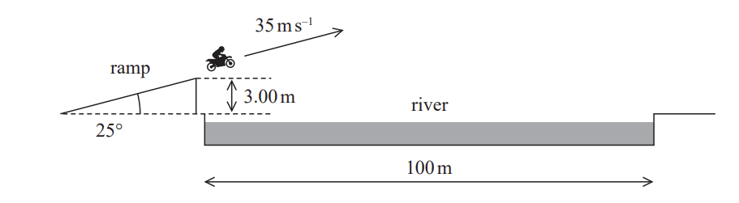

The ramp is at an angle of 25° to the horizontal and the height at the end of the ramp is 3.0 m. The width of the river is 100 m. The initial velocity of the motorcyclist is 35 m s−1.

Calculate the horizontal and vertical components of the motorcycle's initial velocity as it leaves the ramp.

Horizontal component = ......................

Vertical component = ......................

### 18((b)) — 4 marks — command: deduce — structured — from paper 2022 Jan · WPH11/01
Deduce whether the rider lands on the other side of the river.

The effects of air resistance can be ignored.

### 18((c)) — 3 marks — command: explain — structured — from paper 2022 Jan · WPH11/01
Explain how air resistance would affect the jump.

## Q6 — hard — 3 marks · structured-questions

### 1() — 3 marks — command: calculate — structured
During a test run, the train accelerates uniformly from rest to a maximum speed of $505\text{km h}^{-1}$ and maintains this speed for $130\text{s}$. The train decelerates uniformly at the same rate and completes the test in a total time of $480\text{s}$.

Calculate the average speed of the train during the test run.

## Q7 — easy — 1 marks · multiple-choice-questions

### 2() — 1 mark — multiple_choice — from paper 2022 Jan · WPH11/01
Physical quantities may be vectors or scalars.

Which row of the table is correct?

|   | **Force** | **Mass** | **Acceleration** |
|---|---|---|---|
| **A** | scalar | vector | scalar |
| **B** | scalar | scalar | vector |
| **C** | vector | vector | scalar |
| **D** | vector | scalar | vector |
- **A.** 
- **B.** 
- **C.** 
- **D.** 

## Q8 — easy — 1 marks · multiple-choice-questions

### 1() — 1 mark — multiple_choice — from paper Oct/Nov 2021 · WPH11/01
Graphs can be used to represent the motion of an object.

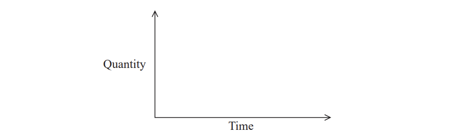

Which row in the table gives a quantity plotted on the $y$‐axis and the corresponding quantity represented by the gradient of the graph?

|   | **Quantity plotted on **$y$**‐axis** | **Gradient of graph** |
|---|---|---|
| **A** | displacement | acceleration |
| **B** | velocity | acceleration |
| **C** | acceleration | velocity |
| **D** | acceleration | displacement |
- **A.** 
- **B.** 
- **C.** 
- **D.** 

## Q9 — easy — 1 marks · multiple-choice-questions

### 4() — 1 mark — multiple_choice — from paper Oct/Nov 2021 · WPH11/01
A tennis ball is moving through the air. The diagram shows the horizontal and vertical components of its velocity.

Which of the following expressions gives the magnitude of the velocity in $ms^{--1}$?
- **A.** $\frac{13.2}{\mathrm{sin}22.6^{\circ}}$
- **B.** $13.2\times\mathrm{sin}22.6^{\circ}$
- **C.** $\frac{5.5}{\mathrm{sin}22.6^{\circ}}$
- **D.** $5.5\times\mathrm{sin}22.6^{\circ}$

## Q10 — easy — 1 marks · multiple-choice-questions

### 6() — 1 mark — multiple_choice — from paper Oct/Nov 2021 · WPH11/01
A block of wood is stationary on a frictionless ramp as shown.

The block is held in place by a string. The weight of the block is $W$. The force applied to the block by the string is $F$.

A triangle of forces can be used to determine the magnitude and direction of the normal contact force $N$ acting on the block.

Which of the following triangles is correct?

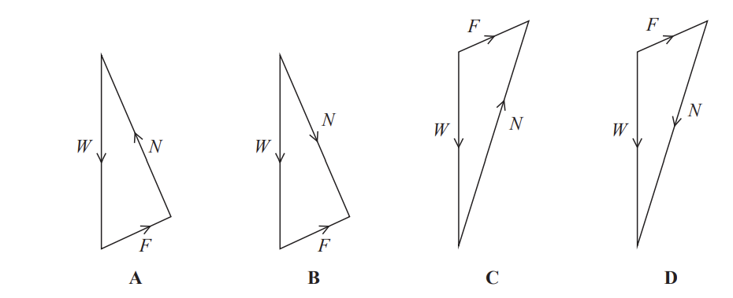
- **A.** 
- **B.** 
- **C.** 
- **D.** 

## Q11 — medium — 1 marks · multiple-choice-questions

### 1() — 1 mark — multiple_choice — from paper 2022 jan · WPH11/01
A student walks for 6 seconds. The displacement-time graph for the student is shown.

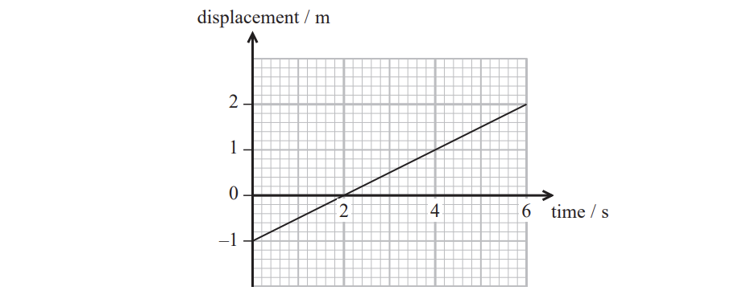

Which row of the table shows the final displacement and velocity of the student?

|   | **Displacement / m** | **Velocity / m s****–1** |
|---|---|---|
| **A** | 2.0 | 0.5 |
| **B** | 3.0 | 0.5 |
| **C** | 5.0 | 2.0 |
| **D** | 3.0 | 2.0 |
- **A.** 
- **B.** 
- **C.** 
- **D.** 

## Q12 — medium — 1 marks · multiple-choice-questions

### 5() — 1 mark — multiple_choice — from paper 2022 Jan · WPH11/01
An object on the Moon falls a vertical distance of 0.32 m, from rest, in a time of 0.63 s.

Which of the following expressions gives the acceleration due to gravity on the Moon in m s−2?
- **A.** $\frac{0.32}{2\times0.63}$
- **B.** $\frac{0.32}{2\times0.63^{2}}$
- **C.** $\frac{2\times0.32}{0.63^{2}}$
- **D.** $\frac{2\times0.32}{0.63}$

## Q13 — medium — 1 marks · multiple-choice-questions

### 7() — 1 mark — multiple_choice — from paper Oct/Nov 2021 · WPH11/01
A ball bearing falls vertically from rest through a distance of 50cm in a time of 0.32s.

Which expression gives the acceleration of the ball bearing in m s–2?
- **A.** 1 ÷ 0.322
- **B.** 0.5 ÷ 0.32
- **C.** 100 ÷ 0.322
- **D.** 50 ÷ 0.32

## Q14 — medium — 1 marks · multiple-choice-questions

### 1() — 1 mark — multiple_choice — from paper 2021 June · WPH11/01
Which of the following is a scalar quantity?
- **A.** weight
- **B.** momentum
- **C.** terminal velocity
- **D.** kinetic energy

## Q15 — medium — 1 marks · multiple-choice-questions

### 8() — 1 mark — multiple_choice — from paper 2021 June · WPH11/01
A constant forward force acts on a car. The car accelerates along a straight road. After a while, the speed of the car reaches a constant value.

Which graph shows the variation of acceleration with time for the car?

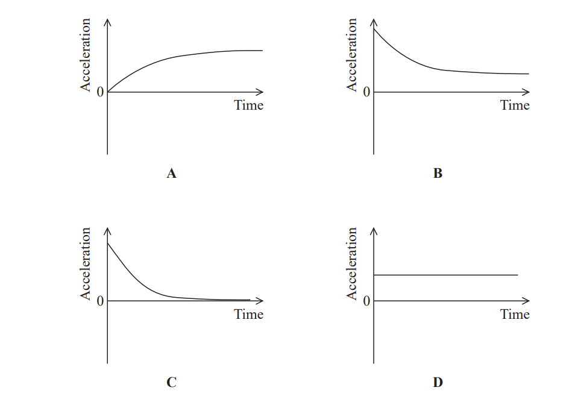
- **A.** 
- **B.** 
- **C.** 
- **D.** 

## Q16 — medium — 1 marks · multiple-choice-questions

### 10() — 1 mark — multiple_choice — from paper 2021 June · WPH11/01
Two forces *F*1 and *F*2 act on an object, as shown.

Which of the following is a correctly drawn scaled vector diagram for the resultant *R* of the forces *F*1 and *F*2 ?

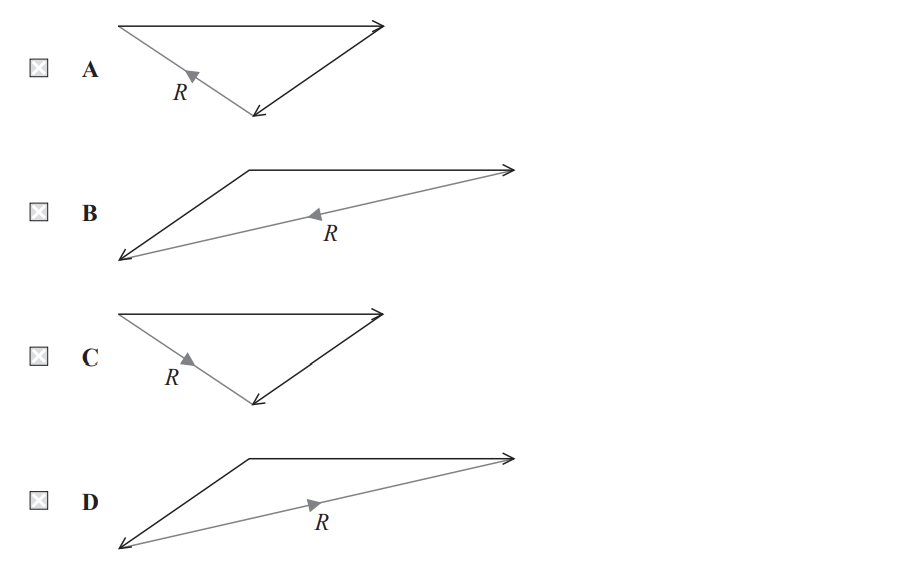
- **A.** 
- **B.** 
- **C.** 
- **D.** 

## Q17 — medium — 1 marks · multiple-choice-questions

### 1() — 1 mark — multiple_choice
A ball is thrown vertically upward. Assume air resistance is negligible.

Which of the following graphs shows how the vertical component of the velocity $v_{v}$ varies with time $t$ from when the ball is thrown to just before it hits the ground?

- **A.** 
- **B.** 
- **C.** 
- **D.** 

## Q18 — hard — 1 marks · multiple-choice-questions

### 7() — 1 mark — multiple_choice — from paper 2021 June · WPH11/01
Two identical objects with the same initial speed fall from the same height in a vacuum chamber, as shown. The arrows in the diagram show initial directions of travel of the objects.

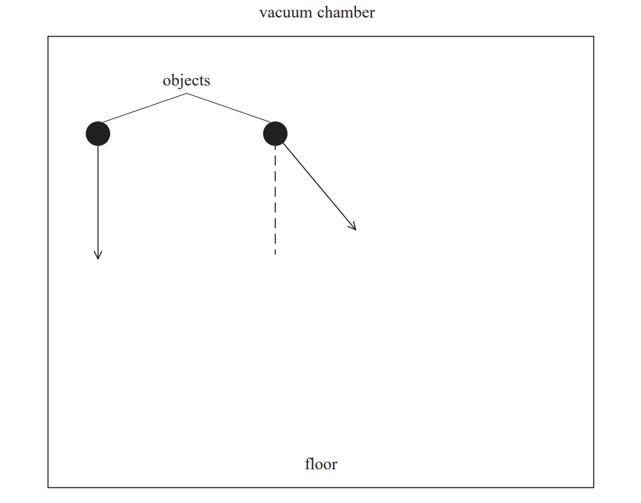

Which of the following quantities are **not** the same for both objects?
- **A.** The accelerations of the objects during the fall.
- **B.** The velocities of the objects as they reach the floor.
- **C.** The increase in the speeds of the objects during the fall.
- **D.** The kinetic energies of the objects as they reach the floor.

## Q19 — hard — 1 marks · multiple-choice-questions

### 3() — 1 mark — multiple_choice — from paper 2022 Jan · WPH11/01
The velocity-time graph for a particle is shown.

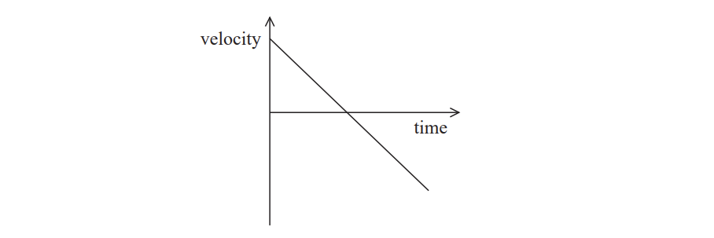

Which of the following is the displacement-time graph for this particle?

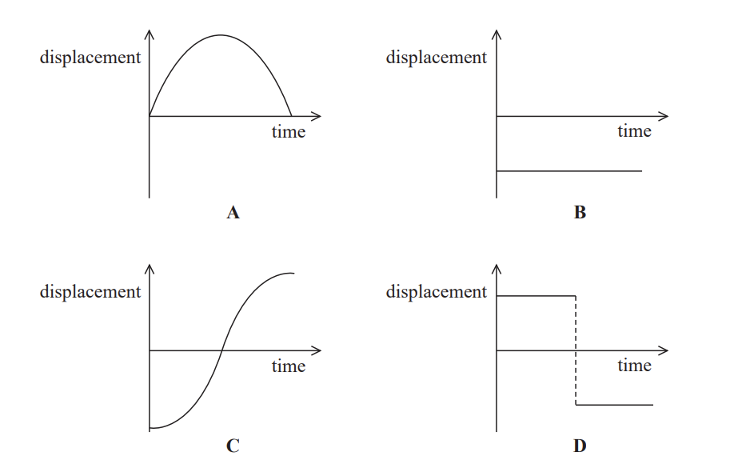
- **A.** 
- **B.** 
- **C.** 
- **D.** 
