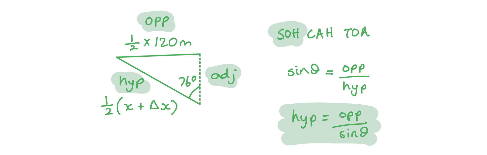
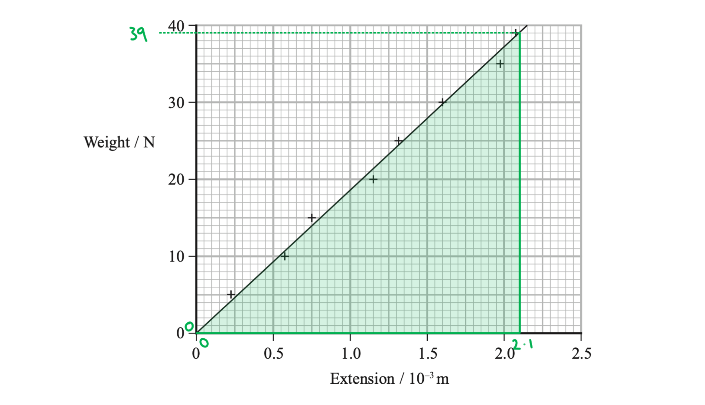
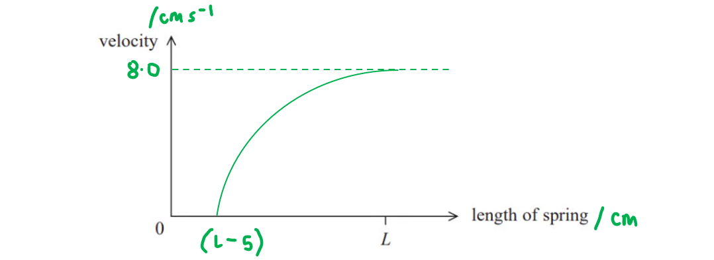

# Mark Schemes — Stretching Materials
**1. Mechanics & Materials** · Edexcel International A Level (IAL) Physics (YPH11)

## Q1 — medium — 9 marks · structured-questions

### 13((a)) — 3 marks
Show that the tension *T* in the rope is about 1.3 × 103 N:

- Use trignometry to resolve *T* vertically:  $\mathrm{cos}θ=\frac{adj}{hyp}=\frac{T_{v}}{T}$
- Resolving *T* vertically:  `T subscript v space equals space T space cos space open parentheses 76 degree close parentheses`** [1 mark]**
- When the forces are in equilibrium, Upward forces = Downward forces
- Hence, `W space equals space 2 T subscript v space equals space 2 T space cos space open parentheses 76 degree close parentheses`

Calculate the tension *T*:

- `T space equals space 1 half cross times fraction numerator W over denominator cos space open parentheses 76 degree close parentheses end fraction space equals space fraction numerator 650 over denominator 2 cross times cos space open parentheses 76 degree close parentheses end fraction` **[1 mark]**
- $T=1343N$ **[1 mark]**

**[Total: 3 marks]**

### 13((b)) — 6 marks
List the known quantities:

- Original length of rope, $x$ = 120 m
- Tension in rope, *T* = 1343 N
- Cross-sectional area of rope, *A* = 3.14 × 10−4 m2

i) Determine the strain in the rope while it is supporting the weight of the climber:

- Using trigonometry:  `1 half open parentheses x space plus space increment x close parentheses space equals fraction numerator space 60 over denominator sin space open parentheses 76 degree close parentheses end fraction space equals space 61.8 space straight m` **[1 mark]**

Determine the extension:

- `x space plus space increment x space equals space 2 cross times 61.8 space space space space space rightwards double arrow space space space space space increment x space equals space open parentheses 2 cross times 61.8 close parentheses space minus space x`
- `increment x space equals space open parentheses 2 cross times 61.8 close parentheses minus 120 space equals space 3.7 space straight m`

Determine the strain:

- Strain:  $ε=\frac{\Deltax}{x}=\frac{3.7}{120}=0.031$ **[1 mark]**
- $ε$ = 0.03 **or** 3% **[1 mark]**

ii) Determine the Young modulus of the rope material:

- Stress:  $σ=\frac{F}{A}=\frac{1343}{3.14\times10^{-4}}=4.28\times10^{6}\mathrm{Pa}$ **[1 mark]**
- Young Modulus:  $E=\frac{σ}{ε}=\frac{4.28\times10^{6}}{0.031}=1.38\times10^{8}\mathrm{Pa}$ **[1 mark]**
- `E space equals space 1.4 cross times 10 to the power of 8 space Pa space open parentheses 2 space straight s. straight f. close parentheses` **[1 mark]**

**[Total: 6 marks]**

- *For part (ii) remember that the force is the tension calculated in part (a)*

## Q2 — medium — 12 marks · structured-questions

### 17((a)) — 2 marks
Explain why the greater the length of a rope, the smaller the stiffness of the rope:

- The greater the length of the rope, the greater the extension ($\Deltax$) for a given force; **[1 mark]**
- Stiffness $k=\frac{F}{\Deltax}$ therefore stiffness decreases (if extension increases);** [1 mark]**

**[Total: 2 marks]**

### 17((b)) — 8 marks
i) Show that the stiffness *k* of the nylon rope is about 1.4 × 105 N m−1:

List the known quantities:

- Young modulus of nylon, *E *= 2.70 GPa = 2.70 × 109 Pa
- Overall length of rope before adding the load = 6.00 m
- Area of cross-section, *A* = 3.00 × 10−4 m2

Determine an equation for the young modulus, *E *and substitute in the values:

- $E=\frac{σ}{ε}$, $σ=\frac{F}{A}$ and $ε=\frac{\Deltax}{x}$
- `E equals fraction numerator open parentheses F over A close parentheses over denominator open parentheses fraction numerator increment x over denominator x end fraction close parentheses end fraction equals fraction numerator F x over denominator A increment x end fraction` **[1 mark]**

Write the equation in terms of *k*:

- $F=k\Deltax$
- $E=\frac{k\Deltax\timesx}{A\Deltax}=\frac{kx}{A}$

Rearrange for *k* and substitute in the values:

- `k space equals fraction numerator space E A over denominator x end fraction space equals space fraction numerator open parentheses 2.70 cross times 10 to the power of 9 close parentheses cross times open parentheses 3.00 cross times 10 to the power of 4 close parentheses over denominator 6.00 end fraction` **[1 mark]**
- $k=1.35\times10^{5}Nm^{-1}$ **[1 mark]**

ii) Determine the extension of the rope while the lift is taking place:

List the known quantities:

- Weight, *W* = 5.00 kN = 5000 N

Determine the tension in the rope, *T*:

- Tension in the rope is constant, therefore the tension on each side is half the weight
- $T=\frac{W}{2}=\frac{5000}{2}=2500N$ **[1 mark]**

Calculate the extension of the rope, Δx:

- $\Deltax=\frac{F}{k}=\frac{2500}{1.35\times105}$ **[1 mark]**
- Extension of rope = 1.85 × 10−2 m **[1 mark]**

iii) Calculate the work done in stretching the rope:

- `increment E subscript e l end subscript equals 1 half F increment x equals 1 half cross times 2500 cross times open parentheses 1.85 cross times 10 to the power of negative 2 end exponent close parentheses` **[1 mark]**
- Work done = 23.13 J **[1 mark]**

**[Total: 8 marks]**

- *The work done is the **energy transferred**, in this case, it is the **elastic potential energy*

### 17((c)) — 2 marks
Assess whether the stretching of the rope has a significant effect on the efficiency of the pulley system:

List the known quantities:

- Weight of the load, $F$ = 5000 N
- Distance moved, $\Deltas$= 1.5 m

Find the work done in lifting the load:

- $W=F\Deltas=5000\times1.5=7500J$ **[1 mark]**

Compare with the work done in stretching the rope:

- 23.1 J is much smaller than 7500 J therefore there is no significant effect; **[1 mark]**

**[Total: 2 marks]**

- *For the second mark you must write a **concluding** sentence, don't just leave your answer at the calculation!*

## Q3 — hard — 9 marks · structured-questions

### 14((a)) — 1 marks
State what is meant by the limit of proportionality:

Any **one** from:

- Maximum value of weight / force for which weight / force is proportional to extension; **[1 mark]**
- Point beyond which Hooke's Law no longer applies; **[1 mark]**
- Point beyond which weight/force is no longer proportional to extension; **[1 mark]**

**[Total: 1 mark]**

- *"Point beyond which graph line ceases to be straight" would have gained a mark here in an exam, but less specific language like this does not always guarantee a mark*

  - *It is best to be sure and use **specific** physics language - for example "the point at which a force-extension graph line ceases to be straight" is much better*

### 14((b)) — 5 marks
i) Determine the gradient of the graph:

Use a triangle on the graph to determine the gradient:

- <u>Large</u> (Δ*x* > 1.5) triangle to determine gradient; **[1 mark]**

Calculate gradient:

- `gradient italic space equals space fraction numerator straight capital delta y over denominator straight capital delta x end fraction space equals space fraction numerator 39 space minus space 0 over denominator open parentheses 2.1 space cross times space 10 to the power of negative 3 end exponent close parentheses space minus space 0 end fraction space equals space 18 space 570 space equals space 18 space 600 space straight N space straight m to the power of negative 1 end exponent`
- $\mathrm{gradient}=19000Nm^{-1}$ (accepted answers round to 18 000 or 19 000 to 2 s.f.) **[1 mark]**

ii) Determine the Young modulus of stainless steel using your value for the gradient:

List the known quantities:

- gradient of weight vs extension, $k$ = 18 600 N m-1
- Unstretched wire length, $x$ = 2.6 m
- Wire diameter, $d$ = 5.6 × 10-4 m

From the list of data, formulae and relationships:

- $E=\frac{σ}{ε}$ (Young's modulus)
- $σ=\frac{F}{A}$ (stress)
- $ε=\frac{Δx}{x}$ (strain)

Substitute the equations for stress and strain into the equation for Young's modulus:

- `E space equals space fraction numerator bevelled F over A over denominator bevelled fraction numerator straight capital delta x over denominator x end fraction end fraction space equals space fraction numerator F x over denominator open parentheses straight capital delta x close parentheses A end fraction`

Substitute the gradient from part **(i)**:

- $k=\frac{ΔF}{Δx}$
- $Ε=\frac{kx}{A}$ **[1 mark]**

Calculate the cross-sectional area:

- `A space equals space straight pi r squared space equals space straight pi open parentheses d over 2 close parentheses squared space equals space fraction numerator straight pi d squared over denominator 4 end fraction`
- `A space equals space fraction numerator straight pi space cross times space open parentheses 5.6 space cross times space 10 to the power of negative 4 end exponent close parentheses squared over denominator 4 end fraction space equals space 2.46 space cross times space 10 to the power of negative 7 end exponent space straight m squared` **[1 mark]**

Calculate $E$ using this:

- `capital epsilon space equals space fraction numerator k x over denominator A end fraction space equals space fraction numerator open parentheses 18 space 600 close parentheses space cross times space 2.6 over denominator open parentheses 2.46 space cross times space 10 to the power of negative 7 end exponent close parentheses end fraction space equals space 1.963 space cross times space 10 to the power of 11 space Pa`
- $\mathrm{Young}'s\mathrm{modulus}=2.0\times10^{11}\mathrm{Pa}$ (range of 1.9 to 2.0 × 1011 Pa accepted) **[1 mark]**

**[Total: 5 marks]**

- *When calculating a gradient, make the triangle as **large** as possible*
- *Use values at points where the graph crosses through grid lines - this takes the guesswork out of trying to figure out whether the point of the graph is "halfway" up a small box or "0.6" of the way up it*

### 14((c)) — 3 marks
Deduce whether it is safe for the student to increase the weight to 100.0 N:

List the known quantities:

- Cross-sectional area of wire, $A$ = 2.46 × 10-7 m2
- Breaking stress, $σ_{max}$ = 480 MPa = 4.80 × 108 Pa

Use the stress equation to determine the maximum force:

- $σ_{max}=\frac{F_{max}}{A}$
- `F subscript m a x end subscript space equals space A sigma subscript m a x end subscript space equals space open parentheses 2.46 space cross times space 10 to the power of negative 7 end exponent close parentheses space cross times space open parentheses 4.80 space cross times space 10 to the power of 8 close parentheses` **[1 mark]**
- $\mathrm{max} \mathrm{force}=118N$ **[1 mark]**

Compare this to the student's proposed added weight:

- 118 N is greater than 100 N <u>therefore</u> it is safe; **[1 mark]**

**[Total: 3 marks]**

- *Alternatively, you could have calculated the stress caused by 100.0 N and determined whether it was below the breaking stress of 480 MPa*

## Q4 — hard — 6 marks · structured-questions

### 15() — 6 marks
Explain why the floor exerts a forward force on the car and how this force affects the motion of the car as the spring returns to its original state:

The following list is the 'indicative marking points'. Stating all six will score four marks, less than six is marked according to a scale given below. The remaining two marks are given for the linking and explanation:

*Indicative Content (IC):*

1. There is a (backward) force / friction on floor from wheels / car
2. Newton's Third Law implies forward / opposite force from floor
3. Compression / deformation of spring reduces (as car moves forward)
4. (Resultant) force is proportional to compression / deformation of spring **OR **reference to Hooke's Law
5. Acceleration is proportional to resultant force **OR** reference to $F=ma$
6. Acceleration reduces (as distance travelled increases) **OR** acceleration becomes zero once spring returns to original state

**An example answer which scores six marks is:**

As the wheels rotate, there is a backward friction force on the floor from the wheels **[1]**. As a result of this, **[linkage]** the floor exerts an equal and opposite forward force on the wheels, implied by Newton's third law **[2]**. The spring's compression decreases **[3]**** **as the car moves and that compression is proportional to the forward force, according to $ΔF=kΔx$ **[4]**. Acceleration is proportional to this resultant force **[5]**, therefore **[linkage] **acceleration reduces to zero as the spring returns to its original state **[6]**.

- Six indicative marking points; **[4 marks]**
- Linkage made between forward and backward force **AND** link between reducing spring compression and reducing acceleration; **[2 marks]**

**[Total: 6 marks]**

- *The starred written questions assess your ability to **link** **facts** in a logically **structured** answer.*
- *In the table below, **indicative content (IC) points** are form the list above. The second column shows the **maximum marks** you can earn from these **statements**.*

  - *As you see, **6** correct **statements** are worth a total of **4 marks**.*
- *The third column is for ‘**linkage marks**’. This means how well you linked the statements in your argument. The maximum linkage mark depends on the number of statements. *

  - *Even if you linked well, only **one** linkage mark is available if you only mentioned **4 out of 6** IC points*
- *To score 6/6 marks, you will need a **full** **paragraph**, using a "point, evidence, explain" structure, **as well as** using your Physics to link together at least six points from the content you have learned. *

| > *IC points* | > *IC mark* | > *Maximum linkage marks available* | > *Maximum final mark* |
|---|---|---|---|
| > *6* | > *4* | > *2* | > *6* |
| > *5* | > *3* | > *2* | > *5* |
| > *4* | > *3* | > *1* | > *4* |
| > *3* | > *2* | > *1* | > *3* |
| > *2* | > *2* | > *0* | > *2* |
| > *1* | > *1* | > *0* | > *1* |
| > *0* | > *0* | > *0* | > *0* |

## Q5 — hard — 10 marks · structured-questions

### 16((a)) — 2 marks
Show that the kinetic energy of the ball just after launching is about 4 × 10−5 J:

List the known quantities:

- Mass of ball, *m* = 12 g = 12 × 10−3 kg
- Speed of launch, *v* = 8.0 cm s−1 = 8.0 × 10−2 m s−1

Calculate the kinetic energy:

- $E_{k}=\frac{1}{2}mv^{2}$
- `E subscript k space equals space 1 half cross times open parentheses 12 cross times 10 to the power of negative 3 end exponent close parentheses cross times open parentheses 8.0 cross times 10 to the power of negative 2 end exponent close parentheses squared` **[1 mark]**
- *E**k* = 3.84 × 10−5 J **[1 mark]**

**[Total: 2 marks]**

### 16((b)) — 2 marks
Determine the force on the ball when the spring is released:

List the known quantities:

- Kinetic energy after launch, *E**k* = 3.84 × 10−5 J
- Spring compression, Δ*x *= 5.0 cm = 0.05 m

Since the elastic energy stored in the spring is equal to the kinetic energy after launch:

- $\DeltaE_{el}=\frac{1}{2}F\Deltax$
- $\DeltaE_{el}=\frac{1}{2}\timesF\times0.05=3.84\times10^{-5}J$ **[1 mark]**
- `F space equals space fraction numerator 2 cross times open parentheses 3.84 cross times 10 to the power of negative 5 end exponent close parentheses over denominator 0.05 end fraction`
- *F* = 1.54 × 10−3 N **[1 mark]**

**[Total: 2 marks]**

### 16((c)) — 2 marks
Determine the stiffness of the spring:

- Hooke's Law:  $F=k\Deltax$
- $1.54\times10^{-3}=k\times0.05$ **[1 mark]**
- $k=\frac{1.54\times10^{-3}}{0.05}$ = 0.0308
- Stiffness = 0.031 N m−1 **[1 mark]**

**[Total: 2 marks]**

### 16((d)) — 4 marks
The graph showing the variation of launch velocity with the length of the spring is as follows:

- Line has initially decreasing positive gradient; **[1 mark]**
- Line starts at *v* = 0 and a non-zero value of length; **[1 mark]**
- Line levels off to horizontal at length = *L*; **[1 mark]**
- Final velocity marked as 8.0 cm s−1 **or** original compressed length marked as (*L* − 5) in cm; **[1 mark]**

**[Total: 4 marks]**

- *If you look at this and think this is a difficult graph drawing question, then you're right, not many students could get this one in the exam!*
- *Here, it's worth taking some time to think about the situation given:*

- *At the point at which the spring is released from maximum compression:*

  - *The ball is initially at rest, so **v** = 0 when length = (**L **− 5) cm*
  - *The spring cannot have a length of 0, therefore, the graph should not go through the origin*

- *At the point the ball is launched, the spring reaches its original length:*

  - *The ball has a launch velocity of **v** = 8 cm s**−1** when length = **L*

- *Then, the hard part is considering how **v** will vary between (**L **− 5) and **L:*

  - *If the acceleration was constant, then the gradient would be constant*
  - *However, considering the relationship between force and extension (**F** = **k**Δ**x**) and Newton's second law (**F** = **ma**), the acceleration is **not** going to be constant*

> *Since  **F** ∝ Δ**x**  and  **F** ∝ **a** *

> *And ** E**el** ∝ **E**k**  *

> *This means  **F** ∝ **v**2*

> *∴** a **∝** v**2** ∝ Δ**x*

- *This means that a graph of **v**2** against length would give a straight line, but **v** against length will not*

  - *For large compressions, the gradient will be** larger** than at small compressions*
  - *Hence, the gradient will **decrease** as the length is increased*

## Q6 — medium — 1 marks · multiple-choice-questions

### 8() — 1 marks
**Correct answer: A** — $4T$

**Final answer:** **The correct answer is ****A**** because:**

- Stress is given by $σ=\frac{F}{A}$ therefore, $T=σA$
- Cross-sectional area is $πr^{2}$ therefore, $T=σπr^{2}$

  - Hence, $T\proptor^{2}$

- If the diameter is doubled, then the radius is doubled

  - Therefore, `T space proportional to space open parentheses 2 r close parentheses squared space space space space space rightwards double arrow space space space space space T space proportional to space 4 r squared`

- Doubling the diameter will increase the tension force by a factor of 4

  - This is answer **A**

## Q7 — medium — 1 marks · multiple-choice-questions

### 3() — 1 marks
**Correct answer: C** — $\frac{2E}{3}$

**Final answer:** **The correct answer is ****C**** because:**

- The equation for elastic strain energy is $ΔE_{el}=\frac{1}{2}FΔx$
- Compared to S1, the force is a factor of 2 larger and the extension is a factor of 3 smaller for S2
- $E_{2}=\frac{2\timesE}{3}$ which is option **C**

## Q8 — medium — 1 marks · multiple-choice-questions

### 5() — 1 marks
**Correct answer: D** — $x-\frac{Fx}{AE}$

**Final answer:** **The correct answer is ****D**** because:**

- The equation for tensile strength is $σ=\frac{F}{A}$
- The equation for tensile strain is is $ε=\frac{\Deltax}{x}$
- The equation for the Young modulus is $E=\frac{σ}{ε}$
- Combining these equations gives:

  - `E equals fraction numerator open parentheses F over A close parentheses over denominator fraction numerator increment x over denominator x end fraction end fraction equals fraction numerator F x over denominator A increment x end fraction`
- Rearranging for change in length gives:

  - $\Deltax=\frac{Fx}{AE}$
- Since the force is compressive, the new length is equal to $x-\Deltax$
- Therefore the expression is:

  - $x-\frac{Fx}{AE}$

## Q9 — medium — 1 marks · multiple-choice-questions

### 9() — 1 marks
**Correct answer: D** — the yield point of copper

**Final answer:** **The correct answer is ****D**** because:**

- The point just before the gradient of the stress-strain graph becomes negative is the yield point

**A** is incorrect as the fracture point is found at the extreme end of the graph

**B** is incorrect as proportionality ends **before** point X is reached (when the line is no longer straight)

**C** is incorrect as point X is not the highest point reached by the graph and therefore is not the maximum tensile stress in the rod

## Q10 — medium — 1 marks · multiple-choice-questions

### 1() — 1 marks
**Correct answer: D** — $12x$

**Final answer:** **The correct answer is D**

- The extension of a wire under a tensile load follows from the definition of the Young modulus

$E=\frac{σ}{ε}$

$E=\frac{F}{A}\times\frac{L}{x}$

- The cross-sectional area of a wire is

`A space equals space straight pi r squared space equals space straight pi open parentheses d over 2 close parentheses squared space equals space fraction numerator straight pi d squared over denominator 4 end fraction`

- Rearrange for extension

$x=\frac{4FL}{Eπd^{2}}$

- For the second wire, $L\rightarrow3L$ and $d\rightarrowd/2$, with $F$ and $E$ unchanged

`x apostrophe space equals space fraction numerator 4 F open parentheses 3 L close parentheses over denominator E straight pi open parentheses d divided by 2 close parentheses squared end fraction space equals space 12 cross times fraction numerator 4 F L over denominator E straight pi d squared end fraction`

$x'=12x$
