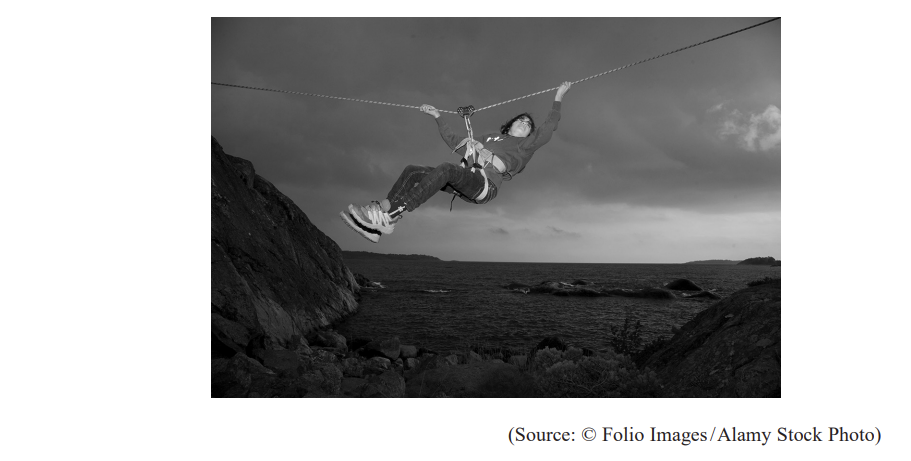
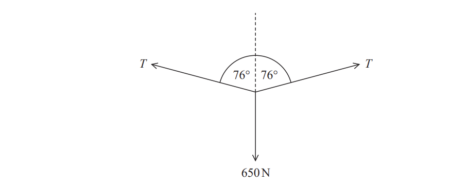
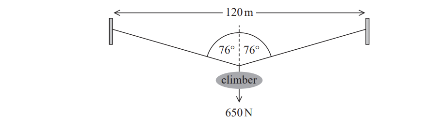
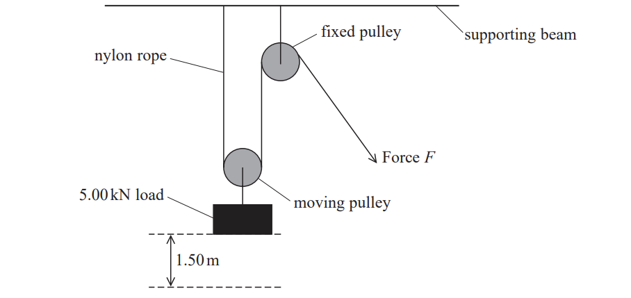
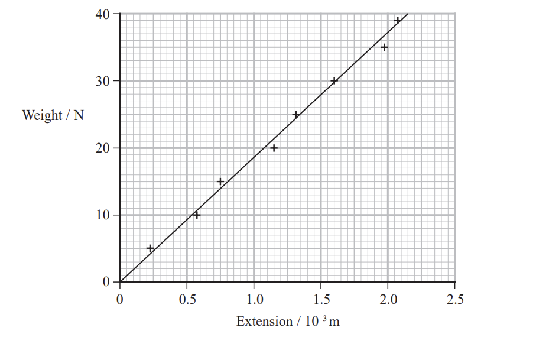
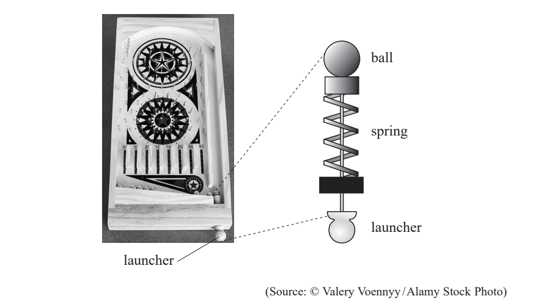
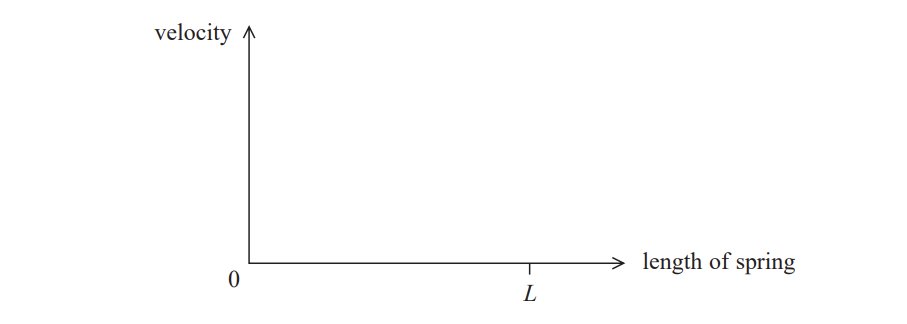
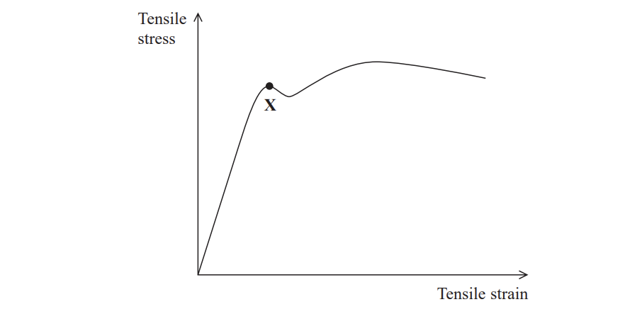

# Exam Questions — Stretching Materials
**1. Mechanics & Materials** · Edexcel International A Level (IAL) Physics (YPH11)
> Source: [https://www.savemyexams.com/international-a-level/physics/edexcel/19/topic-questions/1-mechanics-and-materials/stretching-materials/structured-questions/](https://www.savemyexams.com/international-a-level/physics/edexcel/19/topic-questions/1-mechanics-and-materials/stretching-materials/structured-questions/) · 10 questions · total 51 marks

## Q1 — medium — 9 marks · structured-questions

### 13((a)) — 3 marks — command: show — structured — from paper 2022 Jan · WPH11/01
The Tyrolean traverse is a technique for crossing a deep valley. The photograph shows a climber crossing a river using this technique. The climber moves along a rope suspended from the bank on either side of the river.

The free-body force diagram for the climber is shown below. The weight of the climber is 650 N.

Show that the tension *T* in the rope is about 1.3 × 103 N.

### 13((b)) — 6 marks — command: determine — structured — from paper 2022 Jan · WPH11/01
The rope has an unstretched length of 120 m as shown below.

i) Determine the strain in the rope while it is supporting the weight of the climber.

You may ignore the weight of the rope.

Strain = ..................................**(3)**

ii) The rope has a cross-sectional area of 3.14 × 10−4 m2

Determine the Young modulus of the rope material.

Young modulus = ..................................**(3)**

## Q2 — medium — 12 marks · structured-questions

### 17((a)) — 2 marks — command: explain — structured — from paper 2021 June · WPH11/01
A pulley system is used to lift a 5.00 kN load through a height of 1.50 m. The system consists of one fixed pulley and the other pulley can move. The pulleys are connected by a nylon rope, as shown.

The nylon rope will stretch when it is used in this way. The weight of the pulleys and the rope can be ignored, and you may assume that there is no friction in the pulleys.

The properties of the nylon rope are:

| Young modulus of nylon | 2.70 GPa |
|---|---|
| overall length of rope before adding the load | 6.00 m |
| area of cross-section | 3.00 × 10−4 m2 |

The greater the length of a rope, the smaller the stiffness of the rope.

Explain why.

### 17((b)) — 8 marks — command: multiple — structured — from paper 2021 June · WPH11/01
i) Show that the stiffness k of the nylon rope is about 1.4 × 105 N m−1 .

**(3)**

ii) The pulley system lifts the 5.00 kN weight at a steady rate.

Determine the extension of the rope while the lift is taking place.

Extension of rope = ............................**(3)**

iii) Calculate the work done in stretching the rope.

Work done in stretching rope = ..........................**(2)**

### 17((c)) — 2 marks — command: assess — structured — from paper 2021 June · WPH11/01
Assess whether the stretching of the rope has a significant effect on the efficiency of the pulley system.

## Q3 — hard — 9 marks · structured-questions

### 14((a)) — 1 mark — command: state — structured — from paper Oct/Nov 2021 · WPH11/01
A student carried out an experiment to determine the Young modulus of a sample of stainless steel in the form of a wire. The student added weights to the wire and measured the corresponding extensions.

The wire had an unstretched length of 2.6 m. The diameter of the wire was 5.6 × 10–4 m.

The student plotted a graph of weight against extension. The graph showed that the limit of proportionality was not exceeded.

State what is meant by the limit of proportionality.

### 14((b)) — 5 marks — command: determine — structured — from paper Oct/Nov 2021 · WPH11/01
The student's graph is shown below.

i) Determine the gradient of the graph. ** **

Gradient = ................................................**(2)**

ii) Determine the Young modulus of stainless steel using your value for the gradient.

** **Young modulus = ........................................**(3)**

### 14((c)) — 3 marks — command: deduce — structured — from paper Oct/Nov 2021 · WPH11/01
The breaking stress for this stainless steel is known to be 480 MPa.

Deduce whether it is safe for the student to increase the weight to 100.0 N.

## Q4 — hard — 6 marks · structured-questions

### 15() — 6 marks — command: explain — structured — from paper Oct/Nov 2021 · WPH11/01
*The photograph shows a toy car that contains a spring. Pulling the car backwards along the floor compresses the spring. Energy is stored in the compressed spring.

The car is released and the spring returns to its original state. There is a forward force on the car from the floor and the car moves forwards.

Explain why the floor exerts a forward force on the car and how this force affects the motion of the car as the spring returns to its original state.

## Q5 — hard — 10 marks · structured-questions

### 16((a)) — 2 marks — command: show — structured — from paper 2022 Jan · WPH11/01
The photograph shows a toy pinball machine. The launcher is pulled back, compressing a spring. The spring obeys Hooke’s law. When the launcher is released, the spring returns to its original length and a small ball is launched horizontally into the machine.

When the launcher is pulled back, the spring is compressed by 5.0 cm. When the spring is released, the ball is launched at a speed of 8.0 cm s−1.

Show that the kinetic energy of the ball just after launching is about 4 × 10−5 J.

mass of ball = 12 g

### 16((b)) — 2 marks — command: determine — structured — from paper 2022 Jan · WPH11/01
Determine the force on the ball when the spring is released.

Force = ................................

### 16((c)) — 2 marks — command: determine — structured — from paper 2022 Jan · WPH11/01
Determine the stiffness of the spring.

Stiffness = ..............................

### 16((d)) — 4 marks — command: sketch — structured — from paper 2022 Jan · WPH11/01
The spring returns to its original length* L*.

Sketch a graph, on the axes below, to show how the velocity of the ball varies with the length of the spring.

## Q6 — medium — 1 marks · multiple-choice-questions

### 8() — 1 mark — multiple_choice — from paper 2022 Jan · WPH11/01
A wire breaks when a tensile force *T* is applied. A second wire, made of the same material, has twice the diameter.

Which of the following is the force required to break the second wire?
- **A.** $4T$
- **B.** $2T$
- **C.** $\frac{T}{2}$
- **D.** $\frac{T}{4}$

## Q7 — medium — 1 marks · multiple-choice-questions

### 3() — 1 mark — multiple_choice — from paper Oct/Nov 2021 · WPH11/01
Two different springs, $S_{1}$ and $S_{2}$, are suspended from a fixed support. Masses are attached to the bottom of $S_{1}$ and $S_{2}$ as shown.

The extension of $S_{1}$ is $x$, and the extension of $S_{2}$ is $\frac{x}{3}$. The elastic strain energy in spring $S_{1}$ is $E$.

Which of the following is the elastic strain energy in spring $S_{2}$?
- **A.** $6E$
- **B.** $\frac{3E}{2}$
- **C.** $\frac{2E}{3}$
- **D.** $\frac{E}{6}$

## Q8 — medium — 1 marks · multiple-choice-questions

### 5() — 1 mark — multiple_choice — from paper 2021 June · WPH11/01
A compressive force *F* is applied to an object made of a material with Young modulus *E*. The original length of the object in the direction of the force is *x*, and its cross‐sectional area is *A*.

Which expression gives the length of the object after the force is applied?
- **A.** $x-\frac{AE}{Fx}$
- **B.** $x+\frac{Fx}{AE}$
- **C.** $x+\frac{AE}{Fx}$
- **D.** $x-\frac{Fx}{AE}$

## Q9 — medium — 1 marks · multiple-choice-questions

### 9() — 1 mark — multiple_choice — from paper 2021 June · WPH11/01
A copper rod was placed under tensile stress and the tensile strain in the rod was measured.

The graph shows how the tensile stress required to cause a tensile strain in the rod depends upon the tensile strain.

What does point X represent?
- **A.** the fracture point of the rod
- **B.** the limit of proportionality for copper
- **C.** the maximum tensile stress in the rod
- **D.** the yield point of copper

## Q10 — medium — 1 marks · multiple-choice-questions

### 1() — 1 mark — multiple_choice
A wire of length $L$ and diameter $d$ extends by $x$ when a force $F$ is applied.

The wire is replaced with a second wire of the same material, of length $3L$ and diameter $\frac{d}{2}$. The same force $F$ is applied to the second wire.

What is the extension of the second wire?
- **A.** $\frac{1}{6}x$
- **B.** $\frac{3}{2}x$
- **C.** $6x$
- **D.** $12x$
