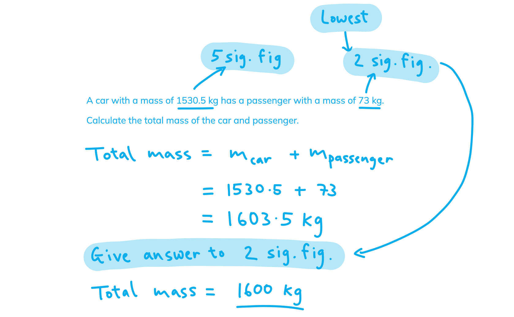

# Mark Schemes — Work, Energy & Power
**1. Mechanics & Materials** · Edexcel International A Level (IAL) Physics (YPH11)

## Q1 — medium — 4 marks · structured-questions

### 11((a)) — 2 marks
Calculate the increase in kinetic energy of the car as it accelerates down the slope:

List the known quantities:

- Mass of car, $m$ = 0.160 kg
- Speed of car at bottom of slope, $v$ = 2.6 m s–1

Substitute the known quantities into the equation for kinetic energy:

- $E_{k}=\frac{1}{2}mv^{2}$
- $E_{k}=\frac{1}{2}\times0.160\times2.6^{2}=0.541J$ **[1 mark]**
- Increase in kinetic energy = 0.54 J **[1 mark]**

**[Total: 2 marks]**

- *Increase in kinetic energy is final KE - initial KE*

  - *The initial KE is zero as the car is at rest, so increase in KE = final KE*

### 11((b)) — 2 marks
Calculate the vertical displacement of the car:

List the known quantities:

- Work done against frictional forces, $ΔW$ = 0.26 J
- Increase in kinetic energy, $ΔE_{k}$ = 0.54 J (from part (a))
- Mass of car, $m$ = 0.16 kg
- Acceleration of free fall, $g$ = 9.81 m s-2

Use the conservation of energy:

- Loss in gravitational potential energy = $ΔW$ + $ΔE_{k}$

Substitute in the equation for GPE and rearrange for displacement:

- $mgΔh=ΔW+ΔE_{k}$
- $Δh=\frac{ΔW+ΔE_{k}}{mg}=\frac{0.26+0.54}{0.16\times9.81}=0.510m$ **[1 mark]**
- $\mathrm{vertical} \mathrm{displacement}=0.51m$ **[1 mark]**

**[Total: 2 marks]**

- *The car starts off with energy **only** in its gravitational potential store*

  - *This is all the car has to "spend"*
  - *This energy is transferred into an internal store (friction) and kinetic store and nowhere else*
  - *The sum of energy in these stores is equal to the initial energy in the GPE store*

## Q2 — medium — 8 marks · structured-questions

### 12((a)) — 2 marks
When the lift is going up, the counterweight:

- Reduces / decreases the amount of work done by the motor; **[1 mark]**
- Because the counterweight reduces the force required from the motor; **[1 mark]**

**[Total: 2 marks]**

- *For the second marking point, you could also have said:*

  - *Because there is energy transferred between the counterweight and the lift*
  - *Because the counterweight contributes to the total work done (on the lift cage)*
  - *Because the total work done (on the lift cage) is the sum of the work done by the counterweight / gravity and by the motor*

- *Remember that work done is the same thing as the amount of energy transferred during a process*
- *Examiners reported that this question was generally answered poorly as students failed to use force or energy in their explanations*

  - *Make sure you understand how force and energy are related in terms of work done (1 N m = 1 J)*

### 12((b)) — 4 marks
Show that the output power of the electric motor is about 12 kW:

List the known quantities:

- Height raised, $\Deltah$ = 40.0 m
- Time, $\Deltat$ = 30.0 s
- Total mass of lift and people = 2250 kg
- Mass of counterweight = 1300 kg

**EITHER**

**Method 1: Using conservation of energy**

- GPE: $\DeltaE_{grav}=mg\Deltah$
- For the lift: $\DeltaE_{grav}=2250\times9.81\times40.0=8.829\times10^{5}J$ **AND**
- For the counterweight: $\DeltaE_{grav}=1300\times9.81\times40.0=5.101\times10^{5}J$ **[1 mark]**
- `increment W space equals space open parentheses 8.829 cross times 10 to the power of 5 close parentheses space minus space open parentheses 5.101 cross times 10 to the power of 5 close parentheses space equals space 3.728 cross times 10 to the power of 5 space straight J` **[1 mark]**

**OR**

**Method 2: Using resultant force**

- Weight: $F=mg$ and Work done: $\DeltaW=F\Deltax$
- Weight of lift: $F=2250\timesg$
- Weight of counterweight: $F=1300\timesg$
- `increment F space equals space open parentheses 2250 minus 1300 close parentheses cross times g space equals space 950 cross times g` **[1 mark]**
- $\DeltaW=950\times9.81\times40.0=3.728\times10^{5}J$ **[1 mark]**

Calculate the total power output:

- $P=\frac{\DeltaW}{\Deltat}$
- $P=\frac{3.728\times10^{5}}{30}$ **[1 mark]**
- `P space equals space 1.243 cross times 10 to the power of 4 space straight W space equals space 12.4 space kW space open parentheses 3 space straight s. straight f. close parentheses` **[1 mark]**

**[Total: 4 marks]**

### 12((c)) — 2 marks
Determine the efficiency of the electric motor:

- Efficiency = useful power output ÷ total power input
- Efficiency $=\frac{12400}{12400+3600}$ **[1 mark]**
- Efficiency `equals space 0.78 space open parentheses 2 space straight s. straight f. close parentheses`**[1 mark]**

**[Total: 2 marks]**

- *The key to answering this question correctly is recognising that the total power input is the power used by the motor plus the rate of energy transferred (wastefully) to the surroundings*

## Q3 — medium — 9 marks · structured-questions

### 18((a)) — 2 marks
Show that the total force that the team exerts on the block is about 14 kN:

List the known quantities:

- Speed of the block, $v$ = 0.450 m s-1
- Power of team, $P$ = 6.25 kW = 6250 W

Determine the work done each second using the power equation:

- $P=\frac{W}{t}$
- In 1 second, 6250 J are transferred

Use the speed equation to determine displacement each second:

- $v=\frac{Δs}{Δt}$
- In 1 second, the block is displaced 0.450 m

Use the work done equation to calculate force:

- $ΔW=FΔs$
- $F=\frac{ΔW}{Δs}=\frac{6250}{0.450}$ **[1 mark]**
- $F=13900N=13.9\mathrm{kN}$ (3 s.f.) **[1 mark]**

**[Total: 2 marks]**

- *A more concise way of performing this calculation is to divide both sides of the work done equation by change in time*

$ΔW=FΔs$

$\frac{ΔW}{Δt}=F\frac{Δs}{Δt}$

- *By spotting the rate of work done on the rate and the rate of displacement on the right, the equation becomes:*

$P=Fv$

- *Both methods are doing the exact same thing - see which works best for you!*

### 18((b)) — 3 marks
Determine the total work done by the team:

List the known quantities:

- Height of ramp = 4.35 m
- Angle of ramp = 6.0°
- Force applied, $F$ = 13.9 kN = 13.9 × 103 N

Calculate the displacement $Δs$ of the block:

- The displacement is the length of the ramp
- `straight capital delta s space equals space fraction numerator 4.35 over denominator sin open parentheses 6.0 degree close parentheses end fraction space equals space 41.62 space straight m` **[1 mark]**

Use the equation for work done:

- `straight capital delta W space equals space F straight capital delta s space equals space open parentheses 13.9 space cross times space 10 cubed close parentheses space cross times space 41.62` **[1 mark]**
- $ΔW=578500J$
- $\mathrm{Total} \mathrm{work} \mathrm{done}=5.8\times10^{5}J$ (2 s.f.) **[1 mark]**

**[Total: 3 marks]**

### 18((c)) — 2 marks
Show that the useful work done on the block is about 90 kJ:

List the known quantities:

- Mass of the block, $m$ = 2.10 × 103 kg
- Height of the ramp, $h$ = 4.35 m
- Acceleration of free fall, $g$ = 9.81 m s-2

Determine the useful work done:

- Useful work = gain in energy in gravitational potential store
- `straight capital delta E subscript g r a v end subscript space equals space m g straight capital delta h space equals space open parentheses 2.10 space cross times space 10 cubed close parentheses space cross times space 9.81 space cross times space 4.35` **[1 mark]**
- $ΔE_{grav}=89610J$
- $\mathrm{Useful} \mathrm{work}=89.6\mathrm{kJ}$ (3 s.f.) **[1 mark]**

**[Total: 2 marks]**

- *The team's objective in this question is to pull to block **up** the ramp*

  - *The useful work done is spent raising the block's height - this work is done against gravity and is equal to the energy gain in the gravitational potential store*
- *Here, the answer must be given to **three significant figures*

  - *All the information used to answer the question is given to three significant figures, and the answer must have the same number of significant figures as the **least precise given value*
  - *An example of this is given below*

### 18((d)) — 2 marks
Determine the efficiency of the system:

List the known quantities:

- Total work done = 578 × 103 J (from part **(b)**)
- Useful work done = 89.6 × 103 J (from part **(c)**)

Determine the efficiency of the system:

- $efficiency=\frac{usefulenergyoutput}{totalenergyinput}=\frac{89.6\times10^{3}}{578\times10^{3}}$ **[1 mark]**
- $\mathrm{Efficiency}=0.155=0.16$ (2 s.f.) **[1 mark]**

**[Total: 2 marks]**

## Q4 — easy — 5 marks · structured-questions

### 1() — 2 marks
To show that the component of the total weight parallel to the slope is approximately $230  \text{N}$:

- List the known quantities:

  - Mass of cyclist and bicycle, $m = 75  \text{kg}$
  - Vertical height of the slope, $a=1.0\text{m}$
  - Horizontal length of the slope, $b = 3 . 0  \text{m}$
  - Acceleration due to gravity, $g = 9 . 81  \text{m s}^{-2}$
- Use Pythagoras' theorem to find the slope length:

$L=\sqrt{a^{2}+b^{2}}=\sqrt{1.0^{2}+3.0^{2}}=\sqrt{10}\text{m}$

- Use trigonometry to find $\mathrm{sin}θ$:

$\mathrm{sin}θ=\frac{a}{L}=\frac{1}{\sqrt{10}}$

- The component of weight parallel to the slope is:

`W subscript parallel to space equals space m g space sin space theta` **[1 mark]**

- Substitute and evaluate the answer:

`W subscript parallel to space equals space m g cross times fraction numerator 1 over denominator square root of 10 end fraction`

`W subscript parallel to space equals space 75 cross times 9.81 cross times fraction numerator 1 over denominator square root of 10 end fraction space equals space 232.6 text  N end text space almost equal to space 230 text  N end text` **[1 mark]**

> **[mark-scheme]**
> 1 mark for resolving the weight parallel to the slope as $mg\mathrm{sin}θ$
> 
> - Accept $75g\mathrm{sin}θ$ or $735\mathrm{sin}θ$ or $735.8\mathrm{sin}θ$ or $735.75\mathrm{sin}θ$
> - Accept $\mathrm{sin}18.4^{\circ}$ or use of $θ=\mathrm{tan}^{-1}(1/3)$
> - Do not accept $W\mathrm{sin}θ$ unless $W$ is defined as $mg$
> 
> 1 mark for obtaining an answer that rounds to $230\text{N}$
> 
> - Must be quoted to at least 3 significant figures

> **[exam-tip]**
> A "1 in 3" gradient means the road rises $1  \text{m}$ for every $3  \text{m}$ of horizontal distance, so $\mathrm{tan}θ=\frac{1}{3}$, *not* $\mathrm{sin}θ=\frac{1}{3}$. For "show that" questions, always give your answer to one significant figure more than the stated value — writing only "$230  \text{N}$" would lose the final mark even with correct physics.

### 2() — 3 marks
To calculate the cyclist's total power output:

- List the known quantities:

  - Parallel component of weight, `W_{\parallel} = 232.6 \textrm{ }\text{N}` (from part a)
  - Resistive force, $F_{R} = 25  \text{N}$
  - Velocity along the slope, $v = 2 . 2  \text{m s}^{-1}$
- Determine the total force along the slope

  - At constant velocity, the resultant force is zero, so the total (driving) force balances the parallel component of weight plus the resistive force

`F space equals space W subscript parallel to space plus space F subscript R`

$F=232.6+25=257.6\text{N}$ **[1 mark]**

- Calculate the total power:

$P=\frac{W}{t}=\frac{F\Deltas}{t}=Fv$

$P=257.6\times2.2$ **[1 mark]**

$P=$ $567\text{W}$ **[1 mark]**

> **[mark-scheme]**
> 1 mark for finding the total force along the slope (`F equals W subscript parallel to plus F subscript R`)
> 
> - Allow ecf from part (a) if an incorrect value of `W subscript parallel to` is used
> 
> 1 mark for substitution into $\DeltaW=F\Deltas$ and $P=W/t$ (or $P=Fv$)
> 
> - Accept any equivalent energy/work route (e.g. vertical height gained per second and $\DeltaW=mg\Deltah$)
> 
> 1 mark for a correct final answer of $567  \text{W}$
> 
> - Accept answers in range $560$–$570\text{W}$

> **[exam-tip]**
> At constant velocity the cyclist's driving force balances *both* the parallel weight component and the resistive force — omitting either is the most common slip on this style of question. The total power output is the rate at which the driving force does work on the bike: $P = F_{\text{drive}} \times v$. The *useful* power (rate of gain of GPE) would be only `W_{\parallel} \times v \approx 510 \textrm{ }\text{W}`; the rest is dissipated against air resistance and friction at the contact surfaces.

## Q5 — easy — 1 marks · multiple-choice-questions

### 8() — 1 marks
**Correct answer: B** — 4.0 × 105 × 25

**Final answer:** **The correct answer is ****B**** because:**

- Change in gravitational potential energy is given by $ΔE_{\mathrm{grav}}=mgΔh$
- The equation relating weight and mass is $W=mg$

  - Therefore, $ΔE_{\mathrm{grav}}=WΔh$
- The option which multiplies weight by change in height is **B**

- The other options are relying on you confusing weight and mass - look at the units if you are unsure

  - Simply multiplying a force and distance together gives an answer with units of **newton metres** - this is equivalent to units of **joules** - so no factor of 9.81 m s-2 needs to be introduced here
- It may be simpler to view this as a **work** **done** problem - you are simply multiplying the force applied over a distance

## Q6 — medium — 1 marks · multiple-choice-questions

### 3() — 1 marks
**Correct answer: A** — 0.5 J

**Final answer:** **The correct answer is ****A ****because:**

- The velocity of the trolley is found by calculating with the momentum; $v=\frac{p}{m}=\frac{0.5}{0.25}=2\mathrm{ms}^{-1}$
- Kinetic energy is found using $KE=\frac{1}{2}mv^{2}=\frac{1}{2}\times0.25\times2^{2}=0.5J$

## Q7 — medium — 1 marks · multiple-choice-questions

### 4() — 1 marks
**Correct answer: B** — $\frac{1.2\times10^{13}}{0.32\times3600}$

**Final answer:** **The correct answer is ****B**** because:**

- The equation for efficiency is:

  - $efficiency=\frac{Usefulpoweroutput}{totalpowerinput}$
- Rearranging for total power input gives:

  - $totalpowerinput=\frac{usefulpoweroutput}{efficiency}$
- To find power in watts, energy output needs to be **per second**

  - This is $\frac{1.2\times10^{13}}{3600}$
  - Where 3600 s = 1 hour
- Substituting in known values is:

  - $totalpowerinput=\frac{1.2\times10^{13}}{0.32\times3600}$

## Q8 — medium — 1 marks · multiple-choice-questions

### 6() — 1 marks
**Correct answer: B** — $F=\frac{Pt}{s}$

**Final answer:** **The correct answer is ****B**** because:**

- The equation for work done is:

  - $W=Fs$
- The equation for power is:

  - $P=\frac{W}{t}$
- Combining these equations gives:

  - $P=\frac{Fs}{t}$
- Rearranging to make F the subject gives:

  - $F=\frac{Pt}{s}$

## Q9 — medium — 1 marks · multiple-choice-questions

### 1() — 1 marks
**Correct answer: C** — $\frac{50\times1.5}{12\times2.0\times4.0} \times 100$

**Final answer:** **The correct answer is C**

- The useful energy output is the gravitational potential energy gained by the load:

$E_{\text{out}} = W h = 50 \times 1 . 5$

- The total energy input is the electrical energy supplied to the motor:

$E_{\text{in}} = V I t = 12 \times 2 . 0 \times 4 . 0$

- Efficiency, expressed as a percentage:

$\text{efficiency} = \frac{E_{\text{out}}}{E_{\text{in}}} \times 100 = \frac{50\times1.5}{12\times2.0\times4.0} \times 100$

**A** is incorrect because the useful output and total input have been swapped — the ratio gives the reciprocal of the efficiency, not the efficiency itself.

**B** is incorrect because the height has been omitted from the useful output; gravitational work is $W h$, not weight alone — without multiplying by the height, the load's weight is being treated as the useful energy gained.

**D** is incorrect because the time has been omitted from the input; the electrical energy supplied is $V I t$, not $V I$ — the latter gives the input *power*, not the input *energy*.

> **[exam-tip]**
> For efficiency questions, write each energy in full ($W h$ for gravitational work; $V I t$ for electrical energy) before forming the ratio. The most common slip is using $V I$ — the input *power* — in place of the input *energy* $V I t$. Quick sanity check: numerator and denominator must both be in joules.
