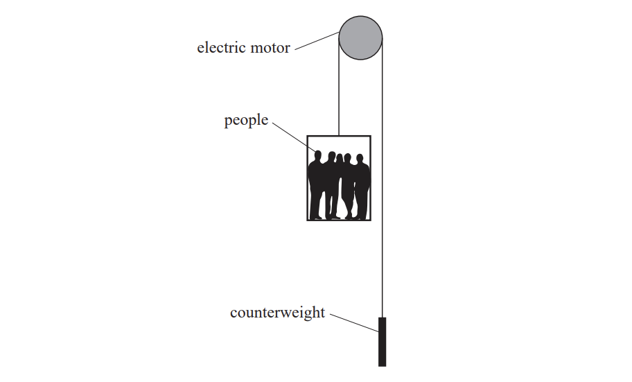
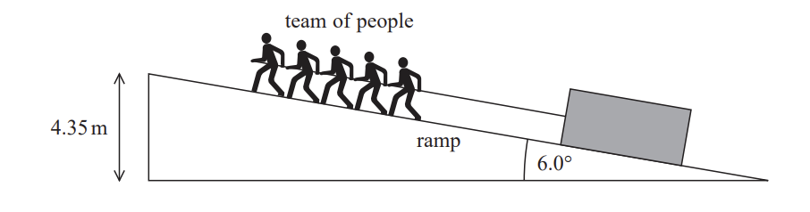

# Exam Questions — Work, Energy & Power
**1. Mechanics & Materials** · Edexcel International A Level (IAL) Physics (YPH11)
> Source: [https://www.savemyexams.com/international-a-level/physics/edexcel/19/topic-questions/1-mechanics-and-materials/work-energy-and-power/structured-questions/](https://www.savemyexams.com/international-a-level/physics/edexcel/19/topic-questions/1-mechanics-and-materials/work-energy-and-power/structured-questions/) · 9 questions · total 31 marks

## Q1 — medium — 4 marks · structured-questions

### 11((a)) — 2 marks — command: calculate — structured — from paper Oct/Nov 2021 · WPH11/01
A toy car is released from rest and rolls down a slope, as shown.

mass of car = 0.160 kg

speed of car at bottom of slope = 2.6 m s–1.

Calculate the increase in kinetic energy of the car as it accelerates down the slope.

Increase in kinetic energy = .......................................

### 11((b)) — 2 marks — command: calculate — structured — from paper Oct/Nov 2021 · WPH11/01
As the car accelerates down the slope, the work done against frictional forces is 0.26 J.

Calculate the vertical displacement of the car.

Vertical displacement of car = ...................................

## Q2 — medium — 8 marks · structured-questions

### 12((a)) — 2 marks — command: explain — structured — from paper 2022 Jan · WPH11/01
The diagram shows a lift system for moving people up and down a tall building. There is a counterweight to balance the weight of the lift. An electric motor is used to raise and lower the lift.

Explain how the counterweight affects the amount of work required from the electric motor to raise the lift.

### 12((b)) — 4 marks — command: show — structured — from paper 2022 Jan · WPH11/01
The electric motor raises the lift through a height of 40.0 m in a time of 30.0 s.

Show that the output power of the electric motor is about 12 kW.

total mass of lift and people = 2250 kg

mass of counterweight = 1300 kg

### 12((c)) — 2 marks — command: determine — structured — from paper 2022 Jan · WPH11/01
The electric motor dissipates energy to the surroundings at a rate of 3600 W.

Determine the efficiency of the electric motor.

Efficiency = .............................

## Q3 — medium — 9 marks · structured-questions

### 18((a)) — 2 marks — command: show — structured — from paper Oct/Nov 2021 · WPH11/01
The diagram shows a system used to move a stone block up a ramp. A team of people uses a rope to pull the block at a constant speed.

height of ramp = 4.35 m

angle of ramp to horizontal = 6.0°

mass of block = 2.10 × 103 kg

speed of block up ramp = 0.450 m s–1

total power of team = 6.25 kW

Show that the total force that the team exerts on the block is about 14 kN.

### 18((b)) — 3 marks — command: determine — structured — from paper Oct/Nov 2021 · WPH11/01
Determine the total work done by the team.

Total work done = ...........................................

### 18((c)) — 2 marks — command: show — structured — from paper Oct/Nov 2021 · WPH11/01
Show that the useful work done on the block is about 90 kJ.

### 18((d)) — 2 marks — command: determine — structured — from paper Oct/Nov 2021 · WPH11/01
Determine the efficiency of the system.

Efficiency = ........................................

## Q4 — easy — 5 marks · structured-questions

### 1() — 2 marks — command: show — structured
A cyclist rides up a hill of gradient 1 in 3, as shown. The total mass of the cyclist and bicycle is $75  \text{kg}$.

Show that the component of the total weight parallel to the slope is approximately $230  \text{N}$.

### 2() — 3 marks — command: calculate — structured
The cyclist moves with a constant velocity of $2.2\text{m s}^{-1}$.

Calculate the total power output of the cyclist.

resistive force on the cyclist = $25\text{N}$

## Q5 — easy — 1 marks · multiple-choice-questions

### 8() — 1 mark — multiple_choice — from paper Oct/Nov 2021 · WPH11/01
A crane lifts a container of weight 4.0 × 105 N through a height of 25m.

Which of the following gives the gravitational potential energy gained by the container in joules?
- **A.** 4.0 × 105 × 9.81 × 25
- **B.** 4.0 × 105 × 25
- **C.** 4.0 × 105 × 25 ÷ 9.81
- **D.** 4.0 × 105 ÷ 9.81

## Q6 — medium — 1 marks · multiple-choice-questions

### 3() — 1 mark — multiple_choice — from paper 2022 Jan · WPH14/01
The diagram shows the momentum of two trolleys, X and Y, before a collision. The mass of each trolley is 0.25 kg.

The two trolleys join together after the collision and move on with a velocity of 1 m s−1 .

Which of the following is the kinetic energy of trolley X before the collision?
- **A.** 0.5 J
- **B.** 1 J
- **C.** 2 J
- **D.** 4 J

## Q7 — medium — 1 marks · multiple-choice-questions

### 4() — 1 mark — multiple_choice — from paper 2021 June · WPH11/01
A hydroelectric power station has an efficiency of 32%. In one hour the useful energy output of the power station is 1.2 × 1013 J.

Which of the following expressions gives the total power input to the power station in watts?
- **A.** $1.2\times10^{13}\times0.32$
- **B.** $\frac{1.2\times10^{13}}{0.32\times3600}$
- **C.** $\frac{1.2\times10^{13}\times0.32}{3600}$
- **D.** $\frac{1.2\times10^{13}}{0.32}$

## Q8 — medium — 1 marks · multiple-choice-questions

### 6() — 1 mark — multiple_choice — from paper 2021 June · WPH11/01
A tractor pulls a trailer a distance *s* in time *t*. The useful power output of the tractor is *P*.

Which of the following equations gives the force *F* of the tractor on the trailer?
- **A.** $F=Pts$
- **B.** $F=\frac{Pt}{s}$
- **C.** $F=\frac{Ps}{t}$
- **D.** $F=\frac{st}{P}$

## Q9 — medium — 1 marks · multiple-choice-questions

### 1() — 1 mark — multiple_choice
An electric motor lifts a load of weight $50\text{N}$ through a vertical height of $1 . 5 \text{m}$ in $4.0\text{s}$. The motor is connected to a $12\text{V}$ supply and draws a current of $2.0\text{A}$.

Which of the following expressions gives the efficiency of the motor, as a percentage?
- **A.** $\frac{12\times2.0\times4.0}{50\times1.5} \times 100$
- **B.** $\frac{50}{12\times2.0\times4.0} \times 100$
- **C.** $\frac{50\times1.5}{12\times2.0\times4.0} \times 100$
- **D.** $\frac{50\times1.5}{12\times2.0} \times 100$
