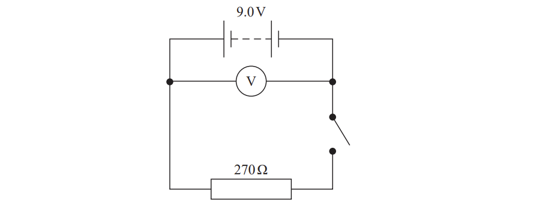
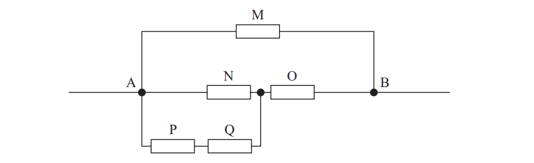
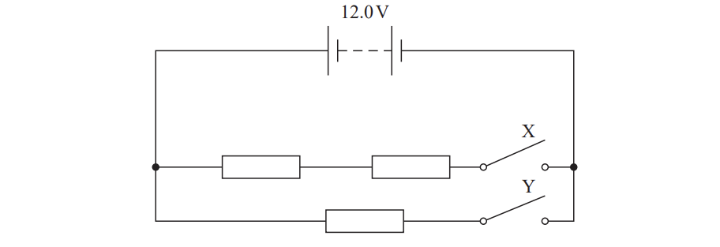
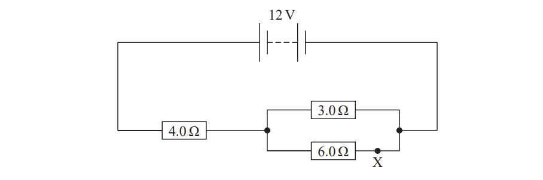
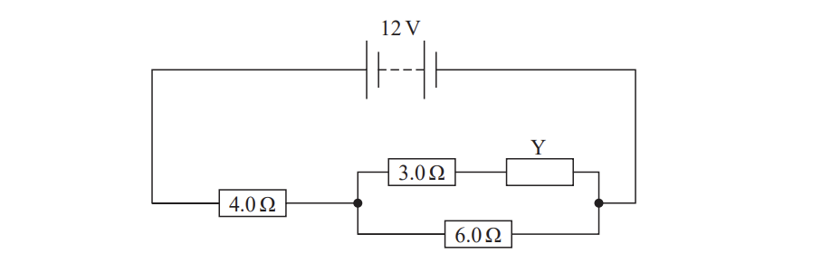
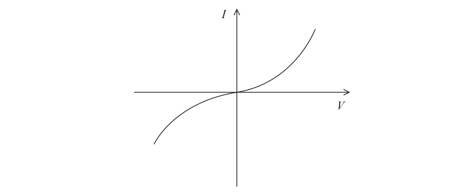
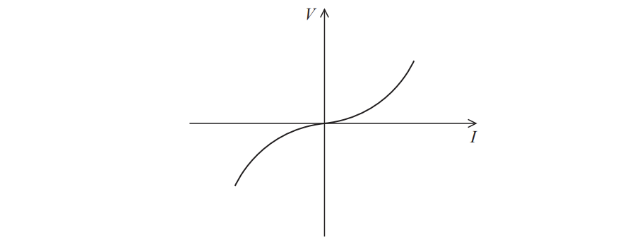

# Exam Questions — Current, Potential Difference, Resistance & Power
**2. Waves & Electricity** · Edexcel International A Level (IAL) Physics (YPH11)
> Source: [https://www.savemyexams.com/international-a-level/physics/edexcel/19/topic-questions/2-waves-and-electricity/current-potential-difference-resistance-and-power/structured-questions/](https://www.savemyexams.com/international-a-level/physics/edexcel/19/topic-questions/2-waves-and-electricity/current-potential-difference-resistance-and-power/structured-questions/) · 13 questions · total 46 marks

## Q1 — easy — 8 marks · structured-questions

### 12((a)) — 3 marks — command: explain — structured — from paper 2021 June · WPH12/01
The circuit diagram shows a resistor of resistance 270 Ω connected to a battery of e.m.f. 9.0 V. The battery has an internal resistance of 15 Ω.

Explain why the reading on the voltmeter is less than 9.0 V when the switch is closed.

### 12((b)) — 3 marks — command: calculate — structured — from paper 2021 June · WPH12/01
Calculate the reading on the voltmeter when the switch is closed.

Reading on voltmeter = ..............................

### 12((c)) — 2 marks — command: calculate — structured — from paper 2021 June · WPH12/01
The switch remains closed and 12 C of charge flows through the battery.

Calculate the decrease in the chemical energy store of the battery.

Decrease in chemical energy store = ...........................

## Q2 — medium — 6 marks · structured-questions

### 15((a)) — 3 marks — command: derive — structured — from paper Oct/Nov 2021 · WPH12/01
Two resistors of resistance $R_{1}$ and $R_{2}$ are connected in parallel in a circuit.

Derive a formula for the total resistance $R_{T}$ of the combination.

### 15((b)) — 3 marks — command: multiple — structured — from paper Oct/Nov 2021 · WPH12/01
The diagram shows a combination of five resistors, M, N, O, P and Q. Each resistor has a resistance of 5.0 Ω.

i) Show that the resistance between points A and B is about 3 Ω.

**(3)**

ii) A student is told to modify the combination of resistors so that the combined resistance between A and B is greater than 5.0 Ω. She cannot change the arrangement of the resistors, but she can replace one of the 5.0 Ω resistors with a 20.0 Ω resistor.

Explain, without further calculations, which of the five resistors should be replaced.

**(2)**

## Q3 — medium — 13 marks · structured-questions

### 18((a)) — 3 marks — command: show — structured — from paper 2021 June · WPH12/01
The circuit diagram shows three identical resistors and two switches, X and Y.

The battery has negligible internal resistance.

Each resistor consists of a wire of diameter 0.181 mm and length 55.0 cm. At room temperature, the resistivity of the wire is 1.10 × 10−6 Ω m.

Show that the resistance of one resistor at room temperature is about 24 Ω.

### 18((b)) — 4 marks — command: assess — structured — from paper 2021 June · WPH12/01
A student suggests that the maximum power output from the resistors in this circuit will be greater than 12 W.

Assess whether the student’s suggestion is correct.

### 18((c)) — 6 marks — command: multiple — structured — from paper 2021 June · WPH12/01
Switch X was open and switch Y was closed.

i) Calculate the number of conduction electrons passing through the resistor every second immediately after switch Y was closed.

Number of electrons = ............................**(3)**

ii) After switch Y had been closed for a few minutes, the power dissipated by the resistor decreased.

Explain why.

**(3)**

## Q4 — medium — 10 marks · structured-questions

### 17((a)) — 6 marks — command: calculate — structured — from paper 2022 Jan · WPH12/01
A student set up the circuit shown.

Calculate the number of electrons passing point X each second.

Number of electrons in one second = ..............................

### 17((b)) — 4 marks — command: evaluate — structured — from paper 2022 Jan · WPH12/01
Another resistor, Y, is added to the circuit as shown.

The student wrote the following statement.

| ***When resistor Y is added, the resistance of the parallel section*** ***increases, the resistance of the whole circuit increases, and so, by*** ***P = I******2******R, the power dissipated by the whole circuit also increases.*** |
|---|

Evaluate the student’s statement.

## Q5 — easy — 1 marks · multiple-choice-questions

### 6() — 1 mark — multiple_choice — from paper 2021 June · WPH12/01
A graph of current against potential difference for an electrical component is shown.

Which component would give this graph?
- **A.** diode
- **B.** filament bulb
- **C.** ohmic conductor
- **D.** thermistor

## Q6 — easy — 1 marks · multiple-choice-questions

### 1() — 1 mark — multiple_choice — from paper 2022 Jan · WPH12/01
Which of the following units is equivalent to the volt?
- **A.** J s–1
- **B.** W s–1
- **C.** J C–1
- **D.** W C–1

## Q7 — easy — 1 marks · multiple-choice-questions

### 1() — 1 mark — multiple_choice — from paper Oct/Nov 2021 · WPH12/01
The graph shows how potential difference $V$ varies with current $I$ for an electrical component.

Which electrical component is represented by this graph?
- **A.** diode
- **B.** filament lamp
- **C.** ohmic conductor
- **D.** thermistor

## Q8 — easy — 1 marks · multiple-choice-questions

### 1() — 1 mark — multiple_choice
The unit of electric potential can be written as $\text{J C}^{-1}$.

Which of the following is the equivalent expression in SI base units?
- **A.** $\text{kg m}^{2} \text{s}^{-2}$
- **B.** $\text{kg m}^{2} \text{s}^{-2} \text{A}^{-1}$
- **C.** $\text{kg m}^{2} \text{s}^{-3} \text{A}^{-1}$
- **D.** $\text{kg m s}^{-3} \text{A}^{-1}$

## Q9 — easy — 1 marks · multiple-choice-questions

### 1() — 1 mark — multiple_choice
The graph shows how the potential difference $V$ varies with the current $I$ for a circuit component.

Which of the following could be the circuit component?
- **A.** ohmic resistor
- **B.** filament lamp
- **C.** thermistor
- **D.** diode

## Q10 — medium — 1 marks · multiple-choice-questions

### 5() — 1 mark — multiple_choice — from paper Oct/Nov 2021 · WPH12/01
The unit of resistance is the ohm.

Which of the following is equivalent to the ohm?
- **A.** $JC^{-2}s$
- **B.** $JC^{2}s^{-1}$
- **C.** $JC^{-1}s^{-1}$
- **D.** $JCs$

## Q11 — medium — 1 marks · multiple-choice-questions

### 1() — 1 mark — multiple_choice — from paper 2021 June · WPH12/01
Which of the following derived units can be expressed in SI base units as kg m2 s–3 ?
- **A.** coulomb
- **B.** joule
- **C.** volt
- **D.** watt

## Q12 — medium — 1 marks · multiple-choice-questions

### 8() — 1 mark — multiple_choice — from paper 2022 Jan · WPH12/01
The graph shows how current *I* varies with potential difference *V* for an electrical component.

Which component is represented by this graph?
- **A.** Diode
- **B.** Filament lamp
- **C.** Ohmic conductor
- **D.** Thermistor

## Q13 — medium — 1 marks · multiple-choice-questions

### 10() — 1 mark — multiple_choice — from paper 2022 Jan · WPH12/01
A light dependent resistor (LDR) and a fixed resistor are connected in a circuit, as shown.

The intensity of the light incident on the LDR is increased.

Which of the following does **not** take place as the light intensity is increased?
- **A.** The current in the circuit increases.
- **B.** The potential difference across the fixed resistor increases.
- **C.** The total power dissipated in the circuit decreases.
- **D.** The resistance of the LDR decreases.
