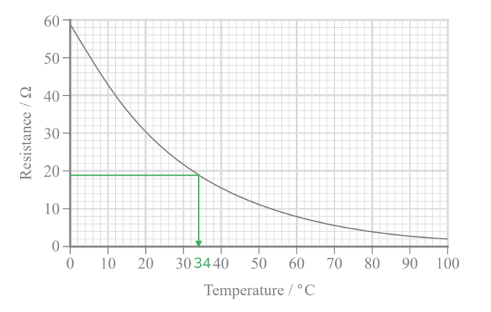
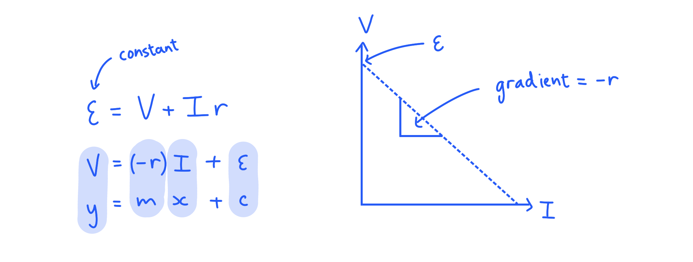

# Mark Schemes — E.M.F & Modelling Resistance
**2. Waves & Electricity** · Edexcel International A Level (IAL) Physics (YPH11)

## Q1 — medium — 8 marks · structured-questions

### 14((a)) — 4 marks
Determine the temperature of the thermistor:

List the known quantities:

- Resistance of the fixed resistor = 11.5 Ω
- E.m.f. of the battery, $ε$ = 9.00 V
- Reading on the voltmeter, $V_{fixed}$ = 3.42 V

Calculate the current in the circuit using $I=\frac{V}{R}$:

- $I=\frac{3.42}{11.5}=0.297A$ **[1 mark]**

Calculate the voltage across the thermistor, $V_{therm}$:

- $ε=V_{fixed}+V_{therm}$
- $V_{therm}=9.00-3.42=5.58V$
- $R_{therm}=\frac{V_{therm}}{I}=\frac{5.58}{0.297}$ **[1 mark]**
- $R_{therm}=18.8Ω$ **[1 mark]**

Read the corresponding temperature from the graph:

- Temperature = 34 °C (range 32-36 °C) **[1 mark]**

**[Total: 4 marks]**

### 14((b)) — 4 marks
Assess whether the student’s suggestion is correct:

- Increased e.m.f. leads to <u>greater </u>current; **[1 mark]**
- (Increased current leads to) <u>greater</u> temperature; **[1 mark]**
- Therefore, the resistance of thermistor would <u>decrease</u>; **[1 mark]**
- (The proportion of the total p.d. across thermistor would decrease so) voltmeter reading would more than double so student incorrect; **[1 mark]**

**[Total: 4 marks]**

- *This is a really common question so make sure you know the relationships between voltage, current, temperature and the resistance of the thermistor*
- *Remember that a thermistor's resistance decreases as temperature increases! This is opposite to all other components!*

## Q2 — medium — 9 marks · structured-questions

### 1() — 2 marks
A circuit that could be used to determine $ϵ$ and $r$ for the photovoltaic cell:

**[2 marks]**

> **[mark-scheme]**
> 1 mark for including a means of varying current, e.g. a variable resistor
> 
> 1 mark for drawing an ammeter in series with the cell and a voltmeter in parallel with the cell
> 
> - The voltmeter can be drawn in parallel with the variable resistor, as long as there are no other components with resistance in the circuit

### 2() — 5 marks
> **[mark-scheme]**
> - Vary the current using the variable resistor **[1 mark]**
> - Record corresponding values for $I$ and $V$ **[1 mark]**
> - Graph of $V$ against $I$ is a straight line with a negative gradient **[1 mark]**
> - $ϵ$ is given by the y-intercept **[1 mark]**
> - $r$ is given by the gradient **[1 mark]**
> 
> The final three marks can be gained for a sketch graph with clear annotations
> 
> 

> **[exam-tip]**
> Start by comparing the equation $V = ϵ - I r$ to the equation of a straight line $y = m x + c$.
> 
> This shows that a plot of $V$ on the y-axis against $I$ on the x-axis should give a graph with gradient$=-r$ and y-intercept $=ϵ$. Make sure your sketch clearly shows a straight line with a negative gradient, with the axes labelled $V$ and $I$, and the y-intercept marked as $ϵ$.

### 3() — 2 marks
> **[mark-scheme]**
> Any **pair** from (1 mark per point):
> 
> - Keep the intensity of the light constant **OR** maintain constant illumination / lighting conditions
> - As this would change the voltmeter / ammeter readings
> 
> **OR**
> 
> - Take readings of $V$ and $I$ for the whole range of the variable resistor **OR** increase the range of $I$ readings across the same range of $V$
> - As this will reduce the percentage uncertainty in the gradient
> 
> **OR**
> 
> - Take multiple readings of $V$ and $I$ and calculate a mean
> - As this will reduce the effect of random error
> 
> **[2 marks]**

## Q3 — hard — 11 marks · structured-questions

### 17((a)) — 5 marks
Calculate *r* :

List the known quantities:

- Resistance of variable resistor, $R$ = 12 Ω
- Current, $I$ = 107 mA = 0.107 A
- Time the circuit is on, $t$ = 300 s
- Energy transferred by cell, $E$ = 50 J

Calculate the emf of the cell:

- $W=VIt=εIt$
- $ε=\frac{W}{It}=\frac{50}{0.107\times300}$ **[1 mark]**
- $ε=1.56V$** [1 mark]**

Calculate the p.d. across the variable resistor:

- $V=IR=0.107\times12=1.28V$ **[1 mark]**

Recall the internal resistance equation:

- $ε=V+Ir$
- $r=\frac{ε-V}{I}=\frac{1.56-1.28}{0.107}$ **[1 mark]**
- $r=2.62Ω=2.6Ω$ (2 s.f.) **[1 mark]**

**[Total: 3 marks]**

- *If you cannot recall the internal resistance equation, this equation is just stating that the emf is equal to the sum of p.d. across the **internal resistance** and the p.d. across the **terminals of the cell*
- *In the equation *$ε=V+Ir$*, **V** represents the **terminal** p.d., which is equal to the p.d. across the **variable** **resistor*

### 17((b)) — 2 marks
Explain why increasing *R* would make the terminal potential difference value closer to ε:

- (increasing *R*) decreases current **or** gives the variable resistor a greater share of total resistance in the circuit; **[1 mark]**
- (Therefore, there is) less p.d. across the internal resistance **or** $Ir$ decreases; **[1 mark]**

**[Total: 2 marks]**

### 17((c)) — 4 marks
Explain how this circuit can be used to determine a value for *r* using a graphical method:

Describe the measurements:

- Take readings for p.d. and current; **[1 mark]**
- Vary the resistance / *R* (to obtain different values of *V* and *I *); **[1 mark]**

Describe the graphical method:

**EITHER**

- Plot a *V-I* graph; **[1 mark]**
- The gradient is −*r* ; **[1 mark]**

**OR**

- Plot an *I-V* graph; **[1 mark]**
- The gradient is $-\frac{1}{r}$; **[1 mark]**

**[Total: 4 marks]**

- *This is best approached by comparing the internal resistance equation to the straight line equation*

## Q4 — easy — 1 marks · multiple-choice-questions

### 4() — 1 marks
**Correct answer: A** — 

**Final answer:** **The correct answer is ****A**** because:**

- A higher temperature increases the number of conduction electrons in a thermistor

  - This eliminates options **B** and **D**
- A higher temperature increases the amplitude of lattice vibrations in a thermistor

  - This eliminates option **C**

## Q5 — easy — 1 marks · multiple-choice-questions

### 3() — 1 marks
**Correct answer: D** — *ε* = *V*1 + *IR*2 + *Ir*

**Final answer:** **The correct answer is ****D**** because:**

- E.m.f. $ε$, is the sum of the terminal potential difference and the lost volts
- Therefore, $ε=IR_{1}+IR_{2}+Ir$
- $IR_{1}$ is given as $V_{1}$ because $V=IR$
- Therefore the correct answer is $ε=V_{1}+IR_{2}+Ir$
- This is answer **D**

## Q6 — medium — 1 marks · multiple-choice-questions

### 4() — 1 marks
**Correct answer: B** — More conduction electrons are released.

**Final answer:** **The correct answer is ****B**** because:**

- A thermistor is a semiconductor
- Therefore, more conduction electrons are released with increased temperature
- This is answer **B**

- Remember that a negative temperature coefficient means that as the temperature increases, the resistance of the thermistor will decrease and vice versa
- Examiners reported that about 50% of students got this question incorrect

  - Make sure you understand how thermistors work
