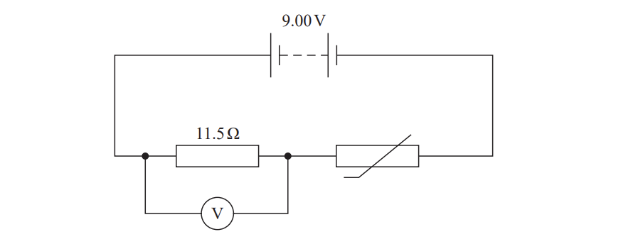
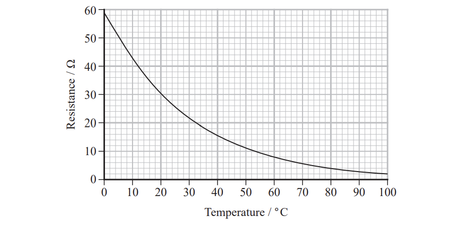
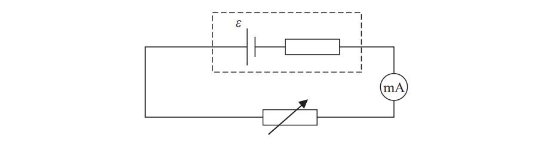
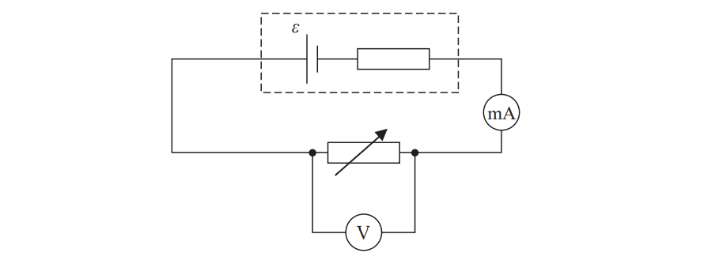
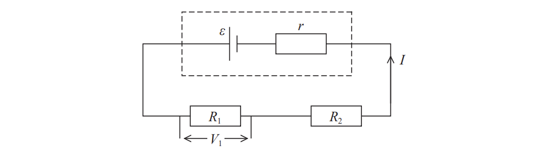

# Exam Questions — E.M.F & Modelling Resistance
**2. Waves & Electricity** · Edexcel International A Level (IAL) Physics (YPH11)
> Source: [https://www.savemyexams.com/international-a-level/physics/edexcel/19/topic-questions/2-waves-and-electricity/e-m-f-and-modelling-resistance/structured-questions/](https://www.savemyexams.com/international-a-level/physics/edexcel/19/topic-questions/2-waves-and-electricity/e-m-f-and-modelling-resistance/structured-questions/) · 6 questions · total 31 marks

## Q1 — medium — 8 marks · structured-questions

### 14((a)) — 4 marks — command: determine — structured — from paper 2021 June · WPH12/01
A student connected the circuit shown. The battery has negligible internal resistance.

The graph shows how the resistance of the thermistor varies with temperature.

The reading on the voltmeter is 3.42 V. Determine the temperature of the thermistor.

Temperature = ..........................

### 14((b)) — 4 marks — command: assess — structured — from paper 2021 June · WPH12/01
The student suggests that if the e.m.f. of the battery is doubled, the reading on the voltmeter will double.

Assess whether the student’s suggestion is correct.

## Q2 — medium — 9 marks · structured-questions

### 1() — 2 marks — command: add — structured
A student carried out an experiment to determine the e.m.f. $ϵ$ and internal resistance $r$ of a photovoltaic cell.

The diagram shows a photovoltaic cell. Add to the diagram to show a circuit that could be used to determine $ϵ$ and $r$ for the photovoltaic cell.

### 2() — 5 marks — command: sketch — structured
Explain how the student can use a graphical method to determine values for $ϵ$ and $r$. Your answer should include a sketch of the graph.

### 3() — 2 marks — command: explain — structured
Explain one precaution that the student should take to ensure that results are accurate.

## Q3 — hard — 11 marks · structured-questions

### 17((a)) — 5 marks — command: calculate — structured — from paper Oct/Nov 2021 · WPH12/01
A cell of e.m.f. ε is connected in series with a variable resistor with resistance *R* as shown. The internal resistance of the cell is *r*.

When *R* is 12 Ω, the reading on the ammeter is 107 mA. The circuit is switched on for 300 seconds. In this time, 50 J of energy is transferred by the cell.

Calculate *r*.

r = .......................................................

### 17((b)) — 2 marks — command: explain — structured — from paper Oct/Nov 2021 · WPH12/01
Increasing *R* would make the terminal potential difference value closer to ε.

Explain why, without further calculation.

### 17((c)) — 4 marks — command: explain — structured — from paper Oct/Nov 2021 · WPH12/01
A voltmeter is added to the circuit as shown.

Explain how this circuit can be used to determine a value for *r* using a graphical method.

## Q4 — easy — 1 marks · multiple-choice-questions

### 4() — 1 mark — multiple_choice — from paper Oct/Nov 2021 · WPH12/01
The temperature of a thermistor is increased.

Which row in the table identifies the effect of the temperature increase on the number of conduction electrons and the amplitude of lattice vibrations?

|   | **Number of conduction electrons** | **Amplitude of lattice vibrations** |
|---|---|---|
| **A** | increases | increases |
| **B** | decreases | increases |
| **C** | increases | stays the same |
| **D** | decreases | stays the same |
- **A.** 
- **B.** 
- **C.** 
- **D.** 

## Q5 — easy — 1 marks · multiple-choice-questions

### 3() — 1 mark — multiple_choice — from paper 2022 Jan · WPH12/01
The diagram shows a cell of e.m.f. *ε* and internal resistance *r*. The cell is connected in series with two resistors of resistance *R*1 and *R*2. The potential difference across *R*1 is *V*1. The current in the circuit is *I*.

Which of the following expressions is correct?
- **A.** *ε* = *V*1 + *Ir*
- **B.** *ε* = *IR*1 + *Ir*
- **C.** *ε* = *IR*2 + *Ir*
- **D.** *ε* = *V*1 + *IR*2 + *Ir*

## Q6 — medium — 1 marks · multiple-choice-questions

### 4() — 1 mark — multiple_choice — from paper 2022 Jan · WPH12/01
As temperature increases, the resistance of a negative temperature coefficient thermistor changes.

Which of the following describes the reason for this change?
- **A.** Collisions between electrons and ions occur less frequently.
- **B.** More conduction electrons are released.
- **C.** The ions in the thermistor vibrate less.
- **D.** The ions in the thermistor vibrate more.
