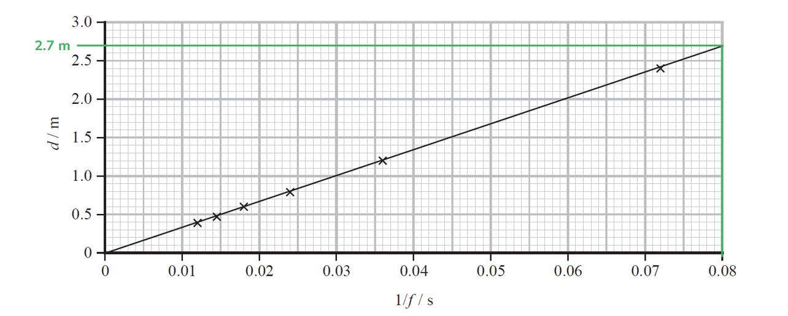
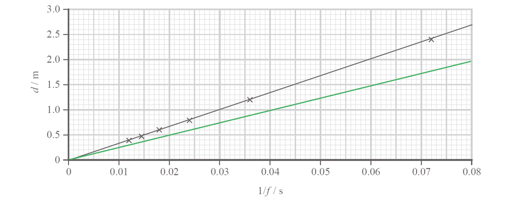
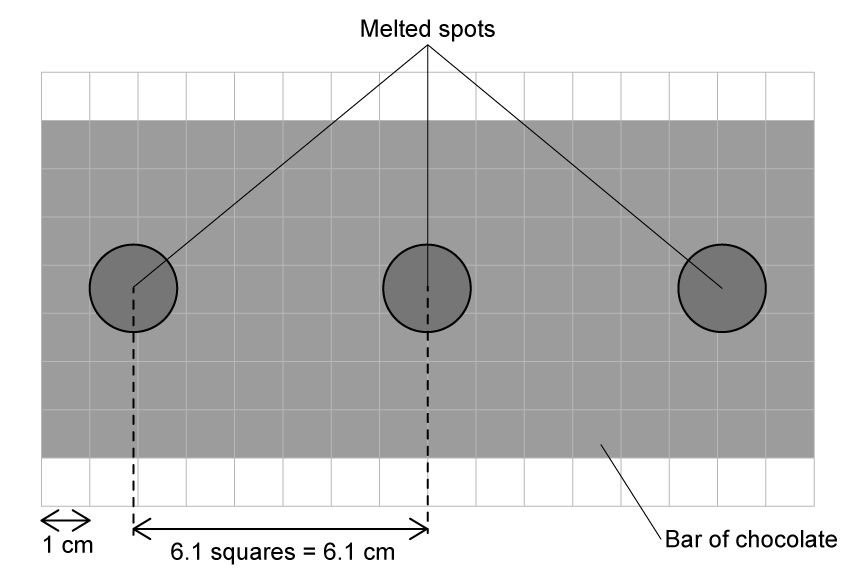
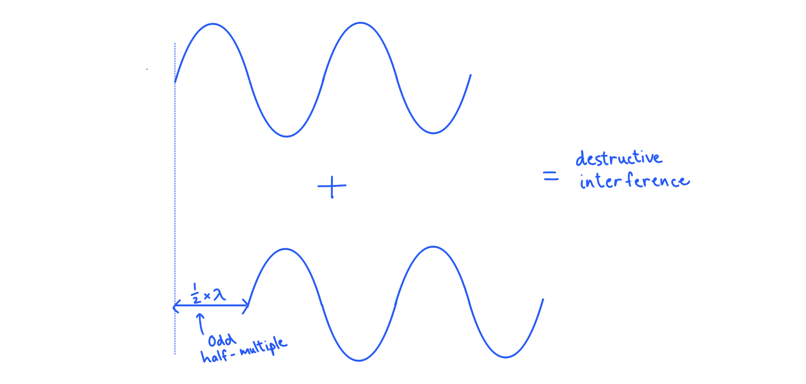
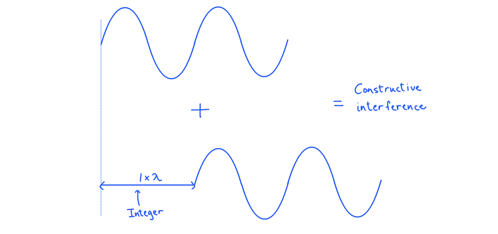

# Mark Schemes — Interference & Stationary Waves
**2. Waves & Electricity** · Edexcel International A Level (IAL) Physics (YPH11)

## Q1 — easy — 7 marks · structured-questions

### 12((a)) — 2 marks
Explain how the stationary wave was formed in this experiment:

- Waves have been reflected by the water surface; **[1 mark]**
- Transmitted wave and reflected wave interfere / superpose **or** waves travelling in opposite directions interfere; **[1 mark]**

**[Total: 2 marks]**

- *Make sure you do **not** just say "**opposite** **waves**", this language is not accurate enough - refer to direction or transmitted and reflected*

### 12((b)) — 5 marks
i) Determine a value for the speed of sound in air:

List the known quantities:

- Length of air column, $l$ = 19.3 cm = 0.193 m
- Frequency of tuning fork, $f$ = 440 Hz

Determine wave speed:

- $λ=4l$ **[1 mark]**
- $v=fλ=440\times4\times0.193$ **[1 mark]**
- $\mathrm{speed} \mathrm{of} \mathrm{sound}=339.7ms^{-1}=340ms^{-1}$ (2 s.f.) **[1 mark]**

ii) Explain how this would affect the accuracy of your calculated value for the speed of sound:

Compare the distance:

- (This would make the) wavelength longer **or** (This would make the) node to antinode distance longer; **[1 mark]**

Describe the effect on wave speed:

- This would cause the (actual) value (for the speed of sound) to be <u>higher</u> (than the calculated value, which is therefore less accurate); **[1 mark]**

**[Total: 5 marks]**

## Q2 — medium — 8 marks · structured-questions

### 15((a)) — 1 marks
The measurements were recorded to the nearest 0.5 cm when the resolution of the metre rule was 1 mm because:

- It can be difficult to measure the exact position of node **or **the ruler may not have been close to the string (so there might be parallax error); **[1 mark]**

**[Total: 1 mark]**

### 15((b)) — 7 marks
i) Determine the total mass of the hanging masses used in the investigation:

Calculate the gradient:

- Gradient $=\frac{2.7}{0.080}=33.75ms^{-1}$ **[1 mark]**

Determine the wave speed, $v$:

- The speed of the waves on the string = 2 × gradient
- $v=2\times33.75=67.5ms^{-1}$ **[1 mark]**

Determine the tension, $T$:

- $v=\sqrt{\frac{T}{μ}}$
- `T space equals space v squared mu space equals space open parentheses 67.5 close parentheses squared space cross times space open parentheses 4.5 cross times 10 to the power of negative 4 end exponent close parentheses space equals space 2.05 space straight N` **[1 mark]**

Calculate the mass:

- $W=mg=T$
- $m=\frac{T}{g}=\frac{2.05}{9.81}$ **[1 mark]**
- $m=0.209\mathrm{kg}$ **[1 mark]**

** **

ii) Add a line to the graph to show how *d* varied with 1/*f* for the new string:

A graph scoring two marks:

- A straight line drawn with a shallower gradient, starting from the origin; **[1 mark]**
- New line has a gradient of 0.7 of the original line **OR** ends at (0.08, 1.9-2.0); **[1 mark]**

**[Total: 7 marks]**

## Q3 — medium — 7 marks · structured-questions

### 1() — 1 marks
> **[mark-scheme]**
> A coherent beam means:
> 
> - The waves have a constant phase difference / relationship **[1 mark]**
> 
> Do not accept: "the waves are in phase" or  "a phase difference of zero" (as coherent waves can be out of phase, provided the difference is constant)

### 2() — 3 marks
> **[mark-scheme]**
> Maximum and minimum readings are detected because:
> 
> - The waves from the slits superpose / interfere **[1 mark]**
> - Maxima occur due to constructive interference when the waves meet in phase **OR** path difference = $n λ$ **[1 mark]**
> - Minima occur due to destructive interference when the waves meet out of phase **OR** path difference = $( n + \frac{1}{2} ) λ$ **[1 mark]**

### 3() — 3 marks
To deduce the band, find the frequency of the microwaves:

- List the known quantities:

  - Distance $S_{1}Q=0.85\text{m}$
  - Distance $S_{2}Q=0.75\text{m}$
  - Speed of light, $c=3.00\times10^{8}\text{m s}^{-1}$
- Determine the path difference by subtracting the two distances:

$\text{path difference}=S_{1}Q-S_{2}Q=0.85-0.75=0.10\text{m}$

- At a maximum, the waves arrive in phase, so the path difference is a whole number of wavelengths:

  - Q is the second maximum, so $n = 2$

$\text{path difference}=nλ$

$λ=\frac{0.10}{2}=0.050\text{m}$ **[1 mark]**

- Calculate the frequency using the wave equation:

$f=\frac{c}{λ}$

$f=\frac{3.00\times10^{8}}{0.050}$ **[1 mark]**

$f=$ $6.0\times10^{9}\text{Hz}=6.0\text{GHz}$

This lies in the range 4–8 GHz, so the microwaves are in the **C band** **[1 mark]**

> **[mark-scheme]**
> 1 mark for use of $S_{1}Q-S_{2}Q=2λ$ to determine wavelength ($0.050\text{m}$)
> 
> 1 mark for use of $c=fλ$ to calculate frequency ($6.0\text{GHz}$)
> 
> 1 mark for correct identification of **C band**
> 
> - Award the final mark for a band which is consistent with the calculated frequency

> **[exam-tip]**
> The path difference is the *difference* between the two distances, not their sum. All electromagnetic waves travel at $3 . 00 \times 10^{8} \text{m s}^{-1}$, so once you have the wavelength you can find the frequency with $c = f λ$. Identify the order first: the central maximum is $n = 0$, so the second maximum out is $n = 2$.

## Q4 — hard — 8 marks · structured-questions

### 2((a)) — 3 marks
As d varies, the intensity of the microwaves detected by the receiver varies because:

- The path / phase difference between the microwaves reflected from metal plate and reflected from glass plate varies; **[1 mark]**
- The (reflected) waves superpose / interfere (at the receiver); **[1 mark]**
- As the distance *d* is varied, path / phase difference changes causing constructive and destructive interference; **[1 mark]**

**[Total: 3 marks]**

### 2((b)) — 5 marks
i) Determine the wavelength of the microwaves being transmitted:

- Δd1→2 = 11.1 − 9.9 = 1.2 cm
- Δd2→3 = 12.7 − 11.1 = 1.6 cm
- Δd3→4 = 13.9 − 12.7 = 1.2 cm
- Δd4→5 = 15.4 − 13.9 = 1.5 cm
- Mean distance between maxima, *d* = $\frac{1.2+1.6+1.2+1.5}{4}$ = 1.38 cm **[1 mark]**

Use the condition for constructive interference to determine *λ*:

- For constructive interference, path difference = *nλ*
- Due to reflection, the path length = 2*d*
- Hence, *nλ* = 2*d *and for the first maxima (n = 1), *λ* = 2*d*
- Wavelength = 2 × 1.38 = 2.76 **[1 mark]**
- Wavelength = 2.8 cm (2 s.f.) **[1 mark]**

ii) Calculate the frequency of the microwaves being transmitted:

- Wave equation: $c=fλ$
- $f=\frac{3\times10^{8}}{0.028}$ **[1 mark]**
- Frequency = 1.1 × 1010 Hz **[1 mark]**

**[Total: 5 marks]**

- *The reflection of the microwaves makes this problem a little trickier to solve*
- *Many students do not consider the fact that the microwaves must travel the distance **d** twice before making it back to the reciever*

  - *Hence why the path difference is **nλ = **2**d **not** **nλ = d** as you might originally expect*
- *Many students forgot to find the distance between the maxima before finding the mean - this is why drawing a quick sketch can help to visualise what is happening in this scenario*

## Q5 — hard — 10 marks · structured-questions

### 1() — 6 marks
Standing waves form in the oven when incident and reflected microwaves superpose.

There are points where the waves meet in phase (where the path difference is a whole number of wavelengths), and constructive interference takes place. This produces antinodes, which are points of maximum amplitude.

There are points where the waves meet in antiphase (where the path difference is an odd number of half-wavelengths), and destructive interference occurs. This produces nodes, which are points of minimum amplitude.

The energy transferred is greatest at the antinodes of the standing wave pattern, so this is where the melted spots form.

**[6 marks]**

> **[mark-scheme]**
> This is a levelled response question. Each point made in the answer does not equal one mark.
> 
> Marks are awarded for indicative content and for how the answer is structured, with linked and fully sustained lines of reasoning. The banding table shows how the indicative content (IC) and linkage marks should be awarded, up to a maximum of 6 marks.
> 
> **Indicative content**
> 
> - **IC1** Waves are reflected (from the oven wall)
> 
> - **IC2** Waves (travelling in opposite directions) meet and superpose / interfere
> 
> - **IC3** Constructive interference produces antinodes where waves meet in phase / with path difference $=nλ$
> 
> - **IC4** Destructive interference produces nodes where waves meet in antiphase / with path difference `equals space open parentheses n plus 1 half close parentheses lambda`
> 
> - **IC5** Nodes are points with minimum amplitude / intensity and antinodes are points with maximum amplitude / intensity
> 
> - **IC6** Melted spots form at the antinodes as this is where maximum energy transfer occurs
> 
> **Linkage**
> 
> - **1 linkage mark** for a clear answer that shows a coherent and logical structure
> - **1 linkage mark** for fully sustained lines of reasoning demonstrated throughout
> 
> **Banding table**
> 
> | IC points | IC mark | Max linkage mark | Max final mark |
> |---|---|---|---|
> | 6 | 4 | 2 | 6 |
> | 5 | 4 | 1 | 5 |
> | 4 | 3 | 1 | 4 |
> | 3 | 2 | 1 | 3 |
> | 2 | 2 | 0 | 2 |
> | 1 | 1 | 0 | 1 |
> | 0 | 0 | 0 | 0 |

### 2() — 3 marks
To determine the frequency of the microwaves used by the oven:

- Determine the distance between the adjacent spots:

distance between adjacent antinodes $\approx6.1\text{cm}$

- Determine the wavelength of the microwaves:

  - Adjacent antinodes are half a wavelength apart

$λ=2\times6.1=12.2\text{cm}$ **[1 mark]**

- Use the wave equation to determine the frequency:

$f=\frac{c}{λ}$

$f=\frac{3.00\times10^{8}}{0.122}$ **[1 mark]**

$f=2.459\times10^{9}\text{Hz}$

$f=$ $2.46\text{GHz}$ **[1 mark]**

> **[mark-scheme]**
> 1 mark for recognising that node spacing is equal to half a wavelength (or $λ=2d$)
> 
> 1 mark for use of $c=fλ$ to determine frequency
> 
> 1 mark for a final answer of $f=2.459\times10^{9}\text{Hz}$ or $2.46\text{GHz}$

### 3() — 1 marks
> **[mark-scheme]**
> Any **one** from:
> 
> - To ensure the antinodes / melting spots remain in the same position
> - To prevent the whole chocolate bar from receiving similar amounts of energy (and melting evenly)
> - So that the maximum energy is transferred to the same spots (so the standing wave pattern can be clearly observed)
> 
> **[1 mark]**

> **[exam-tip]**
> Think about the role of a rotating turntable in a microwave oven - it reduces uneven heating in food. If the chocolate were on a rotating turntable, the melting spots would not be equally spaced, making it impossible to take reliable measurements.

## Q6 — easy — 1 marks · multiple-choice-questions

### 4() — 1 marks
**Correct answer: D** — increasing the tension in the string

**Final answer:** **The correct answer is**** D**** because:**

- Wave speed on a string is calculated using $v=\sqrt{\frac{T}{u}}$
- Therefore, increasing the tension will increase the wave speed

**A** is incorrect as this would only alter the wavelength of the wave

**B** is incorrect as this does not affect the speed of the wave

**C** is incorrect as this would decrease the speed of the wave

## Q7 — medium — 1 marks · multiple-choice-questions

### 6() — 1 marks
**Correct answer: A** — `square root of open parentheses fraction numerator 4 M g L over denominator 3 m end fraction close parentheses end root`

**Final answer:** **The correct answer is ****A**** because:**

- Speed of a wave travelling along a wave fixed at both ends is $v=\sqrt{\frac{T}{μ}}$

  - Tension is provided by the weight of the hanging masses, so $T=Mg$
  - The length of the string is $L+\frac{L}{3}=\frac{4L}{3}$ so mass per unit length is $μ=\frac{3m}{4L}$
- `v space equals space square root of fraction numerator M g over denominator open parentheses fraction numerator 3 m over denominator 4 L end fraction close parentheses end fraction end root space equals space square root of fraction numerator 4 M g L over denominator 3 m end fraction end root` which is option **A**

## Q8 — medium — 1 marks · multiple-choice-questions

### 10() — 1 marks
**Correct answer: A** — path difference of 16.0 cm

**Final answer:** **The correct answer is ****A**** because:**

- If the wavelength is 8.0 cm then path differences of multiples of 8.0 cm will give constructive interference
- Therefore a path difference of 16.0 cm will give constructive interference

- All the other options would result in the waves meeting in antiphase which would result in destructive interference

## Q9 — medium — 1 marks · multiple-choice-questions

### 7() — 1 marks
**Correct answer: D** — Points X and Z are in antiphase.

**Final answer:** **The correct answer is ****D**** because:**

- Positions X and Z are in two adjacent node to node sections which will always be in antiphase to one another
- Therefore, the only correct statement is **D**

**A **is incorrect as positions W and X are between the same pair of nodes, so they will be in phase

**B **is incorrect as positions W and Y are in two adjacent node to node sections, so they are in antiphase

**C **is incorrect as positions X and Y are in two adjacent node to node sections, so they are in antiphase

- A common misconception is that points W and Y are in phase - this is incorrect!

  - All the points between two adjacent nodes of a stationary wave are in antiphase with all the points in the next node-to-node distance

## Q10 — medium — 1 marks · multiple-choice-questions

### 9() — 1 marks
**Correct answer: B** — $\frac{π}{4}$

**Final answer:** **The correct answer is ****B**** because:**

- One complete oscillation is 1 wavelength which is equivalent to 2π radians

  - Hence, $\frac{1}{8}\times2π=\frac{2π}{8}=\frac{π}{4}\mathrm{rad}$

## Q11 — hard — 1 marks · multiple-choice-questions

### 7() — 1 marks
**Correct answer: C** — 

**Final answer:** **The correct answer is ****C**** because:**

- The path difference is (15 + 27) − (22 + 8) = 12 cm
- Where there is no heating, destructive interference has taken place

  - Therefore the path difference is an odd half-multiple of wavelength (e.g. $\frac{3λ}{2}$)
- For maximum heating, constructive interference has taken place

  - Therefore the path difference is an integer multiple of wavelength (e.g. 2*λ)*
- Consider a wavelength of 18 cm (options **B** and **D**):

  - 12 cm is two thirds of the wavelength
  - This does not cause max heating or zero heating (eliminating options **B** and **D**)
- Consider a wavelength of 24 cm (options **B** and **D**):

  - 12 cm is half the wavelength
  - This is an odd half-multiple of wavelength, so no heating occurs
  - The answer is option **C**

- Here, maximum heating and no heating really just mean constructive interference with amplitude 2A or destructive interference with amplitude of 0

