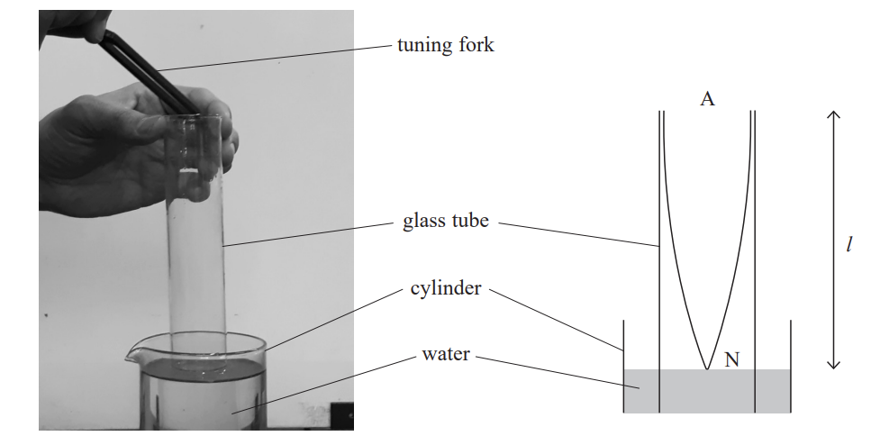
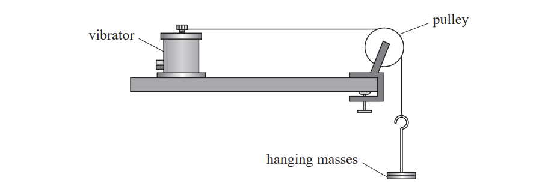
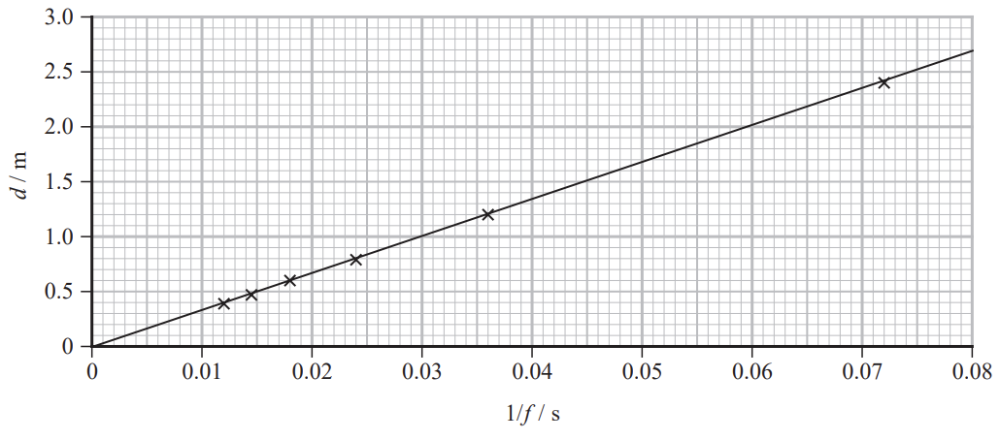
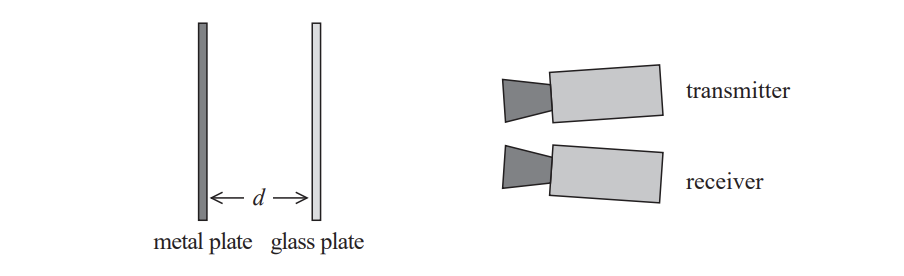
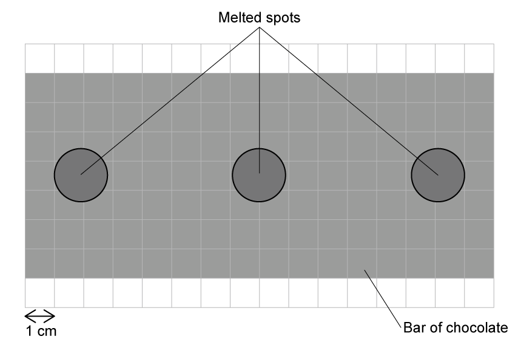
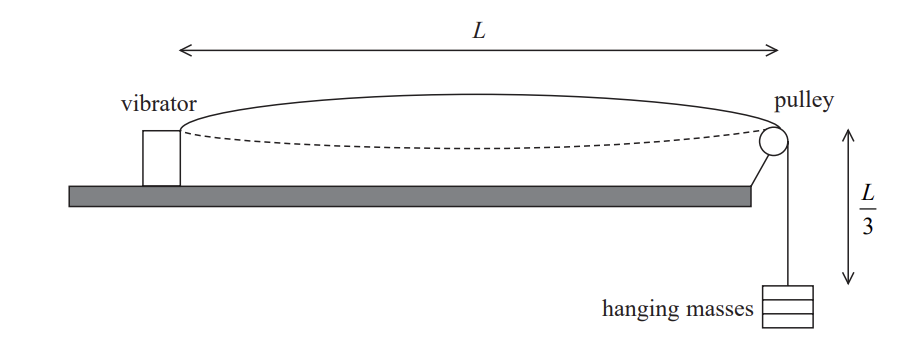
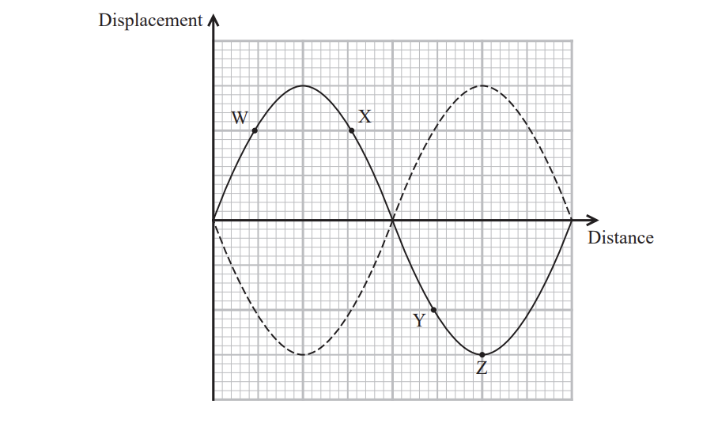
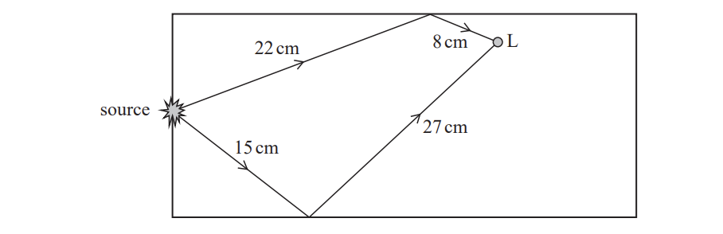

# Exam Questions — Interference & Stationary Waves
**2. Waves & Electricity** · Edexcel International A Level (IAL) Physics (YPH11)
> Source: [https://www.savemyexams.com/international-a-level/physics/edexcel/19/topic-questions/2-waves-and-electricity/interference-and-stationary-waves/structured-questions/](https://www.savemyexams.com/international-a-level/physics/edexcel/19/topic-questions/2-waves-and-electricity/interference-and-stationary-waves/structured-questions/) · 11 questions · total 46 marks

## Q1 — easy — 7 marks · structured-questions

### 12((a)) — 2 marks — command: explain — structured — from paper Oct/Nov 2021 · WPH12/01
In an experiment to determine the speed of sound in air, a student held a vibrating tuning fork above a glass tube. The air column in the tube could be adjusted by raising or lowering the tube into a cylinder containing water. When the length of the air column was $l$, a stationary wave with one node and one antinode was produced as shown.

This caused a sound to be heard.

Explain how the stationary wave was formed in this experiment.

### 12((b)) — 5 marks — command: multiple — structured — from paper Oct/Nov 2021 · WPH12/01
i) A sound was heard when $l$ was 19.3 cm.

Determine a value for the speed of sound in air.

frequency of tuning fork = 440 Hz

Speed of sound in air = .......................................**(3) **

ii) The antinode is slightly further from the water than the end of the glass tube.

Explain how this would affect the accuracy of your calculated value for the speed of sound.

**(2)**

## Q2 — medium — 8 marks · structured-questions

### 15((a)) — 1 mark — command: suggest — structured — from paper 2022 Jan · WPH12/01
A student investigated stationary waves on a string, using the apparatus shown.

The frequency *f* of the vibrator was adjusted until a stationary wave was formed with a node at each end. This was repeated for various stationary waves on the string. A metre rule was used to measure the distance *d* between adjacent nodes on the string.

The resolution of the metre rule was 1 mm, but the measurements were recorded to the nearest 0.5 cm.

Suggest why.

### 15((b)) — 7 marks — command: multiple — structured — from paper 2022 Jan · WPH12/01
The student plotted a graph of *d* against 1/*f* as shown.

i) Determine the total mass of the hanging masses used in the investigation. Mass per unit length of string = 4.5 × 10–4 kg m–1

Total mass of hanging masses = ............................**(5)**

ii) The string was replaced with one that had twice the mass per unit length.

The length of the string and the mass of the hanging masses did not change.

Add a line to the graph to show how *d* varied with 1/*f* for the new string.

**(2)**

## Q3 — medium — 7 marks · structured-questions

### 1() — 1 mark — command: describe — structured
The interference of microwaves can be investigated in the laboratory using a microwave transmitter and receiver. A coherent beam of microwaves is directed at two slits, S1 and S2, formed between metal plates, as shown.

Describe what is meant by a coherent beam.

### 2() — 3 marks — command: explain — structured
As the receiver is moved along line AB, alternate points of maximum and minimum readings are detected.

Explain why maximum and minimum readings are detected.

### 3() — 3 marks — command: deduce — structured
The receiver detects a maximum reading at point O, which is equidistant from the two slits.

The next two maximum readings are detected at P and Q.

Point Q is $85\text{cm}$ from S1 and $75\text{cm}$ from S2.

Three common microwave bands and their corresponding frequencies are given in the table.

| Band | Frequency / GHz |
|---|---|
| S | 2–4 |
| C | 4–8 |
| X | 8–12 |

Deduce the band of the microwaves used in this experiment.

## Q4 — hard — 8 marks · structured-questions

### 2((a)) — 3 marks — command: explain — structured — from paper Oct/Nov 2021 · WPH13/01
A student investigated the reflection of microwaves from a metal plate and a glass plate.

The metal plate reflects microwaves and the glass plate partially reflects microwaves.

A plan view of the apparatus is shown.

The metal plate, the transmitter and the receiver were kept in fixed positions.

The value of *d* was varied by moving the glass plate.

As *d* varied, the intensity of the microwaves detected by the receiver varied.

Explain why.

### 2((b)) — 5 marks — command: multiple — structured — from paper Oct/Nov 2021 · WPH13/01
The student recorded values of *d* when the receiver showed a maximum value of intensity.

He recorded *d* for a sequence of five maxima.

| Maxima | 1 | 2 | 3 | 4 | 5 |
|---|---|---|---|---|---|
| *d* / cm | 9.9 | 11.1 | 12.7 | 13.9 | 15.4 |

i) Determine the wavelength of the microwaves being transmitted.

Wavelength = .......................................... **(3)**

ii) Calculate the frequency of the microwaves being transmitted. ** **

Frequency = ...........................................**(2)**

## Q5 — hard — 10 marks · structured-questions

### 1() — 6 marks — command: explain — structured
A student uses a microwave oven to investigate standing waves. They remove the rotating turntable from the oven and place a bar of chocolate inside, so it lies flat and remains stationary, as shown.

The microwaves are switched on until a pattern of melted spots forms on the chocolate, as shown.

Explain how the standing wave pattern of melted spots forms.

### 2() — 3 marks — command: determine — structured
Determine the frequency of the microwaves used by the oven.

### 3() — 1 mark — command: explain — structured
Explain why it was necessary for the student to remove the rotating turntable before switching on the microwave oven.

## Q6 — easy — 1 marks · multiple-choice-questions

### 4() — 1 mark — multiple_choice — from paper 2021 June · WPH12/01
A student investigates how different variables affect the speed of waves on a vibrating string.

Which of the following would increase the speed of waves along the string?
- **A.** increasing the frequency
- **B.** increasing the length of the string
- **C.** increasing the mass per unit length of the string
- **D.** increasing the tension in the string

## Q7 — medium — 1 marks · multiple-choice-questions

### 6() — 1 mark — multiple_choice — from paper Oct/Nov 2021 · WPH12/01
The speed of waves on a vibrating string is investigated using the apparatus shown.

length of string between vibrator and pulley = $L$

length of string between pulley and hanging masses = $\frac{L}{3}$

mass of whole string = $m$

mass of hanging masses = $M$

Which of the following expressions represents the speed of the waves on the string?
- **A.** `square root of open parentheses fraction numerator 4 M g L over denominator 3 m end fraction close parentheses end root`
- **B.** `square root of open parentheses fraction numerator 2 M g L over denominator 3 m end fraction close parentheses end root`
- **C.** `square root of open parentheses fraction numerator M g L over denominator m end fraction close parentheses end root`
- **D.** `square root of open parentheses fraction numerator M g L over denominator 3 m end fraction close parentheses end root`

## Q8 — medium — 1 marks · multiple-choice-questions

### 10() — 1 mark — multiple_choice — from paper 2021 June · WPH12/01
Two waves leave the same source in phase. The waves travel along different paths and then meet. The wavelength of the waves is 8.0 cm.

Which of the following would cause constructive interference when the waves meet?
- **A.** path difference of 16.0 cm
- **B.** path difference of $\frac{3λ}{2}$
- **C.** phase difference of 180°
- **D.** phase difference of 3π radians

## Q9 — medium — 1 marks · multiple-choice-questions

### 7() — 1 mark — multiple_choice — from paper 2022 Jan · WPH12/01
The diagram shows how the displacement varies with distance along a stationary wave at two instants of time.

Which of the following statements is correct?
- **A.** Points W and X are in antiphase.
- **B.** Points W and Y are in phase.
- **C.** Points X and Y are in phase.
- **D.** Points X and Z are in antiphase.

## Q10 — medium — 1 marks · multiple-choice-questions

### 9() — 1 mark — multiple_choice — from paper 2022 Jan · WPH12/01
Two waves with wavelength λ are produced by the same source. The waves travel different distances and then meet.

At the point where they meet, the path difference between the two waves is $\frac{λ}{8}$.

Which of the following is the phase difference, in radians, between the two waves?
- **A.** $\frac{π}{2}$
- **B.** $\frac{π}{4}$
- **C.** $\frac{π}{8}$
- **D.** $\frac{π}{16}$

## Q11 — hard — 1 marks · multiple-choice-questions

### 7() — 1 mark — multiple_choice — from paper Oct/Nov 2021 · WPH12/01
A microwave oven has a source that emits microwaves in all directions into the oven.

The diagram shows the paths of two microwave rays that meet at point $L$ as shown.

The interference between the waves following these two paths could cause heating effects at $L$ depending on the wavelength of the microwaves.

Which row of the table is possible at point $L$?

|   | **Heating effect at L** | **Wavelength/ cm** |
|---|---|---|
| **A** | maximum heating | 24 |
| **B** | maximum heating | 18 |
| **C** | no heating | 24 |
| **D** | no heating | 18 |
- **A.** 
- **B.** 
- **C.** 
- **D.** 
