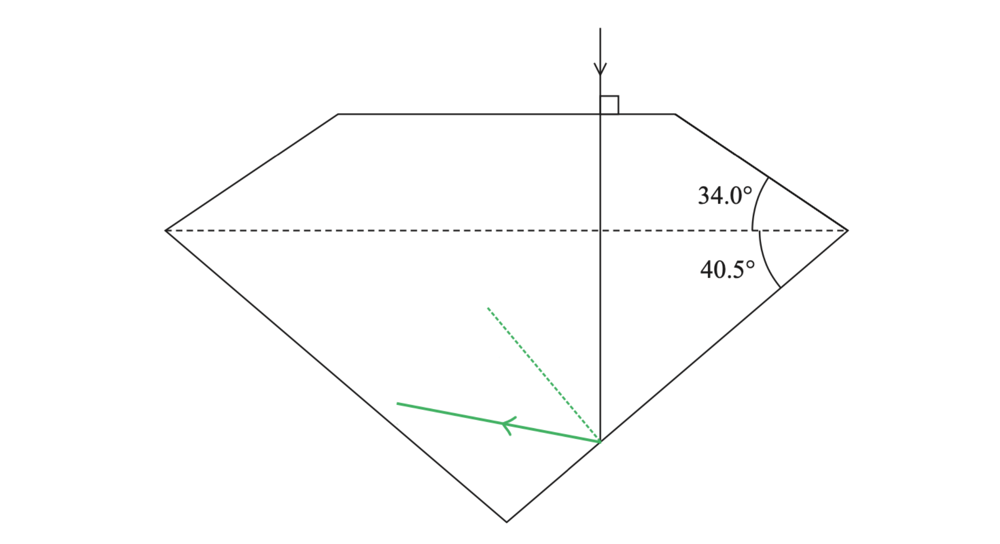
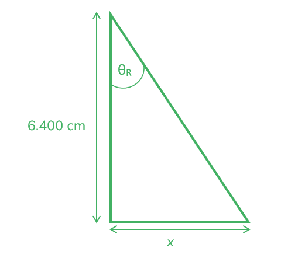
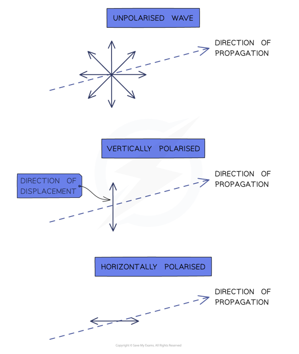
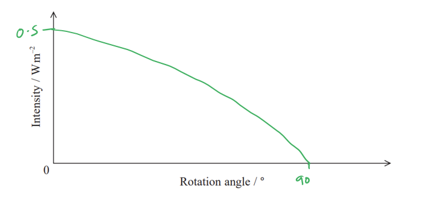
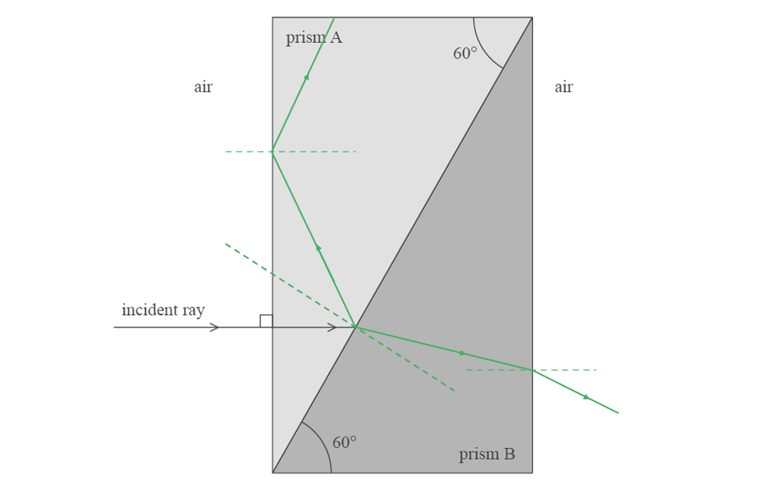

# Mark Schemes — Refraction, Reflection & Polarisation
**2. Waves & Electricity** · Edexcel International A Level (IAL) Physics (YPH11)

## Q1 — medium — 9 marks · structured-questions

### 11((a)) — 3 marks
Deduce the material used for the gemstone:

List the known quantities:

- Angle of incidence, $θ_{1}$ = 50°
- Angle of refraction, $θ_{2}$ = 21°

Determine the refractive index of the gemstone, $n_{2}$:

- $n_{1}\mathrm{sin}θ_{1}=n_{2}\mathrm{sin}θ_{2}$
- `n subscript 2 space equals space fraction numerator n subscript 1 sin theta subscript 1 over denominator sin theta subscript 2 end fraction space equals space fraction numerator 1.00 space cross times space sin open parentheses 50 degree close parentheses over denominator sin open parentheses 21 degree close parentheses end fraction` **[1 mark]**
- $n_{2}=2.138$

Determine the speed of light in this gemstone and compare to the table:

- $n=\frac{c}{v}$
- $v=\frac{c}{n}=\frac{3.00\times10^{8}}{2.138}$ **[1 mark]**
- $v=1.40\times10^{8}ms^{-1}$ <u>therefore</u> the material is cubic zirconia; **[1 mark]**

**[Total: 3 marks]**

### 11((b)) — 6 marks
i) Add to the diagram to show the path of the ray of light as it leaves this boundary. Your answer should include a calculation:

List the known quantities:

- Speed of light in diamond, $v$ = 1.24 × 108 m s-1

Use diamond's refractive index to find its critical angle:

- $\mathrm{sin}C=\frac{1}{n}$ where $n=\frac{c}{v}$
- $\mathrm{sin}C=\frac{v}{c}=\frac{1.24\times10^{8}}{3.00\times10^{8}}=0.413$ **[1 mark]**
- `C space equals space sin to the power of negative 1 end exponent open parentheses 0.413 close parentheses space equals space 24.4 degree` **[1 mark]**

Compare the angle of incidence as the light leaves with the critical angle:

- Angle of incidence is 40.5°, which is greater than 24.4°

Complete the path of the ray on the diagram:

- Diagram shows reflection at a boundary; **[1 mark]**
- Ray completed showing total internal reflection <u>in the correct direction and angle</u> (by eye); **[1 mark]**

**   **

ii) Explain what would happen to the ray at this boundary if the material used was silicon carbide instead of diamond:

List the known quantities:

- Speed of light in diamond = 1.24 × 108 m s-1
- Speed of light in silicon carbide = 1.15 × 108 m s-1

Compare the two materials:

Any **one** from:

- Silicon carbide has a greater refractive index (than diamond); **[1 mark]**
- Silicon carbide has a smaller critical angle; **[1 mark]**
- Critical angle for silicon carbide is 23°; **[1 mark]**
- Critical angle is still less than the angle of incidence; **[1 mark]**
- sin*θ*2 is still greater than 1; **[1 mark]**

Describe the resulting behaviour of the ray of light:

- Total internal reflection would (still) take place; **[1 mark]**

**[Total: 6 marks]**

- *In total internal reflection, the angle of incidence is equal to the angle of reflection*

  - *Use a **protractor** to ensure your diagram **accurately** reflects this*
- *It is possible to use the equation *$n_{1}sinθ_{1}=n_{2}sinθ_{2}$* to answer part (i)*

  - *The values of **θ**1** and **n**1** show that **sin**θ**2** > 1*
  - *The sine of anything cannot be **greater than 1** (or less than −1), so refraction cannot occur - **TIR** must be happening*
- *In part (ii), the same calculations are performed as in part (i) to show that the angle of incidence **exceeds** the critical angle of silicon carbide*

## Q2 — medium — 9 marks · structured-questions

### 13((a)) — 5 marks
Determine the distance between the point of entry and the point of exit from the glass block:

List the known quantities:

- Refractive index of glass for red light, *n*red = 1.513
- Refractive index of glass for violet light, *n*violet = 1.532
- Refractive index of air, *n*air = 1.000
- Angle of incidence, $θ_{I}$ = 54.00 °
- Width of glass block BD = 6.400 cm

Calculate the angle of refraction for red and violet light using Snell's Law, $n_{1}\mathrm{sin}θ_{1}=n_{2}\mathrm{sin}θ_{2}$:

- $n_{air}\mathrm{sin}θ_{I}=n_{red}\mathrm{sin}θ_{R-red}$ and $n_{air}\mathrm{sin}θ_{I}=n_{violet}\mathrm{sin}θ_{R-violet}$

**EITHER**

- $\mathrm{sin}θ_{R-red}=\frac{n_{air}\mathrm{sin}θ_{I}}{n_{red}}=\frac{1.000\times54.00}{1.513}$**[1 mark]**
- `theta subscript R minus r e d end subscript equals sin to the power of negative 1 end exponent open parentheses fraction numerator 1.000 cross times 54.00 over denominator 1.513 end fraction close parentheses equals 32.32 space degree` **[1 mark]**

**OR**

- $\mathrm{sin}θ_{R-violet}=\frac{n_{air}\mathrm{sin}θ_{I}}{n_{violet}}=\frac{1.000\times54.00}{1.532}$** [1 mark]**
- `theta subscript R minus v i o l e t end subscript equals sin to the power of negative 1 end exponent open parentheses fraction numerator 1.000 cross times 54.00 over denominator 1.532 end fraction close parentheses equals 31.88 space degree` **[1 mark]**

Use trigonometry ($\mathrm{tan}θ=\frac{opposite}{adjacent}$) to calculate the horizontal distance travelled by the light whilst in the block:

$\mathrm{tan}31.88=\frac{x_{red}}{6.400}$

**EITHER**

- For red light, $\mathrm{tan}32.32=\frac{x_{red}}{6.400}$ **[1 mark]**

  - $x_{red}=4.049\mathrm{cm}$ **[1 mark]**

**OR**

- For violet light, $\mathrm{tan}31.88=\frac{x_{violet}}{6.400}$ **[1 mark]**

  - $x_{violet}=3.981\mathrm{cm}$ **[1 mark]**

Determine the distance between the points:

- $Distance=4.049-3.981$
- Distance between points = 0.068 cm **[1 mark]**

**[Total: 5 marks]**

- *Whilst you need to calculate BOTH angles of refraction and BOTH distances **x **to get the final answer, you can obtain  4 marks for only working through one of of the light rays*

### 13((b)) — 4 marks
Explain what happens to the red light and the violet light when meeting the boundary:

List the known quantities:

- Refractive index of glass for red light, *n*red = 1.513
- Refractive index of glass for violet light, *n*violet = 1.532
- Refractive index of air, *n*air = 1.000
- Angle of incidence, $θ_{I}$ = 41.00 °

**Method 1:**

Calculate $n\mathrm{sin}θ$ for violet and red light:

- For red light, $n\mathrm{sin}θ=1.513\mathrm{sin}41.00$ **[1 mark]**
- $n\mathrm{sin}θ=0.993$ **[1 mark]** **OR**
- For violet light, $n\mathrm{sin}θ=1.532\mathrm{sin}41.00$** [1 mark]**
- $n\mathrm{sin}θ=1.005$** [1 mark]**

Comment on these values:

- Red light refracts out of the glass as $n\mathrm{sin}θ<1$ **[1 mark]**
- Violet light undergoes total internal reflection as $n\mathrm{sin}θ>1$ **[1 mark]**

**Method 2:**

Calculate the critical angle for violet and red light using $\mathrm{sin}C=\frac{1}{n}$:

- For red light, `C equals sin to the power of 1 open parentheses 1 over n close parentheses equals sin to the power of negative 1 end exponent open parentheses fraction numerator 1 over denominator 1.513 end fraction close parentheses` **[1 mark]**
- $C=41.4^{\circ}$ **[1 mark]** **OR**
- For violet light, `C equals sin to the power of 1 open parentheses 1 over n close parentheses equals sin to the power of negative 1 end exponent open parentheses fraction numerator 1 over denominator 1.532 end fraction close parentheses` **[1 mark]**
- $C=40.7^{\circ}$ **[1 mark]**

Comment on these values:

- Red light refracts out of the glass as $C>i$ **[1 mark]**
- Violet light undergoes total internal reflection as $C<i$ **[1 mark]**

**[Total: 4 marks]**

- *The key here is to determine whether the light ray will emerge or undergo total internal reflection*
- *There are two ways to do this as shown:*

  - *A ray will not emerge if *$nsinθ$* is greater than the refractive index of the new material*
  - *A ray will not emerge if the angle of incidence is greater than the critical angle *

## Q3 — medium — 9 marks · structured-questions

### 16((a)) — 3 marks
Explain the difference between unpolarised and plane polarized light:

**EITHER**

- Unpolarised light vibrates / oscillates in all planes; **[1 mark]**
- Plane polarised light vibrates / oscillates in one plane; **[1 mark]**
- This includes the direction of wave travel; **[1 mark]**

**OR**

- Unpolarised light vibrates / oscillates in all directions; **[1 mark]**
- Plane polarised light vibrates / oscillates in one direction; **[1 mark]**
- Perpendicular to the direction of wave travel; **[1 mark]**

**[Total: 3 marks]**

- *Polarization is the process of only allowing oscillation in one plane:*

### 16((b)) — 3 marks
Sketch a graph to show how the intensity of light measured at the screen varies as the filter is rotated from 0° to 90°:

- Numbers added to both axes; **[1 mark]**
- Single maximum at 0° and single minimum at 90° **[1 mark]**
- Intensity at 0° ≤ 0.5 W m−2 due to the light passing through the first polarizer; **[1 mark]**

**[Total: 3 marks]**

### 16((c)) — 3 marks
Explain how this photograph can be used to identify areas of the material with different amounts of stress:

- (Polarising) filters at 90° to each other do not allow light to pass through; **[1 mark]**
- Rotation of plane of polarisation (due to stress) allows light to pass; **[1 mark]**
- Darker areas represent less stress **OR** brighter areas represent greater stress; **[1 mark]**

**[Total: 3 marks]**

## Q4 — medium — 12 marks · structured-questions

### 16((a)) — 2 marks
The differences between transverse waves and longitudinal waves are:

- For transverse waves the oscillations / vibrations are perpendicular to the direction of (wave) travel; **[1 mark]**
- For longitudinal waves, the oscillations / vibrations are parallel to the direction of (wave) travel; **[1 mark]**

**[Total: 2 marks]**

- *This is a very standard and common question that regularly appears on exams, and is easy to score full marks on if you learn the definitions*
- *However, examiners reported that students tended to do particularly badly on this question, by either only stating the definition for one type of wave, or not being clear what the oscillations were perpendicular / parallel to*

### 16((b)) — 8 marks
i) The incident ray of light does not change direction as it enters prism A because:

- The light is (incident on the boundary) along the normal **OR** the angle of incidence is 0° **OR** the light hits prism A at a right angle (to the surface); **[1 mark]**

ii) Complete the diagram to show the two paths taken by the reflected and refracted light until they have returned to the air:

A diagram scoring 4 marks:

- The normal line is drawn perpendicular to the boundary between prisms A and B; **[1 mark]**
- The reflected ray is drawn with $θ_{i}=θ_{r}$ (by eye) at the boundary; **[1 mark]**
- The refracted ray is drawn bending toward the normal (by eye) from the boundary between A and B; **[1 mark]**
- The refracted ray is drawn bending away from the normal as it enters the air **AND **total internal reflection of the reflected ray / the reflected ray has $θ_{i}=θ_{r}$ (by eye) at the left hand side; **[1 mark]**

iii) Calculate the angle of refraction as this ray of light travels across the boundary between prism A and prism B:

- $n_{1}\mathrm{sin}θ_{1}=n_{2}\mathrm{sin}θ_{2}$
- $θ_{2}=\frac{n_{1}\mathrm{sin}θ_{1}}{n_{2}}$** [1 mark]**
- `theta subscript r space equals space fraction numerator 1.40 space cross times space sin open parentheses 30 close parentheses over denominator 1.55 end fraction`** [1 mark]**
- $θ_{r}=26.8^{\circ}$** [1 mark]**

### 16((c)) — 2 marks
Using a polarising filter on the light emerging from B proves that light is transverse because:

- The light emerging is (already) polarised; **[1 mark]**
- And only transverse waves can be polarised; **[1 mark]**

**[Total: 2 marks]**

- *Students who answered that the light was only polarised after it passed through the polarising filter did not gain the first mark*

## Q5 — medium — 1 marks · multiple-choice-questions

### 5() — 1 marks
**Correct answer: B** — *v*L > *v*N > *v*M

**Final answer:** **The correct answer is ****B**** because:**

- When light passes from a less dense to a more dense medium it slows down and the ray bends toward the normal
- Therefore, the light ray has slowed down as it passes from L to M, and then it speeds up as it passes from M to N

  - Hence, medium M is the most dense, having the slowest speed
- The light ray is refracted more at the LM boundary than it is at the MN boundary

  - Therefore, the change in speed is greater at the LM boundary
  - Hence, medium N is denser than medium L, so the speed is slower in N than in L
- Therefore, $v_{L}>v_{N}>v_{M}$

  - This is answer **B**

- It helps to draw in the normals on the diagram to compare the amount of refraction

## Q6 — medium — 1 marks · multiple-choice-questions

### 6() — 1 marks
**Correct answer: C** — light travelling from M to L

**Final answer:** **The correct answer is ****C**** because:**

- The conditions for total internal reflection are:

  - The angle of incidence is greater than the critical angle
  
    - $θ_{i}>θ_{c}$
  - The refractive index of the first medium is greater than that of the second
  
    - $n_{1}>n_{2}$
- Therefore, the light must travel from a denser medium into a less dense one

  - Since $v_{L}>v_{N}>v_{M}$
  - The only answer option where light would travel from a denser medium into a less dense medium is **C**

## Q7 — medium — 1 marks · multiple-choice-questions

### 3() — 1 marks
**Correct answer: B** — `fraction numerator open parentheses 0.14 close parentheses space cross times open parentheses 4 straight pi close parentheses cross times open parentheses 2.0 close parentheses squared over denominator 0.12 end fraction`

**Final answer:** **The correct answer is ****B**** because:**

- $I=\frac{P}{A}$and, as the light is emitted in a sphere, $A=4πr^{2}$
- Therefore, the **useful **power emitted by the bulb can be found by:

  - $0.14=\frac{P}{4π\times2.0^{2}}$
  - `P equals open parentheses 0.14 close parentheses cross times open parentheses 4 pi close parentheses cross times open parentheses 2.0 close parentheses squared`
- Since $efficiency=\frac{usefulpower}{totalpowerinput}$ and efficiency is 0.12:

  - Total power of the lightbulb, `P subscript t o t end subscript equals fraction numerator open parentheses 0.14 close parentheses cross times open parentheses 4 pi close parentheses cross times open parentheses 2.0 close parentheses squared over denominator 0.12 end fraction`

## Q8 — easy — 1 marks · multiple-choice-questions

### 1() — 1 marks
**Correct answer: A** — polarisation

**Final answer:** **The correct answer is A**

- Polarisation restricts the oscillations of a wave to a single plane
- This phenomenon is only possible if the oscillations are **perpendicular **to the direction of energy transfer

  - Therefore, **only **transverse waves can be polarised

- Sound is a longitudinal wave, meaning the oscillations are parallel to the direction of energy transfer
- Since there is no perpendicular plane to restrict, polarisation **cannot** be demonstrated with sound waves

**B** is incorrect because interference can be demonstrated with sound waves, e.g. two loudspeakers emitting identical sound waves produce loud (max intensity) and quiet (min intensity) spots.

**C** is incorrect because diffraction can be demonstrated with sound waves, e.g. they spread around obstacles and through gaps such as doorways, which is why sound is heard around corners.

**D** is incorrect because resonance can be demonstrated with sound waves, e.g. a tuning fork producing stationary waves in a resonance tube.

## Q9 — medium — 1 marks · multiple-choice-questions

### 1() — 1 marks
**Correct answer: D** — $\frac{uf}{u-f}$

**Final answer:** **The correct answer is D**

- The lens equation for a converging lens producing a real image is:

$\frac{1}{u}+\frac{1}{v}=\frac{1}{f}$

- Rearranging for $\frac{1}{v}$:

$\frac{1}{v}=\frac{1}{f}-\frac{1}{u}$

$\frac{1}{v}=\frac{u}{uf}-\frac{f}{uf}$

$\frac{1}{v}=\frac{u-f}{uf}$

- Therefore, the expression for image distance $v$ is:

$v=\frac{uf}{u-f}$
