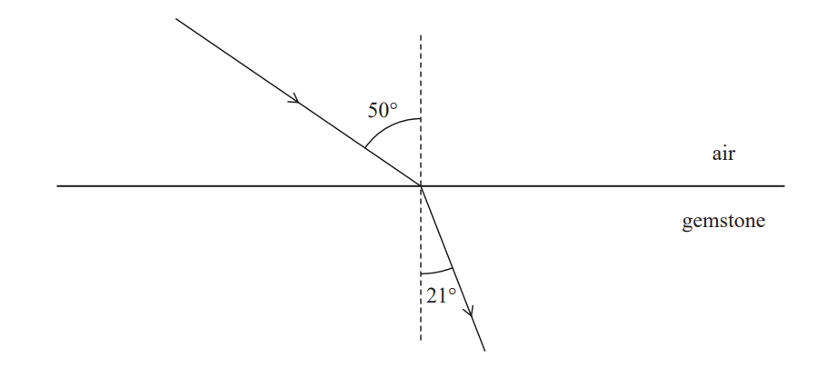
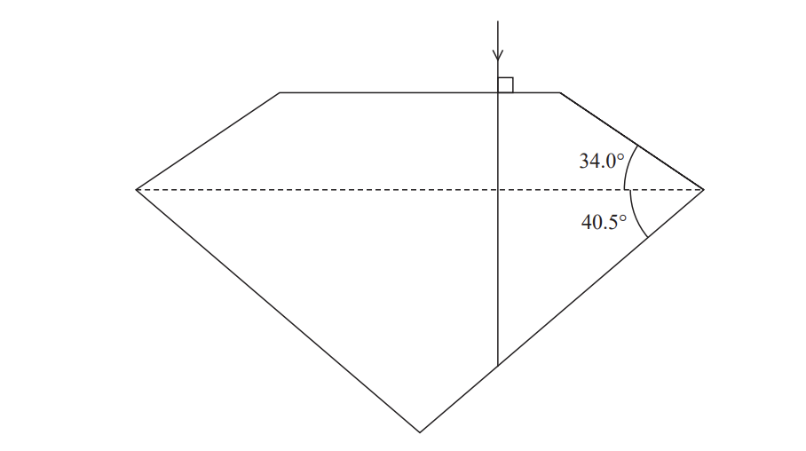
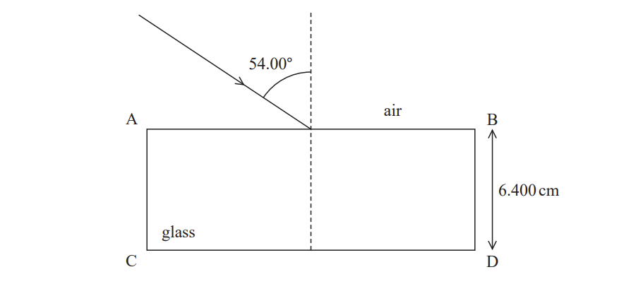
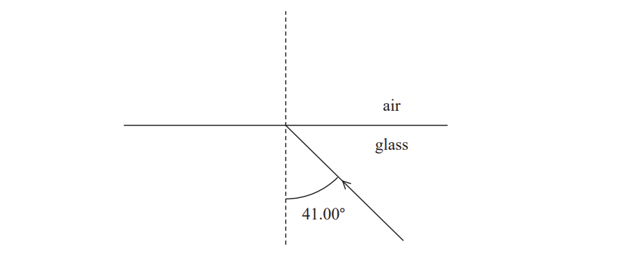
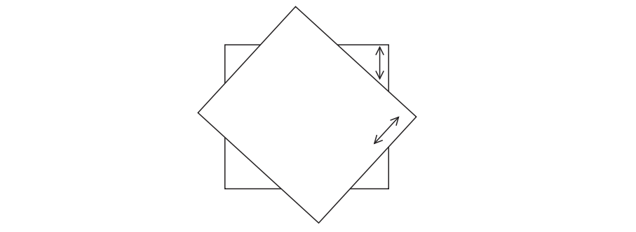
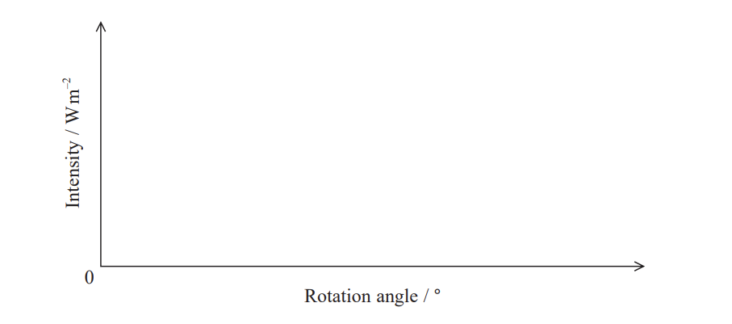
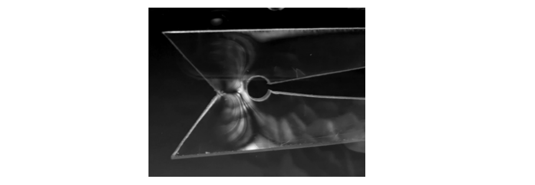
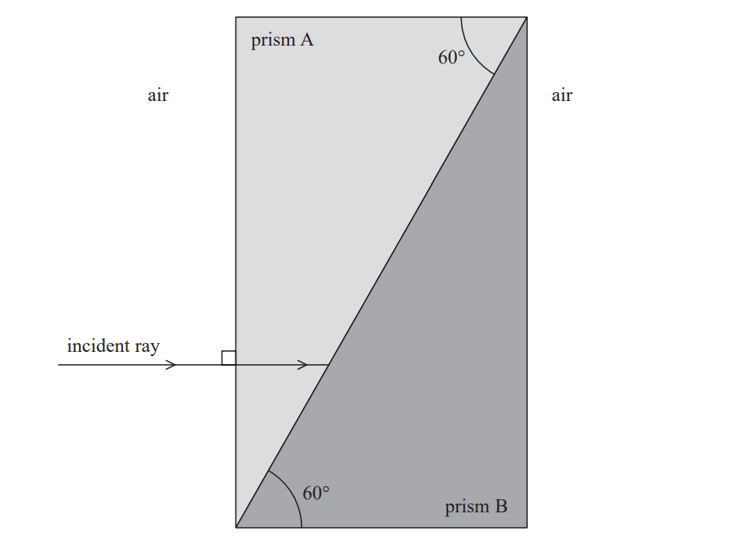
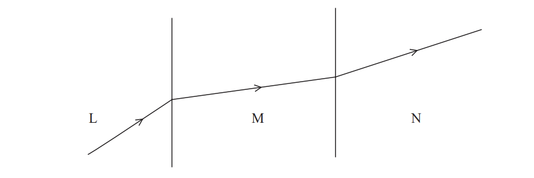

# Exam Questions — Refraction, Reflection & Polarisation
**2. Waves & Electricity** · Edexcel International A Level (IAL) Physics (YPH11)
> Source: [https://www.savemyexams.com/international-a-level/physics/edexcel/19/topic-questions/2-waves-and-electricity/refraction-reflection-and-polarisation/structured-questions/](https://www.savemyexams.com/international-a-level/physics/edexcel/19/topic-questions/2-waves-and-electricity/refraction-reflection-and-polarisation/structured-questions/) · 9 questions · total 44 marks

## Q1 — medium — 9 marks · structured-questions

### 11((a)) — 3 marks — command: deduce — structured — from paper Oct/Nov 2021 · WPH12/01
Diamonds, cubic zirconia and silicon carbide can be used as gemstones in jewellery.

The speed of light in these materials is shown in the table.

|   | **diamond** | **cubic zirconia** | **silicon carbide** |
|---|---|---|---|
| **speed of light/ms****−1** | 1.24 × 108 | 1.39 × 108 | 1.15 × 108 |

In order to identify the material used, a ray of light is directed towards a boundary between air and the gemstone.

Deduce the material used for the gemstone.

### 11((b)) — 6 marks — command: multiple — structured — from paper Oct/Nov 2021 · WPH12/01
Diamonds are cut into different shapes so that they ‘sparkle’ when light shines on them.

The diagram shows a ray of light entering a diamond and incident on a boundary between diamond and air.

i) Add to the diagram to show the path of the ray of light as it leaves this boundary. Your answer should include a calculation.

**(4)**

ii) Explain what would happen to the ray at this boundary if the material used was silicon carbide instead of diamond.

**(2)**

## Q2 — medium — 9 marks · structured-questions

### 13((a)) — 5 marks — command: determine — structured — from paper 2021 June · WPH12/01
The refractive index of glass varies with the colour of light.

refractive index of glass for red light = 1.513

refractive index of glass for violet light = 1.532

A ray of white light is incident on side AB of a rectangular glass block, as shown.

The red light and violet light from the incident ray arrive at slightly different points on side CD.

Determine the distance between these points.

Distance between points = ........................

### 13((b)) — 4 marks — command: explain — structured — from paper 2021 June · WPH12/01
White light is incident on a boundary between glass and air, as shown.

Explain what happens to the red light and the violet light when meeting the boundary.

Your answer should include calculations.

## Q3 — medium — 9 marks · structured-questions

### 16((a)) — 3 marks — command: explain — structured — from paper 2021 June · WPH12/01
When unpolarised light passes through a polarising filter, the light becomes plane polarised.

Explain the difference between unpolarised and plane polarized light.

### 16((b)) — 3 marks — command: sketch — structured — from paper 2021 June · WPH12/01
An unpolarised light source is directed towards a screen. The intensity of radiation measured at the screen is 1.00 W m−2.

Two polarising filters are placed between the light source and the screen.

Initially there is an angle of 0° between their planes of polarisation, as shown.

One of the polarising filters is then rotated, as shown.

Sketch a graph to show how the intensity of light measured at the screen varies as the filter is rotated from 0° to 90°.

### 16((c)) — 3 marks — command: explain — structured — from paper 2021 June · WPH12/01
Polarisation can be used to identify when some materials are under stress. Placing the material under stress causes the plane of polarisation of the light passing through the material to be rotated. The greater the stress, the greater the rotation of the plane of polarisation of the light.

A piece of transparent material under stress is positioned between two polarizing filters. There is an angle of 90o between the planes of polarisation of the two polarising filters.

Explain how this photograph can be used to identify areas of the material with different amounts of stress.

## Q4 — medium — 12 marks · structured-questions

### 16((a)) — 2 marks — command: describe — structured — from paper 2022 Jan · WPH12/01
Light is a transverse wave.

Describe the difference between transverse waves and longitudinal waves.

### 16((b)) — 8 marks — command: multiple — structured — from paper 2022 Jan · WPH12/01
Two prisms, A and B, made from different types of glass are placed in contact as shown. An incident ray of light enters prism A.

i) State why the incident ray of light does not change direction as it enters prism A.

**(1)**

ii) The refractive index of the glass in prism B is greater than the refractive index of the glass in prism A. When the ray of light reaches the boundary between the prisms, some light is reflected and some is refracted.

Complete the diagram to show the two paths taken by the reflected and refracted light until they have returned to the air.

**(4)**

iii) Calculate the angle of refraction as this ray of light travels across the boundary between prism A and prism B.

refractive index of glass in prism A = 1.40

refractive index of glass in prism B = 1.55

Angle of refraction = .............................**(3)**

### 16((c)) — 2 marks — command: explain — structured — from paper 2022 Jan · WPH12/01
The light emerging from prism B is observed through a polarising filter. The polarizing filter is rotated gradually, and the light transmitted by the filter varies in intensity.

Explain how this observation demonstrates that light waves are transverse.

## Q5 — medium — 1 marks · multiple-choice-questions

### 5() — 1 mark — multiple_choice — from paper 2022 Jan · WPH12/01
The diagram shows refraction of a ray of light as it passes through three transparent substances, L, M and N. The speeds of light in the three substances are *v*L, *v*M and *v*N, respectively.

Which of the following shows the relationship between *v*L, *v*M and *v*N?
- **A.** *v*L > *v*M > *v*N
- **B.** *v*L > *v*N > *v*M
- **C.** *v*N > *v*M > *v*L
- **D.** *v*M > *v*N > *v*L

## Q6 — medium — 1 marks · multiple-choice-questions

### 6() — 1 mark — multiple_choice — from paper 2022 Jan · WPH12/01
The diagram shows refraction of a ray of light as it passes through three transparent substances, L, M and N. The speeds of light in the three substances are *v*L, *v*M and *v*N, respectively.

Which of the following could result in a ray of light undergoing total internal reflection?
- **A.** light travelling from L to M
- **B.** light travelling from L to N
- **C.** light travelling from M to L
- **D.** light travelling from N to M

## Q7 — medium — 1 marks · multiple-choice-questions

### 3() — 1 mark — multiple_choice — from paper 2021 June · WPH12/01
A light bulb with an efficiency of 12% is positioned 2.0 m above a light sensor.

The intensity of light at the light sensor is 0.14 W m−2.

Which of the following could be used to calculate the power of the light bulb?
- **A.** `open parentheses 0.14 close parentheses space cross times open parentheses 0.12 close parentheses space cross times open parentheses 4 straight pi close parentheses cross times open parentheses 2.0 close parentheses squared`
- **B.** `fraction numerator open parentheses 0.14 close parentheses space cross times open parentheses 4 straight pi close parentheses cross times open parentheses 2.0 close parentheses squared over denominator 0.12 end fraction`
- **C.** `open parentheses 0.14 close parentheses space cross times open parentheses 0.12 close parentheses space cross times open parentheses straight pi close parentheses cross times open parentheses 2.0 close parentheses squared`
- **D.** `fraction numerator open parentheses 0.14 close parentheses space cross times open parentheses straight pi close parentheses cross times open parentheses 2.0 close parentheses squared over denominator 0.12 end fraction`

## Q8 — easy — 1 marks · multiple-choice-questions

### 1() — 1 mark — multiple_choice
Which of the following **cannot** be experimentally demonstrated with sound waves?
- **A.** polarisation
- **B.** interference
- **C.** diffraction
- **D.** resonance

## Q9 — medium — 1 marks · multiple-choice-questions

### 1() — 1 mark — multiple_choice
An object is placed a distance $u$ from a lens of focal length $f$. A real image is produced.

Which of the following gives the distance from the lens to the image?
- **A.** $\frac{1}{f}-\frac{1}{u}$
- **B.** $\frac{u}{u-f}$
- **C.** $\frac{uf}{u+f}$
- **D.** $\frac{uf}{u-f}$
