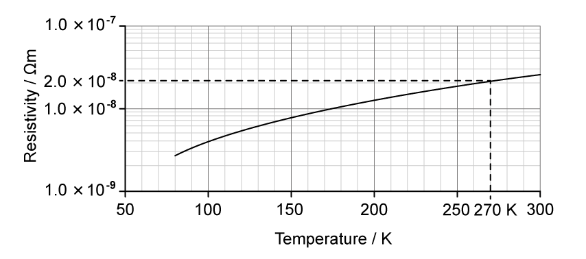
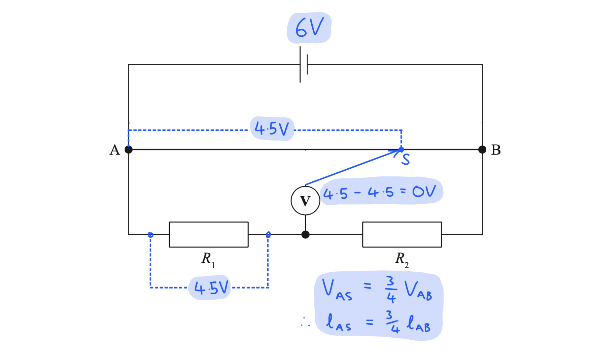

# Mark Schemes — Resistance, Resistivity & Potential Dividers
**2. Waves & Electricity** · Edexcel International A Level (IAL) Physics (YPH11)

## Q1 — medium — 5 marks · structured-questions

### 11((a)) — 1 marks
State the purpose of the resistor in this circuit:

- To limit the current (in the circuit) **or **To avoid overheating/melting (in the circuit); **[1 mark]**

**[Total: 1 mark]**

### 11((b)) — 4 marks
A correctly completed table would look like:

| **Ratio** | **Value** | **Reason** |
|---|---|---|
| $\frac{n_{w}}{n_{z}}$ | 1 | Both wires are made of the same material |
| $\frac{I_{w}}{I_{z}}$ | **Final answer:** **1** | **Final answer:** **As current is the same around a series circuit** |
| $\frac{v_{w}}{v_{z}}$ | **Final answer:** **0.25** | **As the (cross-sectional) area is 4 times less for Z ****or**** ****as the (cross-sectional) area is 4 times greater for W** |

- ***One mark**** for each complete box*

  - *The reason mark cannot be awarded if the value mark is incorrect*

**[Total: 4 marks]**

## Q2 — medium — 7 marks · structured-questions

### 13((a)) — 4 marks
Calculate the length of the wire in the filament:

List the known quantities:

- Diameter of wire, $d$ = 0.25 mm
- Metal's resistivity, $ρ$ = 5.6 × 10−8 Ω m
- Potential difference across filament lamp, $V$ = 12 V
- Power transferred by lamp, $P$ = 60 W

Determine the resistance of the lamp:

- $P=\frac{V^{2}}{R}$
- $R=\frac{V^{2}}{P}=\frac{12^{2}}{60}$ **[1 mark]**
- $R=2.4Ω$

Determine the cross-sectional area of the wire:

- `A space equals space straight pi r squared space equals space straight pi open parentheses d over 2 close parentheses squared`
- `A space equals space fraction numerator pi space cross times space open parentheses 0.25 space cross times space 10 to the power of negative 3 end exponent close parentheses squared over denominator 4 end fraction` **[1 mark]**
- $A=4.91\times10^{-8}m^{2}$

Determine length using the resistivity equation:

- $R=\frac{ρl}{A}$
- `l space equals space fraction numerator A R over denominator rho end fraction space equals space fraction numerator open parentheses 4.91 space cross times space 10 to the power of negative 8 end exponent close parentheses space cross times space 2.4 over denominator 5.6 space cross times space 10 to the power of negative 8 end exponent end fraction` **[1 mark]**
- $l=2.1m$ **[1 mark]**

**[Total: 4 marks]**

- *Questions like this that combine a lot of equations can sometimes require planning **before** you set out to answer it*
- *Working **backwards** can help:*

  1. *"I have been given resistivity and am being asked for a length, I will need the resistivity equation"*
  2. *"This equation needs area and resistance"*
  3. *"I can find the area of a circle using diameter"*
  4. *"I can find resistance using power and potential difference"*

### 13((b)) — 3 marks
The student states that both lamps will operate normally. Evaluate whether the student’s statement is correct:

**Method 1: ***Compare the resistance and hence p.d. across each bulb*:

- A has a lower resistance than / half the resistance of B **or** (at 12 V) *R*A = <u>2.4 Ω</u>, *R*B = <u>4.8 Ω</u>; **[1 mark]**
- (This means) p.d. is not equally shared between lamps **or** B has a greater p.d. than A; **[1 mark]**
- A will have less than 12 V so will not operate normally **or** B will have more than 12 V so will not operate normally; **[1 mark]**

**Method 2: ***Compare the current through each bulb*:

- (At 12 V) lamp A needs 5 A **and** lamp B needs 2.5 A; **[1 mark]**
- (The circuit is series so) current will be the same for both; **[1 mark]**
- A will have too little current so will not operate normally **or** B will have too much current so will not operate normally; **[1 mark]**

**[Total: 3 marks]**

- *Resistance is calculated using *$R=\frac{V^{2}}{P}$* or current is calculated using *$I=\frac{P}{V}$* at a p.d. of 12 V in both cases*
- *In this circuit, if both bulbs had the **same** resistance then each would have a p.d. of **12 V** (half cell emf, according to Kirchoff's second law), which is the p.d. they need to operate normally*

  - *The fact that they don't have the same resistance at 12 V means they don't have the same resistance at any p.d.*

## Q3 — medium — 8 marks · structured-questions

### 11((a)) — 2 marks
Calculate the resistivity of nichrome:

- Resistivity, $R=\frac{ρl}{A}$
- `rho space equals space fraction numerator R A over denominator l end fraction space equals space fraction numerator 2.0 space cross times space open parentheses 2.5 cross times 10 to the power of negative 7 end exponent close parentheses over denominator 0.45 end fraction` **[1 mark]**
- $ρ=1.11\times10^{-6}Ωm$ **[1 mark]**

**[Total: 2 marks]**

- *Examiners reported that a common mistake with question was confusing the values for resistance and resistivity*

  - *Always double check your values as you substitute them into the equation!*

### 11((b)) — 3 marks
Calculate the drift velocity of the conduction electrons in the nichrome wire:

Calculate the current:

- $R=\frac{V}{I}$
- $I=\frac{V}{R}=\frac{3.0}{2.0}=1.5A$ **[1 mark]**

Calculate the drift velocity:

- $I=nqvA$
- `v space equals fraction numerator space I over denominator n q A end fraction space equals space fraction numerator 1.5 over denominator open parentheses 9.0 cross times 10 to the power of 28 close parentheses space cross times space open parentheses 1.60 cross times 10 to the power of negative 19 end exponent close parentheses space cross times space open parentheses 2.5 cross times 10 to the power of negative 7 end exponent close parentheses end fraction` **[1 mark]**
- $v=4.17\times10^{-4}ms^{-1}$ **[1 mark]**

**[Total: 3 marks]**

- *Examiners reported that common errors in this questions were:*

  - *Using the mass of an electron rather than the charge on an electron*
  - *Using the value of resistivity in the Ohm's law equation*
  - *Trying to incorporate the length of the wire into the calculation*
- *Common errors are always handy to know so that you don't make the same mistakes!*

### 11((c)) — 3 marks
Comment on the suggestion that the drift velocity will double if the length of wire used in the circuit is halved:

- Halving the length halves the resistance; **[1 mark]**
- Which doubles the current; **[1 mark]**
- Since $I=nqvA$, current is proportional to drift velocity, $I\proptov$, so doubling the current (by halving the length of the wire) will cause the drift velocity to double; **[1 mark]**

**[Total: 3 marks]**

- *When a question asks for **comments** on a suggestion, the answers should be in **words** and not algebra*
- *Make sure you are clear on what the question is asking*

  - *Examiners reported that many students misread the question and answered as through the length of the wire had doubled*
  - *Another common issue was the answers given were not clear enough to award marks for*
  
    - *For example talking about factors **increasing **rather than **doubling*

## Q4 — medium — 8 marks · structured-questions

### 1() — 2 marks
> **[mark-scheme]**
> As the incident light intensity on the LDR decreases:
> 
> - The number density of charge carriers decreases **[1 mark]**
> - This results in an increase in resistance **[1 mark]**
> 
> The second mark is dependent on the first mark being awarded.
> 
> For the first mark, acceptable alternatives include:
> 
> - Fewer electrons are released into the conduction band
> - There are fewer free electrons
> - The number of free charge carriers per unit volume decreases
> - The number density of (conduction) electrons decreases

> **[exam-tip]**
> The behaviours of LDRs and thermistors are often confused. An LDR is a light-*dependent* resistor — its resistance rises as light intensity falls, because fewer incident photons means fewer electrons are released into the conduction band, decreasing the number of free charge carriers per unit volume ($n$).
> 
> A (negative temperature coefficient) thermistor's resistance also rises, but via a different mechanism (decreased thermal energy means fewer electrons cross the energy gap). In both cases, the direction of change is "resistance increases", but the *cause* differs. An "Explain" question expects you to state both the direction and the underlying mechanism.

### 2() — 3 marks
**ALTERNATIVE 1 - Using V=IR:**

For two series components, the total resistance is $R_{\text{total}}=R_{\text{LDR}}+R_{\text{fixed}}$. As the incident light intensity decreases, $R_{\text{LDR}}$ increases, the total resistance of the circuit increases **[1 mark]**

For the circuit $V_{\text{total}}=IR_{\text{total}}$: as $R_{\text{total}}$ increases, but $V_{\text{total}}$ stays constant, the current in the circuit decreases **[1 mark]**

For the fixed resistor $V_{\text{fixed}}=IR_{\text{fixed}}$: as $I$ decreases, but $R_{\text{fixed}}$ stays constant, $V_{\text{fixed}}$ decreases, therefore, the voltmeter reading decreases **[1 mark]**

**ALTERNATIVE 2 - Using potential divider theory:**

The LDR and the fixed resistor share the supply p.d. as a ratio of resistances, i.e. $V_{\text{fixed}}=\frac{R_{\text{fixed}}}{R_{\text{LDR}}+R_{\text{fixed}}}\timesV_{\text{total}}$ **[1 mark]**

As $R_{\text{LDR}}$ increases, but $R_{\text{fixed}}$ stays constant **[1 mark]**

$V_{\text{fixed}}$ decreases, therefore, the voltmeter reading decreases **[1 mark]**

> **[mark-scheme]**
> For Alternative 1, the marks are scored for an explanation that includes:
> 
> - the total resistance of the circuit increases
> - the current in the circuit decreases
> - voltmeter reading decreases
> 
> For Alternative 2, the marks are scored for an explanation that includes:
> 
> - the supply p.d. divides as a ratio of resistances
> - the LDR's resistance increases, the resistor's resistance is constant
> - voltmeter reading decreases
> 
> In both approaches, the third mark is dependent on either the first or second mark being awarded.

> **[exam-tip]**
> In a potential divider, the voltmeter measures the share of the supply p.d. across the component it is connected across, not the other component. The two readings always change in opposite directions because they must sum to the supply p.d. A common slip on this question is to give the directional change for the LDR's share when the voltmeter is actually across the fixed resistor.

### 3() — 3 marks
To determine whether the student's circuit will switch on the LED:

- List the known quantities:

  - p.d. of supply, $V_{\text{total}}=6.0\text{V}$
  - Resistance of fixed resistor, $R_{\text{fixed}}=10\text{k}Ω$
- Read the resistance of the LDR from the graph at $30 \text{lux}$:

$R_{\text{LDR}}=52\text{k}Ω$ **[1 mark]**

- Apply the potential divider equation:

$V_{\text{out}}=V_{\text{total}}\times\frac{R_{\text{LDR}}}{R_{\text{LDR}}+R_{\text{fixed}}}$

$V_{\text{out}}=6.0\times\frac{52}{52+10}$

$V_{\text{out}}=5.03\text{V}$ **[1 mark]**

- Compare with the threshold and state the conclusion:

$5.03\text{V}>5.0\text{V}$, so the LED switches on at $30 \text{lux}$ (and stays on) **[1 mark]**

> **[mark-scheme]**
> 1 mark for reading $R_{\text{LDR}}$ from the graph at $30 \text{lux}$
> 
> - Accept any value in the range $51$–$53\text{k}Ω$ (within half a small square of $52\text{k}Ω$)
> 
> 1 mark for substitution into the potential divider equation and calculation of $V_{\text{out}}$
> 
> - Accept $V_{\text{out}} = 5 . 0 \text{V}$ to 2 s.f. (range $5 . 02$–$5 . 05 \text{V}$, consistent with the LDR value read from the graph)
> 
> 1 mark for comparing the calculated $V_{\text{out}}$ with $5.0\text{V}$ and a conclusion that  the LED switches on
> 
> - Do not accept a bald yes/no conclusion without a numerical comparison
> - Award if the conclusion is consistent with the calculated value, even if the calculation is incorrect

> **[exam-tip]**
> On a "Determine whether" question, the final mark always depends on an **explicit numerical comparison** between your calculated value and the threshold given in the stem, plus a clear yes/no conclusion. A bald statement ("the sensor works") without quoting $5 . 03 \text{V} > 5 . 0 \text{V}$ loses this mark — even if every calculation is correct. When reading values off a graph, work to the nearest gridline. Note that the ratio in the potential divider equation is dimensionless, so resistances in $\text{k}Ω$ can be substituted directly without converting to $Ω$.

## Q5 — hard — 5 marks · structured-questions

### 1() — 5 marks
To deduce which system has the greater power requirement:

- List the known quantities:

  - Power of the electromagnet system, $P=12.0\text{MW}=12.0\times10^{6}\text{W}$
  - Potential difference, $V=25.0\text{kV}=25.0\times10^{3}\text{V}$
  - Length of copper wire, $l=1.50\text{km}=1500\text{m}$
  - Cross-sectional area of copper wire, $A=85.0\text{mm}^{2}=85.0\times10^{-6}\text{m}^{2}$
- Use the graph to determine the resistivity of copper at $270\text{K}$:

resistivity$=2.0\times10^{-8}\text{Ω m}$ **[1 mark]**

- Determine the operating current of the copper wire:

$P=VI$

$I=\frac{P}{V}=\frac{12.0\times10^{6}}{25.0\times10^{3}}$

$I=480\text{A}$ **[1 mark]**

- Calculate the resistance of the copper wire:

$R=\frac{ρl}{A}$

$R=\frac{2.0\times10^{-8}\times1500}{85.0\times10^{-6}}$

$R=0.353\text{Ω}$ **[1 mark]**

- Calculate the power loss in the copper wire:

$P_{\text{loss}}=I^{2}R$

$P_{\text{loss}}=480^{2}\times0.353$

$P_{\text{loss}}=81331\text{W}=81.3\text{kW}$ **[1 mark]**

- Write a concluding statement:

$25.0\text{kW}<81.3\text{kW}$, therefore, the superconductor cooling system uses less power than the copper losses, making the superconductor more efficient **[1 mark]**

> **[mark-scheme]**
> 1 mark for reading the graph at $270\text{K}$ to determine a resistivity of $2.0\times10^{-8}\text{Ω m}$
> 
> - Accept range $2.0\times10^{-8}$ to $2.1\times10^{-8}\text{Ω m}$
> 
> 1 mark for using $P=VI$ to find the operating current
> 
> 1 mark for using $R=ρl/A$ to find the resistance of the copper wire
> 
> 1 mark for using $P=I^{2}R$ to find the power loss in the copper
> 
> 1 mark for a comparison of the calculated power loss with $25.0\text{kW}$ and a valid conclusion
> 
> - Expected conclusion: superconductor cooling system requires less power (so the engineer's suggestion is incorrect)
> - Acceptable range for power loss $80\text{kW}$ to $85\text{kW}$
> - Must explicitly compare values to gain the final mark

## Q6 — easy — 1 marks · multiple-choice-questions

### 3() — 1 marks
**Correct answer: C** — $v$ represents the drift velocity of the charge carriers in the sample.

**Final answer:** **The correct answer is ****C**** because:**

- Define each term in the equation $I=nqvA$

  - $n$ is the number density of charge carriers
  - $q$ is the charge of a single carrier
  - $v$ is the drift velocity of charge carriers
  - $A$is the cross-sectional area of the wire
- Option **C** is the only correct definition

## Q7 — hard — 1 marks · multiple-choice-questions

### 8() — 1 marks
**Correct answer: B** — $\frac{y}{x-y}=\frac{R_{1}}{R_{2}}$

**Final answer:** **The correct answer is ****B**** because:**

- The voltmeter measures the potential difference between two points on **different branches**
- When the reading is 0 V, the potential difference across AS (*R*AS) is equal to the potential difference across *R*1

  - Therefore, this means the potential difference across SB (*R*SB) is equal to potential difference across *R*2
- This means that $\frac{R_{AS}}{R_{SB}}=\frac{R_{1}}{R_{2}}$
- The resistivity equation $R=\frac{ρl}{A}$ shows that the resistance of a uniform wire is proportional to its length

  - $\frac{R_{AS}}{R_{SB}}=\frac{l_{AS}}{l_{SB}}=\frac{y}{x-y}$
- $\frac{y}{x-y}=\frac{R_{1}}{R_{2}}$

- Edexcel use this style of question frequently, where a voltmeter is placed **between two branches** in a parallel circuit

  - Many students find this topic challenging!
- It is important to remember that, in a parallel circuit, the **potential difference** across each branch is the **same**

  - In this question, that means the p.d. between A and B is equal to the p.d. across resistors 1 and 2
- The voltmeter here is comparing the p.d. across *R*1 with the p.d. across AS

  - Below is an example where the cell has an emf of 6 V
  - S is moved until *V*AS is equal to the p.d. across *R*1 - when these are equal, the voltmeter reads zero

