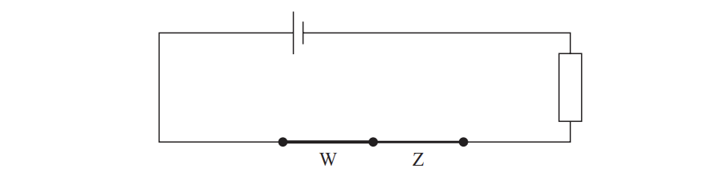
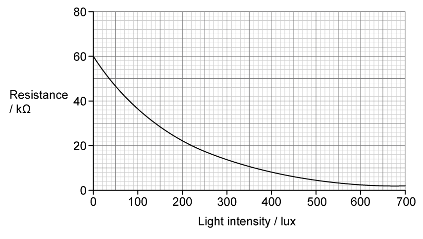
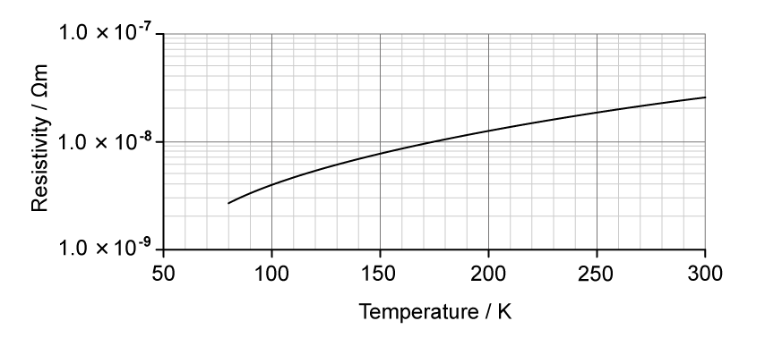
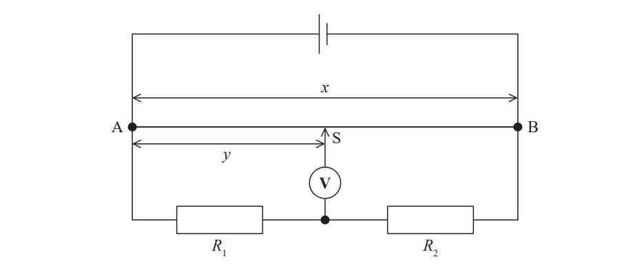

# Exam Questions — Resistance, Resistivity & Potential Dividers
**2. Waves & Electricity** · Edexcel International A Level (IAL) Physics (YPH11)
> Source: [https://www.savemyexams.com/international-a-level/physics/edexcel/19/topic-questions/2-waves-and-electricity/resistance-resistivity-and-potential-dividers/structured-questions/](https://www.savemyexams.com/international-a-level/physics/edexcel/19/topic-questions/2-waves-and-electricity/resistance-resistivity-and-potential-dividers/structured-questions/) · 7 questions · total 35 marks

## Q1 — medium — 5 marks · structured-questions

### 11((a)) — 1 mark — command: state — structured — from paper 2021 June · WPH12/01
Two copper wires, W and Z, are joined as shown. Wire W has twice the diameter of wire Z.

W and Z are connected in series with a cell and resistor, as shown.

State the purpose of the resistor in this circuit.

### 11((b)) — 4 marks — command: complete — structured — from paper 2021 June · WPH12/01
The current I in a conductor is given by the formula

$I=nqvA$

Complete the following table, which shows ratios of quantities for wires W and Z. The first row has been completed for you.

| **Ratio** | **Value** | **Reason** |
|---|---|---|
| $\frac{n_{w}}{n_{z}}$ | 1 | Both wires are made of the same material |
| $\frac{I_{w}}{I_{z}}$ |   |   |
| $\frac{v_{w}}{v_{z}}$ |   |   |

**  **

## Q2 — medium — 7 marks · structured-questions

### 13((a)) — 4 marks — command: calculate — structured — from paper Oct/Nov 2021 · WPH12/01
A filament lamp is marked 12 V 60 W. The filament is made from a long metal wire with a diameter of 0.25 mm. The metal has a resistivity of 5.6 × 10−8 Ω m when the wire is at normal operating temperature.

Calculate the length of the wire in the filament.

Length of wire = .........................................

### 13((b)) — 3 marks — command: evaluate — structured — from paper Oct/Nov 2021 · WPH12/01
A student has two filament lamps. Lamp A is marked 12 V 60 W and lamp B is marked 12 V 30 W. The student sets up the circuit shown.

The student states that both lamps will operate normally.

Evaluate whether the student’s statement is correct.

## Q3 — medium — 8 marks · structured-questions

### 11((a)) — 2 marks — command: calculate — structured — from paper 2022 Jan · WPH12/01
A nichrome wire of length 0.45 m has a cross-sectional area of 2.5 × 10–7 m2.

The resistance of the wire is 2.0 Ω.

Calculate the resistivity of nichrome.

Resistivity = ...................................

### 11((b)) — 3 marks — command: calculate — structured — from paper 2022 Jan · WPH12/01
A potential difference of 3.0 V is applied across the nichrome wire.

Calculate the drift velocity of the conduction electrons in the nichrome wire.

number of conduction electrons per m3 = 9.0 × 1028 m–3

Drift velocity = .................................

### 11((c)) — 3 marks — command: comment — structured — from paper 2022 Jan · WPH12/01
A student suggests that the drift velocity will double if the length of wire used in the circuit is halved.

Comment on this suggestion.

## Q4 — medium — 8 marks · structured-questions

### 1() — 2 marks — command: explain — structured
A student designs a light-sensing circuit used to switch on an external circuit when the light intensity falls below a certain level.

The circuit contains a light-dependent resistor (LDR) and a fixed resistor of resistance $10\text{k}Ω$, as shown. The output potential difference (p.d.) is connected to an external circuit that contains an LED.

The graph shows how the resistance of the LDR varies with the incident light intensity, measured in lux.

Explain how the resistance of the LDR changes as the incident light intensity decreases.

### 2() — 3 marks — command: explain — structured
A voltmeter is connected across the fixed resistor.

Explain what happens to the reading on the voltmeter as the incident light intensity decreases.

### 3() — 3 marks — command: determine — structured
The LED in the external circuit switches on when the output p.d. is above $5.0\text{V}$.

Determine whether the student's circuit will switch on the LED when the incident light intensity falls below $30\mathrm{lux}$.

## Q5 — hard — 5 marks · structured-questions

### 1() — 5 marks — command: deduce — structured
Early maglev prototypes used conventional copper electromagnets instead of superconducting electromagnets. Superconductors have zero resistance at low temperatures, meaning no power is wasted by transfer to thermal energy, unlike copper electromagnet systems.

The superconducting electromagnets on the SCMaglev use a liquid helium cooling system which requires a constant power of $25.0\text{kW}$.

An engineer suggests that reverting to copper electromagnets operating at an average temperature of $270\text{K}$ would be more efficient than superconductors because it would remove the need for the cooling system.

The graph shows the variation of resistivity with temperature for copper.

Deduce whether the power requirement of the superconductor cooling system is less than the power losses in the copper electromagnet system.

power requirement of the copper electromagnet system$=12.0\text{MW}$

operating potential difference$=25.0\text{kV}$

total length of copper wire$=1.50\text{km}$

cross-sectional area of copper wire$=85.0\text{mm}^{2}$

## Q6 — easy — 1 marks · multiple-choice-questions

### 3() — 1 mark — multiple_choice — from paper Oct/Nov 2021 · WPH12/01
The equation $I=nqvA$ relates the current in a sample of a material to the movement of free charge carriers in the sample.

Which of the following is a correct definition of one of the terms in this equation?
- **A.** $n$ represents the number of charge carriers in the sample.
- **B.** $q$ represents the total charge stored in the sample.
- **C.** $v$ represents the drift velocity of the charge carriers in the sample.
- **D.** $A$ represents the surface area of the sample.

## Q7 — hard — 1 marks · multiple-choice-questions

### 8() — 1 mark — multiple_choice — from paper Oct/Nov 2021 · WPH12/01
A current-carrying wire $\mathrm{AB}$ of length $x$ and uniform diameter is connected in a circuit as shown.

The slider $S$ is moved along the wire until the reading on the voltmeter is 0 V.

Which of the following equations is correct?
- **A.** $\frac{y}{x}=\frac{R_{1}}{R_{2}}$
- **B.** $\frac{y}{x-y}=\frac{R_{1}}{R_{2}}$
- **C.** $\frac{x}{y}=\frac{R_{1}}{R_{2}}$
- **D.** $\frac{x}{y}=\frac{R_{1}}{R_{1}+R_{2}}$
