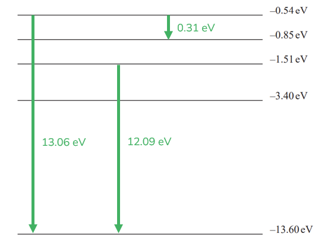

# Mark Schemes — The Photoelectric Effect & Atomic Spectra
**2. Waves & Electricity** · Edexcel International A Level (IAL) Physics (YPH11)

## Q1 — medium — 9 marks · structured-questions

### 14((a)) — 2 marks
- (In the wave model) <u>energy</u> is built up over time / slowly **or** <u>energy</u> is spread across the wave; **[1 mark]**
- So (photo)<u>electrons</u> would not be released immediately / spontaneously **or** (photo)<u>electrons</u> would be released after a time delay; **[1 mark]**

**[Total: 2 marks]**

### 14((b)) — 7 marks
i) Calculate the maximum speed with which electrons are released from the plate:

List the known quantities:

- Photon energy, $hf$ = 9.3 × 10−19 J
- work function of zinc, $ϕ$ = 4.3 eV
- Electron mass, $m$ = 9.11 × 10−31 kg

Convert work function to joules:

- `ϕ space equals space 4.3 space eV space equals space 4.3 space cross times space open parentheses 1.6 space cross times space 10 to the power of negative 19 end exponent close parentheses space straight J space equals space 6.88 space cross times space 10 to the power of negative 19 end exponent space straight J` **[1 mark]**

Use the photoelectric equation to calculate maximum speed:

- $hf=ϕ+\frac{1}{2}mv_{max}^{2}$
- `v subscript m a x end subscript space equals space square root of fraction numerator 2 open parentheses h f space minus space ϕ close parentheses over denominator m end fraction end root space equals space square root of fraction numerator 2 space cross times space open square brackets open parentheses 9.3 space cross times space 10 to the power of negative 19 end exponent close parentheses space minus space open parentheses 6.88 space cross times space 10 to the power of negative 19 end exponent close parentheses close square brackets over denominator 9.11 space cross times space 10 to the power of negative 31 end exponent end fraction end root` **[2 marks]**
- $\mathrm{maximum} \mathrm{speed}=7.29\times10^{5}ms^{-1}=7.3\times10^{5}ms^{-1}$ (2 s.f.) **[1 mark]**

**   **

ii) Discuss the student’s suggestion:

Discuss the lower work function:

- A lower work function would result in a greater (maximum) speed; **[1 mark]**

Discuss UV radiation with a greater wavelength:

- Greater wavelength would result in a smaller (maximum) speed of electrons; **or**
- A greater (maximum) speed (of electrons) would require a smaller wavelength; **[1 mark]**

Evaluate the two suggestions:

- The relative size of each change is not known, so <u>no conclusion</u> can be reached **or **The first suggestion is correct but the second is not; **[1 mark]**

**[Total: 7 marks]**

- *In part (i), the two marks in the calculation are for:*

  1. *Using electron mass in the kinetic energy part of the photoelectric equation*
  2. *Rearranging and substituting into the photoelectric equation correctly*
- *When asked to discuss, remember to consider all sides of a statement and** **then** conclude** or **evaluate*

  - *Is the statement wrong or right? Are some parts correct and others not? *

## Q2 — medium — 8 marks · structured-questions

### 16((a)) — 6 marks
Explain the process that results in the emission of different wavelengths of visible light. Your answer should include reference to energy levels in atoms:

The following list is the 'indicative marking points'. Stating all six will score four marks, less than six is marked according to a scale given below. The remaining two marks are given for the linking and explanation:

*Indicative Content (IC):*

1. Atoms / electrons absorb energy / photons
2. Electrons move to higher energy levels
3. Then drop down energy levels, releasing photons
4. Energy levels are discrete
5. For hydrogen atoms, there are only a small number of possible energy level differences (that can occur to produce visible light)
6. Since $E=hf$ and $v=fλ$, only certain wavelengths are emitted

**An example answer which scores six marks is:**

The hydrogen atoms absorb photons **[1]**, which causes electrons to be excited to higher energy levels **[2]**. Following this, the electrons drop down energy levels which releases photons **[3]**.

The difference in energy levels determines the photon energy, however **[linkage] **these energy levels are discrete **[4]**. This means **[linkage]**** **there are only a few possible energy level differences that can occur **[5]**, producing visible light.

Photon energy is proportional to frequency ($E=hf$), which affects wavelength ($v=fλ$). If only photons of certain energies can be emitted, then these can only have certain wavelengths of visible light **[6]**.

- Six indicative marking points; **[4 marks]**
- Answer shows a coherent and logical structure with linkages; **[2 marks]**

**[Total: 6 marks]**

- *The starred written questions assess your ability to **link** **facts** in a logically **structured** answer.*
- *In the table below, **indicative content (IC) points** are form the list above. The second column shows the **maximum marks** you can earn from these **statements**.*

  - *As you see, **6** correct **statements** are worth a total of **4 marks**.*
- *The third column is for ‘**linkage marks**’. This means how well you linked the statements in your argument. The maximum linkage mark depends on the number of statements. *

  - *Even if you linked well, only **one** linkage mark is available if you only mentioned **4 out of 6** IC points*
- *To score 6/6 marks, you will need a **full** **paragraph**, using a "point, evidence, explain" structure, **as well as** using your Physics to link together at least six points from the content you have learned. *

| > *IC points* | > *IC mark* | > *Maximum linkage marks available* | > *Maximum final mark* |
|---|---|---|---|
| > *6* | > *4* | > *2* | > *6* |
| > *5* | > *3* | > *2* | > *5* |
| > *4* | > *3* | > *1* | > *4* |
| > *3* | > *2* | > *1* | > *3* |
| > *2* | > *2* | > *0* | > *2* |
| > *1* | > *1* | > *0* | > *1* |
| > *0* | > *0* | > *0* | > *0* |

### 16((b)) — 2 marks
Explain why the light emitted by the air has a large number of different wavelengths:

- Air contains different gases / molecules / elements / atoms; **[1 mark]**
- Each (different) gas has its own energy levels (so light with a large number of wavelengths / frequencies are released); **[1 mark]**

**[Total: 2 marks]**

- *Writing "air is a mixture of different particles" does not gain the first mark - it must be clear that there is a range of **elements** present*

## Q3 — medium — 10 marks · structured-questions

### 15((a)) — 4 marks
Show that this radiation has a photon energy of about 4.4 eV:

List the known quantities:

- Wavelength of radiation from B, $λ$ = 280 nm = 280 × 10−9 m
- Speed of light in a vacuum, c = 3.00 × 108 m s−1
- Planck constant, *h* = 6.63 × 10−34 J s
- Electron charge, *e* = −1.60 × 10−19 C

Calculate the frequency of the radiation from B using $v=fλ$:

- $f=\frac{v}{λ}=\frac{3.00\times10^{8}}{280\times10^{-9}}=1.07\times10^{15}\mathrm{Hz}$ **[1 mark]**

Calculate the energy of the photon and convert to eV:

- `E equals h f equals open parentheses 6.63 cross times 10 to the power of negative 34 end exponent close parentheses cross times open parentheses 1.07 cross times 10 to the power of 15 close parentheses equals 7.09 cross times 10 to the power of negative 19 end exponent space straight J` **[1 mark]**
- To convert to eV this is $\frac{E}{e}=\frac{7.09\times10^{-19}}{1.60\times10^{-19}}$ **[1 mark]**
- Photon energy = 4.43 eV** [1 mark]**

**[Total: 4 marks]**

- *It is important to be confident converting from Joules to eV*

  - *J → eV you divide by 1.60 × 10**−19*
  - *eV → J you multiply by 1.60 × 10**−19*

### 15((b)) — 6 marks
Explain the conclusions that can be made from these statements:

The following list is the 'indicative marking points'. Stating all six will score four marks, fewer than six is marked according to a scale given below. The remaining two marks are given for the linking and explanation:

*Indicative Content (IC):*

1. Frequency of source A is less than the threshold frequency for either metal **OR **frequency of source B is less than the threshold frequency for copper but is greater than the threshold frequency for zinc.
2. (Photon) energy of source A is less than the work function for either metal
3. (Photon) energy of source B is less than the work function for copper but is greater than the work function for zinc.
4. Work function of zinc must be between 2.0 eV and 4.4 eV **OR** work function of copper must be greater than 4.4 eV
5. Intensity is (linked to) the number of photons per second
6. Each photon releases one electron (so greater intensity leads to greater number of electrons per second)

**An example answer which scores six marks is:**

The frequency of source A is less than the threshold frequency for either metal, and the frequency of source B is less than the threshold frequency for copper but is greater than the threshold frequency for zinc **[1]**. This indicates that **[linkage]**** **the photon** **energy of source A is less than the work function for either metal **[2]** and the photon energy of source B is less than the work function for copper but is greater than the work function for zinc **[3]**. This means **[linkage]**** **the work function of zinc must be between 2.0 eV and 4.4 eV and the work function of copper must be greater than 4.4 eV **[4]**. Since intensity is linked to the number of photons per second **[5]**, each photon releases one electron and greater intensity leads to greater number of electrons per second **[6]**

- Six indicative marking points; **[4 marks]**
- Linkage made between forward and backward force **AND** link between reducing spring compression and reducing acceleration; **[2 marks]**

**[Total: 6 marks]**

- *The starred written questions assess your ability to **link** **facts** in a logically **structured** answer.*
- *In the table below, **indicative content (IC) points** are form the list above. The second column shows the **maximum marks** you can earn from these **statements**.*

  - *As you see, **6** correct **statements** are worth a total of **4 marks**.*
- *The third column is for ‘**linkage marks**’. This means how well you linked the statements in your argument. The maximum linkage mark depends on the number of statements. *

  - *Even if you linked well, only **one** linkage mark is available if you only mentioned **4 out of 6** IC points*
- *To score 6/6 marks, you will need a **full** **paragraph**, using a "point, evidence, explain" structure, **as well as** using your Physics to link together at least six points from the content you have learned. *

| > *IC points* | > *IC mark* | > *Maximum linkage marks available* | > *Maximum final mark* |
|---|---|---|---|
| > *6* | > *4* | > *2* | > *6* |
| > *5* | > *3* | > *2* | > *5* |
| > *4* | > *3* | > *1* | > *4* |
| > *3* | > *2* | > *1* | > *3* |
| > *2* | > *2* | > *0* | > *2* |
| > *1* | > *1* | > *0* | > *1* |
| > *0* | > *0* | > *0* | > *0* |

## Q4 — medium — 6 marks · structured-questions

### 13() — 6 marks
In the early 20th century, observations of the photoelectric effect demonstrated that light behaves as a particle. Explain how observations from the photoelectric effect demonstrate the particle nature of light:

The following list is the 'indicative marking points'. Stating all six will score **four marks**, less than six is marked according to the scale given below (in blue). The remaining **two marks** are given for the linking and explanation:

Indicative Content (IC):

1. Photon <u>energy</u> is related to frequency
2. There is a one to one interaction between photons and electrons
3. A minimum energy / frequency is required (for electron release)
4. Release of <u>electrons</u> is instantaneous
5. Frequency affects the kinetic energy of the (released) electrons
6. Intensity affects the number of electrons (released per second)

**An example of an answer which would score 6 marks is:**

The photoelectric effect is a phenomenon in which electrons are emitted from the surface of a metal upon the absorption of electromagnetic radiation.

The photoelectric effect provides evidence that light is quantised **[linkage]**, thereby demonstrating the particulate nature of light. This is shown by the fact that **[linkage]** one photon is absorbed by one electron **[2]**, therefore **[linkage]** light intensity determines the number of electrons released per second **[6]**.

There is a minimum amount of energy required to release an electron from the metal, known as the threshold frequency **[3]**, the remaining energy is transferred to the kinetic energy of the electron **[linkage]**. Since** ****[linkage]** the energy of a photon is related to its frequency **[1]**, the frequency of the photon determines the kinetic energy of the photoelectron **[5]**. This is further evidence for quantisation of light **[linkage]**.

- Six indicative marking points; **[4 marks]**
- Linkage made between observations and the particulate nature of light **AND** between cause and effect of evidence; **[2 marks]**

**[Total: 6 marks]**

- *The starred written questions assess your ability to **link** **facts** in a logically **structured** answer.*
- *In the table below, **indicative content (IC) points** are from the list above. The second column shows the **maximum marks** you can earn from these **statements**.*

  - *As you see, **6** correct **statements** are worth a total of **4 marks*

- *The third column is for ‘**linkage marks**’. This means how well you linked the statements in your argument. The maximum linkage mark depends on the number of statements. *

  - *Even if you linked well, only **one** linkage mark is available if you only mentioned **4 out of 6** IC points*

- *To score 6/6 marks, you will need a **full** **paragraph**, using a "point, evidence, explain" structure, **as well as** using your Physics to link together at least six points from the content you have learned. *

| > *IC points* | > *IC mark* | > *Maximum linkage marks available* | > *Maximum final mark* |
|---|---|---|---|
| > *6* | > *4* | > *2* | > *6* |
| > *5* | > *3* | > *2* | > *5* |
| > *4* | > *3* | > *1* | > *4* |
| > *3* | > *2* | > *1* | > *3* |
| > *2* | > *2* | > *0* | > *2* |
| > *1* | > *1* | > *0* | > *1* |
| > *0* | > *0* | > *0* | > *0* |

## Q5 — medium — 8 marks · structured-questions

### 1() — 3 marks
> **[mark-scheme]**
> - One photon is absorbed by one electron
> **OR**
> Each photon transfers all of its energy to one electron **[1 mark]**
> 
> - The energy is shared between the energy required to remove the electron and the kinetic energy of the electron **[1 mark]**
> 
> - Electrons need different amounts of energy to escape the surface (so kinetic energy of photoelectrons varies) **[1 mark]**

### 2() — 2 marks
> **[mark-scheme]**
> - According to wave theory, energy would build up over time **[1 mark]**
> - So electrons would be released eventually / after a delay at any frequency (but this is not observed) **[1 mark]**

> **[exam-tip]**
> When answering questions about the photoelectric effect and wave theory, make sure you clearly state what wave theory predicts and then explain how the observation contradicts that prediction.
> 
> Remember, wave theory predicts that energy delivered to electrons depends on the intensity (amplitude) of the wave, not its frequency. So, according to wave theory, a bright visible light source should be able to release electrons, which contradicts the observation that only ultraviolet light produced a current.

### 3() — 3 marks
To deduce whether there is a reading on the ammeter:

- List the known quantities:

  - Wavelength of UV photons, $λ=350\text{nm}=350\times10^{-9}\text{m}$
  - Work function of metal plate, $ϕ=2.3\text{eV}$
  - Electronvolt, $\text{1 eV}=1.60\times10^{-19}\text{J}$
  - Planck constant, $h=6.63\times10^{-34}\text{J s}$
  - Speed of light, $c=3.00\times10^{8}\text{m s}^{-1}$

- Calculate the energy of the incident UV photons:

$E=\frac{hc}{λ}$

`E space equals space fraction numerator open parentheses 6.63 cross times 10 to the power of negative 34 end exponent close parentheses cross times open parentheses 3.00 cross times 10 to the power of 8 close parentheses over denominator 350 cross times 10 to the power of negative 9 end exponent end fraction`

$E=5.68\times10^{-19}\text{J}$ **[1 mark]**

- Convert to electronvolts:

$E=\frac{5.68\times10^{-19}}{1.60\times10^{-19}}=3.55\text{eV}$

- Calculate the maximum kinetic energy of the photoelectrons:

$hf=ϕ+E_{k(\text{max})}$

$E_{k(\text{max})}=E-ϕ=3.55-2.3$

$E_{k(\text{max})}=$ $1.25\text{eV}$ **[1 mark]**

- Write a concluding statement:

The maximum kinetic energy of the photoelectrons ($1 . 25 \text{eV}$) is less than the p.d. provided by the battery ($1.5\text{V}$ corresponds to $1.5\text{eV}$), so the photoelectrons cannot overcome the reversed potential difference. Therefore, there is no reading on the ammeter **[1 mark]**

> **[mark-scheme]**
> 1 mark for use of $E=hc/λ$ to calculate photon energy
> 
> - Accept $E$ in $\text{J}$ or $\text{eV}$
> 
> 1 mark for use of `h f equals ϕ plus E subscript k open parentheses max close parentheses end subscript` to calculate the maximum kinetic energy of the photoelectrons
> 
> 1 mark for explicit comparison of the calculated maximum kinetic energy with the battery p.d. ($1 . 5 \text{eV}$) and a clear conclusion
> 
> - Expected conclusion: there is no reading on the ammeter

> **[exam-tip]**
> When the battery connections are reversed, the electric field opposes the photoelectrons. You need to compare the maximum kinetic energy of the emitted electrons with the energy they must have to overcome the reverse potential difference ($e V$). Many students forget to make this explicit comparison — always state clearly whether the kinetic energy is greater or less than the energy barrier, and give a definitive conclusion (yes or no, there is or is not a reading).

## Q6 — medium — 10 marks · structured-questions

### 1() — 1 marks
> **[mark-scheme]**
> - The lowest (possible) energy level / state (of the atom)
> **OR**
> The lowest (possible) energy level electrons can occupy **[1 mark]**
> 
> Accept references to $-13.6\text{eV}$ as an identification of the ground state.

> **[exam-tip]**
> Many students incorrectly describe the ground state as the state where the electron "has no energy". This is not correct, as the ground state energy is $- 13 . 6  \text{eV}$, not zero. Make sure you refer to it as the lowest energy level or the most stable state of the atom. Do not confuse the ground state ($- 13 . 6  \text{eV}$) with the ionisation level ($0  \text{eV}$).

### 2() — 3 marks
To deduce the transition corresponding to a wavelength of 490 nm:

- List the known quantities:

  - Wavelength of absorbed photon, $λ=490\text{nm}=490\times10^{-9}\text{m}$
  - Electronvolt, $\text{1 eV}=1.60\times10^{-19}\text{J}$
  - Planck constant, $h=6.63\times10^{-34}\text{J s}$
  - Speed of light, $c=3.00\times10^{8}\text{m s}^{-1}$
- Calculate the energy of the photon:

$E = \frac{hc}{λ}$

$E = \frac{6.63\times10^{-34}\times3.00\times10^{8}}{490\times10^{-9}}$

$E = 4 . 06 \times 10^{-19}  \text{J}$ **[1 mark]**

- Convert from J to eV:

$E=\frac{4.06\times10^{-19}}{1.6\times10^{-19}}=2.54\text{eV}$ **[1 mark]**

- Identify the transition by comparing the energy levels:

The energy difference of $+2.54\text{eV}$ corresponds to the transition from $n=2$ to $n=4$

Transition: $-3.39\text{eV}$ to $-0.85\text{eV}$ **[1 mark]**

> **[mark-scheme]**
> 1 mark for use of $E=hc/λ$
> 
> 1 mark for conversion between eV and J
> 
> 1 mark for correct identification of the transition ($-3.39\text{eV}$ to $-0.85\text{eV}$)

> **[exam-tip]**
> Remember that an absorption line means the electron is moving to a higher energy level, so you must recognise that the transition is from the lower level to the higher level.
> 
> 

### 3() — 6 marks
Light from the hot core of the star interacts with atoms as it passes through the cooler gases in the star's atmosphere. Within these atoms, electrons can only exist in discrete energy levels. There are many different elements in the atmosphere of a star, each possessing a different set of discrete energy levels.

When an electron absorbs a photon, it is excited to a higher energy level. This transition can only happen if the energy of the photon matches the exact energy difference between the two levels. According to the equation $E=hf$, only photons of highly specific frequencies and wavelengths can be absorbed

These excited electrons are unstable and quickly return to a lower energy state. When they de-excite, they re-emit photons of the exact same energy and frequency. These photons are re-radiated in all random directions, which creates the dark lines observed in the absorption spectrum. Because each element has a unique set of energy levels, the pattern of dark lines acts as a spectral fingerprint to identify the elements in the atmosphere.

**[6 marks]**

> **[mark-scheme]**
> This is a levelled response question. Each point made in the answer does not equal one mark.
> 
> Marks are awarded for indicative content and for how the answer is structured, with linked and fully sustained lines of reasoning. The banding table shows how the indicative content (IC) and linkage marks should be awarded, up to a maximum of 6 marks.
> 
> **Indicative content**
> 
> - **IC1** Electrons are in discrete / specific energy levels
> 
> - **IC2** The absorption of a (single) photon causes an electron to move to a higher energy level **or** become excited
> 
> - **IC3** Photon energy is given by $E=hf$ **or** photon energy is proportional to frequency
> 
> - **IC4** The energy of the (absorbed) photon must exactly equal the difference in energy levels **or** $hf=E_{2}-E_{1}$
> 
> - **IC5** The (changes in) energy levels are specific to each element
> 
> - **IC6** Therefore, different (specific) wavelengths / frequencies of light are absorbed
> 
> **Linkage**
> 
> - **1 linkage mark** for a clear answer that shows a coherent and logical structure
> - **1 linkage mark** for fully sustained lines of reasoning demonstrated throughout
> 
> **Banding table**
> 
> | IC points | IC mark | Max linkage mark |
> |---|---|---|
> | 6 | 4 | 2 |
> | 5 | 4 | 1 |
> | 4 | 3 | 1 |
> | 3 | 2 | 1 |
> | 2 | 2 | 0 |
> | 1 | 1 | 0 |
> | 0 | 0 | 0 |

## Q7 — medium — 1 marks · multiple-choice-questions

### 8() — 1 marks
**Correct answer: B** — 0.54 eV

**Final answer:** **The correct answer is ****B**** because:**

- When a photon is released it will have a fixed energy corresponding to the energy levels of that atom
- The only energy level drop that cannot occur is 0.54 eV

