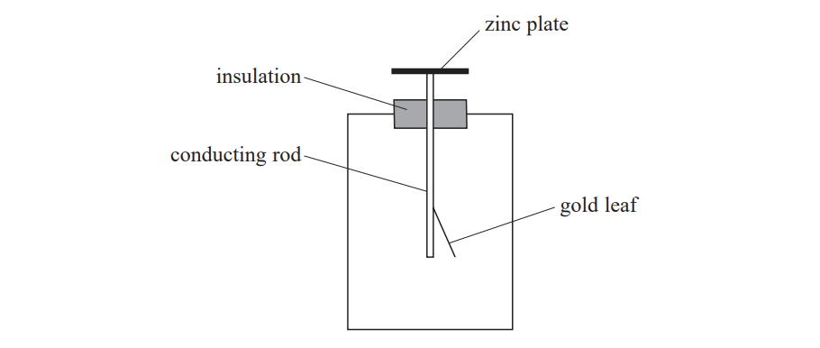
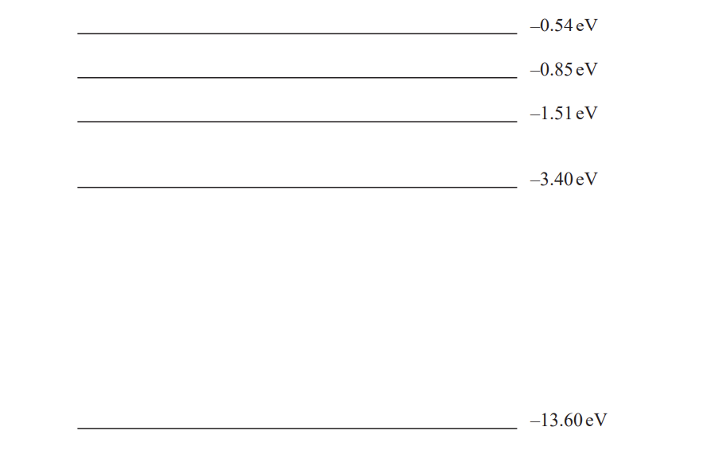

# Exam Questions — The Photoelectric Effect & Atomic Spectra
**2. Waves & Electricity** · Edexcel International A Level (IAL) Physics (YPH11)
> Source: [https://www.savemyexams.com/international-a-level/physics/edexcel/19/topic-questions/2-waves-and-electricity/the-photoelectric-effect-and-atomic-spectra/structured-questions/](https://www.savemyexams.com/international-a-level/physics/edexcel/19/topic-questions/2-waves-and-electricity/the-photoelectric-effect-and-atomic-spectra/structured-questions/) · 7 questions · total 52 marks

## Q1 — medium — 9 marks · structured-questions

### 14((a)) — 2 marks — command: explain — structured — from paper Oct/Nov 2021 · WPH12/01
A gold leaf electroscope is used to demonstrate the photoelectric effect. When the zinc plate of the electroscope is given a negative charge, the conducting rod and gold leaf also become negatively charged. The gold leaf deflects away from the metal stem as shown. The deflection of the gold leaf depends on the amount of charge on the zinc plate and the conducting rod.

A beam of ultraviolet radiation is incident on the zinc plate. The gold leaf immediately begins to fall back to the conducting rod.

Explain why this observation cannot be explained by the wave model of electromagnetic radiation.

### 14((b)) — 7 marks — command: multiple — structured — from paper Oct/Nov 2021 · WPH12/01
Photons of ultraviolet radiation with an energy of 9.3 × 10−19 J are directed towards the zinc plate.

i) Calculate the maximum speed with which electrons are released from the plate.

work function of zinc = 4.3 eV

Maximum speed of electrons = ........................................**(4) **

ii) A student suggests that a greater maximum speed of electrons could have been achieved if both:

– a metal with a lower work function than zinc was used

– ultraviolet radiation with a greater wavelength was used.

Discuss the student’s suggestion.

**(3)**

## Q2 — medium — 8 marks · structured-questions

### 16((a)) — 6 marks — command: explain — structured — from paper Oct/Nov 2021 · WPH12/01
After an atom of hydrogen has been exposed to suitable electromagnetic radiation, the atom can emit visible light. The emitted light contains a small number of different wavelengths of visible light.

Explain the process that results in the emission of different wavelengths of visible light. Your answer should include reference to energy levels in atoms.

### 16((b)) — 2 marks — command: explain — structured — from paper Oct/Nov 2021 · WPH12/01
It is also possible to make the atoms in a sample of air emit visible light.

Explain why the light emitted by the air has a large number of different wavelengths.

## Q3 — medium — 10 marks · structured-questions

### 15((a)) — 4 marks — command: show — structured — from paper 2021 June · WPH12/01
A student used two sources, A and B, of electromagnetic radiation to investigate the photoelectric effect. Radiation from A has a photon energy of 2.0 eV.

The radiation from B has a wavelength of 280 nm.

Show that this radiation has a photon energy of about 4.4 eV.

### 15((b)) — 6 marks — command: explain — structured — from paper 2021 June · WPH12/01
*The student used the two sources of radiation to investigate the photoelectric effect for two different metals, copper and zinc.

The following statements were made by the student.

| When radiation of photon energy 2.0 eV from source A is directed towards either of the metal plates no electrons are released, even when the intensity of the radiation is increased.  When radiation of photon energy 4.4 eV from source B is directed towards the copper plate, no electrons are released. However, when the radiation is directed towards the zinc plate, electrons are released. As the intensity of radiation is increased, electrons are released at a greater rate. |
|---|

Explain the conclusions that can be made from these statements.

## Q4 — medium — 6 marks · structured-questions

### 13() — 6 marks — command: explain — structured — from paper 2022 Jan · WPH12/01
* In the early 20th century, observations of the photoelectric effect demonstrated that light behaves as a particle.

Explain how observations from the photoelectric effect demonstrate the particle nature of light.

## Q5 — medium — 8 marks · structured-questions

### 1() — 3 marks — command: explain — structured
The diagram shows a photocell used by a student to investigate the photoelectric effect.

The student directs a beam of monochromatic light onto the metal plate.

Explain why the beam produces photoelectrons with a range of kinetic energies.

### 2() — 2 marks — command: explain — structured
The student connected the photocell to an ammeter and a battery of negligible internal resistance, as shown.

The student varied the frequency of the light and made the following observations:

- When visible light was incident on the photocell, there was no reading on the ammeter
- When ultraviolet light was incident on the photocell, there was a reading on the ammeter

Explain why these observations are **not** consistent with the wave theory of light.

### 3() — 3 marks — command: deduce — structured
The student then reversed the connections to the battery.

When photoelectrons have enough kinetic energy to overcome the potential difference across the photocell, there is a reading on the ammeter.

Deduce whether there is a reading on the ammeter when ultraviolet light of wavelength $350\text{nm}$ is incident on the photocell.

work function of metal plate in photocell = $2.3\text{eV}$

## Q6 — medium — 10 marks · structured-questions

### 1() — 1 mark — command: state — structured
The diagram shows some energy levels of a hydrogen atom.

State what is meant by the ground state of a hydrogen atom.

### 2() — 3 marks — command: deduce — structured
The spectrum of light from a star includes an absorption line at a wavelength of 490 nm.

Deduce the transition involved in the formation of the line with this wavelength.

Transition: .................. $\text{eV}$ to .................. $\text{eV}$

### 3() — 6 marks — command: explain — structured
The spectrum of a star shows a set of dark lines. These dark lines can be used to identify elements present in the atmosphere of the star.

Explain how dark lines corresponding to different elements appear on this spectrum.

## Q7 — medium — 1 marks · multiple-choice-questions

### 8() — 1 mark — multiple_choice — from paper 2021 June · WPH12/01
The diagram shows some of the energy levels of a hydrogen atom.

An excited electron in the level –0.54 eV drops to the level –13.60 eV, resulting in the release of at least one photon.

Which of the following photon energy values could not be produced from this electron transition?
- **A.** 0.31 eV
- **B.** 0.54 eV
- **C.** 12.09 eV
- **D.** 13.06 eV
