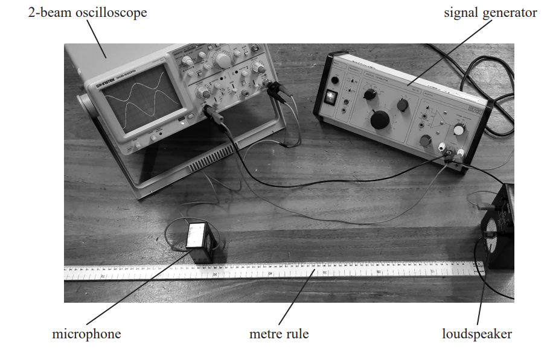
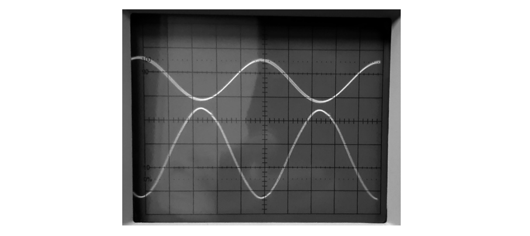
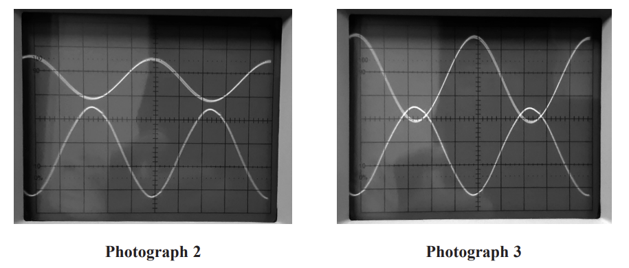
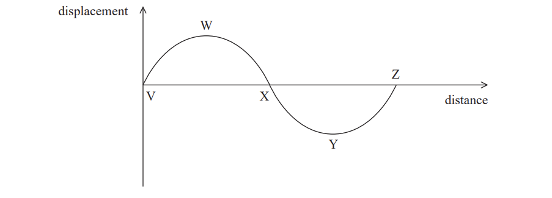

# Exam Questions — Transverse & Longitudinal Waves
**2. Waves & Electricity** · Edexcel International A Level (IAL) Physics (YPH11)
> Source: [https://www.savemyexams.com/international-a-level/physics/edexcel/19/topic-questions/2-waves-and-electricity/transverse-and-longitudinal-waves/structured-questions/](https://www.savemyexams.com/international-a-level/physics/edexcel/19/topic-questions/2-waves-and-electricity/transverse-and-longitudinal-waves/structured-questions/) · 4 questions · total 11 marks

## Q1 — medium — 8 marks · structured-questions

### 17((a)) — 5 marks — command: explain — structured — from paper 2021 June · WPH12/01
A student used the apparatus shown in Photograph 1 to determine the speed of sound in air.

**Photograph 1**

The student switched on the signal generator. The oscilloscope showed one trace from the signal generator and another trace from the microphone.

Initially the peaks of one trace were directly above the troughs of the other trace, as shown in Photograph 2.

**Photograph 2**

The horizontal axis of the oscilloscope screen represents time. The number of milliseconds per division on the horizontal scale is known.

Explain how the apparatus shown in Photograph 1 could be used to determine the speed of sound in air.

### 17((b)) — 3 marks — command: explain — structured — from paper 2021 June · WPH12/01
The student changed the position of the microphone. The traces on the oscilloscope screen before and after changing the position of the microphone are shown in Photograph 2 and Photograph 3.

** **Explain what change the student made to the position of the microphone between Photograph 2 and Photograph 3.

## Q2 — easy — 1 marks · multiple-choice-questions

### 10() — 1 mark — multiple_choice — from paper Oct/Nov 2021 · WPH12/01
A sound wave travels through air. The diagram represents the displacement of air particles along the wave at an instant in time.

There is a compression at position V.

At which position is there also a compression?
- **A.** W
- **B.** X
- **C.** Y
- **D.** Z

## Q3 — easy — 1 marks · multiple-choice-questions

### 2() — 1 mark — multiple_choice — from paper 2021 June · WPH12/01
A wave has amplitude *A*, period *T*, and wavelength λ.

Which of the following can be used to calculate the speed of the wave?
- **A.** $AT$
- **B.** $\frac{A}{T}$
- **C.** $λT$
- **D.** $\frac{λ}{T}$

## Q4 — easy — 1 marks · multiple-choice-questions

### 7() — 1 mark — multiple_choice — from paper 2021 June · WPH12/01
Which of the following statements is correct for minimum displacement of the particles in a longitudinal wave?
- **A.** Minimum displacement occurs at compressions only.
- **B.** Minimum displacement occurs at rarefactions only.
- **C.** Minimum displacement occurs at compressions and rarefactions.
- **D.** Minimum displacement occurs at neither compressions nor rarefactions.
