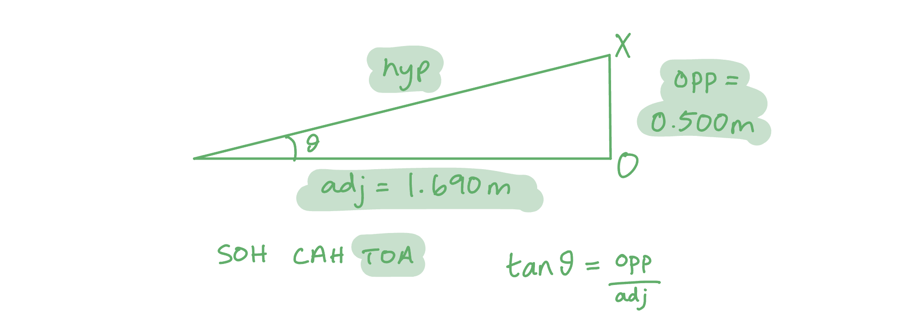

# Mark Schemes — Waves, Electrons & Photons
**2. Waves & Electricity** · Edexcel International A Level (IAL) Physics (YPH11)

## Q1 — medium — 7 marks · structured-questions

### 12((a)) — 4 marks
Explain how this arrangement can be used to show whether the RSJ contains an air gap:

- Ultrasound is (partially) <u>reflected</u> (from boundaries); **[1 mark]**
- (Measure) the <u>time</u> taken / <u>time</u> delay (for signal to return); **[1 mark]**

**EITHER**

- Calculate the expected time for the pulse to return (if no air gap) and compare to known time for pulse to return; **[1 mark]**
- If the time for pulse to return < time calculated, an air gap is present; **[1 mark]**

**OR**

- Calculate the distance for the pulse to travel; **[1 mark]**
- If the distance pulse returns from < thickness of RSJ, there is an air gap is present **OR** if the distance pulse returns from = thickness of RSJ, there is no air gap; **[1 mark]**

**[Total: 4 marks]**

- *Notice here that the answers discuss either time or distance, rather than speed, because are the measured variables*
- *Be careful with the language that use:*

  - *Students who talked about the wave returning 'quicker' did not get the mark because it wasn't clear if they were referring to a shorter time (which is correct) or a faster speed (which is incorrect)*

### 12((b)) — 3 marks
A much higher frequency than 20 kHz is needed in this method because:

- (Higher frequencies) have smaller wavelengths; **[1 mark]**
- (Smaller wavelength leads to) higher levels of detail / resolution; **[1 mark]**
- (Smaller wavelength) can detect small(er) objects / gaps **OR** (with 20kHz) the detail would not be sufficient to identify air gaps / air gaps might be smaller than the wavelength; **[1 mark]**

**[Total: 3 marks]**

- *Examiners reported that the majority of students only gained the first mark for this question*

  - *Few students recognised the link between improved resolution and shorter wavelength*

## Q2 — medium — 9 marks · structured-questions

### 14((a)) — 4 marks
Determine the wavelength of the light from the laser:

Determine the angle $θ$:

- $θ=\mathrm{tan}^{-1}\times\frac{0.500}{1.690}=16.5^{\circ}$ **[1 mark]**

Determine the spacing between adjacent slits, $d$:

- $d=\frac{1}{numberoflinesm^{-1}}=\frac{1}{450000}=2.22\times10^{-6}m$ **[1 mark]**

Calculate the wavelength, $λ$, using the diffraction grating equation:

- $nλ=d\mathrm{sin}θ$
- `lambda space equals space fraction numerator d sin theta over denominator n end fraction space equals space fraction numerator open parentheses 2.22 cross times 10 to the power of negative 6 end exponent close parentheses space cross times space sin open parentheses 16.5 close parentheses over denominator 1 end fraction`** [1 mark]**
- $λ=6.31\times10^{-7}m$ **[1 mark]**

**[Total: 4 marks]**

- *Examiners reported that the most common error with this question was confusing the spacing between adjacent slits on the diffraction grating, *$d$*, with the distance from the slit to the screen (which is *$D$* from Young's double slit equation)*

### 14((b)) — 3 marks
A series of bright dots is seen on the screen because:

- (Waves from the different slits meet and) superposition / interference occurs; **[1 mark]**
- (Bright dots occur where) waves are in phase; **[1 mark]**
- (Superposition/interference) is constructive; **[1 mark]**

**[Total: 3 marks]**

### 14((c)) — 2 marks
Suggest what would be observed on the screen if the laser is replaced by a source producing a parallel beam of bright white light:

- A white dot a point O; **[1 mark]**
- Spectra seen (at either side of O); **[1 mark]**

**[Total: 2 marks]**

## Q3 — medium — 10 marks · structured-questions

### 18((a)) — 4 marks
Deduce the colour of the visible light that caused the electron transition shown in the diagram:

Convert the energy change from eV to J:

- `open square brackets open parentheses negative 3.40 close parentheses space minus space open parentheses negative 1.50 close parentheses close square brackets space cross times space open parentheses 1.60 cross times 10 to the power of negative 19 end exponent close parentheses space equals space 3.04 cross times 10 to the power of negative 19 end exponent space straight J` **[1 mark]**

Determine the frequency of the light using $E=hf$:

- $f=\frac{E}{h}=\frac{3.04\times10^{-19}}{6.63\times10^{-34}}=4.59\times10^{14}\mathrm{Hz}$ **[1 mark]**

Calculate the wavelength using $v=λf$:

- $λ=\frac{v}{f}=\frac{3.00\times10^{8}}{4.59\times10^{14}}=6.54\times10^{-7}m$ **[1 mark]**

Convert to nm to determine the colour:

- $\frac{6.54\times10^{-7}}{10^{-9}}=654\mathrm{nm}$, so the colour is red **[1 mark]**

**[Total: 4 marks]**

### 18((b)) — 4 marks
Calculate the power of Sirius A:

Convert light years into m:

- `8.60 space cross times space open parentheses 365 space cross times space 24 space cross times space 60 space cross times space 60 close parentheses space cross times space open parentheses 3.00 cross times 10 to the power of 8 close parentheses space equals space 8.14 cross times 10 to the power of 16 space straight m` **[1 mark]**

Calculate the power using $I=\frac{P}{A}$:

- `A space equals space 4 straight pi r to the power of italic 2 italic space italic equals italic space 4 straight pi space cross times space open parentheses 8.14 cross times 10 to the power of 16 close parentheses squared space equals space 8.326 cross times 10 to the power of 34 space straight m cubed` **[1 mark]**
- `P space equals space I A space equals space open parentheses 1.17 cross times 10 to the power of negative 7 end exponent close parentheses space cross times space open parentheses 8.326 cross times 10 to the power of 34 close parentheses` **[1 mark]**
- $P=9.73\times10^{27}W$ **[1 mark]**

**[Total: 3 marks]**

### 18((c)) — 2 marks
When hydrogen gas is excited in the laboratory, only certain wavelengths of light are emitted because:

- Atoms have discrete energy levels **OR** emitted photons have discrete energy; **[1 mark]**
- Only certain transitions are possible (in a hydrogen atom) **OR** some transitions are not possible (in a hydrogen atom); **[1 mark]**

**[Total: 2 marks]**

- *Examiners reported that the most common error in this question was for students to speak more broadly about gases in general, rather than specifically discussing hydrogen gas*

## Q4 — medium — 11 marks · structured-questions

### 18((a)) — 3 marks
Calculate the intensity of solar radiation as it reaches ICESat-2:

List the known quantities:

- Distance from the Sun to ICESat-2, $r$ = 1.50 × 1011 m
- Power of the Sun, $P$ = 3.83 × 1026 W

Calculate the area of the spherical wave at distance $r$:

- `A space equals space 4 straight pi r squared space equals space 4 straight pi open parentheses 1.50 space cross times space 10 to the power of 11 close parentheses squared` **[1 mark]**
- $A=2.827\times10^{23}m^{2}$

Calculate the intensity:

- $I=\frac{P}{A}=\frac{3.83\times10^{26}}{2.827\times10^{23}}$ **[1 mark]**
- $I=1355Wm^{-2}=1350Wm^{-2}$ (2 s.f.) **[1 mark]**

**[Total: 3 marks]**

### 18((b)) — 3 marks
Calculate the energy, in J, of each photon:

List the known quantity:

- Wavelength, $λ$ = 532 nm = 532 × 10-9 m

Calculate the frequency:

- $v=fλ$
- $f=\frac{c}{λ}=\frac{3.00\times10^{8}}{532\times10^{-9}}=5.64\times10^{14}\mathrm{Hz}$ **[1 mark]**

Calculate the energy:

- `E space equals space h f space equals space open parentheses 6.63 space cross times space 10 to the power of negative 34 end exponent close parentheses space cross times space open parentheses 5.64 space cross times space 10 to the power of 14 close parentheses` **[1 mark]**
- $E=3.74\times10^{-19}J$ (3 s.f.) **[1 mark]**

**[Total: 3 marks]**

### 18((c)) — 3 marks
i) Calculate the height that ICESat-2 orbits above the surface of the Earth:

List the known quantity:

- Return time, $t$ = 3.20 ms = 3.20 × 10-3 s

Calculate the total distance travelled:

- `d space equals space v space cross times space t space equals space open parentheses 3.00 space cross times space 10 to the power of 8 close parentheses space cross times open parentheses 3.20 space cross times space 10 to the power of negative 3 end exponent close parentheses` **[1 mark]**
- $d=9.60\times10^{5}m$

Determine the height $h$ of ICESat-2:

- $d=2\timesh$
- $h=4.80\times10^{5}m$(3 s.f.) **[1 mark]**

ii) Only photons with a wavelength of exactly 532 nm are used in the analysis of the results, suggest why:

Any **one** from:

- Photons / light from other sources also arrive at the satellite; **[1 mark]**
- Only photons emitted (by the laser) should be recorded; **[1 mark]**
- Other (wavelengths of) photons are not emitted (by the laser); **[1 mark]**

**[Total: 3 marks]**

- *In part (i), the time recorded is for the photons to travel to the Earth's surface **and** to return*
- *It only takes half that time to reach Earth - you may have performed a similar calculation, but used **half of the time** instead of halving the total distance*

### 18((d)) — 2 marks
Explain how the measurements taken by ICESat-2 can be used to show that the ice sheet has a flat surface and is higher than sea level:

Explain how the measurements show the ice sheet is flat:

- (For a flat surface) the measurements give the same time / distance; **[1 mark]**

Explain how the measurements show the altitude:

- (A higher elevation means that) photons / light will return in less time **or** $h=\frac{vt}{2}$ gives a smaller distance to the ice; **[1 mark]**

**[Total: 2 marks]**

## Q5 — hard — 12 marks · structured-questions

### 1() — 6 marks
The concentric ring patterns are caused by diffraction, which demonstrates that electrons exhibit wave properties.

Increasing the accelerating potential difference increases the kinetic energy and, therefore, the speed of the electrons. Since $λ=\frac{h}{p}=\frac{h}{mv}$, a greater speed, and therefore momentum, results in a shorter de Broglie wavelength.

The shorter the wavelength, the smaller the diffraction angle (since $λ\propto\mathrm{sin}θ$), so the diameter of the rings decreases, as observed in Experiment 2.

For diffraction to occur, the de Broglie wavelength of the electrons must be of a similar order of magnitude to the atomic spacing in gold. This suggests the atoms in the gold crystal must be arranged in a regular or layered structure.

**[6 marks]**

> **[mark-scheme]**
> This is a levelled response question. Each point made in the answer does not equal one mark.
> 
> Marks are awarded for indicative content and for how the answer is structured, with linked and fully sustained lines of reasoning. The banding table shows how the indicative content (IC) and linkage marks should be awarded, up to a maximum of 6 marks.
> 
> **Indicative content**
> 
> - **IC1** The pattern (of rings) shows diffraction / interference
> 
> - **IC2** This provides evidence that electrons behave as waves
> 
> - **IC3** Increasing the p.d. increases the kinetic energy / speed / momentum of the electrons
> 
> - **IC4** Use of $λ=h/p$ to confirm that as speed / momentum increases, wavelength decreases
> 
> - **IC5** Use of $nλ=d\mathrm{sin}θ$ to justify that as wavelength ($λ$) decreases, diffraction angle ($θ$) decreases
> 
> - **IC6** This shows that the gold crystal has a regular / layered structure or small gaps at uniform distances / lengths
> 
> **Linkage**
> 
> - **1 linkage mark** for a clear answer that shows a coherent and logical structure
> - **1 linkage mark** for fully sustained lines of reasoning demonstrated throughout
> 
> **Banding table**
> 
> | IC points | IC mark | Max linkage mark | Max total |
> |---|---|---|---|
> | 6 | 4 | 2 | 6 |
> | 5 | 3 | 2 | 5 |
> | 4 | 3 | 1 | 4 |
> | 3 | 2 | 1 | 3 |
> | 2 | 2 | 0 | 2 |
> | 1 | 1 | 0 | 1 |
> | 0 | 0 | 0 | 0 |

> **[exam-tip]**
> A starred QWC question assesses the quality of your reasoning as well as your subject knowledge. Structure your answer logically, avoiding just listing disconnected facts — start with what the pattern tells you about the nature of electrons, then explain the effect of changing the potential difference, and finally, explain what it reveals about the structure of gold.
> 
> Make sure you connect the de Broglie equation $λ=h/p$ to the change in ring size when the potential difference is increased. Simply stating that the rings get smaller without explaining why will prevent you from scoring full marks.

### 2() — 3 marks
To calculate the de Broglie wavelength of the electrons in Experiment 1:

- List the known quantities:

  - Accelerating p.d., $V=5.00\text{kV}$
  - Electron mass, $m_{e}=9.11\times10^{-31}\text{kg}$
  - Electronvolt, $\text{1 eV}=1.60\times10^{-19}\text{J}$
  - Planck constant, $h=6.63\times10^{-34}\text{J s}$
- Determine the momentum of the electrons:

  - The accelerating p.d. gives the electrons a kinetic energy equal to $5.00\text{keV}$

$E_{k}=eV=\frac{p^{2}}{2m_{e}}$

$p=\sqrt{2m_{e}eV}$

`p space equals space square root of 2 cross times open parentheses 9.11 cross times 10 to the power of negative 31 end exponent close parentheses cross times open parentheses 1.60 cross times 10 to the power of negative 19 end exponent close parentheses cross times open parentheses 5.00 cross times 10 cubed close parentheses end root`

$p=3.82\times10^{-23}\text{kg m s}^{-1}$ **[1 mark]**

- Use the de Broglie equation to calculate wavelength:

$λ=\frac{h}{p}$

$λ=\frac{6.63\times10^{-34}}{3.82\times10^{-23}}$ **[1 mark]**

$λ=$ $1.74\times10^{-11}\text{m}$ **[1 mark]**

> **[mark-scheme]**
> 1 mark for use of $E_{k}=eV$ and $E_{k}=p^{2}/2m$ **OR** $E_{k}=\frac{1}{2}mv^{2}$
> 
> 1 mark for use of $λ=h/p$
> 
> 1 mark for a final answer of $1.74\times10^{-11}\text{m}$
> 
> - Accept $1.7\times10^{-11}\text{m}$

### 3() — 3 marks
An alpha particle has a much larger mass than an electron, meaning that when it is accelerated through the same potential difference, it will have a much smaller de Broglie wavelength than the electron:

`lambda subscript alpha over lambda subscript e space equals space square root of fraction numerator m subscript e e over denominator m subscript alpha open parentheses 2 e close parentheses end fraction end root space equals space square root of fraction numerator 9.11 cross times 10 to the power of negative 31 end exponent over denominator 2 cross times 4 cross times 1.67 cross times 10 to the power of negative 27 end exponent end fraction end root space almost equal to space 8.3 cross times 10 to the power of negative 3 end exponent`

$λ_{α}\approx8.3\times10^{-3}\times1.74\times10^{-11}\approx1.4\times10^{-13}\text{m}$

For diffraction to occur, the wavelength must be similar to the atomic spacing of the gold foil. Since the alpha particle's wavelength is much smaller than the electrons', it will not undergo significant diffraction. Therefore, the student's suggestion is incorrect. Furthermore, alpha particles have a strong positive charge, so the electrostatic repulsion from the gold nuclei would result in significant scattering, as seen in Rutherford's gold foil experiment.

**[3 marks]**

> **[mark-scheme]**
> 1 mark for a comparison of a physical property (e.g. mass or charge) of an alpha particle and an electron, or the resulting de Broglie wavelength
> 
> - Accept either a qualitative or quantitative comparison
> 
> 1 mark for stating that diffraction requires the de Broglie wavelength to be similar to the atomic spacing of the gold film
> 
> - Accept wavelength must be similar to the distance between (adjacent) nuclei
> 
> 1 mark for a valid conclusion about the student's suggestion and a suitable justification, e.g.
> 
> - The de Broglie wavelength of the alpha particles would be too small
> - The alpha particles would not be diffracted by / would not interact suitably with the atomic structure of the gold film
> - The kinetic energy of the alpha particles would be too low to probe nuclear structure / they would not get close enough to the gold nuclei
> - Alpha particles are charged, so would be deflected / scattered by the electric fields of the gold nuclei

> **[exam-tip]**
> When asked to "comment" on a suggestion, you need to state whether the suggestion is appropriate or not and then justify your answer with relevant physics. Think about what properties a probe particle needs in order to investigate structure at the atomic or nuclear scale — consider the de Broglie wavelength relative to the spacing or size of the structures being investigated, and whether the particle's energy is sufficient.

## Q6 — medium — 8 marks · structured-questions

### 1() — 2 marks
> **[mark-scheme]**
> - Ultrasound travels as a longitudinal wave **OR** in a series of compressions and rarefactions **[1 mark]**
> - With oscillations / vibrations of particles (in body tissue) parallel to the direction of energy transfer **[1 mark]**

### 2() — 3 marks
To calculate the diameter of the kidney:

- List the known quantities:

  - Speed of ultrasound in soft tissue, $v = 1540 \text{m s}^{-1}$

- Determine the time for the reflected pulses to return to the transducer:

  - This is the time between the first and second reflected pulses

$t=2\times40=80\text{μs}$ **[1 mark]**

- Calculate the distance the ultrasound travels across the kidney and back to the transducer:

  - The pulse travels to each boundary and back, so the distance must be halved

$d=\frac{v\timest}{2}$

`d space equals space fraction numerator 1540 cross times open parentheses 80 cross times 10 to the power of negative 6 end exponent close parentheses over denominator 2 end fraction` **[1 mark]**

$d=0.062\text{m}=$ $6.2\text{cm}$ **[1 mark]**

> **[mark-scheme]**
> 1 mark for correctly reading the time interval from the oscilloscope trace (80 μs or 8 × 10-5 s)
> 
> 1 mark for the correct use of the factor of 2 ($d=vt\div2$)
> 
> 1 mark for a final answer of $0.062\text{m}$ (or $6.2\text{cm}$)
> 
> - Allow ecf from an incorrectly read time interval

> **[exam-tip]**
> The key to this question is identifying which pair of pulses corresponds to the kidney boundaries. The first reflected pulse is from the front surface of the kidney, and the second reflected pulse is from the back surface. The time gap between these two echoes gives the time for the ultrasound to travel across the kidney and back again — so you must remember to divide by 2.
> 
> Many students lose marks by forgetting to halve the distance, or by reading the wrong pair of pulses from the oscilloscope trace. Always sketch or annotate the trace to help you identify which reflections correspond to which boundaries.

### 3() — 1 marks
> **[mark-scheme]**
> - To allow the reflected pulse to return / be detected before the next pulse is transmitted
> **OR**
> To prevent the emitted pulse from overlapping / interfering with the reflected pulse **[1 mark]**

> **[exam-tip]**
> Make sure you link your answer to the idea of detecting the reflected pulse. Think about what would happen if the wave were continuous: the emitted and returning signals would overlap, making it impossible to distinguish the reflected pulse and therefore impossible to determine the distance to the reflecting surface.

### 4() — 2 marks
> **[mark-scheme]**
> - Lower frequency means a longer wavelength (since $v=fλ$ and $v$ is constant in a given medium) **[1 mark]**
> - Longer wavelengths diffract more around smaller objects / structures
> **OR**
> Less detail can be detected (or lower resolution) **[1 mark]**
> 
> Accept reverse argument e.g. higher frequency diffracts less / produces a more detailed image

## Q7 — medium — 9 marks · structured-questions

### 1() — 4 marks
To calculate the wavelength of the light emitted by the laser:

- List the known quantities:

  - Distance between the two first-order maxima, $x=1640\text{mm}$
  - Distance between grating and screen, $D=2.00\text{m}$
  - Number of lines, $N=600\text{lines mm}^{-1}$
  - First order, $n=1$
- Use trigonometry to determine the angle $θ$ between the central and first-order maxima

  - distance becomes $x/2=820\text{mm}=0.820\text{m}$

$\mathrm{tan}θ=\frac{x}{D}$

`theta space equals space tan to the power of negative 1 end exponent open parentheses fraction numerator 0.820 over denominator 2.00 end fraction close parentheses space equals space 22.3 degree` **[1 mark]**

- Calculate the line spacing $d$ on the grating:

$d=\frac{1}{N}$

$d=\frac{1}{600\times10^{3}}=1.67\times10^{-6}\text{m}$ **[1 mark]**

- Use the diffraction grating equation to determine wavelength:

$nλ=d\mathrm{sin}θ$

$λ=\frac{\mathrm{sin}22.3^{\circ}}{600\times10^{3}}=6.32\times10^{-7}\text{m}$ **[1 mark]**

- Write a concluding statement:

$λ=$ $632\text{nm}$** is within the range** **[1 mark]**

> **[mark-scheme]**
> 1 mark for using correct trigonometry to determine $θ$
> 
> 1 mark for calculating $d$ using $1/600$
> 
> 1 mark for using $nλ=d\mathrm{sin}θ$ with $n=1$
> 
> 1 mark for comparing the calculated $λ$ with $630\pm10\text{nm}$ and making a clear conclusion
> 
> - Expected conclusion: the wavelength is within range
> - Accept answers given to 2 or 3 s.f.

> **[exam-tip]**
> A common error is to forget to halve the distance between the two first-order maxima — the formula $d \mathrm{sin} θ = n λ$ uses the angle from the central maximum to one maximum, not the total angle between maxima.

### 2() — 2 marks
> **[mark-scheme]**
> Modification — any **one** from:
> 
> - Measure the distance between the two second-order maxima
> - Measure the distance from the second order to the central maximum
> - Increase the distance ($D$) from the grating to the screen
> 
> **[1 mark]**
> 
> This would reduce the % uncertainty in $λ$ because:
> 
> - The resolution would be the same but the distance measured is greater
> **OR**
> The uncertainty would be the same but is divided by a greater length **[1 mark]**

### 3() — 3 marks
> **[mark-scheme]**
> - (The observations show that) the laser light is (plane) polarised **[1 mark]**
> - When the filter is parallel (to the plane of polarisation of the laser), the light is transmitted / intensity is a maximum **[1 mark]**
> - When the filter is perpendicular (to the plane of polarisation of the laser), no light is transmitted / all light is blocked **[1 mark]**

> **[exam-tip]**
> The key fact here is that laser light is plane polarised. Therefore, a polarising filter aligned parallel to the laser's polarisation plane will transmit the light, whereas rotating it through 90° means the filter is now perpendicular, blocking all the light, so no diffraction pattern can form.

## Q8 — easy — 1 marks · multiple-choice-questions

### 9() — 1 marks
**Correct answer: B** — 

**Final answer:** **The correct answer is ****B**** because:**

- The wavelength is much smaller than the gap size in **B**

  - In the other diagrams, the wavelength either matches or is larger than the gap size
- The effect of diffraction in **B** is not sufficient to form semicircular wavefronts

## Q9 — easy — 1 marks · multiple-choice-questions

### 2() — 1 marks
**Correct answer: C** — the distance from the laser to the diffraction grating

**Final answer:** **The correct answer is ****C**** because:**

- The equation $nλ=dsinθ$ is used to calculate wavelength in this context

- Consider option **A**:

  - The distance between screen and grating **is** needed to calculate *θ*
- Consider option **B**:

  - The distance between the central and first maximum **is** needed to calculate *θ*
- Consider option **C**:

  - The distance between the laser and the grating has **no effect** on the diffraction pattern after the grating
  - Measurement **C** is not required
- Consider option **D**:

  - The distance between slits is *d* **is** needed to calculate *θ*

- The measurements from **A** and **B** form a triangle which allows *θ* to be calculated with trigonometry

## Q10 — easy — 1 marks · multiple-choice-questions

### 9() — 1 marks
**Correct answer: C** — $d=\frac{vt}{2}$

**Final answer:** **The correct answer is ****C ****because:**

- The path length of the wave before it is detected is 2d
- $speed=\frac{distance}{time}$, therefore $v=\frac{2d}{t}$
- Rearranging gives $d=\frac{vt}{2}$

## Q11 — medium — 1 marks · multiple-choice-questions

### 5() — 1 marks
**Correct answer: A** — `fraction numerator 6.63 space cross times 10 to the power of negative 34 end exponent over denominator open parentheses 656 cross times 10 to the power of negative 9 end exponent close parentheses open parentheses 9.11 cross times 10 to the power of negative 31 end exponent close parentheses end fraction`

**Final answer:** **The correct answer is A because:**

- $λ=\frac{h}{p}$ and $p=mv$
- Combining these gives $λ=\frac{h}{mv}$
- Rearranging to make $v$ the subject gives $v=\frac{h}{mλ}$
- Substituting in values gives `v equals fraction numerator 6.63 cross times 10 to the power of negative 34 end exponent over denominator open parentheses 656 cross times 10 to the power of negative 9 end exponent close parentheses open parentheses 9.11 cross times 10 to the power of negative 31 end exponent close parentheses end fraction`

## Q12 — medium — 1 marks · multiple-choice-questions

### 2() — 1 marks
**Correct answer: A** — `fraction numerator open parentheses 6.63 space cross times space 10 to the power of negative 34 end exponent close parentheses over denominator open parentheses 9.11 space cross times space 10 to the power of negative 31 end exponent close parentheses open parentheses 5.47 space cross times 10 to the power of negative 10 end exponent close parentheses end fraction`

**Final answer:** **The correct answer is ****A**** because:**

- The de Broglie wavelength equation is $λ=\frac{h}{p}=\frac{h}{mv}$
- Therefore, $v=\frac{h}{mλ}$
- Hence, `fraction numerator open parentheses 6.63 space cross times space 10 to the power of negative 34 end exponent close parentheses over denominator open parentheses 9.11 space cross times space 10 to the power of negative 31 end exponent close parentheses open parentheses 5.47 space cross times 10 to the power of negative 10 end exponent close parentheses end fraction`
- This is answer** A**

## Q13 — medium — 1 marks · multiple-choice-questions

### 5() — 1 marks
**Correct answer: B** — increase the anode potential *V*

**Final answer:** **The only correct answer is ****B**** because:**

- Increasing the anode potential increases the velocity and therefore momentum of the electrons
- According to the equation for de Broglie wavelength, $λ=\frac{h}{p}$, increasing momentum decreases the de Broglie wavelength
- The angle of diffraction is related to wavelength by the equation $nλ=dsinθ$
- Therefore decreasing the de Broglie wavelength decreases the angle of diffraction

- Decreasing the distance between the sample and the screen does not affect the angle
- Increasing the current in the filament does not affect the angle, just the intensity
- Using a sample with a smaller atomic spacing increases the angle
