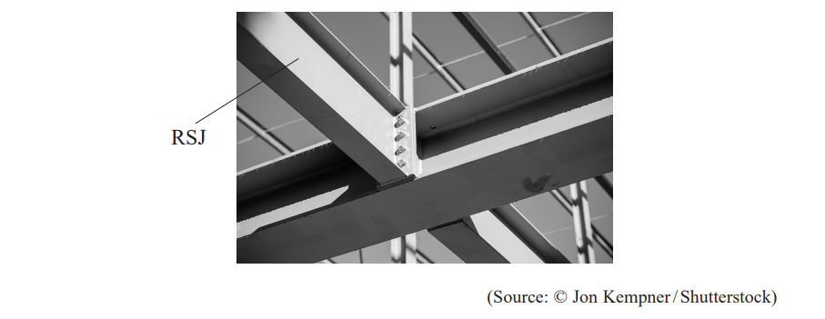
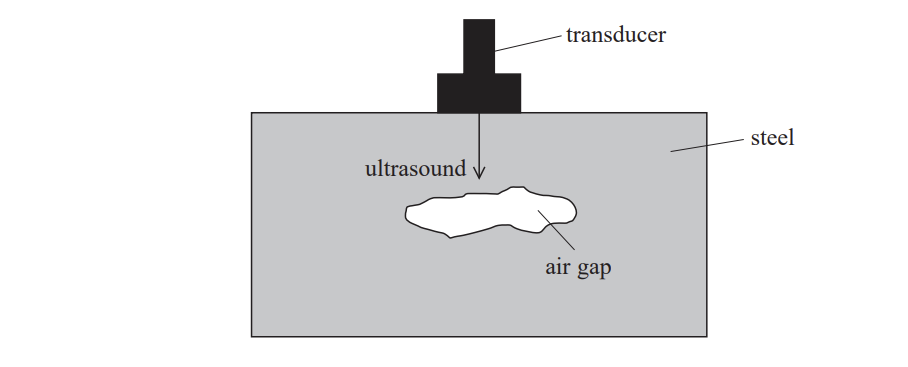
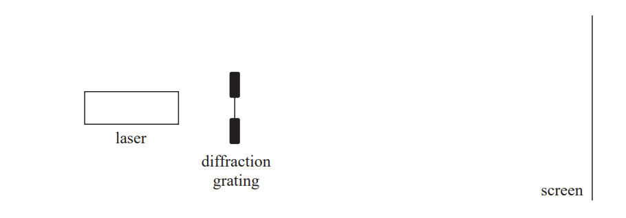
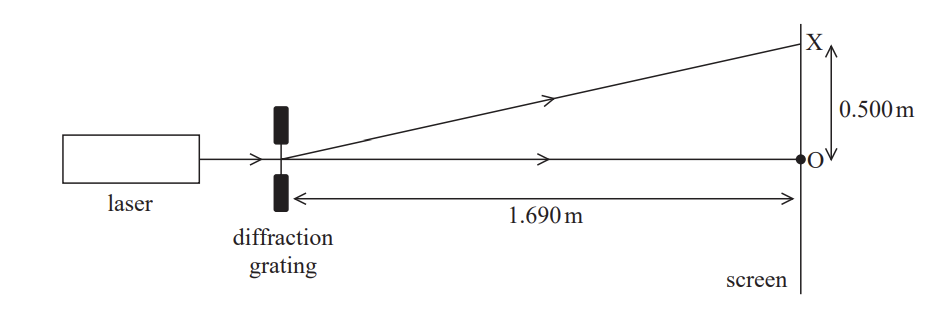
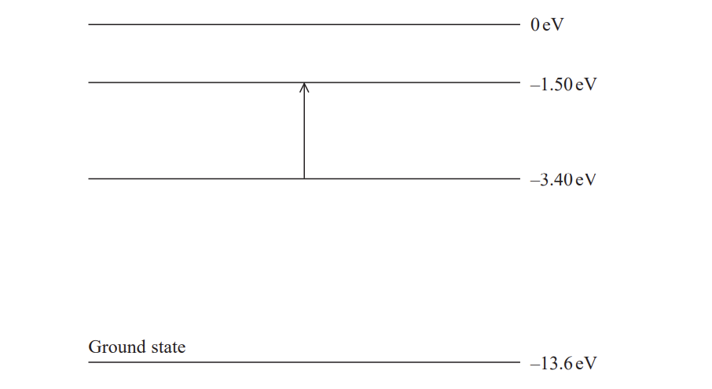
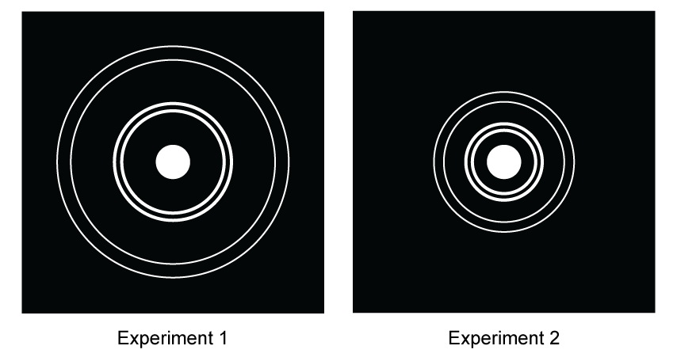
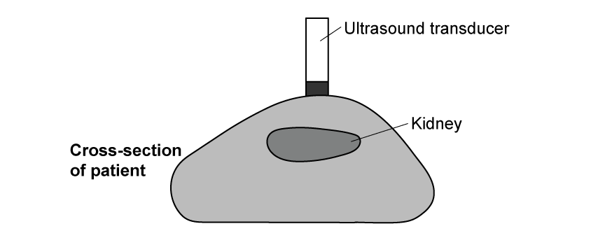
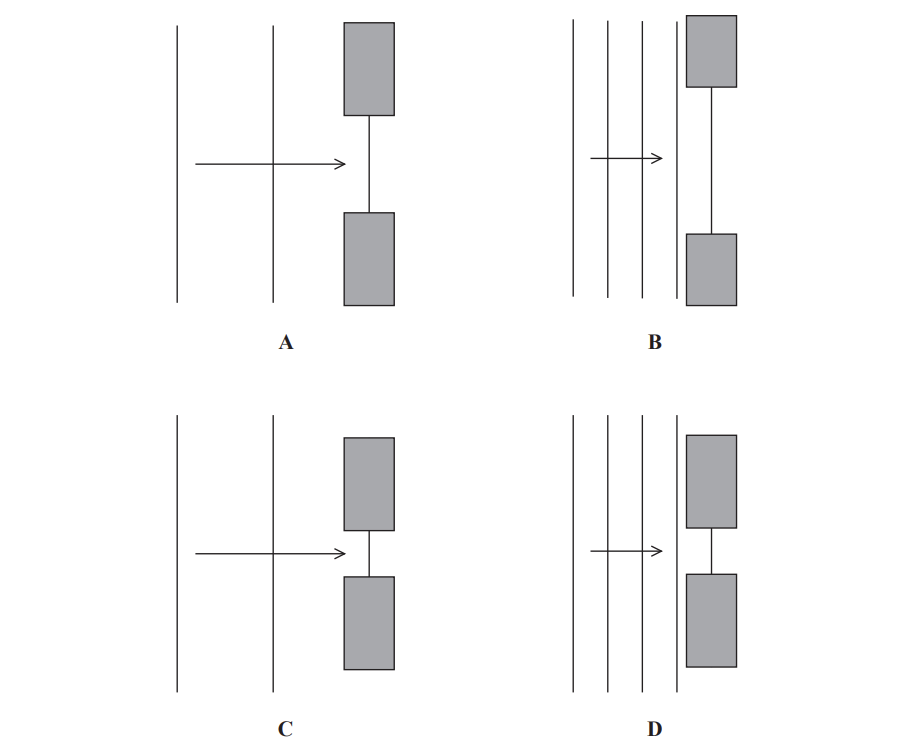
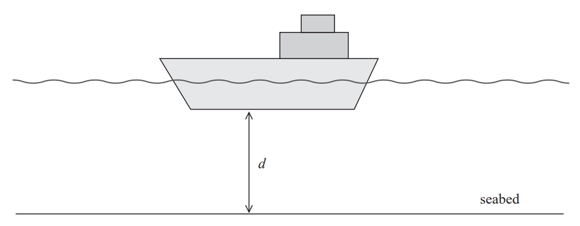
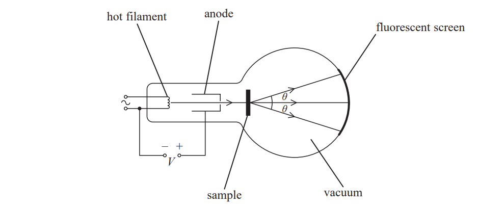

# Exam Questions — Waves, Electrons & Photons
**2. Waves & Electricity** · Edexcel International A Level (IAL) Physics (YPH11)
> Source: [https://www.savemyexams.com/international-a-level/physics/edexcel/19/topic-questions/2-waves-and-electricity/waves-electrons-and-photons/structured-questions/](https://www.savemyexams.com/international-a-level/physics/edexcel/19/topic-questions/2-waves-and-electricity/waves-electrons-and-photons/structured-questions/) · 13 questions · total 72 marks

## Q1 — medium — 7 marks · structured-questions

### 12((a)) — 4 marks — command: explain — structured — from paper 2022 Jan · WPH12/01
Rolled steel joists (RSJs) are used in the construction of buildings, as shown.

The strength of an RSJ is greatly reduced if there are air gaps within the steel.

Ultrasound is used to detect any air gaps in the RSJ.

Pulses of ultrasound are sent by a transducer into an RSJ as shown. Any returning ultrasound is detected by the transducer.

Explain how this arrangement can be used to show whether the RSJ contains an air gap.

### 12((b)) — 3 marks — command: explain — structured — from paper 2022 Jan · WPH12/01
Ultrasound is a sound wave with a frequency greater than 20 kHz. The frequency of ultrasound used by the transducer in this method is 5 MHz.

Explain why a much higher frequency than 20 kHz is needed in this method.

## Q2 — medium — 9 marks · structured-questions

### 14((a)) — 4 marks — command: determine — structured — from paper 2022 Jan · WPH12/01
A laser, a diffraction grating and a screen are set up as shown. The laser emits monochromatic light.

When the laser is switched on, a series of bright dots is seen on the screen.

The diagram below shows the position of the central dot at O. The next bright dot appears at position X.

The diffraction grating has 450 lines per mm.

Determine the wavelength of the light from the laser.

Wavelength = ..................................

### 14((b)) — 3 marks — command: explain — structured — from paper 2022 Jan · WPH12/01
Explain why a series of bright dots is seen on the screen.

### 14((c)) — 2 marks — command: suggest — structured — from paper 2022 Jan · WPH12/01
The laser is replaced by a source producing a parallel beam of bright white light.

Suggest what would now be observed on the screen.

## Q3 — medium — 10 marks · structured-questions

### 18((a)) — 4 marks — command: deduce — structured — from paper 2022 Jan · WPH12/01
Sirius A is the brightest star in the night sky and is mostly composed of hydrogen.

When light from Sirius A passes through the hydrogen in the outer layers of the star, some light is absorbed. This causes electrons in the hydrogen to be excited.

The diagram shows an electron being excited from the –3.40 eV level to the –1.50 eV level.

The wavelengths of the different colours of visible light are shown in the table below.

| violet | blue | green | yellow | orange | red |
|---|---|---|---|---|---|
| 380–450 nm | 450–495 nm | 495–570 nm | 570–590 nm | 590–620 nm | 620–750 nm |

Deduce the colour of the visible light that caused the electron transition shown in the diagram.

### 18((b)) — 4 marks — command: calculate — structured — from paper 2022 Jan · WPH12/01
A light year is the distance travelled by light in one year.

Sirius A is 8.60 light years from Earth. The intensity of radiation from Sirius A received on Earth is 1.17 × 10–7 W m–2.

Calculate the power of Sirius A.

Power of Sirius A = ...........................

### 18((c)) — 2 marks — command: explain — structured — from paper 2022 Jan · WPH12/01
When hydrogen gas is excited in the laboratory, only certain wavelengths of light are emitted.

Explain why.

## Q4 — medium — 11 marks · structured-questions

### 18((a)) — 3 marks — command: calculate — structured — from paper Oct/Nov 2021 · WPH12/01
ICESat-2 is a satellite launched into space by NASA in 2018. One purpose of the satellite is to measure the thickness of ice on the Earth’s surface. The satellite is powered using solar panels. A laser in the satellite produces a beam of photons, which travel to the Earth and back.

Calculate the intensity of solar radiation as it reaches ICESat-2.

distance from the Sun to ICESat-2 = 1.50 × 1011 m

power of the Sun = 3.83 × 1026 W

Intensity of solar radiation = ........................................

### 18((b)) — 3 marks — command: calculate — structured — from paper Oct/Nov 2021 · WPH12/01
The laser emits light with a wavelength of 532 nm. Calculate the energy, in J, of each photon.

Energy of photon = ...................................... J

### 18((c)) — 3 marks — command: multiple — structured — from paper Oct/Nov 2021 · WPH12/01
The photons released by the laser are directed towards the Earth. The mean time for these photons to return to the satellite is 3.20 ms.

i) Calculate the height that ICESat-2 orbits above the surface of the Earth.

Height above Earth = .......................................**(2)**

ii) When photons arriving at the satellite are detected, only those with a wavelength of exactly 532 nm are used in the analysis of the results.

Suggest why.

**(1)**

### 18((d)) — 2 marks — command: explain — structured — from paper Oct/Nov 2021 · WPH12/01
At one point, ICESat-2 passes over a flat ice sheet. The ice sheet is 1000 m above sea level.

Explain how the measurements taken by ICESat-2 can be used to show that the ice sheet has a flat surface and is higher than sea level.

## Q5 — hard — 12 marks · structured-questions

### 1() — 6 marks — command: discuss — structured
A student used an electron beam tube to accelerate electrons towards a thin polycrystalline gold film. A pattern consisting of concentric bright rings is observed on a fluorescent screen.

In Experiment 1, the electrons are accelerated from rest through a potential difference of $5.00\text{kV}$.

In Experiment 2, the potential difference across the tube is increased.

Discuss the conclusions that can be made from these experiments about the nature of electrons and the structure of gold.

### 2() — 3 marks — command: calculate — structured
Calculate the de Broglie wavelength of the electrons in Experiment 1.

### 3() — 3 marks — command: comment — structured
The student suggested that alpha particles accelerated through a potential difference of $5.00\text{kV}$ would also be suitable for investigating the structure of the gold film.

Comment on the student's suggestion.

## Q6 — medium — 8 marks · structured-questions

### 1() — 2 marks — command: describe — structured
Ultrasound can be used to investigate the structure of organs of the human body using the pulse-echo technique. A transducer emits ultrasound waves through body tissue and detects the reflected waves.

Describe how an ultrasound wave travels through body tissue.

### 2() — 3 marks — command: calculate — structured
The diagram shows the transducer emitting a short pulse of ultrasound into a patient's body.

The oscilloscope trace below shows the transmitted and detected pulses. Each division on the oscilloscope trace represents $40\text{μs}$.

Calculate the diameter of the kidney.

speed of ultrasound in soft body tissue = $1540\text{m s}^{-1}$

### 3() — 1 mark — command: give — structured
Give a reason why the ultrasound must be emitted in short pulses rather than as a continuous wave.

### 4() — 2 marks — command: explain — structured
The transducer emits ultrasound at a frequency of $2.5\text{MHz}$.

Explain why ultrasound waves of much lower frequency are unsuitable for medical imaging.

## Q7 — medium — 9 marks · structured-questions

### 1() — 4 marks — command: deduce — structured
A student used a diffraction grating to check the wavelength of the light emitted by a laser labelled $630\pm10\text{nm}$. Light from the laser was directed through the diffraction grating and onto a screen a distance $D$ away.

The diffraction pattern consisted of the central maximum and the first and second order maxima, as shown.

The student measured the distance between the two first-order maxima as $1640\text{mm}$. The diffraction grating had $600\text{lines mm}^{-1}$.

$D=2.00\text{m}$

Deduce whether the light from the laser was within the range $630\pm10\text{nm}$.

### 2() — 2 marks — command: explain — structured
Explain one modification to this method that would produce a smaller percentage uncertainty in the value of wavelength.

### 3() — 3 marks — command: explain — structured
A polarising filter is placed between the laser and the grating.

The polarising filter is rotated slowly through $360^{\circ}$ in the plane perpendicular to the laser beam. The student makes the following observations.

- As the polarising filter is rotated, the intensity of the diffraction pattern on the screen varies.
- At two positions during the rotation, the diffraction pattern is not visible on the screen.

Explain what these observations show about the light emitted by the laser.

## Q8 — easy — 1 marks · multiple-choice-questions

### 9() — 1 mark — multiple_choice — from paper Oct/Nov 2021 · WPH12/01
The wavefront diagrams show consecutive waves approaching gaps of different sizes.

The wavefronts diffract as they pass through each gap.

In which diagram will the diffracted wavefronts **not** be semicircular?
- **A.** 
- **B.** 
- **C.** 
- **D.** 

## Q9 — easy — 1 marks · multiple-choice-questions

### 2() — 1 mark — multiple_choice — from paper Oct/Nov 2021 · WPH12/01
A student determines the wavelength of the light emitted by a laser. She uses the laser, a diffraction grating and a screen.

Which of the following measurements is **not** required?
- **A.** the distance from the diffraction grating to the screen
- **B.** the distance from the central maximum to the first order maximum
- **C.** the distance from the laser to the diffraction grating
- **D.** the distance between the slits in the diffraction grating

## Q10 — easy — 1 marks · multiple-choice-questions

### 9() — 1 mark — multiple_choice — from paper 2021 June · WPH12/01
A pulse of ultrasound is emitted from the bottom of a boat. The ultrasound reflects from the seabed and is detected at the bottom of the boat after time *t*. The depth *d* of water under the boat is shown.

The ultrasound has a frequency *f *and travels at a speed *v* in the seawater.

Which of the following can be used to calculate *d*?
- **A.** $d=vt$
- **B.** $d=\frac{v}{f}$
- **C.** $d=\frac{vt}{2}$
- **D.** $d=\frac{v}{2f}$

## Q11 — medium — 1 marks · multiple-choice-questions

### 5() — 1 mark — multiple_choice — from paper 2021 June · WPH12/01
A moving electron has a de Broglie wavelength of 656 nm.

Which of the following could be used to determine the speed of the electron?
- **A.** `fraction numerator 6.63 space cross times 10 to the power of negative 34 end exponent over denominator open parentheses 656 cross times 10 to the power of negative 9 end exponent close parentheses open parentheses 9.11 cross times 10 to the power of negative 31 end exponent close parentheses end fraction`
- **B.** `fraction numerator open parentheses 656 cross times 10 to the power of negative 9 end exponent close parentheses open parentheses 9.11 cross times 10 to the power of negative 31 end exponent close parentheses over denominator 6.63 space cross times 10 to the power of negative 34 end exponent end fraction`
- **C.** `fraction numerator open parentheses 656 cross times 10 to the power of negative 9 end exponent close parentheses open parentheses 6.63 space cross times 10 to the power of negative 34 end exponent close parentheses over denominator 9.11 cross times 10 to the power of negative 31 end exponent end fraction`
- **D.** `fraction numerator 9.11 cross times 10 to the power of negative 31 end exponent over denominator open parentheses 656 cross times 10 to the power of negative 9 end exponent close parentheses open parentheses 6.63 space cross times 10 to the power of negative 34 end exponent close parentheses end fraction`

## Q12 — medium — 1 marks · multiple-choice-questions

### 2() — 1 mark — multiple_choice — from paper 2022 Jan · WPH12/01
The de Broglie wavelength for a moving electron is 5.47 × 10–10 m.

Which of the following expressions gives the speed of the electron in m s–1?
- **A.** `fraction numerator open parentheses 6.63 space cross times space 10 to the power of negative 34 end exponent close parentheses over denominator open parentheses 9.11 space cross times space 10 to the power of negative 31 end exponent close parentheses open parentheses 5.47 space cross times 10 to the power of negative 10 end exponent close parentheses end fraction`
- **B.** `fraction numerator open parentheses 6.63 space cross times space 10 to the power of negative 34 end exponent close parentheses over denominator open parentheses 1.60 space cross times space 10 to the power of negative 19 end exponent close parentheses open parentheses 5.47 space cross times 10 to the power of negative 10 end exponent close parentheses end fraction`
- **C.** `fraction numerator open parentheses 9.11 space cross times space 10 to the power of negative 31 end exponent close parentheses open parentheses 5.47 space cross times 10 to the power of negative 10 end exponent close parentheses over denominator open parentheses 6.63 space cross times space 10 to the power of negative 34 end exponent close parentheses end fraction`
- **D.** `fraction numerator open parentheses 1.60 space cross times space 10 to the power of negative 19 end exponent close parentheses open parentheses 5.47 space cross times 10 to the power of negative 10 end exponent close parentheses over denominator open parentheses 6.63 space cross times space 10 to the power of negative 34 end exponent close parentheses end fraction`

## Q13 — medium — 1 marks · multiple-choice-questions

### 5() — 1 mark — multiple_choice — from paper June 2021 · WPH14/01
The diagram represents an arrangement to demonstrate electron diffraction.

A beam of electrons is directed at a sample of crystalline material.

Which of the following single changes would decrease the angle of diffraction *θ*?
- **A.** decrease the distance between the sample and the screen
- **B.** increase the anode potential *V*
- **C.** increase the current in the filament
- **D.** use a sample with a smaller atomic spacing
