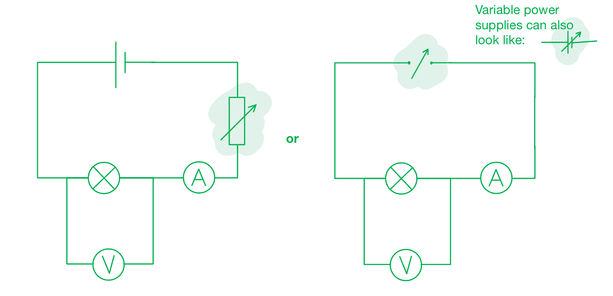

# Mark Schemes — Practical Skills I: Implementation & Measurements
**3. Practical Skills in Physics I** · Edexcel International A Level (IAL) Physics (YPH11)

## Q1 — medium — 7 marks · structured-questions

### 2((a)) — 2 marks
A circuit diagram that the student could have used looks like:

- Circuit with a means of varying the p.d. across the bulb (e.g., variable resistor, variable power supply); **[1 mark]**
- Ammeter connected in series **AND** voltmeter connect in parallel with the bulb; **[1 mark]**

**[Total: 2 marks]**

### 2((b)) — 4 marks
To obtain data to plot a graph:

- Calculate power using $P=VI$; **[1 mark]**
- Repeat the experiment and calculate the mean; **[1 mark]**
- Vary the p.d. to obtain at least five sets of data; **[1 mark]**

To ensure the data is accurate:

- A method to control background light **OR **control the distance from LDR to light source; **[1 mark]**

**[Total: 4 marks]**

> *To plot a graph needs a range of at least 5 sets of data. Consider how 5 different readings are to be found.*

> *This means identifying the independent variable, not taking repeat readings (which reduce the effect of errors, making the experiment more reliable).*

### 2((c)) — 1 marks
The student does not need to correct this reading because:

- Resistance is negligible (compared to resistance of LDR);** [1 mark]**

**[Total: 1 mark]**
