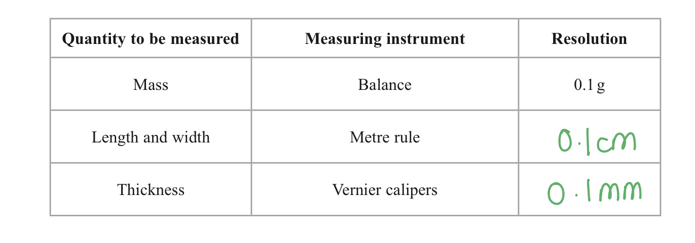
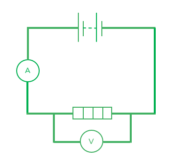

# Mark Schemes — Practical Skills I: Planning
**3. Practical Skills in Physics I** · Edexcel International A Level (IAL) Physics (YPH11)

## Q1 — medium — 7 marks · structured-questions

### 1((a)) — 1 marks
Complete the table

A table that would score 1 mark should look like:

- Metre rule - 0.1 cm **AND** Vernier calipers - 0.1 mm **[1 mark]**

**[Total: 1 mark]**

### 1((b)) — 4 marks
A method to determine an accurate value for the density of acetate is:

- Measure the length and width of the sheet in multiple positions and obtain the mean;** [1 mark]**
- Measure thickness for at least 20 sheets; **[1 mark]**
- Measure total mass for at least 20 sheets; **[1 mark]**
- Calculate  $density=\frac{mass}{length\timeswidth\timesthickness}$**[1 mark]**

**[Total: 4 marks]**

- *When measuring the thickness of an object, take measurements in **multiple** positions and then calculate a **mean*

  - *This is a very common practical technique*
- *Another example of this is calculating the thickness of a wire - the thickness is measured across multiple areas and a mean is calculated*

- *Don't be vague in your answer, state the **number **of sheets that are required to be measured*
- *The reference to the number of sheets need only be seen once but the **same** number of sheets must be used for measurements of **thickness **and **mass*

### 1((c)) — 2 marks
Using thicker sheets of acetate would reduce the uncertainty in her value for density because:

- (Absolute) uncertainty would stay the same **OR** the resolution of the measuring device would stay the same;** [1 mark]**
- So, the <u>percentage</u> uncertainty in thickness / mass would reduce;** [1 mark]**

**[Total: 2 marks]**

## Q2 — medium — 8 marks · structured-questions

### 1((a)) — 2 marks
To describe how the student could determine the velocity *v* of the trolley as it passed through the light gate:

- Measure length of card **OR **use a card of known length; **[1 mark]**
- Velocity = length of card ÷ time taken; **[1 mark]**

**[Total: 2 marks]**

- *This question relates to Core Practical 1, where a light gate can be used to determine the final velocity of the falling object, using the length of the object and the time taken as it passes through the light gate, blocking the beam. It is essential that you are very familiar with all the core practicals before the exam.*
- *In this question the Examiner accepted that the diagram was ambiguous, with some candidates thinking that the whole dashed line is the light gate. For this reason they also accepted length of trolley instead of card.*
- *Whatever you thought, it is crucial to give the calculation you would use to determine the result of the investigation.*

### 1((b)) — 6 marks
i) To calculate the mean value and percentage uncertainty for *v *:

Take the mean average of all four readings:

- $v=\frac{(2.07+1.84+1.91+2.10)}{4}=1.98\mathrm{ms}^{-1}$ **[1 mark]**

Calculate half of the range **or **find the maximum difference from the mean:

- $U=\frac{(2.10-1.84)}{2}=0.13\mathrm{ms}^{-1}$ **or  **`U space equals space fraction numerator open parentheses 1.98 space minus space 1.84 close parentheses over denominator 2 end fraction space equals space 0.14 space ms to the power of negative 1 end exponent` **[1 mark]**

Find percentage uncertainty:

- `percent sign U space equals fraction numerator U over denominator m e a n space v end fraction space cross times space 100 equals space fraction numerator 0.13 over denominator 1.98 end fraction space cross times space 100 equals space 6.6 space percent sign` **or **`percent sign U space equals fraction numerator U over denominator m e a n space v end fraction space cross times space 100 equals space fraction numerator 0.14 over denominator 1.98 end fraction space cross times space 100 space equals space 7.1 space percent sign`

State percentage uncertainty to 1 s.f.:

- `U space equals space 7 space percent sign` **[1 mark]**

ii) To determine the acceleration of the trolley on the ramp:

Select the correct SUVAT equation and calculate:

- $v^{2}=u^{2}+2as$
- `a space equals space fraction numerator v squared space minus space u squared over denominator 2 cross times s end fraction space equals fraction numerator negative 1.98 squared over denominator open parentheses 2 cross times 1.5 close parentheses end fraction` **[1 mark]**
- $a=1.31\mathrm{ms}^{-2}$ **[1 mark]**

iii) Achieving similar results does not show that the results are reproducible because:

- The second student carried out the same experiment **or **used the same equipment **or **used the same method; **[1 mark]**

**[Total: 6 marks]**

- *In part (i), you must round your answers to the correct number of significant figures. Uncertainty calculations are one of the places candidates most often forget to do this.*
- *Many students in the real exam didn't realise this was a situation with constant acceleration, needing a SUVAT equation to solve it.*

  - *Since this Core Practical finds the **Acceleration of **Freefall **Using a Ramp & Trolley **and **freefall** means 'the only force acting is the gravitational force', the normal speed and distance equation does not apply.*
- *Very few students got the mark for part (iii) in the exam. Be clear about the meaning of words such as **reproducibility*

  - *Reproducibility means "when similar results are obtained by students from different groups using **different methods or apparatus**"*

## Q3 — medium — 14 marks · structured-questions

### 3((a)) — 4 marks
To determine the maximum force a nylon fishing line can withstand before breaking:

- Secure a sample of nylon at one end; **[1 mark]**
- Hang slotted masses from the opposite end; **[1 mark]**
- Increase the force / mass until the sample breaks; **[1 mark]**
- Use *F* = *mg* to calculate the force **OR** use a Newton meter to measure the weight of the mass; **[1 mark]**

**[Total: 4 marks]**

- *You could also score the first two marks for a clearly annotated diagram*

### 3((b)) — 2 marks
A safety issue and an associated control measure could be:

**EITHER**

- Safety issue: masses could fall on feet; **[1 mark]**
- Control measure: ensure feet are not directly under masses / put down a crash mat underneath masses; **[1 mark]**

**OR**

- Safety issue: snapped nylon could cause injury to eyes; **[1 mark]**
- Control measure: wear safety glasses; **[1 mark]**

**[Total: 2 marks]**

### 3((c)) — 8 marks
i) Calculate the % uncertainty in the mean diameter of the nylon line:

- Mean diameter = $\frac{0.55+0.57+0.54+0.55+0.53}{5}$
- Mean diameter = 0.55 mm

Determine the uncertainty in the mean diameter

**EITHER**

- Uncertainty in mean *d* = ±(half the range)
- Uncertainty in mean *d* = `fraction numerator open parentheses 0.57 space minus space 0.53 close parentheses over denominator 2 end fraction` = ±0.02 mm **[1 mark]**

**OR**

- Uncertainty in mean *d* = ±(greatest deviation from mean)
- Uncertainty in mean *d* = 0.55 − 0.53 = ±0.02 mm **[1 mark]**

Determine the % uncertainty:

- % uncertainty in *d* = `fraction numerator 0.02 over denominator 0.55 end fraction cross times 100 percent sign` = 3.6 % **[1 mark]**

ii) Evaluate the student's results and compare them with the article's values:

List the known quantities:

- Force before = 65.8 N
- Radius before = 0.225 mm = 2.25 × 10–4 m
- Force after = 57.8 N
- Radius after = 0.23 mm = 2.3 × 10–4 m

Calculate the tensile stress before absorbing water:

- *A* = π*r**2* = π × (2.25 × 10–4)2 **[1 mark]**
- `sigma space equals space F over A space equals space fraction numerator 65.8 over denominator straight pi cross times open parentheses 2.25 cross times 10 to the power of negative 4 end exponent close parentheses squared end fraction`
- Tensile stress before, σ = 4.1 × 108 Pa **[1 mark]**

Calculate the tensile stress after absorbing water:

- *A* = π*r**2* = π × (2.3 × 10–4)2
- `sigma space equals space F over A space equals space fraction numerator 57.8 over denominator straight pi cross times open parentheses 2.3 cross times 10 to the power of negative 4 end exponent close parentheses squared end fraction`
- Tensile stress after, σ = 3.5 × 108 Pa **[1 mark]**

Determine the percentage change in tensile stress:

- % difference = `fraction numerator open parentheses 4.1 minus 3.5 close parentheses cross times 10 to the power of 8 over denominator 4.1 cross times 10 to the power of 8 end fraction cross times 100 percent sign` = 15% **[1 mark]**

Write a concluding statement:

- The article states that the tensile stress of nylon decreases by 10% after absorbing water, however, the results show that it decreases by 15%, meaning the nylon breaks under less force (after absorbing water) than claimed by the article; **[1 mark]**

**[Total: 8 marks]**

## Q4 — medium — 9 marks · structured-questions

### 2((a)) — 6 marks
Devise a plan to determine the value of *L* using a graphical method:

Draw a circuit diagram:

- Correct circuit diagram including a d.c. power supply, voltmeter and ammeter;** [1 mark]**

Explain the method:

- Wait until the water begins to boil; **[1 mark]**
- Record values of mass *m*;** [1 mark]**
- At times *t *with a stopwatch; **[1 mark]**

Suggest an appropriate graph and how it could be used:

Any **one** from:

| ***y*** | ***x*** | ***gradient*** |
|---|---|---|
| *m* | *t* | $\frac{VI}{L}$ |
| *m* | *VIt ***OR*** Pt ***OR*** E* | $\frac{1}{L}$ |
| *m* | *Vt* | $\frac{I}{L}$ |
| *m* | *It* | $\frac{V}{L}$ |

- Correctly labelled x and y axes; **[1 mark]**
- Correct gradient including a value to obtain L; **[1 mark]**

**[Total: 6 marks]**

- *A joulemeter or wattmeter in series can replace the voltmeter and ammeter in the circuit*
- *The method would then be edited to say:*

  - *Record values of mass **m** at energies** E **with a joulemeter*
  - *Record values of mass **m** at powers **P** with a wattmeter*

### 2((b)) — 3 marks
Explain how another significant source of error affects the value of *L*:

- A significant source of error is energy transfer to the surroundings; **[1 mark]**
- This decreases the energy transferred to the water (per second); **[1 mark]**
- Hence the value of *L* will be too large; **[1 mark]**

**[Total: 3 marks]**

- *This is a really common style of question, and the key is ensuring you follow through to explain what the error will do to the reading of interest*
