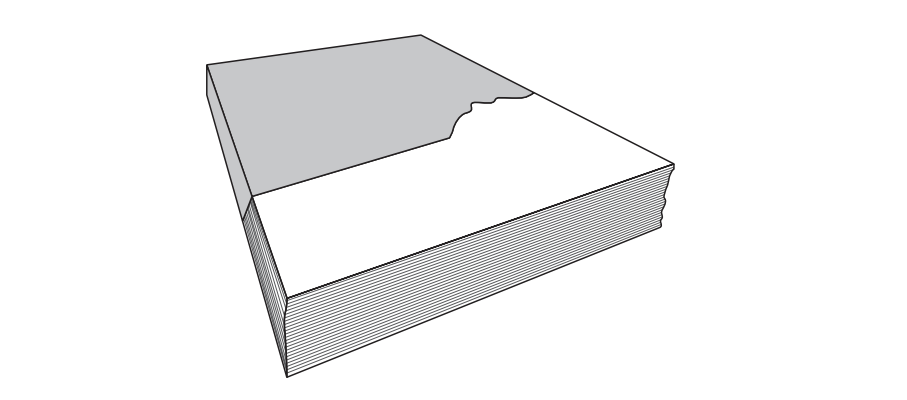
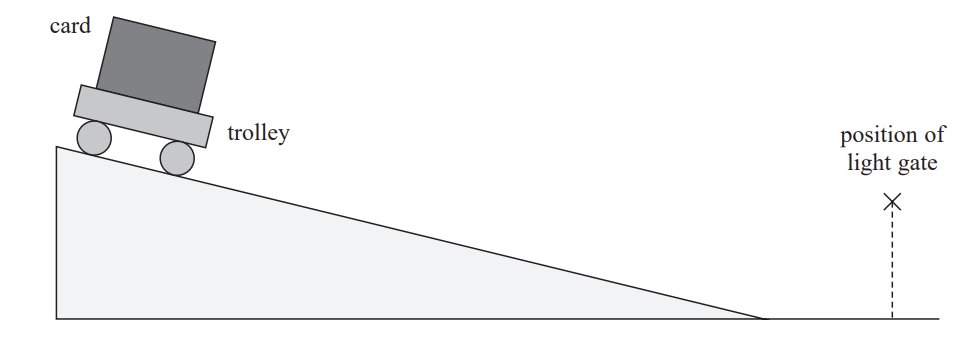
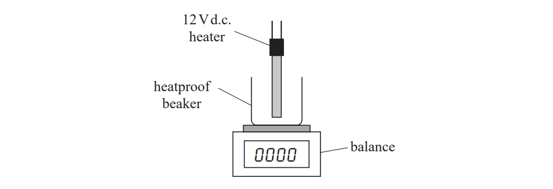

# Exam Questions — Practical Skills I: Planning
**3. Practical Skills in Physics I** · Edexcel International A Level (IAL) Physics (YPH11)
> Source: [https://www.savemyexams.com/international-a-level/physics/edexcel/19/topic-questions/3-practical-skills-in-physics-i/practical-skills-i-planning/structured-questions/](https://www.savemyexams.com/international-a-level/physics/edexcel/19/topic-questions/3-practical-skills-in-physics-i/practical-skills-i-planning/structured-questions/) · 4 questions · total 38 marks

## Q1 — medium — 7 marks · structured-questions

### 1((a)) — 1 mark — command: complete — structured — from paper 2021 June · WPH13/01
A student planned an experiment to determine the density of acetate.

She was given a pack of 50 acetate sheets and had access to standard laboratory apparatus.

The approximate dimensions of a single sheet of acetate are given on the pack.

| Length | 30 cm |
|---|---|
| Width | 21 cm |
| Thickness | 0.15 mm |

The total mass of 50 acetate sheets is approximately 670 g.

To determine the density of acetate, the student needed to take measurements.

Complete the table below.

| **Quantity to be measured** | **Measuring instrument** | **Resolution** |
|---|---|---|
| Mass | Balance | 0.1 g |
| Length and width | Metre rule |   |
| Thickness | Vernier calipers |   |

### 1((b)) — 4 marks — command: describe — structured — from paper 2021 June · WPH13/01
Describe a method to determine an accurate value for the density of acetate.

### 1((c)) — 2 marks — command: explain — structured — from paper 2021 June · WPH13/01
The student then followed the same method using thicker sheets of acetate.

Explain why using thicker sheets of acetate would reduce the uncertainty in her value for density.

## Q2 — medium — 8 marks · structured-questions

### 1((a)) — 2 marks — command: describe — structured — from paper 2022 Jan · WPH13/01
A student investigated the acceleration of a trolley as it rolled down a ramp. The trolley was released from rest at the top of the ramp and allowed to roll onto a horizontal surface. There was a single light gate above the horizontal surface, as shown.

The light gate was connected to a data logger. The data logger recorded the time taken for the card to pass through the light gate.

Describe how the student could determine the velocity *v* of the trolley as it passed through the light gate.

### 1((b)) — 6 marks — command: multiple — structured — from paper 2022 Jan · WPH13/01
The student repeated the procedure and determined four values of *v*. The values are shown in the table.

| ***v***** / m s****–1** |   |   |   |
|---|---|---|---|
| 2.07 | 1.84 | 1.91 | 2.10 |

i) Calculate the mean value for *v* and the percentage uncertainty in *v*.

Mean *v* = ............................ m s–1

Percentage uncertainty in *v* =........................... %

**(3)**

ii) The student measured the distance s that the trolley travelled on the ramp.

Determine the acceleration of the trolley on the ramp.

s = 1.50 m

Acceleration = ............................. m s–2**(2)**

iii) A second student carried out the same experiment and determined a similar value for the acceleration of the trolley on the ramp.

State why this does not show that the results are reproducible.

**(1)**

## Q3 — medium — 14 marks · structured-questions

### 3((a)) — 4 marks — command: describe — structured — from paper Oct/Nov 2021 · WPH13/01
A student was asked to investigate the ultimate tensile stress of a sample of thin nylon fishing line.

Describe a method to determine the maximum force the nylon fishing line can withstand before breaking.

### 3((b)) — 2 marks — command: how — structured — from paper Oct/Nov 2021 · WPH13/01
Identify one safety issue with this investigation and how it may be dealt with.

### 3((c)) — 8 marks — command: multiple — structured — from paper Oct/Nov 2021 · WPH13/01
Before testing, the student measured the diameter at five points along the sample of nylon fishing line.

| 0.55mm | 0.57mm | 0.54mm | 0.55mm | 0.53mm |
|---|---|---|---|---|

i) Calculate the percentage uncertainty in the mean diameter of the nylon fishing line.

Percentage uncertainty = .........................................**(3)**

ii) The student read an article that suggested nylon fishing line can absorb water.

The article suggested that the ultimate tensile stress of nylon decreases by 10% after absorbing water.

She repeated her experiment, using new samples of fishing line before and after they absorbed water.

| **Sample** | **Maximum force / N** | **Diameter / mm** |
|---|---|---|
| Before | 65.8 | 0.45 |
| After | 57.8 | 0.46 |

Evaluate whether her results support the suggestion in the article.

**(5)**

## Q4 — medium — 9 marks · structured-questions

### 2((a)) — 6 marks — command: plan — structured — from paper 2021 June · WPH16/01
The specific latent heat of vaporisation* L* of water can be determined using the apparatus shown.

Devise a plan to determine the value of *L* using a graphical method.

You should include a circuit diagram and any additional apparatus required.

### 2((b)) — 3 marks — command: explain — structured — from paper 2021 June · WPH16/01
One significant source of error in this experiment is the uncertainty in the mass reading due to the water moving as it boils.

Explain how another significant source of error affects the value of *L*.
