# Mark Schemes — Practical Skills I: Processing Results
**3. Practical Skills in Physics I** · Edexcel International A Level (IAL) Physics (YPH11)

## Q1 — medium — 11 marks · structured-questions

### 3((a)) — 2 marks
The student could determine *θ* using a metre rule by:

- Measure <u>two</u> of sides **AB**, **BC** or **AC**; **[1 mark]**

Calculate *θ* using trigonometry:

- `theta space equals space sin to the power of – 1 end exponent open parentheses fraction numerator B C over denominator A B end fraction close parentheses` **OR** `theta space equals space cos to the power of – 1 end exponent open parentheses fraction numerator A C over denominator A B end fraction close parentheses` **OR** `theta space equals space t a n to the power of – 1 end exponent open parentheses fraction numerator B C over denominator A C end fraction close parentheses` **[1 mark]**

**[Total: 2 marks]**

### 3((b)) — 1 marks
To check the bracket is horizontal:

Any **one **from:

- Measure the distance to the floor in (at least) <u>two places</u> using the metre rule; **[1 mark]**
- Place a spirit level <u>along the bracket</u>; **[1 mark]**
- Place a set square <u>between the wall and the bracket</u>; **[1 mark]**
- Place a protractor <u>along the wall at the hinge</u>; **[1 mark]**
- Use **AB**2 = **AC**2 + **BC**2 to check that the triangle is right-angled; **[1 mark]**

**[Total: 1 mark]**

> *As you can see this question needs you to name the equipment you would need (set square, protractor) **and **where to place it.*

### 3((c)) — 3 marks
To criticise the recording of results:

Look for mistakes or inconsistencies:

- Repeat readings are <u>not recorded / in the table</u>; **[1 mark]**
- Inconsistent significant figures for <u>*F*</u>* *; **[1 mark]**
- *x* only recorded to nearest cm; **[1 mark]**

**[Total: 3 marks]**

- *This type of question regularly occurs on WPH13 papers.*
- *Your answers must be specific. For example the data will usually have inconsistent significant figures and you need to identify which data that is. In this case the values for **x** are consistent so your answer needs to specify **F**.*
- *There will also usually be a problem with repeat readings. But notice that in this question repeat readings were taken, but not recorded, so be sure you have read the question carefully.*

### 3((d)) — 5 marks
i) To calculate a value for *W*:

Compare the equation in the question to the equation for a straight line graph:

Use the expression for the *y*-axis intercept (c) to find W:

- Value of y-axis intercept = 0.8 N** [1 mark]**
- Therefore $0.8=\frac{W}{2\mathrm{sin}θ}$ **[1 mark]**
- Therefore $W=0.8\times2\times\mathrm{sin}42=1.07N$ **[1 mark]**

ii) To evaluate the student’s conclusion:

Calculate the difference between the values of g:

- `Percentage space difference space equals space fraction numerator 9.81 minus 9.64 over denominator 9.81 end fraction cross times 100 space equals space 1.7 percent sign` **[1 mark]**

Form a judgement based on the calculation:

- The difference is small / less than 2% **AND**
- so the method is accurate; **[1 mark]**

**[Total: 5 marks]**

- *To **evaluate **means 'to come to a **supported** judgement'.*
- *Supported **means 'backed up by evidence'.*

  - *Your evidence in this case is the two values of **g**, the one given in the question and the standard value of **g** given in the datasheet. Your judgement must compare these two values.*

## Q2 — medium — 13 marks · structured-questions

### 4((a)) — 9 marks
i) The completed table and graph look like:

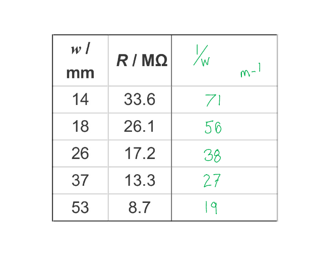

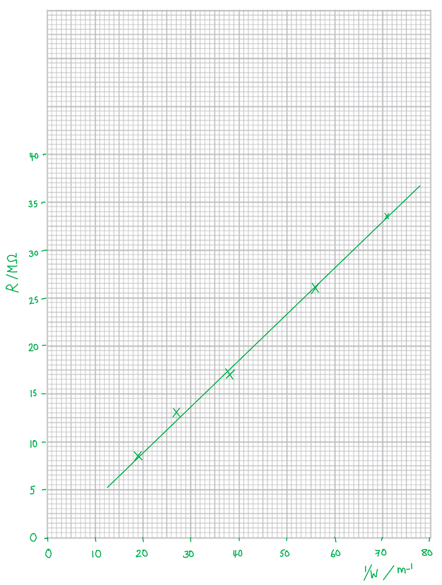

- All 1/*w* values in the table correct **AND **rounded to 2 s.f. **[1 mark]**
- Both axes completed with quantities **AND **units; **[1 mark]**
- Sensible scales (read the notes below); **[1 mark]**
- Accurate plotting (read the notes below); **[2 marks]**
- Line of best fit (read the notes below); **[1 mark]**

ii) To determine *t *using data from the graph:

The graph will be checked and should look like:

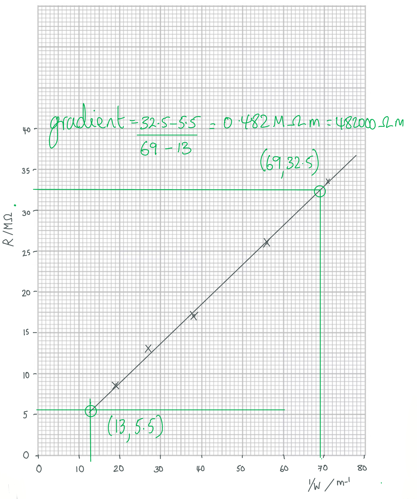

- Calculates gradient using large triangle (at least three quarters of the grid); **[1 mark]**
- Gradient calculation, $\mathrm{gradient}=\frac{ρl}{t}=4.82\times10^{5}\mathrm{Ωm}$ (on this graph) **[1 mark]**
- Thickness calculation, `t space equals space fraction numerator rho l over denominator g r a d i e n t end fraction equals fraction numerator open parentheses 4.0 cross times 10 cubed close parentheses cross times 0.1 over denominator 482 space 000 end fraction space equals space 0.83 space mm` (answer in the range 0.81-0.87 mm) **[1 mark]**

**[Total: 9 marks]**

- *Plotting of graphs using provided or calculated data is a common requirement of WPH13 and worth quite a few marks, which shows you how important this skill is.*
- *In the data table you may have decided to work with mm**-1**. In this case then later on you would need to convert to meters as you must calculate in S.I. units. Either way, as **w** was given to 2 significant figures, 1/**w** should also be rounded to 2 significant figures.*

- *By this stage of your studies the plotting of graphs should be second nature. However examiners report that they regularly see the same mistakes, which you need to avoid.*

  - *Complete both units and variable for both axis labels. **Only one missing item loses the whole mark**.*
  - *Scales should be a factor of 1, 2 or 5 on the 2 cm lines. Never work in multiples of 3, or any other value.*
  - *Scales must be such that the plotted points reach over more than half available graph paper in each direction.*
  - *Plotting must be accurate. Draw your points small and neat so they can be checked to within 1 mm of the correct position. **Only one incorrect or 'blobby' plot will lose you one of these two marks.*
  - *Make your line of best fit average out the plots.*
  - *Do **not** force the graph to go through the origin if the plotted data doesn't indicate this is required.*

### 4((b)) — 4 marks
i) Explain why this method gives a value for *t* with low uncertainty:

- Micrometer has high resolution resolution of 0.01 mm **AND **so low uncertainty;** [1 mark]**
- Percentage uncertainty is reduced **AND **by measuring several thicknesses together / uncertainty of the measurement is divided by the number of slices; **[1 mark]**

ii) Deduce whether this value is consistent with the value of *t* obtained from the graph:

Calculates the upper limit of the measurement:

- $\mathrm{upper} \mathrm{limit}=0.80\times1.02=0.82\mathrm{mm}$ **[1 mark]**

Compare to the graph value calculated in part (a):

- From the graph, *t *= 0.83 mm > 0.82 mm **and **so the results are <u>not</u> consistent; **[1 mark]**

**[Total: 4 marks]**

- *If you calculated and compared with the lower lower limit (0.78) then you should find that t < 0.80 mm.*
- *This mark can be gained with an 'error carried forward' from (a) (ii) as long as you showed your full, correct working. *

## Q3 — medium — 11 marks · structured-questions

### 5((a)) — 7 marks
i) Determine the speed of sound in air:

Calculate time:

- There are 7.2 divisions between peaks (answer in range 7.1 - 7.3); **[1 mark]**
- Time per division = 0.5 × 10−3 s
- Therefore `t space equals space N space cross times space t i m e space p e r space d i v i s i o n space equals space 7.2 space cross times open parentheses 0.5 cross times 10 to the power of negative 3 end exponent close parentheses equals 3.6 space cross times 10 to the power of negative 3 end exponent space straight s` **[1 mark]**

Calculate speed:

- $s=ut$
- $u=\frac{s}{t}=\frac{1.25m}{3.6\times10^{-3}s}$
- $u=347\mathrm{ms}^{-1}$ (answer in range 342 - 352 ms-1); **[1 mark]**

ii) To justify the teacher’s comment:

Determine the time between peaks:

- $\mathrm{time} \mathrm{between} \mathrm{peaks}=\frac{s}{u}=\frac{1.25}{4000}$ = 3.1 × 10−4 s = 310 μs

Calculate the maximum time that could be shown on the screen:

- Use time per division to calculate maximum time = 20 μs × 8 = 160 μs; **OR**
- Use screen width to calculate time per division required to show both peaks; **OR**
- Use time per division to calculate how many divisions would be required to show both peaks; **[1 mark]**

Draw a conclusion related to the teacher's comment:

- The time displayed on the screen would be too short **OR **the correct setting is 50μs; **[1 mark]**

**[Total: 7 marks]**

### 5((b)) — 2 marks
Using a rubber hammer would affect the accuracy because:

- Peaks would be wider; **[1 mark]**
- It would be more difficult to judge the position / time of the peaks, so time between peaks would be less accurate; **[1 mark]**

**[Total: 2 marks]**

- *This was a difficult question which most students struggled with in the exam.*
- *One common mistake was to think that 'sound lasting a longer time' meant that the time between peaks would be longer (so percentage uncertainty would decrease).*
- *Very few students correctly linked the width of the peak to the duration of the sound. This meant that most didn't use the uncertainty to identify the time for each peak.*

### 5((c)) — 2 marks
To assess the most significant source of uncertainty:

Calculate the percentage uncertainty of the Young Modulus:

- `percent sign U subscript E space equals space fraction numerator 0.5 space G P a over denominator space 11.2 space G P a end fraction space cross times space 100 space equals space 4.46 percent sign space equals space 4 percent sign space open parentheses 1 space straight s. straight f. close parentheses`; **[1 mark]**

Compare with uncertainty on density to draw a conclusion:

- 4% > 3%
- Therefore the Young Modulus has the greatest effect; **[1 mark]**

**[Total: 2 marks]**

## Q4 — medium — 10 marks · structured-questions

### 2((a)) — 2 marks
Two reasons for the variation in the lengths the student measured are:

- It was difficult to identify when the sound was loudest **OR** there was difficulty in hearing the tuning fork due to background noise; **[1 mark]**
- The tube moved when marking the water level **OR **the tube was not vertical when the water level was marked; **[1 mark]**

**[Total: 2 marks]**

### 2((b)) — 4 marks
i) Calculate the mean value of *l:*

- $Meanl=\frac{18.3+18.0+19.2+19.4+19.2}{5}$**[1 mark]**
- $Meanl=18.82=18.8\mathrm{cm}$* ***[1 mark]**

ii) Calculate the percentage uncertainty in *l:*

Calculate the absolute uncertainty in *l*:

- `a b s o l u t e space u n c e r t a i n t y space i n space l italic space equals italic space plus-or-minus 1 half open parentheses r a n g e close parentheses space equals plus-or-minus 1 half open parentheses 19.4 space minus space 18.0 close parentheses space equals space 0.7 space cm`* ***[1 mark]**

Calculate the % uncertainty in *l*:

- `percent sign space u n c e r t a i n t y space i n space l equals space fraction numerator a b s o l u t e space u n c e r t a i n t y space over denominator m e a s u r e d space v a l u e end fraction space cross times space 100 space percent sign space equals space fraction numerator space 0.7 over denominator 18.8 end fraction space cross times space 100 percent sign`
- `percent sign space u n c e r t a i n t y space i n space l space equals space 3.723 space equals space 4 space percent sign space`**[1 mark]**

**[Total: 4 marks]**

- *You can also calculate the % uncertainty in **l** through calculating the difference between the lowest value and the mean *

  - *Difference from mean = 18.8 – 18.0 = 0.8 cm*
  - *Percentage uncertainty = *`percent sign space u n c e r t a i n t y space i n space l space equals fraction numerator space 0.8 over denominator 18.8 end fraction space cross times space 100 percent sign space equals space 4.3 space percent sign`
- *Your value for the % uncertainty should be given to **1 s.f*

  - *This is because the value with the lowest number of significant figures used to calculate this (0.7) is to 1 s.f. so we cannot be more accurate than this*

### 2((c)) — 2 marks
Calculate the speed of sound in air

List the known quantities:

- Frequency of the tuning fork, *f* = 440 Hz
- Wavelength of the standing wave, *λ *= 4*l*
- Length of the air column, *l* = 18.8 cm = 0.188 m (from part b)

Calculate the speed of sound in air, *v*:

- $v=fλ=f\times4l$
- `v space equals space 440 space cross times space 4 space open parentheses 0.188 close parentheses` **[1 mark]**
- $v=330.88=331ms^{-1}$ **[1 mark]**

**[Total: 2 marks]**

- *Always check whether you need to do any unit conversions*
- *Speed is in m s**–1** (unless specific otherwise in the question) so the 18.8 cm must be converted into m*

### 2((d)) — 2 marks
Comment on whether the student’s value is consistent with the accepted value for the speed of sound in air

List the known quantities:

- Length of the air column, *l *= 18.8 cm ± 4 %
- Speed of sound in air, *v *= 331 m s–1 (from part c)
- Frequency of the tuning fork, *f* = 440 Hz
- Wavelength of standing wave, *λ *= 4*l*

Calculate the upper limit of the speed of sound from *l*:

- `u p p e r space l i m i t space o f space l space equals space open parentheses 0.188 close parentheses space cross times space open parentheses 1 space plus space 0.04 close parentheses space equals space 0.19552 space straight m`
- `v space equals space f space cross times space 4 l space equals space 440 space cross times space 4 open parentheses 0.19552 close parentheses`
- $v=344.1152=344ms^{-1}$ **[1 mark]**

Write a conclusion:

- The accepted value of *v* is 343 m s–1 so as this lies within the upper limit of the calculated *v *(343 < 344) the value is accurate; **[1 mark]**

**[Total: 2 marks]**

- *You can also do this question by using the uncertainties to calculate the minimum value of **l*
- *You must always write a **conclusion **at the end with your final deduction to answer the question - this is vital for full marks, but just doing the calculations is not enough!*

- *When you want to find the upper and lower limits of a value, you must change the percentage uncertainty into decimals*

  - *4 % = 0.04*
- *Therefore, the lower limit is a 4 % **decrease** from the measured value of **l **(we did not need to find the upper limit because we already know that 331 (value from part c) <  343 (value given in part d))*
- *You **must** be confident in converting between fractions and decimals and finding the percentage decrease and increase of a value*

  - *Make sure you revise these in the maths revision notes if you're stuck*

## Q5 — medium — 14 marks · structured-questions

### 3((a)) — 3 marks
Calculate the percentage uncertainty in the diameter of the sphere shown on the micrometer

Calculate the value from the diameter:

- Diameter value = 17.90 mm **[1 mark]**

Determine the absolute uncertainty:

- `a b s o l u t e space u n c e r t a i n t y space equals space plus-or-minus 1 half open parentheses r e s o l u t i o n close parentheses equals space plus-or-minus 1 half open parentheses 0.01 space mm close parentheses equals plus-or-minus 0.005 space mm` **[1 mark]**

Determine the percentage uncertainty:

- `percent sign space u n c e r t a i n t y space equals space fraction numerator a b s o l u t e space u n c e r t a i n t y space over denominator m e a s u r e d space v a l u e end fraction space cross times space 100 space percent sign`
- `percent sign space u n c e r t a i n t y space equals space fraction numerator 0.005 space over denominator 17.90 end fraction space cross times space 100 space percent sign space equals space 0.02793 space equals space 0.03 space percent sign` **[1 mark]**

**[Total: 3 marks]**

- *Learning how to read a micrometer scale is an essential practical skill*
- *You must remember the following:*

  - *Each division on the main scale is 0.5 mm*
  - *Each division on the thimble scale is 0.01 mm*

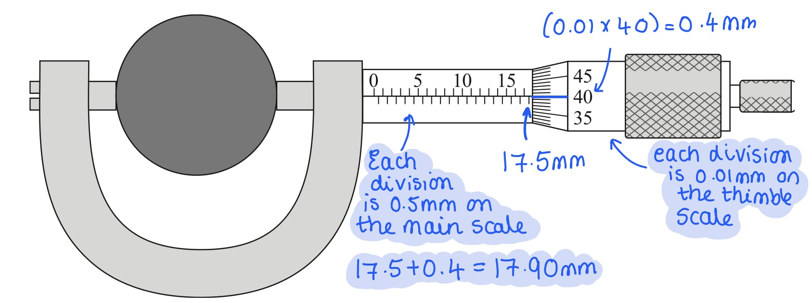

### 3((b)) — 1 marks
One precaution that should be taken before using a micrometer is:

- Check for zero error; **[1 mark]**

**[Total: 1 mark]**

- *'Do not overtighten' may sometimes be accepted, but checking for zero errors is a good precaution for **all** instruments*

### 3((c)) — 6 marks
i) It was necessary to measure the force when the sphere was stationary and the force when the sphere was moving at constant speed because:

- When stationary, the reading on the force meter = weight (− upthrust);** [1 mark]**
- When moving (at a constant speed), the reading on the force meter = weight + drag (− upthrust); **[1 mark]**
- Subtracting the two readings gives the value of drag;** [1 mark]**

ii) Calculate the viscosity *η* of the liquid:

- Reading when the sphere was stationary = 0.20 N
- Constant speed of the sphere, *v* = 0.32 m s–1
- Reading when the sphere was moving at constant speed = 0.29 N
- Diameter of the sphere = 17.90 mm = 17.9 × 10–3 m

Calculate the drag force, *D*:

- $D=readingatconstantspeed-readingwhenstationary=0.29-0.20=0.09N$* ***[1 mark]**

Calculate the viscosity of the liquid, *η:*

- $F=6πηrv\Rightarrowη=\frac{F}{6πrv}$
- `eta italic space equals space fraction numerator 0.09 italic space over denominator italic 6 pi space cross times space open parentheses fraction numerator 17.9 space cross times space 10 to the power of negative 3 end exponent over denominator 2 end fraction close parentheses space cross times space 0.32 end fraction`* ***[1 mark]**
- $η=1.6671=1.67\mathrm{Pa}s$* ***[1 mark]**

**[Total: 3 marks]**

- *If you're stuck on a sub-part, always check if there is any knowledge you can pick from previous subparts*
- *The equation for the drag force is already given in your mark scheme to part i)*
- *An object in a fluid moving at terminal velocity will have a drag force, weight and upthrust*

  - *The upthrust is not as relevant in this equation*

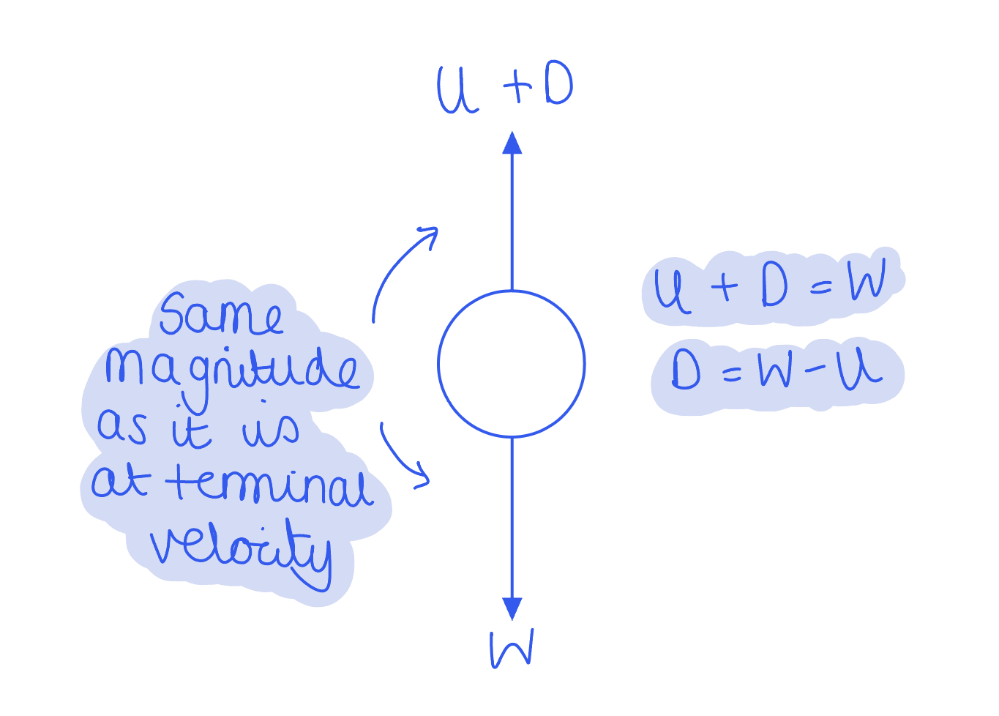

### 3((d)) — 4 marks
Assess which of these measurements was the most significant source of uncertainty in the value of viscosity

List the known quantities:

- Resolution of the force meter = 0.01 N
- Distance moved between the rubber bands = 25.0 cm
- Time measured = 0.78 s
- Force, *F* = 0.09 N (from part c)

**One **mark is awarded for all statements in each section:

Assess the uncertainty in the force:

- `percent sign space u n c e r t a i n t y space i n thin space F space equals space fraction numerator 0.01 space over denominator 0.09 end fraction space cross times space 100 space percent sign space equals space 11 space percent sign` **AND**
- The force is difficult to keep constant, so the variation is likely to be larger than 0.01 N **[1 mark]**

Assess the uncertainty in the distance:

- A meter ruler has a resolution of 1 mm so the absolute uncertainty on a reading is $\frac{1}{2}=0.5\mathrm{mm}$
- `percent sign space u n c e r t a i n t y space i n space d i s t a n c e space equals space fraction numerator 0.5 space cross times space 10 to the power of negative 3 end exponent over denominator 25.0 space cross times space 10 to the power of negative 2 end exponent end fraction space cross times space 100 space percent sign space equals space 0.2 space percent sign` **AND**
- Therefore, the percentage uncertainty is small; **[1 mark]**

Assess the uncertainty in the time:

- A stopwatch has a resolution of 0.01 s so its absolute uncertainty for a reading is $\frac{0.01}{2}=0.005s$
- `percent sign space u n c e r t a i n t y space i n space t i m e space equals space fraction numerator 0.005 space over denominator 0.78 end fraction space cross times space 100 space percent sign space equals space 0.6 space percent sign` **AND**
- The time is short, so the reaction time (0.2 s) will be a significant percentage (`fraction numerator 0.2 over denominator 0.78 end fraction space cross times space 100 space percent sign space equals space 26 space percent sign`) of the time measured; **[1 mark]**

Final conclusion:

- The time is the most significant source of uncertainty in the value of viscosity as it has the highest percentage uncertainty; **[1 mark]**

**[Total: 4 marks]**

- *For the uncertainty in the time, you could also state that there is not enough time to move the eyeline, so they may be a parallax error when judging when the sphere has passed the rubber band*
- *You must always back up commons in your assessments of uncertainties with calculations (quantitative answers are more likely to get full marks than qualitative answers)*
- *For the final mark, you must answer the question and state a reason clearly*

## Q6 — medium — 19 marks · structured-questions

### 4((a)) — 3 marks
A graph of *V*a against 1/λ should give a straight line because:

- The equation can be rearranged to give $V_{a}=\frac{hc}{e}\frac{1}{λ}+\frac{W}{e}$**[1 mark]**
- Comparing this to *y* = *mx* + *c* gives the$gradient=\frac{hc}{e}$**[1 mark]**
- *h*, *c* and *e* are all constants; **[1 mark] **

**[Total: 3 marks]**

### 4((b)) — 12 marks
i) Complete the table with the corresponding values of 1/λ

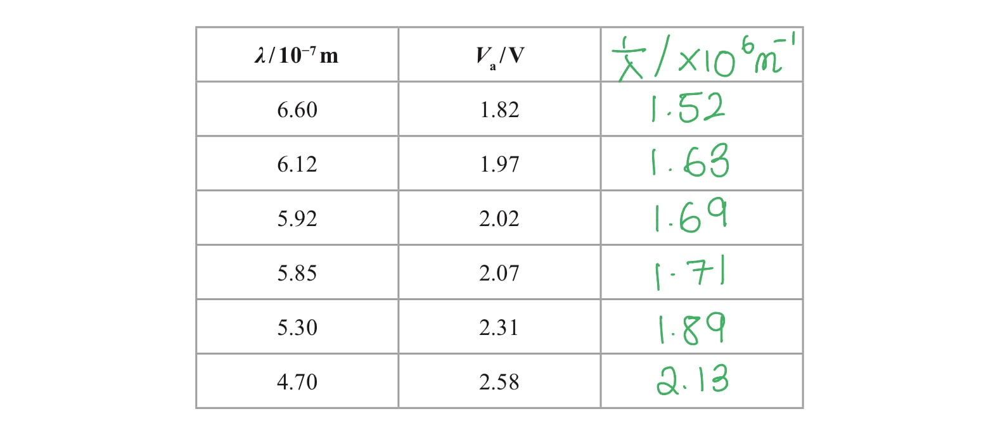

- All values of 1/λ calculated; **[1 mark]**
- All values rounded to 3 s.f. **[1 mark]**

ii) Plot a graph of *V*a on the *y*-axis against 1/λ on the *x*-axis

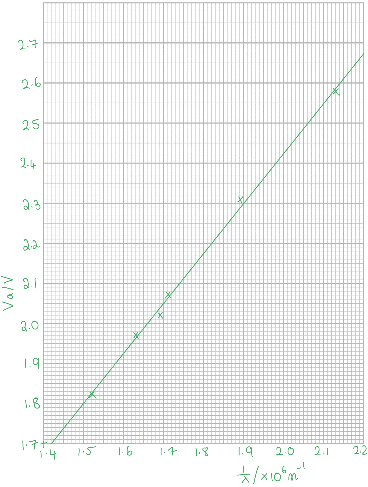

- Labels axes with quantities and units ( *V*a/V and 1/λ / × 106 m–1); **[1 mark]**
- Sensible scales (multiples of 1,2 or 5); **[1 mark]**
- Plotting – 2 points furthest from their line; **[1 mark]**
- Plotting – 2 points at the ends; **[1 mark]**
- Line of best fit; **[1 mark]**

** **

iii) Determine the value of the Planck constant given by the student’s data

Calculate the gradient:

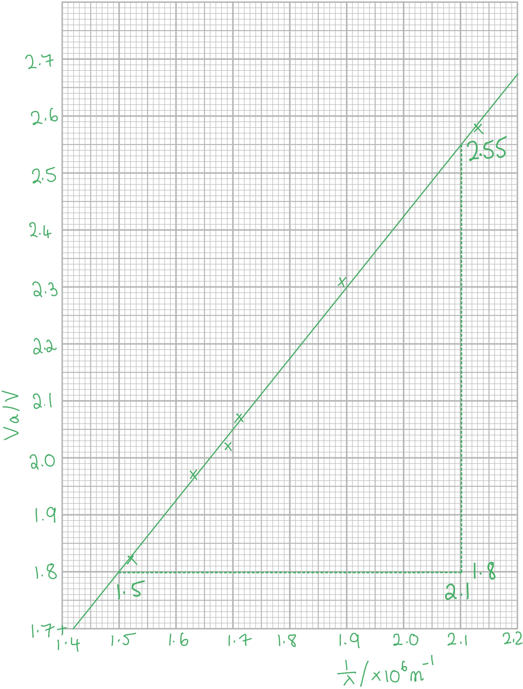

- `g r a d i e n t space equals space fraction numerator increment V subscript a space space over denominator increment 1 over lambda end fraction space equals space fraction numerator 2.55 space minus space 1.8 space over denominator open parentheses 2.1 space minus space 1.5 close parentheses space cross times space 10 to the power of 6 end fraction space equals space 1.25 space cross times space 10 to the power of negative 6 end exponent space straight V space straight m` **[1 mark]**

Calculate the value of the Planck constant, *h*:

- $gradient=\frac{hc}{e}\Rightarrowh=\frac{e\timesgradient}{c}$
- `h space equals space fraction numerator open parentheses 1.60 space cross times space 10 to the power of negative 9 end exponent close parentheses space cross times space open parentheses 1.25 space cross times space 10 to the power of negative 6 end exponent close parentheses space over denominator 3.00 space cross times space 10 to the power of 8 end fraction space`**[1 mark]**
- $h=6.67\times10^{-34}Js$ **[1 mark]**

  - *Accepted answers are between* 6.65 × 10–34 Js to 6.85 × 10–34 J s

iv) Evaluate the student’s statement

- The difference between the values from the gradient and the accepted value (6.63 × 10–34 J s) is `open parentheses 6.67 space cross times space 10 to the power of negative 34 end exponent close parentheses space minus space open parentheses 6.63 space cross times space 10 to the power of negative 34 end exponent close parentheses space equals space 0.04 space cross times space 10 to the power of negative 34 end exponent space straight J space straight s`  **[1 mark]**
- This is a very small difference so the method is accurate;  **[1 mark]** **OR**
- The percentage difference between the values from the gradient and the accepted value (6.63 × 10–34 J s) is `fraction numerator open parentheses 6.67 space cross times space 10 to the power of negative 34 end exponent close parentheses space minus space open parentheses 6.63 space cross times 10 to the power of negative 34 end exponent close parentheses over denominator 6.63 space cross times space 10 to the power of negative 34 end exponent end fraction space cross times space 100 thin space percent sign space equals space 0.6 space percent sign`  **[1 mark]**
- This is a very small percentage difference so the method is accurate;  **[1 mark]**

**[Total: 12 marks]**

- *Longer graphical and table questions are in every practical paper and the skills required in the questions are always similar*
- *Remember:*

  - *The scales on the graph **do not need to start at 0*
  - *An appropriate line of best fit is one that goes through as many points as possible, or equal amount of points on either side*
  - *Your gradient triangle should cover more than half the graph*
- *Don't lose easy marks for things such as labelling the graph*

- *To calculate the % difference, this is the *`fraction numerator m e a s u r e d space v a l u e space minus space t r u e space v a l u e over denominator t r u e space v a l u e end fraction space cross times 100 space percent sign`

### 4((c)) — 4 marks
Discuss whether this affects the accuracy of the value of the Planck constant obtained.

- The manufacturer’s wavelength would be shorter (than the wavelength of photons with least energy / emitted at *V*a); **[1 mark]**
- A lower *λ* would give a higher 1/*λ* **OR** the line would shift to the right; **[1 mark]**

Any **one **combination of points from:

- The difference in wavelength would be small, so negligible shift in points / the shift would be the same for all points, so the same gradient; **[1 mark]**
- No change in the value of *h* is obtained; **[1 mark]**

**OR**

- Points for longer *λ* would shift 1/*λ *values less, decreasing the gradient; **[1 mark]**
- Decreasing the value of *h* obtained; **[1 mark]**

**[Total: 4 marks]**

## Q7 — medium — 17 marks · structured-questions

### 4((a)) — 7 marks
i) Some valid criticisms of the results are:

Any **two** from:

- There is an inconsistent number of decimal places used in the values of *r*; **[1 mark]**
- There are no repeated readings (for *r*); **[1 mark]**
- All values (of *h* and *r*) should be to the nearest mm / to 3 d.p.; **[1 mark]**

ii) Plot a graph of *r* against *h*:

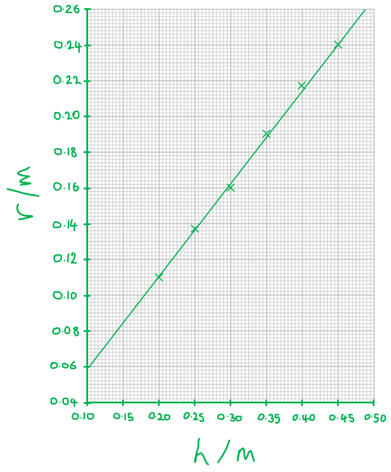

- Graph axes labelled with quantities and units; **[1 mark]**
- Appropriate scales used; **[1 mark]**
- At least 5 plotted points accurate within 1 mm; **[1 mark]**
- All 6 plotted points accurate within 1 mm; **[1 mark]**
- Line of best fit drawn; **[1 mark]**

**[Total: 7 marks]**

- *When an examiner marks a graph plotting question, such as this, they will be looking at the following:*

- *Graph axes labelled with quantities and units*

  - *This means they will check the labels you put on each axis and the units that you include*
  - *In this case, they will be looking to see if you have **r **/ m on the y-axis and **h **/ m** **on the x-axis*

- *Appropriate scales used*

  - *Make sure to use as much of the space as possible - examiners will be expecting plots to cover **at least half** of the grid supplied, but using more is preferred*
  - *In this context, "**appropriate scale**" means a scale which uses easy to follow increments, such as 1, 2 or 5*
  
    - *Increments of 3, 4, 7, etc are seen as "difficult scales" and will be marked down *
  - *Some top tips for deciding on a scale to use:*
  
    - *Calculate the range of the two columns of data you have tabulated*
    - *Put the variable with the largest range on the longer axis*
    - *Divide the range by the number of large grid squares and use this to decide on the best intervals for your axes*
    - *Also, remember that your scale does **not** have to start at zero*

- *Plots accurate within half a small square*

  - *The key to plotting points accurately is to use a ruler to line up with the axes*
  - *Examiners will check the two points which appear furthest from your best fit line (within half a square)*
  - *Note that they will **not** check points on "difficult scales", so getting the scale right is crucial!*

- *Line of best fit drawn*

  - *Often, the line of best fit should pass through, or pass very close to, the majority of plotted points*
  - *If the line does not go exactly through each point, ensure there are roughly an equal number of points on each side of the line*
  - *Never force your line to go through each point and don't force it to go through zero*

### 4((b)) — 5 marks
i) Equate kinetic and gravitational potential energy:

- $E_{k}=\DeltaE_{grav}\Rightarrow\frac{1}{2}mv^{2}=mgh$ **[1 mark]**

At X, initial velocity = *u* when height = *h*

- `1 half up diagonal strike m u squared space equals space up diagonal strike m g h`
- $u^{2}=2gh$
- $u=\sqrt{2gh}$ **[1 mark]**

ii) The gradient of the graph is *e*2 because:

- Initial velocity:  $u=\sqrt{2gh}$

At Y, velocity = *v* when height = *r*

- Final velocity:  $v=\sqrt{2gr}$ **[1 mark]**
- $e=\frac{v}{u}=\frac{\sqrt{2gr}}{\sqrt{2gh}}=\frac{\sqrt{r}}{\sqrt{h}}$ **[1 mark]**
- Gradient = $\frac{\Deltar}{\Deltah}$ therefore gradient = *e**2* **[1 mark]**

**[Total: 5 marks]**

### 4((c)) — 3 marks
Calculate the gradient using a large triangle:

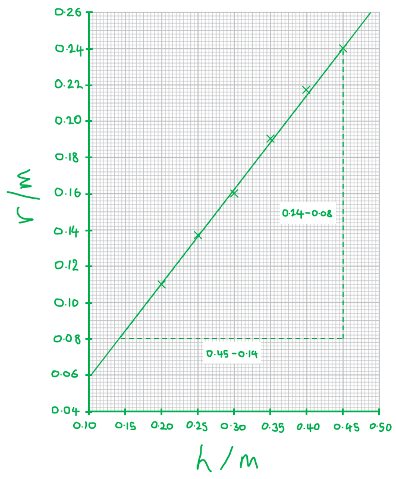

- Large gradient triangle drawn using <u>at least</u> half of the best fit line; **[1 mark]**

Determine *e* using the gradient:

- Gradient = *e**2** *=* *$\frac{0.24-0.08}{0.45-0.14}$* *= 0.516
- *e**2* = 0.52, so *e* = 0.72 **[1 mark]** *Acceptable range for gradient = 0.51 to 0.56 and acceptable range for e = 0.71 to 0.75*

The cube is likely to be made from:

- <u>Stainless steel</u>, as the coefficient of restitution is within the range 0.63 < *e* < 0.93; **[1 mark]**

**[Total: 5 marks]**

### 4((d)) — 2 marks
The effect of friction on the experiment would be:

Any** one** from:

- Acceleration along the ramp would be smaller, so *r* would be lower (for a given *h*); **[1 mark]**
- Friction would reduce velocity, so *r *would be lower (for a given *h*); **[1 mark]**
- Friction would dissipate energy, so *r* would be lower (for a given *h*); **[1 mark]**

If **one** mark obtained from the above list, max **one** for:

- (Hence, the gradient and) the value obtained for *e* would be smaller; **[1 mark]**

**[Total: 2 marks]**

## Q8 — medium — 11 marks · structured-questions

### 1((a)) — 2 marks
The student could vary the temperature of the thermistor by:

- Heating (to 100 °C) using a water bath or kettle;** [1 mark]**
- Cooling (to 10 °C) using an ice bath or freezer;** [1 mark]**

**[Total: 2 marks]**

### 1((b)) — 2 marks
Calculate the percentage uncertainty in the value on the voltmeter:

- Value on the voltmeter = 6.85 V
- Uncertainty in reading =  ½ × smallest division = ±0.005 V **[1 mark]**
- % uncertainty = `fraction numerator u n c e r t a i n t y over denominator v a l u e end fraction cross times 100 percent sign`
- % uncertainty = `fraction numerator 0.005 over denominator 6.85 end fraction cross times 100 percent sign` = 0.073 %
- % uncertainty = 0.07 % **[1 mark]**

**[Total: 2 marks]**

### 1((c)) — 5 marks
i) Estimate the value of $V$ for a temperature of 0°C:

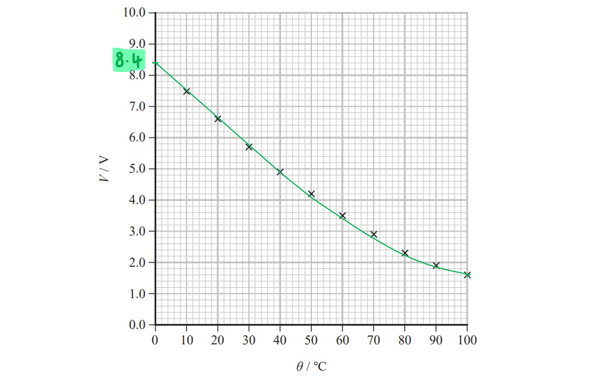

- Line or curve of best fit drawn up to *V* axis; **[1 mark]**
- At 0°C, $V$ = 8.4 V; **[1 mark]** *Acceptable range for V = 8.2 to 8.6 V*

ii) Calculate the resistance of the thermistor at a temperature of 0°C:

List the known quantities:

- Emf, *ε* = 12 V
- p.d. across thermistor, $V_{therm}$ = 8.4 V
- p.d. across fixed resistor, $V_{fixed}$ = 12 − 8.4 = 3.6 V **[1 mark]**
- Resistance of fixed resistor, $R_{fixed}$ = 4.7 kΩ = 4700 Ω

Use the potential divider equation to determine $R_{therm}$:

- Potential divider equation: $V_{out}=\frac{R_{2}}{R_{1}+R_{2}}V_{in}\RightarrowV_{fixed}=\frac{R_{fixed}}{R_{fixed}+R_{therm}}\timesε$
- $3.6=\frac{4700}{4700+R_{therm}}\times12$
- `R subscript t h e r m end subscript space equals space open parentheses 4700 cross times fraction numerator 12 over denominator 3.6 end fraction close parentheses space minus space 4700 space equals space 10 space 970 space straight capital omega` **[1 mark]**
- Resistance = 1.1 × 104 Ω **[1 mark]**

**[Total: 5 marks]**

- *For part (ii), you could also complete the calculation by calculating the current in the circuit and then calculate the resistance of the thermistor*

$V_{fixed}=IR_{fixed}\RightarrowI=\frac{V_{fixed}}{R_{fixed}}=\frac{3.6}{4700}=7.7\times10^{-4}A$

$V_{therm}=IR_{therm}\RightarrowR_{therm}=\frac{V_{therm}}{I}=\frac{8.4}{7.7\times10^{-4}}=1.1\times10^{4}Ω$

### 1((d)) — 2 marks
For the suggestion that $V$ is inversely proportional to $θ$ (in K):

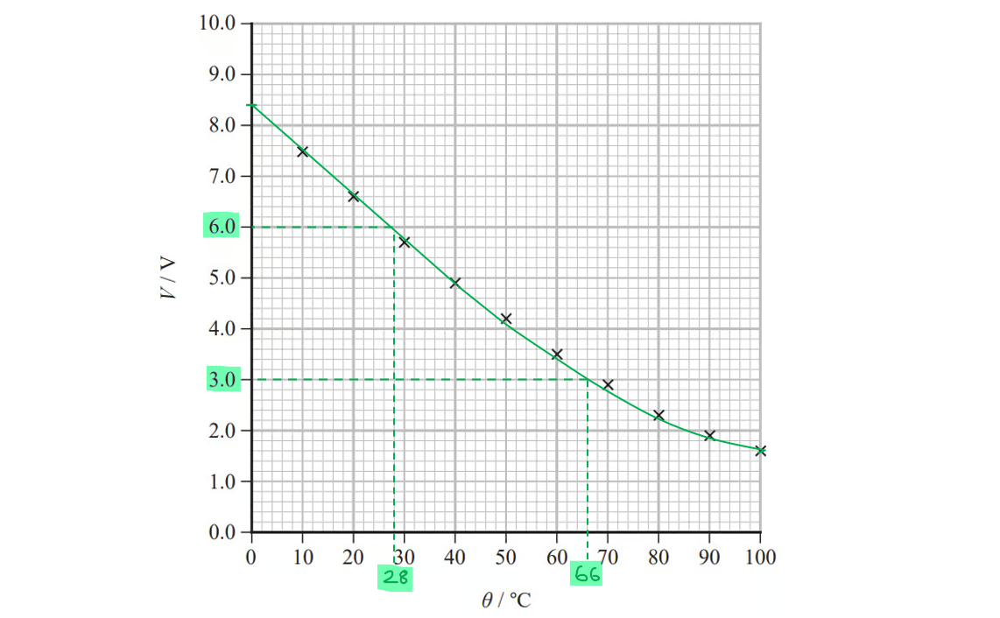

- From the graph:

  - When $V$ = 3.0 V, $θ$ = 28 °C $\overset{+273K}{\rightarrow}$ 301 K
  - When $V$ = 6.0 V, $θ$ = 66 °C $\overset{+273K}{\rightarrow}$ 339 K

- $V$ × $θ$ = 3.0 × 301 = 1120 V K  **and**  $V$ × $θ$ = 6.0 × 339 = 1810 V K **[1 mark]**
- If $V\propto\frac{1}{θ}$ were true, then $V$ × $θ$ would be constant at all values, hence the student's suggestion is incorrect; **[1 mark]**

**[Total: 2 marks]**

- *To obtain the first mark, you must convert from °C to K*
- *To obtain the second mark, as long as your conclusion matches your values, you can get the mark even if you didn't convert to Kelvin *
