# Exam Questions — Practical Skills I: Processing Results
**3. Practical Skills in Physics I** · Edexcel International A Level (IAL) Physics (YPH11)
> Source: [https://www.savemyexams.com/international-a-level/physics/edexcel/19/topic-questions/3-practical-skills-in-physics-i/practical-skills-i-processing-results/structured-questions/](https://www.savemyexams.com/international-a-level/physics/edexcel/19/topic-questions/3-practical-skills-in-physics-i/practical-skills-i-processing-results/structured-questions/) · 8 questions · total 106 marks

## Q1 — medium — 11 marks · structured-questions

### 3((a)) — 2 marks — command: describe — structured — from paper 2022 Jan · WPH13/01
A student investigated the forces acting on a bracket.

The bracket of weight *W* was attached to a vertical wall with a hinge at point C. The bracket was held horizontally by a wire attached to the bracket at point A and to the wall at point B. The wire was at an angle *θ* to the bracket and exerted a force *F* on the bracket.

The student hung a mass from the bracket at a distance *x* from the hinge, as shown.

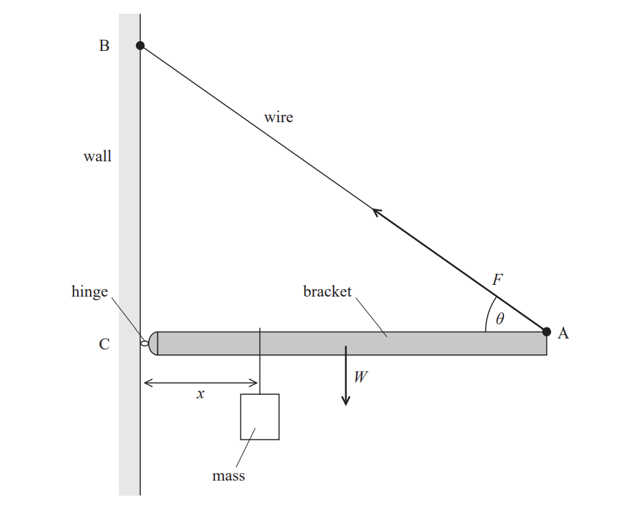

Describe how the student could determine *θ* using a metre rule.

### 3((b)) — 1 mark — command: describe — structured — from paper 2022 Jan · WPH13/01
Describe how the student could check that the bracket was horizontal.

### 3((c)) — 3 marks — command: comment — structured — from paper 2022 Jan · WPH13/01
The student adjusted the position of the mass and measured *x*. For each value of *x *the student made corresponding measurements of *F* using a force meter.

The results are shown in the table.

| ***x *****/ cm** | **Mean *****F***** / N** |
|---|---|
| 5 | 2 |
| 10 | 2.6 |
| 15 | 3.3 |
| 20 | 4.4 |
| 25 | 5.3 |
| 30 | 6.2 |
| 35 | 7 |
| 40 | 8.1 |
| 45 | 8.8 |

** **Criticise the recording of these results.

### 3((d)) — 5 marks — command: multiple — structured — from paper 2022 Jan · WPH13/01
The student plotted a graph of *F* against *x*, as shown.

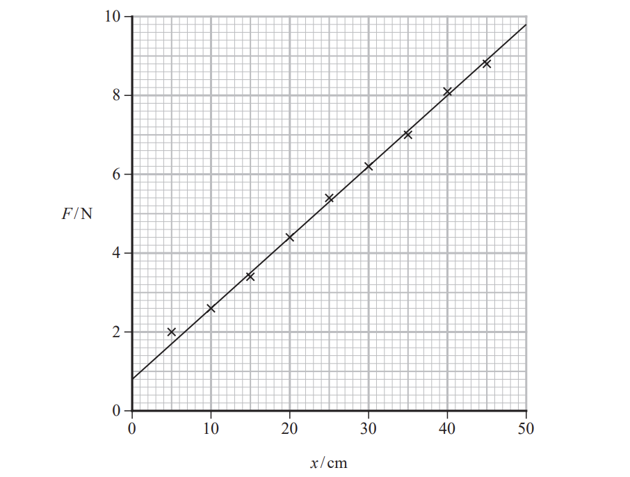

i) The relationship between *F* and *x* is

$F=\frac{mgx}{l\mathrm{sin}θ}+\frac{W}{2\mathrm{sin}θ}$

where

*l* is the length of the bracket

*m* is the mass hung from the bracket.

Determine a value for *W* using the graph.

θ = 42°

W = ................................ N**(3)**

ii) The value of *g* obtained from the graph is 9.64 m s–2.

The student concluded that the value of *g* obtained is accurate.

Evaluate the student’s conclusion.

**(2)**

## Q2 — medium — 13 marks · structured-questions

### 4((a)) — 9 marks — command: multiple — structured — from paper 2022 Jan · WPH13/01
A student investigated the resistance of some thin slices of silicon.

Each silicon slice had

- the same length *L*
- the same thickness *t*
- a different width *w*

Conducting strips were fitted to opposite ends of each silicon slice and connected to an ohmmeter, as shown.

The student measured values of w and corresponding values of resistance *R*.

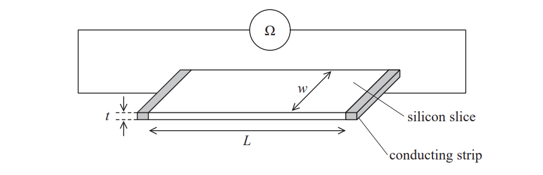

The table shows the student's measurements.

| ***w***** / mm** | ** *****R***** / MΩ** |   |
|---|---|---|
| 14 | 33.6 |   |
| 18 | 26.1 |   |
| 26 | 17.2 |   |
| 37 | 13.3 |   |
| 53 | 8.7 |   |

The relationship between *R* and *w* is

$R=\frac{ρL}{wt}$

where *ρ* is the resistivity of silicon.

i) Plot a graph of *R* on the *y*-axis against 1 / *w* on the *x*-axis. Use the additional column of the table for your processed data.

**(6)**

ii) Determine *t *using data from the graph.

*ρ* = 4.0 × 103 Ω m

*L* = 10.0 cm

**(3)**

### 4((b)) — 4 marks — command: multiple — structured — from paper 2022 Jan · WPH13/01
The student determined a value for *t*. She decided to measure the thickness of several silicon slices stacked together. She measured this thickness using a micrometer.

i) Explain why this method gives a value for *t* with low uncertainty.

**(2)**

ii) The value of* t* obtained using this method was 0.80 mm with an uncertainty of 2%.

Deduce whether this value is consistent with the value of *t* obtained from the graph.

**(2)**

## Q3 — medium — 11 marks · structured-questions

### 5((a)) — 7 marks — command: multiple — structured — from paper 2022 Jan · WPH13/01
A student carried out an experiment to compare the speed of sound in air and the speed of sound in wood. The student used a long piece of wood, a hammer and two microphones, as shown.

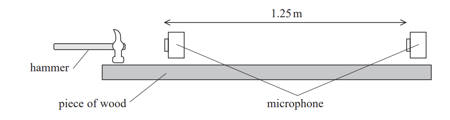

The microphones were connected to a 2-beam oscilloscope. The student hit the wood with a metal hammer producing a sharp sound that travelled through the air. The oscilloscope traces produced by the microphones and the time per division dial are shown.

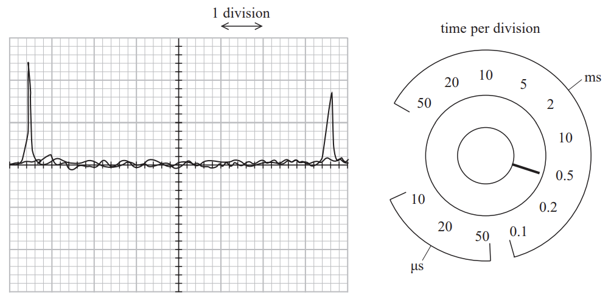

i) Determine the speed of sound in air.

distance between microphones = 1.25 m

Speed of sound = ................................ m s–1**(4)**

ii) The student then attached the microphones to the piece of wood so they detected the sound passing along the wood. The distance between the microphones was 1.25 m.

The student adjusted the dial on the oscilloscope to 20 μs per division to display the traces from the microphones. A teacher commented that this was not the correct setting.

Justify the teacher’s comment.

The piece of wood is made of oak. The speed of sound in oak is approximately 4000 m s–1.

**(3)**

### 5((b)) — 2 marks — command: explain — structured — from paper 2022 Jan · WPH13/01
The student tried the same experiment using a rubber hammer. The rubber hammer compressed as it hit the wood making a sound that lasted for a longer time.

Explain the effect that using the rubber hammer had on the accuracy of the time determined.

### 5((c)) — 2 marks — command: assess — structured — from paper 2022 Jan · WPH13/01
The student was given the following equation and data to find a value for the speed of sound in oak.

$v=\sqrt{\frac{E}{ρ}}$

Young modulus *E* of oak = 11.2 GPa ± 0.5 GPa

Density *ρ* of oak = 650 kg m–3 with an uncertainty of 3%

Assess which of these values was the more significant source of uncertainty in the value of the speed of sound.

## Q4 — medium — 10 marks · structured-questions

### 2((a)) — 2 marks — command: suggest — structured — from paper 2021 June · WPH13/01
A student determined the speed of sound in air using a standing wave.

The student used a tuning fork to create a sound wave in the column of air inside a plastic tube.

He placed the plastic tube into a measuring cylinder of water so he could adjust the length *l* of the column of air.

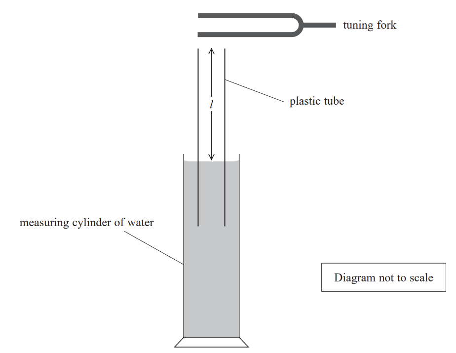

The student adjusted *l* until the loudest sound was heard, indicating that a standing wave had formed. He marked the water level on the plastic tube and measured *l*.

He repeated this process several times and recorded the results.

| ***l *****/ cm** | 18.4 | 18.0 | 19.2 | 19.4 | 19.2 |
|---|---|---|---|---|---|

Suggest two reasons for the variation in the lengths the student measured.

### 2((b)) — 4 marks — command: calculate — structured — from paper 2021 June · WPH13/01
i) Calculate the mean value of *l*.

Mean value of *l* = ...........................**(2)**

ii) Calculate the percentage uncertainty in *l*.

Percentage uncertainty = ...........................**(2)**

### 2((c)) — 2 marks — command: calculate — structured — from paper 2021 June · WPH13/01
The frequency of the tuning fork was 440 Hz. The standing wave produced had a wavelength 4*l*.

Calculate the speed of sound in air.

Speed of sound = ..........................

### 2((d)) — 2 marks — command: comment — structured — from paper 2021 June · WPH13/01
The percentage uncertainty in the student’s value for the speed of sound is equal to the percentage uncertainty in *l*.

The accepted value for the speed of sound in air is 343 m s−1.

Comment on whether the student’s value is consistent with the accepted value for the speed of sound in air.

## Q5 — medium — 14 marks · structured-questions

### 3((a)) — 3 marks — command: calculate — structured — from paper 2021 June · WPH13/01
A student determined the viscosity of a liquid. The student measured the force required to pull a small sphere upwards through the liquid at a constant speed.

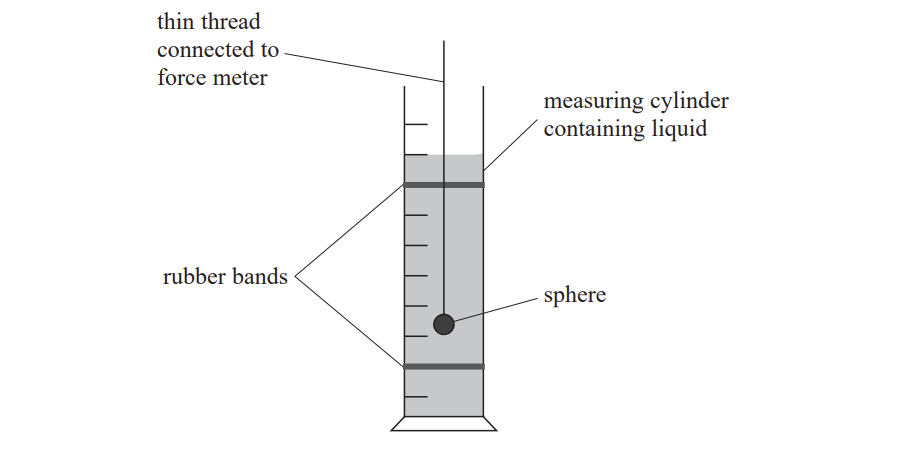

The student measured the diameter of the sphere using a micrometer.

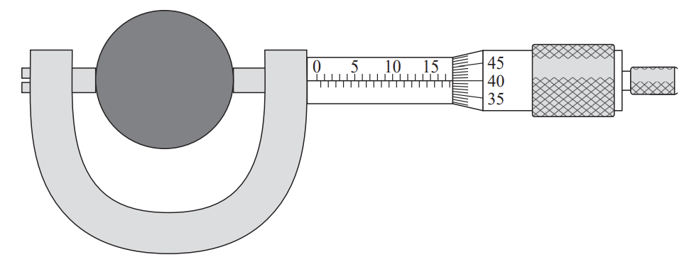

Calculate the percentage uncertainty in the diameter of the sphere shown on the micrometer.

Percentage uncertainty = .............................

### 3((b)) — 1 mark — command: state — structured — from paper 2021 June · WPH13/01
State one precaution that should be taken before using a micrometer.

### 3((c)) — 6 marks — command: multiple — structured — from paper 2021 June · WPH13/01
The student measured the value of force when the sphere was suspended and stationary in the liquid. The force meter used is shown in the photograph.

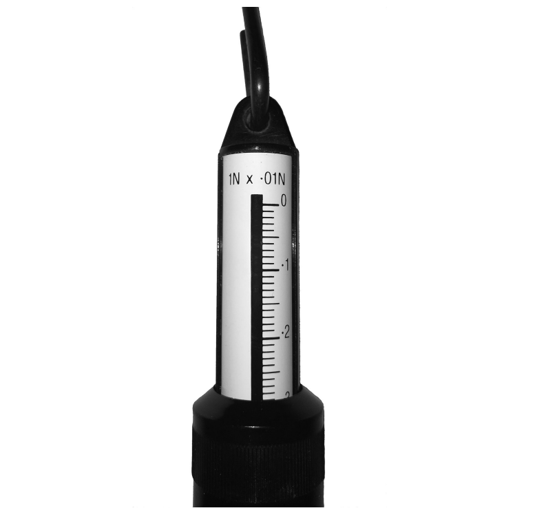

When the sphere was stationary the reading on the force meter was 0.20 N.

The student then moved the force meter upwards so that the sphere moved at a constant speed of 0.32 m s−1. The reading on the force meter was 0.29 N.

i) Explain why it was necessary to measure the force when the sphere was stationary and the force when the sphere was moving at constant speed.

**(3)**

ii) Calculate the viscosity *η* of the liquid.

*η* = ................................. Pa s**(3)**

### 3((d)) — 4 marks — command: assess — structured — from paper 2021 June · WPH13/01
The resolution of the force meter was 0.01 N.

The distance moved between the rubber bands was 25.0 cm.

The time measured was 0.78 s.

The percentage uncertainty in the measurement of the diameter was negligible.

Assess which of these measurements was the most significant source of uncertainty in the value of viscosity.

## Q6 — medium — 19 marks · structured-questions

### 4((a)) — 3 marks — command: explain — structured — from paper 2021 June · WPH13/01
The activation potential difference (p.d.) is the minimum p.d for photons to be emitted from a light emitting diode (LED). A student measured the activation p.d. for different LEDs.

The relationship between activation p.d. and wavelength is given by the equation

$eV_{a}=\frac{hc}{λ}+W$

where

*V*a is the activation p.d.

λ is the wavelength of the photons emitted by the LED

*W* is a constant representing the work done by an electron passing through an LED.

Explain why a graph of *V*a against 1/λ should give a straight line.

### 4((b)) — 12 marks — command: multiple — structured — from paper 2021 June · WPH13/01
The student recorded his values of activation p.d. and the manufacturer’s corresponding values of wavelength.

| **λ / 10****−7**** m** | ***V*****a**** / V** |   |
|---|---|---|
| 6.60 | 1.82 |   |
| 6.12 | 1.97 |   |
| 5.92 | 2.02 |   |
| 5.85 | 2.07 |   |
| 5.30 | 2.31 |   |
| 4.70 | 2.58 |   |

** **  i) Complete the table with the corresponding values of 1/λ.

**(2)**

ii) Plot a graph of *V*a on the *y*-axis against 1/λ on the *x*-axis.

**(5)**

iii) Determine the value of the Planck constant given by the student’s data.

Planck constant = ................................**(3)**

iv) The student states that the value for the Planck constant obtained from the graph is accurate.

Evaluate the student’s statement.

**(2)**

### 4((c)) — 4 marks — command: discuss — structured — from paper 2021 June · WPH13/01
Each LED in the investigation emits a narrow range of wavelengths.

The wavelength value stated by the manufacturer is the wavelength of light that is emitted with maximum intensity when the LED is at normal brightness.

The wavelength emitted at the activation p.d. is not equal to the manufacturer’s value.

Discuss whether this affects the accuracy of the value of the Planck constant obtained.

## Q7 — medium — 17 marks · structured-questions

### 4((a)) — 7 marks — command: multiple — structured — from paper Oct/Nov 2021 · WPH13/01
A student slid a small metal cube down a frictionless ramp. The cube collided with a fixed metal block at the bottom of the ramp.

The student released the cube from position X as shown in the diagram. After the collision, the cube rebounded to position Y.

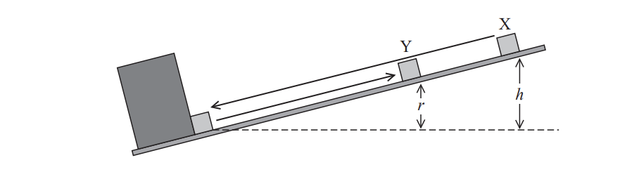

The student measured heights *h* and *r*. He then repeated the experiment using several different starting positions.

The student recorded his results in the table below.

| ***h***** / m** | ***r***** / m** |
|---|---|
| 0.20 | 0.11 |
| 0.25 | 0.137 |
| 0.30 | 0.16 |
| 0.35 | 0.19 |
| 0.40 | 0.217 |
| 0.45 | 0.24 |

i) Criticise these results.

**(2)**

ii) Plot a graph of *r* on the $y$-axis and *h* on the $x$-axis.

**(5)**

### 4((b)) — 5 marks — command: multiple — structured — from paper Oct/Nov 2021 · WPH13/01
i) Show that the velocity *u* of the cube immediately before the collision is given by

$u=\sqrt{2gh}$

**(2)**

ii) The coefficient of restitution *e* is given by the equation

$e=\frac{v}{u}$

where *v* is the velocity of the cube immediately after the collision.

Explain why the gradient of the graph is *e*2.

**(3)**

### 4((c)) — 3 marks — command: determine — structured — from paper Oct/Nov 2021 · WPH13/01
The student researched the range of values for the coefficients of restitution *e* of different metals.

stainless steel         0.63 < *e* < 0.93

cast iron                         0.3 < *e* < 0.6

Determine which of these metals the cube could be made from.

### 4((d)) — 2 marks — command: explain — structured — from paper Oct/Nov 2021 · WPH13/01
Explain how friction between the cube and the surface of the ramp would affect the value obtained for *e*.

## Q8 — medium — 11 marks · structured-questions

### 1((a)) — 2 marks — command: describe — structured — from paper Oct/Nov 2021 · WPH13/01
A student investigated the behaviour of a thermistor using the circuit shown in the diagram.

She heated the thermistor to 100°C and measured the potential difference $V$ across it.

She decreased the temperature *θ* and recorded further measurements of $V$ and *θ* until the temperature reached 10°C.

Describe how the student was able to vary the temperature *θ* of the thermistor for this investigation.

### 1((b)) — 2 marks — command: calculate — structured — from paper Oct/Nov 2021 · WPH13/01
The photograph shows the steady reading of $V$ on the voltmeter when the thermistor was at room temperature.

Calculate the percentage uncertainty in the value of $V$ shown.

Percentage uncertainty = ..........................................

### 1((c)) — 5 marks — command: multiple — structured — from paper Oct/Nov 2021 · WPH13/01
The student plotted a graph of her measurements of $V$ and *θ*.

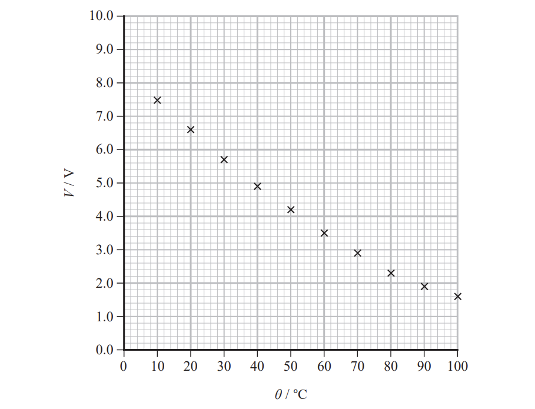

i) Estimate the value of $V$ for a temperature of 0°C.

**(2)**

ii) Calculate the resistance of the thermistor at a temperature of 0°C. ** **

Resistance = ......................................................**(3)**

### 1((d)) — 2 marks — command: determine — structured — from paper Oct/Nov 2021 · WPH13/01
The student suggested that $V$ is inversely proportional to temperature measured in kelvin.

Determine whether she is correct.
