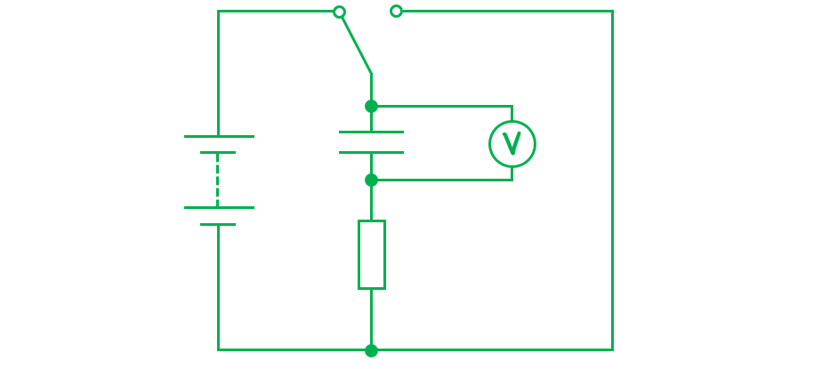
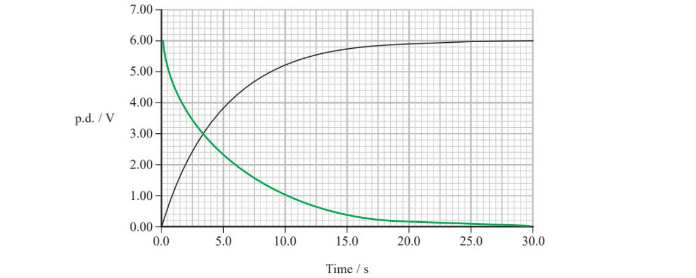
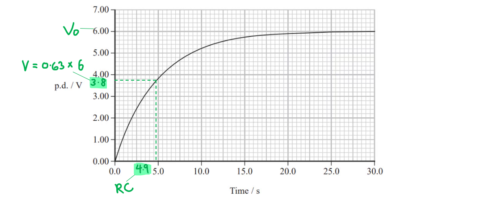
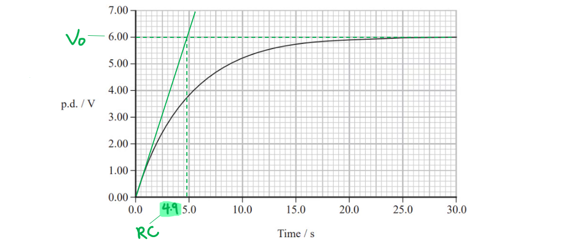
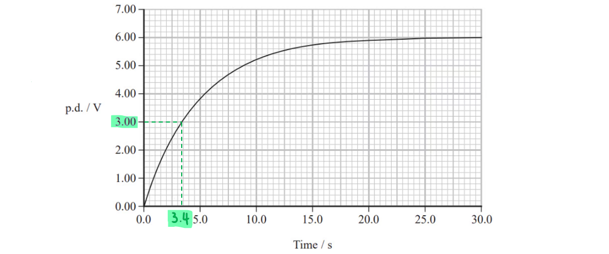
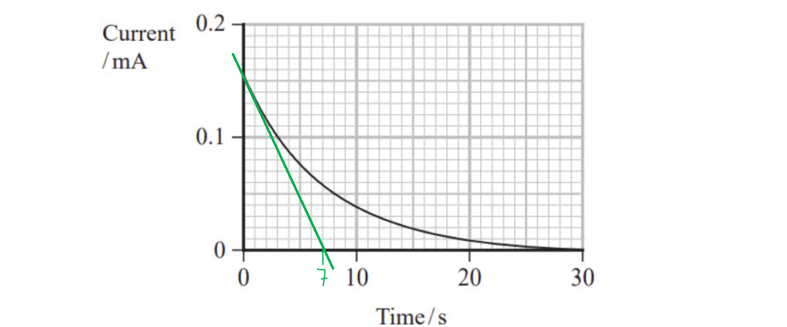
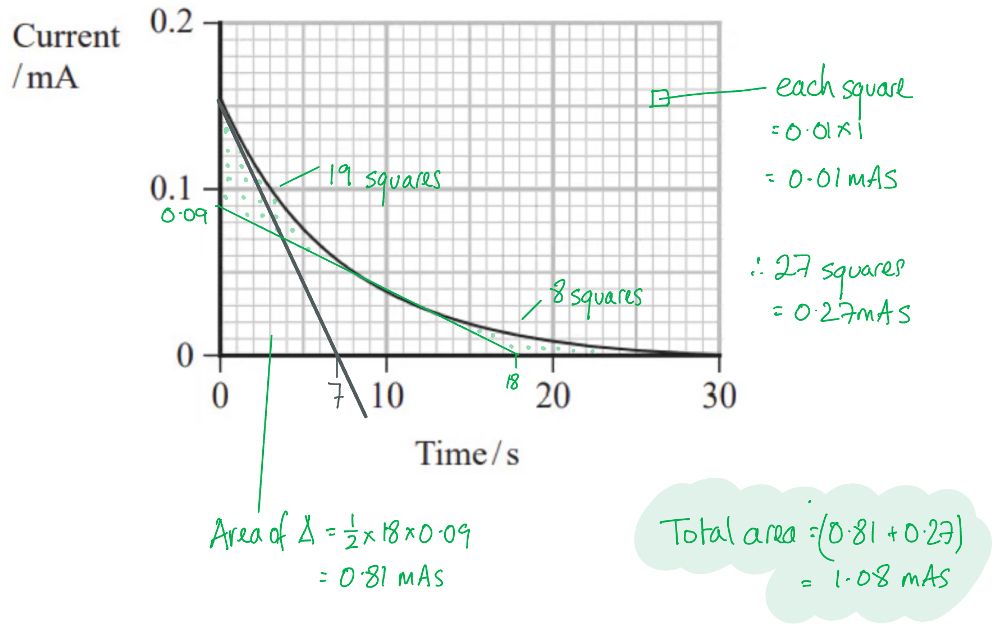
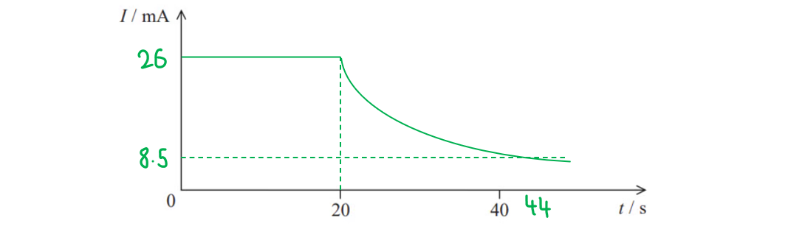

# Mark Schemes — Capacitance
**4. Further Mechanics, Fields & Particles** · Edexcel International A Level (IAL) Physics (YPH11)

## Q1 — medium — 16 marks · structured-questions

### 17((a)) — 3 marks
A suitable circuit for measuring p.d. across a capacitor is as follows:

- Battery in series with capacitor and resistor; **[1 mark]**
- Voltmeter / datalogger / oscilloscope in parallel with capacitor; **[1 mark]**
- Appropriate switching mechanism and discharge circuit completed; **[1 mark]**

**[Total: 3 marks]**

### 17((b)) — 13 marks
i) The variation of p.d. across the resistor while the capacitor charges is as follows:

- Exponential decline; **[1 mark]**
- Symmetry with charging curve, starts at 6.00 V, curves cross at 3.00 V; **[1 mark]**

ii) Derive the equation for p.d. when the capacitor is charging:

- Capacitor discharge with current:   $I=I_{0}e^{-\frac{t}{RC}}$
- p.d. across resistor:  $V_{R}=IR\RightarrowI=\frac{V_{R}}{R}$
- Maximum p.d. in circuit:  $V_{0}=I_{0}R$

Combine the above expressions to write an expression in terms of p.d. across the resistor, $V_{R}$:

- `V subscript R over R space equals space I subscript 0 e to the power of negative fraction numerator t over denominator R C end fraction end exponent space space space space space rightwards double arrow space space space space space V subscript R space equals space open parentheses R I subscript 0 close parentheses e to the power of negative fraction numerator t over denominator R C end fraction end exponent`
- $V_{R}=V_{0}e^{-\frac{t}{RC}}$ **[1 mark]**

Use energy conservation in a circuit to write an expression in terms of p.d. across the capacitor, $V$:

- In series:  total p.d. = (p.d. across resistor) + (p.d. across capacitor)
- $V_{0}=V_{R}+V\RightarrowV=V_{0}-V_{R}$ **[1 mark]**
- $V=V_{0}-V_{0}e^{-\frac{t}{RC}}$ **[1 mark]**

iii) Deduce the value of capacitance for the capacitor that was used:

- Resistance of the resistor, *R* = 330 kΩ = 3.3 × 105 Ω

Max **four** marks from **one** of the following methods:

**Method 1: Using the time constant & charging equation**

- When $t=RC$:  `V space equals space V subscript 0 open parentheses 1 space minus 1 over e close parentheses space equals space 0.63 V subscript 0` = 3.8 V **[1 mark]**
- From the graph: when $V$ = 3.8 V, *t* = time constant = 4.9 s **[1 mark]**

Determine the capacitance of the capacitor that was used:

- $C=\frac{t}{R}=\frac{4.9}{3.3\times10^{5}}$ = 1.48 × 10−5 F **[1 mark]**
- The capacitance was 1.5 × 10−5 F, therefore, the 15 μF capacitor was chosen; **[1 mark]**

**Method 2: Finding the time constant from a tangent**

- Tangent drawn to line at t = 0 s to intercept p.d. = 6.00 V line; **[1 mark]**
- From the graph: *t* = time constant = 4.9 s **[1 mark]**

Determine the capacitance of the capacitor that was used:

- $C=\frac{t}{R}=\frac{4.9}{3.3\times10^{5}}$ = 1.48 × 10−5 F **[1 mark]**
- The capacitance was 1.5 × 10−5 F, therefore, the 15 μF capacitor was chosen; **[1 mark]**

**Method 3: Using values from the graph with the charging equation **

- Corresponding values of *V* and *t* correctly read from graph; **[1 mark]**

  - e.g. from graph: when *V* = 3.0 V, *t* = 3.4 s

Convert the charging equation to its logarithmic form:

- Charging equation:  `V space equals space V subscript 0 space minus space V subscript 0 e to the power of negative fraction numerator t over denominator R C end fraction end exponent space space space space space rightwards double arrow space space space space space V space equals space V subscript 0 open parentheses 1 minus e to the power of negative fraction numerator t over denominator R C end fraction end exponent close parentheses`
- Take logs:  `ln space open parentheses V over V subscript 0 close parentheses space equals space ln space 1 space minus space open parentheses negative fraction numerator t over denominator R C end fraction close parentheses space space space space space rightwards double arrow space space space space space ln space open parentheses V subscript 0 over V close parentheses space equals space fraction numerator t over denominator R C end fraction`
- `C space equals space fraction numerator t over denominator R space ln space open parentheses V subscript 0 over V close parentheses space end fraction` **[1 mark]**

Determine the capacitance of the capacitor that was used:

- `C space equals space fraction numerator 3.4 over denominator open parentheses 3.3 cross times 10 to the power of 5 close parentheses space ln space open parentheses 6 over 3 close parentheses space end fraction` = 1.49 × 10−5 F **[1 mark]**
- The capacitance was 1.5 × 10−5 F, therefore, the 15 μF capacitor was chosen; **[1 mark]**

**Method 4: Using time to increase to half maximum p.d.**

- Corresponding values of $\frac{V_{0}}{2}$ and $t_{\frac{1}{2}}$ correctly read from graph; **[1 mark]**

  - e.g. same as graph in **Method 3**: when *V* = 3.0 V, $t_{\frac{1}{2}}$ = 3.4 s

Convert the charging equation to its logarithmic form:

- $\frac{V_{0}}{2}=V_{0}-V_{0}e^{-\frac{t_{\frac{1}{2}}}{RC}}\Rightarrow\frac{1}{2}=1-e^{-\frac{t_{\frac{1}{2}}}{RC}}$
- $\frac{1}{2}=e^{-\frac{t_{\frac{1}{2}}}{RC}}\Rightarrow\mathrm{ln}\frac{1}{2}=-\frac{t_{\frac{1}{2}}}{RC}$
- $C=\frac{t_{\frac{1}{2}}}{R\mathrm{ln}2}$**[1 mark]**

Determine the capacitance of the capacitor that was used:

- `C space equals space fraction numerator 3.4 over denominator open parentheses 3.3 cross times 10 to the power of 5 close parentheses space ln space 2 space end fraction` = 1.49 × 10−5 F **[1 mark]**
- The capacitance was 1.5 × 10−5 F, therefore, the 15 μF capacitor was chosen; **[1 mark]** *Acceptable range for RC = 4.5 s to 5.0 s* *Acceptable range for *$t_{\frac{1}{2}}$* = 3.0 s to 3.5 s* *Acceptable range for C = (1.4 to 1.5) × 10**−5** F when rounded to 2 s.f.*

iv) Calculate the charge on the fully charged capacitor:

- Charge on a capacitor:  *Q* = *CV*
- *Q* = (1.5 × 10−5) × 6.0 = 9.0 × 10−5 C **[1 mark]**
- Charge = 9.0 × 10−5 C **[1 mark]**

v) Calculate the energy stored by the fully charged capacitor:

- Energy stored by a capacitor: $W=\frac{1}{2}CV^{2}$  or  $W=\frac{1}{2}QV$  or  $W=\frac{Q^{2}}{2C}$
- *W* = 1⁄2 × (1.5 × 10−5) × (6.0)2 = 2.7 × 10−4 J **[1 mark]**
- Energy stored = 2.7 × 10−4 J **[1 mark]**

**[Total: 13 marks]**

## Q2 — hard — 11 marks · structured-questions

### 14((a)) — 2 marks
To determine whether the graph is consistent with the circuit diagram:

For the initial value of current on the graph, calculate using Ohm's Law:

- $R=\frac{V}{I}$
- $I=\frac{V}{R}=\frac{5.0}{33000}=1.52\times10^{-4}=0.15\mathrm{mA}$ **[1 mark]**

Draw a conclusion:

- (This is almost exactly the value shown on the graph)
- Therefore it is consistent; **[1 mark]**

**[Total: 2 marks]**

### 14((b)) — 2 marks
To explain how the current on ammeter A2 would vary over the same time interval:

- The current would vary with time in the <u>same</u> way as on ammeter <u>A</u><u>1</u>; **[1 mark]**
- Because (current is same everywhere) in a <u>series circuit</u>; **[1 mark]**

**[Total: 2 marks]**

- *Most students in the exam found it difficult to get any marks at all for this question, and most missed the second point - that this is a series circuit.*
- *The capacitor changes the look of the circuit, and is probably what confused students, but it is still a case of current in series.*
- *You will only be tested on **what you have studied**, so when in doubt fall back on asking 'what could affect the outcome'? You know about the differences between current in series and parallel circuits, so one of these is a likely explanation.*

### 14((c)) — 3 marks
To determine the capacitance of the capacitor using a graphical method:

**Method 1: calculate with two corresponding values from the graph:**

Select values from the graph:

- *I*0 = 0.152 mA (from part (a))
- *I* = 0.04 mA **and ***t* = 10 s; **[1 mark]**

Use the appropriate capacitor discharge equation:

- $I=I_{0}e^{-t/RC}$
- $\mathrm{ln}I=\mathrm{ln}I_{0}-\frac{t}{RC}$
- `C space equals fraction numerator negative t over denominator R cross times open parentheses ln space I space minus space ln space I subscript 0 close parentheses end fraction space equals space fraction numerator negative 10 over denominator 33 space 000 cross times open parentheses ln space 0.04 space minus space ln space 0.152 close parentheses end fraction`
- $C=2.27\times10^{-4}F$ **[1 mark]**

**                                                            **

**Method 2: Draw an initial tangent to curve and determine the *****t-*****intercept:**

- When current = 0, *T* = 7.0 s (answer in range 0.65 - 0.75 s); **[1 mark]**

Calculate using the equation for time constant:

- $T=RC$
- $C=\frac{T}{R}=\frac{7.0}{30000}=2.3\times10^{-4}C$ **[1 mark]**

**[Total: 3 marks]**

> *For method 1:*

- *This calculation is an example of the working. You may have chosen different corresponding values from the graph.*
- *It is the method and the final answer which get the marks.*
- *Your answer must be in the range 2.0 - 2.3 × 10**-4** F.*

> *For method 2:*

- *Your answer must be in the range 2.0 - 2.3 × 10**-4** F.*

### 14((d)) — 2 marks
To determine stored charge:

**Method 1: Find the area under the graph:**

- Clear attempt to find area under curve (either marked on graph or as a calculation); **[1 mark]**
- *Q* = 1.1 mC; **[1 mark]**

**Method 2: Calculate using the capacitor equation:**

- `Q space equals space C V space equals space open parentheses 2.27 cross times 10 to the power of negative 4 end exponent close parentheses cross times 5.0` **[1 mark]**
- *Q* = 1.1 mC; **[1 mark]**

**[Total: 2 marks]**

### 14((e)) — 2 marks
To determine the maximum energy stored by the capacitor

Use an equation for energy stored in a capacitor:

- $W=\frac{1}{2}QV$ **or **$W=\frac{1}{2}CV^{2}$ **or **$W=\frac{Q^{2}}{2C}$

Calculate:

- `W space equals space 1 half space cross times open parentheses 1.1 cross times 10 to the power of negative 3 end exponent close parentheses cross times 5` **or**** **`W space equals space 1 half space open parentheses 2.27 cross times 10 to the power of negative 4 end exponent close parentheses cross times 5 squared` **or **`W space equals space fraction numerator open parentheses 1.1 cross times 10 to the power of negative 3 end exponent close parentheses squared over denominator 2 cross times open parentheses 2.27 cross times 10 to the power of negative 4 end exponent close parentheses end fraction` ** [1 mark]**
- $W=2.8\times10^{-3}J$** [1 mark]**

**[Total: 2 marks]**

- *Many students in the exam forgot units in parts of this question, or got their units mixed up with quantities (for example, giving the units of charge as Q).*

  - *Capacitance is a difficult topic, partly because it's very new, and not something you can easily understand based on your lived experience.*
  - *However, units are still crucial. Take a moment to check. Use the units given for constants in the data booklet if you need some reassurance.*

## Q3 — hard — 9 marks · structured-questions

### 14((a)) — 3 marks
If the switch is opened for a short time, the circuit can maintain power to the electronic controller because:

- The capacitor stores charge / energy; **[1 mark]**
- The capacitor discharges through resistor / controller **OR **the p.d across the resistor / controller is maintained by the capacitor; **[1 mark]**

Any **one** from:

- The p.d. across the capacitor will remain high enough to operate the controller for a short time; **[1 mark]**
- The current in the circuit will remain high enough to operate the controller for a short time; **[1 mark]**
- The charge / energy stored is limited and will only last for a short time; **[1 mark]**

**[Total: 3 marks]**

### 14((b)) — 2 marks
Calculate the time taken for the capacitor to fall to *V* = 4.0 V:

List the known quantities:

- Capacitance, *C* = 47 mF = 47 × 10−3 F
- Resistance, *R* = 470 Ω
- Initial p.d., *V**0* = 12.0 V
- Final p.d., *V* = 4.0 V

Use the capacitor discharge equation for V:

- $V=V_{0}e^{-\frac{t}{RC}}$
- $\mathrm{ln}V=\mathrm{ln}V_{0}-\frac{t}{RC}$
- `ln space 4 space equals space ln space 12 space minus fraction numerator t over denominator 470 cross times open parentheses 47 cross times 10 to the power of negative 3 end exponent close parentheses end fraction` **[1 mark]**
- `t space equals space 470 cross times open parentheses 47 cross times 10 to the power of negative 3 end exponent close parentheses cross times ln space open parentheses 12 over 4 close parentheses`
- *t* = 24.3 s **[1 mark]**

**[Total: 2 marks]**

- *You **must** be confident with rearranging the exponential decay equations to make any of the variables the subject*

  - *Make sure you understand each step of the algebra above*
  - *If not, take a look at the revision notes or revise this from the maths course*

### 14((c)) — 4 marks
Sketch the graph of current vs time:

- Horizontal line of non-zero $I$ from 0 to 20 s; **[1 mark]**
- (Initial value of) $I_{0}$ = 26 mA; **[1 mark]**
- (From 20 s) approximate exponential decrease; **[1 mark]**
- Approximately drops to ⅓ (8.5 mA) after about 44 s (24 s after the start of decrease); **[1 mark]**

*Example of calculation:*

- At *t* = 20 s:      $I_{0}=\frac{V_{0}}{R}=\frac{12}{470}$ = 0.026 A = 26 mA
- At *t* = 44 s:      $I=\frac{V}{R}=\frac{4}{470}$ = 0.0085 A = 8.5 mA

**[Total: 4 marks]**

- *When asked to sketch graphs, take a look at all the previous subparts for any missing values that you need*
- *Values are expected to be noted on the axis, even for a 'sketch' question if values can be calculated*

## Q4 — hard — 12 marks · structured-questions

### 1() — 7 marks
> **[mark-scheme]**
> (i) When the switch is connected to position X:
> 
> - Initially, the current in the circuit is a maximum **[1 mark]**
> - (As the capacitor charges) the current in the circuit decreases because the p.d. across the capacitor increases / the p.d. across the resistor decreases **[1 mark]**
> - When the capacitor is fully charged, the current is zero because the p.d. across the resistor is zero
> **OR**
> The capacitor is fully charged when the p.d. across the capacitor equals the p.d. across the supply, and the current is zero **[1 mark]**

(ii) To complete the graph to show how the charging current varies with time:

- List the known quantities:

  - Supply p.d., $V=12\text{V}$
  - Resistance in charging circuit, $R=15\text{kΩ}=15\times10^{3}\text{Ω}$
  - Capacitance, $C=2200\text{μF}=2200\times10^{-6}\text{F}$
- Calculate the maximum value of current

$I=\frac{V}{R}=\frac{12}{15\times10^{3}}=8.0\times10^{-4}\text{A}=0.80\text{mA}$

- Calculate the time constant and time to decrease to near-zero current:

`tau space equals space R C space equals space open parentheses 15 cross times 10 cubed close parentheses open parentheses 2200 cross times 10 to the power of negative 6 end exponent close parentheses space equals space 33 text  s end text` **[1 mark]**

- Sketch the graph and include values on both axes

**[3 marks]**

> **[mark-scheme]**
> 1 mark for a curve of decreasing negative gradient beginning at a positive current value
> 
> 1 mark for marking the correct initial current ($0.80\text{mA}$)
> 
> 1 mark for use of $τ=RC$ ($33\text{s}$)
> 
> 1 mark for a correct time marked, e.g.
> 
> - time to decrease to about $I_{0}/3$ ($0.29\text{mA}$) = $33\text{s}$ ($RC$)
> - time to decrease to about $I_{0}/2$ ($0.40\text{mA}$) = $23\text{s}$ ($0.7RC$)
> - time for full discharge = $165\text{s}$ ($5RC$)

### 2() — 2 marks
To determine the ratio of time constants for a 99% change:

- List the known quantities:

  - Resistance in charging circuit, $R_{c}=15\text{kΩ}$
  - Resistance in discharging circuit, $R_{d}=250\text{kΩ}$
- For the same percentage change in charge, the number of time constants passed is the same:

It takes `tilde 5 R C` to reach 99% **[1 mark]**

- Substitute the resistance values into the ratio of time constants:

$\frac{τ_{d}}{τ_{c}}=\frac{5R_{d}C}{5R_{c}C}=\frac{R_{d}}{R_{c}}$

$\frac{τ_{d}}{τ_{c}}=\frac{250}{15}=16.7\approx17$ **[1 mark]**

> **[mark-scheme]**
> 1 mark for identifying the number of time constants passed is the same for the same percentage change
> 
> 1 mark for a correct final answer that rounds to $\text{17}$
> 
> - Must be shown to at least 1 more significant figure than the given value

### 3() — 3 marks
To deduce whether the LED stays on for at least $15\text{minutes}$:

- List the known quantities:

  - Initial p.d., $V_{0}=12\text{V}$
  - Minimum p.d., $V=2.0\text{V}$
  - Resistance in discharging circuit, $R=250\text{kΩ}=250\times10^{3}\text{Ω}$
  - Capacitance, $C=2200\text{μF}=2200\times10^{-6}\text{F}$
- Use the capacitor discharge equation to determine the time to reach $V=2.0\text{V}$

$\mathrm{ln}V=\mathrm{ln}V_{0}-\frac{t}{RC}$

`t space equals space minus R C space ln open parentheses V over V subscript 0 close parentheses`

`t space equals space minus open parentheses 250 cross times 10 cubed close parentheses open parentheses 2200 cross times 10 to the power of negative 6 end exponent close parentheses cross times ln open parentheses fraction numerator 2.0 over denominator 12 end fraction close parentheses` **[1 mark]**

$t=985.5\text{s}$

$t=\frac{985.5}{60}=16.4\text{minutes}$** [1 mark]**

- Write a concluding statement:

The circuit meets the requirement as the LED stays switched on for $16.4$minutes, which is $1.4$ minutes longer than the minimum time **[1 mark]**

> **[mark-scheme]**
> 1 mark for use of $\mathrm{ln}V=\mathrm{ln}V_{0}-t/RC$
> 
> 1 mark for a correct discharge time ($16.4\text{minutes}$)
> 
> - Accept answer in seconds ($986\text{s}$ or $985.5\text{s}$)
> 
> 1 mark for an explicit comparison of values and a clear conclusion
> 
> - Expected conclusion: the minimum time requirement is met

## Q5 — easy — 1 marks · multiple-choice-questions

### 7() — 1 marks
**Correct answer: C** — 

**Final answer:** **The correct answer is ****C**** because:**

- Since potential difference is equal to $V=\frac{W}{Q}$, the work done by the battery is equal to $W=QV$
- Energy stored by a capacitor is equal to $W=\frac{1}{2}QV$
- These correspond to row **C**
